# 48小时 VLOG · 在城市谋生谋爱的你，诗意不在远方，就在眼前

*Geng Yue · Travel Stories*

一周前，我接受了一次「48小时挑战」。

用短到一个周末的时间，在你熟悉的城市，玩出一场怦然心动的旅行体验。

期间故事，用一支VLOG记录下来。

(这个春天我唯一亲自拍摄/剪辑/出镜的VLOG)

「一键重启 」逃离城市，其实并不太容易做到，我们大多数人还要在城市里谋生谋爱。

**我们能做的，就是从习以为常的生活轨迹中抽离出来，去探索，去发现，在日复一日和枯燥平凡之外，那个令人惊喜的故事，和自己。 **

并不是每一场旅行都需要一张机票。

**生活就是当下，分分秒秒。 诗意不在远方，就在眼前。**

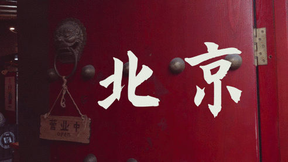

***01***

**三里屯.**

故事从北京三里屯的一间爱彼迎Plus开始。

「三里屯像钢筋水泥里的小小理想国。无论你多怪异、多叛逆、多不合群。

在这里的每种状态都是自由而丰盛的，**我们可以活出自己喜欢的模样**。」（Stey）

我去过至少几十次，

**却第一次发现自己可以做个幸福的旅行者。**

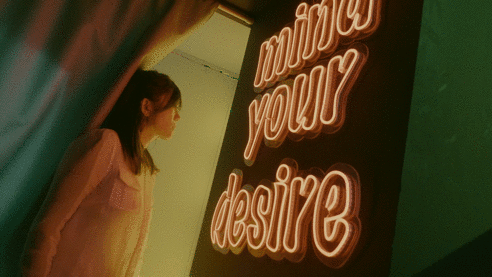

在周末醒来，打开冰箱看到房东准备的饮料，我在餐厨一体的空间吃了一顿健康Brunch。

下楼漫步十分钟，就能体验到北京的一万口新鲜。

去看了奇境公寓展览，参与光怪陆离的艺术实验，沉浸在世界各地的超现实脑洞和色彩。

避开熙攘的时尚潮人，经过流光溢彩的橱窗，从隐蔽的入口，穿过一个个「秘密花园 」。

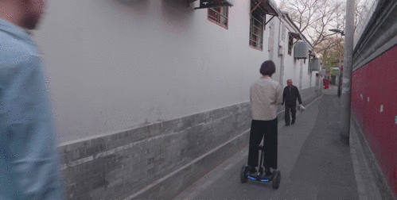

春日朗朗，在创意四合院，听了一场音乐会。古筝、笛子、钢琴的琴声袅袅中，领略到了胡同的诗意。

遇见了做复古家居店的爱彼迎房东，才华横溢的音乐旅行家Closer和画帛乐团，从西班牙回来的甜点师Xiao……

**都给我了超多的惊喜：**世界上，美好的人可真多。

***02***

**春日野餐.**

我邀请了在三里屯生活的Hellen姐，一起参与这次挑战。

我曾是她的Airbnb房客，成为朋友后，发现她很擅长“随心而发”呈现出“美”。不论是一件长裙，一间民宿，或是一次出行。

就有了这次**高光时刻**——**春日野餐Picnic。**

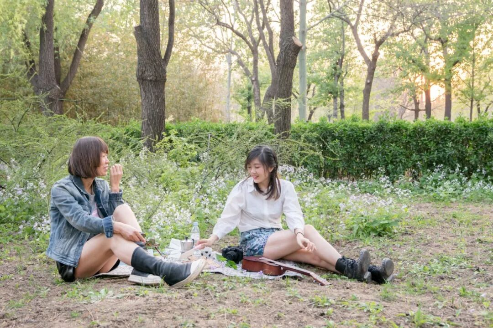

因为我入住的是**惊喜房源**，可以**解锁一辆隐藏的MINI汽车**，自由兜风。

拿到Mini Cooper车钥匙的那天下午，我临时起意说，**「要不咱们去野餐Picnic？**」

在北京住了这么久，曾产生过野餐的念头，但高楼大厦，你去哪找一片幽静的绿地去？

没想到Hellen瞬间接过话说，「我想起来一地儿，很安静，从三里屯开车过去就10分钟。 」

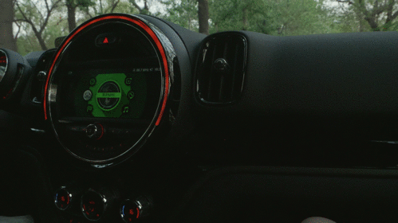

说走就走。我们在民宿里带了几只精致的杯子，漂亮的小毯子，就有了你们在VLOG里最喜欢的那几个野餐镜头。

**春风明媚。日光落下前的一小时。可遇不可求的灵光乍现。**

「我很喜欢黄昏时分。金色的阳光洒在肩头。

虽然一闪而过，但是片刻即浪漫。

**春光易逝，但我们在春光里快乐过。哪怕就是那么一瞥，发光的那么一小会儿，却回馈**给你一种幸福感，会滋养你。 」

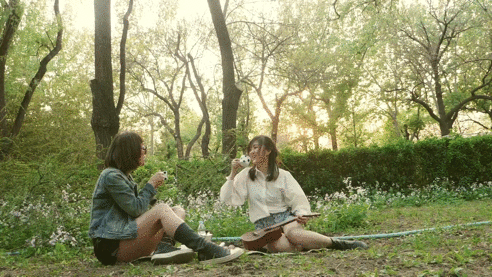

这次短暂探寻，有些震撼到了我们两个“在路上”的旅行者。

**以前我心中的旅行，走得越远越好，离开我所生活的城市才叫旅行。其实它不用那么强调距离，而是关乎一颗心，对美的感受力。**

以下的内容来自我这次的思考，和我们的对话聊天。

好久不见，整理给专门来看我的亲爱的你。

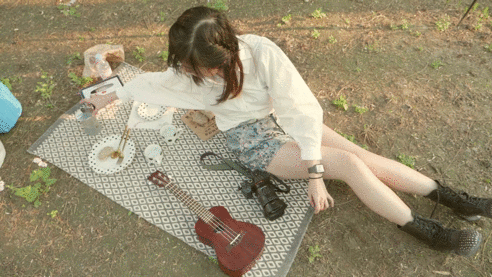

***03.忙.**

我们好像一直在忙。特别是在北京，很容易每天忙得团团转，拔剑四顾心茫然。

以至于当你忙完快一年时，你都不知道你在忙什么，想起来都是碎片，感觉时间过得特别快，一片混沌。

我最近听的一个播客节目里，主持人问读者：

**「现在，我们停下来几秒，回忆一下过去四个月有哪几件记忆点的事情？**

如果，你觉得2019年过去4个月，看不到什么东西。

是因为，**你的生活当中，没有任何真正的新鲜的刺激**，使得你的这一年，跟前一年，是没有任何差别的。

因为**没有什么差异化的东西在你的视野里头。」**

但是惯性/习惯化让你无法刹车。

***04***

**时间.**

我们都有看过一句话。

**人的一辈子只有一万多天。人与人的不同在于，你是真的活了一万多天，还是仅仅生活了一天，却重复了一万多次。**

我被这句话打动过。但说实话每天的生活，都基本上进入一个固定的流程。

**每天忙的事儿，操心的东西，基本上是同质化的。**

***05***

**视野微出轨.如何摆脱重复的日常生活带来的枯竭感？**

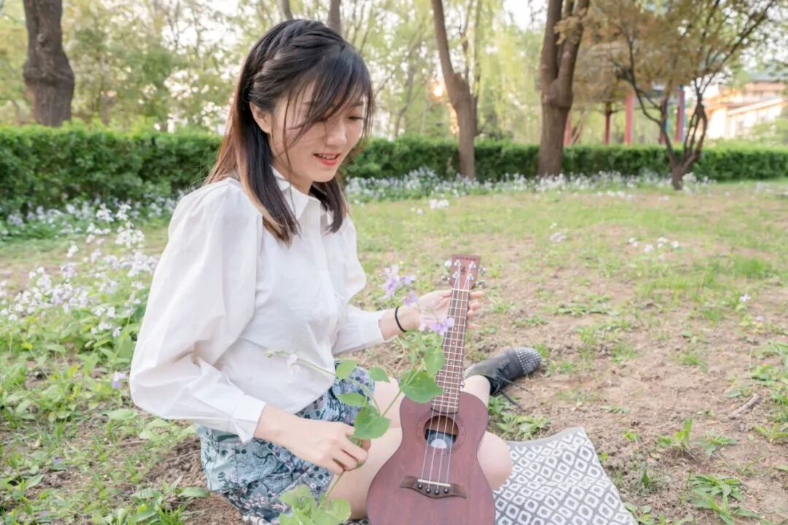

「视野微出轨」当然不是常规意义上的「出轨」，

**而是你应该从自己习以为常的生活抽离出来， 看看那些熟悉的陌生地。试试在正常的轨道上行走完全看不到的风景。一周或者一个月，要有一次跟平常生活完全不同的「微出轨」。**

可以是去本市坐最拥挤的地铁，可以是走不同的路。

可以是去吃一家新餐厅，可以是享受黄昏下的树荫。

*这个精华观点就是来自我听的那个podcast节目《东吴相对论》， 推荐你去听听。

***06***

**向内探索.世界上还有无数待开发的美好**

我之前的旅行更多的是在外面探索，而这次在北京，是内在的探索。

在三里屯发现有那么多店我竟然不知道。

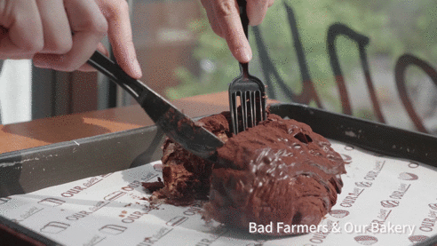

经过一个工业风咖啡馆，让我想起纽约布鲁克林，

走过白色穹顶花园，仿佛置身摩洛哥。

可以上楼去吃墨西哥菜，下楼吃西班牙海鲜饭。

也能品尝到西北面条的淳朴香味，泰国夜市的咖喱汤汁，

在美国禁酒令风格的地下密室里微醺。

「你其实在味蕾上可以环游世界。

有那么多的美好。我为什么要去吃那么难吃的外卖。浪费了那么时光！」

**近就是远。境由心生。**

***07***

**抽离出来.**

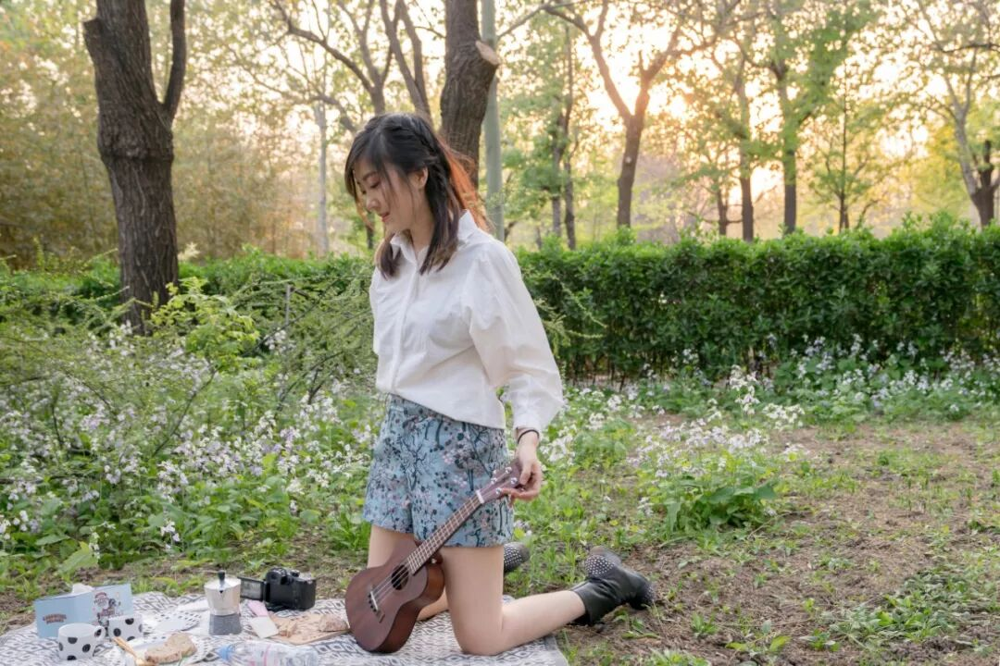

我在旅行中的改变，实际上真正发生的改变，都是影响式的改变。通过一个很小的点，逐渐引发那种想要变好的改变，甚至是蝴蝶效应。

**「出去一下的**好处是，帮我们从僵化的思维里走出来**，从原来的固定的节奏抽离。」**

很多时候你发现，到了一个新的环境，你对**自己平时生活和工作的圈子**的看法就变了。

让我们**重新审视自己，走出困境，放下drama。很多东西就想通了。**

***08***

**创作手记.这次VLOG的创作，我也给自己了一个挑战。**

在48小时内，我用了一台从未用过的相机和稳定器。

自学了剪辑软件和调色软件，从零开始，从排斥到熟练，逐一解锁。

从第一个按钮的生疏，到导出一支完整的片子。背后也有我N个小时的真诚摸索。

**我惊喜地发现，原来我都会。你自己就是你最大的宝藏，只是等待着你去发现。**

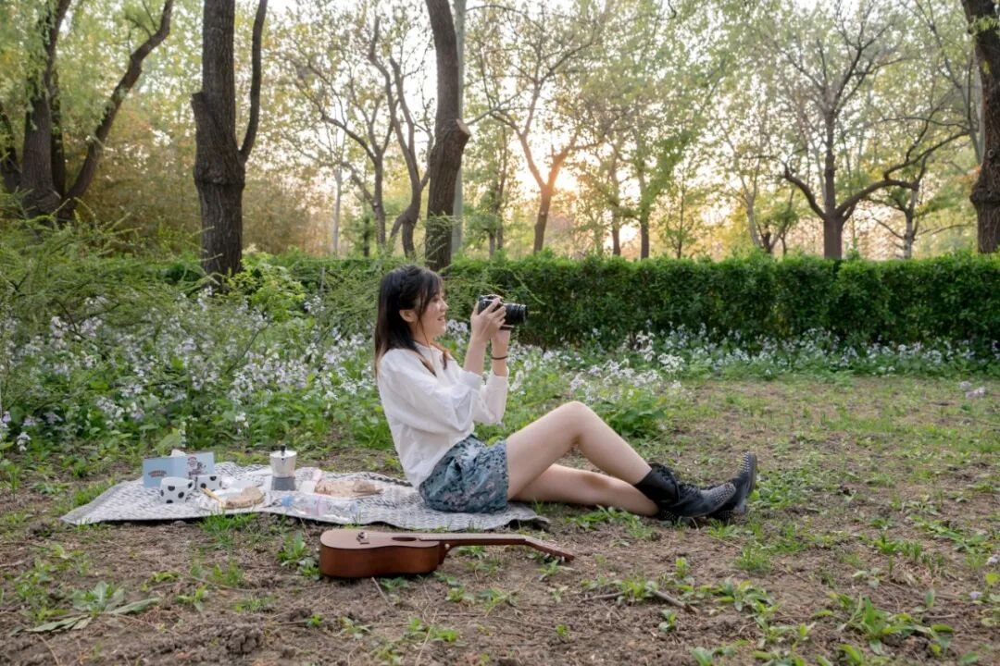

**「**我们每一个人如果有机会的话，去解锁一下其他的生活。

**也许这个生活，就在你身边，但它是个平行宇宙，既近且远的这个状态，**

如果我们有机会能进入之后，

**其实你会打开你的心量，打开你的感知系统，会让你的生活的闪光越来越多，让你变得更加丰富，而不是活在日常的每一天习惯当中。」**

***09***

**安利.**

这次入住Airbnb Plus + 喜提 MINI Cooper

在11个城市里都可以随机解锁惊喜

👉 位于三里屯的**爱彼迎Plus 法式复古公寓**

https://www.airbnb.cn/rooms/plus/22350049

**「其实只要有心，只要想去追求美， 你的灵魂就是时时刻刻都是有些东西在的。**」

我真诚地将这句话提亮。

送给每位一起点亮这次旅行的朋友，你们值得。

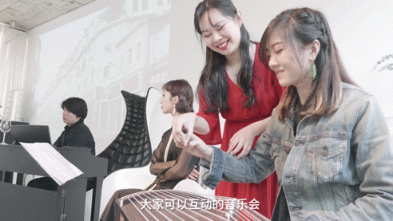

**👉 去私享的四合院听一场音乐会 关于电影、故事、旅行**

与音乐旅行家Closer和她乐团的朋友们互动

https://www.airbnb.cn/experiences/178098

👉 跟着地道热情的Xiao

** 在三里屯跟朋友们开启逛吃之旅 **

https://www.airbnb.cn/experiences/295716

***10***

**互动.**

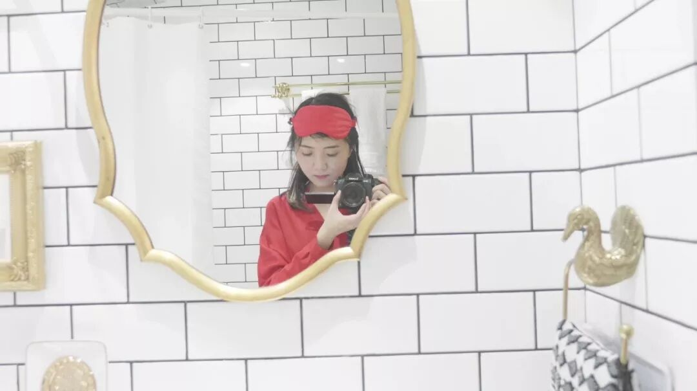

> Airbnb 合作 · 北京三里屯 Airbnb Plus · 2019-04-30
