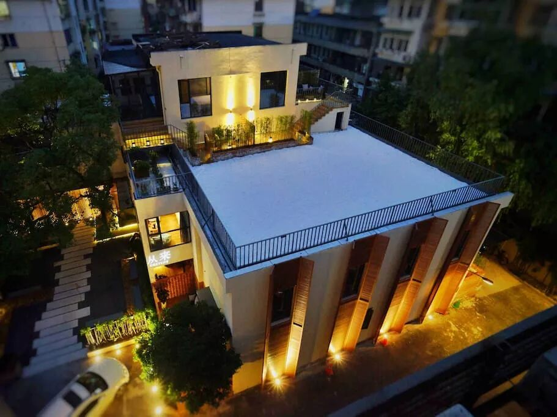
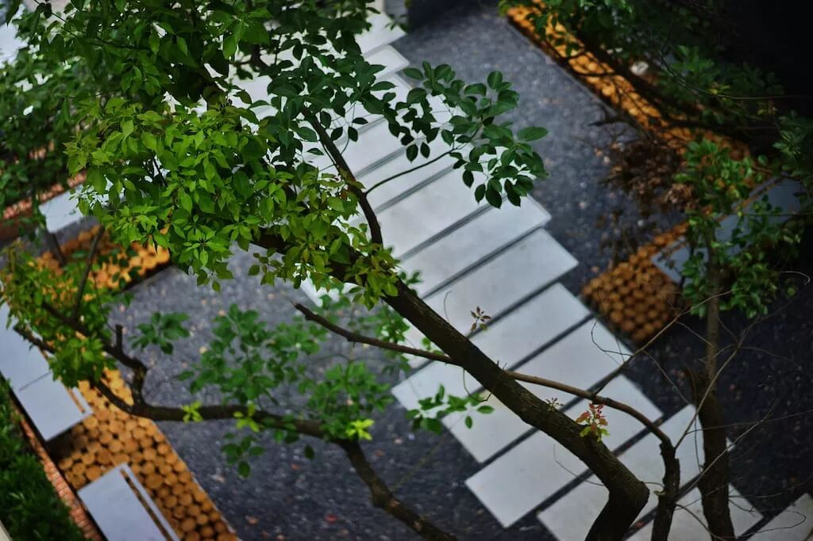
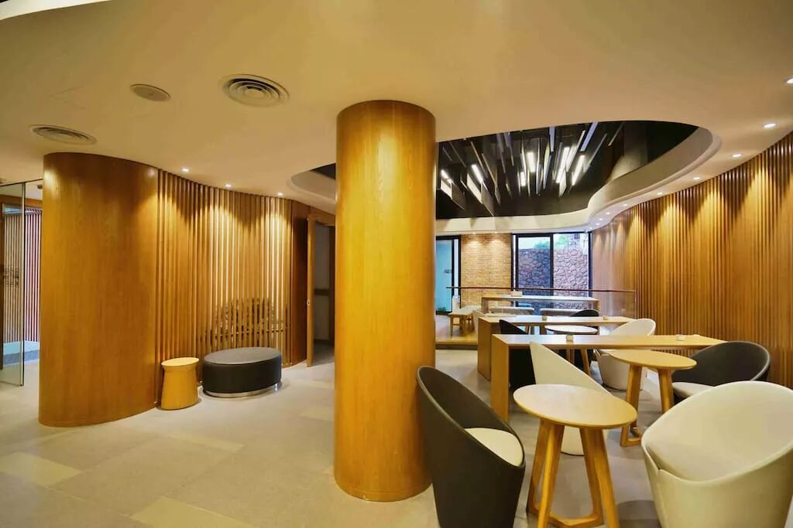
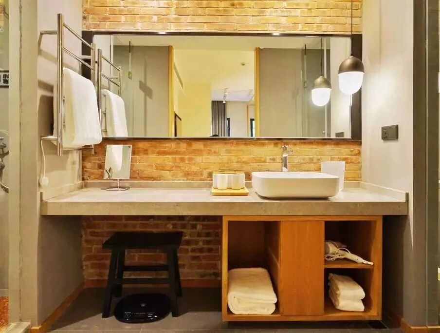

# 梦想总要有，万一成真了呢？

*Geng Yue · Travel Stories*

2019 年春节，与 Airbnb 一起，邀请 JUSTGO 的读者免费住进杭州西湖边的小院「从来」。

这个西湖小院，名字叫【从来】，

一个小而美的城市生活空间，闹中取静，处在繁华市区，却又远离喧嚣。

"

酒店的每间房都是**设计师精心设计并独具特色**，

只希望为大家创造舒适的高品质入住体验。

Mlily奢华睡床 / Knoa's生态地板 /

智能门锁 / 灯光根据人体需求智能感应 /

可90度移动海量片源乐视超级液晶电视 /

blueair的空气净化器 /

scishare胶囊咖啡机 /

欧苏丹洗护沐浴用品等

"

早餐的选材都是营养搭配，食材新鲜，纯手工制作而成的,

浸透着房主对每一位客人的在乎与关爱。

/ 距离西湖景区车程10分钟

/ 西溪湿地车程15分钟

点击查看房源详情
**● 民宿清单**

之前我写了一些民宿故事，

也希望能提供好用方便的旅行工具。

1月份我和Airbnb合作了一份民宿清单，精选爱彼迎新年独家民宿，

目前整理出了近20篇👇

点击可以查看**这份订房妙用指南，优中选优的质量。**

北京优雅轻奢 (https://mp.weixin.qq.com/s?__biz=MzA3ODU4OTgzNg==&mid=2654408022&idx=1&sn=9288682f297fb3ea57b71bc4bd09e5e7&scene=21#wechat_redirect) 重庆绝佳视野 (https://mp.weixin.qq.com/s?__biz=MzA3ODU4OTgzNg==&mid=2654408145&idx=1&sn=56c0f37debb48c4e5782b466bc6f2800&scene=21#wechat_redirect)

深圳秘境民宿 (https://mp.weixin.qq.com/s?__biz=MzA3ODU4OTgzNg==&mid=2654408094&idx=1&sn=2b78f233ec3213054db19a9d99527eba&scene=21#wechat_redirect) 杭州气质民宿 (https://mp.weixin.qq.com/s?__biz=MzA3ODU4OTgzNg==&mid=2654408092&idx=1&sn=280c4cdd140e7acfc6f9fe3036ed08f0&scene=21#wechat_redirect)

好玩的妙趣屋 (https://mp.weixin.qq.com/s?__biz=MzA3ODU4OTgzNg==&mid=2654408158&idx=1&sn=04e80b628a953bb85cd81686a4154823&scene=21#wechat_redirect) 匠心文艺民宿 (https://mp.weixin.qq.com/s?__biz=MzA3ODU4OTgzNg==&mid=2654407990&idx=1&sn=7abe988904d68d26c8d6e29b90352e6c&scene=21#wechat_redirect)

点击 阅读原文 ，可以优先看

北京精品小院 | 青山周平设计 | 大理白族民居 | 洱海边的蓝色 | 秀丽蓉城风景房 | 南京童话屋 | 西安特色亲子 | 爱彼迎员工特别推荐榜……

我给你们整理好了一个目录。特别方便。

> Airbnb 合作 · 杭州 · 2019-02-04
