# 日本唯一的房车 Airbnb · 酷酷的“老司机”

*Geng Yue · Travel Stories*

**Don't plan anything, Just come**

❄

H o k k a i d o

新年的第一天，Yas发给我他正在北海道用手机拍的照片，说，“悦，新年快乐”。

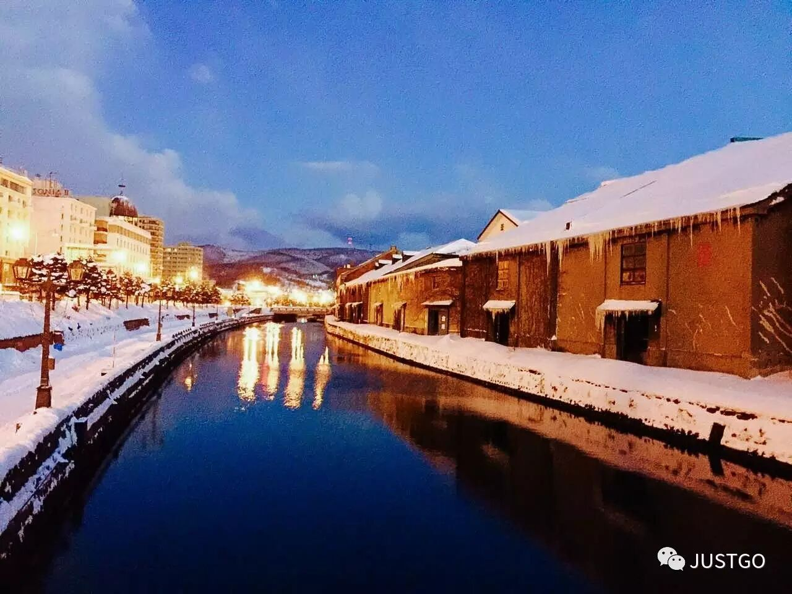

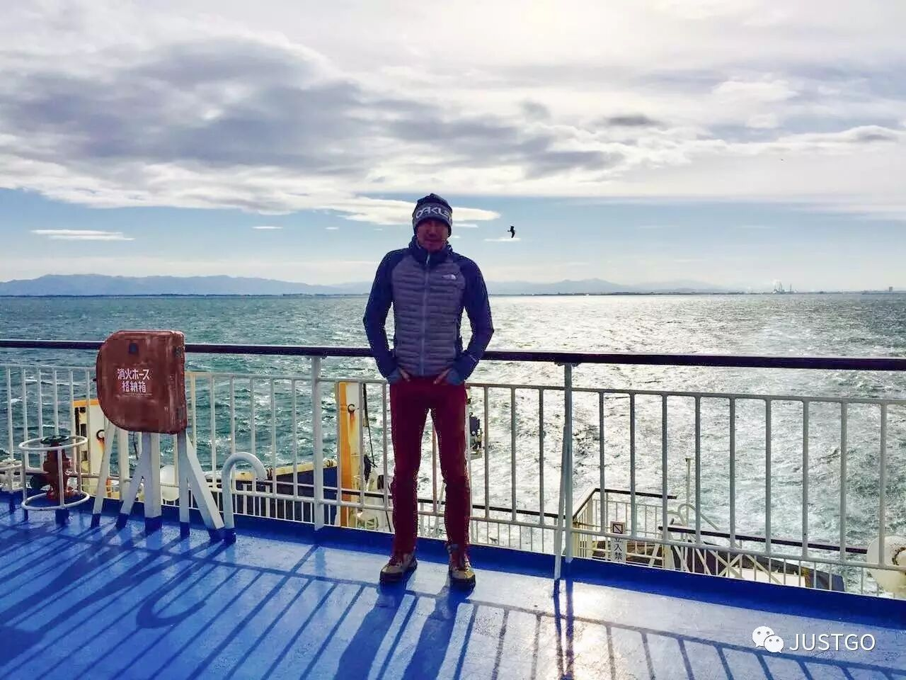

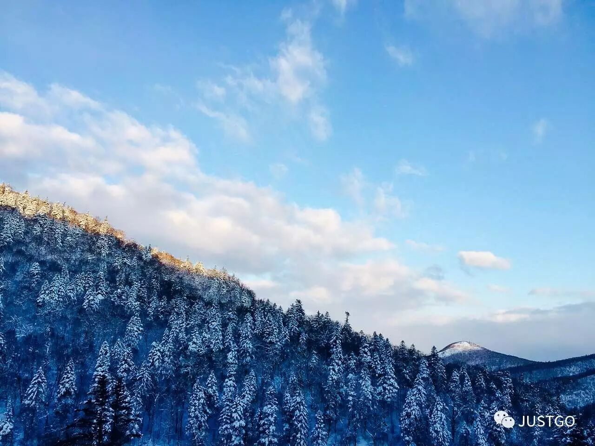

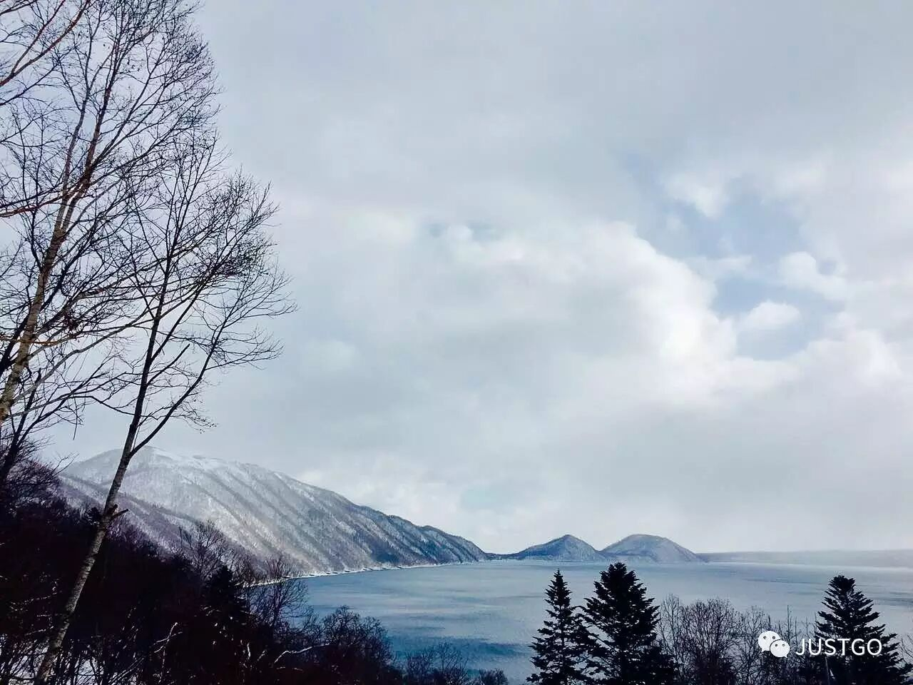

好美。

Yas是我今年在日本冲绳旅行时的房东，

这是他的故事。

🎬

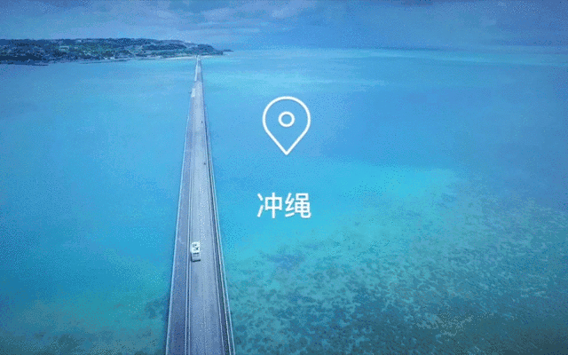

今年六月去日本冲绳，是因为一张中奖机票。闺蜜雅楠和我，任性地开启了一次说走就走的旅行，去看碧海蓝天的岛屿，白色灯塔。

每一次旅程，我除了期待看到的美景，更期待将会遇到的人。每去一个新地方，我可能完全不做攻略，但一定会用心选住的地方。我先打开了Airbnb网站，开始找有意思的民宿，发现一辆房车！

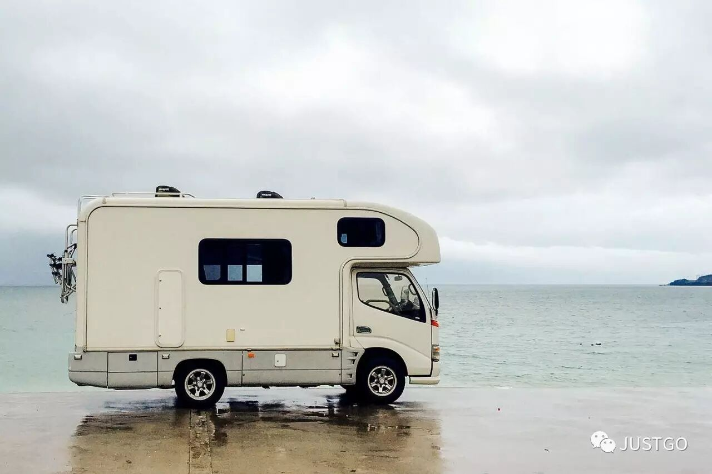

房东叫Watanabe Yas。白天，他全程为你开车，带你去探索冲绳，晚上，你就住在房车里，当做一个“家”。这间Airbnb很特别&性价比高，我瞬间心动。

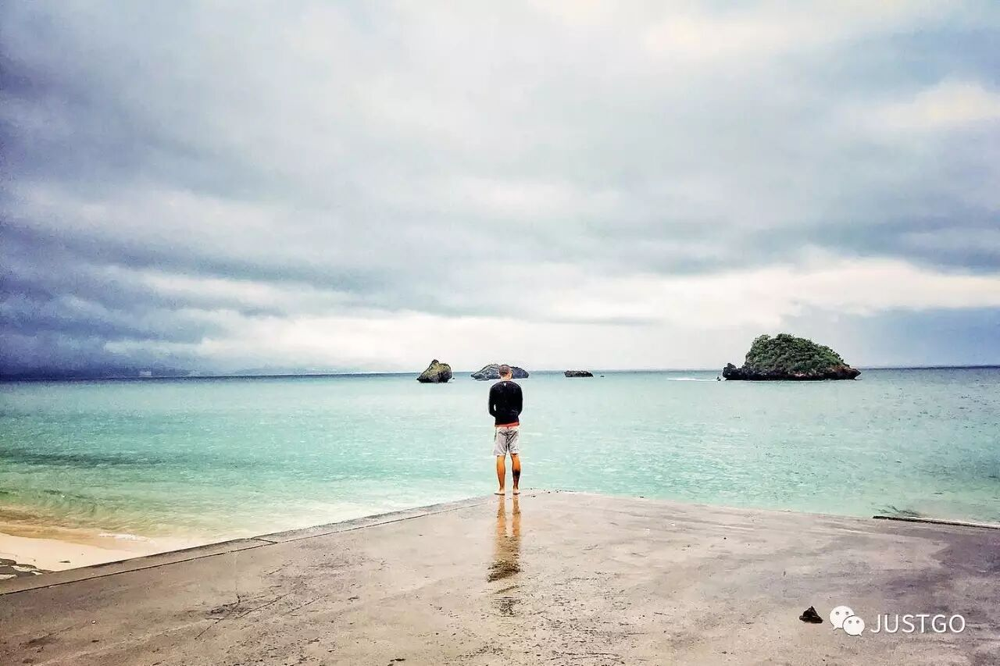

我开始和房东Yas发信息，商量旅行线路。他回复了我一句，"不做任何计划，不要问我任何问题，来就好了，你要先相信我。”

够酷！刚好也省去了我准备攻略的精力，收拾好行李直接上飞机。去奔赴一场完全未知的旅程，相信一个未曾谋面的超赞房东。

有故事的“老司机”

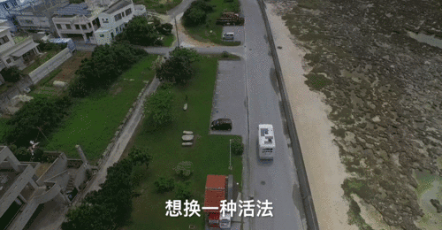

清晨七点钟，Yas和白色的房车出现在眼前，和照片里一模一样。

房车像个神奇的功能盒子：有沙发、两张床、小餐桌、厨房、卫生间、洗衣机、热水淋浴.......空间被完美利用，被他收拾得好干净。在日本这个车费相当贵的地方，选择这样的汽车旅行作为Airbnb，很实惠。

房车开动了，我们的旅程开始了！Yas跟我们聊起他的故事，他之前在东京有一份稳定工作，但他总是问自己，心里的愿望是什么：不想再这样每天朝九晚五，为了谋生去上班。

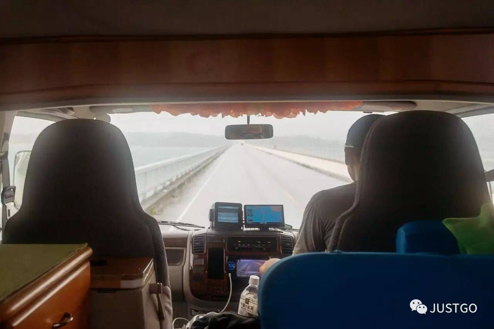

他想当一个旅行者。他去过西藏、上海，和欧洲的不少城市，想继续去探索，看不同的世界。于是毅然辞了职，卖掉了城市里的车，买下了这辆房车来到冲绳，想开启一种全新的生活。

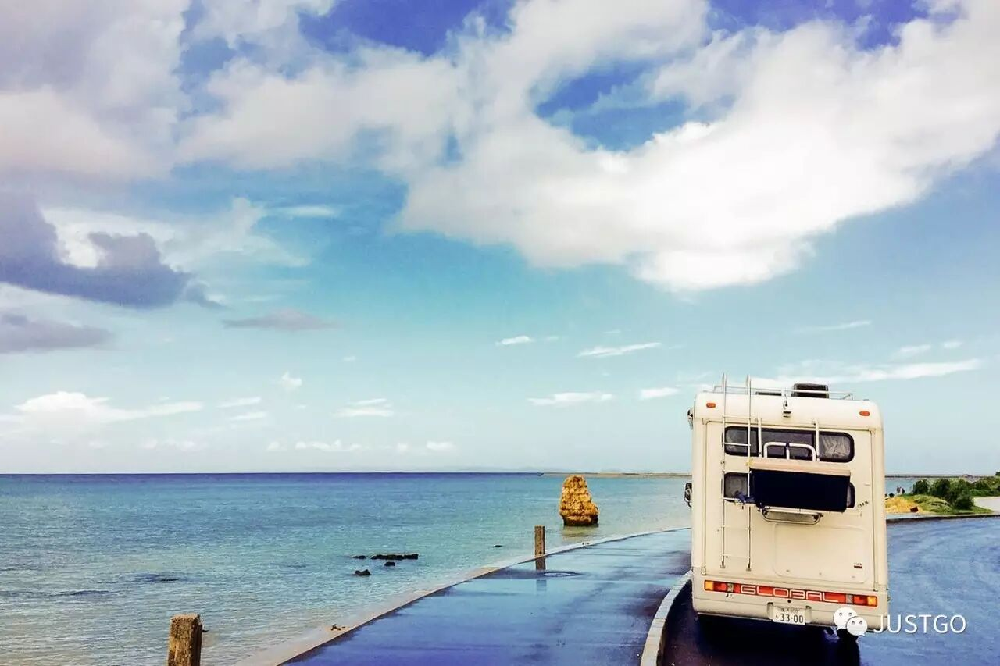

他开车独自走了一段，某天想到，试试Airbnb这种生活方式？于是他开着这辆RV，开始遇到全世界的旅行者：有一家人、有毕业旅行的学生、有背包客...他收到了太多房客的好评。漂泊的游子成了一位超赞房东，到现在仍是全日本唯一的房车Airbnb。

我们跟Yas介绍了自己。我是来自中国的旅行摄影师，住过一些奇妙漂亮的房子，做过记者，采访拍摄过一些有故事的人。

“带你走一条秘密路线”

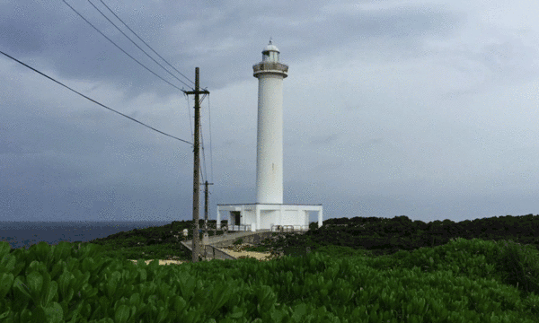

第二天清晨醒来，我们睁眼就看见了车窗外流动的绿色风景。这就是真实的“家在四方”吧，今天依然不知道要去哪里。Yas说，他有自己的秘密路线，是每天开车时，一点点探索出来的自由有趣的路线。

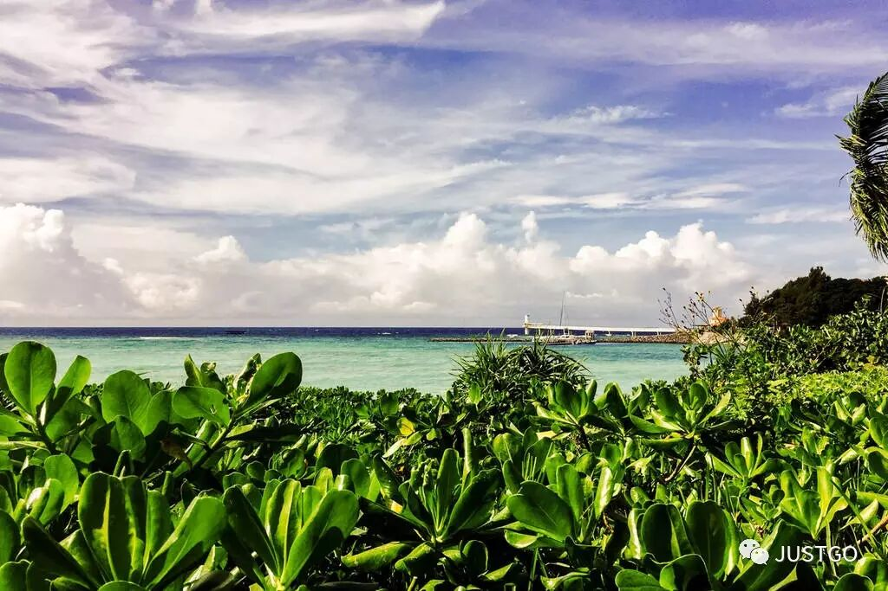

他走遍了冲绳各种景点，发现每一天的某个时刻，是游客最少的，就在心里记下来，希望带着自己的房客体验到那份美。

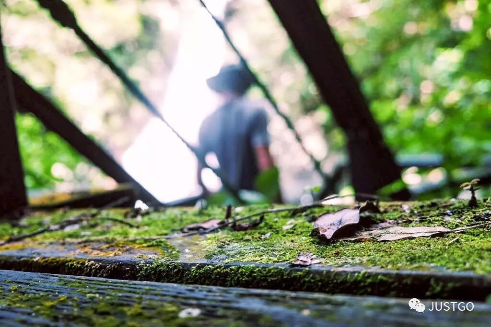

我们到了白色的灯塔，在海岬尽头。“我终于看见了白色灯塔，蓝色海面风平浪静，旅程开始闪闪发光。”

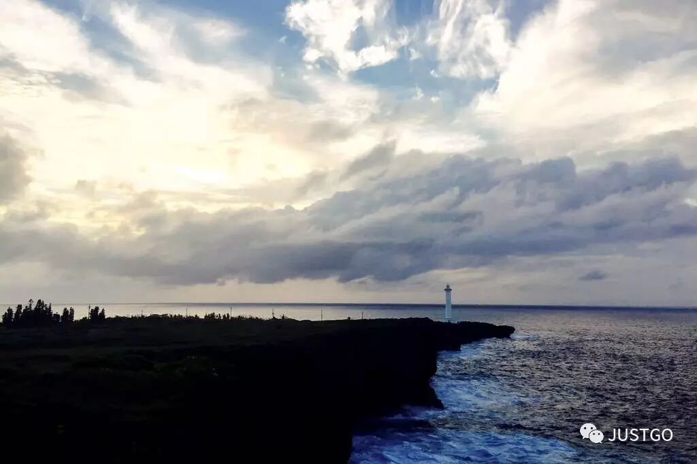

接着开到了一片布满枯木的无人海滩时，他开始低头寻找，砂砾上藏着很多蠢萌装死的寄居蟹。

路上有时会下雨，车一路行驶过大片的向日葵田，森林和海边公路。

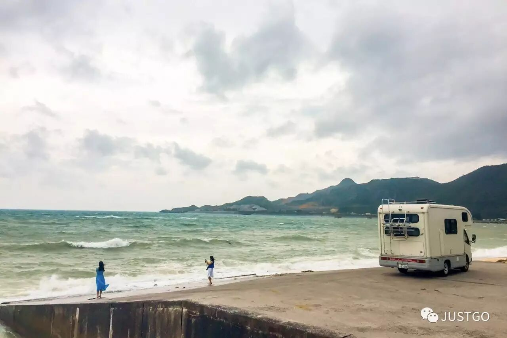

海水清澈得能看见流动的云朵。

这是他在冲绳最喜欢的温泉。他会单独一个人，在这里静静坐一下午。

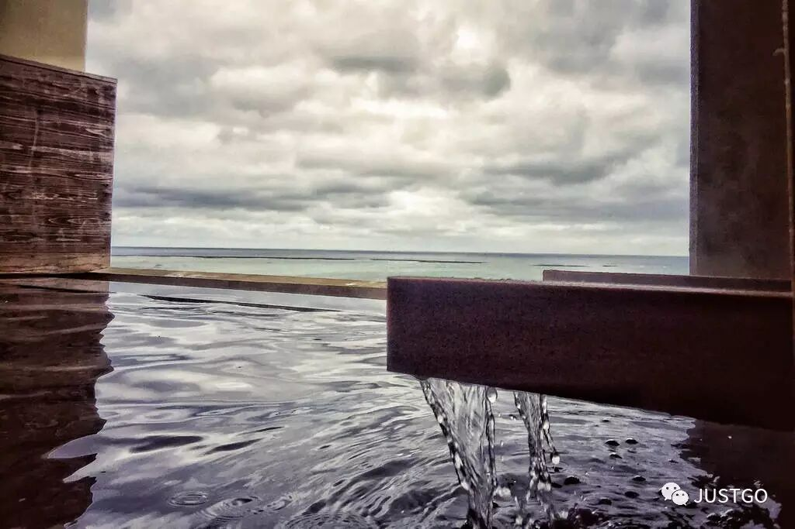

“带你吃地道鲜美的日料”

Yas让我们去清晨的鱼市场吃新鲜鱼生，吃到了美味的鳗鱼和大龙虾！

晚餐时他又带我们去吃当地小店的料理，我们盘腿坐在榻榻米上，刺身、鱼汤、寿司，伴着一杯杯温清酒。这顿地道鲜美的晚餐，才花了三百元人民币！（之前我们吃的每顿花一千元左右）

夏天的夜晚，海边BBQ，是冲绳人最喜欢的海边活动。Yas也经常为房客做烧烤一起吃。

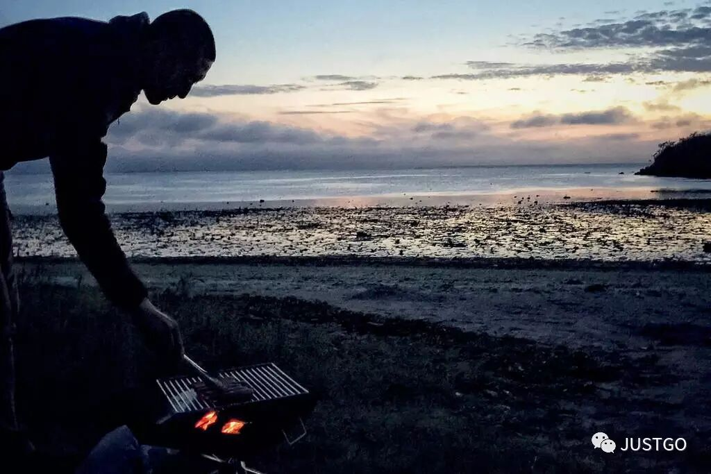

我们在最美的日落中告别

傍晚时分，Yas带我们看冲绳最美的日落。黄昏中的大海满眼金色，美得像个梦境。

最后开到了飞机场附近，我看着远处有闪着光的飞机，向我们飞过来。

原来，这片山顶可以俯瞰整个小岛，会有巨大的军用战斗机从头顶呼啸飞过。这是他最爱的一个神秘据点。我们就在这里告别。

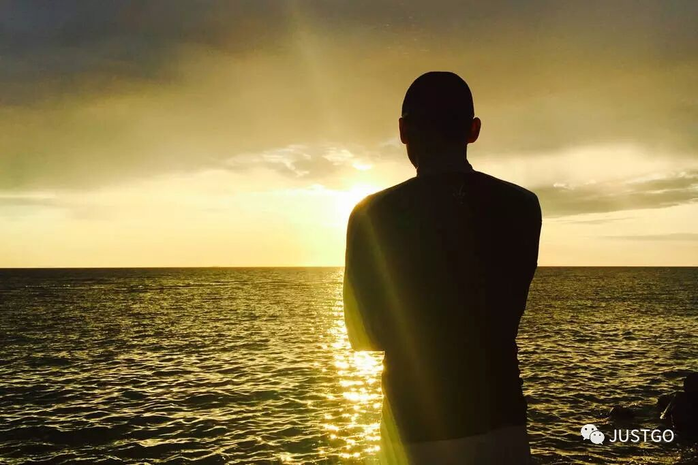

在冲绳，完成了看看海、吹吹风、潜潜水，在无边无际的蓝色里做梦的夏日愿望。而更独特的，是住进了日本唯一的房车Airbnb，和酷酷的房东Yas成为了朋友。我们相约明年夏天，坐他的新房车去探索北海道。这趟很酷的经历，是旅途的礼物。我会继续的。

> Airbnb 合作 · 冲绳 · 2017-01-01
