# 老灵额里弄时光，住进不一样的上海。

*Geng Yue · Travel Stories*

**下一个小长假，留给上海。**

来上海前，我听说，**住进上海的老弄堂里，就能开始真正看上海的生活**。在90年代以前"整个上海，有超过一半的住地是弄堂，绝大多数的上海人，是住在各种各样的弄堂里。"

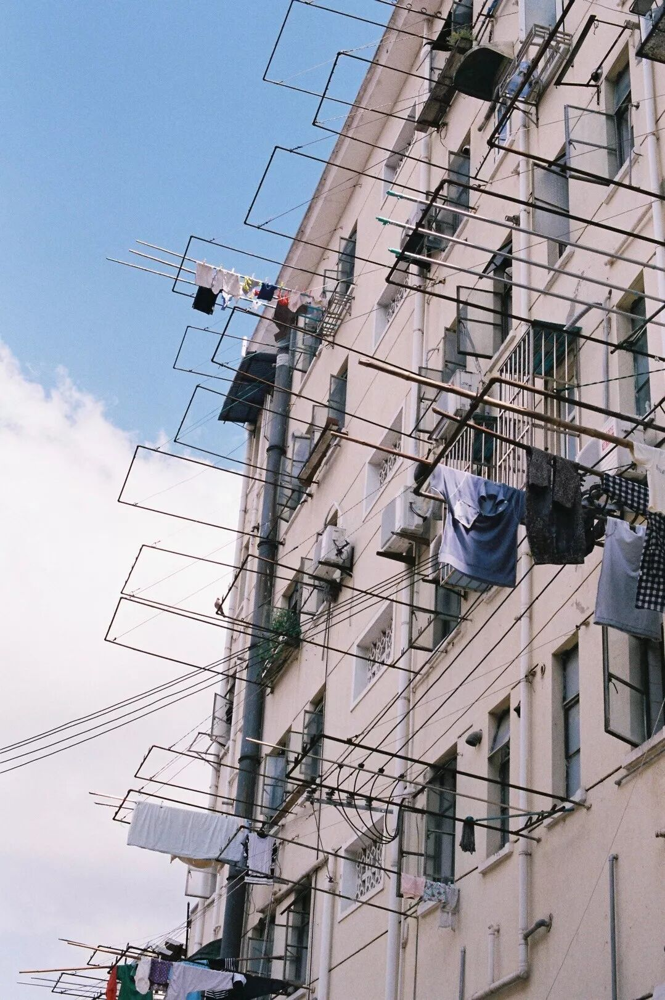

下一个小长假三天，**透过Airbnb爱彼迎房东蓉达，去认识不一样的上海。**如果里弄是一副画卷，展开它，你看到的会是上海人生动的邻里日常，呈现出她摩登都市的另一面——**这样的上海，你可能去过，但没玩过。**

***"***老灵额"在上海话里，***

***是表达一种由衷的欢喜赞叹 !"***

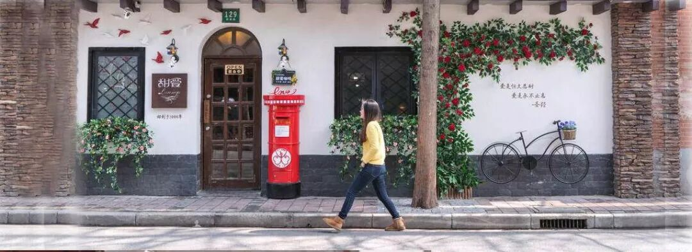

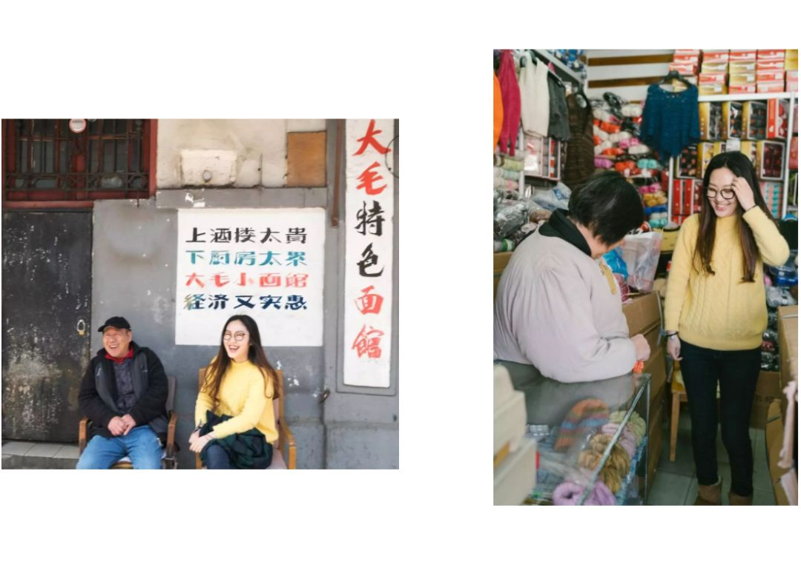

━━━━━━━━━━━━━━━━

**在上海的第5个小时**

***蓉达 Rhonda的爱彼迎***

拐进石库门老弄堂，就从喧嚷闹市走进了烟火人间。老人在小板凳上晒太阳聊天，猫咪和小狗在捉迷藏，修鞋的老师傅八十六岁了，还戴着鸭舌帽和老花镜，坐在弄堂口，给皮鞋补鞋底…… 人们就是实实在在平平淡淡地生活着。

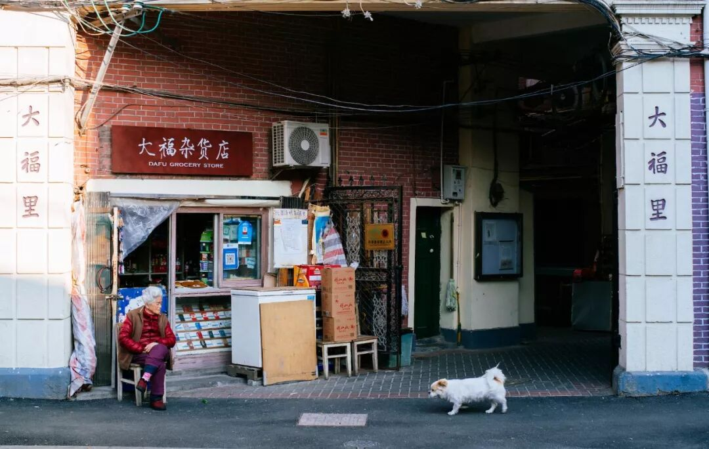

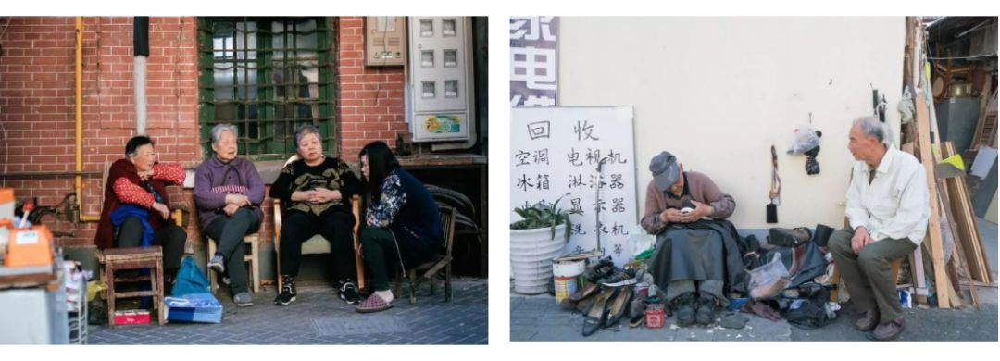

**这里能闻见上海人过日子的味道。**午后的阳光洒进窗台，伸出的竹竿上晒着白衬衣和棉被褥子，裁缝师傅在楼下剪裁裤边，剃头匠给弄堂里的老人修理头发……在平凡琐碎里，在弄堂的叫卖声中，我遇见了真实而纯粹的上海。

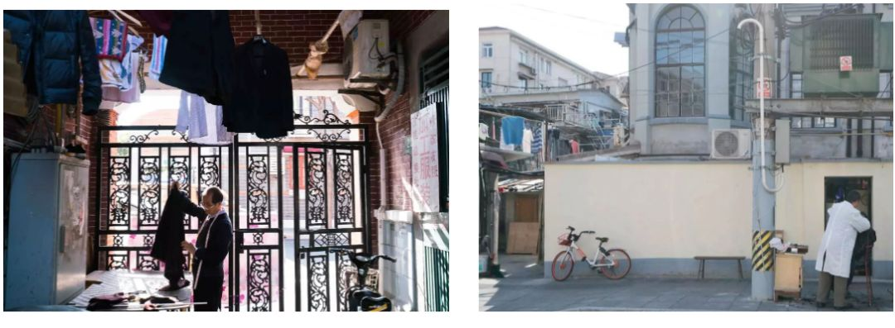

**蓉达的爱彼迎**

山阴路18号

━━━━━━━━━━━━━━━━

**在上海的第13个小时**

***弄堂传统小吃***

蓉达走出弄堂，带我去慢慢享用这座城市的味道，纵然上海的形象早已被泛滥描述，我依然相信我能找到与它之间的私密关联。

"我爸妈在山阴路上结婚成家，我在这里长大。**闻一闻从弄堂里飘出来的饭香气，那些小笼包、生煎、葱油饼的气味，就是我熟悉的童年气味。**

"人的味蕾和记忆是缠绵的，当我能像蓉达一样吃遍上海美食时，或许也能感知一二她对于年少时光的眷恋。

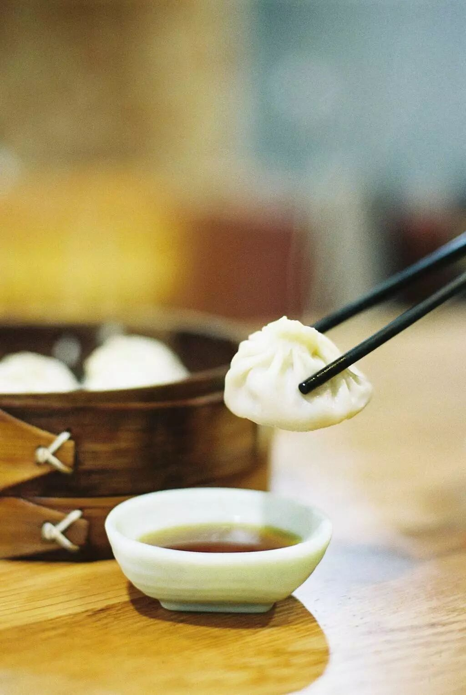

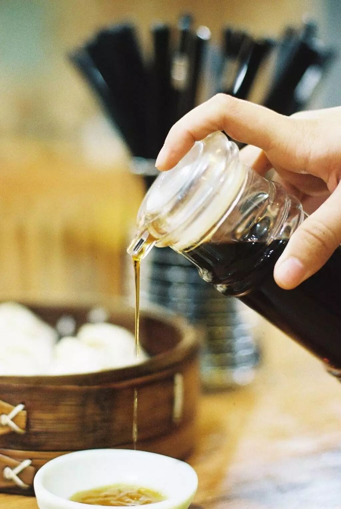

咬一口蟹粉小笼，热气升腾起来，"好小笼的皮儿很薄，"蓉达在一旁讲着，倒一点点醋，一点点切的很细的嫩姜姜丝，一口吸掉里面的汤汁。会想起吃大闸蟹的好时节。

我随她一路穿行，一路品尝，油里炸着的小葱，撒落的白芝麻，香透了整间屋子的生煎包。"我最喜欢吃那块略焦脆的生煎底，特别有嚼劲。和学生时代吃到的口味是一样的。"

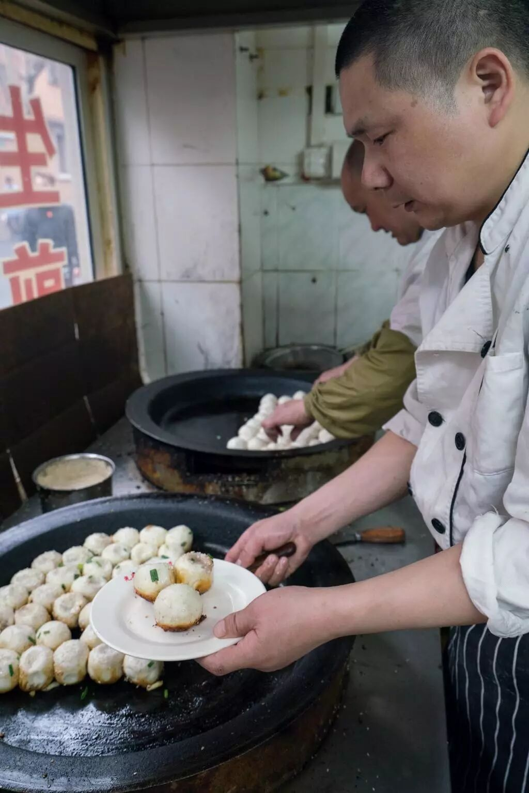

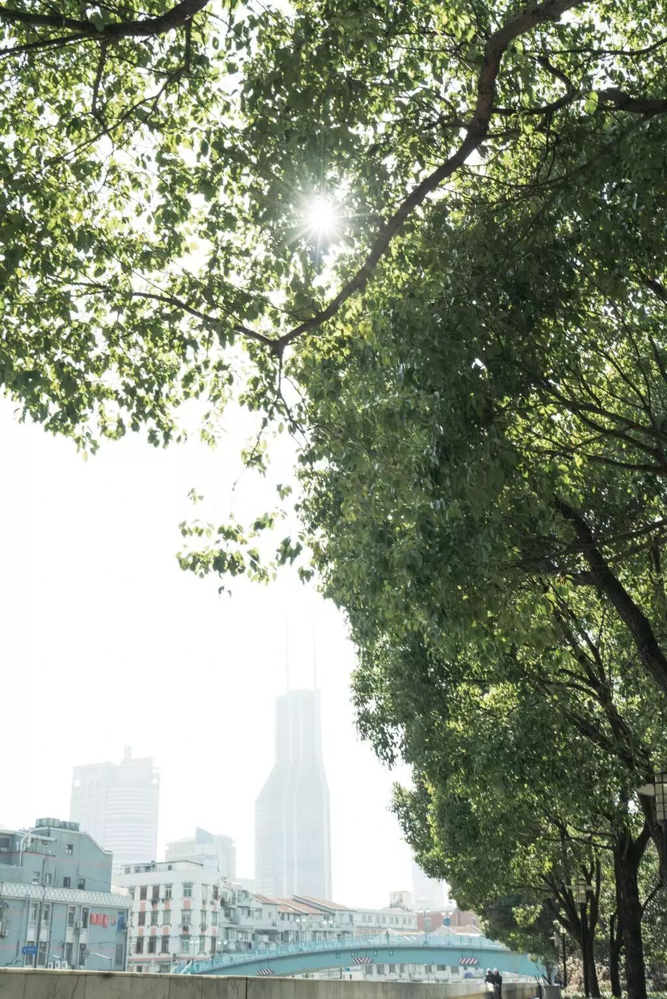

吃一口就念念不忘的浇头面，"我几天不喝这家的汤头就想得慌。"藏在街边毫不起眼有点古旧的小面馆，猪手面、黄鱼汤面和鲜蛤面一应俱全…… 腾腾热气的面端上桌后，浓白的汤头飘着清淡、温润的滋味，谁也不再多言，闷头喝一大口，暖在胃里。

**山阴路**

万寿斋 光头生煎 小时代面馆

━━━━━━━━━━━━━━━━

**在上海的第37个小时**

***弄堂里的达人聚会***

这个地道的上海姑娘喜欢交朋友，人送爱称"虹口一枝花"。她在弄堂的家里，有一种神奇的磁场，常有十几位年轻人聚在这里分享人生故事，有本地建筑师娓娓道来上海的野史，"我从小跟着父亲，一步步走过上海的每一条马路，记得很多老路名"。也有来自加州硅谷的女极客说，"我十几岁时拿到了飞行员驾照，算了算自己已经吃过全世界500多家餐厅了。"

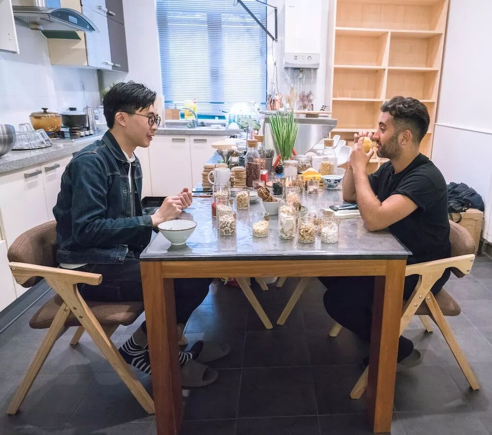

我因为认识了她，接着参加了上海很多个Experience，有人教你广式煲汤、珠宝设计体验、画油画、手工咖啡……即使足不出户，我在这里结识到了各种才华横溢的年轻人，交到了志同道合，热爱生活的好朋友。

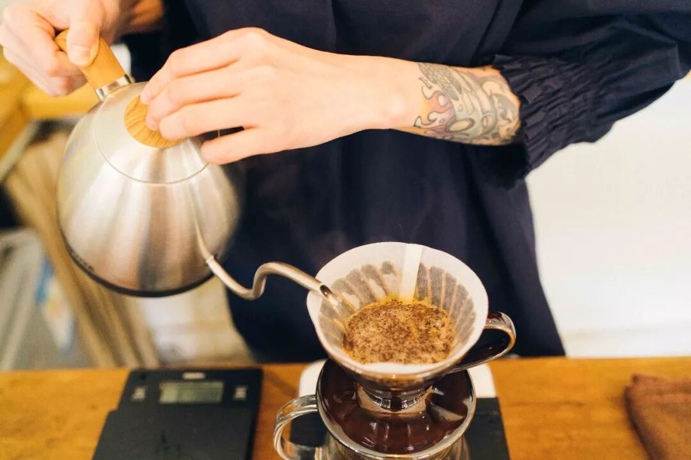

这里的日子熠熠生辉，滋滋有味。**很多人说聚在这里，似乎看到了梦想中要过的生活**。

**蓉达家的爱彼迎体验**

━━━━━━━━━━━━━━━━

**在上海的第53个小时**

***老建筑的新生机***

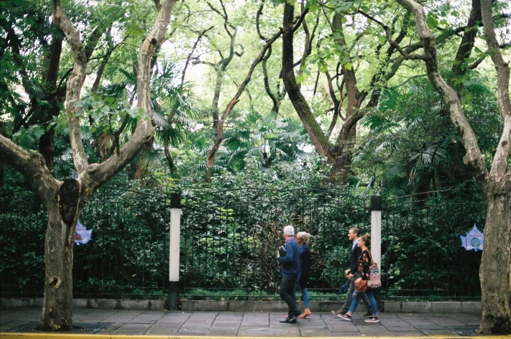

上海有很多忙碌、炫目的地方，我们穿梭在宁静的老街区里，很多曲折寻常的小径上，不仅凝集着时光的琥珀，也有独特有趣的新创意，很多迷人的主题店铺。

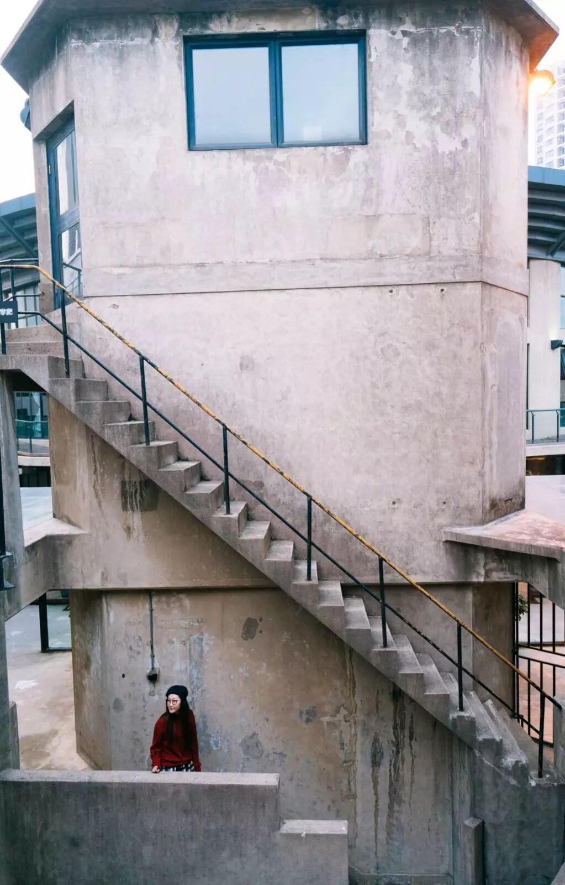

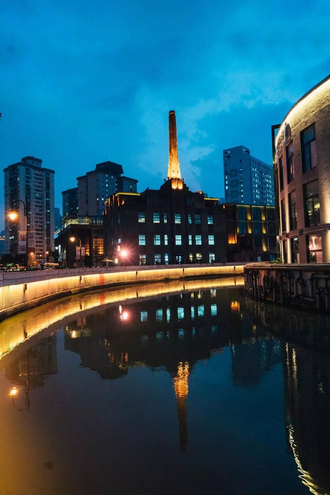

不论是民居还是洋房，这里都有上海最美的建筑群。创意店铺的发展让老上海的邻里文化有了新的生机。

**1933老场坊**

━━━━━━━━━━━━━━━━

**在上海的第58个小时**

***漂在黄浦江上看日落***

夕阳余晖中，我们花2块钱去坐轮渡过黄浦江，看一次"很嗲的上海日落"。

漂在江中央，闭上眼睛深呼吸，慵懒的江风、淡淡的云朵，和流动闪光的水。在外滩的正对面，敲钟声响起， 密集的建筑物，马路上的汽车尾气，几百米外人行道上的压抑气息，都被江上轮渡完全推开。

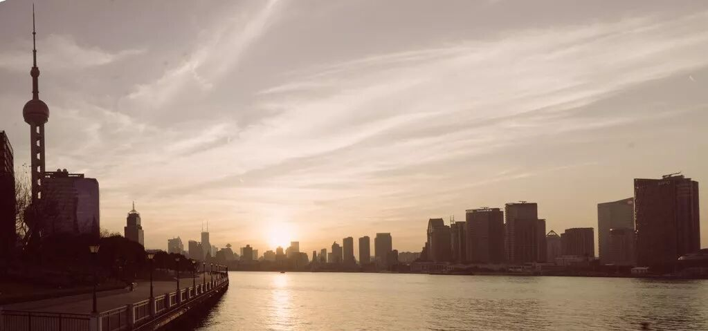

一瞬间，人人眼中的魔都仿佛变成了一座安宁、慢节奏的城市。身在闹市中心，却仿佛待在平和的桃花源里，黄昏悠然，人心亦静。

**乘轮渡过黄浦江**

━━━━━━━━━━━━━━━━

**在上海的第65个小时**

***隐匿酒吧***

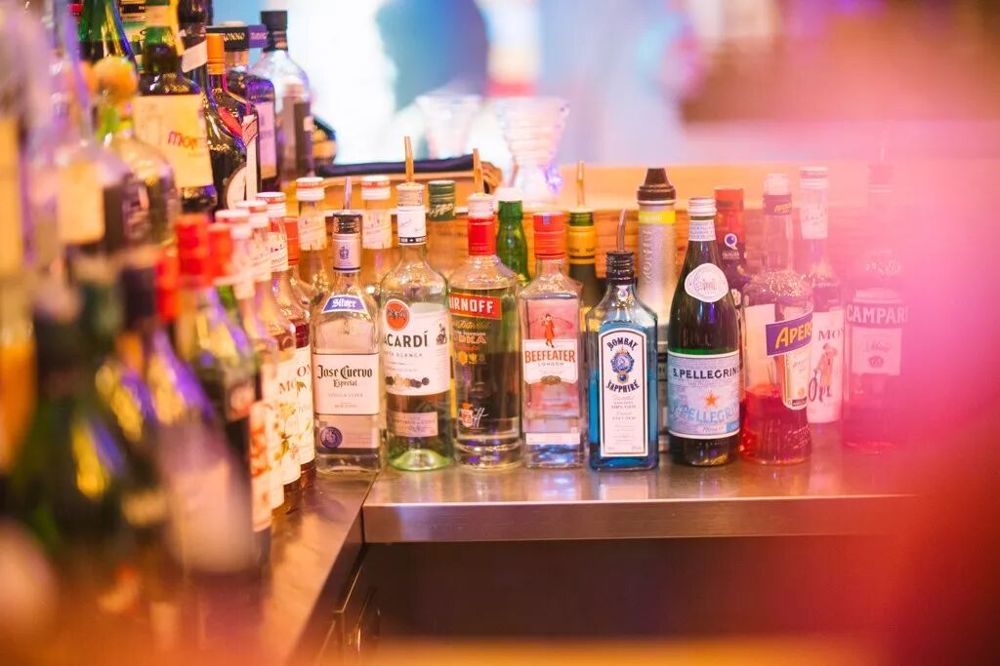

到了夜晚，弄堂里长大的蓉达变身调酒师 Rhonda 。我啜饮她调的酒，也被她带去了各式各样隐秘的酒精欢乐之地。

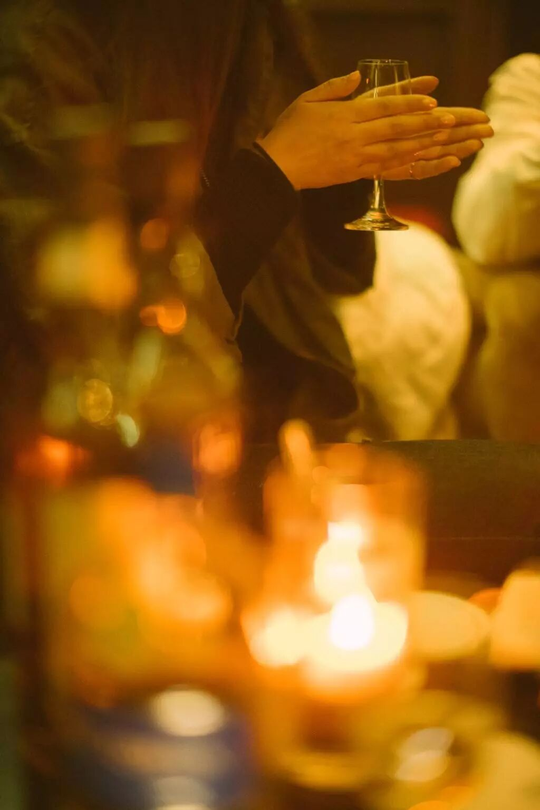

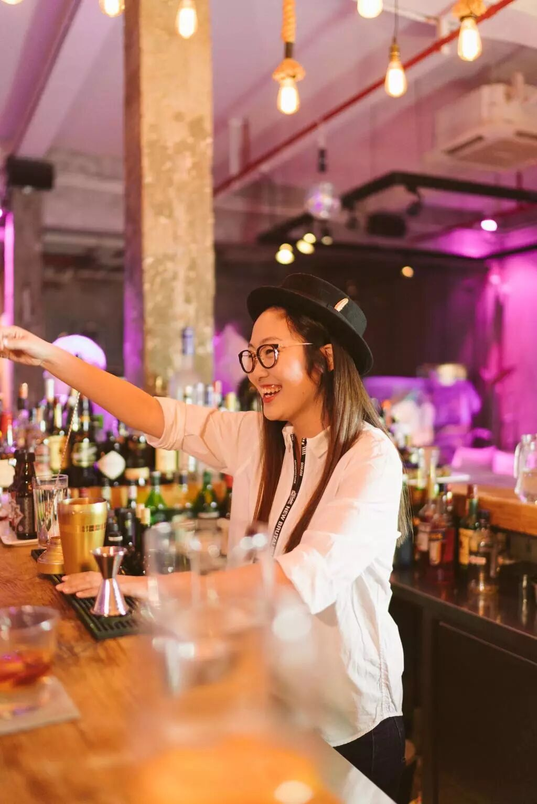

红色的丝绒幕布一拉，身后竟然出现一个魔法小剧场，一边喝酒，一边在昏暗中看漂浮的灯泡和跳舞的手帕，不知不觉中感觉被读懂了心，仿佛每杯酒都拥有了魔力。

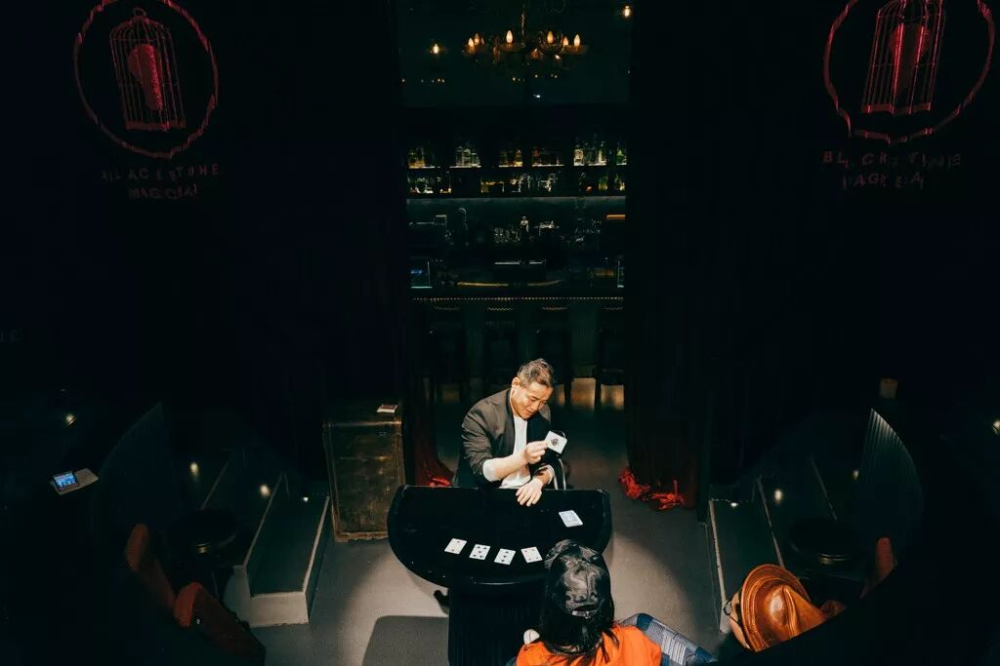

推开外部伪装的书架，背后一道密室的暗门，爬上幽暗的木质楼梯要拍一下地图上隐藏的"上海"机关，才能进入另一个禁欲与自由的酒精味世界……

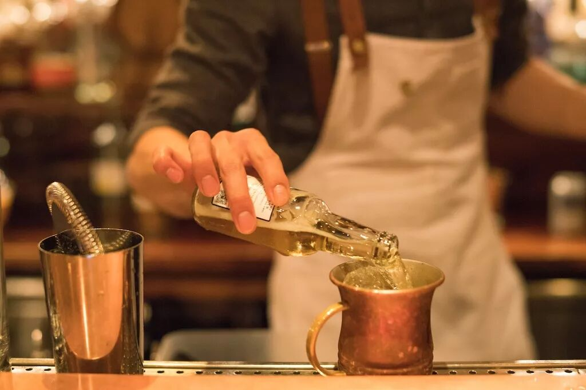

夜上海，我在微醺中感到振奋，沉浸在充满冒险、百无禁忌的世界里，体验这块地域的无限可能。

坐在回弄堂的车里，匆匆而过的世界虽然模糊——但我也遇到了这座城市最醉人的时刻，此刻上海不再是我眼中那个光鲜明亮的繁华都市，我触摸到了在那些脂粉之下的体温，亲切，慷慨，让人心生温暖，**这是我自己找不到、留不住、也忘不了，但因为弄堂、因为蓉达而幸运遇见了的上海。**

即使喝到凌晨才回家，蓉达的小院子里始终亮着柔柔的微光，等着我。

**Magic Cocktail Bar Speak Low**

🏠

在上海的72小时

按下暂停键，休息一会

住进Airbnb爱彼迎

深入安静的里弄里

去探索魔都的另一面

**原创作者** 耿悦

**摄影**：悦 Lily（带我胶片游玩法租界的美女摄影师）

感谢 上海采访期间各种提供帮助的朋友