# 布拉格船屋 · 相逢即美好，沉潜的力量

*Geng Yue · Travel Stories*

Prague. 我住进一间漂在水上的房子，把查理大桥走了九遍。

**Prague. 我住进一间漂在水上的房子，把查理大桥走了九遍 **

在世界各个城市飞行的自己，每到一个新的城市，仿佛打开一个礼物盒。

会住进的房子，都像身处另一个世界。

**住进漂浮在水上的船屋 **

当我得知在布拉格会住进一个漂浮在水上的船屋后，这趟旅途开始闪闪发光。

房东卢卡斯开车来接我，我们在一座白色的船屋前停下来。

他在打开门前说，**“这是一个新世界。”**

这个**建在水上的房子可以移动**，

“可以移动到这个世界上任何你喜欢的地方。你喜欢看山、看水、看小镇.....哪儿都可以去！”

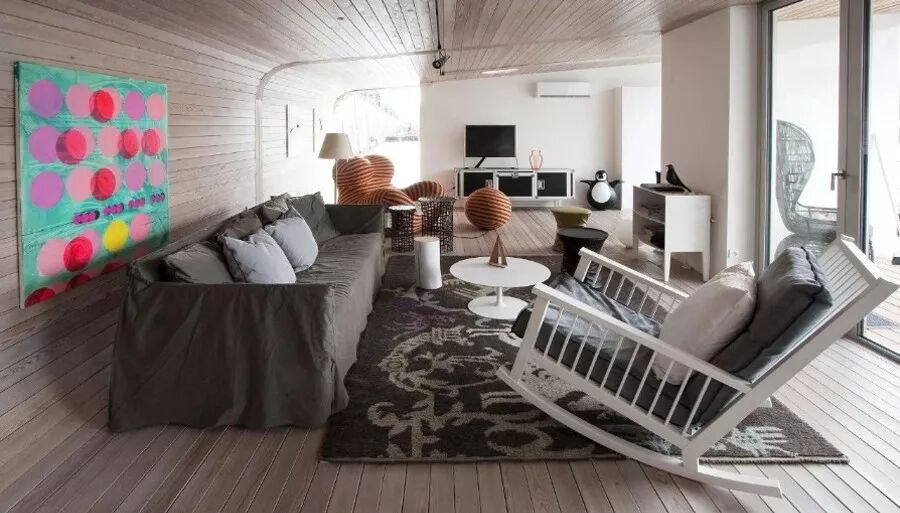

有木质的墙面，流线的圆角，极简的现代风格。

空间很宽敞，可以立刻把四个房间变成五、六、七、八个，按每个人的需求组合切换。

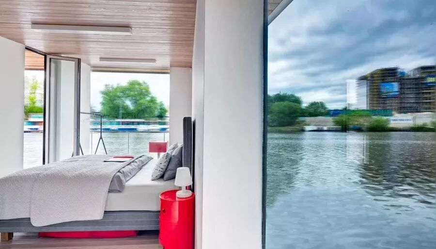

一艘船屋，就是一座移动的家，有卧室、书房、客厅、厨房、餐厅、浴室等，功能超级齐备！

眼前是大片的落地窗，和大片的开放区域，整个船屋充满阳光，河景尽收眼底。

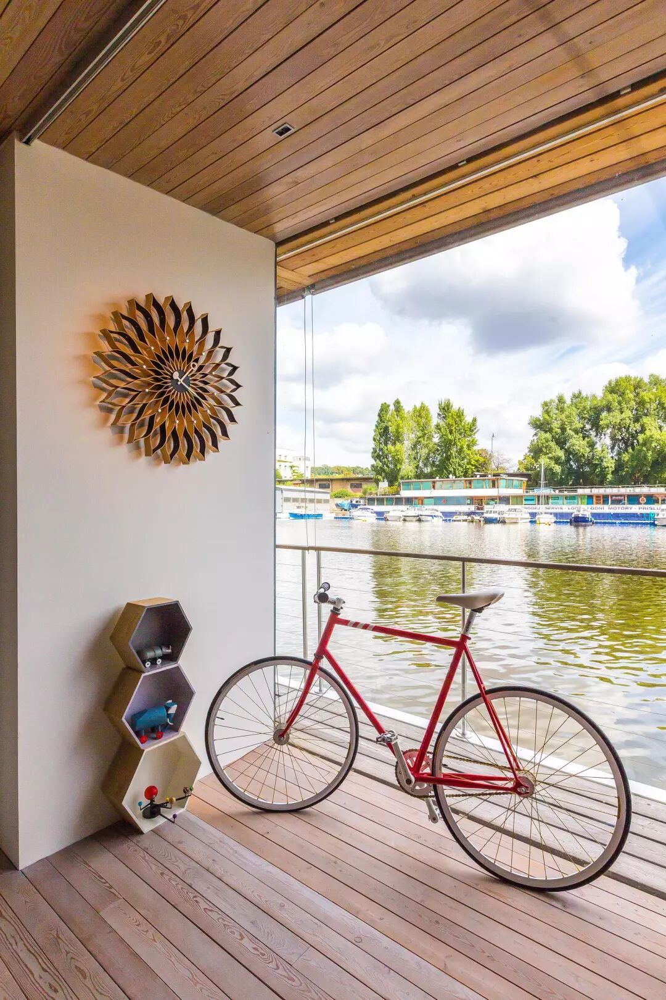

我玩着里面的高科技家具停不下来，全屋是智能化系统，通过手机操控开关，“**有一种进入外太空的奇妙感**”。

头脑被工作压满时，音乐流淌，喝着咖啡，心情就平静下来。

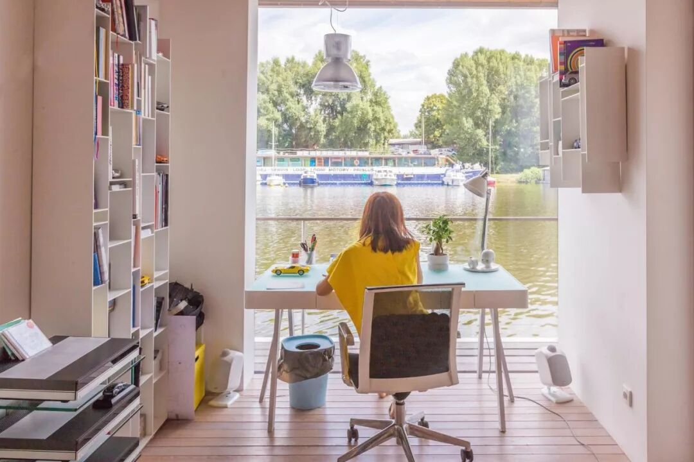

这里非常安静，我在这个椅子上坐了蛮久，风吹的惬意。

**坚信美好生活方式的存在**

房东卢卡斯在布拉格读书、毕业、结婚、生子、创立广告公司，生活了近二十年。

他给我看胳膊上画的Airbnb图案。他颇爱Airbnb的共享，还想让布拉格的无家可归的老人，也找到住处，并想把这种可能性未来做成爱心项目。

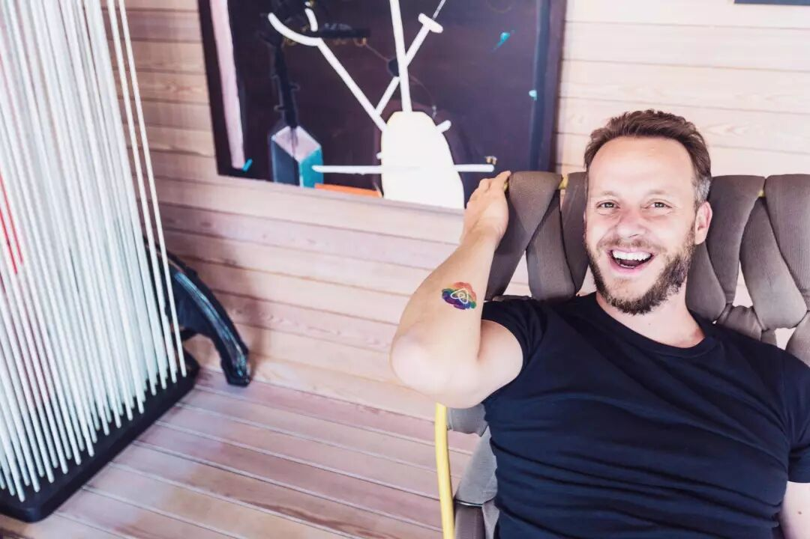

他蛮欣赏我的工作和生活方式，专门花了一天时间，开着车带我看看布拉格，

我们边看边聊，他超级有趣，聪明，说话也很幽默。虽然已经是一个成熟的公司创始人，却对房客真诚耐心到感动。

他为何定居在布拉格，为何离不开布拉格，**悉数跟我娓娓道来：**

从小到大的童年，家人，高中，考学，

每一次创业，幸福的婚姻和孩子，

工作和生活的平衡，每一次还未实现的冒险……

Lucas是一个浪漫主义和理想主义的实干者。

年轻时还在一片类似像伍德斯托克音乐节的草地上，开辟过一个露天电影院，

看人们在午夜梦回里感动、大笑，流泪...

**“陌生人在一个特别的地点时间里，拥有一个很短暂的、真诚的回忆，多么美好啊。”**

他开着车驶过那片草地时，回忆时脸上的表情，我现在还记得。

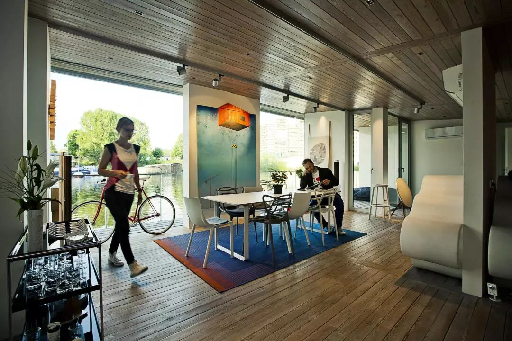

这处船屋的精巧设计，是他和妻子Hana一起建造的作品。

和最优秀的建筑设计师合作，仅用了半年时间，就从无到有地创造出来，让人坚信这种美好生活方式的存在。

这是个可爱的家庭。有一对漂亮的儿女，在房间里也摆放了玩具。

他们邀请我过去玩，参加派对，跟我分享孩子们的趣事，哈哈笑不停。

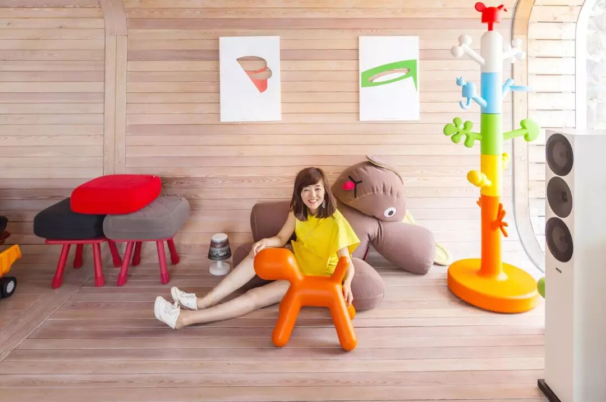

**把查理大桥走了九遍 **

我想去查理大桥，他们说，“你不妨试试把查理大桥走九遍，这才算来过布拉格。”

船屋虽在河边，但去城区也就十分钟。当我来回走完了九遍，才发现，每年遍风景都不同。

这座 “欧洲最美大桥”，坐落于碧波粼粼的伏尔塔瓦河上。

“查理大桥，呈现出诡谲的天光，一大片橘红似火的霞光，在桥的另一边闪动着。

桥身与矗立的凋像都是黑色的，被岁月中的烟尘酝染，有些凋像虽然已经进了博物馆，那些替代的赝品，却也像古老一样古老。”……

我最喜欢划着我的小船沿伏尔塔瓦河逆流而上，然后仰卧在船中顺流而下，欣赏不同的桥... ...”

卡夫卡在写给女友米莲娜的一封信中曾经这样写道。古堡、大桥、老城，构成了一个完整的布拉格。

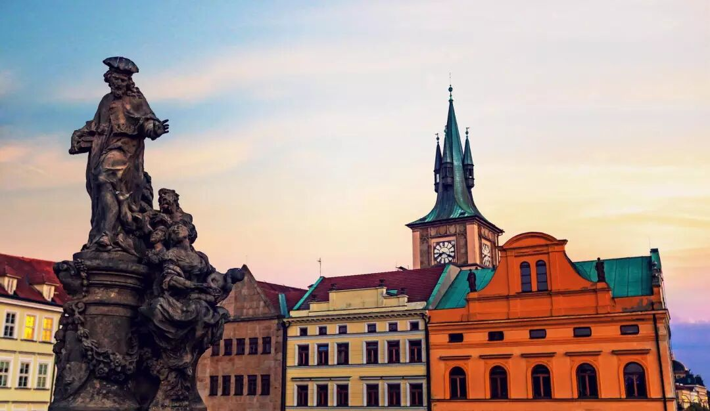

傍晚过桥时，光线把老城照了个亮堂。

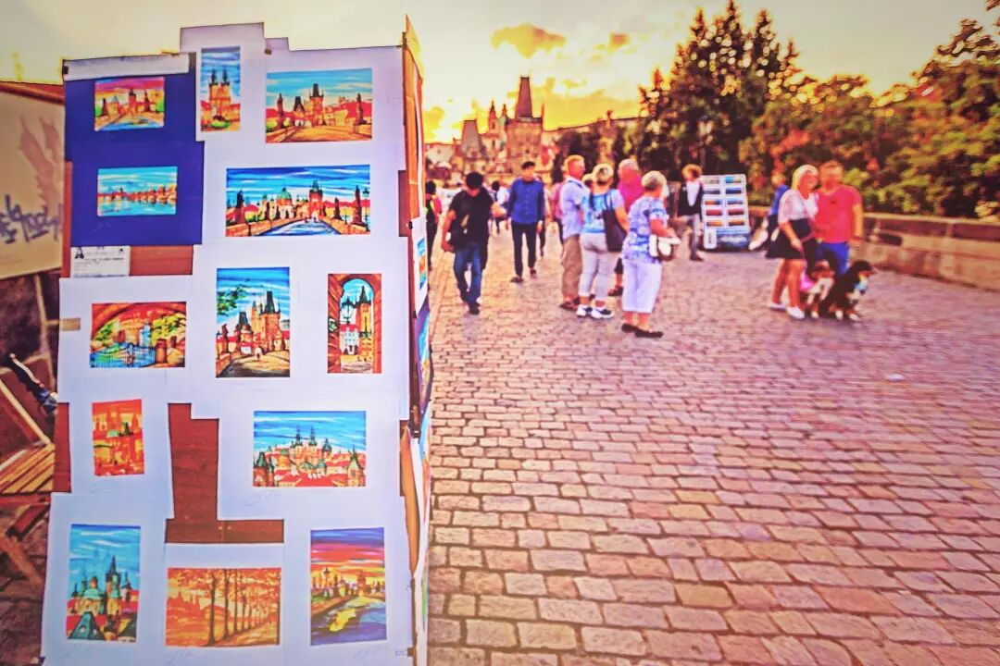

桥上的游人，艺人，游人，过路人，商贩，音乐家，像小的艺术分享会。

这座大桥一直以来都是那些艺术家，摄影师和诗人们永不枯竭的创作源泉。

我逐渐体会到了650多年历史的味道，大桥被汹涌的洪水淹没过，也被纳粹的战火焚烧过，而此刻你正轻轻地走过。

**去逛当地人的布拉格**

房东带我出门逛逛，走到街角的咖啡馆，刚好碰到他的一位摄影师好友，我们就随即坐下来一起喝一杯，聊音乐、旅行。

摄影师给我看他刚去印度、巴西等地拍摄的音乐会纪录片项目，黑白复古片酷到爆炸，我对房东说，“**你的朋友也是很酷的稀奇动物喔**。”

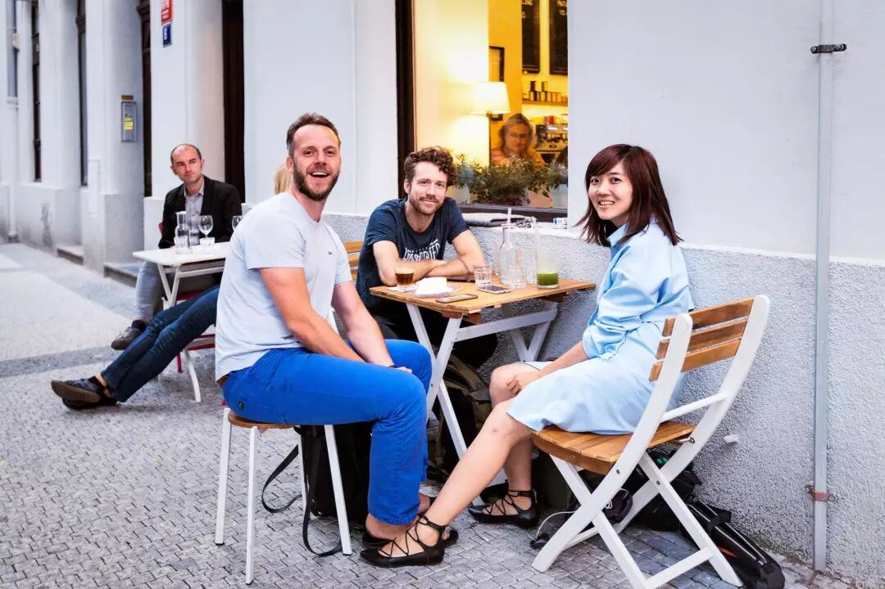

Lucas给我推荐了一本当地人撰写的布拉格攻略，有所有好逛好玩好吃的地方，

“可以了解当地人的生活，当地人住的小区，哪里有最好的餐厅书店咖啡馆，哪里看剧最有趣。”

这本小册子后来在我的布拉格自由行中帮了大忙。

跟着他逛的布拉格一日，我们去了他最喜爱的咖啡馆吃Brunch，他说“我的饮食非常健康，加上规律运动和睡眠。

所以虽然我每一天有几百件事情要处理，还要带两个孩子，管理几个爱彼迎房源，见很多朋友，我都可以做到活力满满，”

他还翻开一本珍藏的艺术家画册，告诉我布拉格从哪个角度看，最漂亮，能拍到最好看的照片。

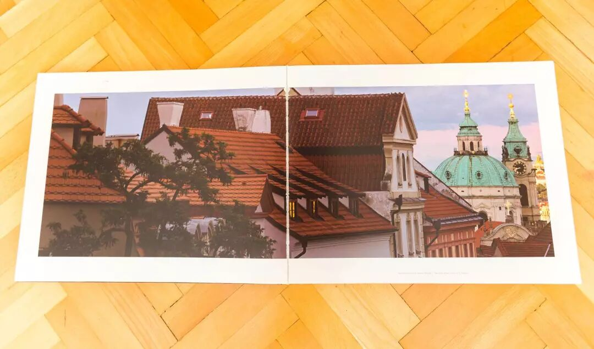

接下来我一个人带着这些“宝藏”去探索这个城市。

遇到了在广场玩泡泡的小男孩。

吃到了甜蜜无比的树莓冰激凌。

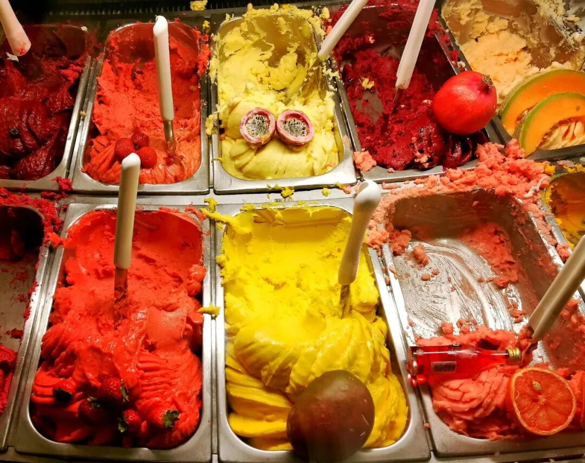

去城堡区看金色教堂，看漂亮的建筑。

听天文钟整点报时，木偶唱歌。

爬到城市最高处，看到了整片红屋顶。

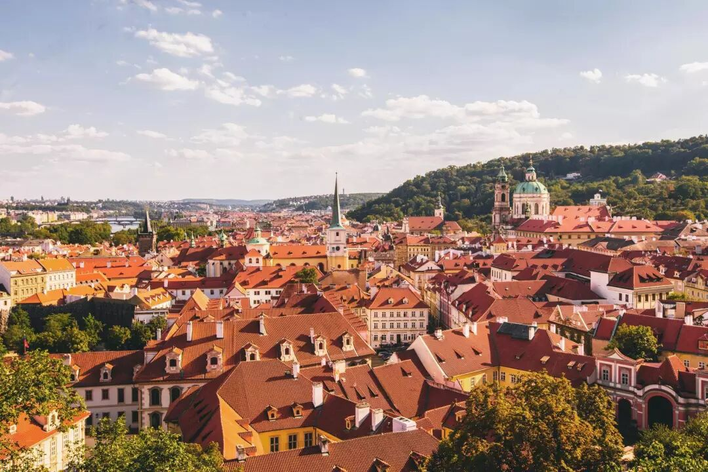

去约翰·列侬墙涂鸦，到酒馆听《黄色潜水艇》，喝杯小酒。

坐在老城广场，有人在唱歌、拉小提琴，表演火把，我吃着手工冰激凌。

离开时，船屋暖黄色的灯光明亮起来。

住进这里的新的旅人，听着流水声入睡，被天鹅叫醒，看着窗外波光粼粼的湖面，沉醉在一种如诗一般的生活里。

我收好这一段的记忆，开始下一段飞行。

“只要我有架飞机，只要天空还在，我就会继续飞下去。”

打开书，看到柏瑞尔的这句话。来自世界各地的人，飞行几万公里的距离，无数种人生，因为一间房子遇见，绽放出不一样的光芒。

我是如此喜欢，永不厌倦。

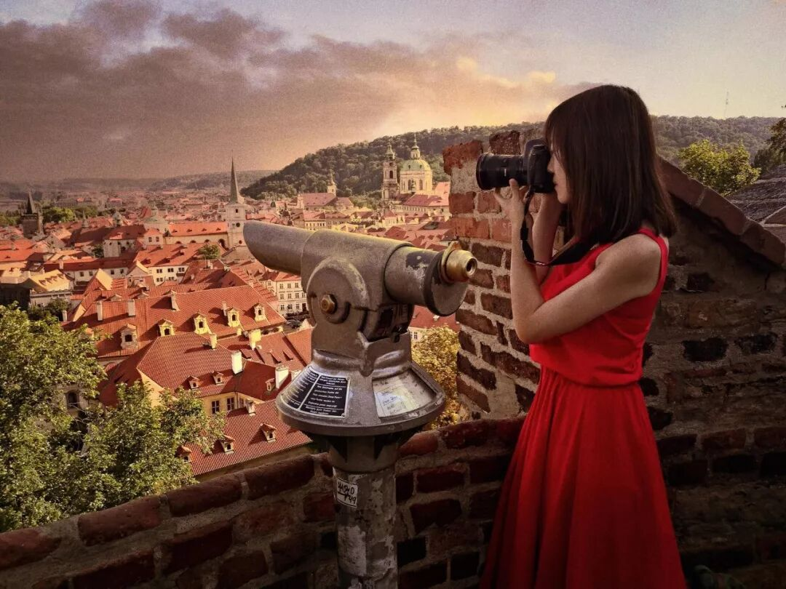

写在2016年，布拉格的红屋顶旁。

这篇文的封面是我在一个披头士风格小酒馆的门口。

周末分享这首快乐的歌，Beatles的《黄色潜水艇》，愿你和我同频感受到

Yellow Submarine的轻松有趣、自在:)

我们都住在黄色潜水艇里，想沉静的时候就沉潜在海底，水面之下。

想浮出水面的时候，**就要乘风破浪，开着它去迎接阳光。**

潜水艇有它自己的pace。

即使外面惊涛骇浪，我们依然波澜不惊。不是与世隔绝，而是在这个慌乱的时代里，“做自己”。

重要的是找到适合自己生活的节奏感。

> Airbnb 合作 · 布拉格船屋 · 2019-03-31
