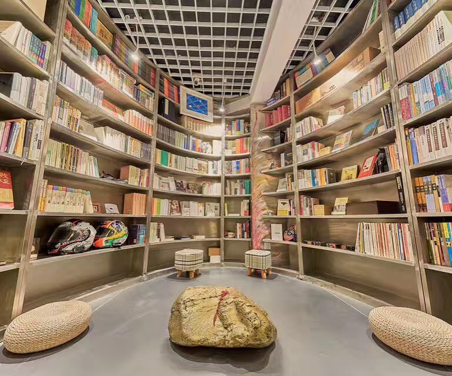
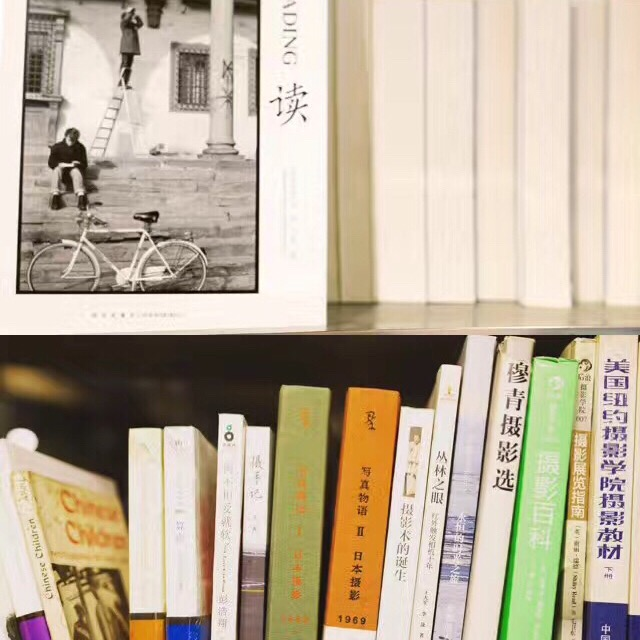
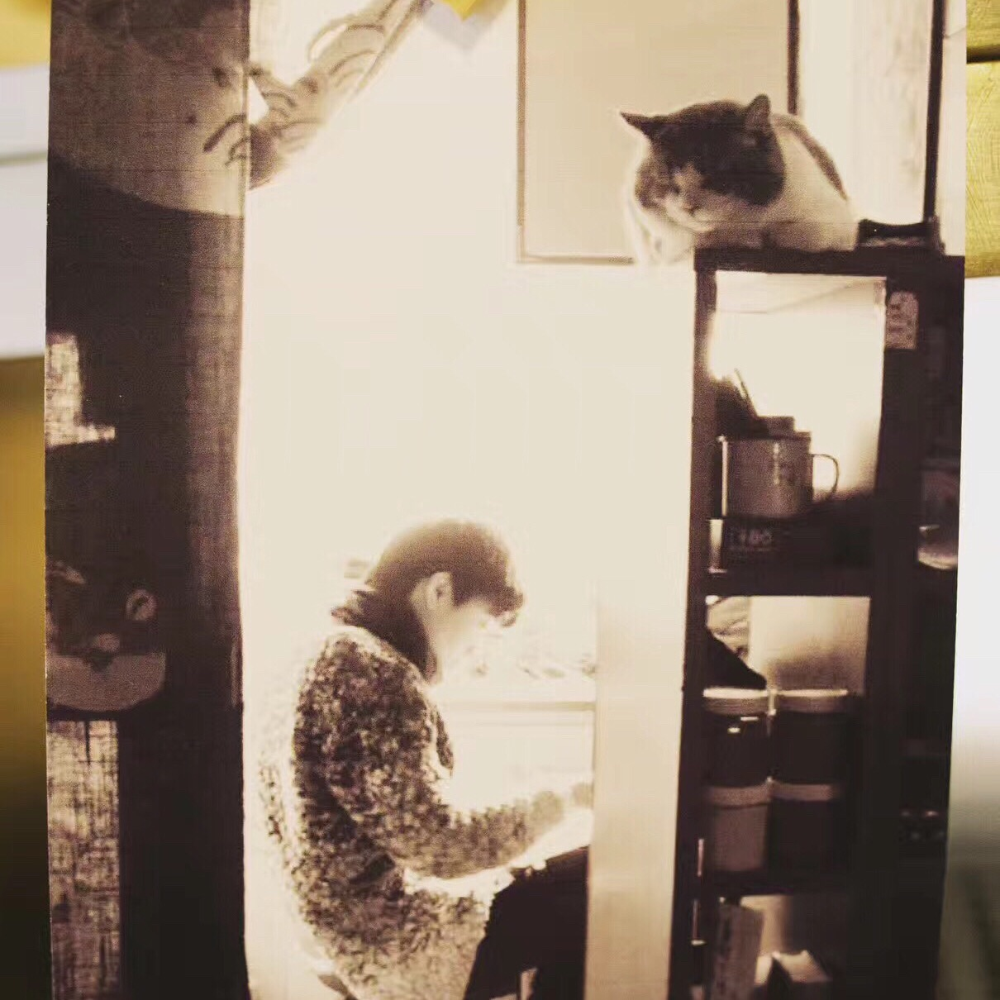
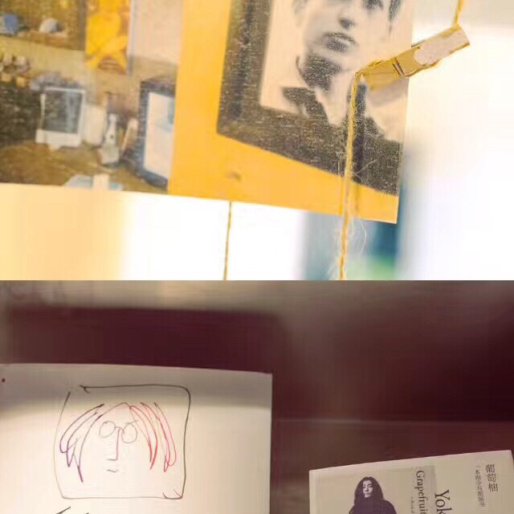

# 在书店里度过的一晚 · 荒岛奇妙夜

白天这里是一个书店。晚上你可以住在里面。独享一个奇妙的和书在一起的夜晚。

---

最近在读马尔克斯的《活着为了讲述》。扉页上写，“生活不是我们活过的日子，而是我们记住的日子。我们为了讲述而在记忆中重现的日子。”

“如果人生中有几个夜晚，过了很久，仍然会想起来的”，会有“荒岛之夜”。

那时是上海梅雨季，从京飞沪的航班总是延误。我订的夜晚到上海，结果在机场拖到了后半夜。

我略带焦虑地给房东大漠儿发信息，她说，没事，「本来你要看星星，结果看了朝霞。」

多浪漫。多符合一个旅行者的心。

白天这里是一个书店。晚上你可以住在里面。独享一个奇妙的和书在一起的夜晚。

深夜推开门。

就仿佛走进了一个小小的迷宫。书架蜿蜒曲折，选的书都很有品味。有哲学、有小说、有摄影大师的作品，有历史文化……仿佛一个乌托邦的存在。深邃深刻深情。

我用相机拍了挂在角落的鲍勃迪伦的照片，听窦唯的歌，拨一拨吉他的琴弦，还可以看一场电影。

坐在那个沙发上，和当时还在上海上学的文逸，聊天说各种计划，突然产生了我们一起做点视频的想法。

在那个厨房里，烤了好几次红薯。在上海独特的暖风里，手洗了一件白衬衣。

我记得那个榻榻米的床褥特别厚，沉沉地睡去，你会想到周围有无数智慧的书陪伴着你。

早晨醒来，我用手机给新剪辑的视频配音。回忆自己去巴黎、布拉格的那些心情。

下面这张图的分布区，在整个书店的地图诠释里是「子宫」的位置，书架上放的是「性学」相关的书籍📚，很高级的推荐。

然后在冬天里看朋友圈房东主人大漠儿说，书店关门了。

在这个艰难世道和严寒的冬天，做理想的文艺的不落俗套的事情，“没有无力感是不可能的。”

而对于一件需要生存下来的人/店/产品来说，能纯粹、快乐、盈利、成了一件难于上青天的事，一件似乎不可能的需要攀登但很可能失败的事。”

喜欢荒岛这个名字。我好奇一个人的荒岛将怎么度过。会不会很可怕，很孤独，很荒芜。其实不会，如花园，如奇遇，如烟火。

---

## 版权

本文为耿悦原创，版权所有。未经许可不得转载或商业使用。
