# Gourmet with Truffle Hunters: Explore the Forests of Florence

*Geng Yue · Travel Stories*

I am travelling in Italy.

One of the most exciting love and travel experiences.

With truffle hunter Giulio, bring Eda the hound, sneak into the forest and collect truffles!

Cook a table that is more expensive than gold!

Giulio closed my eyes.

"Yue, guess what, it is the white truffle."

**"Aroma smell and aroma taste are the first way to eat truffles.**

When I first started learning about truffles, I was blindfolded with a black cloth and sent to the forest."

He had two black and white truffles in his hand and switched them mischievously. "If you guessed it, you will enjoy a truffle meal."

I smelled a slightly peppery aroma with aromas of bushes in the forest.

"This one is white."

**Mysterious Truffle Hunter**

One day ago, I got to know the Italian truffle hunter Giulio Benuzzi.

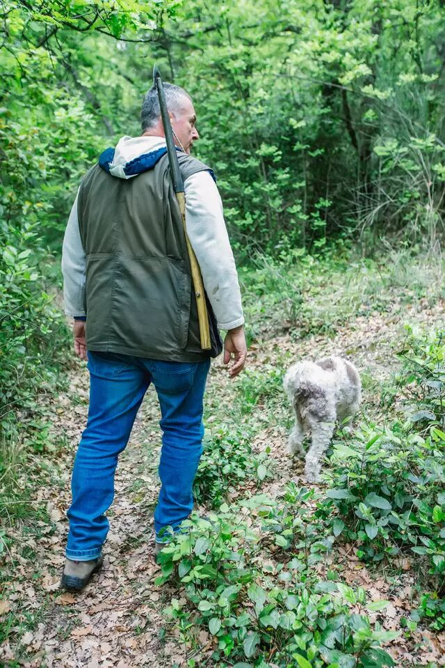

Giulio has had experiences with his grandfather since he was a child. He has been in the forest for decades and holds a professional certificate.

Every morning at 5:45, he takes his cute dog Eda and sneaks into the forest to find **a more precious fungus than gold — truffles**.

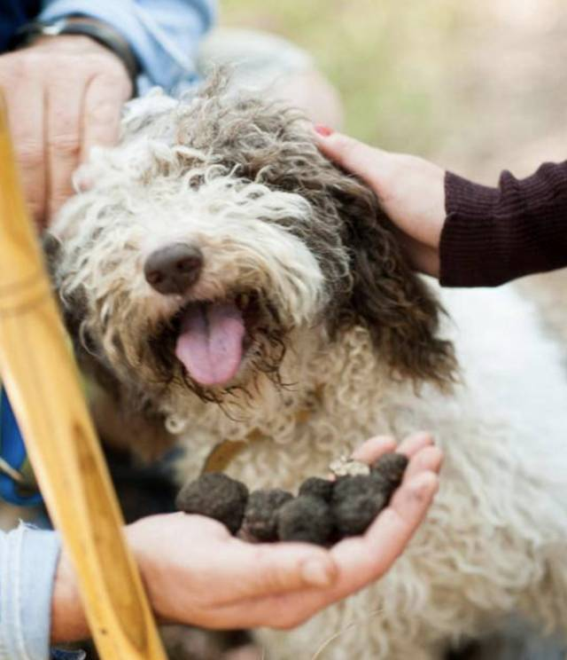

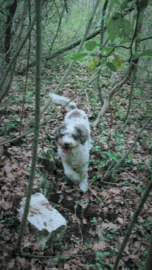

This is his beloved hound Eda, and every truffle hunter has an indispensable partner — a dog or pig with a very well-developed sense of smell.
At first glance, Eda looks like a cute pet dog.

**"Don't look at her as little! She's amazing**!" This female hound, after Giulio's long-term professional training, can quickly sniff out the truffles buried deep under the roots of the trees, separated by leaves and dirt.

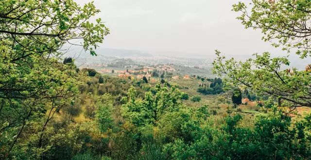

Giulio loves Eda and also Truffle, a business that can make him money.

They live on a hill five kilometres from downtown Florence, located in the small town of Agnopoli in Bagno.

**A Gourmet Adventure**

For the next two days, I wanted to find the gourmet truffles that are sold in New York, London, Australia, and to follow the professional truffle hunter to find **luxury and precious ingredients**.

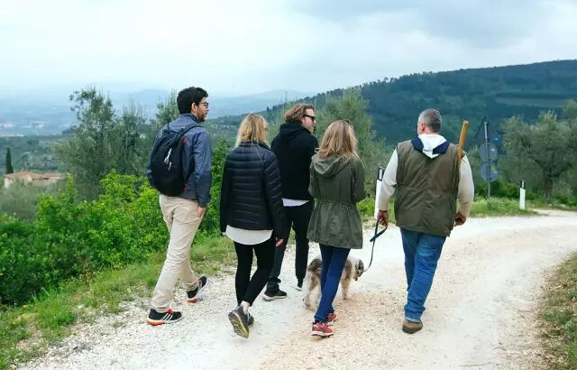

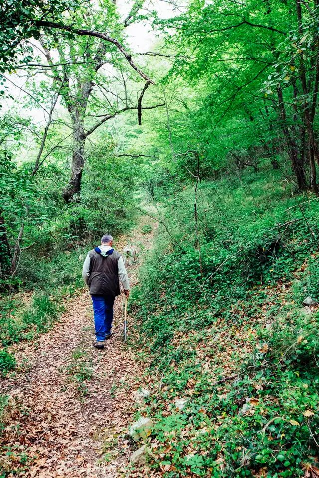

Before me was a forest trail and I didn't know where to go. "Eda and I are running in front, you are behind."

We stepped on the dead leaves, opened the branches in front of us, bent down and jumped down a slope of soil; there was a breeze in the forest, and **a kind of excitement about running on the treasure hunt map to find secrets**.

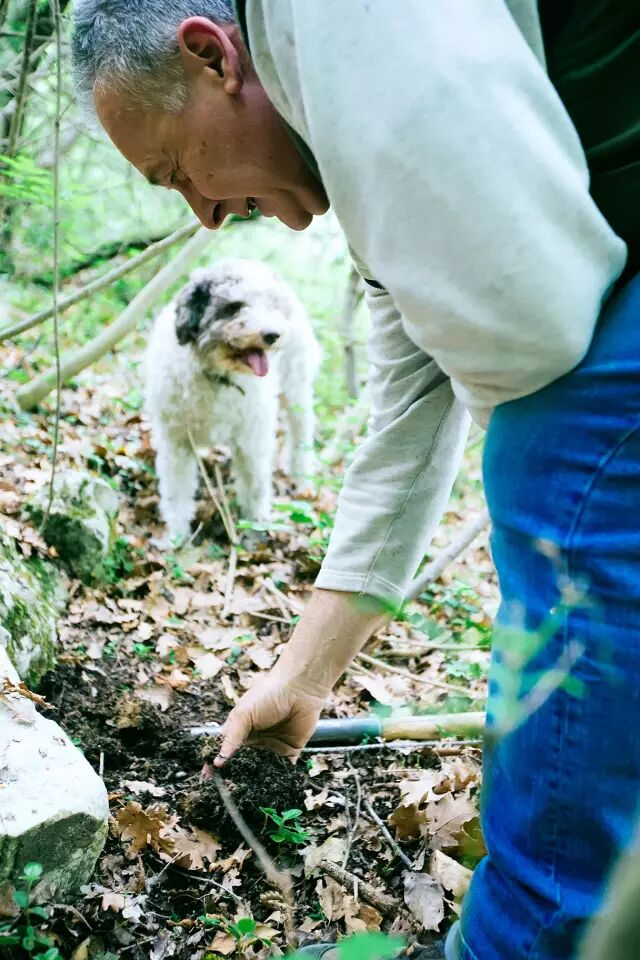

Eda ran up, suddenly stopping under a tree, circling, sniffing, using her claws to dig the soil, and calling her owner using two signals.

Giulio bent down and, in the place where the soil was ploughed, he pulled the loose soil out by hand and a black truffle was revealed.

"Found one!" Everyone was pleasantly surprised and cheered like children.

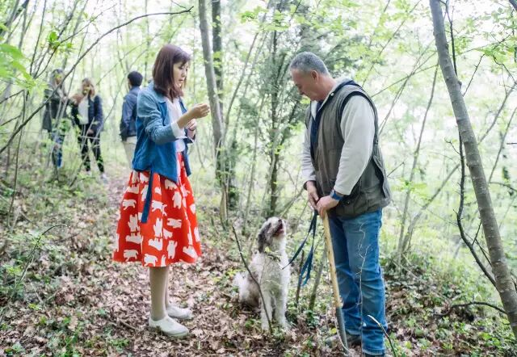

One after another… We dug up four or five truffles of different sizes that day, and Giulio gave me the biggest one. It was the size of an egg yolk and very fresh. My companion joked with me, "Is this a few thousand euros?"

Guo Dazhao, who reminded me to participate in the truffle experience, said, "If you dig one, you will get the money back…"

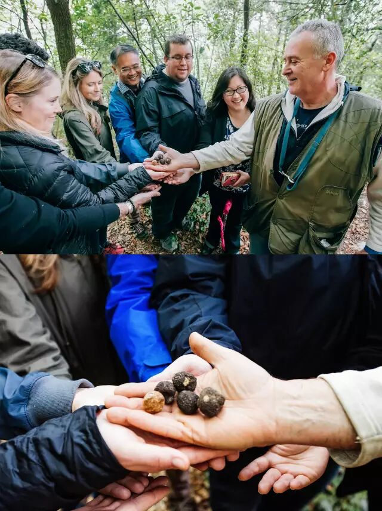

**Have a Truffle Meal**

Lunch was a feast of truffles.

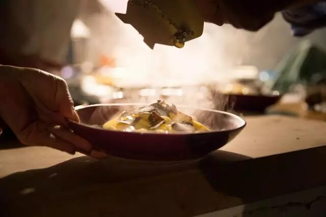

Giulio took us back to his villa and I helped to cook. In every dish he put a lot of truffles without hesitation.

The first dish of the day was a black truffle fried egg made with farm eggs, which was absolutely delicious and had a rich taste.

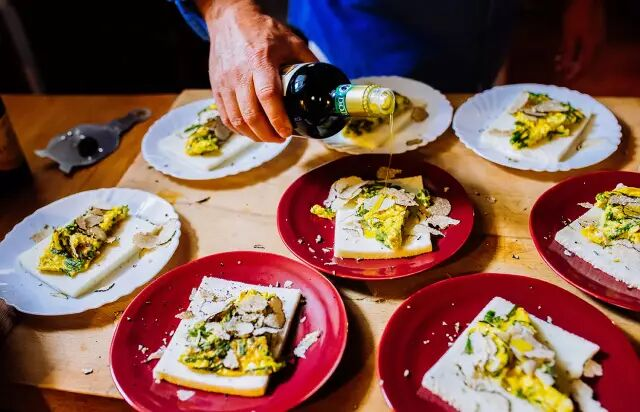

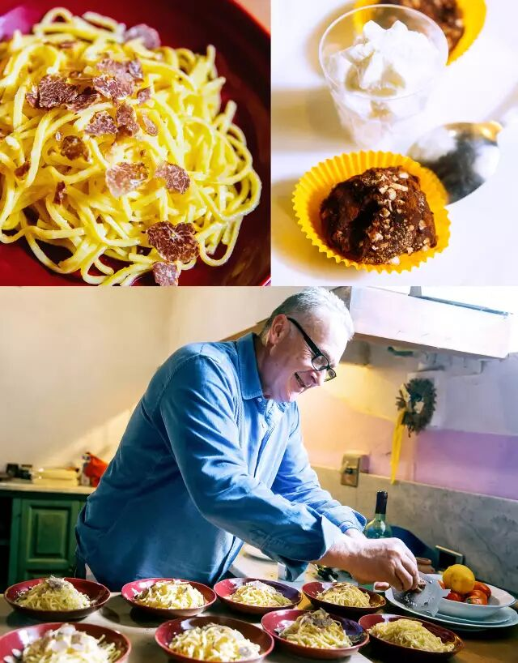

The main dish was black truffles with pasta, and we were all totally addicted. For dessert there was truffle ice cream and black truffle chocolate cake. Everyone finished eating, and Giulio's face was a picture of satisfaction.

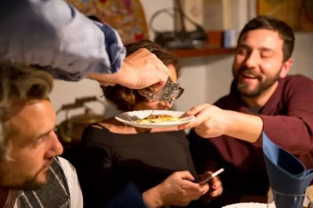

**"Increase Your Knowledge and Learn Something New."**

The experience was spread across one and a half days. For another half day, Giulio invited us to a fine winery and told us why truffles are "**diamonds on the table**".

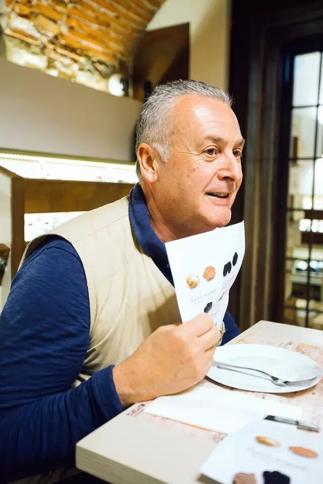

He talked about the smell, colour, season and environment of each truffle. Every time he finished one, he would slice it himself, on the bread and cheese, topped with his homemade truffle oil, and let us taste it.

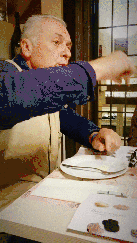

Each truffle was served with a glass of his carefully selected red wine; we drank Barbera implicito Walter Massa and Chioccioli chianti Classico riserva that day.

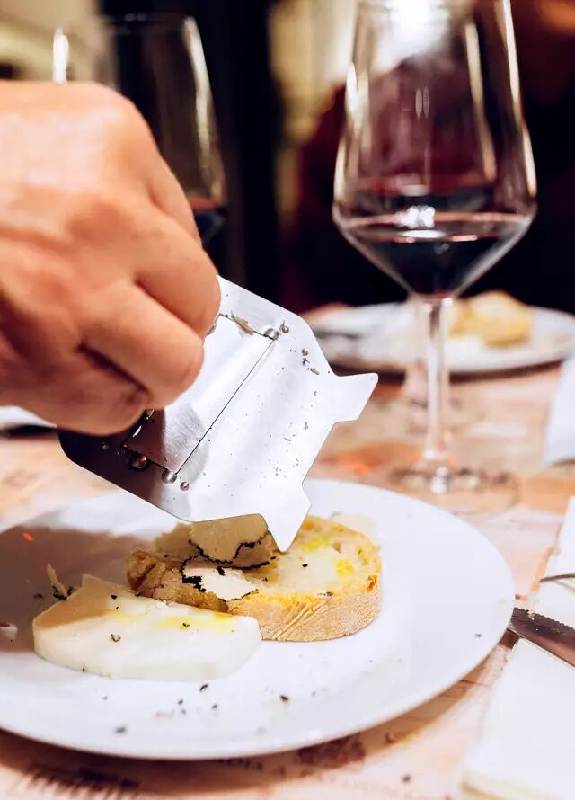

The rich truffles made our sense of smell and taste more addictive. Seeing the nod of our compliments, Giulio stood at the table and smiled happily.

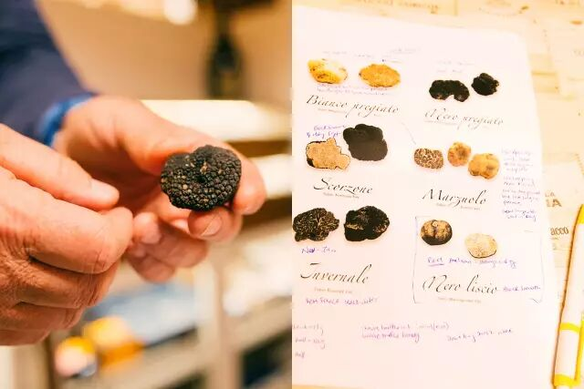

I took a note of the paper in a whisper, immersed in the unique taste of truffles — complex and even psychedelic multiple tastes.

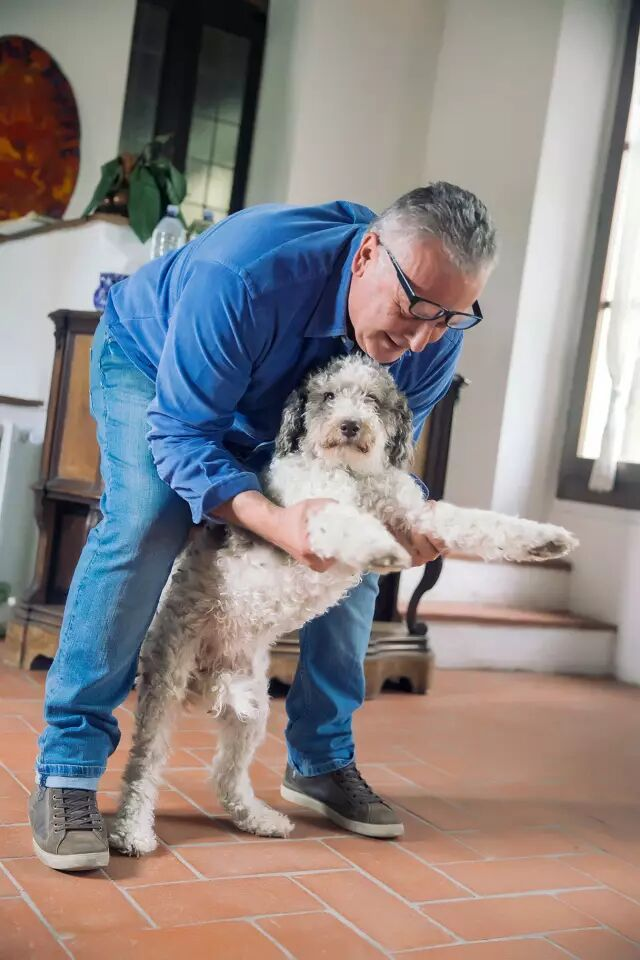

Finally, Giulio read to us the truffle novel he is about to publish. In the sound of music, the poet and writer danced with Eda and sent us off. This experience can be described as a "human boutique", which is wonderful.

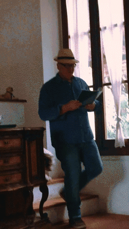

**I Want to Share**

This time I went to Florence, I wanted to take the literary line, but I was pollinated by the Airbnb experience. I tried the first one and I was out of control. I can't help but share it with you.

I still remember seeing these experience videos on the Airbnb app for the first time. I thought, "This is the trip I want." I watched the experience projects around the world's insomnia that night, and my heart flew away.

In addition to the truffle tour, I also participated in many interesting experiences in Italy this time:

- I did the photo walk twice with the handsome local photographer;
- I handmade an Italian pizza and ate it;
- I went to the vegetable market to buy authentic ingredients and made a ten-hour pasta in the locals' home;
- And the fourteen-year-old tango dancer participated in a night party for a hundred people;
- I re-traced the map of Hepburn in Rome and filmed a small movie, *Roman Holiday*.

Everyone was very charming. Wait for me to write a story for you to see.

Every experience makes me believe what Airbnb said when I launched this product.

"**Travel should also be full of magic, but it is easy.**"