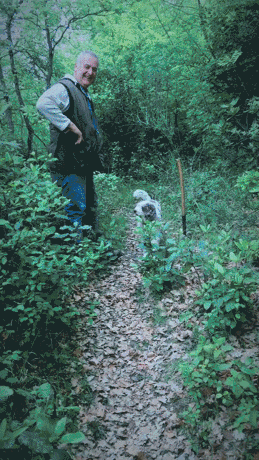
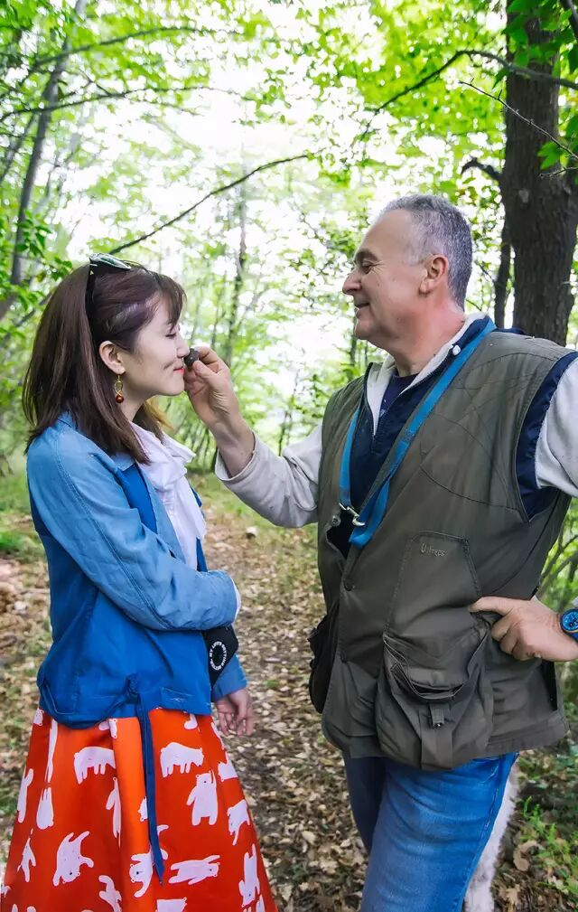
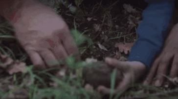
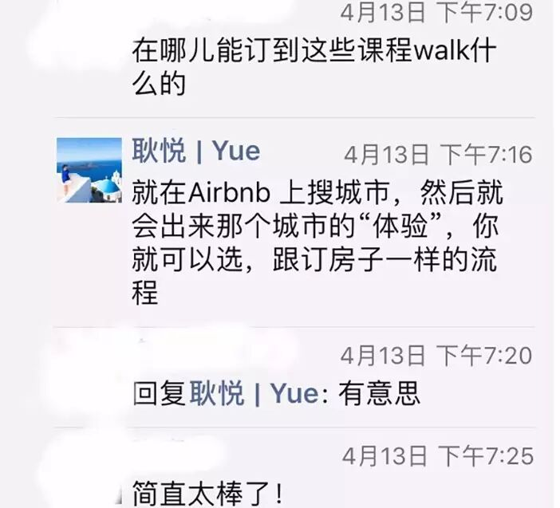
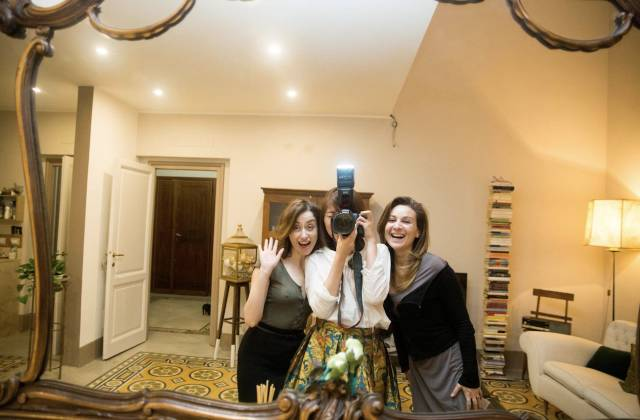
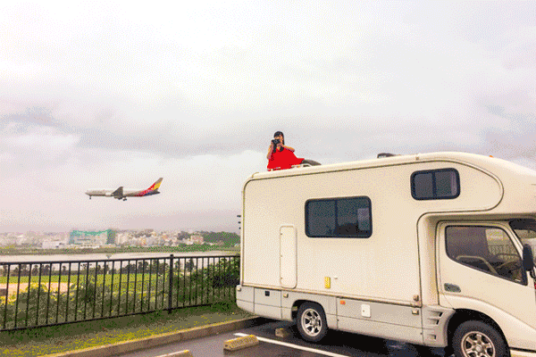

# 美食 | 和松露猎人，穿越佛罗伦萨的森林去探险。

*Geng Yue · Travel Stories*

我在意大利旅行

最激动人心的一次爱彼迎旅行体验

就是和松露猎人Giulio一起，带上猎犬Eda，潜入森林亲自现采松露！

再烹饪出一桌比黄金还昂贵的大餐！

☘

Giulio让我闭上眼睛。

"Yue，你猜一猜，哪一颗是白松露？"

**"香气和香味，是吃懂松露的第一法门。**

我最初开始学习松露时，也被人用黑布蒙上双眼，送入森林。"

他手中有一黑一白两颗松露，调皮地切换。"猜对了，就赏你们一顿松露大餐。"

我闻到一股略微带有胡椒味道的香气，同时夹杂着林间灌木的香味。

"这颗是白色的。"

**神秘的松露猎人**

一天前，我刚结识了这位意大利松露猎人Giulio Benuzzi。

他从小就有和祖父一起采集的经验，在森林里呆了几十年，持有专业证书。

每天清晨五点四十五分，他会带着他的萌狗Eda，潜入森林，去寻找**比黄金更珍贵的菌类**——松露。

这是他心爱的猎犬Eda，每个松露猎人，都有一个不可或缺的合作伙伴——嗅觉非常发达的狗或猪。

Eda第一眼看上去，很像一只萌萌的宠物狗。

"**别看她小！厉害着呢！**"这只雌性猎犬，经过Giulio的长年专业训练，每一次都能很快地隔着落叶和泥土，嗅出深埋在树根下的松露。

Giulio爱Eda，也爱松露这个能给他带来滚滚财源的事业。

他们居住在距离佛罗伦萨市区五公里的一座山丘上。位于巴尼奥阿里波利小镇。

**一场美食探险**

接下来的两天，我要和来自纽约，伦敦，澳大利亚的美食迷，跟着这位职业松露猎人，去寻找**奢侈珍贵的食材。**

在我眼前的，是一条不知去向的森林小径，"我和Eda在前面跑，你们在后面跟上。"

我们踩着枯叶，扒开眼前的枝条，弯腰跳下一片土坡，耳边是林间的清风，**有一种在寻宝地图上奔跑，寻找秘密的刺激和兴奋。**

Eda跑起来，它突然停到一颗树下，转圈，嗅一嗅，拿爪子刨刨土，向主人叫了两声发出信号。

Giulio弯下腰，在刨土的地方，用手把松土拨开，一颗黑松露就露出来。

"真的找到了！"大家仿佛小孩子一样惊喜和欢呼。

一颗又一颗...那天我们挖到了四五颗大小不一的松露，而当天最大的一颗，Giulio送给了我。

有蛋黄大小，非常新鲜。同伴跟我开玩笑说，"这是不是几千欧啊？"

当初提醒我参加松露体验的郭大喵留言说，"你挖到了一颗，就基本值回票钱了吧...."

**吃一顿松露大餐**

午餐是一场松露的盛宴。

Giulio带我们回到他的别墅，亲自下厨，每一道菜他都毫不吝啬地放了很多很多的松露。

当天的头盘，是用农家鸡蛋做的黑松露油煎蛋，非常鲜美，浓郁的味道回味无穷。

主菜是黑松露配意大利面，我们都大呼过瘾。最后的甜点里有一道松露冰淇淋，黑松露巧克力蛋糕。每个人吃完，脸上都是大满足的神情。

**「涨知识」**

体验共分为一天半。另一个半天，Giulio把我们邀请到一个高级酒庄，告诉我们松露为何是**"餐桌上的钻石"**。

他娓娓道来每一种松露的气味、色泽，所生长的季节、环境。每讲完一种，他会亲手切片，并在面包和奶酪上，淋上他自制的松露油，让我们品尝。

每一种松露，搭配一杯他精心选的红酒，那天我们喝的是Barbera implicito Walter Massa 和Chioccioli chianti Classico riserva。

浓郁的松露让我们的嗅觉和味觉都过足了瘾。看到我们连连称赞的点头，他站在桌旁开心地笑。

我在微醺中地记了一页纸笔记，沉浸在松露那种独有的味道——复杂且甚至迷幻的多重味觉中。

最后，Giulio为我们阅读他即将出版的松露小说。在音乐声中，这位诗人和作家，和Eda一起跳舞，为我们送行。这次体验可以用"人间精品"来形容，美妙不可言说。

**我想分享**

当我在朋友圈直播这场挖松露的体验时，很多朋友留言问我如何订上好玩的爱彼迎旅行体验？

这次去佛罗伦萨，本来是想走文艺线路，但被Airbnb Experience圈粉了，尝试了第一个，就一发不可收拾。忍不住分享给你。

我还记得第一次在爱彼迎的app上看到这些体验视频，心想**"这是我想要的旅行"**，我那晚上失眠地看了好多个世界各地的体验项目，心就飞走了。

除了这次松露之旅，我这次在意大利还参加了很多个有趣的体验：

- 和当地的帅哥摄影师走了两次Photowalk；
- 亲手制作了一个意大利披萨并吃掉；
- 去菜市场买地道食材，在当地人家里一起做了10个小时的意面；
- 和跳舞14年的Tango舞者，参加了一个百人的夜间狂欢舞会
- 在罗马重走了赫本的地图，拍摄了一部"罗马假日"的小电影

....

每一个都很迷人。待我后面写出故事给你们看。

每一次体验，都让我很相信Airbnb推出这个产品时说的那句话，

"旅行也应该是充满魔力，而又很容易的。"

原创撰稿 / 摄影 / 视频动图

**耿悦**

拍摄设备

**Canon 6D / Gopro / iPhone**

服装支持

衬衣+外套 **【燕遇】旅行复古服饰**

裙子 **【Mint Cheese 】独立设计**

