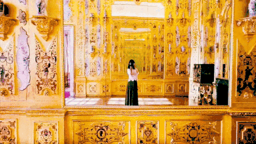
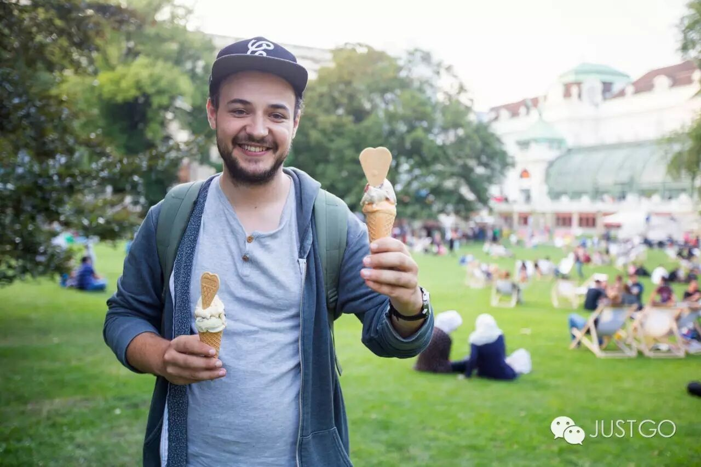
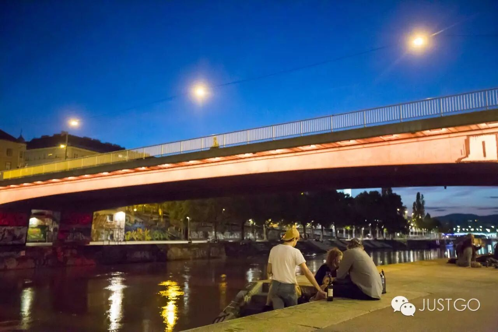
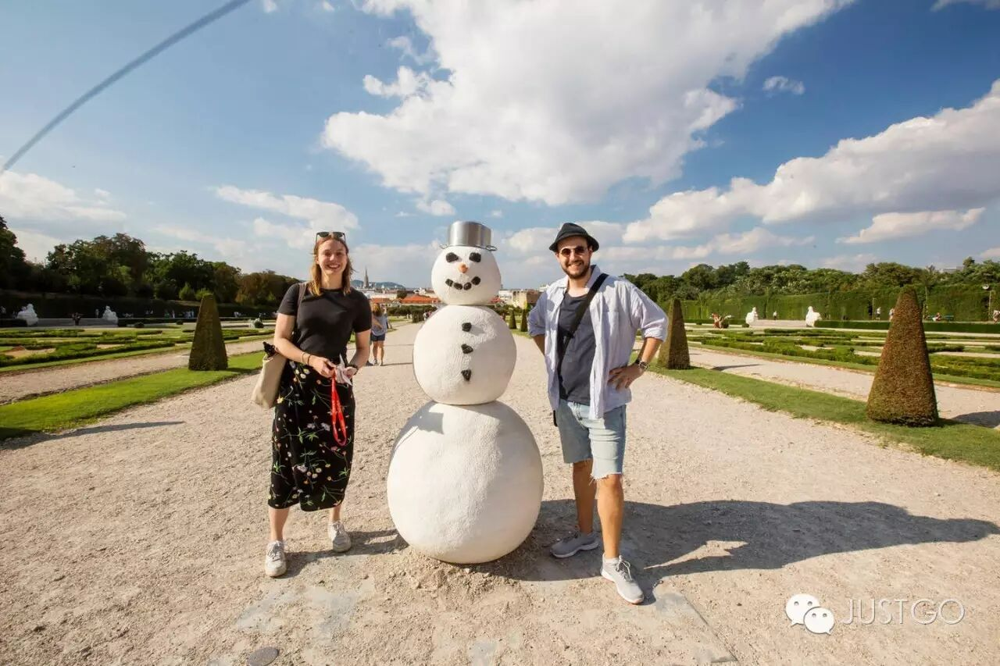
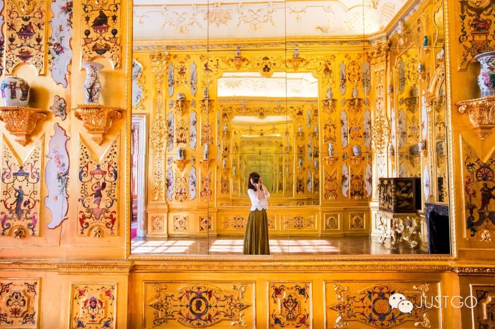
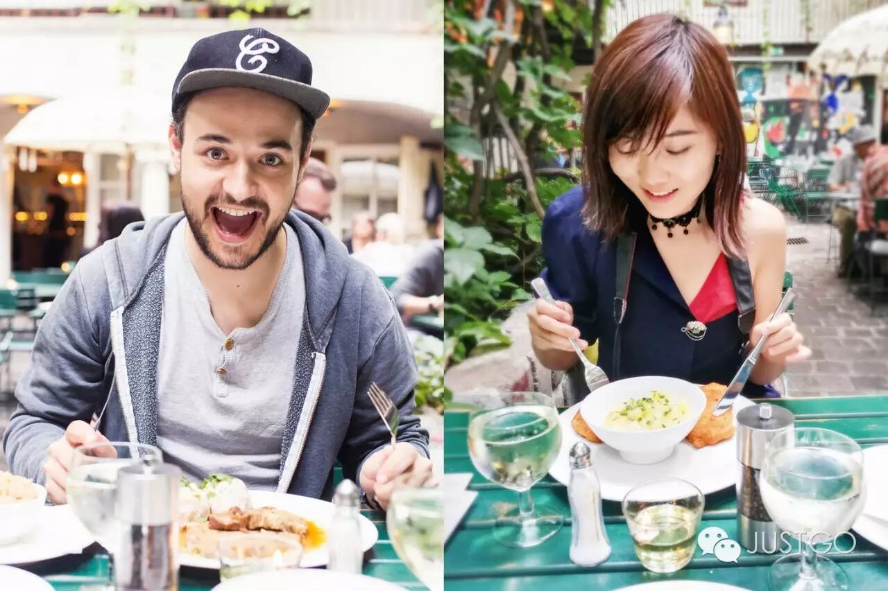
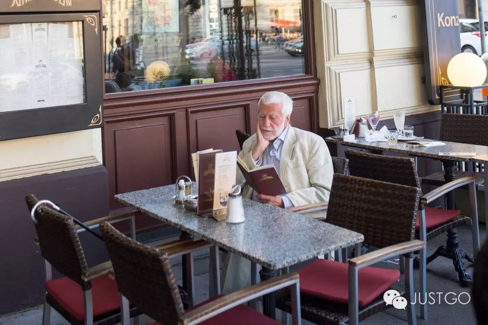
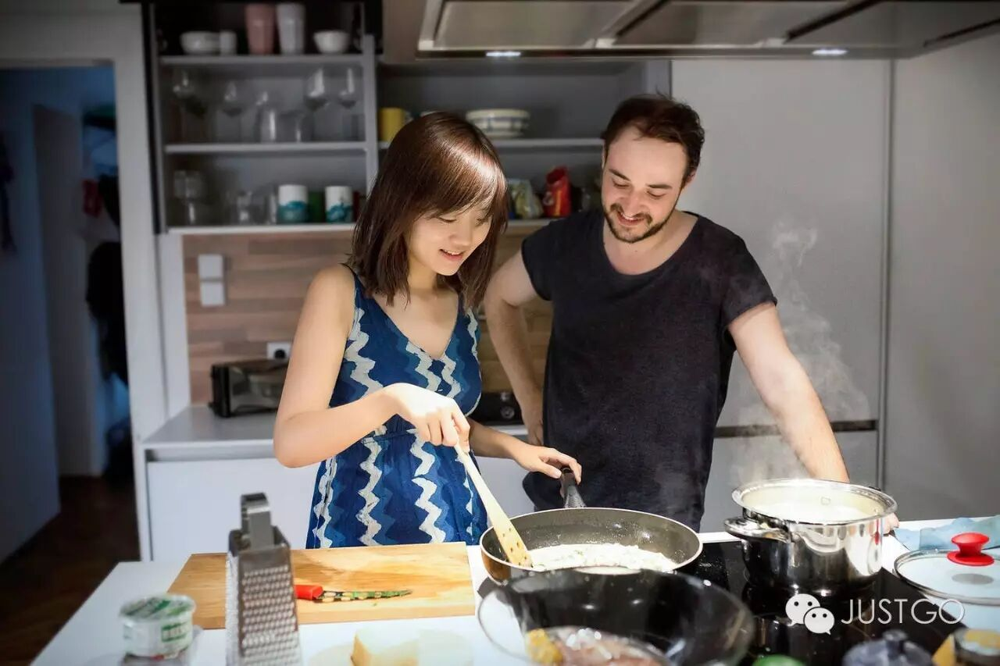

# 我的第一个视频旅行故事：和维也纳房东的3x24小时

*Geng Yue · Travel Stories*

🎬

这是我做的第一支完整的旅行视频。导演、摄像、剪辑、字幕，配乐都是我。拍的也是自己。

你会看到我的笨拙，和真诚。

**有必要的澄清**

在读这篇美好的故事前，我想说。这篇故事我花了不少时间，也受到了不小伤害。在某平台发布后，很意外地收到了很多恶意人身攻击，脏水，甚至「意淫」。

那我也发个毒誓吧：如果我和这位维也纳男房东，还有我住过的所有Airbnb民宿的房东，有任何超越房客和普通朋友的一丁点关系，我也可以“全家暴毙，出门被车撞”，眼睛瞎一辈子看不到好风景，接受最恶毒的诅咒都没问题。

嗯。心里无比坦荡荡。

**因为一个房子和房东，我爱上了一座初次见面的城市。**

这是我和Airbnb房东克克的故事。在维也纳的3x24小时里，我们每天一起探索城市。我仿佛在陌生的维也纳拥有了一位熟悉的朋友。

我最喜欢的电影**爱在黎明破晓前**，男女主角的相遇，就在维也纳发生。虽然我没有在这座浪漫的城市里邂逅一份爱情，但碰到了一见如故且相谈甚欢的房东。

如果有人问我，你在维也纳遇到过最好的旅行是什么样子的，我会告诉她就是这样子的。**有很多个瞬间，我觉得自己就生活在这里。**

🍺

**“想遇见全世界最精彩的人”**

第一天傍晚，克克和我沿着多瑙河散步，看河水漫漫地流淌，灯火一点点明亮。

我想起电影里，Jesse 和Celine 也曾这么随意地在河边踱着步，偶遇了一位像流浪汉的诗人，

随口作着短诗：“只管拥抱生活，就像溪流终要汇入江河……”

克克跟我聊起他做房东的初衷和梦想，

“想遇见来自世界各地的精彩的人，房东和房客**一起去经历、探索，一起聊令人激动的谈话，拥有新鲜的体验……**让初次来的旅人，遇见最熟悉这座城市的当地人，在异乡也仿佛有一个家。”

我听得热血沸腾。我在大雨中偶然定了一间房子，没想到遇到了一位超赞房东！**“对的时间，对的地点”**，**在多瑙河畔干杯。”**

🎨

**文艺女青年暴走文艺之都**

这一天的主题是艺术，“我根据每个人的特点和喜好来推荐，你是摄影师，最适合你的就是去看展览，看摄影原作！”我们去贝尔维德宫，看维也纳最有名画家克林姆的「吻」真品 ，一路还看到很多名家珍藏的艺术品。

**克克的女友Cathi，**是这里的工作人员，特意给我开放了VIP，使我成为整个美术馆里唯一能拍照的摄影师！我在一片灿烂金色闪闪动人的梦幻世界里流连忘返。

克克说，“我再带你去个资深文艺青年会喜欢的地儿。”我们就到了以文艺出名的第七区，沿街都是特色小店，手工艺的小摊，太是我的调调了。

各种充满创意的小玩意、小商品大多都是手工制作的。手工艺人和我们讲制作背后的故事，逛一下午都逛不够。

🍴

**要吃就吃当地人爱的**

我列了必尝的美食清单，最想尝排名第一的国菜——炸猪排！克克就带我去了一家他最推荐的，没有游客气氛，性价比超高的花园餐厅。

了解维也纳，最好的方式就是泡在咖啡馆。

**" 如果我不在咖啡馆， 就在去咖啡馆的路上。**"**

奥地利诗人彼得‧ 艾顿柏格

在阳光灿烂的午后，克克带我来到了环城大道上最古老的咖啡馆，1861年就开张的店。

我们喝了招牌的咖啡，吃了奥地利甜点。不赶时间，就在这里坐了一下午闲聊。我发现“老维也纳人” 会在咖啡馆坐上几个小时，聊天、谈工作、看报纸……

🍝

**热爱生活的人，厨房是热气腾腾的**

抱着市集上买回来的新鲜食材，我们决定晚上在家吃。我顺便跟克克学习他拿手的意面。煮面时，我们聊起来为啥他这么喜欢维也纳，他说：

“我想要住下来的城市，没有糟糕的空气，没有污染，有极方便的城市设施，有最棒的文化氛围和音乐。虽然哪里都有生活的压力，但是你有健康的食物、自由的呼吸，和好好生活的方式。这里很适合对生活生机勃勃的年轻人，特别是学生。”

我听完对维也纳的爱又增加了好几分！克克做面手艺很赞，原来曾经有一位意大利房客住在他这里，教过他正宗意面的做饭和家乡秘诀。

晚饭后，克克邀请好友们来家中喝酒聊天，他们的社团开会，也会叫我一起参加。聊着聊着，我们突然发现，彼此居然都是Airbnb的超赞房东，惊讶之余，我们兴奋地分享着做房东的一段段奇妙经历。

**🍅爱上生活的烟火气**

第二天，克克的多年好友来探望他。我们三人去逛当地最著名的市集Naschmarket，在活色生香的菜市场里转，买带有本地气息的瓜果蔬菜香料。

他一路热情地跟我分享给小常识：你可以一边走，一边沿街品尝这120个小摊店主递给你的小吃，但只要你停下来，就需要买点儿什么。我像个当地人一样自由穿梭在市集里……看到维也纳人坐在传统的木酒桶边喝酒。

逛累了，我们就在路边的餐厅坐下，吃着沙拉，聊着逛市集的好玩点滴。

🍦

**这么慢，那么美**

我们坐在郁郁葱葱的参天大树下，草坪的躺椅上，享受着旅行的小确幸，吃着冰淇淋，每一口都是美妙的维也纳。

在阳光和音乐流动的公园里，我再一次看到了这个城市里，人们悠闲放松在生活的模样：在草地上野餐，玩滑板，喝东西，带着孩子嬉戏……生活是这么慢，那么美。

克克的房子叫 “拥抱维也纳”（Hug Inn Vienna）, 告别时我们来了个大大的拥抱。

我们一起体验的每一件事，都是对这座陌生城市的一次次拥抱。说到底，一座城市，只是地图上一个遥远的点，

**而人与人之间的邂逅、连结、发生的故事，交付的信任**，才让这座城市变得柔软、喜悦、闪亮，

回忆里泛起温柔的生活气息，真的放进你心里。

> Airbnb 合作 · 维也纳 · 2016-12-02
