# 沙漠钻石酒店 · 重启：回归内心宇宙

宁夏，中卫，腾格里沙漠，北纬 37°28′。

**素材授权**：本文图片与文字由「沙漠钻石酒店」品牌方及「水石设计·米川工作室」（主创建筑师 谢湲）授权提供。

---

<table><tr><td>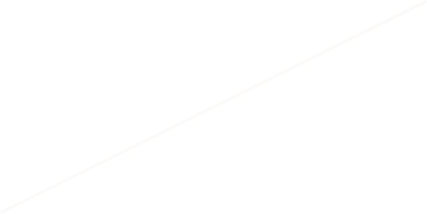</td></tr></table>

宁夏，中卫，腾格里沙漠，北纬37°28′。 想象下，从北京、上海、成都等主要城市出发，仅需两个多小时飞行，便可直达中卫沙坡头机场。没有长途跋涉的疲惫，只有时空切换的奇妙。 当飞机划过“金色海洋”，从空中俯瞰，30座纯白的几何体，如同一串散落在沙海间的星辰碎片，又似一艘刚刚着陆于异星的白色方舟，以神圣的韵律感铺陈开来。 这不是传统意义上的酒店，「主创建筑师」谢湲说：“它带有一点超现实主义色彩，是科幻的，也是浪漫的，更像是一部太空史诗的恢弘开篇，正在缓缓‘降临’。” 抵达的第一秒，世界如此纯粹。这正是它的独特——“无”。无城市、无噪音、无边界。 无尽的流沙，无尽的纯白，无尽的苍穹。 你将开启一段奇观式的、与众不同的旅行体验，并发现自己正进入一个完全不同的维度。谢湲认为，这种力量，将引导你回归内心的宇宙，重获能量，抵达心灵自由。

<table><tr><td></td></tr></table>

## 01. 沙与钻

<table><tr><td>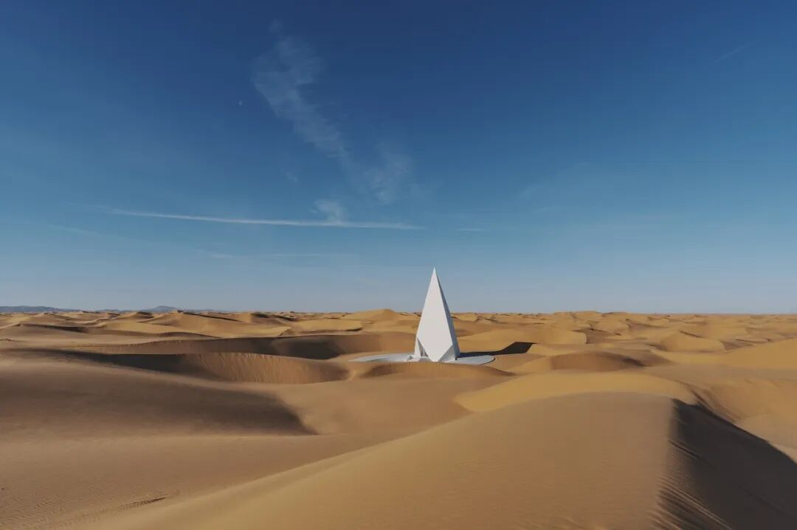</td></tr></table>

老子言：“天下之至柔，驰骋天下之至坚。”流动的沙，至柔至简，代表着生命的无常与包容；而屹立的钻石，至坚至永恒，象征着内在的坚定与光芒。

<table><tr><td>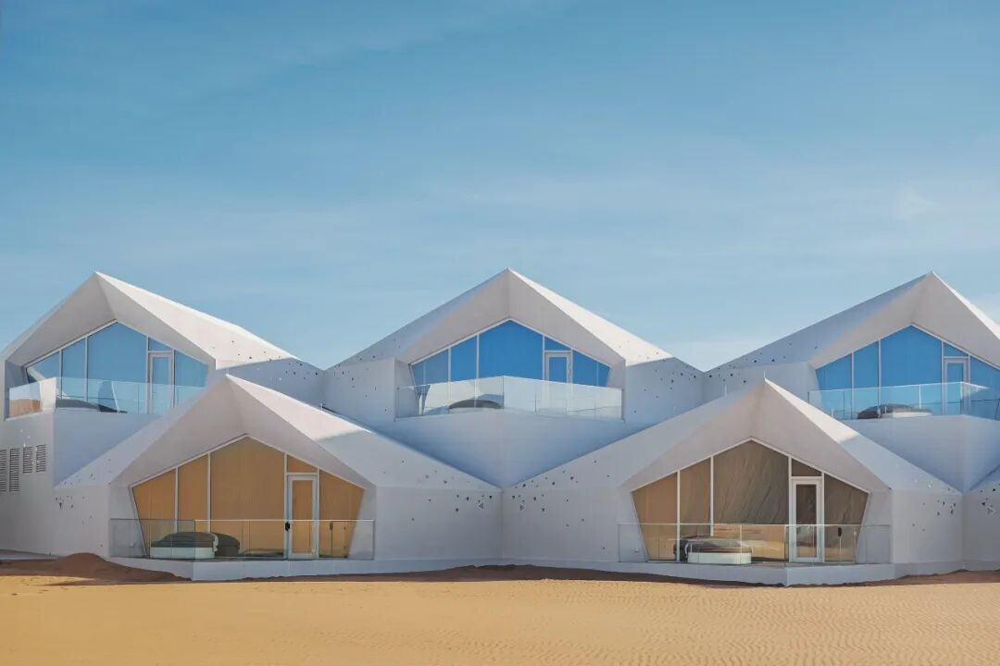</td></tr></table>

建筑师带着对自然的极度敬畏，让它“蛰伏”在沙丘之中。沙漠极富韵律的柔和曲线与建筑锋利的几何雕塑感母题形态之间，形成一种微妙的戏剧性张力，像有棱角的生命被大自然温柔的包容着。这是「水石设计米川工作室」，打造的一个「心无旁骛」的建筑，非同寻常的酒店杰作。

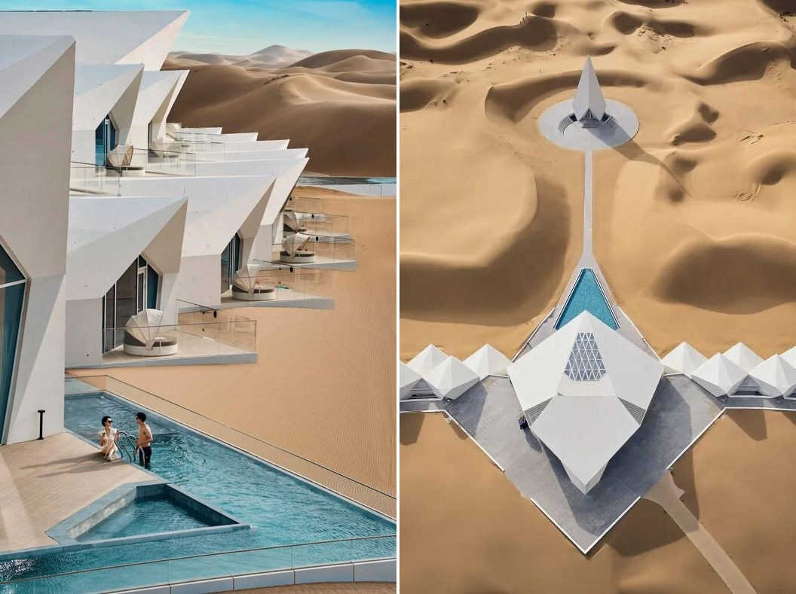

酒店的设计灵感，便源于钻石的品质。“ada mas”源自希腊语，意为“不可战胜”，这枚在沙漠中打磨而成的金刚石，是坚定不移的信仰与不屈意志的象征，能抵御烈火与钢铁，也代表着永恒。它以一种超然的姿态，建立起一个最纯粹、坚固与永恒的所在。 走进大堂，如同进入钻石之心。公共区域的建筑是一颗拥有27个切面的巨大“钻石”，入口门厅在无数次镜面反射下呈现出迷离璀璨的光泽，让你领略着一种超现实的奇幻体验。

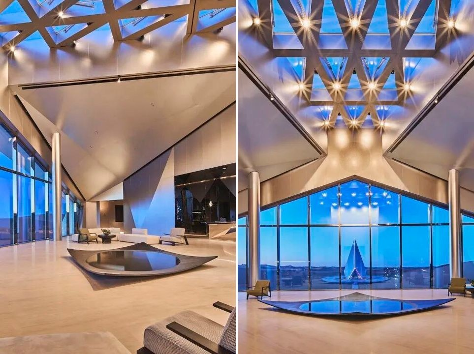

当你微微抬头仰望，在穹顶的视觉聚焦之处，是一个纯粹的圆环，如同禅宗的“圆相”(Ensō)——一个内部空无一物，却包含了宇宙的初始与一切可能性。 你或许会在这里顿悟，《金刚经》所言的“无所住而生其心”，是如何一种专注又强大的磁场。这是一个能引导你从外部世界的纷繁，进入内在世界澄澈的能量“场”。

<table><tr><td></td></tr></table>

## 02.

### 星钻： 安住于细节的奢华

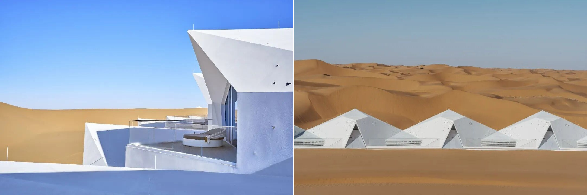

每一间客房都以一颗钻石的形状呈现。推门而入，79平方米的宽敞空间、干净的配色与钻石切割面般的墙体，在阳光的映衬下，兼具了高级质感与舒适感。

<table><tr><td>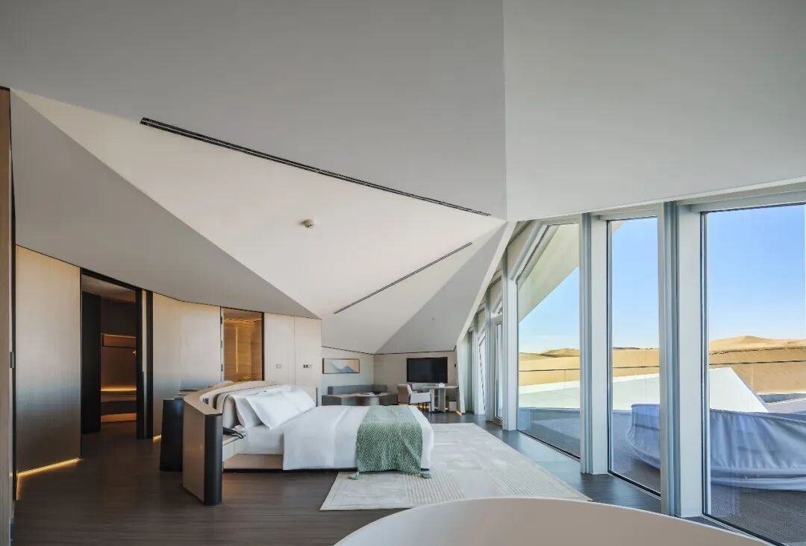</td></tr></table>

三十间客房在中轴的左右两翼沿弧线展开，通过依次偏转5度，使得每间都拥有不同的观沙视角。这里的奢华，是一种对感官的深度尊重与呵护。

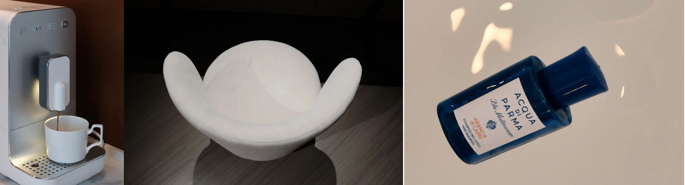

全套帕尔玛之水洗护备品，以柑橘香气开启身心愉悦的仪式；戴森的吹风机和空气净化加湿器在沙漠环境中创造宜人湿度； 用斯麦格全自动咖啡机放入云南咖啡豆，随时能享受到一杯手磨咖啡的醇香；慕斯床垫监测着你的睡眠质量，而冰箱里早已备好精致的小食与饮品。

<table><tr><td>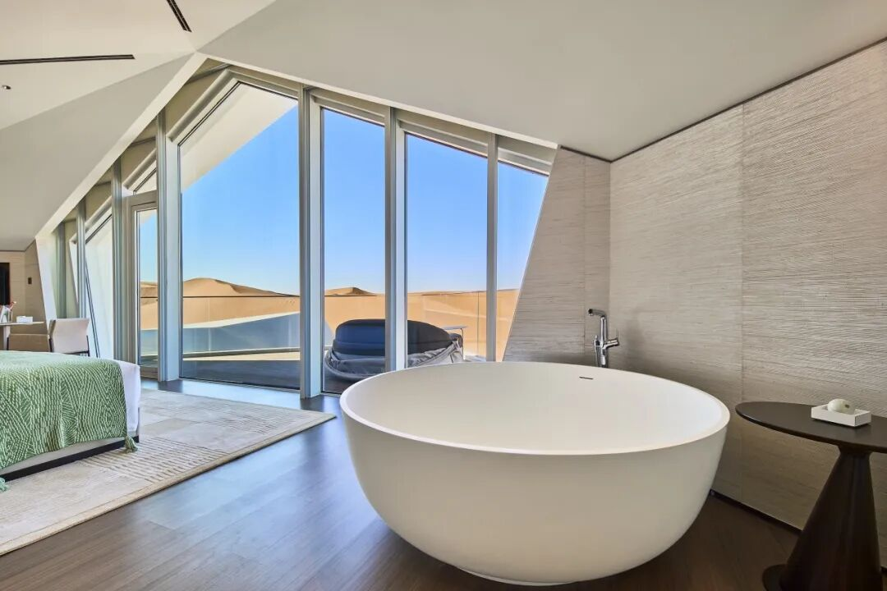</td></tr></table>

在客房巨大的落地窗旁，都有一个可以望向无垠沙海的独立浴缸。当温热的水流将身体包裹，你可以静观窗外变幻无穷的沙海光影——有时是正午耀眼的金色，有时是黄昏温柔的玫瑰色，有时是深夜清冷的月光银。 蓝钻： 一个独享的私人宇宙

<table><tr><td>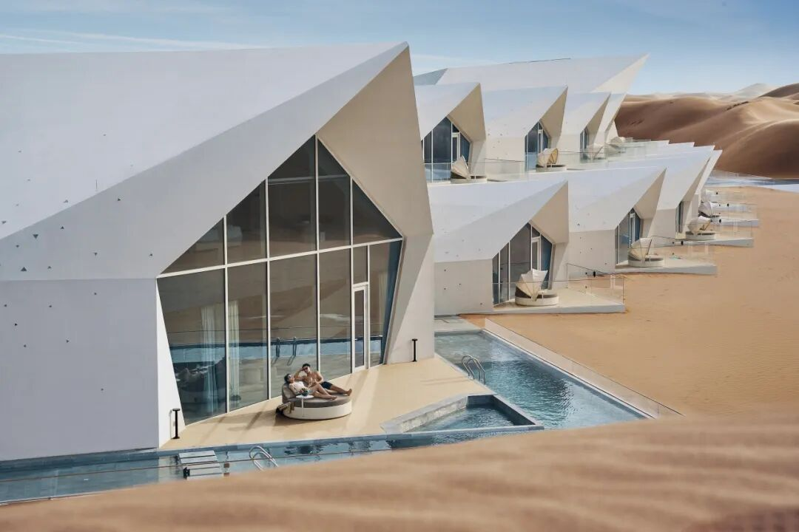</td></tr></table>

266平方米的蓝钻套房，则是这种私密体验的升华。复式空间通过一条艺术品般的螺旋楼梯上下连接。

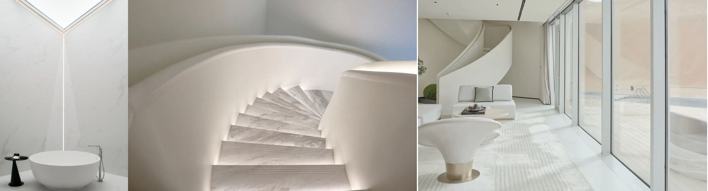

真正的奢华，是让客人感受到，他们值得世界上最独特的对待。唱片机流淌着音乐，24小时私厨定制菜单，可以在精致空间，尊享品质与野奢的理想意趣。

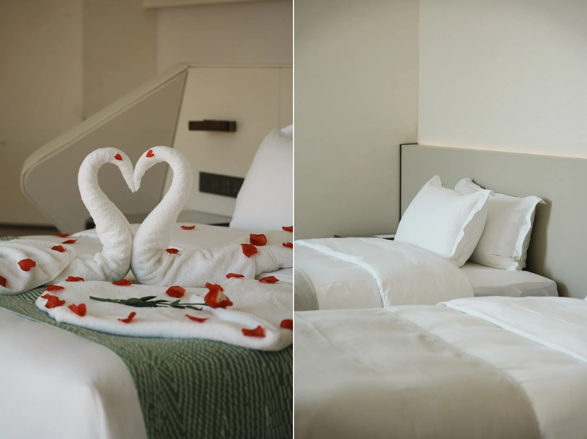

这里拥有独栋的私密感，可由越野车直达入户，作为独立的婚礼套房使用。可以在独立的私人泳池与恒温泡池里，享受一种不在地球的美。

<table><tr><td>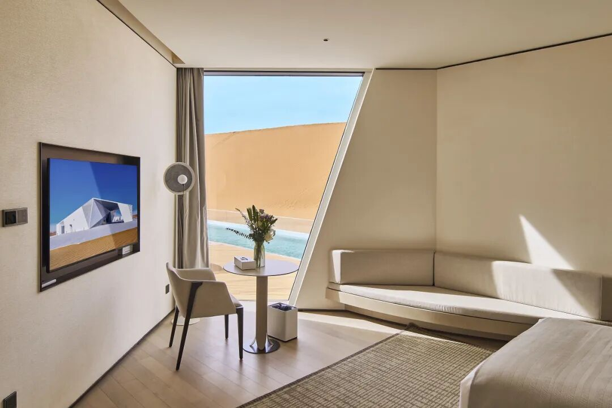</td></tr></table>

步入二层的浴室，还有一个惊喜——这里特别设计了一个带有天窗、仪式感造型的浴缸，透过天窗沐浴星光。 和自然对话

<table><tr><td>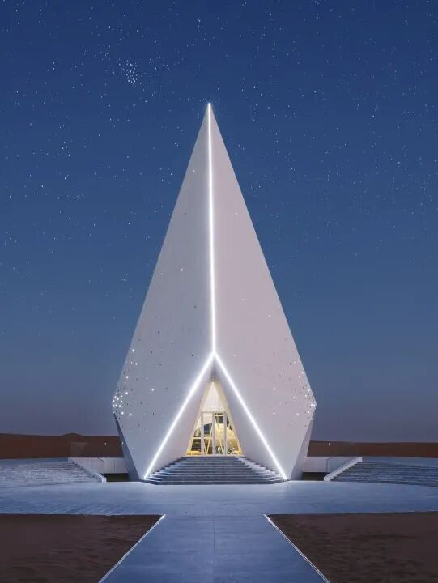</td></tr></table>

好的建筑也会和风景对话。在你的视线之内，几乎没有任何多余的装饰——真正的奢侈，是让自然成为主角。

<table><tr><td>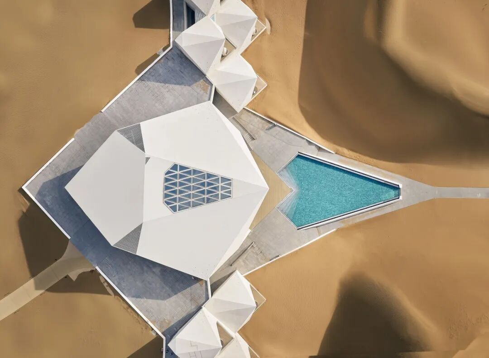</td></tr></table>

星钻套房的阳台直达沙海，让身体无限接近自然，感受与沙漠近距离接触的震撼。当你身处居所，你感觉自己仿佛住进了一块被阳光温暖过的、巨大的乳白色水晶里。这份安全感让你得以彻底放下身体的防备，全然地安住于此。

<table><tr><td>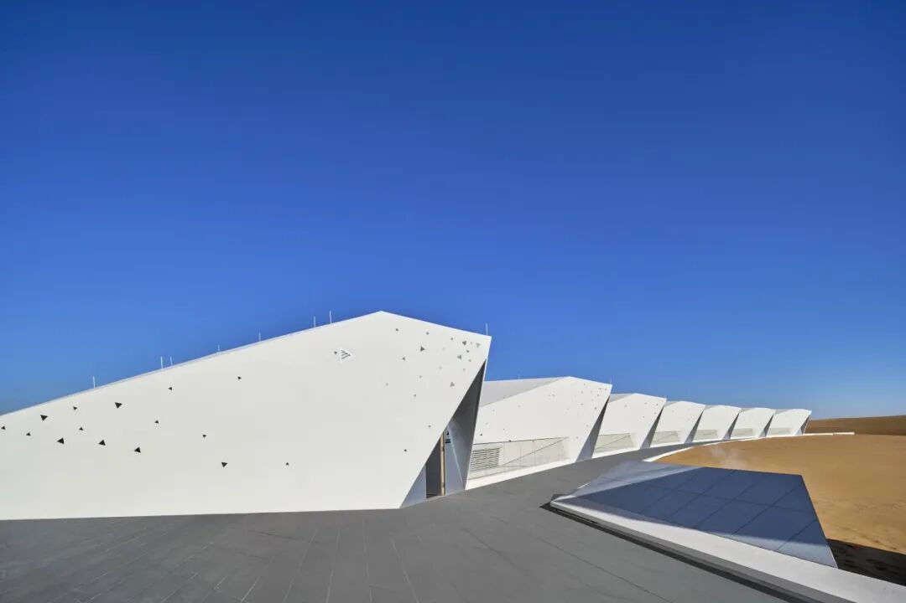</td></tr></table>

在能屏蔽一切杂念的能量区域里，也许会直面内心，思考平日里从来不会思考的问题。也许时间仿佛失去了意义，只是单纯地“在”。 酒店的纯白并非一成不变。在阳光下，可以看到微微闪光的矿物质感颗粒，就像烈日下闪烁的沙粒，让“光”成为建筑的第二层皮肤。谢湲把对自然的无限亲近与热爱，倾尽心力外化在建筑的细节里。这份心血，邀请居住者们，打开所有感官，踏上一场心灵旅程。

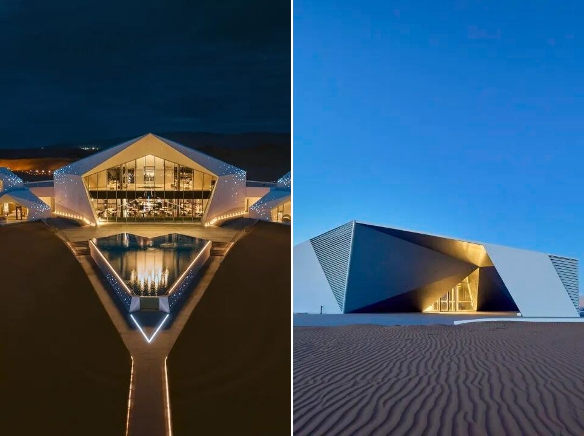

不同季节、不同天色的光影，让建筑与大漠、天空、日月和星辰交辉相融。这光影的律动，就像生命的喜怒哀乐，充满了生命力。

<table><tr><td>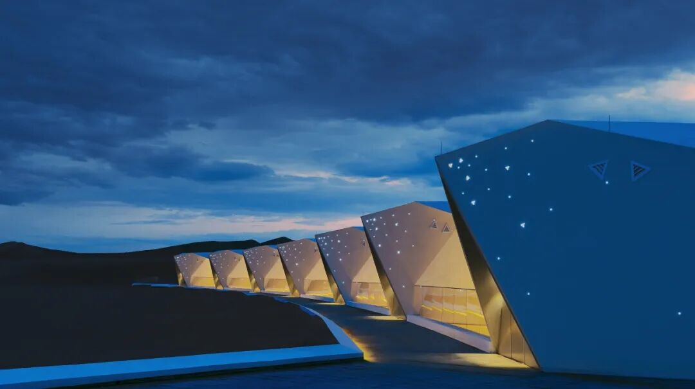</td></tr></table>

你不是旁观者，而是在沙漠的无边无际、月的阴晴圆缺和星的斗转星移中，与自然进行一场无声的对话。大自然的磅礴智慧，会唤醒我们的内在灵性。

<table><tr><td></td></tr></table>

## 03.

### 守护： 有温度的体贴与感恩

<table><tr><td>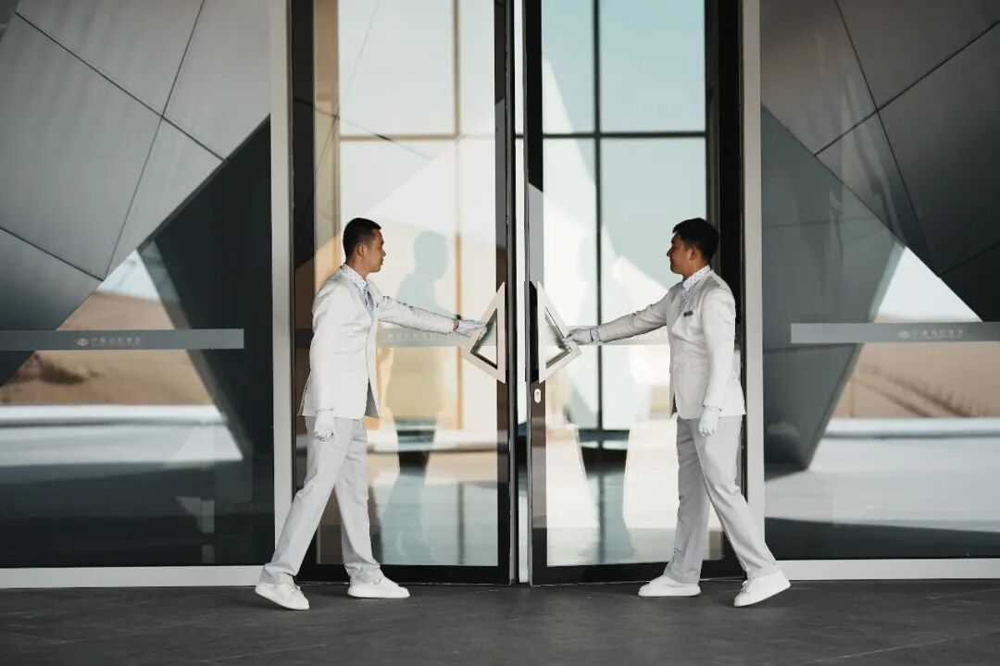</td></tr></table>

而酒店所做的，便是激发、守护这场对话。从您抵达的第一刻起，私人管家便成为您在沙漠中的贴心向导。无论是前往景区的交通，还是亲子活动的妥善安排，所有繁琐都已被无形地打理。

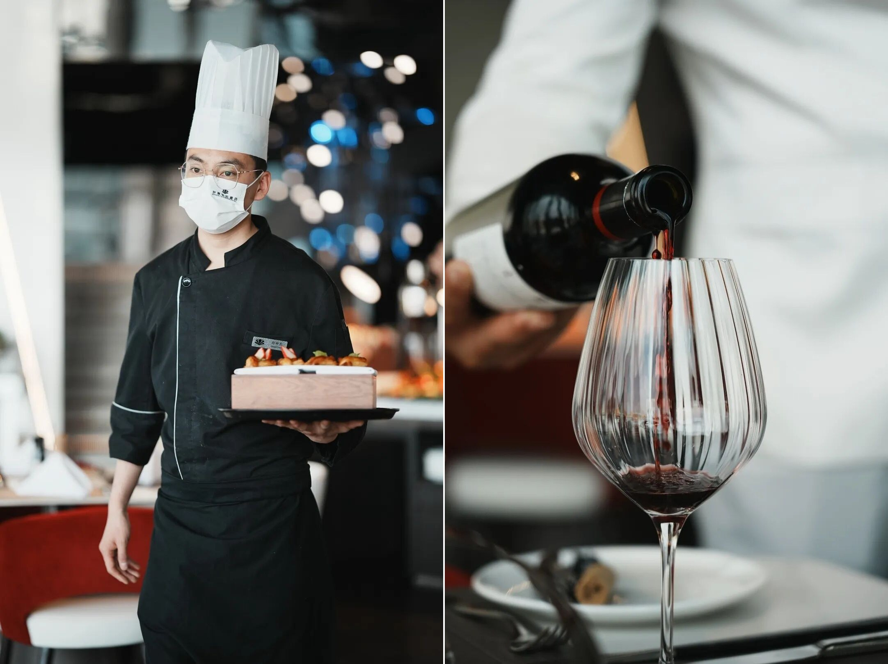

从沙漠温差、早晚餐时间，到观星活动的温馨提醒，蕴含着一份个性化服务对于客人的爱护和体贴。这种关怀，源于一种发自真心的“感恩”文化。

<table><tr><td>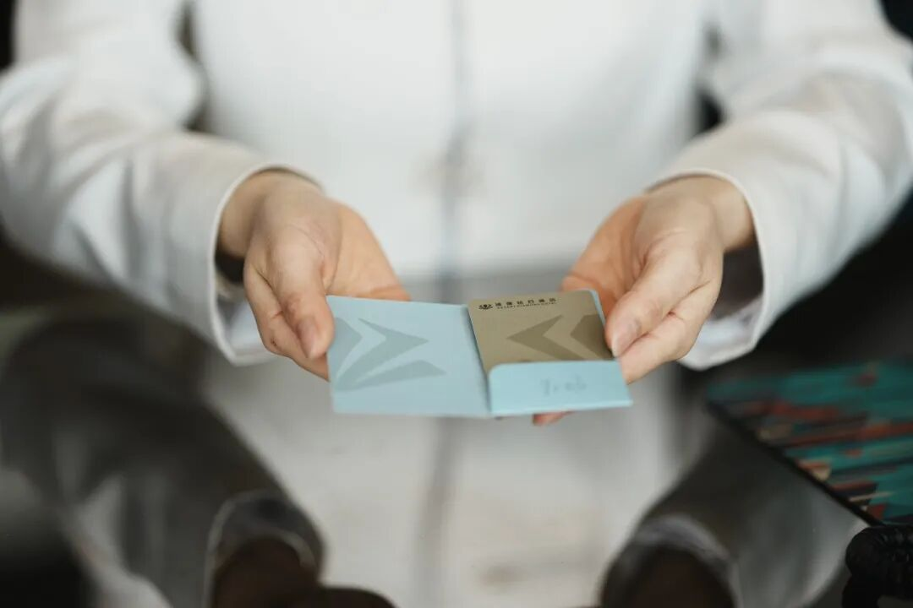</td></tr></table>

酒店的管理者与员工，每日进入此地，心中都怀着感恩与祈祷——感恩大自然的馈赠，感恩能在这片广袤的沙漠里，创造并守护这座链接人与自然的“沙漠乌托邦”。这份敬畏之心，最终化为了服务中的温度。 净化： 爱的殿堂，音的疗愈

<table><tr><td>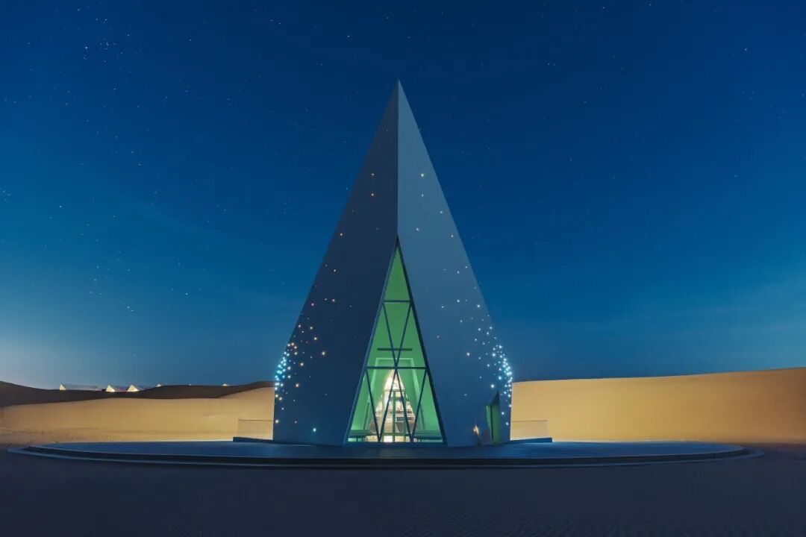</td></tr></table>

沿着几何光影变幻的连廊，你将抵达酒店的精神中心——星礼堂。这座27米高的纯白空间，以极致“留白”为空间赋予无限可能。它既可以是神圣的婚礼堂，是发布会和秀场，还是静谧的冥想室……是一切可能性汇聚的“能量场”。

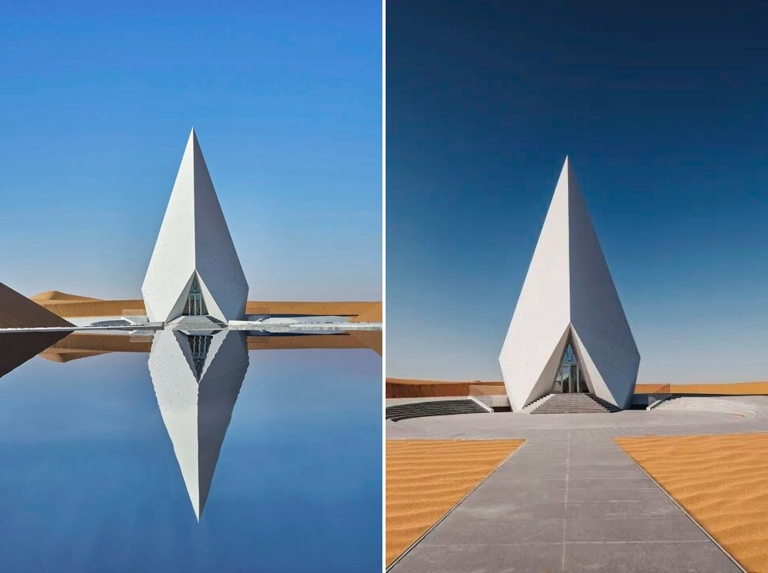

白天，阳光穿透玻璃，投射出神圣光晕，这里是见证“海枯石烂，忠贞不渝”的婚礼殿堂。与浩瀚的时间相比，生命如此短暂，沙漠为盟，钻石为誓，还有什么比这更接近永恒的承诺? 而这里，更是治愈的场域。沙漠不仅仅是孤独的，它更是治愈的。钻石酒店的客人可以免费体验一系列疗愈主题活动，包括颂钵音疗、品茗、香撰等。

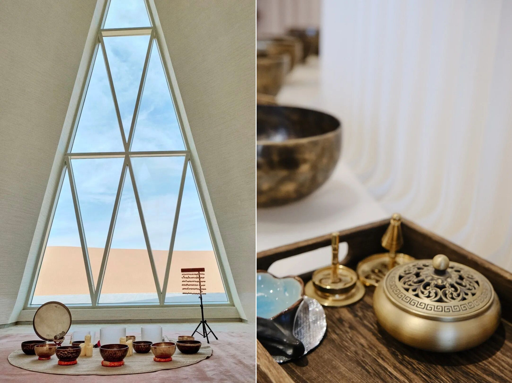

在颂钵音疗中，当疗愈师轻持颂钵，那“嗡”声传来，便开启了一次与自己灵魂的深度对话。当那悠远、纯净的声波从你的内在最深处升起、共振，你会感觉到，所有的疲惫与纷扰都仿佛被这片古老的沙漠所吸收、净化。

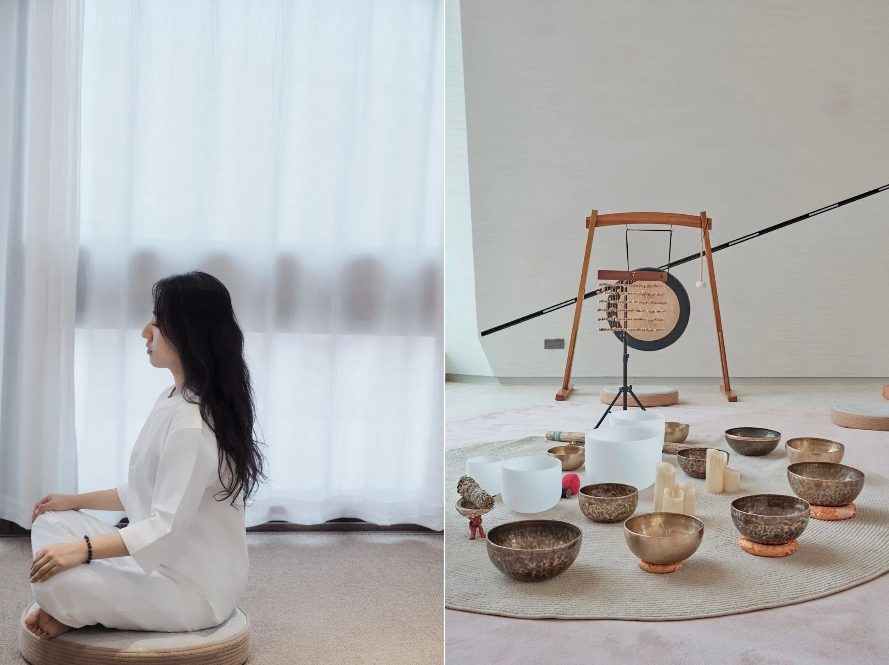

在这一刻，你进入了“当下正念”的状态，感觉到那些长久以来附着于心灵之上的尘埃，正在被温柔地、一层层地拂去，只留下一个纯粹的、久违的自己。

<table><tr><td></td></tr></table>

## 04.

### 风物与星辰： 自然的馈赠 在黑钻餐厅，国际化视野和现代烹饪手法，与西北大地最本真的风物相遇。主厨以“在地风物”为灵感，将中宁枸杞的清甜、盐池滩羊的鲜美，与南长滩软梨、兰州百合的独特风味，呈现于餐盘之上，完成对这片土地生命力的深情礼赞。

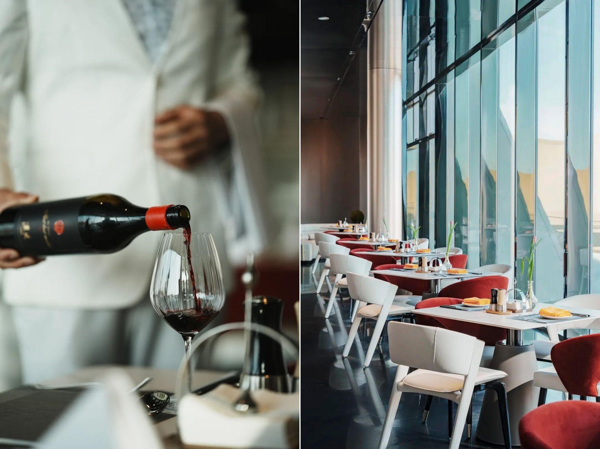

佐以一杯贺兰山东麓产区的佳酿，窗外是长河落日的壮美。而当夜幕降临，酒店便化身为一座即将启航、驶向星海的宇宙港口。 每一个几何切面的缝隙中，散发出神秘光芒。光点设计精密，如星辰般缓缓闪烁，仿佛建筑在沙漠的寂静中，与夜空一同呼吸。 回望138亿年的光 沙坡头被誉为“星星的故乡”，拥有世界上最纯净的夜空之一。银河在这里不再是遥远模糊的光带，而是如一条触手可及的、流淌着亿万颗钻石的璀璨长河。 在那台406毫米RC赤道式反射望远镜前，你将亲眼目睹土星环的清晰缝隙、木星表面的风暴云带，以及来自仙女座星系——那束在宇宙中穿行了250万年的微光。

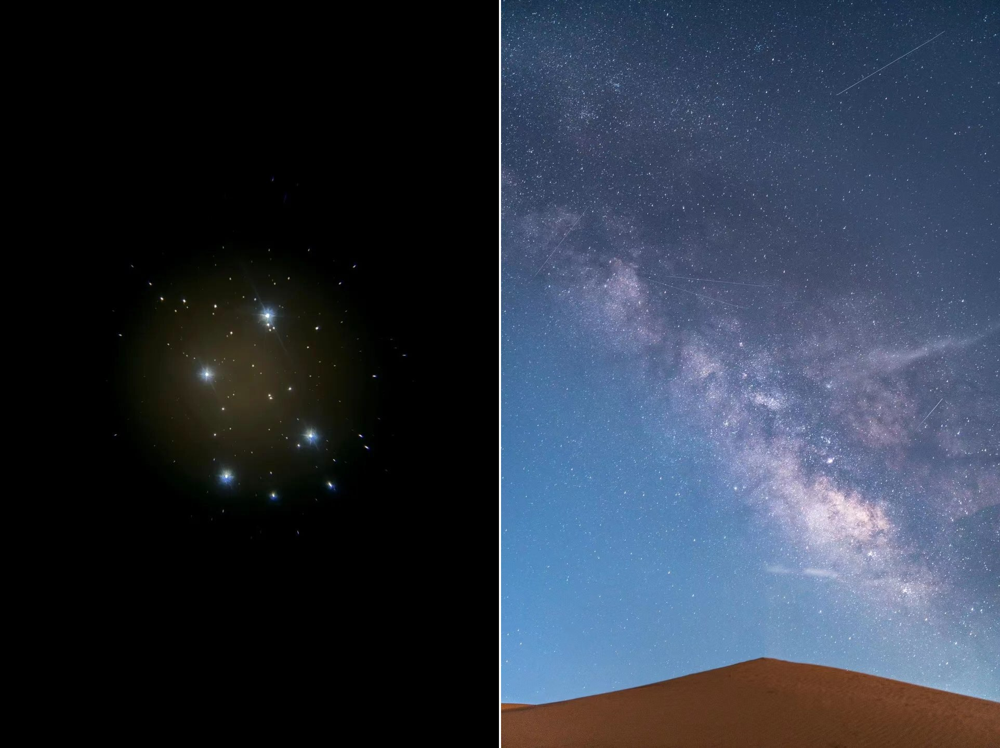

伊曼努尔·康德在柯尼斯堡的夜空下写下这行字时，或许未曾预料到，数百年后，在地球的另一端，一片古老的沙漠腹地，会有一座建筑，以自身的存在，同时回应这两大人类的终极敬畏：“世界上有两样东西，总能深深震撼我们的灵魂：一是我们心中崇高的道德律，二便是我们头顶灿烂的星空。” 你感受到的，正是一种与浩瀚的共振。在138亿年的星光面前，人世间的一切执著与烦恼，瞬间变得轻盈。

<table><tr><td></td></tr></table>

## 05.

### 唤醒内在宇宙

<table><tr><td>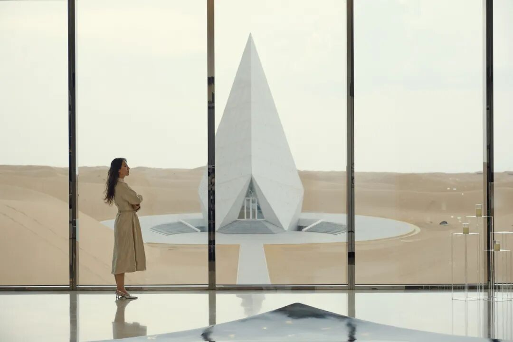</td></tr></table>

你有多久，没有听见自己了？在信息过载的城市森林里，我们内在的频率早已被无数外部噪音所覆盖。人类焦虑、疲惫、畏惧，却忘了生命初始的设定，本是圆满与无畏。 我们活在一个“有”的世界——信息、欲望、噪声层层包裹。而这里，以最坚硬璀璨的“有”(钻石)，去诠释最广阔深邃的“无”(沙漠)，邀请你做一次彻底的“减法”。

<table><tr><td>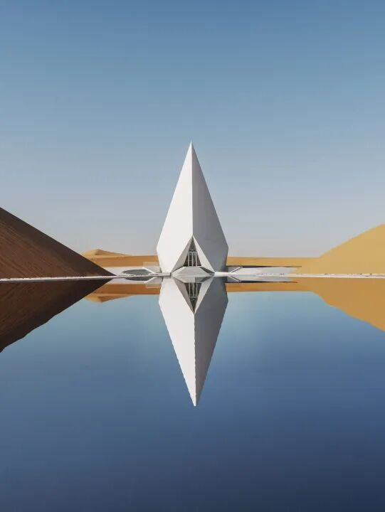</td></tr></table>

它用纯粹和宏大的孤寂，让你与自己的灵魂坦诚相见。这便是那份向内的旅程，它引导你向上，向内，去探索属于你自己的精神宇宙。人生活到极致，一定是向内走。 重启： 发现本自具足的自己

<table><tr><td>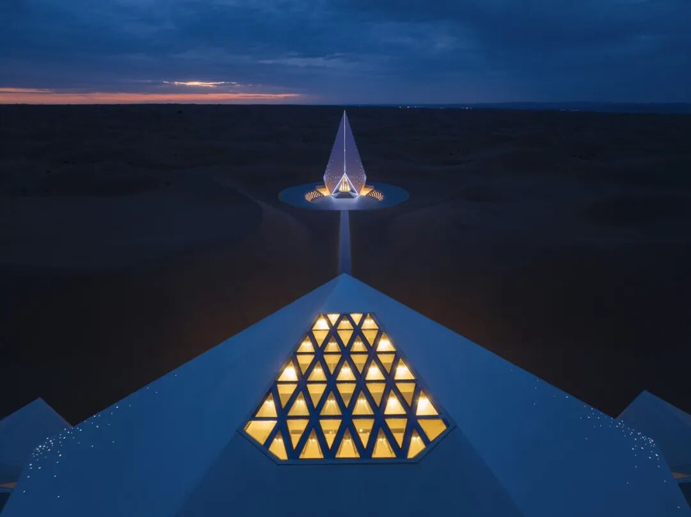</td></tr></table>

因为，当人真正安静下来，就会产生一种新的体验：面对内心。在这片无垠沙漠里，你将感悟到“空”性——万物无常，万物皆我。“空”的力量蕴含着潜能，它为你卸下所有伪装与负累，只为迎接一个本自具足的你。

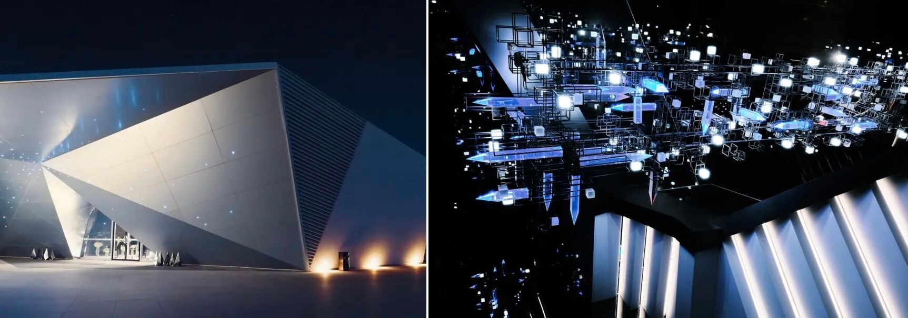

尼采说，充满爱时，刹那即是永恒。而在这里，你感受到的，是一种跨越时空的“大爱”——对自然、对生命、对存在本身的全然接纳。 对于顶级探索者们来说，这不只是一次奢华的旅行，而是一场关乎“心”的修行。当在这片宇宙中心醒来，你所经历的，是一场内在升维，一次频率对齐。

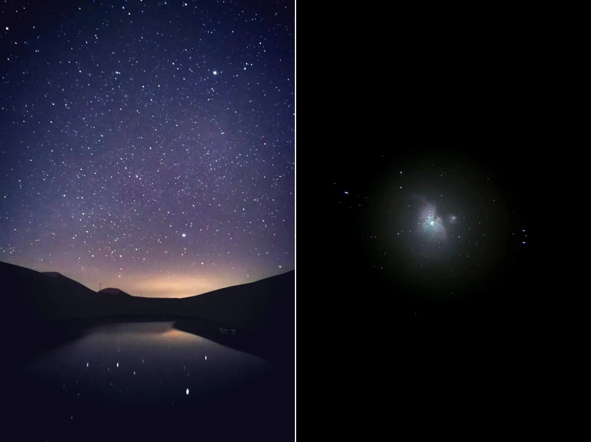

王阳明言“吾心即是宇宙”，当你不再向外寻求，而是向内探寻，你便拥有了整个宇宙的力量。当你离开时，那种“大爱永恒，无所畏惧”的感觉，成为一种真实的内在力量流动。 你最终明白，你的存在，以及你与这片沙漠、星空的相遇，本身就是宇宙138亿年间，一场不可思议的偶然。

<table><tr><td>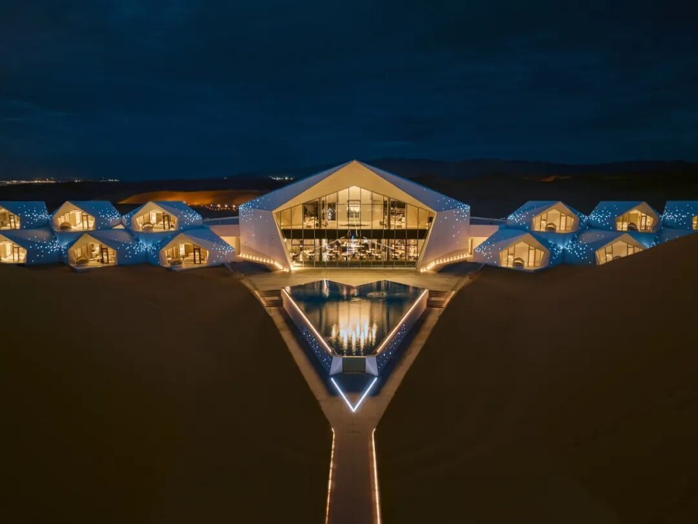</td></tr></table>

从此，你心中有了一处“无”为你提供庇护，那片沙海和星辰，那份宁静与力量，将永远成为你的一部分。 有些地方，只去一次，便是一生。这个时代需要的，不是又一间豪华酒店，而是能让我们重新爱上世界的理由。

<table><tr><td>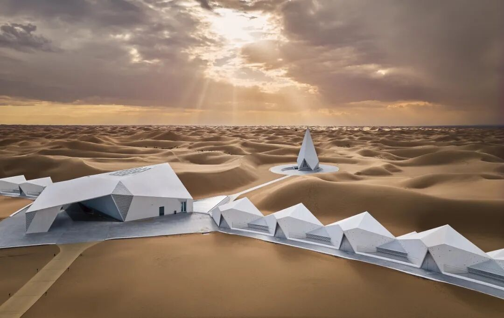</td></tr></table>

这里，是沙漠钻石酒店。一个让你在自然奇迹中，与真实的自己，久别重逢的心灵庇护所。 祝愿你未来的人生，以你内在的宇宙为蓝图，去创造每一个流动的、充满爱的、无畏的瞬间。   更多精彩

▶▶ 黄金周出游澳门：定义您的一站式奢华假期▶▶ V List｜金秋国庆，10个小众旅行地推荐，祝你秋天愉快！▶▶ 与于适、孙艺洲一起挑战四姑娘山20℃温差，“叠变”如何应对？

---

## 制作团队

- **执行**：戴雯
- **撰文**：耿悦
- **编辑**：Sandy
- **视频拍摄、剪辑**：白雪松
- **图片**：品牌官方、耿悦

---

## 授权与版权

本文所有文字与图片均由「沙漠钻石酒店」品牌方与「水石设计·米川工作室」（主创建筑师 谢湲）品牌授权提供，仅供本作品集展示用途。图文版权归原作者及品牌方所有，未经许可不得转载、复制或商业使用。
