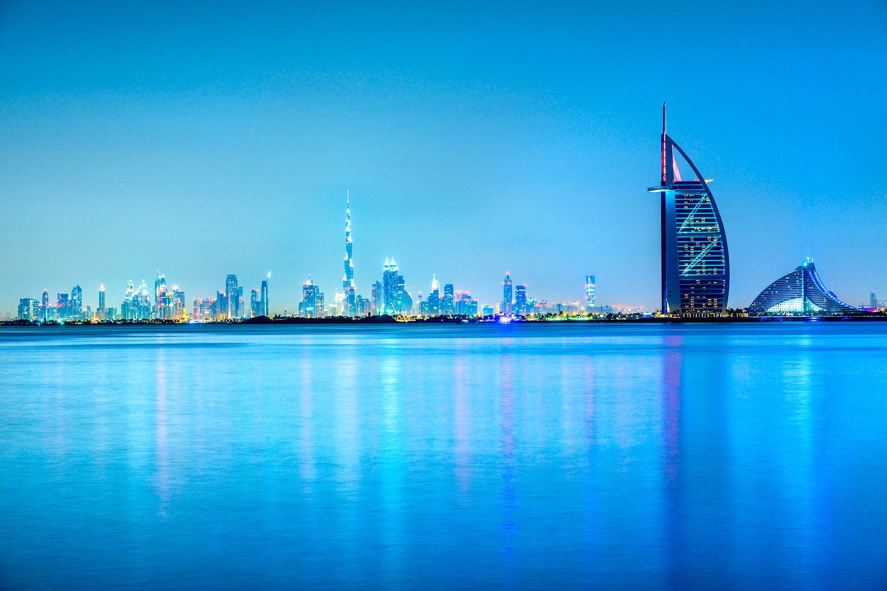
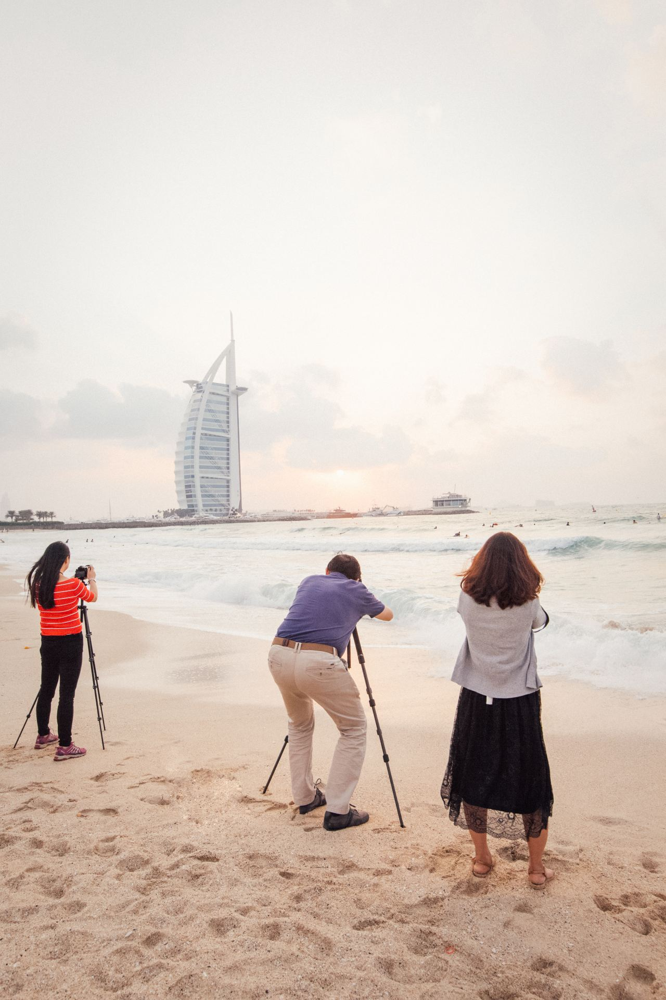
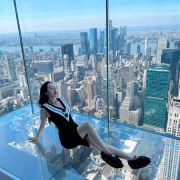
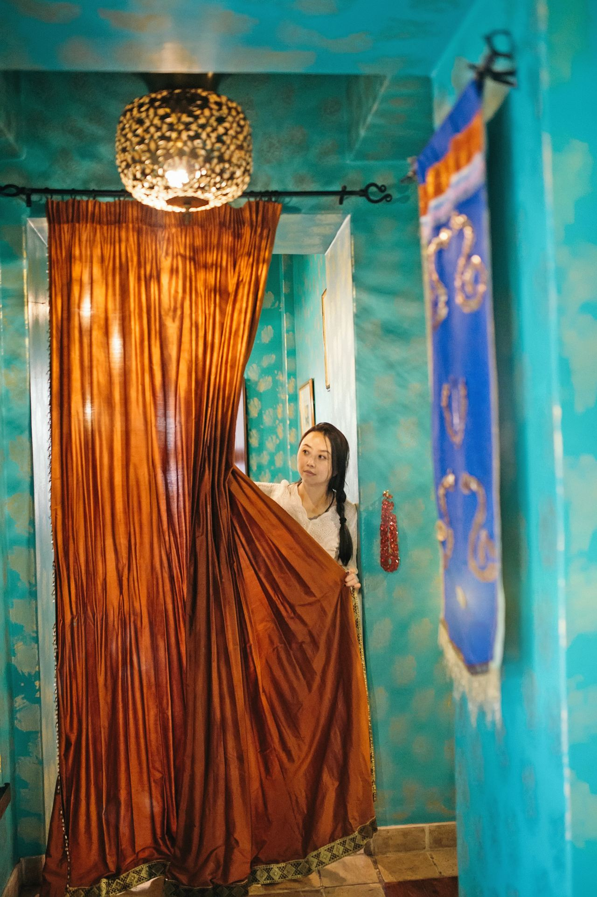
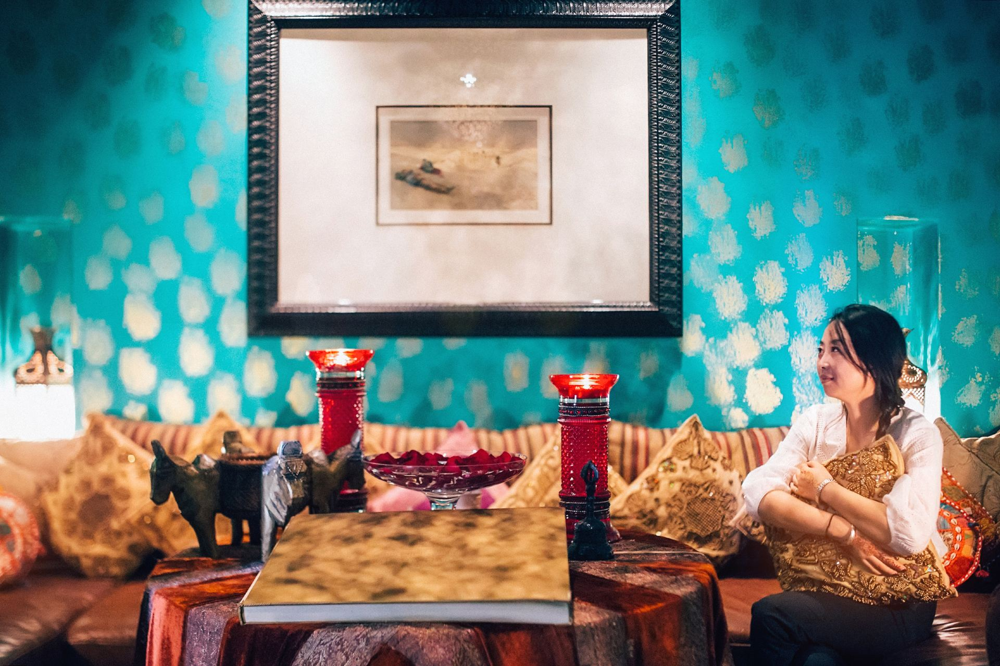
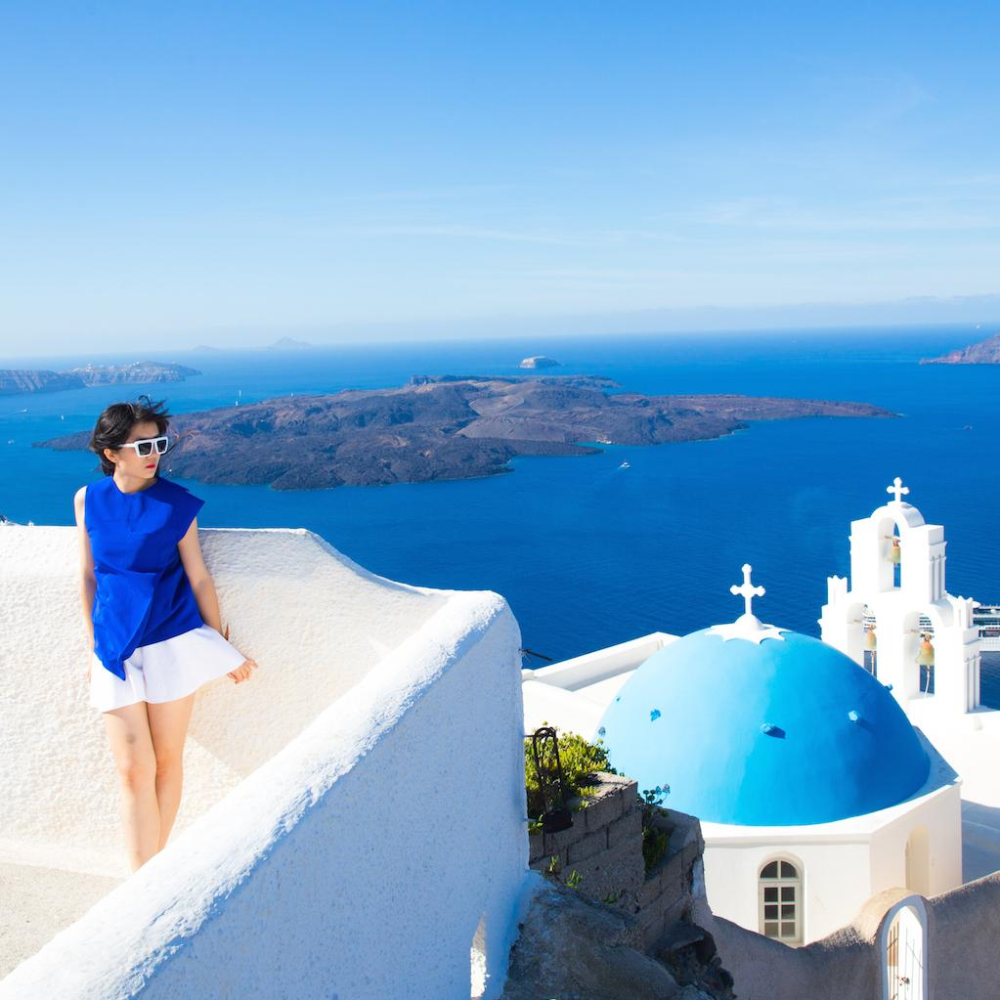

# 迪拜 · 帆船酒店与沙漠度假村

住在沙漠的黄金里，一栋来自未来的帆船，一座摩洛哥式的沙漠城堡。

> 注：本文由我早年在携程发布的迪拜长篇游记拆分而成，仅保留奢华酒店部分。

---

## 帆船酒店：沙漠里的黄金奇迹

迪拜帆船酒店，一共有56层，321米高，由英国设计师W.S.Atkins设计。客房面积从170 平方米到780平方米不等，最低房价也要900美元，最高的总统套房则要18000美元。总统套房在第25层，家具是镀金的，设有一个电影院，两间卧室，两间起居室，一个餐厅，出入有专用电梯。已故顶级时装设计师范思哲曾对它赞不绝口。

我的感受：从远处看过去，帆船酒店更像是一艘行进中的酒店，外形非常独特，它遥立在水波中也足够惊艳。据说，当年酒店的豪华程度令人叹为观止，评论家们都不知道该给它定为几星：是五星，六星，还是七星？走进酒店，你才知道什么叫做“金碧辉煌”，它的中庭是金灿灿的，它的最豪华的780平方米的总统套房也是金灿灿的。

听设计师说说背后的设计故事：

“能成为地标的建筑都是独具特色的，” 汤姆 · 赖特说道，“在为迪拜帆船酒店做设计定案时，我们把建筑的外观造型画出来，画得越快证明设计越独特。” 五秒钟就能记住它的外形。

“这样的建筑可不多，” 赖特补充道，“你一画出迪拜帆船酒店的形象，人们就知道那是什么。”

我们拿到的方案概要表明期望修建一座能让迪拜名扬国际的建筑，所以我们认识到，只有设计一个令人印象深刻且前无古人的造型才能达到目的。酒店竣工将近四年之后，这栋建筑才开始为世界媒体广泛报道，迪拜也开始成为人们热议的话题。迪拜帆船酒店逐渐成为迪拜的形象代表。

当年迪拜的建筑都是清一色的水泥砖块再刷点颜色，楼层也都不高，结果突然同时冒出了迪拜帆船酒店和阿联酋大厦两座庞然大物。它们改变了一切，一夜之间便吸引来无数的商机和资源，极大地推动了迪拜的城市建设。

——汤姆 · 赖特 （Tom Wright）迪拜帆船酒店Burj Al Arab设计者

---

## 沙漠度假村的印度餐厅：阿拉伯与欧洲的融合

走进迪拜巴布铝沙姆斯沙漠度假村的印度餐厅，一定会让你觉得非常惊艳。这家印度餐厅分成露天和室内两个部分。

印度餐厅的主体外观和露天餐厅，乃至整个迪拜巴布铝沙姆斯沙漠度假村的外观，都像极了摩洛哥乌达雅城堡。四周有很长的廊厅，廊厅采用了法国文艺复兴时期哥特式建筑的尖拱，这在艺术上很好的保留了阿拉伯建筑上休息区功能，这是阿拉伯和欧洲两种艺术建筑风格很好的融合

露天餐厅表演区三位印度帅哥，演奏着类似《三傻大闹宝莱坞》那种节奏感很强的印度歌曲，高大的椰子树在勺子镜面、墙壁，玻璃里疏影横斜。

兴致高的时候，你可以礼貌的拦截穿行在你身边的印度waitor“sir！来一份唐杜里烤串”。唐杜里烧烤，是印度传统的烹饪方法，也叫泥炉炭火烹饪法。

这种烹饪方法使得肉串都比较香嫩，印度烤串的品种也很多诸如羊肉 鸡肉 鱼 大虾 鱿鱼 龙虾及少量的蔬菜，你可以自选。我还给闺蜜在空余时间拍了照片，摩洛哥风情浓郁。

---

## 版权

本文为耿悦原创，版权所有。未经许可不得转载或商业使用。
