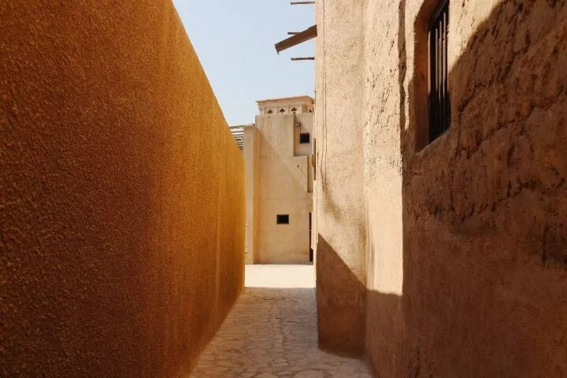
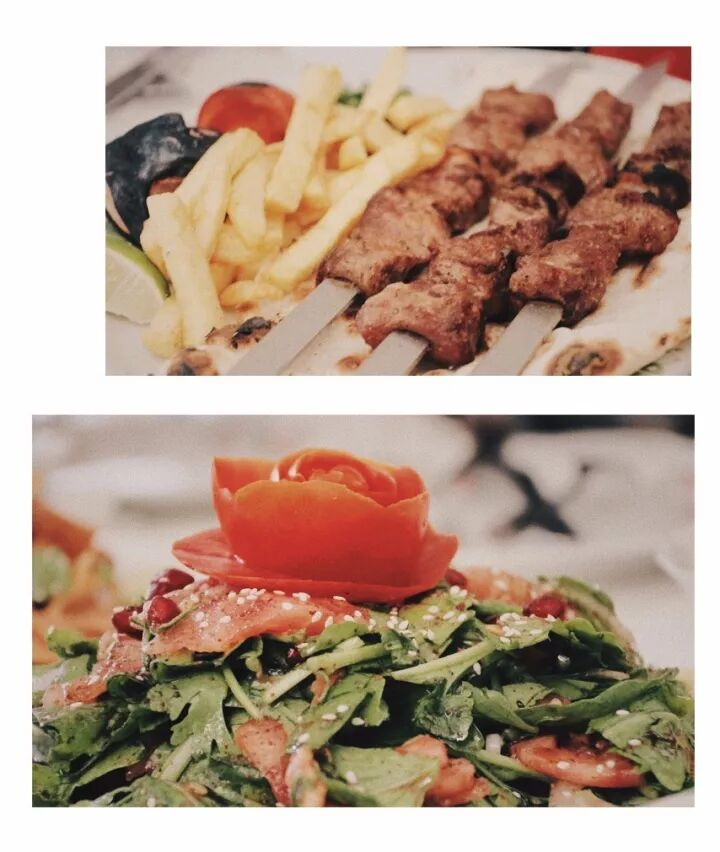
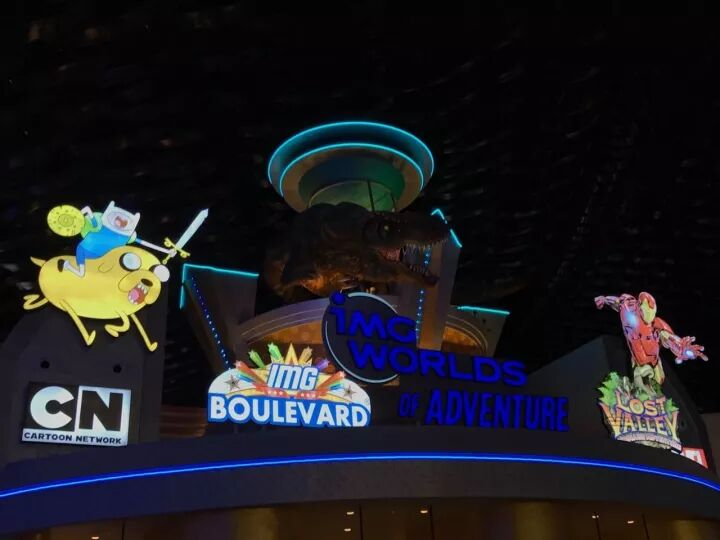
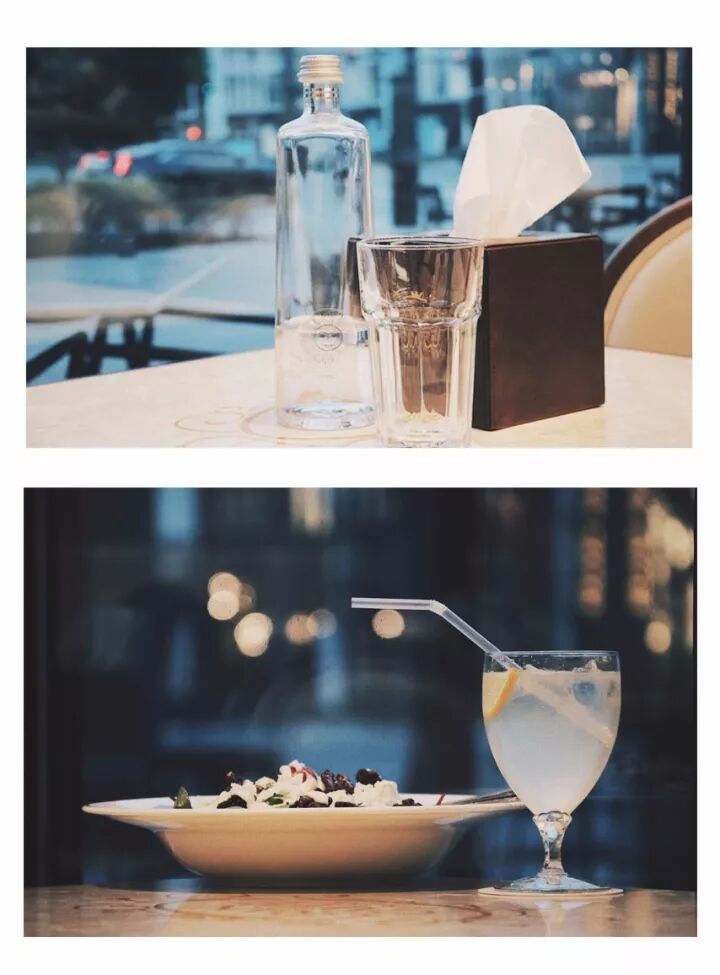
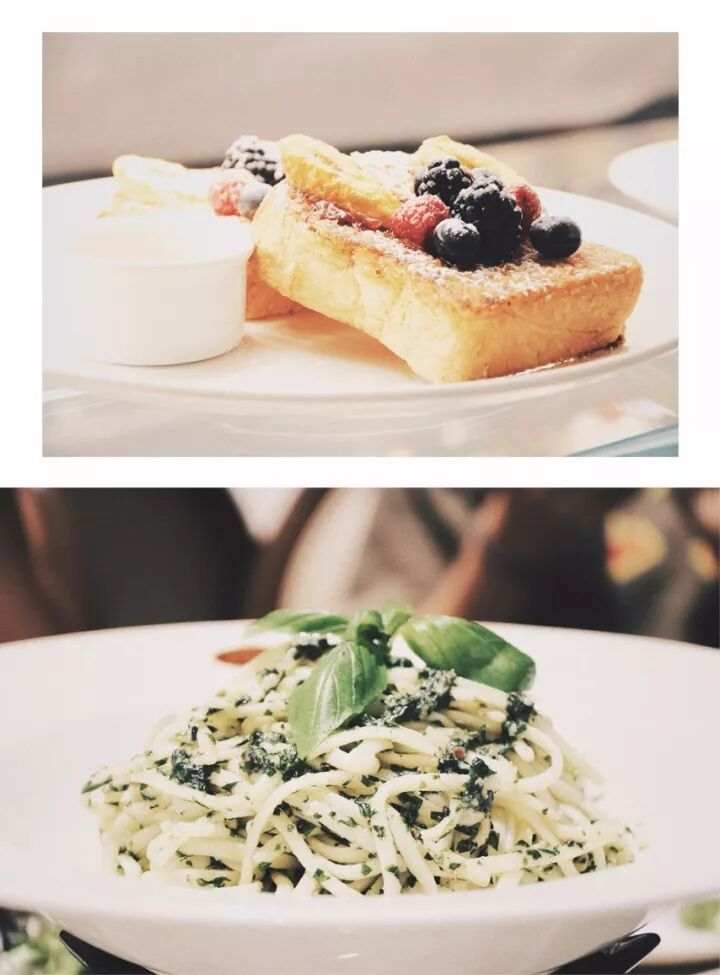
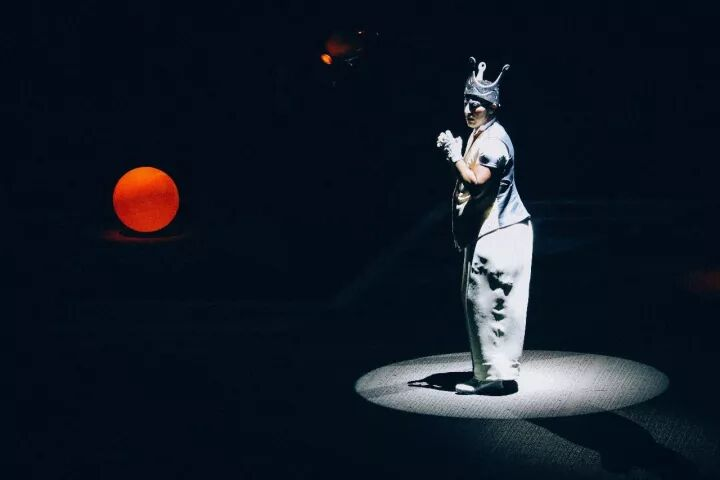
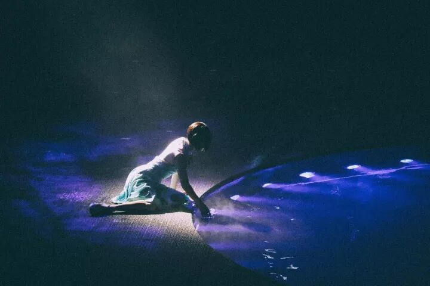
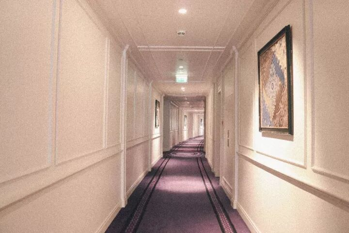

# 迪拜 24 小时的喜与欢 · 城市清单

用 1 天的时间，在这座超现实主义的魔幻城市里穿梭。

---

这期「城市清单」，是**迪拜**。

「我们的眼睛，容不下一颗沙，却装得下一座磅礴的沙漠。

最难的是开始，更难的是结束。」

在你们眼里，**充满多少对迪拜的误解？**

❤️

Dubai

这里没有**遍地的黄金和满街的跑车用1天的时间在这座 **超现实主义的魔幻城市** 里穿梭

说起迪拜，真的是一个在我旅行清单以外的地儿，基本上没有考虑过。大概就是对这一类地方没有任何幻想吧。

这次，临出发之前，还问了一个之前去过的朋友，迪拜好不好玩？（心想着能升高一点期待值）。**朋友回答：大概是去过的最无聊的地方吧。**然后，跟我说，你就当去打个卡吧。

但是，真的当我在迪拜以后，我会发觉网络上的，朋友传达的，都是一个「 假迪拜 」吧。**这里明明就是一座充满想象力和尖叫的城市。**无数次在迪拜质疑：你们到底在玩啥？！

**1 8:30 老城区之旅**

阿拉伯有句古话：不是每块乌云都下雨。但迪拜它却可以让雨下在你身上。就是这么一个**「什么都可能发生」**的地方。我需要你清空你脑中所有的疑问，天马行空的开始这一天。

这里是迪拜的老城区「 Al Fahidi District 」，一个充满了艺术气息的街区。**如果可以，我相信你会愿意逛上一天的。**

《重庆森林》里，阿菲问编号663：——你想去哪儿啊？
警察，编号663回答说：——随便，你说去哪儿就去哪儿。

那个说 “ 想去哪就去哪 ” 的场景突然出现在了脑海中，即使是现在隔着屏幕，我依旧不敢直视那眼神。

而这里，真的就是一个 “ 随便，哪儿，我都愿意跟你瞎去 ” 的地儿。

随意走进一个咖啡店，仿佛是标配一样，一间咖啡店，总是会搭配上一间「 gallery 」。点一杯你中意的咖啡，在艺术作品中，你会看到一个完全不同的迪拜。

**那些八竿子打不着的元素，怎么突然都能搭，**居然莫名其妙得和谐。

**📕 **：Make Art Cafe

📍：Al Serkal's Heritage House, Bastakia, Al Fahidi Area, Meena Bazaar, Dubai

**☎️ **：+971-4-5597856

**2 11：00 尝试传统阿拉伯食物**

这家餐厅，就在老城区的入口。逛完了老城区，可以在这里用餐。餐厅是典型的阿拉伯风格，整个庭院是蓝白色的，布满了帷幔，**阳光洒落下来，星星点点的，很是好看。**

抱着尝试一下当地美食的想法，却发现意外的好吃。中东风味的菜肴，沙拉配饼很好吃，**后来发现原来阿联酋的饼都挺好吃的。值得特别推荐的是羊肉串，**好吃，好吃，好吃，腌制的很入味，香、辣、嫩，但稍微有点偏咸，重点是没有羊骚味。

**📕 **：Arabian Tea House Cafe

📍：Bur Dubai, Al Fahidi R/A

**☎️ **：+971-4-3535071

**3 **

12：30 不用排队的游乐园

这次去了三家主题乐园，去第一家的时候，就想问**「 人呢 」**？？？

从一开始完全不能适应**「 不用排队 」**这件事，到后面，看到有人才觉得惊奇。后来打听，是因为迪拜有太多主题乐园了，所以工作日来的时候，没有人排队，是十分正常的事。

真想拉着小姐妹们，来这一一再玩一次，治愈一下在「 迪士尼 」排队到哭泣的心。

**（ Tips：迪拜的休息日是周五周六噢。）**

这次玩到的主题乐园里，推荐「 IMG 冒险世界 」，是世界上最大的室内主题乐园，占地面积达 150 万平方英尺，大小相当于 28 个足球场，

里面分为四大部分——漫威英雄世界、失落谷恐龙冒险之旅、卡通频道和 IMG 大道。**其中最为吸引人的就是由漫威影业独家授权的漫威英雄乐园，全球仅此一家哟！**

还有仅 2.5 秒便可实现 0-100 公里/时的加速的迅猛龙过山车（The Velociraptor），幽魂旅店（The Haunted Hotel），超级多好玩的，当然也有适合小朋友玩的飞天小女警（The Powerpuff Girls）等。**推荐有小孩子的爸妈们可以来这里玩耍，会「 疯狂的开心 」。📕 **：IMG Worlds of Adventure

📍：E311,Sheikh Mohammed Bin Zayed Road

**🕙 **：12:00—20：00（周一至周日）。

**4 17：00 风筝海滩看日落**

我想刚刚结束「 IMG 冒险世界 」行程的你，会有一点点累。这时候的「 风筝海滩 」正适合你，**轻轻柔柔的海风，和落日的斜阳，一杯汽水，躺下来，你就会完全放松了。**

在这个地方，你也可以远远的看见「 帆船酒店 」，更多的，还是人们，自由自在的在这片海滩上漫步游玩。

**迪拜其实很适合家庭出游**，你会看见有很多的爸爸妈妈带着小孩子们在这片海滩上玩耍，有的在打排球，有的沿着海岸线一起跑步，偶遇了一个特别可爱的小男孩，看着他和他妈妈玩耍的画面，感觉心都要化了，真暖。

不远处有很多贩卖的餐车，都很有特点，样子很是可爱。

**不知道为什么，会想起「 La La Land 」的场景，内心觉得这是一个很适合跳舞的地方。**如果身边是你，我可能真的会和你跳起舞来。

落日下，做什么，都浪漫合理。

**📕 **：Kite Beach

📍：Jumeirah Road opposite Burger Fuel Restaurant, Kite Beach

**5 19：30 爱的料理**

餐厅位于「 CITY WALK 」，在繁华的商业区，你可以选择先去逛个街，消耗一些能量，再来吃这一顿充满爱的料理。

选一个靠窗的位置坐下，点你喜欢的食物，看着窗外形色匆忙的车流，**好似你就真的生活在这座城市中。**旅行就是魔法，带给了我们移动的可能。

而食物的可爱之处，在于，好吃的食物能让你感受得到这座城市对你的「 爱 」，那一刻，**食物会告诉你，你和这个地方正在发生的故事。📕 **：Gran Caffe Londra

📍： G 09, - 8 Boulevard Walk Tower - Dubai

**6 **

21：30 不去看一场演出吗？**

我不怎么喜欢看类似魔幻情景的大型秀，看得更多的会是舞台剧和一些现代舞。当在迪拜欣赏「 La Perle 」水舞秀的时候，却只能用**「 Amazing 」**来形容。

**它配合整个舞美设计，带给你的感受会是特别直观的，非常震撼，特别具有冲击力。**

整场秀会持续 90 分钟的时间，是一场充斥着各种元素混合在一起，具有本土文化的 “ 狂欢 ”，你会看到杂技演员，潜水员（演员升到高空，突然自由落体，**砸进了水池**），摩托车，各种马戏团似的风格，**紧张刺激的表演有时会让你感到喘不过气来。**

看完秀以后，你会为演员们鼓掌，不由自主的敬佩。但说实话，你很难去理解每一个表演后面的情节故事，**这并不是像话剧一样的叙述性作品，而是一个概念性作品。**

你就好好的享受整个舞美，和演员们的特技表演就好了。

**📕 **：La Perle By Dragone

📍： Al Habtoor City | Al Habtoor City, Dubai, United Arab Emirates

**🕙 **：19:00—20：30 & 21:30—23：00 （周二至周五）；

16:00—17：30 & 19:00—20：30 （周六）

**7 23：30 最擅长的是，做梦**

Versace 在全球拥有两家酒店，一家是在澳洲，而另一家就在迪拜。

入住「 Palazzo Versace 」重点在于体会 Gianni Versace 的生活态度，区别于 Armanni 的极简，**Versace 践行了它 “ More is more ” 的品牌信条。**

你也会发现他本人对于新古典建筑的喜爱。

「 Palazzo Versace 」处处都是品牌符号，美杜莎头像、希腊回纹及品牌的经典印花，随处可见，**每一处都是特别讲究的设计。

每一件家具和织物，都由 Versace Home Collection 为酒店量身打造，完全高级定制。为入住的你，编织一个又一个甜蜜梦境。

“ 在广袤无垠的地球上，最醒目的灵长类叫做人类。

而用了 100 多亿年进化成的人类，最擅长的又是什么呢？

**最擅长的就是，做梦。 ”晚安，遥远如梦境一般的迪拜。🌛**

「 小贴士 」

▼

**Q：去迪拜要办签证吗？A：不用，**迪拜对中国是免费落地签。不需要提前办签证，买张机票就行了，入境手续简单得像回家，机场过关超级快。

**Q：迪拜和中国的时差？安全吗？A：**比北京时间晚4个小时。迪拜的犯罪率几乎为零，无论白天或是夜晚，这个城市都绝对安全。如果您需要帮助，请拨打紧急电话999。

**Q：**迪拜禁忌？

**A：**忌讳猪肉；拍小孩头；随处饮酒；送布娃娃；对当地妇女拍照或用身体接触。

**Q：去迪拜会语言不通吗？

**A：**完全不用担心语言问题，去商场买东西说中文，酒店打车吃饭说英文。

**Q：迪拜的货币是什么？能用支付宝吗？

**A：**货币叫迪拉姆，汇率差不多是人民币的两倍。可以使用美元，但支付宝还没普及到那。但银联卡是完全没问题的，跟店员说 Union Pay 即可。

**Q：迪拜电压？

**A：**电源规格220/380V、50HZ、30Phase，与国内相同。插头为三孔扁平式，英标。

**Q：迪**是否可以饮酒？

**A：**由于宗教信仰关系，迪拜公众场合禁止饮酒。酒店的餐厅和酒吧经授权可以提供酒精饮品。

梦里见

💛

---

## 版权

本文为耿悦原创，发表于微信公众号「文逸」（JUSTGO 旗下）。未经许可不得转载或商业使用。
