# 越南岘港 Fusion ·「住进水疗里」的身心焕新之旅

越南，岘港，会安古城与纯净海岸之间。

**素材授权**：本文图片与文字由「Fusion Resort & Villas」品牌方与撰文者耿悦共同提供。

---

在活力的岘港与古城会安之间，Fusion Resort & Villas以全越南规模最大的水疗中心，傲然宣告着奢华康养时代的来临。这座承载了本土旅宿品牌Fusion 集大成之作的旗舰级项目，于2024年11月盛大开幕，安踞在纯净的山水海滩旁。

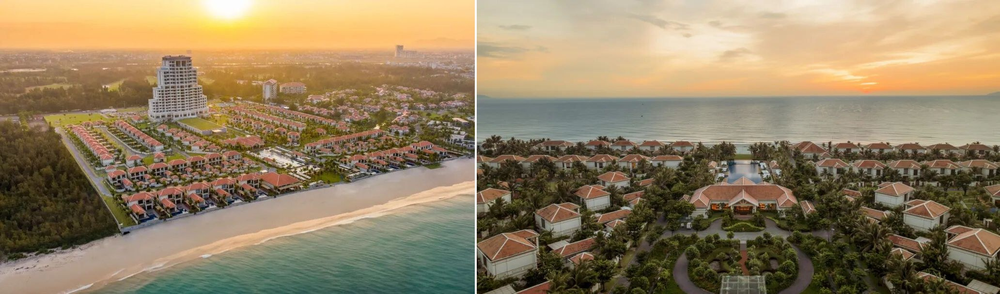

它的核心魅力，在于并非一座普通的五星酒店，而是一处「住进水疗里」的独立康养目的地。重新定义了「越南最佳康体度假村」的标准：它将康养「Wellness」体验内化为度假的核心宗旨，为寻求静心深度放松的旅人们，开启一场彻底的身心灵焕新。

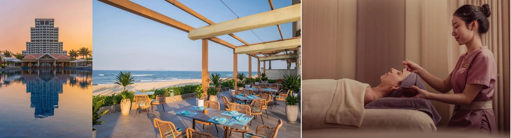

这份对疗愈的极致追求，刚刚在国际舞台上赢得了最高声誉。2025年11月， 「岘港富园度假村及别墅」的核心灵魂——Maia Spa，在新加坡举办的「世界豪华水疗奖(World Luxury Spa Awards)」上斩获三项殊荣。 其中，含金量极高的「全球最佳海滩度假村水疗中心」大奖，更是被它收入囊中。这一奖项被公认为「奢华水疗行业的成就巅峰」，每年由超过25万名国际旅行者和行业专家共同投票选出。这不仅是一座奖杯，更意味着Maia Spa确立了其在行业内的领军地位，赢得了全球高端消费者的顶级信任。

<table><tr><td></td></tr></table>

这里的疗愈到底有多特别？带着这份好奇，我以第一视角，来触摸这座载誉归来的水疗馆度假村的真实细节。01 水疗疗愈Spa Therapy

<table><tr><td>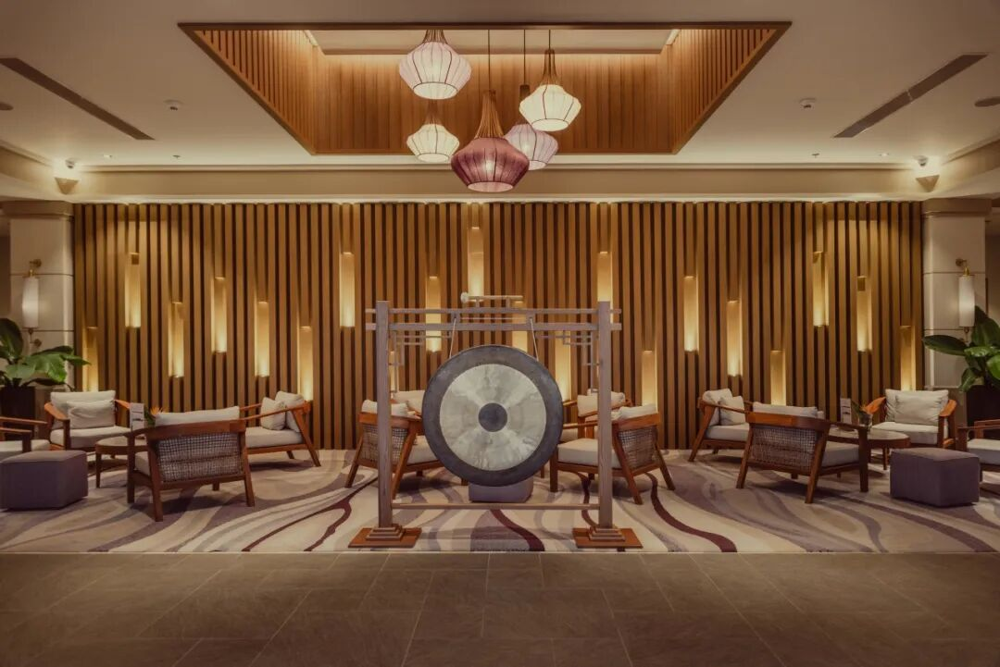</td></tr></table>

酒店独有的「康体全包 (Wellness Inclusive)」哲学，将健康理念深度融入到了每一次的住宿体验中，会贯穿整个旅程。

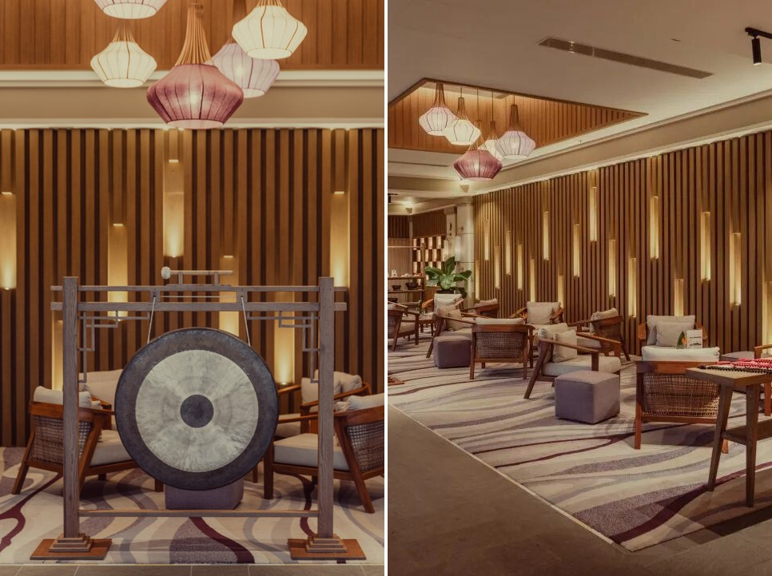

踏入Maia Spa，你会先被一种「空间的奢侈」所震撼。这里拥有近3000平方米的惊人尺度，26间理疗室与42张理疗床。

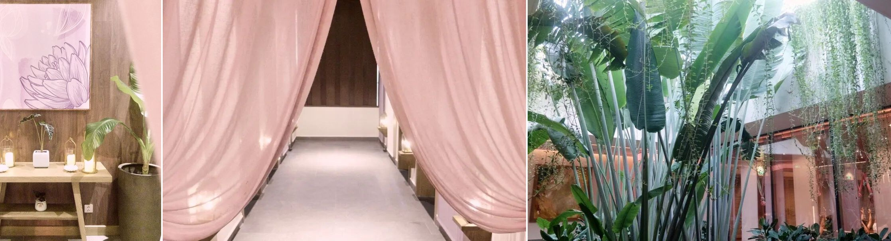

你穿过长廊，植物轻轻摇摆，淡粉色帘幕随风轻拂。直到走廊尽头，推开门：一方巨型的碧蓝水面铺陈，极具冲击力的辽阔感。在这潺潺的水声中，你会期待：这里不是用来让你「打卡」的，而是用来重塑你的。

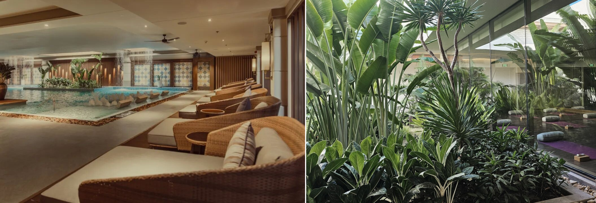

这是一座「健康殿堂」：它的构建以水疗疗程、养生活动、健身课程三大核心，形成了一个完整的空间闭环。设施涵盖了隐秘安静的理疗室、瑜伽场域、理疗瀑布和红外桑拿。

<table><tr><td>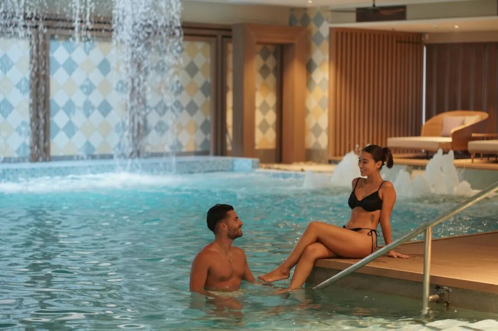</td></tr></table>

仅是261平方米的室内恒温泳池，就同时具备以水流、气泡、水压进行舒压按摩的功能，你可以随时浸泡、漂浮，感受水流的环绕疗愈。

<table><tr><td>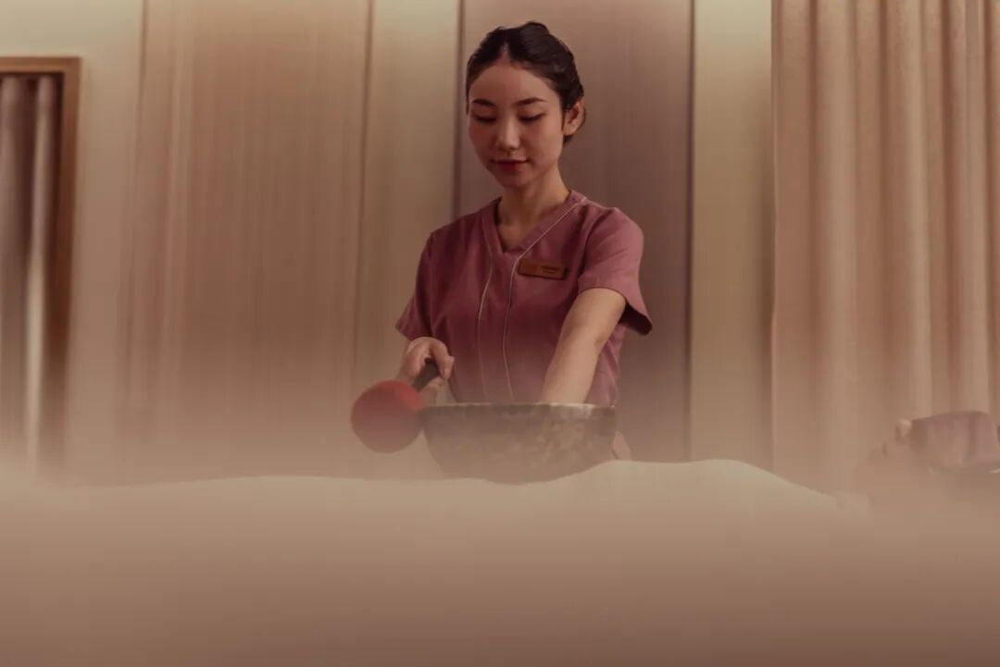</td></tr></table>

Spa 总监Vi Tran 深耕行业 15 年，温和的气场中透着一种专业的贴心。开始前，是一次人性化的「口头问询」：从最近的睡眠质量到偏好习惯，再到「腹部是否可以触碰?」等细节。这种对身体隐秘边界的尊重，建立了一种被深度「看见」的信任感。

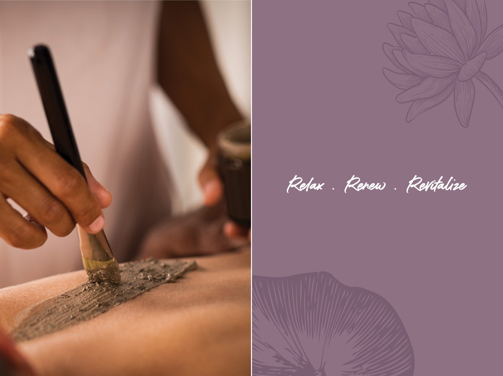

紧接着是气味的定调。三个精油瓶对应着不同的疗愈境界：放松（Relax）稳定身体，焕新（Renew）消除疲劳，复苏（Revit alize）恢复元气。我选了「焕新」，生姜的辛辣与柠檬草的锐利交织；而在头枕处，则是清雅的白茶与山茶花。

<table><tr><td>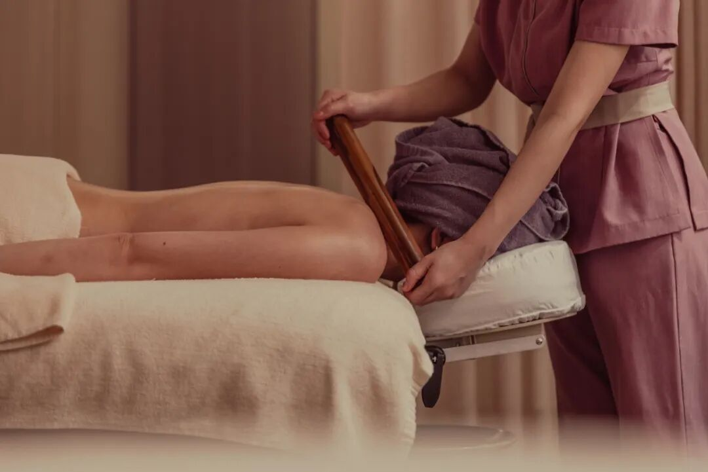</td></tr></table>

除了能够满足女性用户全身按摩之外，这里没有忽视男士的需求，专门设计的男士面部护理很务实，直接针对男性最烦恼的「内生须发」与毛孔堵塞问题；同时也为准妈妈保留了特权，孕期疗程严守界限感，手法特意避开敏感穴位，只为缓解难熬的下肢水肿。

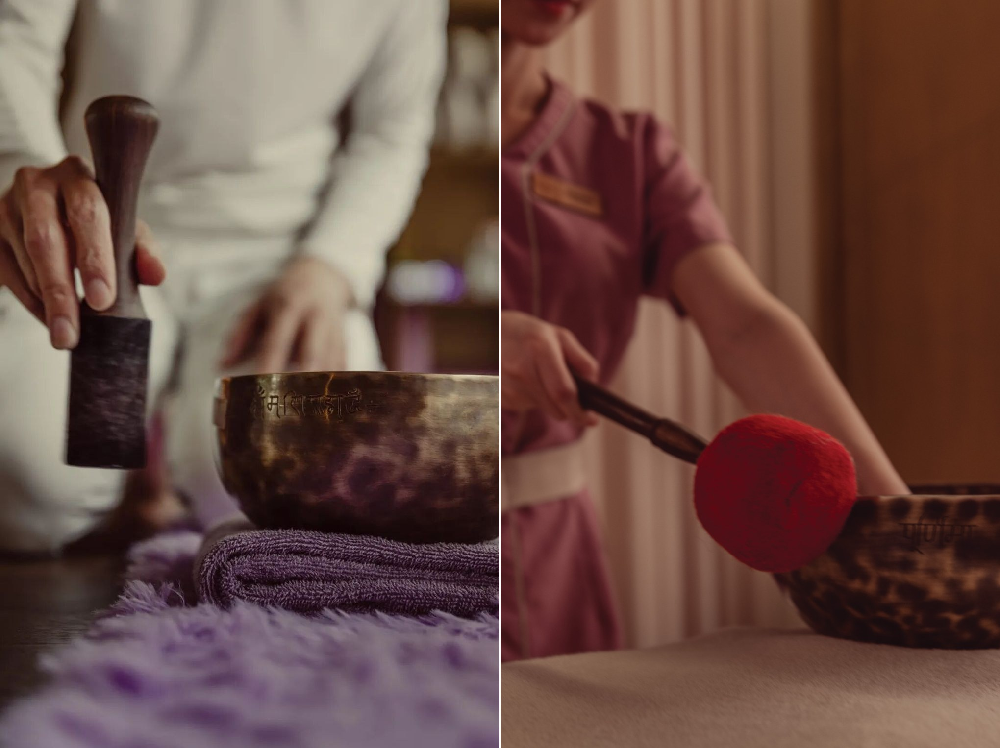

Maia 太懂得客人的皮肤经历了什么。 针对烈日与海风的「皮肤急救包」：新鲜芦荟原液即时镇静晒后灼痛，喜马拉雅盐深层导出被防晒霜堵塞的毛孔杂质。

<table><tr><td>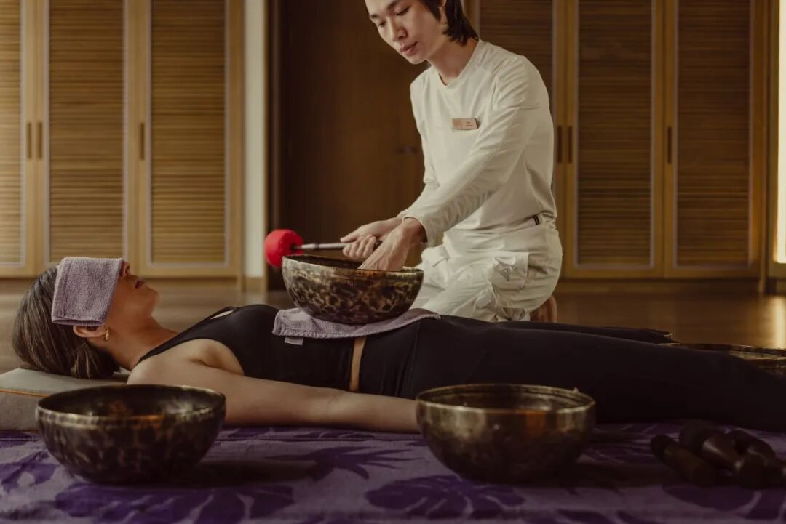</td></tr></table>

一件烟熏紫浴袍、一次温热净足与一声空灵的颂钵。理疗师的指力温柔且有分量，精准深入。当她完成左侧，强烈的触觉对比产生：疏通后的肌肉轻盈温热，像一块被揉开、缓缓「发面」的面团，纤维舒展而蓬松；而未经触碰的另一侧，在对比下显得沉重僵硬。 这种转化正如「冰雪消融」。你感觉到自己像一片被冬日严寒凝固的冻土，正在逐渐融化。她像个敏锐的身体阅读者，指力缓缓下沉，穿透表层直抵筋膜。在酸胀的对抗中，肌肉最终彻底臣服，抵达深层能量的释放。

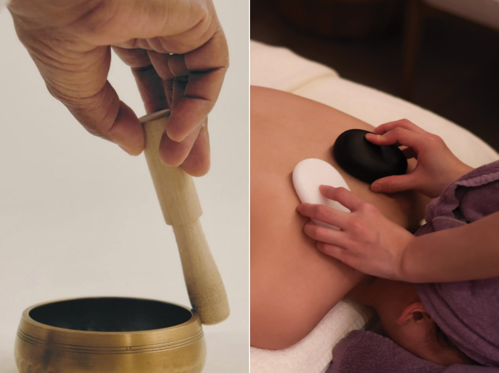

菜单中藏着深邃的哲学：黑玄武岩与白大理石，一热一凉，一阴一阳。这种「太极」式的东西方合璧，将东方的「平衡之道」与西方的「精准疗愈」完美合一。

<table><tr><td>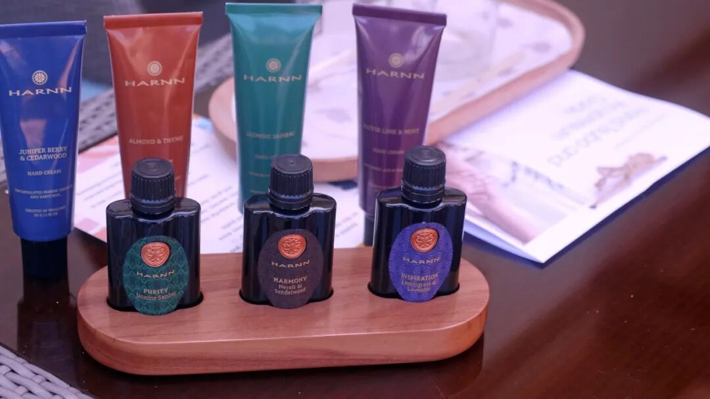</td></tr></table>

V i 问道：「您平日里喜欢做面部护理吗?」这让我注意到了与泰国顶奢品牌 HARNN 合作的系列。其中的Face-O-Logy 被定义为 「面部普拉提」——精准拨动那些因压力而僵硬的表情肌，唤醒肌肉本身的弹性。做完后照镜子，会有一种气血通畅后的紧致与红润。

<table><tr><td>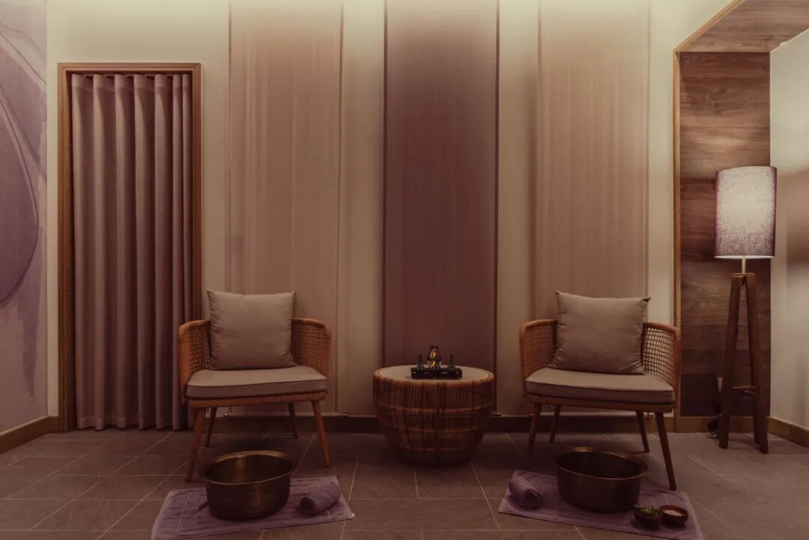</td></tr></table>

不仅如此，Maia 将这种深度技巧延伸到了身体的每一个维度：热竹疗法的深层热压、考验默契巅峰的「四手按摩」，甚至是唤醒脉轮平衡的Maia Symphony。无论你带着何种负累来到这里，Maia 都是一个巨大而温柔的容器，能将一切疲惫悉数疗愈。

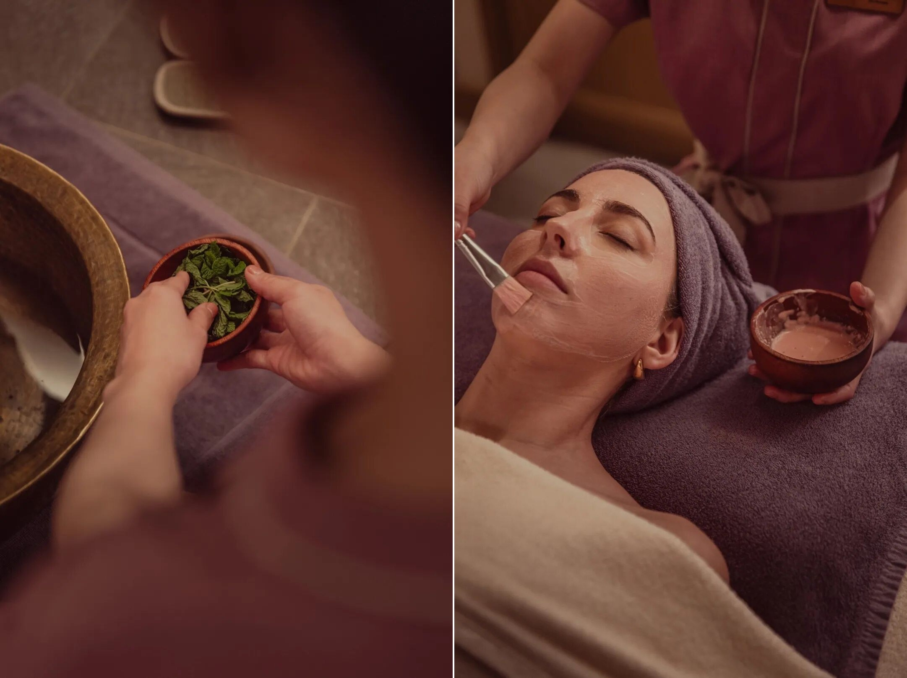

按摩结束后，另一杯茶已静候桌上。仪式始于蝴蝶豆花茶的纯净排毒，终于姜熊猫茶的暖愈收尾。一冷一暖，一蓝一金，从入定到元神归位。

<table><tr><td>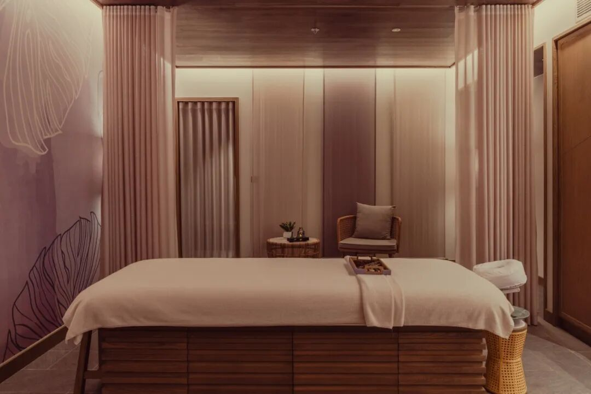</td></tr></table>

这次水疗的放松效果，在当晚睡眠中立竿见影，对于长途跋涉的旅人而言，按摩后感到通体舒畅，睡了通透、安宁、完整、深沉的一觉。

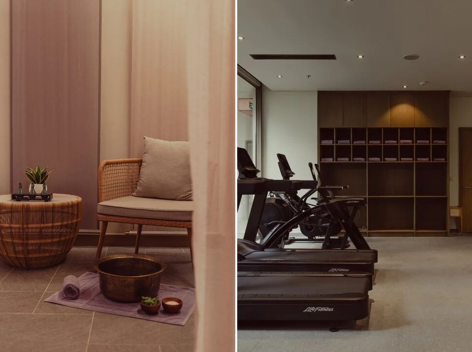

这是一种久违的、难得的复苏。酒店非常重视客人的睡眠质量，甚至有一项专门名为 「Sleep Wellwith Fusion」 的特殊仪式。哪怕你没有刻意去预约，这种「助眠哲学」也渗透在服务的细节里: 用轻柔的伸展、引导式的呼吸，配合特定的香薰，帮助那些神经紧绷的都市人强制「关机」。02 身心 疗愈Energy Field:Body,Mind,and Soul

<table><tr><td>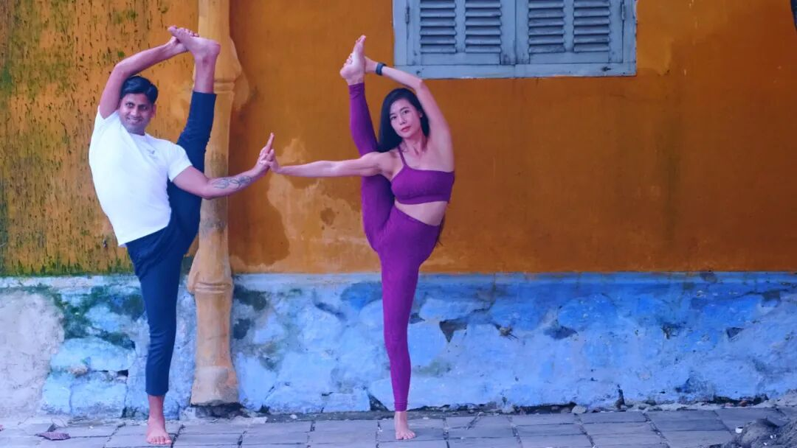</td></tr></table>

我在海边体验了颂钵疗愈。「嗡——」的声波像水纹一样，在那一瞬间的震颤中，自己像是一个被重新调频的乐器——所有的 杂 乱噪音被彻底清空，只剩下一种纯净的空灵。

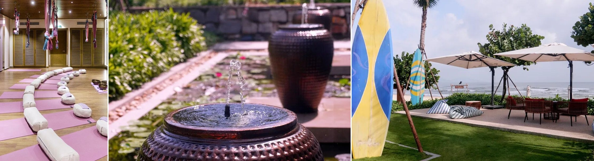

Sanjay Rawat 来自印度，他说冥想就是一种专注，而他的课程表，这里有点像「疗愈学院」。客人受邀参与的活动，始于清晨的「日出冥想」唤醒身体，从最基础的哈他瑜伽，空中瑜伽，延伸到需要挑战平衡的桨板瑜伽和水上瑜伽。

<table><tr><td>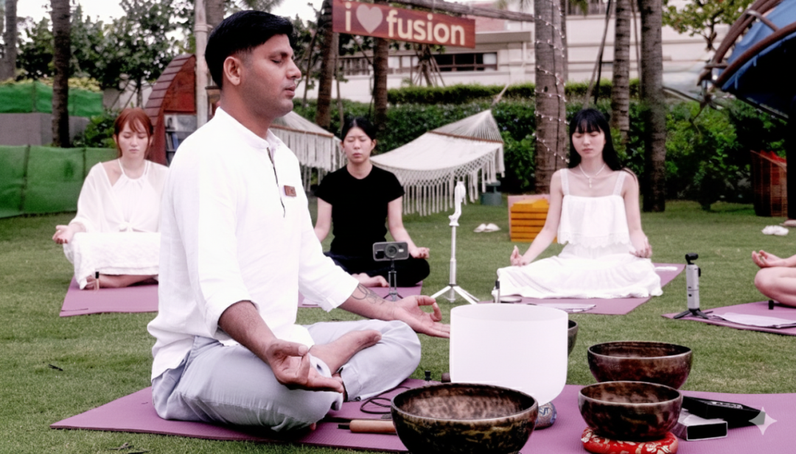</td></tr></table>

这些活动均由度假村专业的康体大师指导，且涵盖了能量层面的修复。康体不是严肃的苦修，是一场轻松愉悦的自我探索之旅，酒店精心考量了客人的平均入住时间，为三晚的旅程设计了一套全面的身心灵三重体验计划。 康体被拆解为由内而外的三重维度：身体在暖盐水池与深层按摩中享受放松；心灵在Maia Studio 的呼吸导引下回归沉静；灵魂则在海滩漫步与户外瑜伽的律动中，重拾与天地万物连接的滋养。03 味蕾食愈Culinary Healingforthe Palate

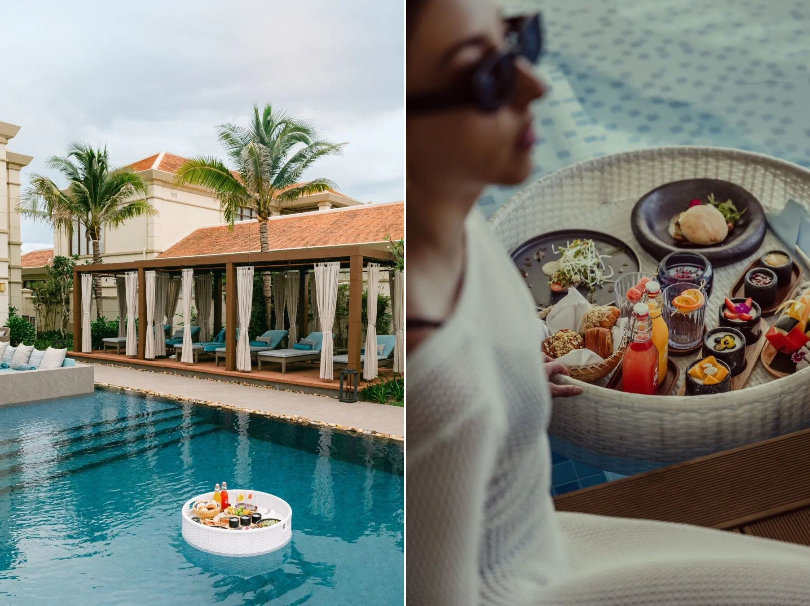

清晨，身体轻盈，胃口大开。这里的「随时随地享用早餐 (Breakfast Anytime,Anywhere)」 理念，是让度假来服务于客人的节奏。

<table><tr><td>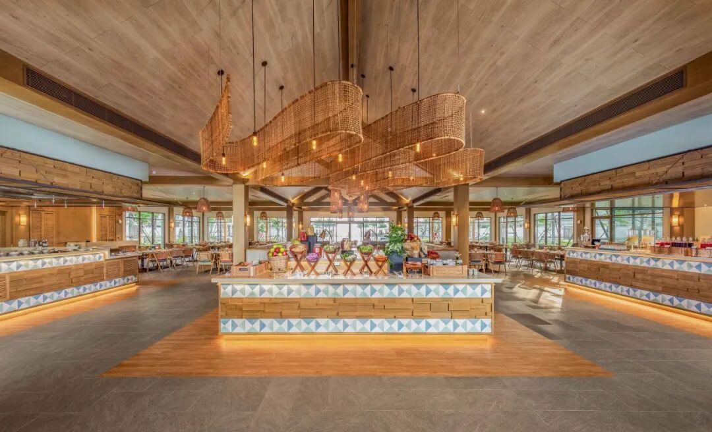</td></tr></table>

你可以睡到自然醒，随时选择在别墅泳池、沙滩甚至下午两点吃饭。但第二天一早，我们还是被主打健康风味的全日餐厅Fresh 所吸引，它的丰盛选项，你只需担心没有足够的胃容量。

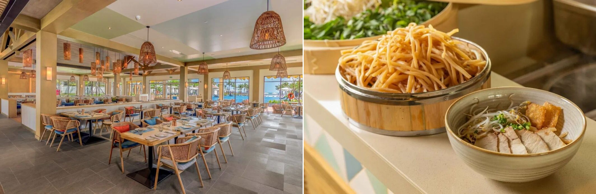

这些美食也像「食愈」，是用地道、新鲜的越南滋味滋养你。 相比于口味清淡的北部和偏甜的南部，越南中部的香料复杂、香草野性，值得尽情享用。

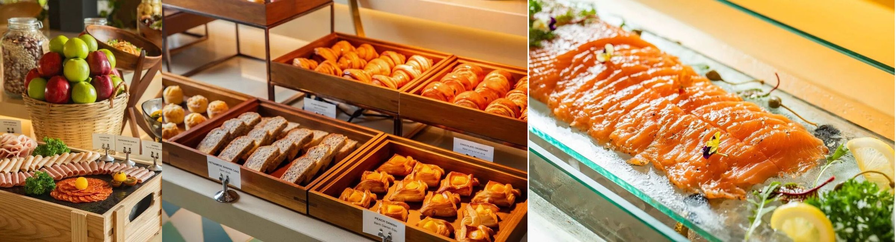

你一定要吃一碗越南米粉，将指天椒、青柠、蒜片调味滚烫的牛骨高汤，撒入罗勒与刺芹，这是酸、辣、鲜、香的热气腾腾口感。鲜虾春卷用半透明的米纸透着晶莹的质感，包裹着新鲜的虾仁、米粉和薄荷叶。蘸上一点甜辣酱，这是爽脆与清爽的口感。

<table><tr><td>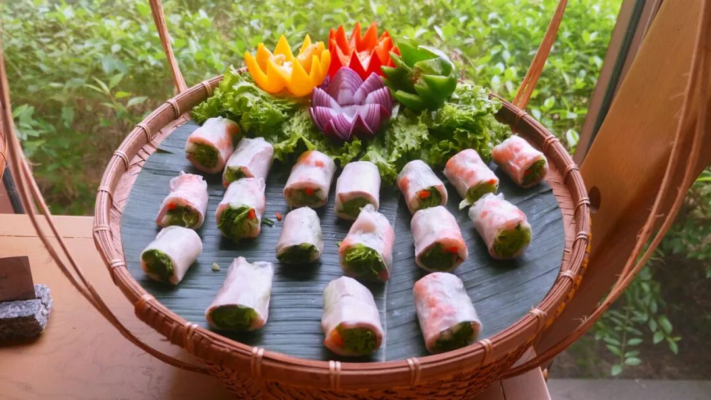</td></tr></table>

Fresh包揽了多国料理，第一晚的晚餐，是一场对本地风土的致敬。河内炸春卷的酥脆米纸，柚子海鲜沙拉有越南特有的酸甜鱼露，炒澳洲牛肉时用了越南著名的嘉莱省胡椒激发香味。

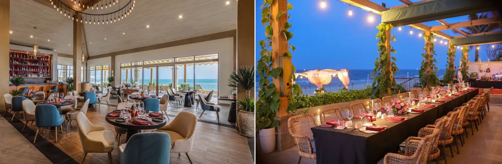

第二晚在CHAR Grill 餐厅，这是在地顶级食材和西式技法的巧妙精致。富安的黄鳍金枪鱼，表皮被微微炙烤后留住刺身质感，搭配的查桂有机茄子，来自会安古城边的有机蔬菜村。茄子的烟熏味与金枪鱼的鲜甜交织，让人同时尝到了富安的海洋和查桂的田园。

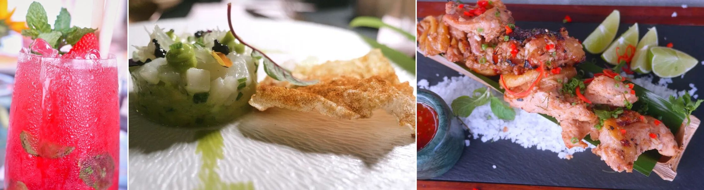

这种融合不止于此：北海道扇贝塔塔，用越南本土柚子和鳄梨来提鲜。鸡肉卷包裹着鹅肝和野生菌菇，佐以红薯泥，是受法国饮食文化影响的深厚功底。

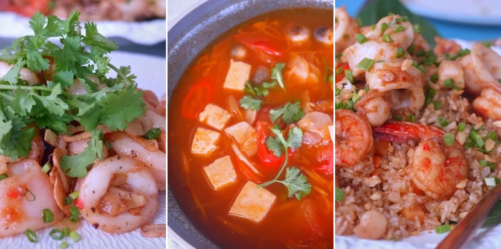

最后的午餐是在海边，这是一场关于火候、野性与海岸风味的狂热赞美。竹筒烤地标鸡，有鸡肉的鲜嫩与竹筒的清香；李山焦香蒜片和葱花，激发鱿鱼的Q弹和海洋咸香。泰式酸辣冬阴功汤的滚烫酸辣又与印尼香辣海鲜炒饭的丰富香料交织。

<table><tr><td>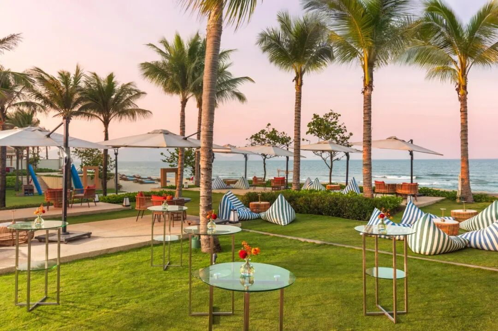</td></tr></table>

美食可以是风味的执着，高品质的水准，和一次味蕾上的地理探险。Breeze 池畔酒吧专注于清爽的鸡尾酒，是日落微醺、打发池畔时光的最佳处。

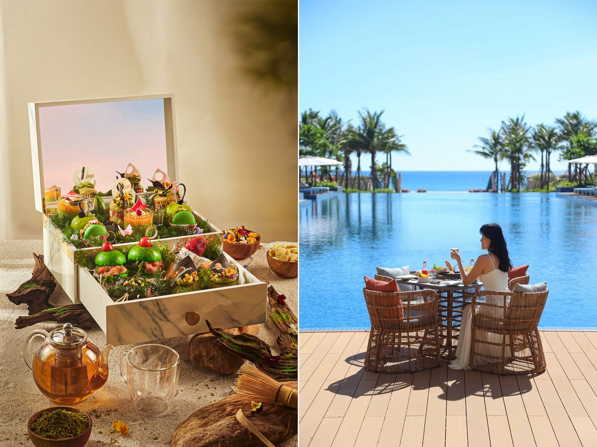

我做了一个有想象力的尝试——用酒精穿越越南：向北，是一杯「越南河粉鸡尾酒」。它选用了赵夫人沙巴柑橘金酒（一款产自越南北部沙巴高原的本土金酒）为基底，混搭了香菜、辣椒和自制糖浆。向中，是一杯「会安荷风」。以荷花茶为基底，清雅的莲香，像隔壁的古城会安午后慵懒的风。向南，是一杯「湄公河三角洲」。用金酒搭配金桔与柠檬草，还原了南部热带河流的湿润与酸甜。就这样，用味蕾完成了一次纵贯越南南北的旅行。04 云端栖居Resortinthe Sky

<table><tr><td>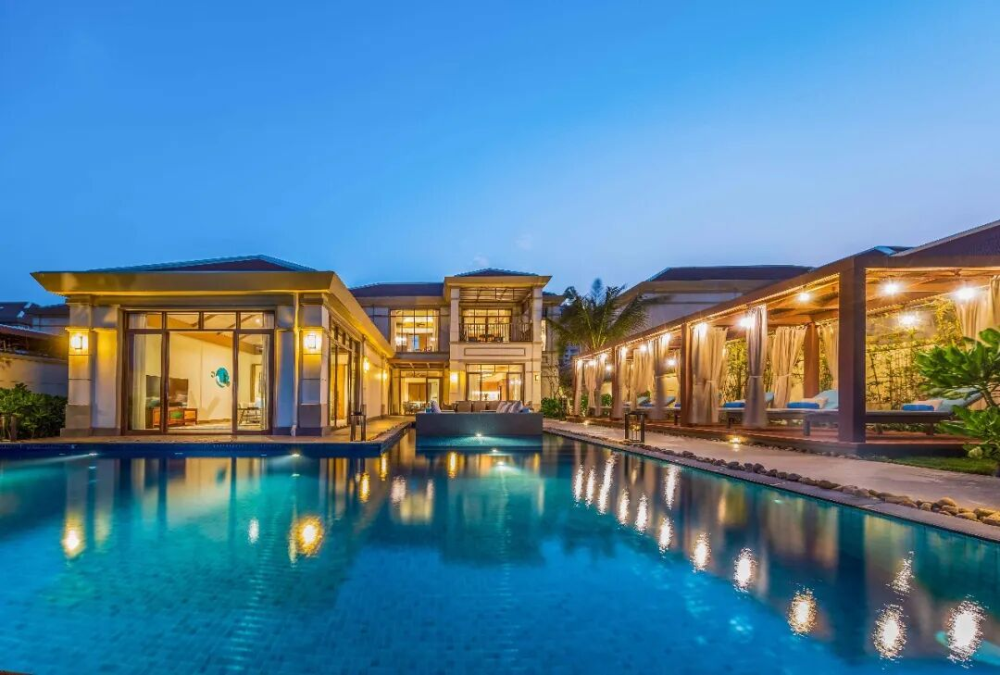</td></tr></table>

无论你入住哪种房型，都能享受到一部分基础的健康福利。 而从海景套房及以上开始，每天50分钟的水疗体验便成为了标配。这意味着，你每天在海景套房醒来，享受完慵懒的早餐后，就可以开始期待下午那段专属的水疗时光。

<table><tr><td>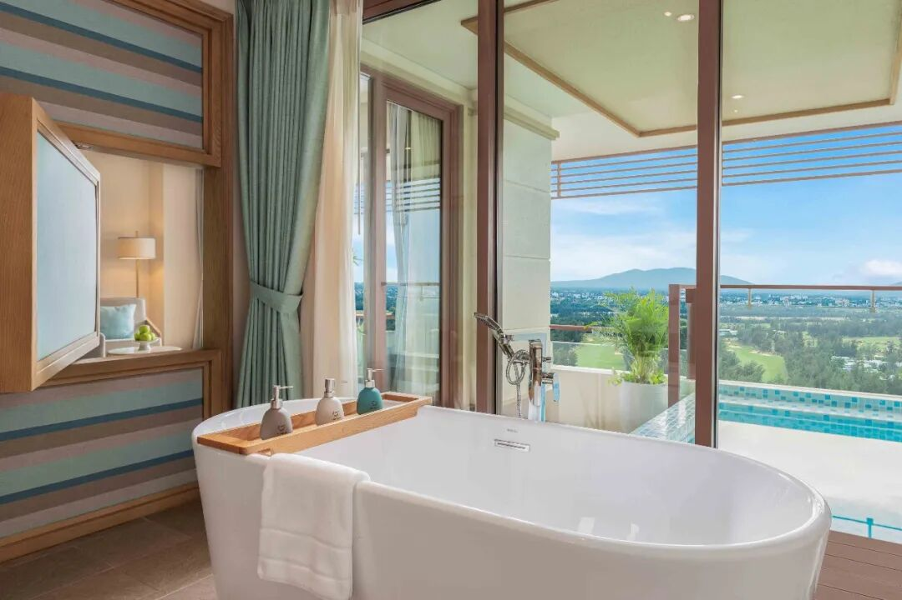</td></tr></table>

当按摩与疗愈不再是需要刻意安排的奢侈，而是变得像早餐、午睡一样理所当然。 当这种疗愈成了日常，你会惊喜地发现，随着旅程的推进，身心正变得越发轻盈。

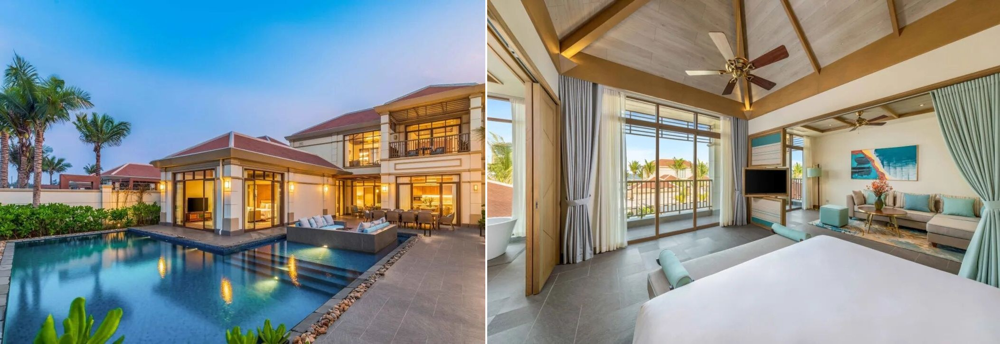

住宿空间划分为两大类型，分别是拥有157间客房与套房的旅馆栋，和85间拥有私人泳池的Villa。

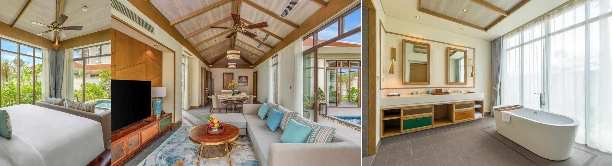

这里的基础房型，也奢侈地给到了60 平米的起步空间。当你推开门，一定会喜欢眼前的画面：一整面落地的全景窗，将岘港的红瓦、郁郁葱葱的绿意，以及远处的碧海蓝天，像巨幕电影一样毫无保留地拉到眼前。床品使用的Catherine Denoual 顶级亚麻——干燥、亲肤的触感，适合海边休憩。

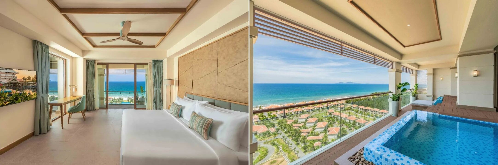

海景泳池套房将私人泳池从地面搬到了云端。当你浸入阳台那方无边的蓝水，视线越过边缘，直接与南中国海对齐。这是一种让你能够自由漂浮、自由梦想、并尽情欣赏周围景色的「云端栖居」。

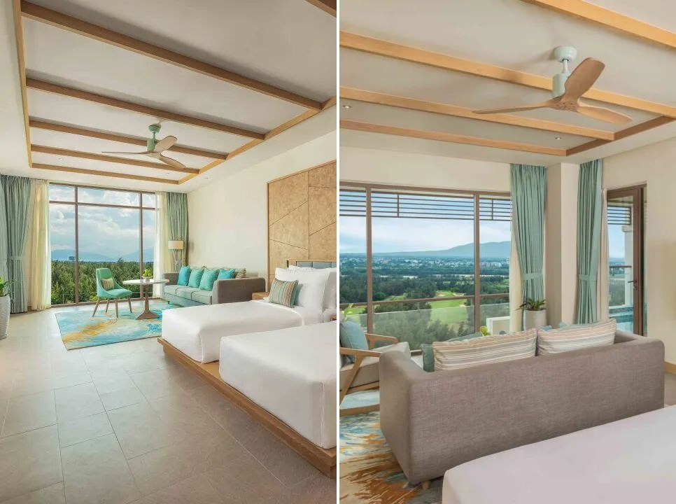

对于真正的球手而言，高尔夫套房意味着与大师作品的零距离。仅数步之遥，便可纵情挥杆于两座由名宿亲自操刀的竞技圣地：格雷格·诺曼设计的「诺曼球场」与杰克·尼克劳斯设计的「尼克劳斯球场」。在这片由传奇勾勒的果岭上，每一次击球，都是一场跨越时空的竞技博弈。

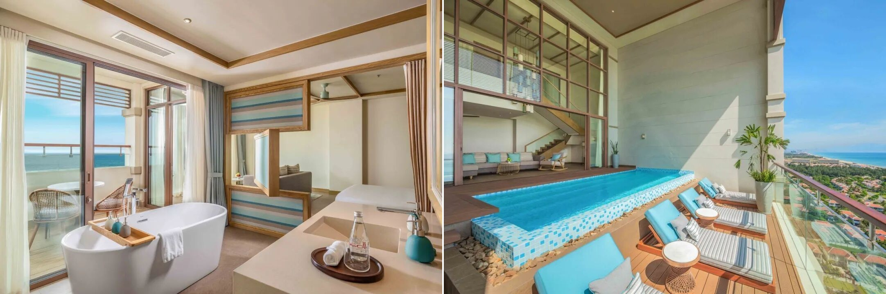

而将奢华度彻底拉满的是三栋「总统别墅」。 它们配备了两个私人泳池、一个独占的Spa房、私人厨房以及管家团队。 在这里，服务与空间都被提升到了极致的私密化避世。

<table><tr><td>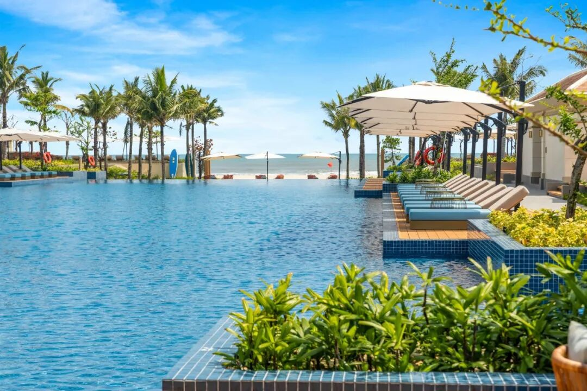</td></tr></table>

入住Fusion的体验心旷神怡，巨大的户外泳池连接着雪白沙滩和湛蓝海面，从早到晚触目即是海天一色的风景。05 会安流光The Amber Flowof Hoi An

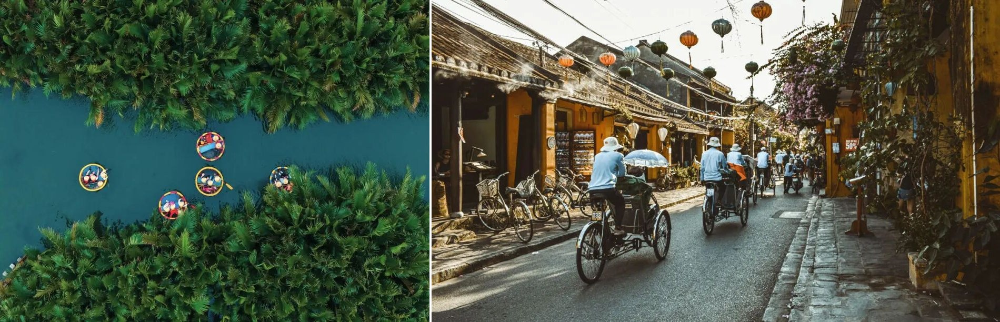

酒店的免费班车只需20多分钟 ，便将你送至被联合国教科文组织列为世界遗产的古镇——会安 。

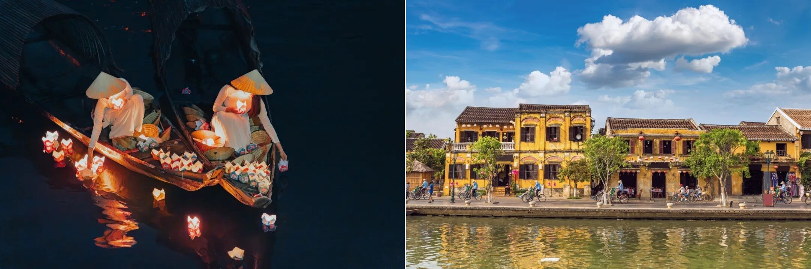

这里曾是15世纪的主要贸易港口，是海上丝绸之路的重要一站。老建筑融合了中国、日本、葡萄牙和法国四种风格，有着陶土屋顶和迷人的黄色外观。

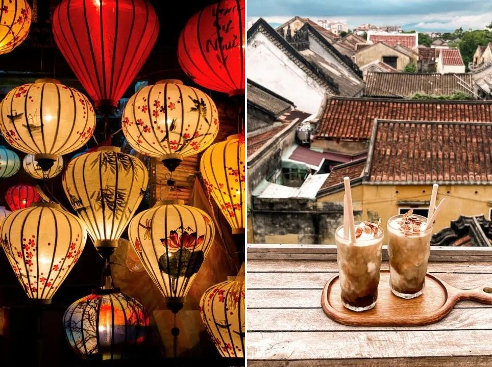

如今，这里是岘港最受欢迎的景点，是一个展示传统工艺和当地美食的中心。漫步于步行街，你可以参观关公庙、拜访定制裁缝店、皮具店、咖啡馆，并用平民的预算享受帝王般的美食 。

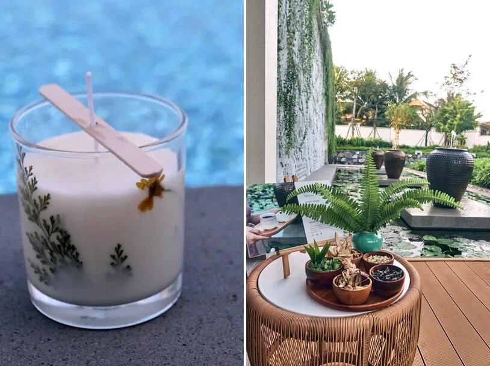

这份度假的余韵，最终被我封存在了 HARNN Workshop 制作的那罐香薰蜡烛里。每当烛火摇曳，海风、植物与碧蓝池水的记忆，总会在香气中重现，回想起刚抵达时那个疲惫的午后，Manager Vân 递上的那杯酒红色康普茶——本土甜菜根和生姜的微辛，伴随着天然发酵的细密气泡在舌尖跳跃，那是越南最原始的鲜活。正如切萨雷·帕维塞所写： 「喝下这一杯，身体便感受到了植物与河流所蕴含的生命力。」

<table><tr><td>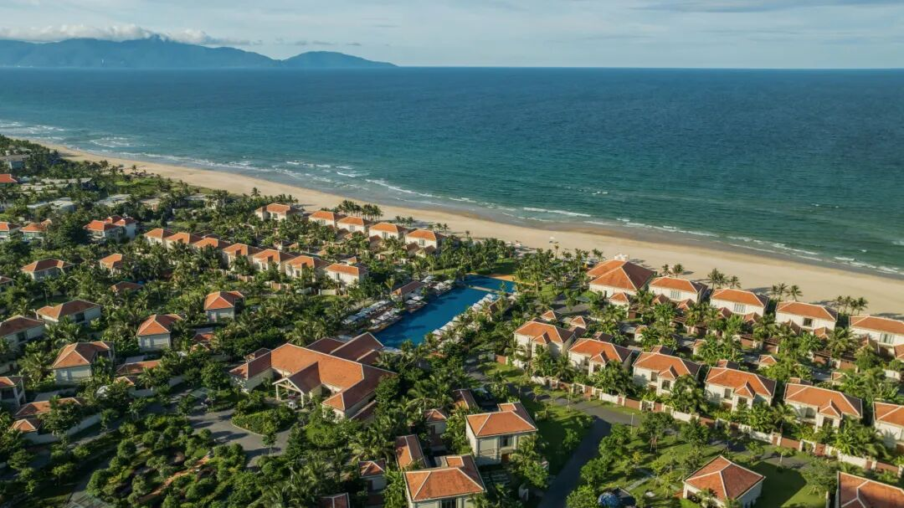</td></tr></table>

在短暂的假期中，人有机会彻底洗涤与复苏。来时或许带着满身疲惫，离开时，定会带着一份由内而外的「重启感」。谁会拒绝这样一场身心焕新之旅呢？在这里休养、重启，然后更有力量地奔赴下一段旅程。 - The End - 编辑｜Sandy 撰文｜耿悦 图片｜耿悦、 品牌提供 更多精彩 ▶▶ 从科莫湖到多洛米蒂，三家酒店带你邂逅意大利的湖光山色 ▶▶国贸公寓：CBD核心区的健康奢居与理想生活范本 ▶▶ CCD郑中设计全新力作「雍熙荣 ROUSSILLON」隆重启幕， 打造城市首个策展式生活方式目的地

---

## 制作团队

- **编辑**：Sandy
- **撰文**：耿悦
- **图片**：耿悦、品牌提供

---

## 授权与版权

本文所有图片与文字由「Fusion Resort & Villas」品牌方与撰文者耿悦共同提供。品牌方图片版权归 Fusion 所有，未经许可不得转载、复制或商业使用。
