# 无锡荡口古镇美憬阁精选酒店 · 重绘一曲江南史诗

江苏，无锡，荡口古镇，江南水乡千年文脉。

**素材授权**：本文图片与文字均来自「无锡荡口古镇美憬阁精选酒店」品牌方授权。文中部分内容为酒店官方品牌资料的摘录。

---

<table><tr><td></td></tr></table>

<table><tr><td>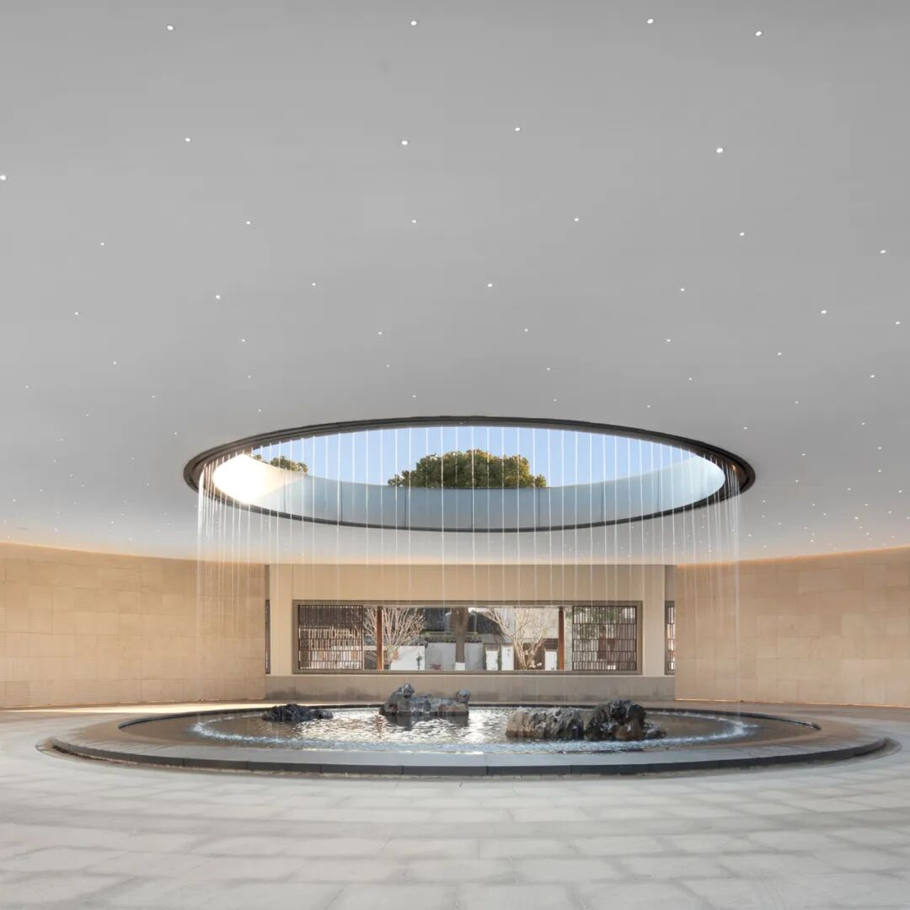</td></tr></table>

坐落于美丽的江南水乡、千年历史的荡口古镇，无锡荡口古镇美憬阁精选酒店以明朝重臣华察之府邸为基，借雕梁画栋尽显官宦家族之气派。 这座于2025年5月17日正式开业的酒店，坐落于华察归隐后营建的“嘉遁园”遗址之上。 踏入这里，便踏入了有着500年历史、璀璨文化的明朝江南园林，打开了通往中国古典生活体验的时空之门。 穿越古今，既有园林之幽，又有望族之气，还有诗礼之魂、艺术之美和风雅之韵。01. Space 

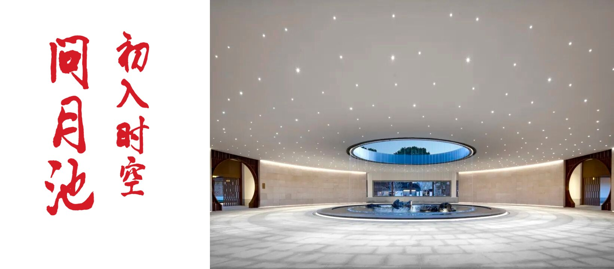

酒店的落客区设计成圆形空间，彰显"天圆地方"之感。中央水景上方是圆形的天井，规整的圆形象征着和谐与统一，表达着中式宇宙观，迎接宾客走进这座静谧的宅邸。

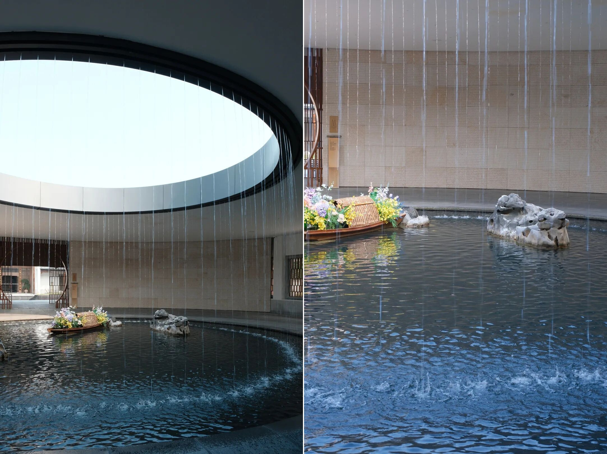

天井如镜纳苍穹，晴日光影跃动，雨时珠玉飞溅。灰瓦白墙围合出的这方天地，让每一位到达的宾客在第一时间便感受到中国古典建筑的哲学意蕴。 从天井望出去，层层叠叠的屋檐勾勒出江南建筑特有的天际线。这是华察华太师府邸的真实遗存，不是复制品，不是仿古建筑，而是500年前那座嘉遁园的原址。青瓦灰墙在时光中沉淀，每一片瓦当、每一根梁柱都在诉说着明代士大夫的生活美学。02. Lobby 

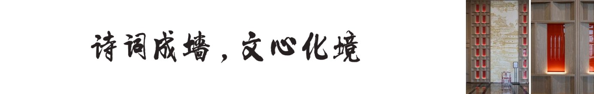

步入大堂，正对入门的是一面格外瞩目的墙——金箔材质、手工花纹雕刻，呈现出典雅的山水画面。墙上镌刻着数首诗词，摘选自这座府邸的主人——华察。

<table><tr><td>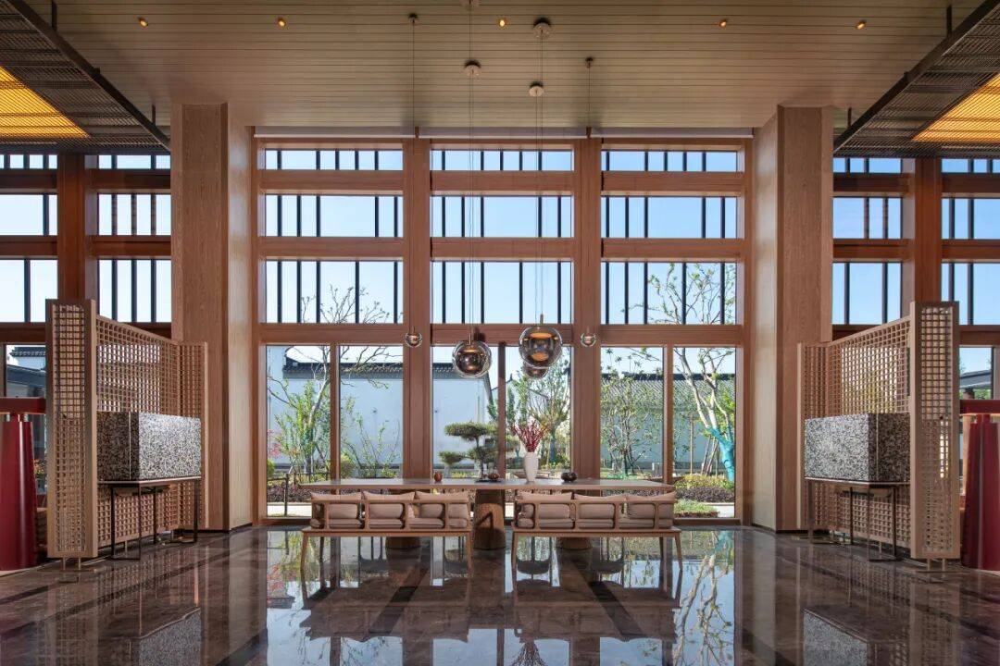</td></tr></table>

大堂的设计灵感正是源自华察的《过烟水庄》。这首诗描绘了"隐居田园、清静自守、文人雅趣"的理想空间，既有陶渊明式的归隐，也有苏轼"隐而不绝"的潇洒。 设计师模仿山间隐居的低调，营造出一个安宁祥和的氛围，邀请宾客离开日常的忙碌，体验中国文人宁静致远、顺应自然的精神追求。

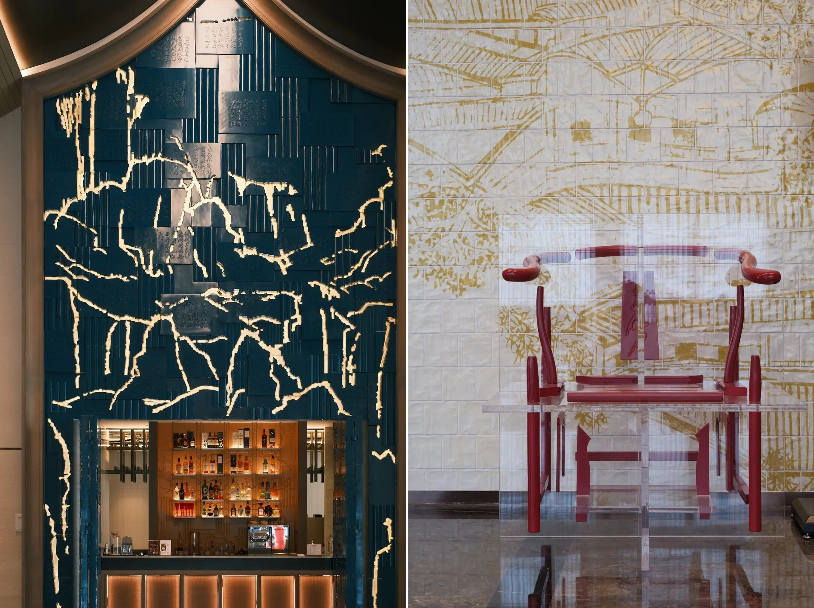

前台左右两侧的瓷板上印刻着"乐游山水"美景图，展示荡口古镇的江南风光。大堂一隅摆放着“华太师椅”，借明式太师椅之骨架，呈现“以今窥古”的当代表达。它既保留了传统榫卯的神韵，又融入现代线条的通透与轻盈，与大堂空间形成古今共构的视觉隐喻。 整个大堂融合木质元素与现代设计，文房四宝点缀在壁龛之上，将华太师的高雅情致与待客之道融入其中。走进大堂，仿佛进入一个“华察式的隐居理想”：喧嚣顿时散去，置身于这片隐世秘境的旅人，会放松身心。03. Design 

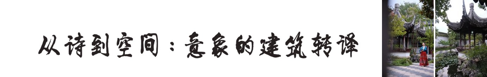

酒店最动人的设计理念，是从华太师的诗中取灵感，提取诗中的意象转化为设计元素，以此作为各个空间的主题。 华察赴京赶考，殿试中进士，被以“庶吉士”的身份入翰林院，后升为东宫侍读。他归隐后精心设计的嘉遁园，有着二十处知名园林景观：一堂、一亭、一涧、一舫、一庐，二居、二处，三斋、三轩、三阁。 文征明曾言：“余尝访君鸿山之居，屋庐靓深，林木秀蔚，壶觞在前，琴书左右，从客燕笑，悠然以怡。” 设计师选用华察诗歌中的自然元素作为视觉叙事的基础，把树叶轻拂的沙沙声、水流的潺潺声，甚至月夜的静谧无声，都巧妙地融入到房间的纹理、色彩和材料中。

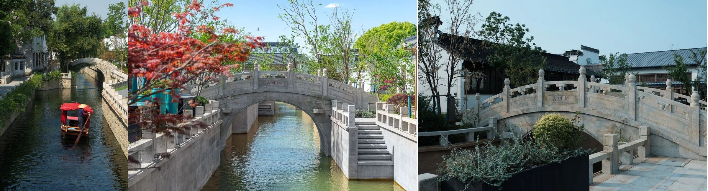

一条河流贯穿酒店始终，引古镇花笑池中水，汇入北仓河。 沿河新建的三座桥——清溪桥、蠡川桥和子裕桥，分别纪念华察的三位好友：顾可久、施渐、王问。 华察曾书对联："两树碧梧桐，清簟疏帘无俗韵；扁舟轻箬笠，斜风细雨有良朋。"由此可见华太师是一个非常重情义的人。

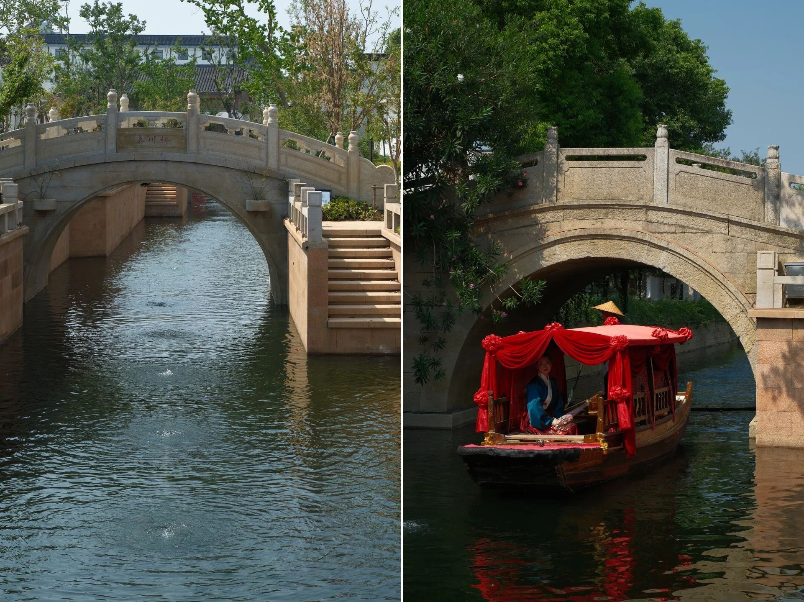

桥的设计保留了江南石桥的古朴，也融入了现代的简约线条。水道蜿蜒其间，客人可乘坐摇橹船，于北仓河上泛舟慢行。船过桥下，橹影摇曳，橹声欸乃，恍若梦回江南旧时光。04. Guest Room 

178间客房及套房以庭院式布局呈现，将文化底蕴与历史故事融于设计，穿梭交响于酒店的每一个空间之中。

<table><tr><td></td></tr></table>

一径逶迤万木稠，乱峰深坞草堂幽。 空山尽日无人到，曳杖时从鹿麂游。

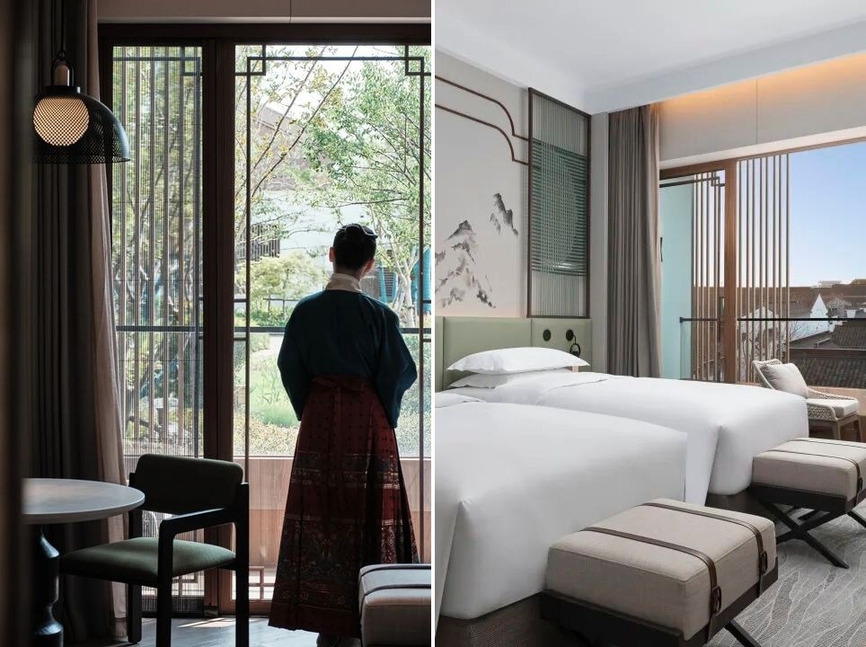

127间木石居客房是酒店的主力房型，每间都配有私人阳台，推开窗便是江南园林的景致。温润的木质元素，淡雅的米灰色调，呼应诗中"空山"的静谧。

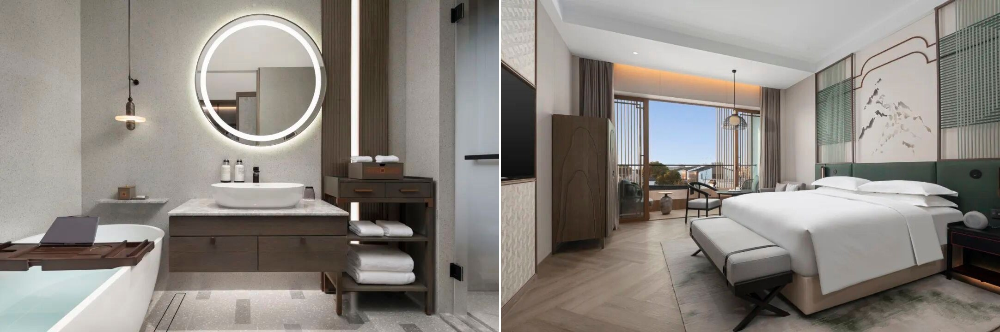

所用的马林·格茨洗漱用品散发淡淡草木香，汉斯格雅卫浴设施将现代舒适与古典美学完美结合。美憬阁定制床具系统，带来轻柔包裹感，让你融入江南水乡的秀梦中。

槛外疏篁荫石渠，水声和月到林居。 清修自得幽人意，不是持竿欲羡鱼。

<table><tr><td>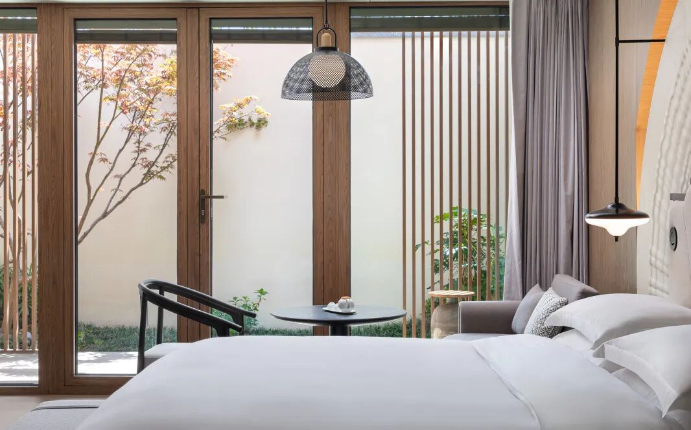</td></tr></table>

水竹居包含庭院房、庭院别墅和古建房三种房型。最特别的是由陈家转盘楼改建的古建房——这是真正的明清古建筑，保留了原始的木构架、雕花窗棂和青砖墙面。

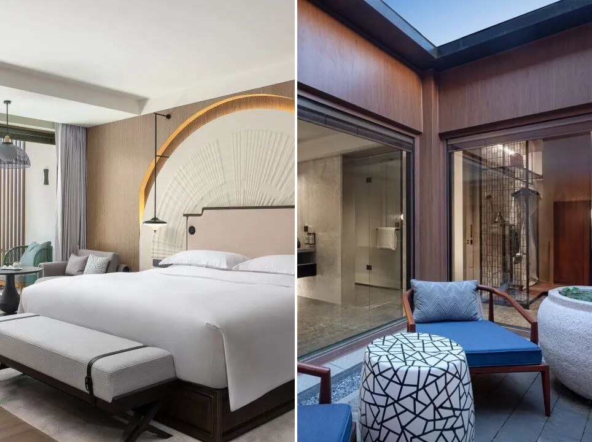

7栋独立庭院别墅是水竹居的精华。室内面积从80到120平方米不等，配有独立的会客厅、茶室空间，部分别墅还设有私人温泉池。 每栋别墅都有私家庭院和天井设计。天井四水归堂，雨天时能听到雨滴从瓦檐滑落——让你梦回江南，卧听风雨。 庭院别墅将江南园林的精髓浓缩其中——太湖石、小桥、亭台，配以精心修剪的松柏和枫树。每个庭院都是一个独立的小世界，春有樱花，夏有竹影，秋有红枫，冬有松柏。

<table><tr><td>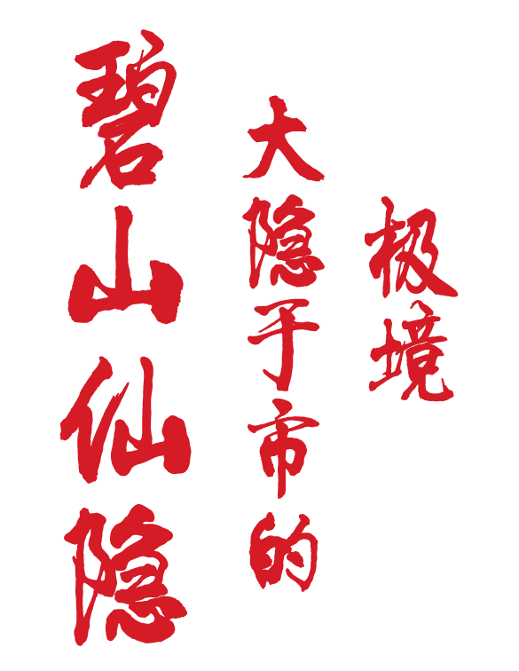</td></tr></table>

琅玕千尺昼阴阴，片石苍苔一径深。 尽日可淹佳客坐，相看不改岁寒心。

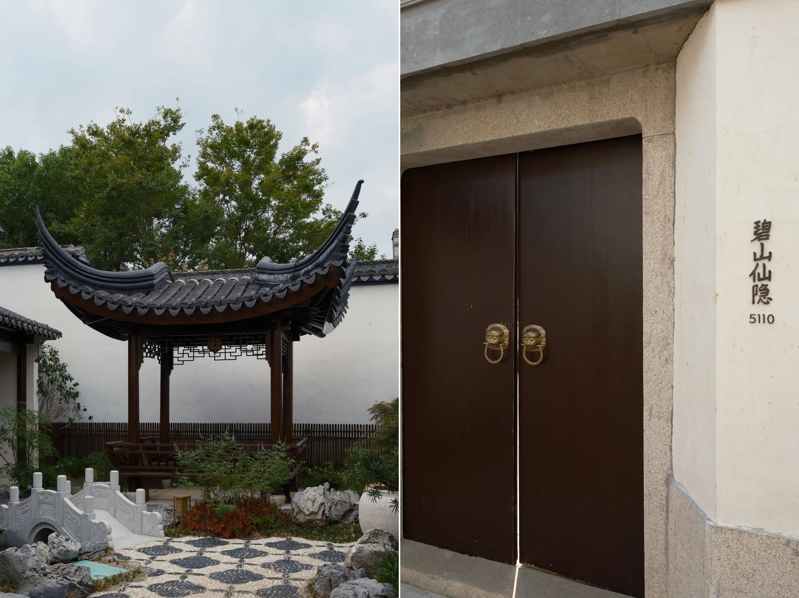

碧山仙隐是酒店的顶级房型，包括碧山套房、仙隐套房、庭院别墅和古建别墅。这里是酒店客房中世外桃源般的存在——远离主楼，藏身于园林深处，有着最好的私密性。 碧山套房面积达150平方米，设有独立的书房、起居室和景观阳台。仙隐套房更是奢华，518平方米的空间里，主卧、次卧、书房、茶室一应俱全，还有40平方米的私家露台，可以独享园林美景。

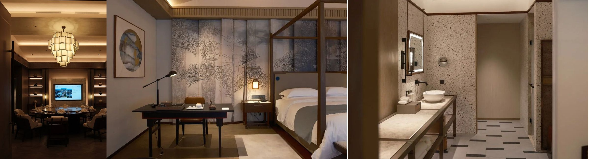

古建别墅完整保留了明代建筑格局，木梁青瓦，庭院深深，住在这里，仿佛真的成了500年前的文人雅士。 定制的新中式家具融合明式家具的简约之美与现代人体工学，智能控制系统则巧妙隐藏于传统装饰之中。

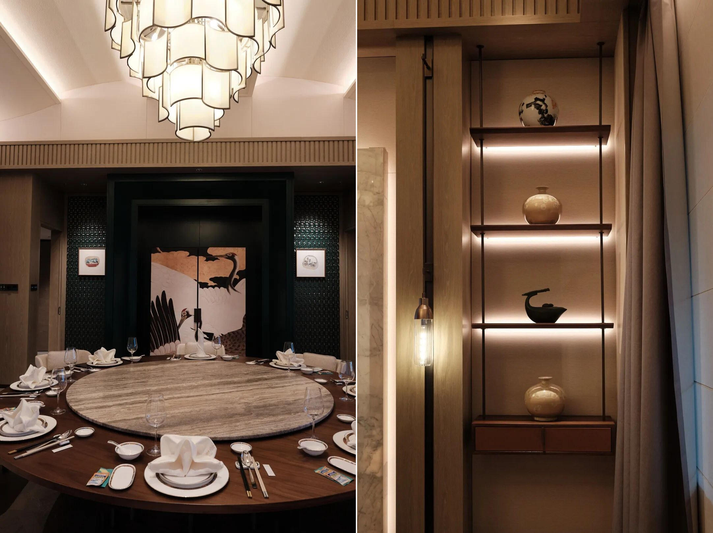

除了静谧私宅般的居住体验，碧山仙隐套房亦配有高端中餐包间，可容纳私宴、家宴或会客聚谈，充分诠释“大隐于市”的生活格调。每一间客房皆有独特格调，让每一位宾客体验到中国江南独一味的文化内涵。

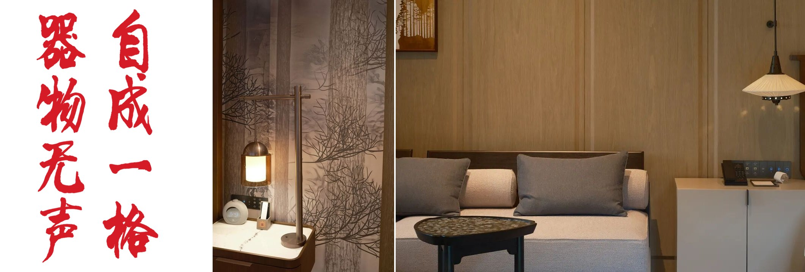

<table><tr><td>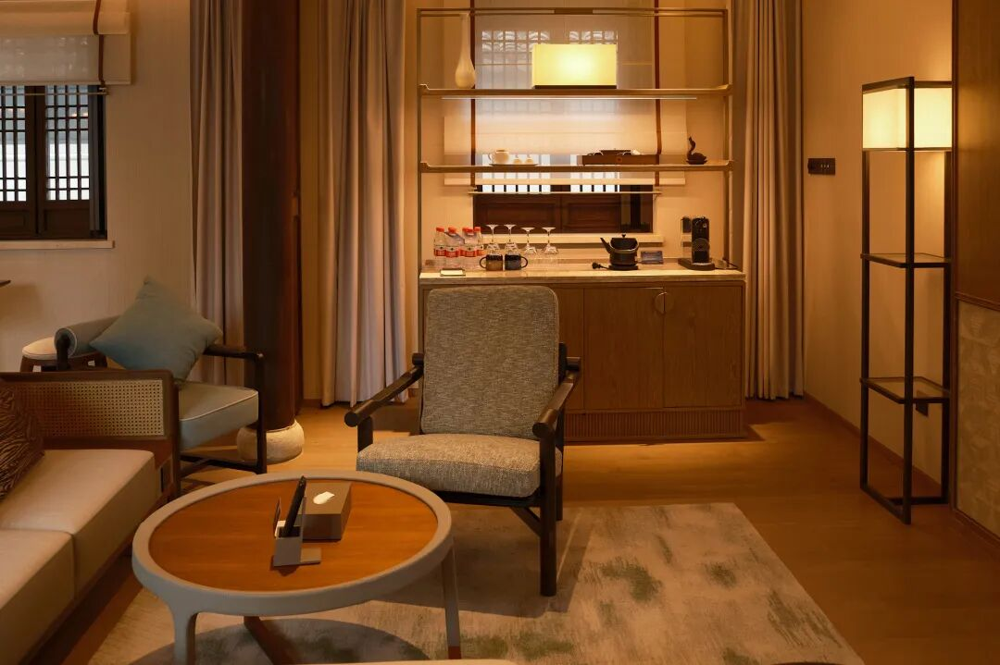</td></tr></table>

酒店的家具设计融合古典与现代，整个空间也暗含着两种风格的和谐交融。 欧式典雅与中式古典美学碰撞，营造既庄严又温馨的氛围。从光滑的木桌到丝绸挂毯上交织的图案，每一种触感都蕴含着华太师府的奢华和历史。

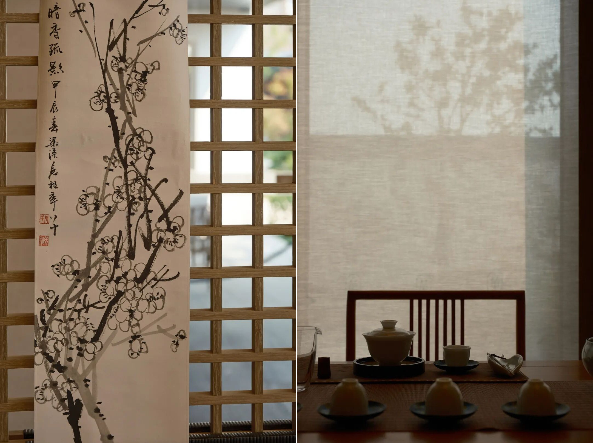

空气中弥散木香，不同区域设有定制香氛与背景音乐。这里，历史与文化在每个细节中得以传承，迎接每一位宾客走进这座文化深厚的时光府邸。茶道品鉴时，茶艺师素衣执壶，温杯、洗茶、冲泡，一气呵成。

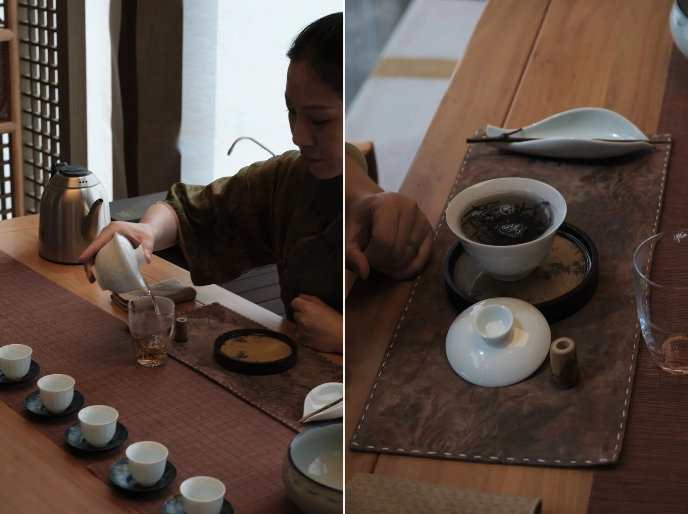

宾客静坐凝视，茶叶在盏中舒展，茶汤缓缓转涌。绿茶清香，红茶馥郁，茶香氤氲间，一饮一啜，皆见“茶禅一味”的静美之意。05. Cuisine 

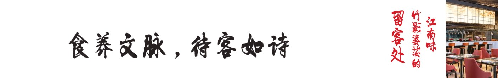

<table><tr><td>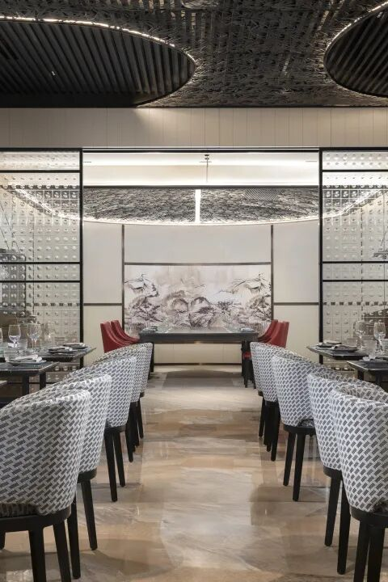</td></tr></table>

168座的留客处目的地餐厅，穹顶与墙面皆装饰着华察诗词画作中所描绘的清竹，设计灵感源自“竹文化”。

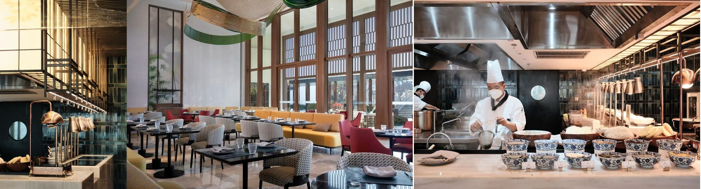

主厨精挑应季鲜材，以"任点任食"重塑江南待客之道，巧妙结合中西餐饮文化，全天零点菜单随时满足宾客们的味蕾偏好。

<table><tr><td></td></tr></table>

黄花掇可餐，白石煮可烂。餐菊楼设计灵感来源于文人雅士钟情的菊花，专业厨师团队深度挖掘太师府文化底蕴，以菊花入馔，呈献地道淮扬菜及各类经典菜系。主厨融合传统与创新烹饪技法，堪称商务宴请与家庭欢聚的理想之选。

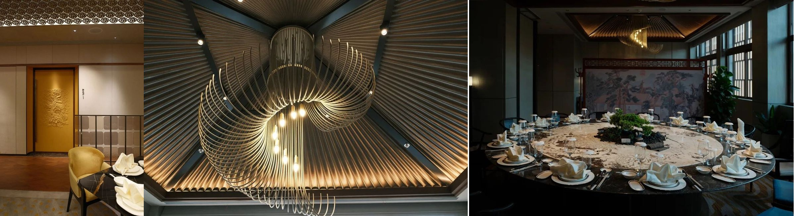

这里拥有1个绚丽的大厅，和13间设计感的包厢，三个包房各有寓意：学士厅、太史厅、太师厅象征华太师的官场生涯；独观厅、知退厅、自适厅体现他超然的人生态度和处世哲学。

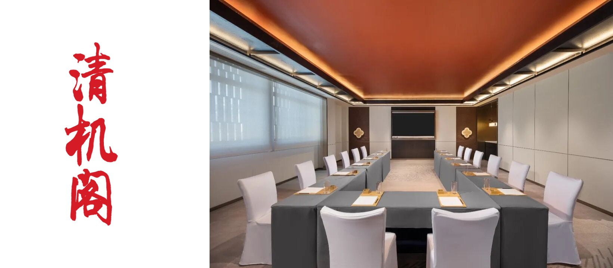

峰之孤、壁之高、阁之清、声之远，这里为文人墨客提供了一个清幽雅致、充满文化氛围的空间，可以交流文学艺术、切磋技艺、抒发情感，文化传承和交流。有4间多功能厅，面积从80 - 240平方米不等，满足各种会议需求，其中经筵厅可分隔成三个小型会议室。

<table><tr><td></td></tr></table>

宴会厅，面积800平方米，层高7.5米，配备先进的 P3 LED显示屏和视听影音设备，适合举办各类宴会与会议。无论是商务活动还是私人宴会，专业活动策划团队和婚礼管家将提供一站式管理服务。

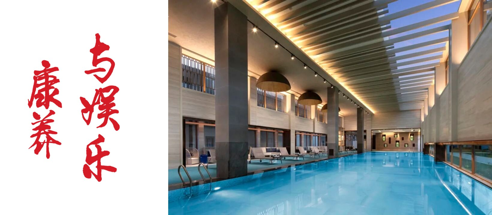

在长25米、宽7米的室内恒温泳池恣意畅游，同时提供儿童专用游泳池。运动之余，还可至蒸汽室和桑拿室漫享深度舒缓。

<table><tr><td>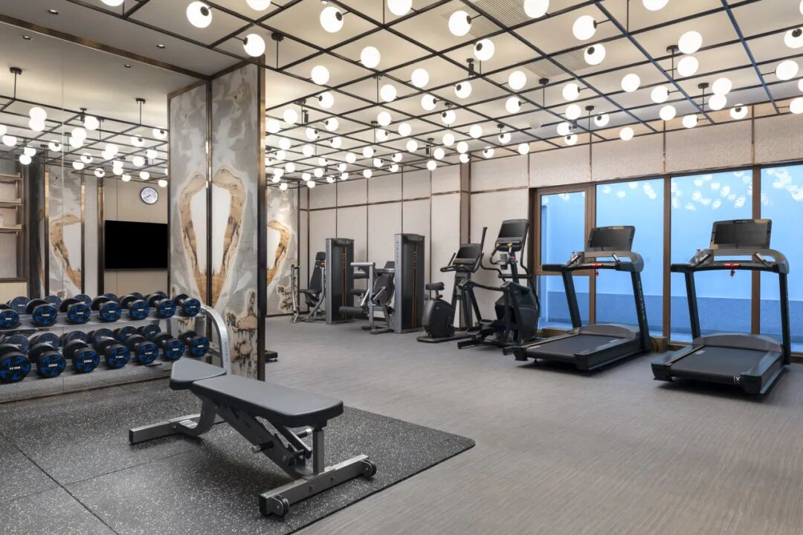</td></tr></table>

酒店的健身中心配备了优质的有氧运动和力量训练设备，为健康爱好者寻找创新的方法来恢复活力。06. Information 

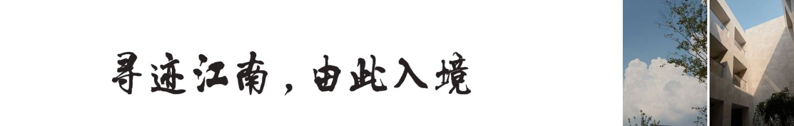

无锡的天空有着江南特有的温柔，大团的棉花糖云朵飘浮。 正午时分，阳光透过树叶的缝隙洒下，在白墙上投下斑驳的影子。清风拂过，树影摇曳，光影柔和。

<table><tr><td>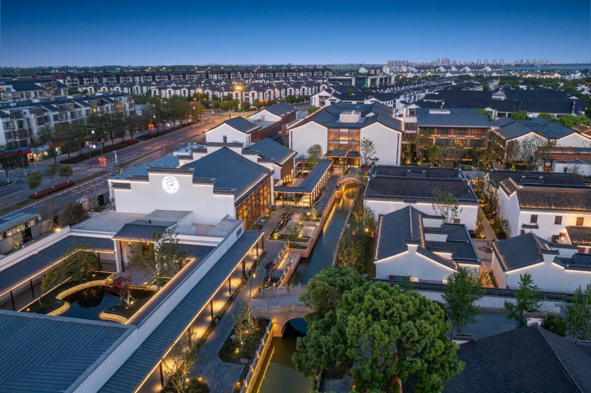</td></tr></table>

美憬阁酒店地处长三角核心区域，距苏南硕放国际机场和无锡东站均约15公里，距苏州北站约18公里，交通便捷。 从上海、南京、杭州等主要城市出发，无论自驾、高铁或飞机，均可轻松抵达。无论是探索江南古镇的文化底蕴，还是休闲度假与商务出行，这里都是理想之选。

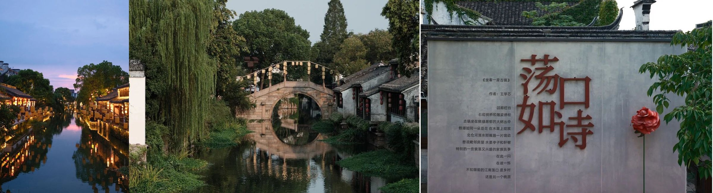

酒店与荡口古镇仅一桥之隔，步行便可踏入这座千年古镇。 作为国家4A级景区和中国历史文化名镇，荡口保持着罕见的宁静与完整性，未经历大规模商业化改造，也无喧闹人潮，至今保有原生的街巷尺度与居住氛围。

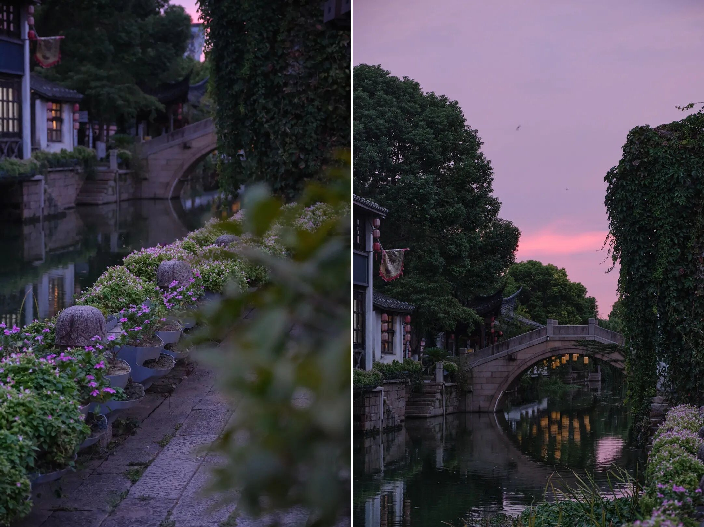

对旅行者而言，这是少见的、尚未被过度包装的江南古镇，安静、克制，格外珍贵。

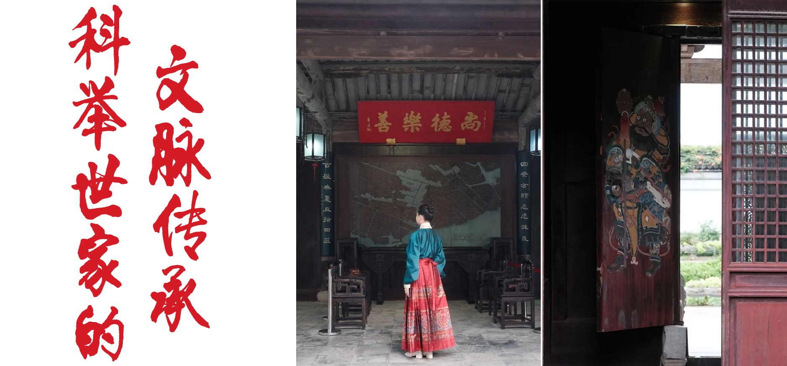

无锡自古就是太湖明珠，人杰地灵的文化重镇。从春秋泰伯奔吴开启江南文明，到近代钱钟书的《围城》、钱穆的《国史大纲》、阿炳的《二泉映月》，这片土地始终保持着一条不断裂的文脉。 而荡口，正是无锡文化最精华的浓缩之一。这里是华氏家族的发源地，为明清科举大家族。史载300多年间产生了37名进士、109名举人，"江表甲族推华氏，华之衣履冠盖遍天下"的美誉由此得名。

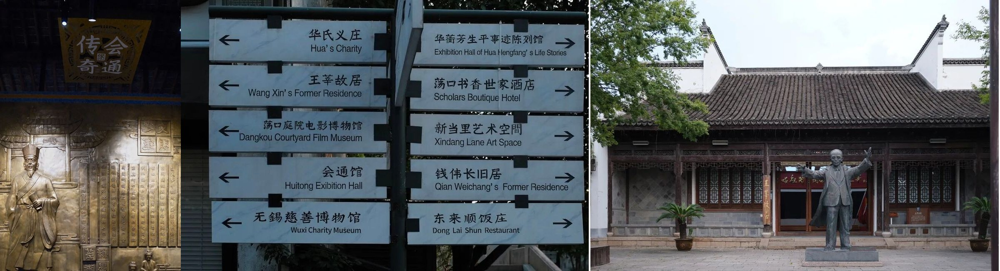

古镇内文化景点众多，均可步行到达。钱穆故居、华蘅芳纪念馆、王莘故居、会通馆、华氏义庄等文化场所散布其间，每一处都承载着厚重的文化记忆。 国学大师钱穆的治学精神，近代数学先驱华蘅芳的科学启蒙，知名词曲作者王莘的激情创作，都在这里留下印记。华氏义庄作为江南地区保存最完整的义庄建筑群之一，见证了中国古代慈善文化的发展历程。

<table><tr><td></td></tr></table>

古镇内可参与多项传统手作体验，包括石板拓印、漆艺创作、干花团扇、泥人彩绘与香囊制作，均由专业老师现场指导。

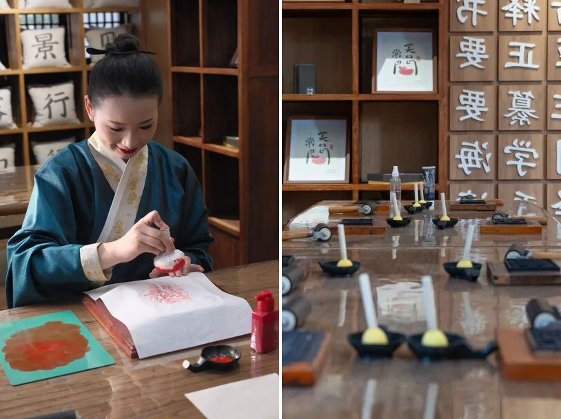

石板拓印使用雕刻古诗或吉祥字样的石板，覆纸、上墨、捶打成型，是最受欢迎的非遗项目之一，成品可带走留念。

<table><tr><td>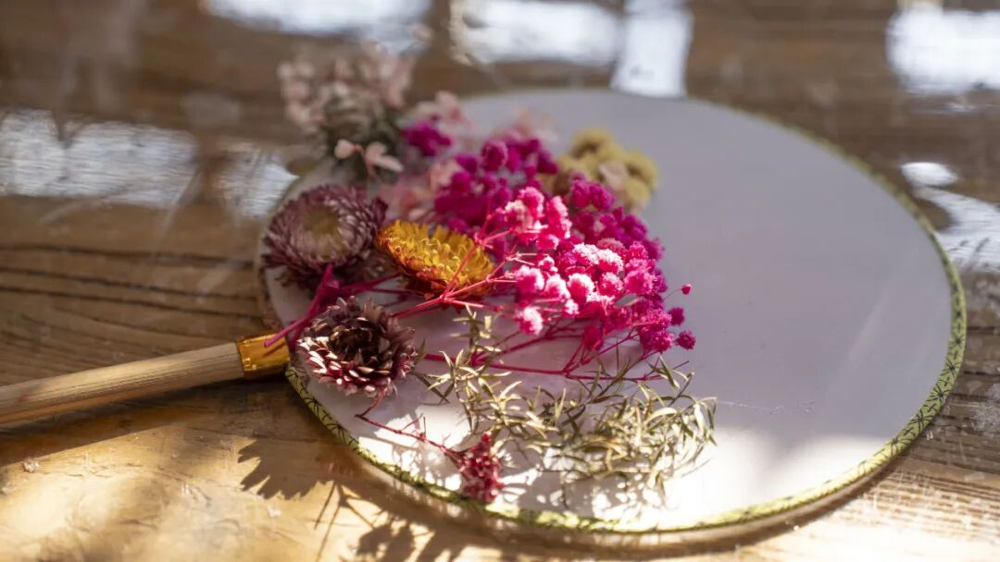</td></tr></table>

其他体验各具特色：漆艺可自由调色上漆，干花团扇讲究植物搭配，泥人彩绘生动有趣，香囊则融合传统配方与祝福寓意，实用又富纪念价值。

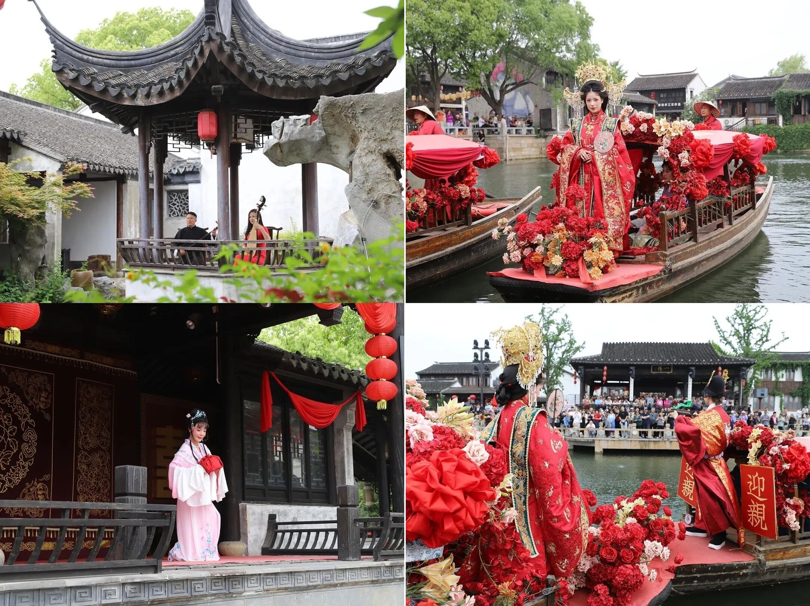

偶尔，昆曲唱腔在亭台水榭间响起；端午龙舟竞渡，鼓声震天；水上婚礼花船缓缓而过，新娘凤冠霞帔。这些活着的传统，让古镇不只是建筑的遗存，更是文化的延续。

<table><tr><td>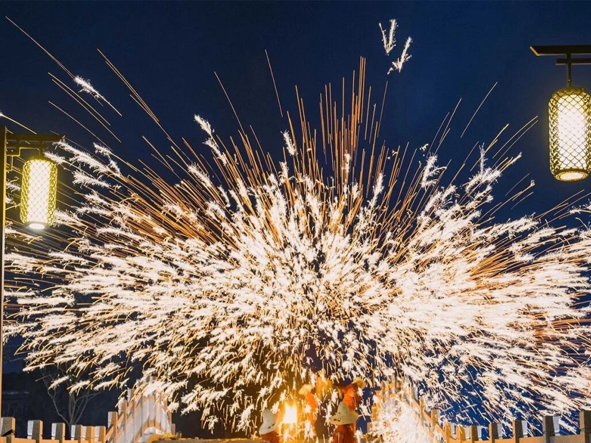</td></tr></table>

暮色四合，荡口古镇展现出另一种美。天光由淡粉转为淡紫，继而深蓝，墨色如洗。 夜色渐深，古镇灯火次第点亮。“万灯齐放，珠星点点，火树银花，不可方物。”07. Cocktail 

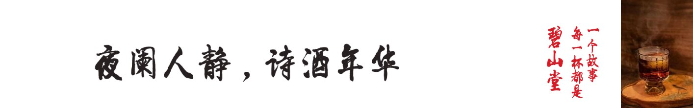

<table><tr><td>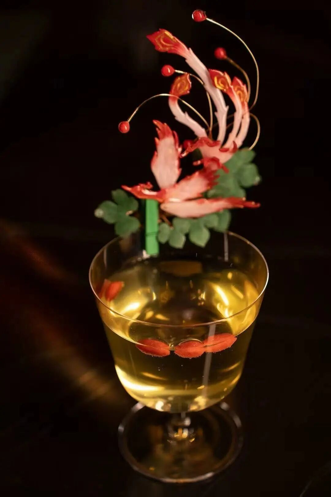</td></tr></table>

回到酒店，夜晚的天井繁星点点。此时最惬意的，莫过于在碧山堂大堂吧品一杯特调鸡尾酒。 明嘉靖年间，华察曾与顾可久、王问、施渐重组碧山吟社，诗酒唱和。如今的碧山堂延续着这份雅致，将华太师的诗词、荡口的故事、江南的风物，化作杯中佳酿。

<table><tr><td>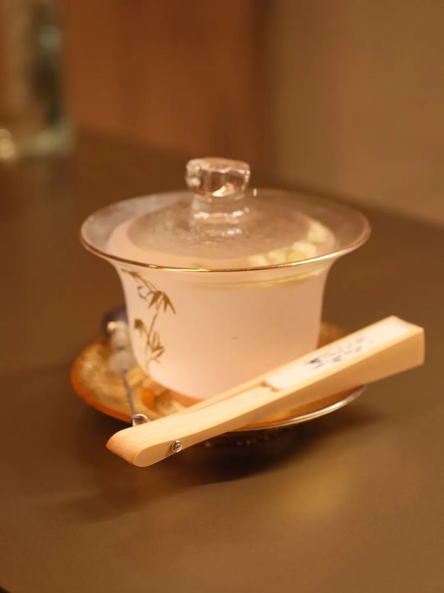</td></tr></table>

最受欢迎的是“点秋香”——盛于中式盖碗，金酒融合草莓、柑橘与水蜜桃的馥郁果香，茉莉与柠檬清香层层铺展，仿佛重温古代文人吟诗作对、雅集饮宴的风流岁月。

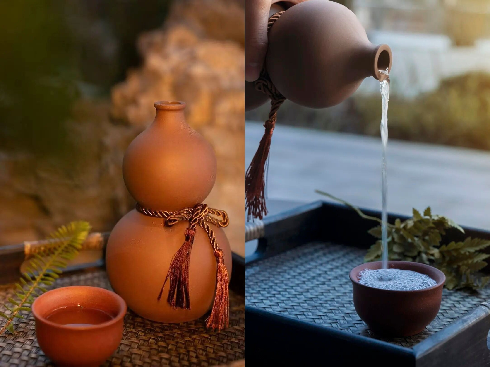

“碧山仙饮”是当地特色的中式鸡尾酒，盛于无锡宜兴紫砂杯，葫芦象征福禄，壶中之酒可分五杯，寓五行之意。酒体融合白朗姆金酒、接骨木花、荔枝与柠檬，甘洌清甜。

<table><tr><td>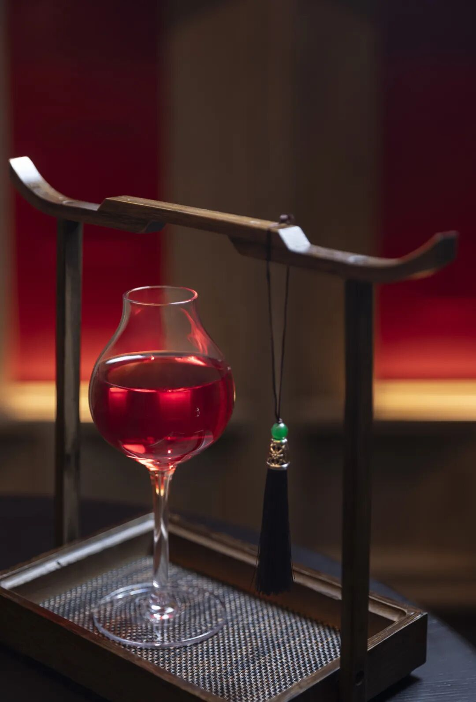</td></tr></table>

“进士及第”则以王世贞诗句为名，选用占边波本威士忌为基酒，融合柠檬、苦橙与红葡萄，层次分明、色香俱佳，寓意步步登高、锦绣前程。

<table><tr><td>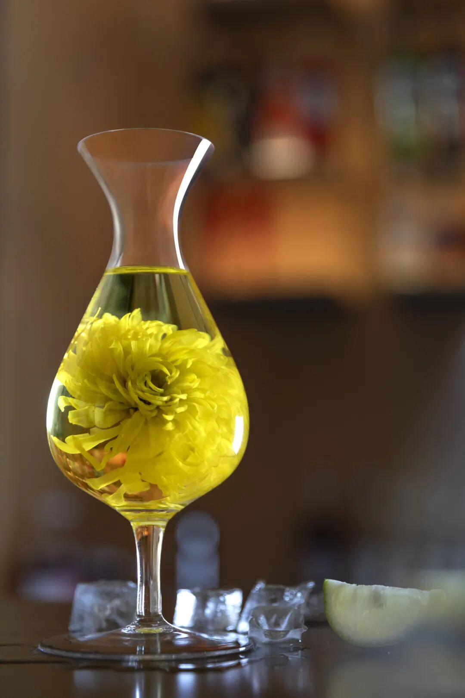</td></tr></table>

“黄花醉”取意华察诗句“餐菊”，诗人与友人赏菊，以鲜金丝皇菊融合苹果汁与伏特加，加入牛奶调和口感，澄清工艺令酒体通透清亮，饮之甘润清爽。

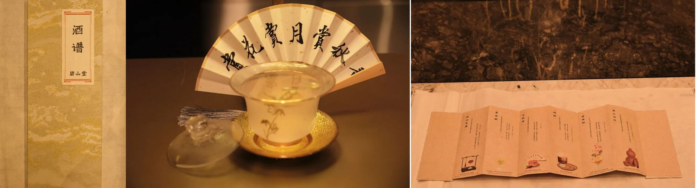

调酒师手中的折页酒谱，展开时宛如折扇。每款酒皆有其名、有其句、有其人。酒谱如卷，杯中有句。诗与酒相遇，古与今相融——这一杯，便是“每时美憬”的江南注脚。

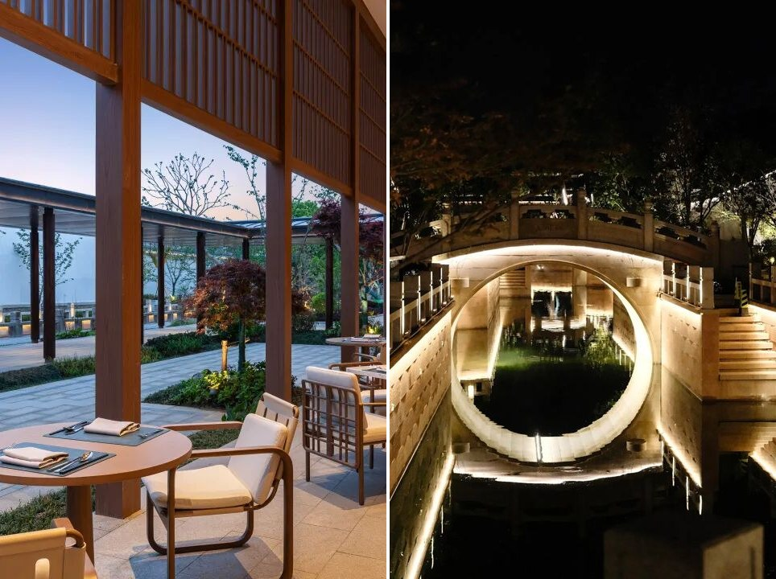

夜深了。 推开客房的窗，望⻅古镇灯火阑珊，石拱桥的灯光亮起，桥身与水中倒影连成一弯月牙。河水缓缓流淌，如同500年前华察听到的那样。 在荡口古镇美憬阁精选酒店，时空的界限变得模糊： 明代的府邸里，装着21世纪的奢华； 中式的盖碗中，盛着西方的鸡尾酒； 古老的诗词，化作现代的设计语言； 千年的水道，倒映着LED的灯光。

<table><tr><td>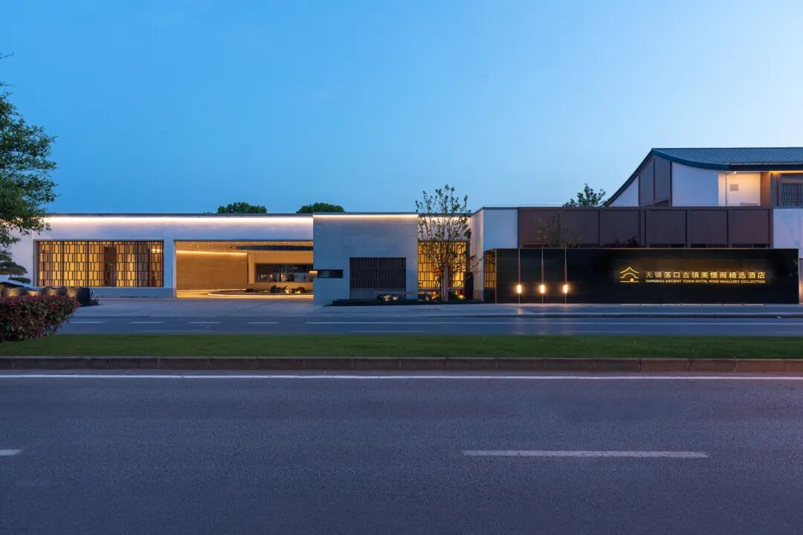</td></tr></table>

这不是简单的新与旧的叠加，而是一场精心编排的时空交响。每一处景观都承载着江南的历史记忆，每一阵风都吹拂着自然与人文交织的乐章。 酒店不仅是住宿空间，更是一座将历史叙事嵌入设计的“故事雕塑”。在传统的园林造景中，水道寓意人心通达天地自然；在文脉保护的背景下，这些水道也寓意知识与文化通达八方，润物无声。

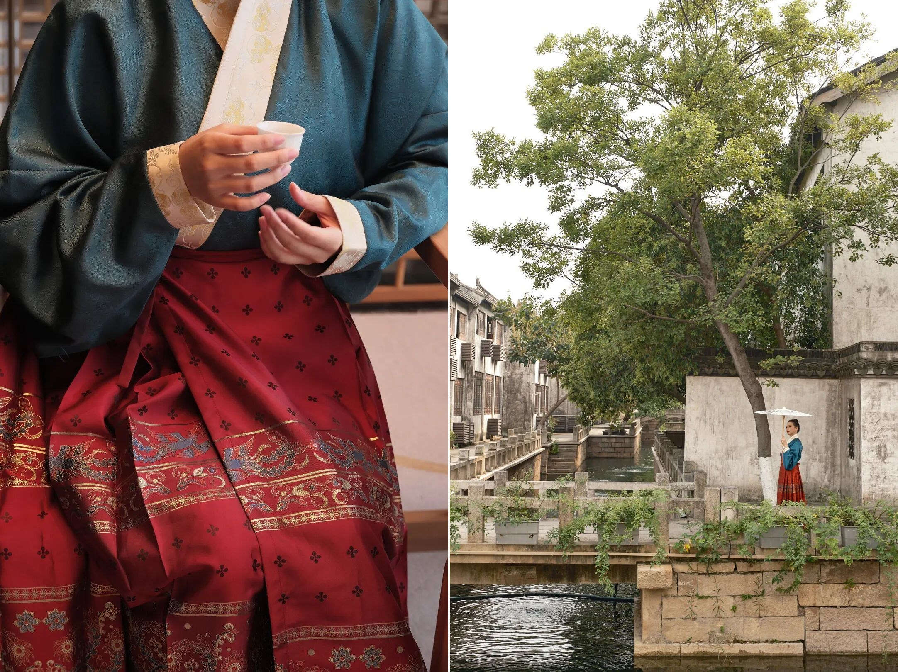

当你踏入酒店的那一刻，便打开了时空之门。当你离开时，带走的不只是一次住宿体验，而是一段与500年前诗人的对话，一次江南文脉的触摸，一场中西古今的奇妙穿越。 华察的诗还在墙上： "垂杨荫平田，茫茫烟水中。" 而你，已经成为这首诗的一部分。 在荡口，在美憬阁， 古镇的烟水与摩登的奢华无缝交织， 每时美憬，便是永恒。 - The End - 执行｜戴雯 撰文｜耿悦 编辑｜Sandy 视频拍摄、剪辑｜白雪松 图片｜品牌官方、耿悦 更多精彩 ▶▶俄罗斯国民品牌“阿伯朗·杜尔索”的文化使命与东方布局 ▶▶澳门遇见毕加索，沉浸式享受艺术之旅 ▶▶ V 世界｜俄罗斯即将升级免签政策！20个体验探索全球国土面积最大国家

---

## 制作团队

- **执行**：戴雯
- **撰文**：耿悦
- **编辑**：Sandy
- **视频拍摄、剪辑**：白雪松
- **图片**：品牌官方、耿悦

---

## 授权与版权

**本文图片与文字均来自「无锡荡口古镇美憬阁精选酒店」品牌方授权。** 文中大量文字内容为酒店官方品牌资料的摘录，品牌方图片版权归美憬阁酒店所有。未经品牌方许可，**严禁**转载、复制或商业使用。
