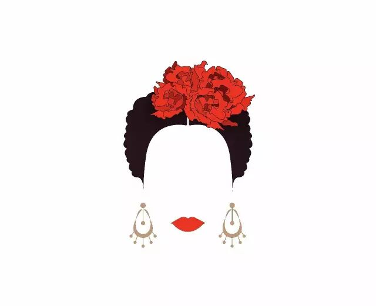

# 我的灵魂里有一个吉普赛人 | 狂欢一场

*Geng Yue · Travel Stories*

「我的灵魂里有一个吉普赛人」而塞维利亚女郎就是流浪到西班牙的吉普赛人

### 1 一个女人和橘子的城市

当我闻到了橘子味的香气，

我终于抵达了西班牙塞维利亚。

这座城里流动着金色、阳光和热带风情，

这里的故事永不落幕，

如果你喜欢欧洲文学戏剧，

这些名字，就出自塞维利亚：卡门、哥伦布、堂吉诃德、唐璜、费加罗....

我羡慕他们那种潇洒的活法——**纵使活得很短暂，也要活的自由而绚烂**。

**「好看的皮囊千篇一律，有趣的灵魂万里挑一」**

其实对一个城市来说也是如此呀。

我第一眼就喜欢塞维利亚。

每年春天，漂亮的人儿都会聚集在这里，

每个人都穿上好看的衣服，打扮得花枝招展，

为了一个古老的节日，**四月节** (Feriade April)。

我穿着一条大裙摆的蓝色裙子，头上别着橙色的花朵，带着巨大的银色耳环，和一抹红色的穗子，

和同伴们，一起走进了这个节日。

### 2 我看见

街道的两旁支起一千座白色的帐篷

马车的轮子在周围转动，彩色小旗子在风里飘扬。

性感的女人，穿着夸张的大裙子，坦率望向我的眼睛，

帅气的骑士们，马背上载着花裙子的姑娘

这些盛装的女人们，让我仿佛置身于一场电影中，有了时空穿越的感觉。十九世纪的古老纪元，在我眼前缓缓拉开序幕。

一个又一个西班牙女郎向我走过来，

色彩明艳的长裙，大蓬裙摆翻飞着波浪

红得耀眼的花朵，在金色的头发上微微颤动

她们笑得很大声，很大方

她们有的年轻，有的年长

西班牙女人的美，有一种很独特的味道，不仅是美，而是有劲儿，有气场、风情万种。

"早年我在塞维利亚见过这样一位西班牙美女，刚洗了头髮，那么浓，那么长，日光温润，微风薰人，她坐在阳台上一边看书一边漫不经心拨弄长髮慢慢晾干。偶尔抬头探望老树上的动静，眼神柔若春水，嘴角甜甜翘起，鼻子十足石雕希腊女神，衬着两道眉影越见刚秀。"

——董桥《小寒碧斋》

我往四周看

屁股上扎着花朵的马儿

带着礼帽的帅气女人

眼睛里有星星的小公主

跟我躲猫猫的羞涩小男孩

成熟的男人手里拿着浓烈的雪莉酒，跟你干杯

每个人都在跳舞

他们跳着弗拉明戈舞步，把你拉上舞台

我们和当地人一起跳舞，和孩子、老人、男人、女人们一起跳，

空气中弥漫着音乐声、欢笑声、马蹄声，

摩天轮在远处的粉色天空里转着圈。

我在现场，想对远方的你们说，「**这是一生值得去体验一次的惊艳狂欢**」

这七天里，人们尽情分享喜悦和欢快，你会忘记时间的存在。

我看着镜头里的他们，我喜欢他们，

他们仿佛从一出生就这么热情、可爱，

**为了生命的快乐似乎不顾一切。**

浪漫激情。狂放不羁。游吟随性。

### 3 流浪者的快乐

在西班牙的旅途中，我在看林达的书，被这句话打动：

**「旅行的精髓是一种流浪感，特别是在不同文化中展开的异域漫游。」**

「一个真正的旅行者，骨子里都会有流浪者的因子，经历着流浪者的快乐、诱惑，和冒险。」**她的灵魂里，住着一个吉普赛人。**

吉普赛人（Gypsy），是天生的流浪民族。一路漂泊从不停靠，从身到心，不受拘束，大篷车就是家，浪迹天涯就是生活方式。

（今天咱们先不谈因为历史动荡而散居各国的吉普赛人被歧视，饱受法律与贫穷的夹杀等等）

这几年，我在旅途中乐此不疲到处跑，每次新抵达一个新地方，就会爱上那里，「那些未曾谋面的远方，都是我的故乡。」

而今天，我们「流浪」到了这座与吉普赛人血脉相连的城市。在这座城市里，流传着一首吉普赛人的歌谣：**时间是用来流浪的，身躯是用来相爱的，生命是用来遗忘的，灵魂是用来歌唱的。**

这是我们西班牙文学之旅最后一站，快乐的人儿：土豆姐，童童姐，Zoe。

我们在现场还拍了好看的视频，剪辑制作完之后，会给你看一场流动的视觉盛宴。

原创作者 耿悦

摄影：悦悦+土豆+童姐+Zoe

拍摄设备 Canon SX 60 | iPhone

服装支持【燕遇】服饰

音乐 Di Naie Chuppe

