# London 24-Hour List · British Charm

*Geng Yue · Travel Stories*

Create by Caca From London

This is the first article in the original column of JUSTGO's "City List". Today we will talk about our favourite destination, London.

### Talking About London

01 ◇ City List

People here always talk about the weather.

Red double-decker bus and black taxi, love between Queen Elizabeth and Prince Philip, Babylonian Paradise in the eyes of Prime Minister Benjamin Disraeli, unfinished museum, train to Hogwarts, London for everyone, okay to be different.

In London, everyone is different, but that means anyone can fit in.

Just like the classic lines in the movie *Paddington*, if you need a reason to fall in love with a city, why not try to find your own answer?

"If a person is tired of London, he is tired of life, because life in London can give everything that a person wants."

— Dr Samuel Johnson

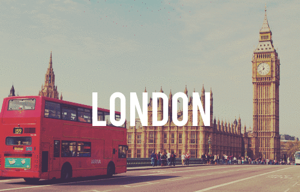

When I first came to London, I could sit down and enjoy a breakfast in a fast-paced city, instead of solving it in a corner coffee shop. This kind of enjoyment always awakens the most beautiful memories of life. Let the day's journey begin with breakfast.

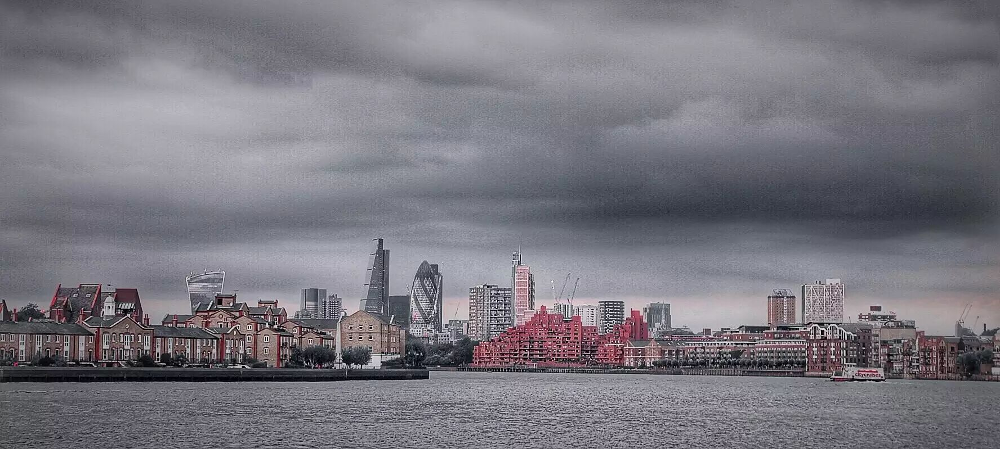

When a person first comes to London, how can twenty-four hours be spent?

◇

### 9:00 AM — Enjoy an English Breakfast at High Altitude

Darwin Brasserie @ Sky Garden

20 Fenchurch Street, London, EC3M 3BY

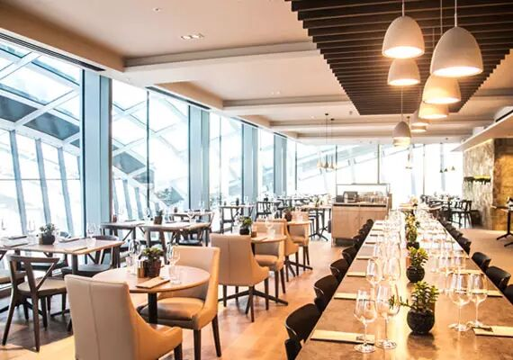

I was fortunate to be placed in a glass location, to see not only the visitors downstairs but also the scenery on both sides of the River Thames.

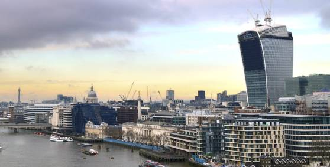

20 Fenchurch Street was built in 2014 and has thirty-seven floors, designed and built by the famous architect Rafael Viñoly. Its shape is often dubbed the "Walkie Talkie" by Londoners. To make the most of the top floor, the designer built a Sky Garden on the 35th, 36th and 37th floors, which is the highest public park in London.

The Darwin Brasserie restaurant is located on the 36th floor of the "Walkie Talkie" and the restaurant is small and exquisite.

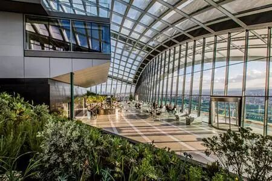

The traditional English breakfast is famous for its rich dishes, usually including eggs, sausages, bacon, sautéed soya beans, fried tomatoes and toast. In the early nineteenth century, English country aristocrats enjoyed such a hearty breakfast before hunting. With the emergence of the middle class, more and more Britons have gradually imitated this way of life.

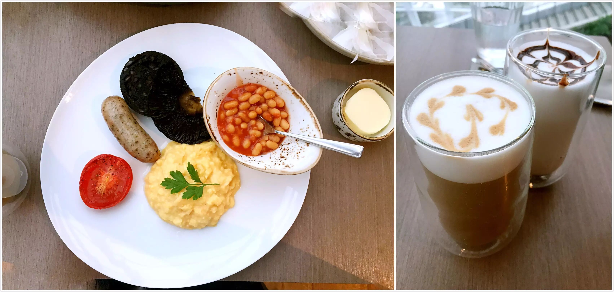

Although it is free to enter the Sky Garden, remember to book your table in advance to ensure your place. A staff member will check your ID card downstairs, and there will be an airport security check before you get on the elevator.

◇

### 11:00 AM — Admire London Landmarks along the River Thames

The Tower of London, London, EC3N 4AB

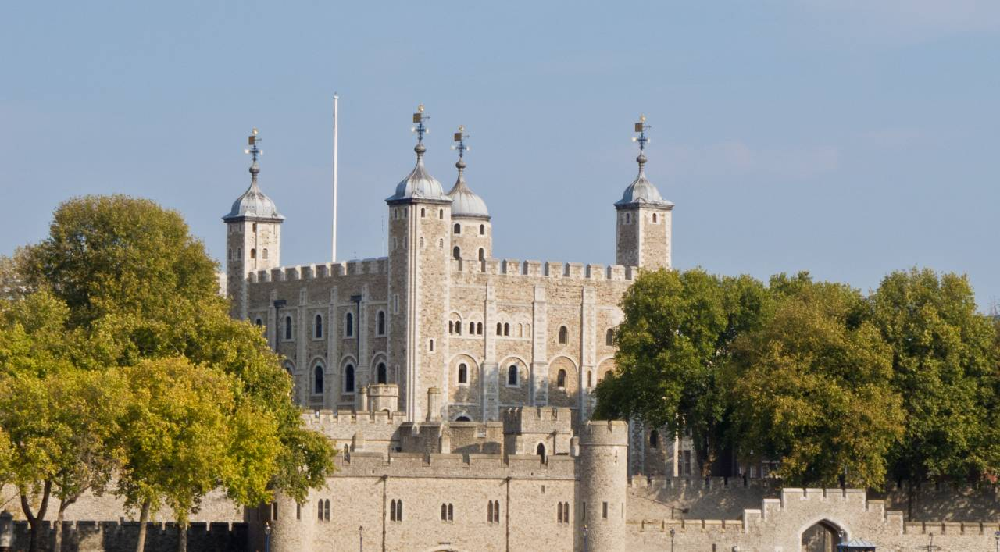

After breakfast, leaving the Sky Garden, it is approximately a ten-minute walk to the Queen's Palace and Fortress, The Tower of London; this is the centre of Old London, and the City has also developed from here.

Tower Bridge Road, London, SE1 2UP

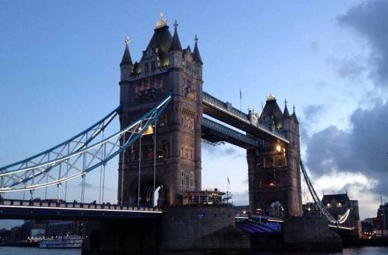

Right next to Tower Bridge, on the north shore of the entrance and exit, people who like Sherlock Holmes' novels and movies can get an impression of the bridge, which was built between 1886 and 1894. It is an open type of traffic bridge that lifts up the bridge deck in one minute using the motor lift.

Tate Modern: Bankside, London, SE1 9TG

Shakespeare's Globe Theatre: 21 New Globe Walk, Bankside, London, SE1 9DT

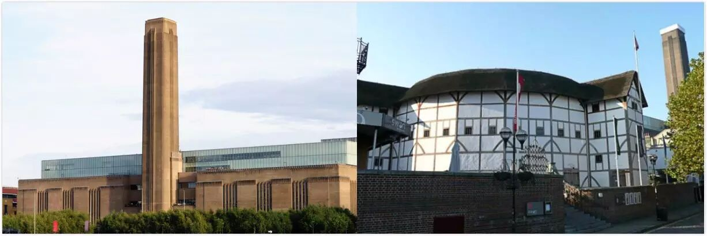

Leaving Tower Bridge and heading west along the River Thames, you will find that many of the landmarks are on either side of the riverbank. Here you will find bustling London, and the Thames carries countless stories from the City. Continue west along the riverbank and you will pass the famous Tate Modern, which is renowned among the many art galleries in London, transformed from a waste power station (left).

Next to the Tate Modern is Shakespeare's Globe Theatre. In 1599 the theatre was owned by Shakespeare, and he played the Shakespeare drama. Unfortunately, when he played "Henry VIII" in 1613, because the props were improperly operated, the roof of the thatched grass was accidentally lit, and the whole theatre burnt down. Four hundred years later, the remains were discovered and the theatre was rebuilt in 1997, using advanced techniques to recreate the sixteenth-century theatre (right).

St Paul's Churchyard, London, EC4M 8AD

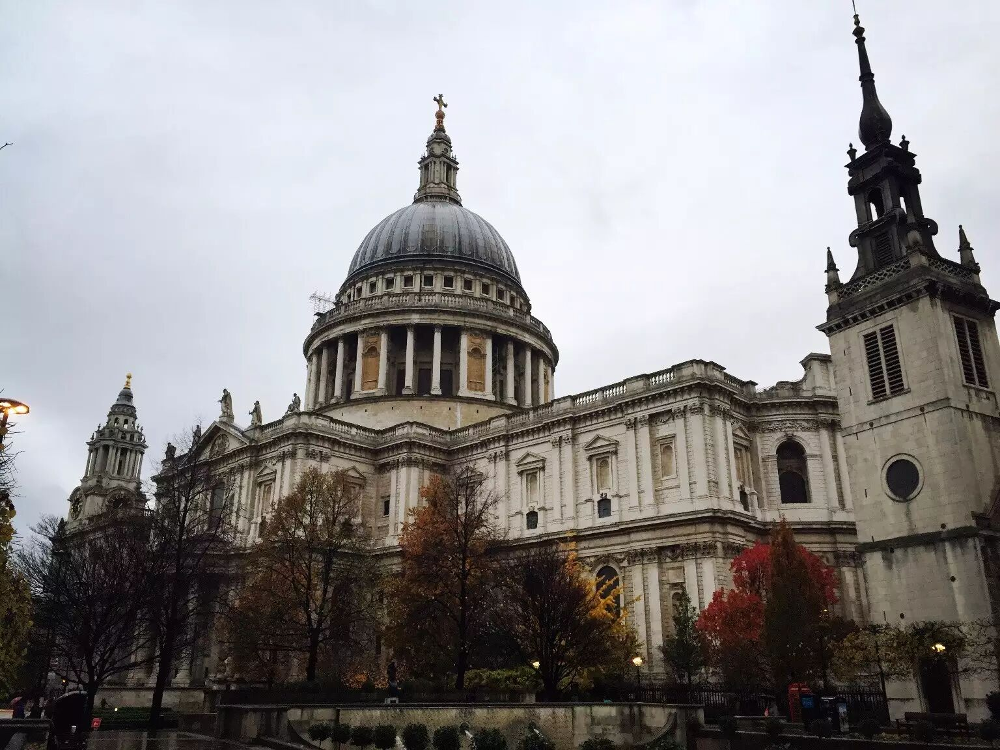

Across the river, the famous St Paul's Cathedral is in sight. Built in 604 AD, it was the first cathedral in the UK and the fifth in the world. It is in typical Baroque style, and the wedding of Princess Diana and Prince Charles was held here.

London Eye: London, SE1 7PB

Palace of Westminster and Big Ben: Westminster, London, SW1A 0AA

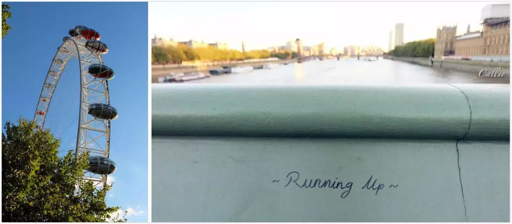

Going west, you will see the London Eye, a 135-metre-landscape Ferris wheel, also known as the Millennium Wheel. Move slowly into the time capsule and you can see the scenery along the river.

On the other side of London is the Palace of Westminster and Big Ben, which is found in countless novels and movies, and is a well-deserved old landmark in London. Not far from here, Westminster Abbey, built in 1065, is the crowning or burial place for the British royal family, and the wedding of Prince William and Princess Kate was also held here.

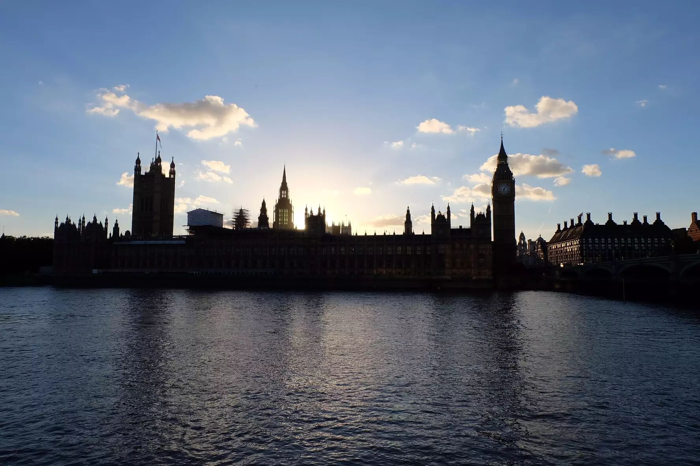

A short twenty-four hours will give you only a glimpse of London. If you like this beauty, I hope that next time you can stop and enjoy the taste.

◇

### 16:00 PM — When You Are Tired, Sit Down and Enjoy an English Afternoon Tea

Hotel Cafe Royal @ Piccadilly Circus

68 Regent Street, London, W1B 4DY

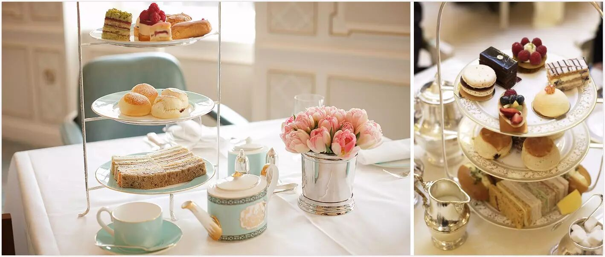

There are many characteristic themed tearooms in London, and there is a lot to be mentioned near Piccadilly Circus. Fortnum and Mason is a centuries-old shop, built in 1707, has a close relationship with the royal family, is popular with the Queen and serves delicious, exquisite, high-end food (left).

Another must-mention is the Ritz hotel's traditional afternoon tea (pictured right), where gentlemen and ladies who enjoy afternoon tea must wear formal attire. Traditional English afternoon tea usually begins at 4:00 pm with a sandwich, followed by a scone with strawberry jam and cream, and finally a variety of cakes and fruit towers.

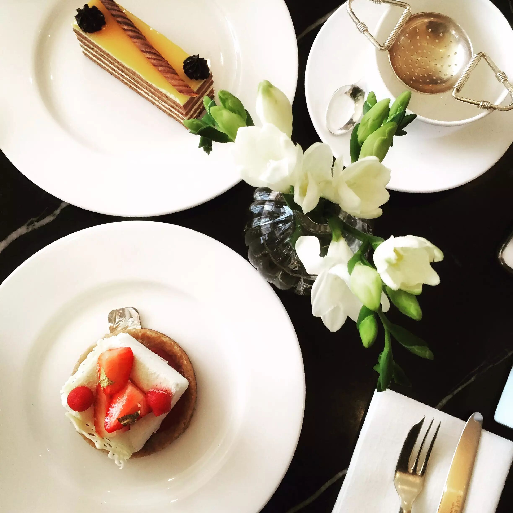

In addition to the two places mentioned above, my favourite is the Hotel Cafe Royal, with its exquisite snacks and fragrant Earl Grey tea, which bring joy to a relaxed afternoon.

◇

### 18:00 PM — The Open-Air Market You Must Not Miss

Covent Garden

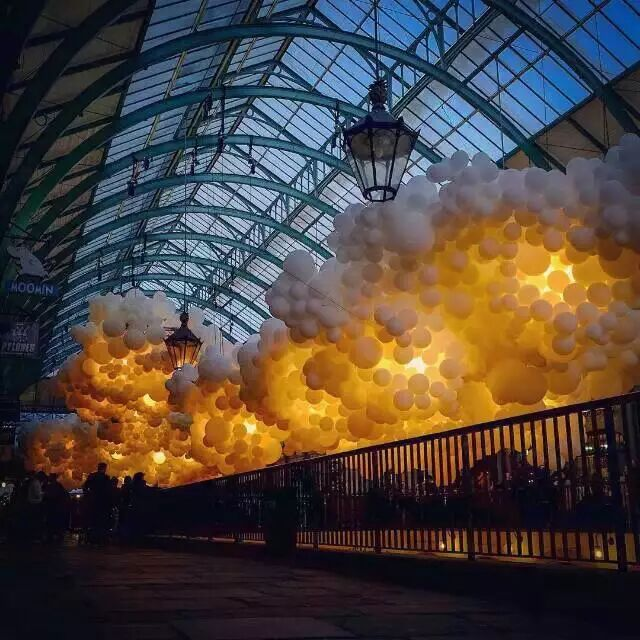

The open-air market at Covent Garden comprises the Apple Market, Jubilee Market and East Colonnade Market. It is situated in one of London's busiest locations, with a variety of vintage shops and specialty restaurants. At the same time, it is also the largest gathering place for street performers in London, often with many free street performances and amazing art exhibitions.

I inadvertently encountered the "Heartbeat" installation art exhibition, in which the French artist Charles Pétillon used balloons to decorate the zenith of the market. As the sun sets, with warm yellow lights, it instantly becomes a dream paradise.

Charles Pétillon said when introducing this exhibition that "balloon 'invasion' is a metaphor I hope to create. The purpose of installation art is to change the surroundings that we see every day, but which are often overlooked. With 'heartbeat', I want the building to be likened to the heartbeat of central London, connecting history and today, allowing visitors to revisit the role of busy life in London."

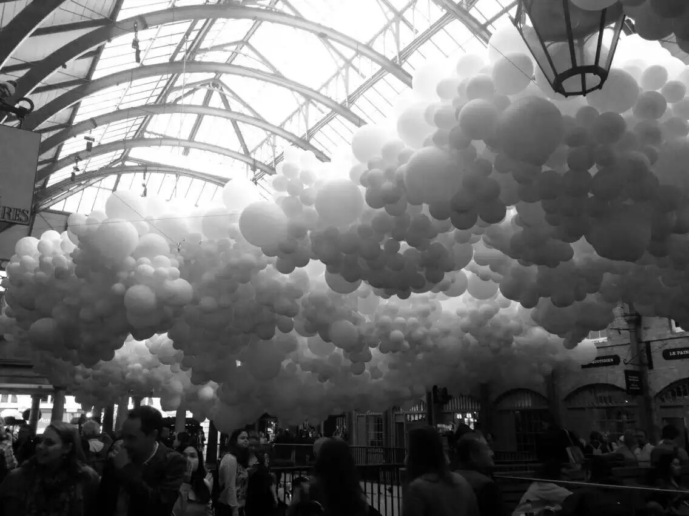

"Each balloon has its own dimensions and yet is part of a giant but fragile composition that creates a floating cloud above the energy of the market below. This fragility is represented by contrasting materials and also the whiteness of the balloons that move and pulse, appearing as alive and vibrant as the area itself."

Suddenly I think of the lyrics "A crossroad is a pause, I don't know if it should go south, north, or east." Strolling through this, you will feel the City's own atmosphere deeply.

◇

### 20:00 PM — On the Hogwarts Express, What Is Your Next Stop?

King's Cross St Pancras

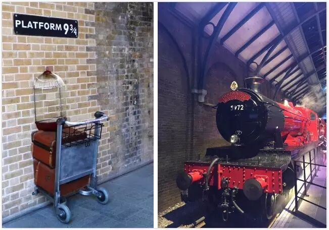

If you need to take the Eurostar (European Star) or the underground to the airport, why not stop at London King's Cross railway station to see the Hogwarts Express and its magical world?

Near the station is the world-famous Central Saint Martins College of Art and Design, and the underground exit tunnel closest to the College is also full of strong designs.

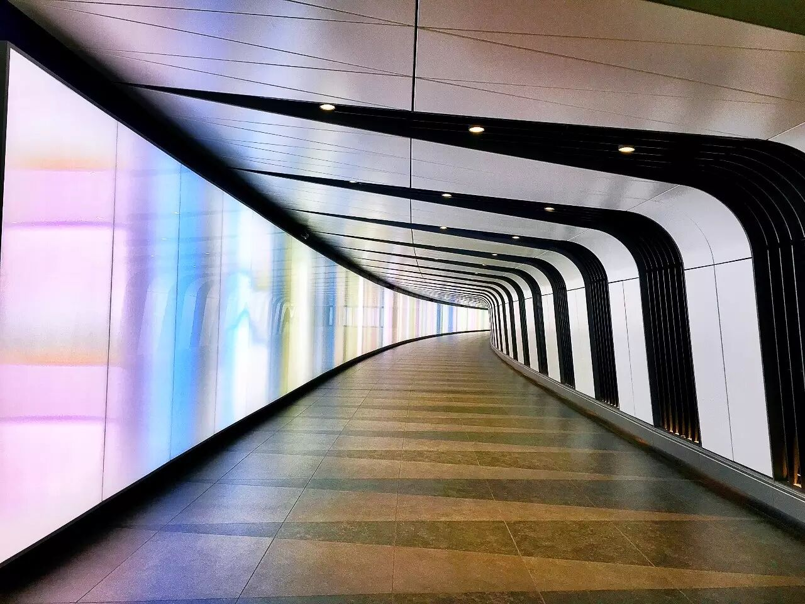

◇

### 22:00 PM — End in This Enchanting Night

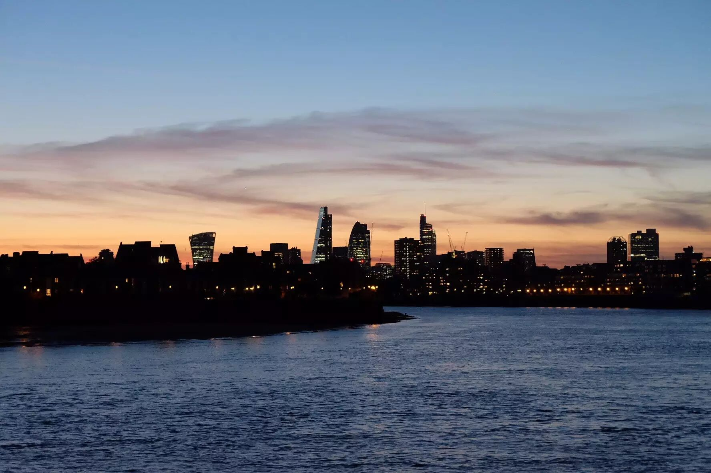

"The dusk of London's winter day always happens in an instant: I haven't recognised the vagueness of the day, the night is coming, the moment is bright and dark, love and not love, hope and despair, between the thoughts, it is dusk. Sometimes, I suspect that there is no dusk in London, especially on Christmas Eve, one eye is dark, and everyone suddenly disappears, making me think of the end of the world, and nothing more." Moreover, Huang Biyun said, "Suddenly I remember you." This describes London precisely.

The above outline the epitome of a day in London. I am temporarily obsessed with the story of its delicious food. Here we find the intersection between classical and modern, with fine taste and an endless aftertaste.

When a man is tired of London, he is tired of life, for there is in London all that life can afford.

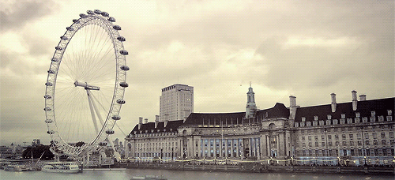