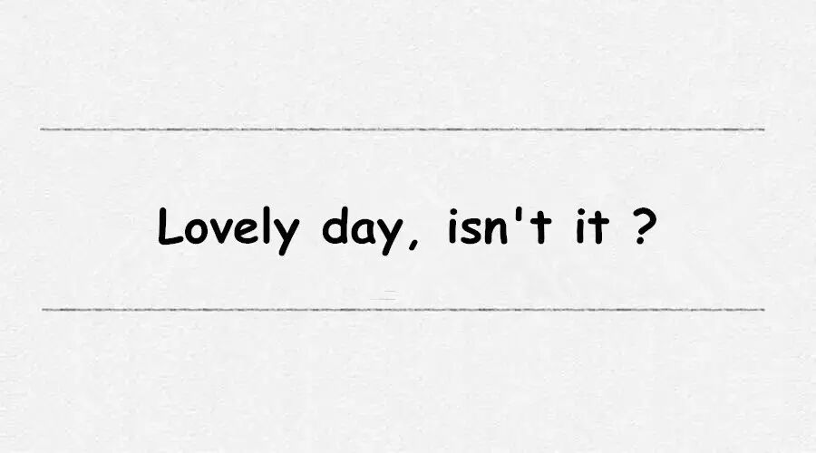
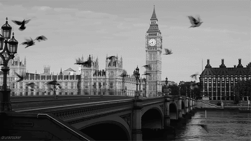
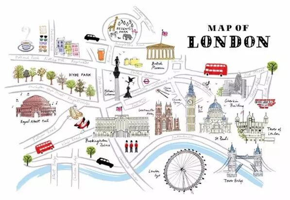

# 伦敦24小时清单 · 英伦韵味

*Geng Yue · Travel Stories*

London｜Thames / linner / market

这是JUSTGO推出「城市清单」原创栏目的第一篇文章，今天我们来聊聊最爱的伦敦。

**谈起伦敦**

01 ◇ 城市清单

这里的人，见面总谈论天气。

红色的双层巴士和黑色的出租车，伊丽莎白女王与菲利普亲王的爱情，首相本杰明·迪斯雷利眼里的巴比伦乐园，逛不完的博物馆，开往霍格华兹的火车，伦敦对于每个人来说都是不一样的。

In London, everyone is different, but that means anyone can fit in.

**在伦敦每一个人都是不同的，但这也意味着任何人都可以进入伦敦。**

就像电影《帕丁顿熊》里经典台词如果爱上一座城市需要一个理由，为何不亲自来寻找属于你的答案？

"如果一个人厌倦了伦敦，他也就厌倦了生活，因为伦敦的生活可以赋予一个人所渴望的一切。"

——塞缪尔•约翰逊（Dr. Samuel Johnson）

初来伦敦，在快节奏的都市里，能坐下来静心享用一顿早餐，而不是在街角的咖啡店里草草解决，这样惬意的享受总能唤醒对生活最美的记忆。让一天的旅程从早餐开始。

一个人初来伦敦，这24小时如何才算不虚度？

**◇9:00 AM 在高空享受一顿英式早餐**

Darwin Brasserie @ Sky Garden

20 Fenchurch Street, London EC3M 3BY

我幸运的被安排在了靠玻璃的位置，不仅可以看到楼下络绎不绝的参观者，还能看到泰晤士河两岸的景色。

20 Fenchurch Street建于2014年，共有37层，由著名的建筑大师Rafael Viñoly设计建造。它的外形常被伦敦人戏称为"Walkie Talkie（对讲机）"。为了最大限度的利用顶层的空间，设计师在35、36和37层建造了一个Sky Garden (空中花园)，这可是伦敦海拔最高的公共公园。

Darwin Brasserie餐厅位于"对讲机"的36层，餐厅小巧玲珑，装修简洁大气。

传统的英式早餐以菜点丰富而著名，通常包括鸡蛋，香肠，培根，焗黄豆，炸番茄和烤面包等。在19世纪初，英国乡村贵族们喜欢在狩猎前享用一顿这样丰盛的早餐。随着中产阶级的出现，渐渐地越来越多的英国人开始模仿这样的生活方式。

要提醒一下，虽然进入空中花园是免费的，但由于空间有限，要记得提前预约。楼下会有工作人员检查你的身份证件，而搭上电梯前会有类似机场的安检。

**◇11:00 AM 沿泰晤士河欣赏伦敦地标**

The Tower of London, London, EC3N 4AB

吃过早餐，离开空中花园，步行约10分钟就来到了女王的宫殿与城堡，伦敦塔（Her Majesty's Palace and Fortress, The Tower of London），这可是老伦敦的中心，市区也由此发展而来。

Tower Bridge Road, London, SE1 2UP

紧邻出入口北岸的Tower Bridge（伦敦塔桥），喜欢福尔摩斯小说和电影的人应该对这座桥有印象。这座桥在1886年开始建造，历时8年，终1894年完工，是座开启式的交通桥，以电动机升降在一分钟内完成桥面的起降。

Tate Modern: Bankside, London SE1 9TG

Shakespeare's Globe Theatre: 21 New Globe Walk, Bankside, London SE1 9DT

离开塔桥，沿泰晤士河向西，你会发现，许多的地标都在这河岸的两旁。这儿孕育了伦敦的繁华，泰晤士河承载着这个城市无数的故事。沿着河岸继续往西前行，你会经过著名的Tate Modern 。Tate Modern在伦敦众多艺术画廊中享有盛名，由废旧的发电站改造而成（左图）。

在Tate Modern的旁边是Shakespeare's Globe Theatre（莎士比亚环球剧场）。1599年这里的剧场由莎士比亚本人参股，专演莎翁剧，可惜在1613年演《亨利八世》的时候，因为道具大炮的操作不当，意外点着了屋顶的茅草，整个剧院被烧成废墟。四百年后，残存的遗址被发现，剧场于1997年重建，利用高级的技术重现16世纪的风采（右图）。

St. Paul's Churchyard, London EC4M 8AD

隔河相望，著名的St Paul's Cathedral（圣保罗大教堂）便映入眼帘。大教堂建于公元604年，是英国第一大教堂和世界第五大教堂，是典型的巴洛克风格，戴安娜王妃与查尔斯王子的婚礼曾在此举行。

London Eye: London SE1 7PB

Palace of Westminster & Big Ben: Westminster, London SW1A 0AA

继续往西，就会看到London Eye（伦敦眼），这是个高达135公尺的景观摩天轮，也叫做千禧轮。在慢慢移动到时间胶囊里，你可以将沿河风景尽收眼底。

伦敦眼对岸，是Palace of Westminster（国会大厦）和Big Ben（大本钟）。这里出现在无数的小说和电影里，是伦敦当之无愧的老地标。国会大厦的不远处，就是Westminster Abbey（西敏寺），建于1065年，一直是英国皇室加冕登基或安葬之地，威廉王子与凯特王妃的婚礼也是在这里举行的。

短短的24小时或许只能给你惊鸿一瞥，如果你喜欢这美景，希望下次你可以停下脚步慢慢欣赏细细品味。

**◇16:00 PM 走累了，就坐下享受英式下午茶**

Hotel Cafe Royal @ Piccadilly Circus

68 Regent Street, London W1B 4DY

伦敦有许多有特色的主题茶室，在Piccadilly Circus（皮卡迪利广场）附近就聚集了不少值得一提的。Fortnum and Mason是一家百年老店，建于1707年，和皇室颇有渊源，并且深得女王喜爱，食物美味，精致高端（左图）。

另外一家必须要提的是Ritz Hotel的传统下午茶（右图），在这里享用下午茶的绅士淑女须穿正装。传统的英式下午茶一般是从下午四点开始，先从三明治开始品尝，接着是司康饼配上草莓酱和奶油，最后是各式蛋糕和水果塔。

除了上面的那两家，我的最爱是Hotel Cafe Royal，精致的点心配上香浓的伯爵红茶，这样休闲的午后因为有了这些美食而不再寂寞。

**◇18:00 PM 你一定不能错过的露天市场**

Covent Garden

Covent Garden的露天市场是Apple Market、Jubilee Market和East Colonnade Market组成。这个露天市场位于伦敦最繁华的地段，各种复古小店和特色餐厅。同时，也是伦敦最大的街头艺人聚集地，常常有许多免费的街头表演和惊喜的艺术展。

之前无意中遇上了"心跳"（Beating Heart）的装置艺术展，由法国艺术家Charles Pétillon用气球来装饰市场的天顶。夕阳西下，搭配上暖黄色的灯光，这里瞬间变成了梦幻的天堂。

Charles Pétillon在介绍这个展览时曾说，"气球'入侵'是我希望创造的隐喻。装置艺术的目的是要改变我们每天显而易见，却又常常被忽略的周遭。随着'心跳'，我想将这座建筑比喻为伦敦中心区那不停跳动的心脏，即连接历史与今天，让游客重新审视这里在伦敦忙忙碌碌生活中的作用。"

"每个气球都具有其自己的维度，每一个这样易碎的个体超越了其本身的限制性能量组成了这座巨型浮动云朵。这种脆弱性通过气球的材料表现出来，同时其材料本身也能体现这个充满活力的区域本身的律动。"

突然想起句歌词"一个十字路口是一个暂停，不知该向南、向北、还是向东"。漫步于此，你定能深深地感受到这座城市属于自己的气息。

**◇20:00 PM 搭乘霍格华兹快车，你的下一站是？**

King's Cross St Pancras

如果你需要乘坐Eurostar（欧洲之星）离开，或者乘坐地铁去机场，为什么不顺路来伦敦国王十字火车站看看那个通往神奇的魔法世界的霍格华兹快车？

车站附近是享誉世界的Central Saint Martins College of Art and Design (伦敦中央圣马丁艺术与设计学院)，而离学院较近的地铁出口隧道，也是充满强烈的设计感。

**◇22:00 PM 在这迷人夜色中结束**

"伦敦冬日的黄昏，总发生在一刹那之间：还没有认清楚日的隐约，夜就盛大的来临，其间一刻，明与暗，爱与不爱，希望与绝望，一念之间，就是黄昏。有时，我怀疑伦敦是没有黄昏的，尤其是圣诞前夕，一张眼就黑了，所有人忽然消失，令我想到世界的终结，亦不外乎如此。"黄碧云在《突然我记起你的脸》中这样描述伦敦。

这是伦敦一天的缩影，暂居伦敦的我，常常痴迷于这座食色生香的帝都里的故事。这儿是古典和现代交汇地，细细品味，回味无穷。

**When a man is tired of London, he is tired of life, for there is in London all that life can afford.**

**▼栏目**「城市清单」

城市清单是JUSTGO的原创栏目

我们邀请在世界各个城市生活、旅行的人

伦敦、纽约、布达佩斯、巴塞罗那、布拉格……

和大家一起分享自己熟悉生活的城市

撰写城市的24h游玩地图

一起探索城市好玩的、有趣的、精彩的一切

**卡卡**

**"不畏将来，不恋过去。"**

◇

八零后的金牛妹子，喜欢一切美好的事物，

当年意外的从理科生变成学法律的文科生，

留英多年，毕业后，幸运的留在伦敦工作，

去过欧洲和北美三十多个国家，边走边看，

不畏将来，不恋过去，美好人生不可辜负。