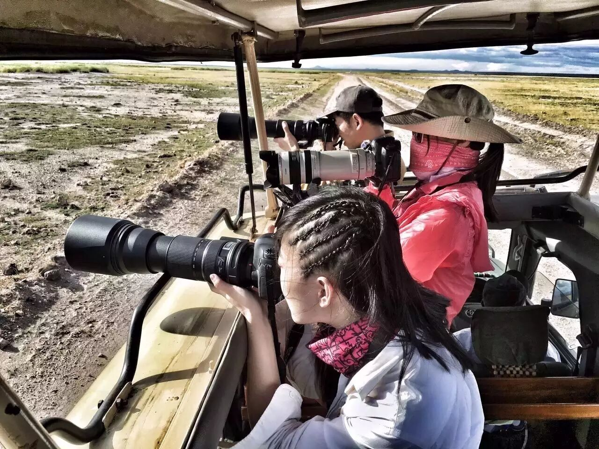
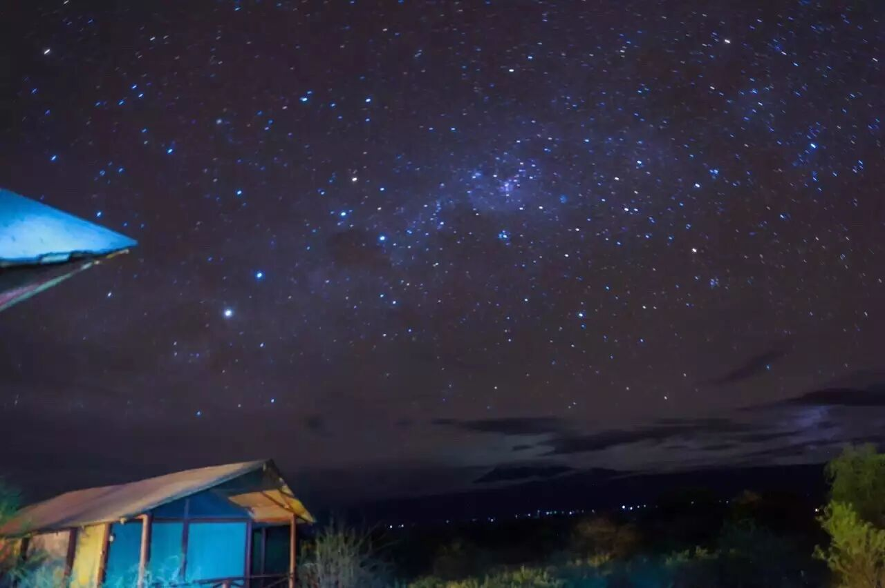
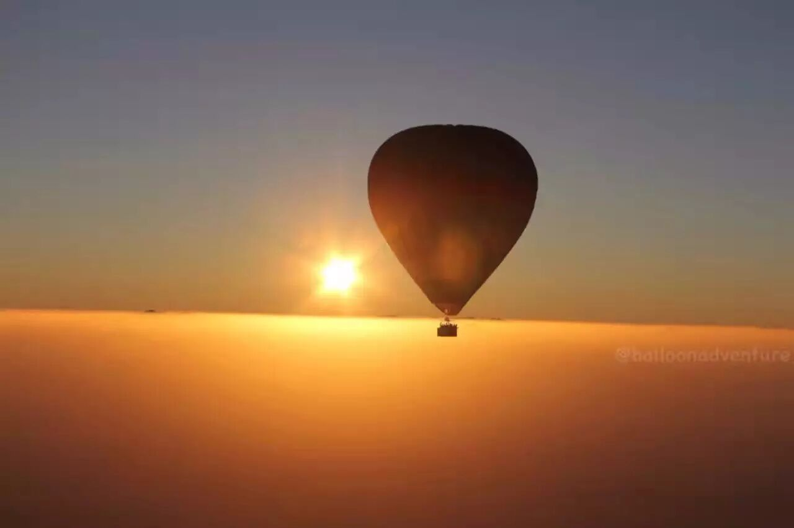
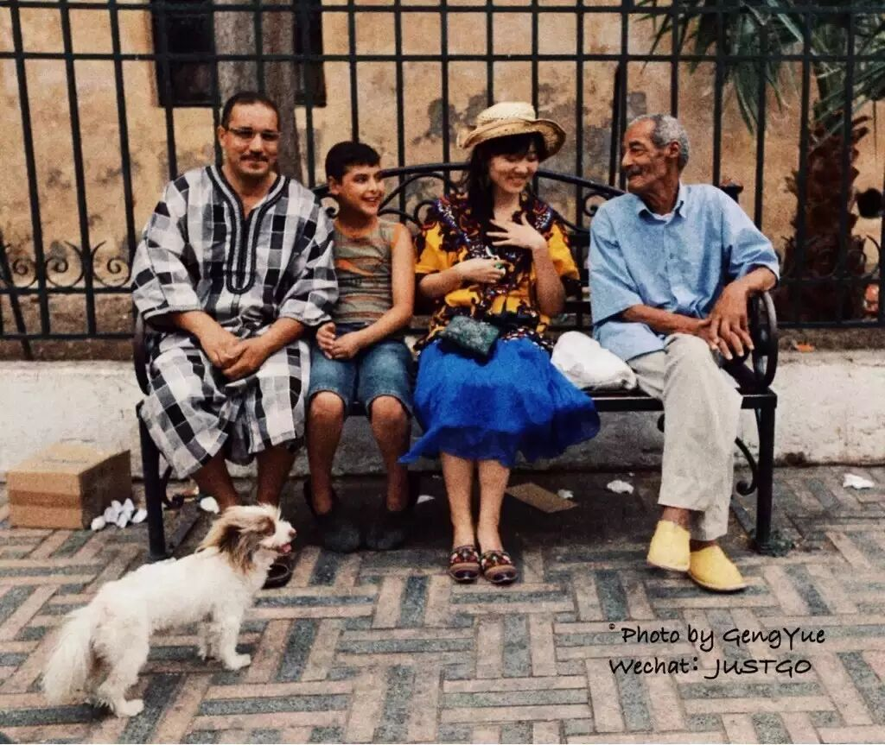
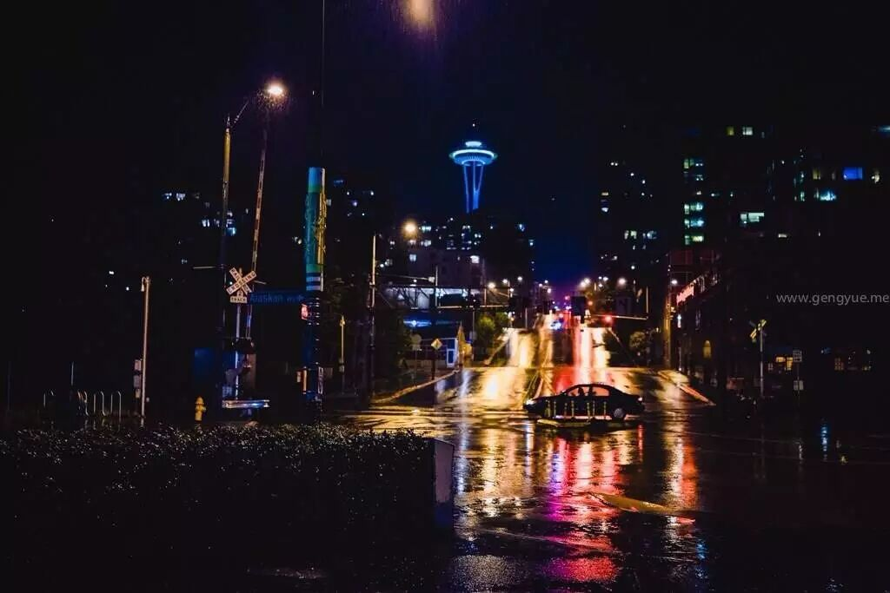

# I Have Visited Every Daydream in the Late Night of Overtime Work

*Geng Yue · Travel Stories*

To the ones who believing dreams.

**In the office at three o'clock, in the middle of the night, I wrote a daydream.**

For several years, for 99 per cent of my time, I was lost in an office, working around a fixed trajectory.

The biggest expectation at that time was to have 1 per cent of my time and to get out of this trapped daily existence.

I worked overtime at the office in Beijing at three o'clock at night, but I had a daydream to travel the world.

I wrote a daydream: I want to lie on the sea, in the scenery, I want to travel, experience, record the beauty of the world, I want to travel to a cool life.

You must understand that feeling.

There are always moments when people want to leave everything they know, regardless of the consequences, to overthrow everything.

For people like us, dreaming and realising the dream, you can feel yourself "living".

And some dreams, at home, can never be achieved.

I decided to take care of my crazy dreams.

You know all the stories before,

**"Finally, the real adventure has begun."**

√ Going to the original villages of Africa to see the Maasai people getting fire

√ Going to the savannah of Kenya to photograph lions and giraffes.

√ Sleeping under the snowy mountains of Kilimanjaro to see the stars.

√ Seeing the most beautiful sunrise in the desert on the hot air balloon in Dubai.

√ Seeing the most beautiful sunset in the world in the Aegean Sea in Greece.

√ A 4,200-meter-high jump from the sky in Guam.

√ Taking a bike ride in Berlin for a day, "Graffiti Artist".

√ Becoming friends with the locals in a African small town in Equator Line.

√ Wandering in the rainy days of Seattle and remembering a movie.

√ Going to San Francisco to see the most beautiful ladder when I was working overtime late at night three years ago.

I kept going to the wonderful scenery all the time, encountering interesting people, and I met a world that I really liked.

Those daydreams that I wrote down late at night, now I have really visited them.

**Thank you for following my travel story.**

I hope that you can also become a down-to-earth daydreamer and a person who has rich experiences and a host of stories to tell.