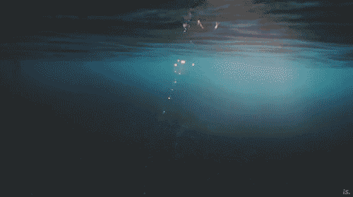
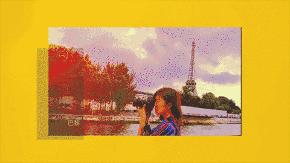
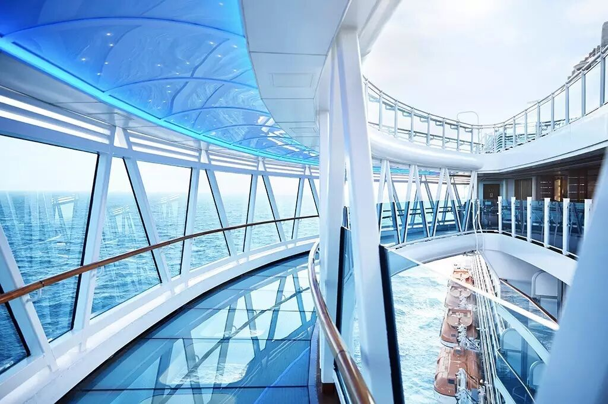
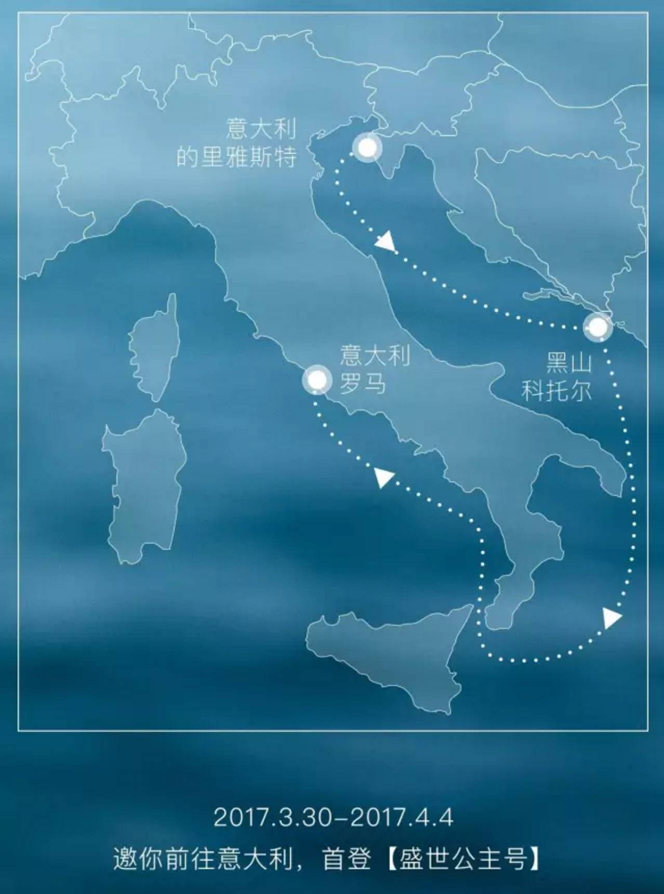
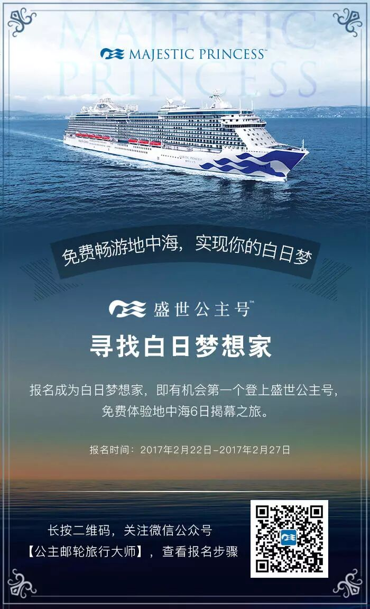

# 我在加班深夜里的每一个白日梦，都去过了。

*Geng Yue · Travel Stories*

T o T h e O n e s W h o D r e a m

### 01 在深夜三点的办公室 我写下一个个白日梦

有好几年的时间，我99%的时间，都在办公室里被工作淹没，围绕着固定的轨迹运转。

当时最大的奢望，就是能拥有1%的时间，挣脱这被困住的日常。

我在深夜三点北京的办公室加班，却有个去环游世界的白日梦。

我写下了一个个白日梦：想躺在大海边，风景里，想去游历、体验、记录这个世界上的美，想去过一种很酷的人生。

你一定明白那种感受，

总有那么一些瞬间，每个人想要不计后果离开眼前的所有，去把一切推翻重来。

对我们这样的人来说，**做梦，和去把梦实现，你才能感觉到自己"活着"**。

而有些梦，蹲在家里是永远实现不了的。

我决定奋不顾身地去实现我的那些疯狂的梦。

后面的故事，你们都知道了，

"终于，真正的冒险开始了。"

✔️去非洲的原始村落看马赛人钻木取火

**✔️ 去肯尼亚大草原上Safari拍摄狮子和长颈鹿**

✔️ 睡在乞力马扎罗雪山下看漫天繁星

✔️ 在迪拜的热气球上看到沙漠最美日出

✔️ 在希腊爱琴海看到了世界最美落日

✔️在关岛的四千两百米高空跳伞

✔️在柏林骑单车做了一天"涂鸦艺术家"

✔️在菲斯千年古城里跟当地人成为朋友

✔️在西雅图的雨天里漫步并想起一部电影

✔️在旧金山去了三年前深夜加班时看到的最美阶梯

........

我一路不停歇地去邂逅美妙的风景，偶遇有意思的人，我遇到一个自己真正喜欢的世界。

那些我深夜写下的白日梦，真的一个个去过了。

### 02 长成一个脚踏实地的白日梦想家

而"白日梦"，大概是世界上最让人开心的名词之一。

我还有一个白日梦。
多年前，我深深地喜欢一部意大利电影《海上钢琴师》，钢琴师1900，一辈子就活在一座邮轮上，做自己热爱的事情，演奏自己喜欢的音乐。

在那个漂浮在海上的乌托邦，他做了一辈子天真的、守护梦的人。

我想漂在意大利的大海上，体会那样的自由感。

这场白日梦的想象，这一次将继续成真。

今年3月，我将作为"白日梦想家"，参加盛世公主号的地中海揭幕之旅。

这次揭幕之旅的航线从意大利的里雅斯特出发，经过黑山海港城市科托尔，再回到罗马。

### 03 写下你的白日梦 跟我免费去旅行

知道每个人的蠢蠢欲动，所以特意准备了**两张免费畅游地中海的船票——招募白日梦想家——**

期待在这座装满梦的邮轮上见到你，我会为你拍一套海洋大片。

**你们与免费地中海船票，真的只差一个白日梦的距离。**

谢谢还在期待我旅行故事的你

💗

愿你也能成为脚踏实地的白日梦想家

长成一个阅历足够丰富攒了一箩筐故事的人。