# 爱在斯里兰卡

*Geng Yue · Travel Stories*

看到这个视频，被惊艳到。

爱在斯里兰卡。

△

爱在斯里兰卡*《 Loving Lanka 》*

这支短片很牛

被GEO杂志称之为 2015年最佳旅游宣传片

VIMEO排名前5的最佳旅行宣传片

还有一支更牛的，这个看完直接燃了。

这是看过的最具艺术美感的滑板视频，没有之一。

△

Beast

每一帧都是一张完美的照片。

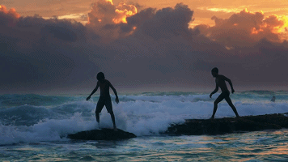

◇

就想去找这个大神的故事。

是一个叫Sebastian的人拍的。

**Sebastian Linda**

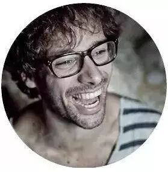

履历也很牛

2014-2015网络视频大赛得主

在Red Bull, PRO7, Goldwell等大公司工作

商业电影制作人、导演

户外运动终极爱好者.....

他出生在德国。除去他身上那些闪光的标签。

有三个关键词：旅行 摄影 滑板

◇

**两支影片**

《Loving Lanka》旁白来自Alan Watts的演讲，他是一位精通佛学的英国哲学家。

**"我们习惯于把自己视为过去的木偶，总是梦想着我们背后的那根线，因为我想把事情完全倒转过来。"**

短片没有字幕，旁白很美：

"花儿开得很娇艳，星星很灿烂，地球散发芬芳，雨滴在低吟，万物再次闪耀。

又一次，你看见世界的另一面。

你所爱的，男人，女人。"

而Sebastian崇尚活**在当下的生活理念。"**我要说，过去是现在的结果。**"**

所以影片里有很多**倒着行走的瞬间。**这也是视频的特别之处。

《Beast》则用调色、高速摄影、烟雾和粉尘给人们展示了滑板运动特有的美感。其中每一帧画面单拿出来都是一副**精美的摄影作品。**

◇

**对于旅行"如果你真的想在某方面有所提高，那么出去走走，并花些时间在这些方面"。**

2014年10月，繁重的工作和商业电影让他喘不过气，为了从工作中抽离出来。他辞去了所有的工作，向他的爱人求婚，带着她来到了斯里兰卡。

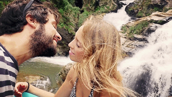

**> Sebastian和他的妻子 <**

旅行对Sebastian来说，是个突破自己的过程，创作灵感的源泉。

在斯里兰卡的三个月，他把自己很好的融入到这旅途中。

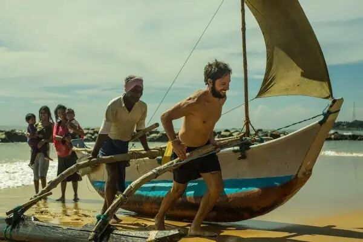

> **他喜欢从窗户里看当地渔民，并下楼帮助他们**<

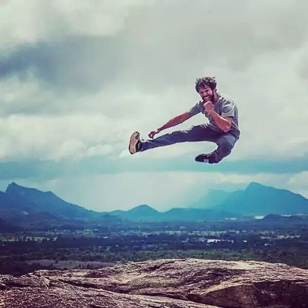
**> 在斯里兰卡山崖上跳高 <**

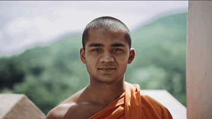

**> 和当地僧侣一起玩球 <**

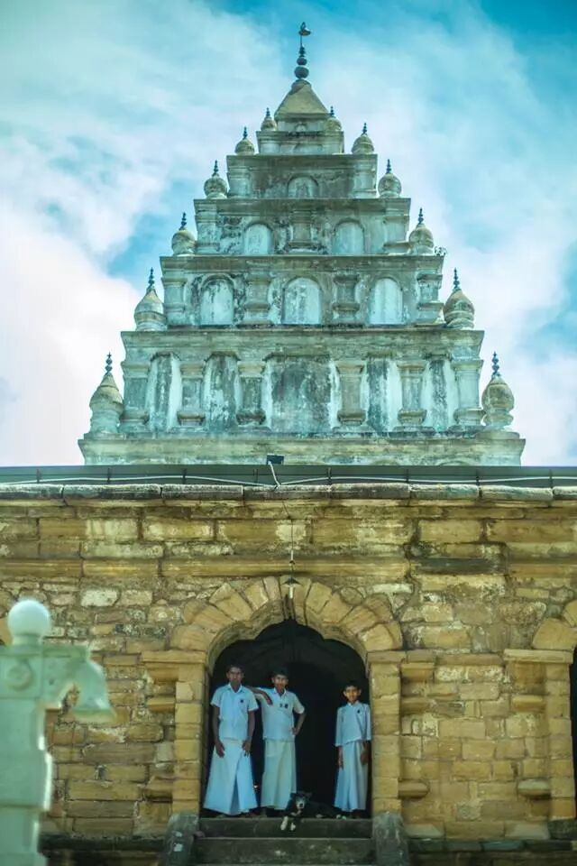
**> 想要和当地孩子一样在寺庙上学 <**

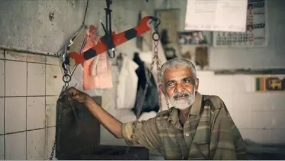

**>**这位老爷爷在这个地方卖食品，已经有一定岁月，还会一直持续下去，简单、满足、安静**<**

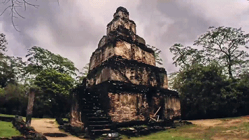

◇

**对于摄影"我发现自己能捕捉到一些很好的时刻，并把这些时刻放在一起，非常有意思。"**

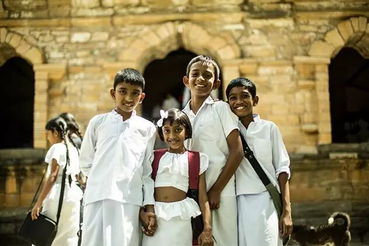
**> 拍摄当地孩子的笑脸 <**

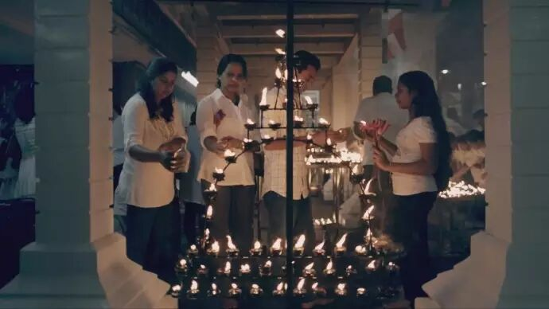
**> 拍摄当地教堂 <**

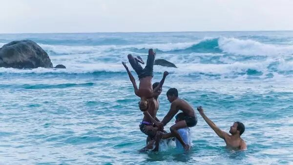
**> Sebastian拍摄《Loving Lanka》的一幕 <**

Sebastian总共拍摄了60多个小时，最后剪了不到3分钟的短片。

这对创作者来说是一件"崩溃"的事。

他希望自己的视频给人一种在跳舞的感觉，因为舞蹈，绝不会让人觉得无聊，**每一秒都有新的惊喜。**

为了达到这种效果，他也经常模仿舞蹈动作来获得灵感。

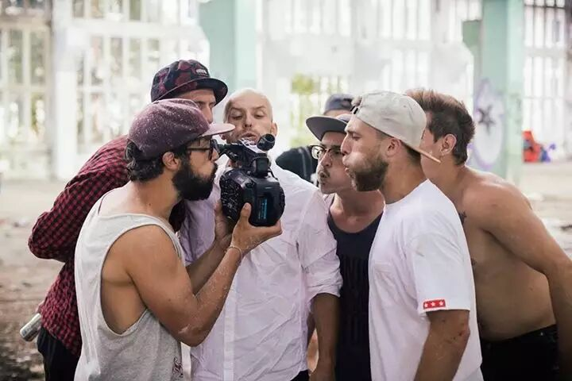

**> Sebastian和他的朋友们 <**

他的朋友形容他为**疯狂。**

"在他告诉我这是最终版本10次之后，我终于看到了其中的一个最终版本。"

**"我喜欢真实的时刻，真实的人和生活，所创造的故事。**

我希望自己在这些故事和瞬间里。我的唯一目标，就是让你们在视频中感受到这些时刻。"

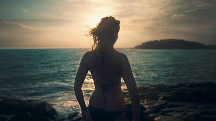

◇

**对于滑板"我第一次看到滑板玩家的时候，只有6岁，我相信，一定是魔法让他飞起来"**

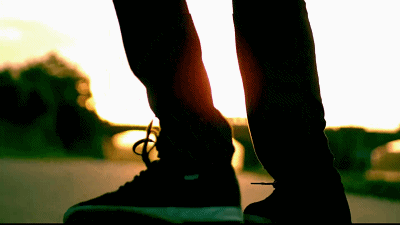

他拍摄过很多关于滑板的影片，比如**"Beast"**系列，他将自己拍摄滑板的旅程称为"找回梦想之旅"。

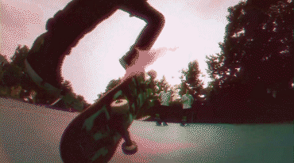

滑板对Sebastian而言，除了是影片素材之外，也是拍摄工具。《loving Lanka》中所有的画面就是Sebastian自己踩着滑板，不停旋转相机捕捉到的，没有摄影推车，也没有复杂的后期。

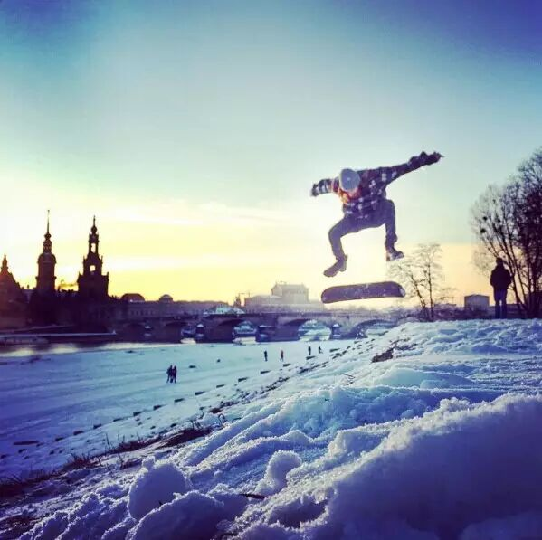

> **Sebastian酷爱户外运动，图为他在雪地里滑板。**<

◇

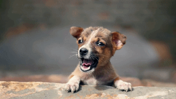

***你得丢开以往的事，才能不断继续前进。** *

***——《阿甘正传》** *

*"you got to put the past behind you before you can move on"*

撰文：木鱼 李梅

编辑：文逸 悦

视频来源：Sebastian Linda

