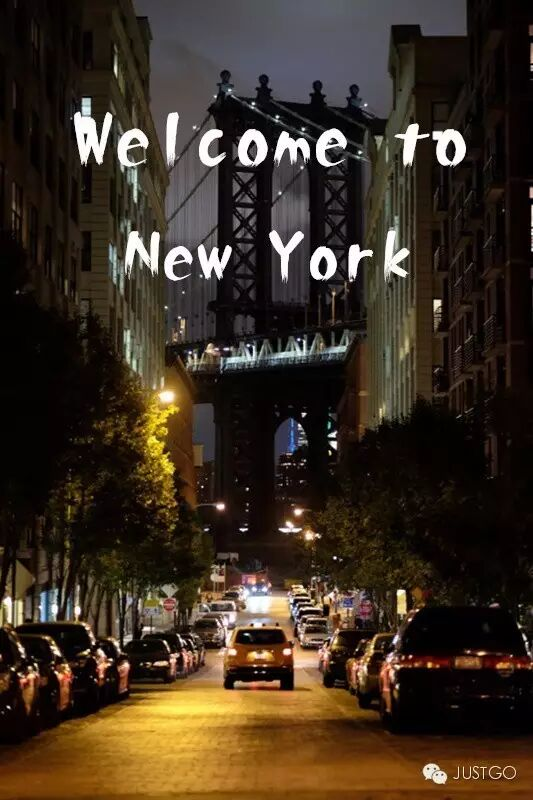
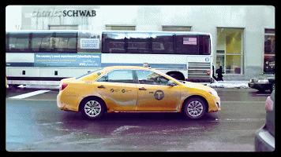
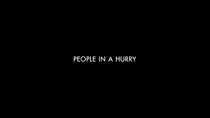
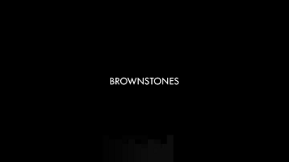
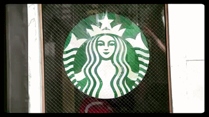
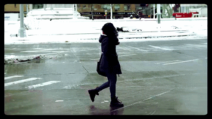
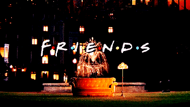
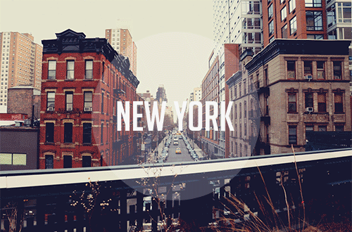

# Look, This Is New York

*Geng Yue · Travel Stories*

Welcome to New York

New York is my Dream City. I once copied down, word by word, a passage from E.B. White's *Here Is New York*: "It is a miracle that New York works at all. The whole thing is implausible... It manages to be the city that it is in spite of the concrete, the crowding, and the confusion."

The Statue of Liberty, the Empire State Building, Fifth Avenue, Times Square — if you define New York by these landmarks, you are a tourist.

The New York in this video is no longer about labels. It is real. It is everyday. It is life, minute by minute.

**▽**

Animator Ynon captures New York through four elements: yellow taxis, doors, people walking, and the world-famous Starbucks.

*Still NYC*

My favorite part is the yellow taxi sequence — from Central Park, down Fifth Avenue, through Chinatown. Whether day or night, as long as the city is in motion, it is alive.

Pedestrians are another signature. He photographs men and women, young and old, across every race and skin tone — because only this is New York. Boundless convergence. Boundless embrace.

He shot dozens of doors. Vintage and modern, artsy and sleek. Architecture is the record of a city.

His Starbucks shots are simpler — always that green mermaid logo — because Starbucks is the symbol of American coffee culture: fast-paced, standardized. But to a New Yorker, a café is a third space, beyond the office and home. A moment carved out for yourself.

Animating New York

**How it was made:**

Ynon is a freelance animation designer and a student at the Bezalel Academy of Arts and Design. Guided by his animation mindset, **he decided to make New York move, frame by frame.** This one-minute video is stitched together from 330 photographs. To prepare the piece, he shot 3,600 images in total.

***"Why photos instead of video?***

***Video would obviously be smoother and richer."***

***Ynon's explanation is wonderful:***

***"Because a photograph is an individual.** *

***I wanted to express the uniqueness of each person — or, you could say, individualism."***

The walking sequences were the most complex part — **because you cannot control other people's stride.** He even practiced beforehand, walking his fingers across a tabletop to simulate it.

The video may not look like a blockbuster production, and the turnaround was fast — one week of shooting, one week of editing. But **waiting at a fixed angle for the right photograph is no easy task.** Sometimes thirty minutes would pass without a single yellow taxi appearing at the right place at the right time. Some passersby even mistook him for a paparazzo staking out a celebrity.

His biggest regret? He wanted to recreate the shot from *Seinfeld* where the yellow taxi pulls away — but New York traffic congestion has made that impossible.

**This is New York, too.**

Drowned in this vast city of millions, I felt a genuine freedom: the freedom of solitude, of being left alone, unnoticed by anyone.

— Bai Xianyong, *The New Yorkers*

Written by / Tongtong

Edited by / Wenyi, Yue

Video by / Ynon