# 伊斯坦布尔：你的心碎，将成为过往里的一段独特风景

*Geng Yue · Travel Stories*

亲爱的刚打开文章的你：

我有接近一个月的时间在路上。

这个后台里陆续地收到这样的留言：

你们知道，我会看到每一句。

每晚我还会收到来自陌生朋友的晚安，可能已坚持了三百天，几乎没有回复过，但Ta知道我会看到，就一直发，分享城市的天气，天冷加衣保暖，这是份懂得。

完全没有更新的日子里，每天还有新朋友来关注，跟我分享旅行的故事，和发现这里的喜悦。感激。

我负责的其他新媒体，每天仍喧嚣而日常地更新着，但心里的柔软，更想寄放在某些安静之处，至少给懂的人。

关注这个公众号的每一位，我们聊过天，知道彼此居住的城市位置，有的收到过志愿者团队手写的明信片。

**当你们忐忑地不断地问我，为啥不更新了？你是不是太忙了？是不是忘了？你还好吗？是不是病了？**

其实每次出发，都有成长和惊喜的邂逅，也有停下后思考何去何从的迷惘。你们来自远方的惦记，让在刮着大风冒着哈气北方寒冬里的我，有种喝到一杯热茶时的温暖。

无论怎样，我和我的这个志愿者团队还应该继续更新，因为**这些惦记，都是信任。**

记得曾有前辈对我说过，**"人与人之间最难的是信任，而我在你身上看到了百分之百的信任，这非常难，特别是到我这样的年纪，阅人无数，看过太多人性的残忍、争斗和灰暗。"**

但我遇到过百分百的纯粹和信任，可能是磁场相吸的缘故。今天，给每一位惦记的人，推送文章，这是我们能够做到的，**一份"信任"和"安心"。**

冬天快乐。**我还好，你呢？**

Yue

---

这是一篇城市的影像记忆，来自一位摄影师朋友**李斯本**和她镜头中的**伊斯坦布尔**。

最近关于土耳其的新闻并不安宁，"复杂的国际政治放一边，作为普通人，接下来这段时间，如有可能，最好避免去土耳其旅游、出差，去往欧洲其它地方的，也最好慎选土航、避免在伊斯坦布尔转机。从过去两年的大大小小事件来看，至少这一区域正在日趋不稳定。"（@翼尖小翅 ）

**而对于一个热爱旅行的人来说，在旅途中，让我们迷恋的，是庞大而优雅的建筑，地中海风情的槐花香气，擦肩而过的异乡人，舌尖味蕾的跃动，奇妙的际遇，彻底的放下，和每一次的怦然心动。"我试着解释的是伊斯坦布尔整座城市的呼愁"**

——奥尔罕·帕慕克

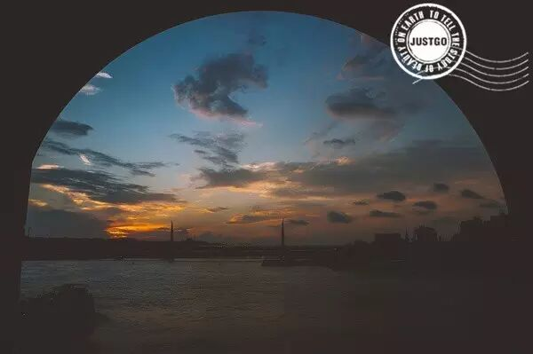

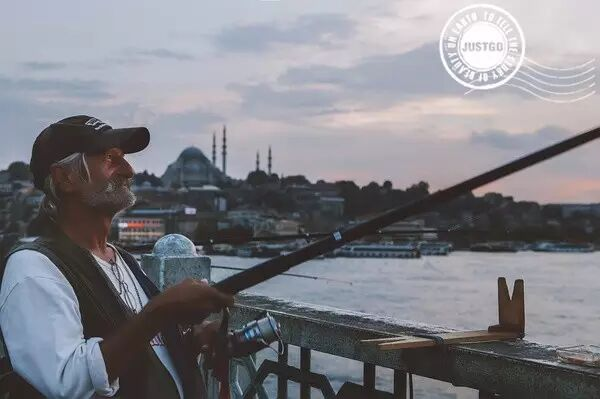

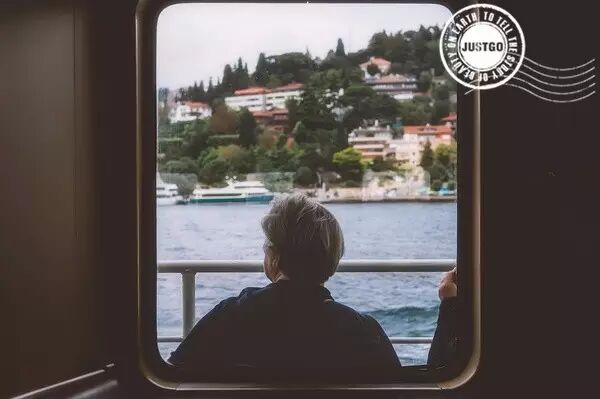

以下推荐语，出自志愿者团队的"木鱼"，一位很有才的爱读书的男纸：

因为一本书爱上一座城，在宁静的夜里翻开帕慕克的《伊斯坦布尔：一座城市的记忆》，轻轻地体会这座城市。曾经的辉煌与瑰丽，现在淡淡的衰落与破败，一切都变成了斑驳的碎片，每一张黑白的影像悄悄惨入每个人的心里。

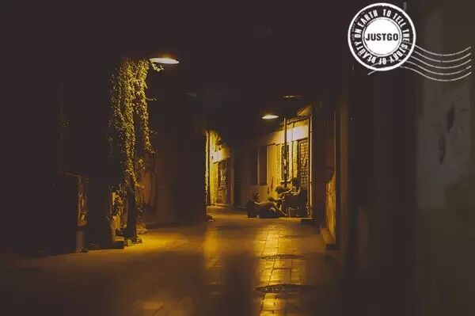

土耳其人说，世界只有两种城市一种是伊斯坦布尔，而另一种不是。足以看出其独一无二。

独自流浪，在迷宫般的街道穿梭，在蜿蜒的海峡边流连，华美的城堡和苍凉忧伤的古迹让你心潮涌动。

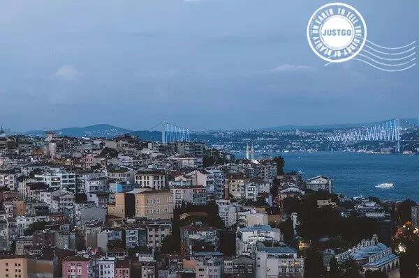

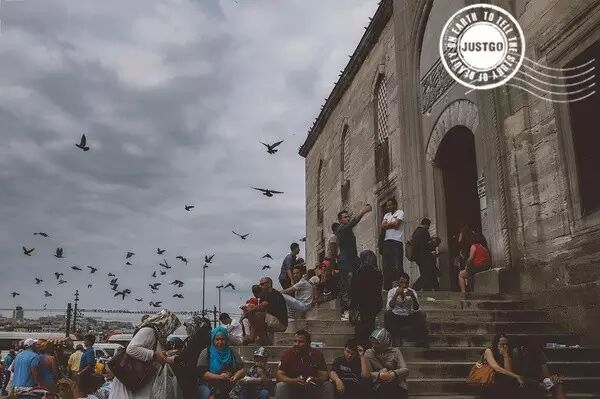

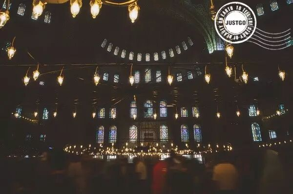

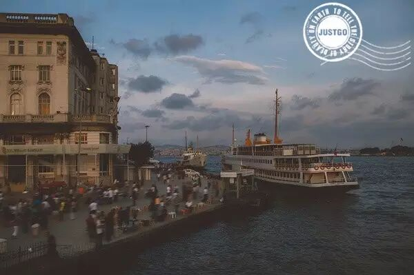

伊斯坦布尔足球，更是世界球迷向往圣地，无论是加拉塔萨雷的土耳其电信球场，抑或费内巴切的萨拉焦格卢球场，那种沸腾的紧张与激情必让你终身难忘。

**李斯本**

镜头中的伊斯坦布尔

**泛着泪光的海**

以下文字来自@李斯本 的微博：

帕慕克自然说过许多关于博斯普鲁斯的动情的话，可能我最喜欢的是："观看柏树、山谷里的森林、无人照管的空别墅以及外壳生锈的破旧船只，观看船只和雅骊别墅在博斯普鲁斯谱成的诗句，抛开历史的恩怨，如孩子般尽情享受，期望多知道这个世界，多去了解"—— 一个五十岁作家逐渐了解这种狼狈的挣扎叫做喜悦。

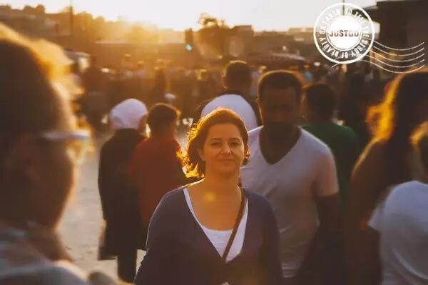

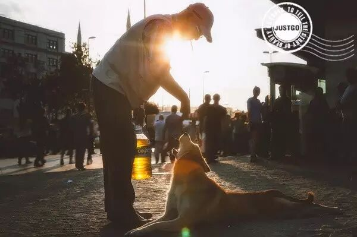

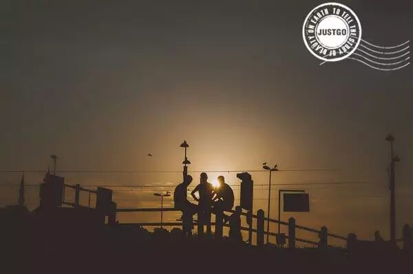

伊斯坦布尔和里斯本是相像的。它们都一朝繁华旧梦，一夕帝国斜阳；它们的大街小巷都袒露着残缺贫困，连流浪的狗都有一样忧郁的睡姿。但或许正是这命运滋养了它们的灵魂。历史给予一座城的不仅仅是残垣断壁，而是暮色般的姿态。**如果伊斯坦布尔没有了帕慕克所说的呼愁，也许就不配拥有博斯普鲁斯的海风。**

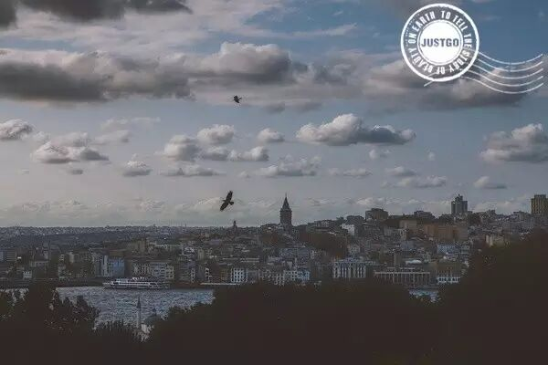

**文明暮光**

博斯普鲁斯（伊斯塔布尔）的沉沉暮色，早在宗教和贪欲存在之前，早在商队和十字军分出东西方之前就存在着。共和国，奥斯曼，乃至拜占庭的军队征服过这里。最伟大的歌舞和文明流淌过这里。推土机，房屋和集体记忆坍塌下来，所见和事实之间永远相隔着遗忘和死亡。

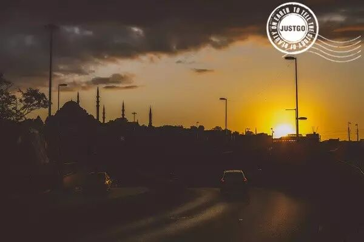

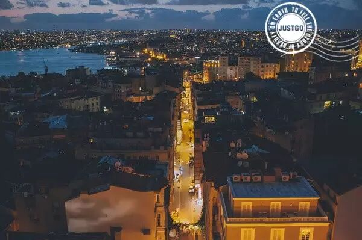

这里发生过欧洲史上最悲伤的场景之一：君士坦丁堡陷落前最后几小时，圣索菲亚大教堂的最后一次安魂弥撒。东罗马帝国的最后一次安魂弥撒。这些兵临城下、在劫难逃的拜占庭人集合在这里最后一次祈求上帝。两天后，基督教的圣坛被拆除，矗立千年的十字架倒在地上，西方世界最华丽的教堂成为苏丹的清真寺。

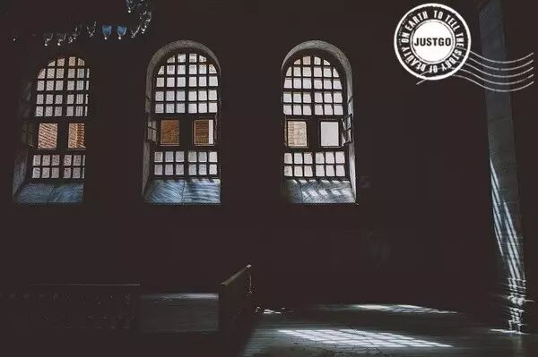

——"Taking pictures, of your tenderness."

这篇题目，来自于摄影师李斯本的一句图注"Your heartbreak is just another version of the same old story."

有位"吃蛋糕的人"翻译成："你的心碎，将成为过往里的一段独特风景。"

动人的话，送给每个心向往之的你。

视频：devinsupertramp团队

摄影：李斯本

文字：木鱼 Yue