# Greece Is Not Far: If You Want to Go, You Can Get There. Dreams Are Not Far: Take a Step and You Draw Closer.

*Geng Yue · Travel Stories*

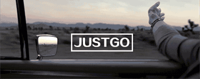

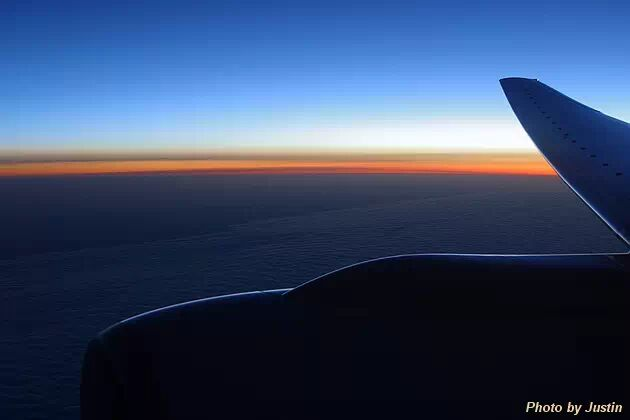

Greece.

The first time I saw the book *My Heart Lingers in the Aegean*, the turquoise sea and sky on its cover struck me instantly. I felt I had found something I truly loved.

I was in high school then. Between classes, I would flip through the book again and again — a teenager dreaming of the vast world beyond. That book stayed with me for seven years. It came from Justin, a Taiwanese engineer.

The pure white walls, the cobalt blue window frames, a single bright wild rose, a slightly mysterious black cat — I remember them vividly. Back then, gazing from afar, traveling to Greece felt like the biggest dream of all.

When I went to university, it was the only travel book I brought with me. My roommate Mengmeng flipped through it and said, "I have to go here." Three years ago, I received a WeChat message from her — photos of Santorini. She said, "I'm in Greece, on my honeymoon. Because of that book, the wish I made came true."

Blue, so pure. White, so transparent.

Maugham once wrote something to the effect that some people seem born in the wrong place. They grow up somewhere, yet carry an inexplicable homesickness for a place they have never been. Perhaps it is this that drives them to travel a thousand miles to find that homeland. Until one day, they arrive somewhere and feel an immediate, wondrous sense of belonging — as if they had known it all their lives.

A good friend who lived in Greece for ten years once told me that some travelers stay on the road because they have not yet found their destination. She and her partner were lucky enough to find theirs. It was Greece.

Justin said: **Greece is not far. If you want to go, you can get there. Dreams are not far. Take a step and you draw closer...**

And I am truly about to leave for Greece.

By Yue

Below are the photographs and words from *My Heart Lingers in the Aegean*.

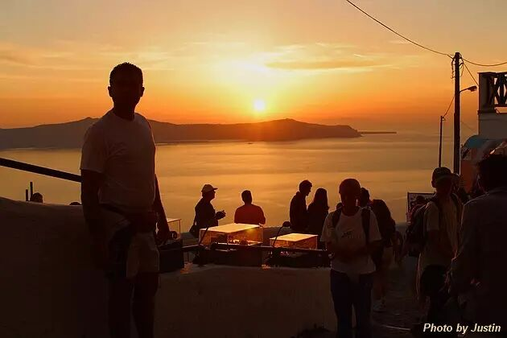

▲ The first sunset of my Greek journey, over the Aegean. At this moment, words are superfluous.

Fira, Santorini.

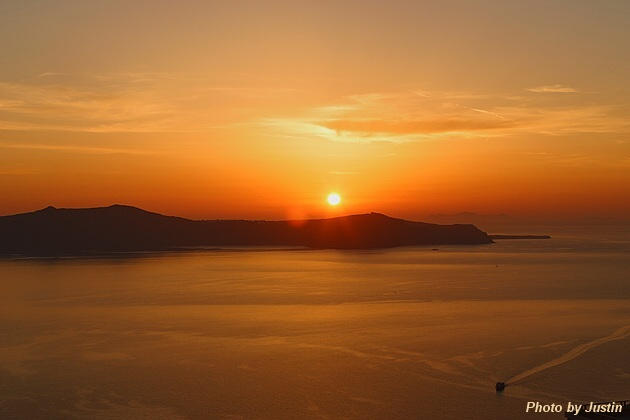

▲ Some say that if the Cyclades are a necklace upon the Aegean, then Santorini is the most brilliant sapphire on that chain.

Santorini — the legendary Atlantis from Plato's dialogues. This lends the beautiful island a touch of mystery.

Sunset over the Aegean.

Fira, Santorini.

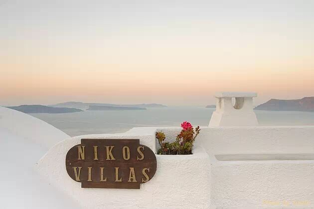

▲ The quintessential white houses of Greece. I stayed here. Dreamlike enough?

Oia, Santorini.

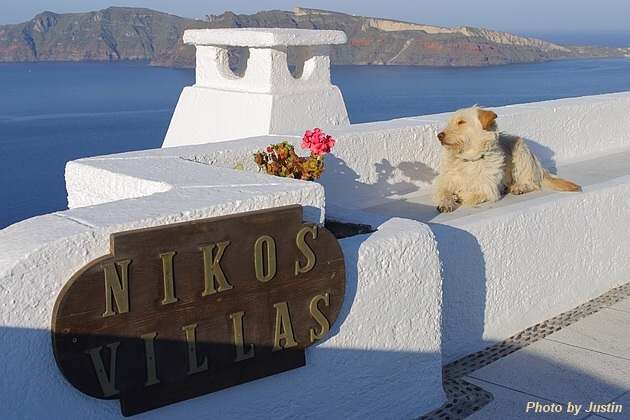

▲ Even the dogs in Greece seem relaxed and happy.

Oia, Santorini.

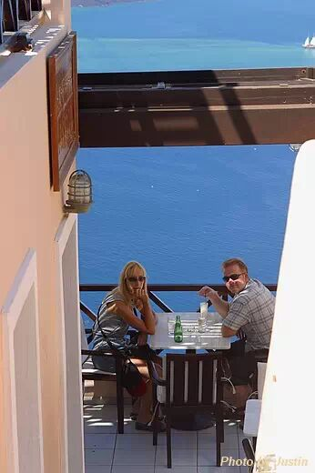

▲ I was on the stairs above, trying to take a candid shot. Through the viewfinder, I realized I had been spotted. Embarrassed, I lowered the camera with a shy smile. To my surprise, they returned a friendly smile. I gestured with my eyes — he nodded. I raised the camera and continued the unfinished shot.

Fira, Santorini.

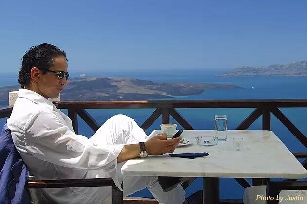

▲ After walking all morning, my feet were sore. I found a seaside restaurant to enjoy lunch. The man at the next table was leisurely sipping coffee, playing with his phone. I didn't want to disturb him, so I pretended to photograph the scenery, quietly including him in the frame. The sea and sky were so blue, and with his all-white outfit — another quintessential Greek image.

Fira, Santorini.

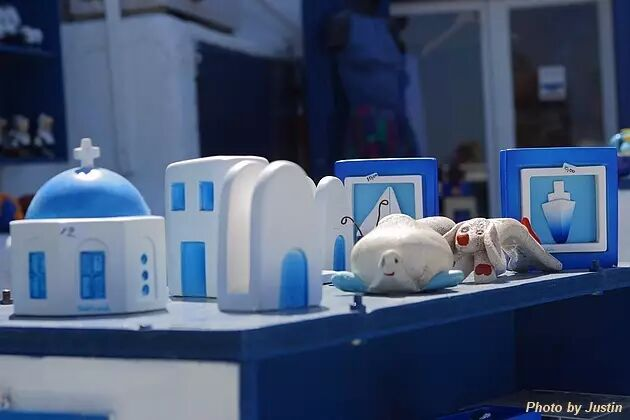

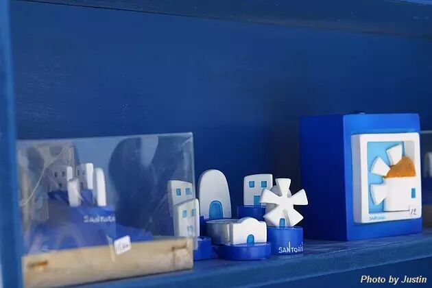

▲ Greek souvenirs are famous — the signature blue and white. I wanted to tell the shopkeeper: wrap it all up for me. But most items were fragile and not cheap. For the sake of the rest of my budget, I bought only a little. The rest, I asked the shopkeeper to let me photograph, so I could bring the memories home.

Fira, Santorini.

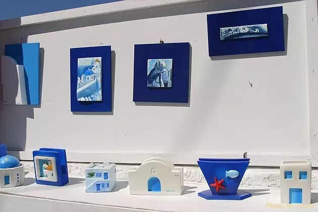

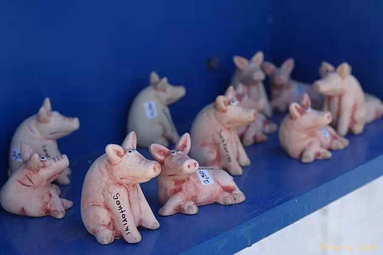

▲ An older friend of mine loves collecting pigs. Whenever I go abroad and see a unique pig, I always bring one back for him. This time, my spoils: two adorable Santorini Pigs.

Fira, Santorini.

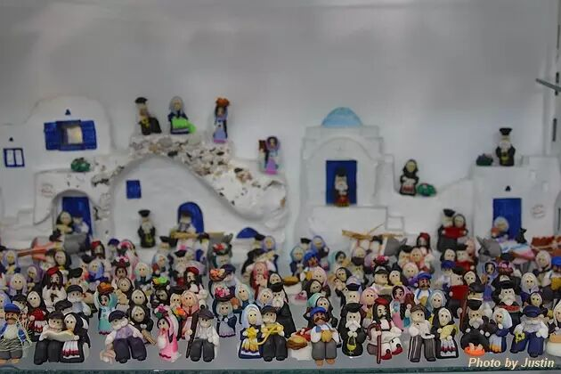

▲ These little dolls are dressed in traditional Greek costumes. The shopkeeper proudly told me that no shop in all of Santorini has a more complete collection than his.

Fira, Santorini.

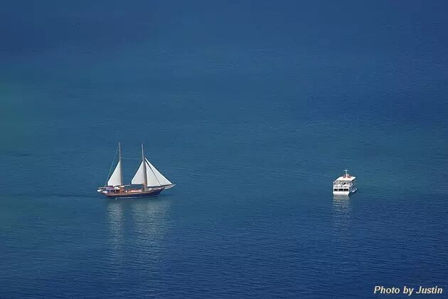

▲ Many friends told me this looks like toy boats in a pond. Do you feel the same way? As for the shooting location, see the upper right corner of photo 009.

Fira, Santorini.

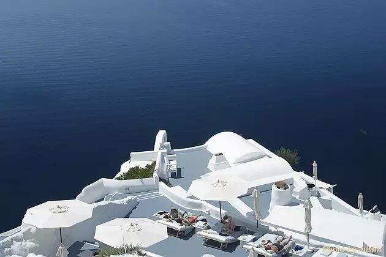

▲ For this shot, I used a polarizing filter and a graduated neutral density filter (to reduce the sea's brightness), wanting to lengthen the exposure to make the waves more distinct and alive. After shooting, I checked the LCD — oh no, the whites were overexposed. But when I got back to the computer, the overexposure turned out beautifully. A little dreamy, a little unreal, a very relaxed feeling.

Oia, Santorini.

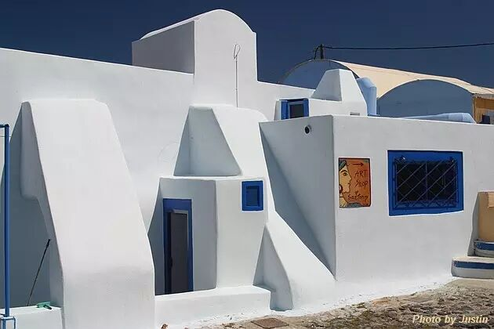

▲ Where do Santorini's blue and white come from? Santorini is volcanic terrain with a hot climate. The Greek government requires all houses to be painted white, because white has a cooling effect, both visually and physically. After October, Greece enters its rainy season. To preserve the pristine white, every May — before peak season — residents repaint. The white of this Art Shop is the dazzling white of fresh paint. The brushes are still right there beside it.

Santorini.

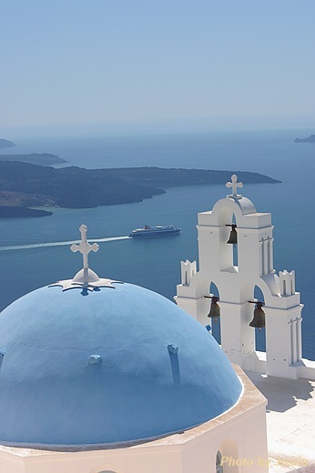

▲ Many postcards and books about Greece feature this church as their subject. That alone was reason enough to track it down. I went through a lot to find it — most locals didn't even know where it was. Directions were vague, some even pointed the wrong way. It took me two hours to find it.

(Ref: 032 The Bonus of Getting Lost)

Santorini.

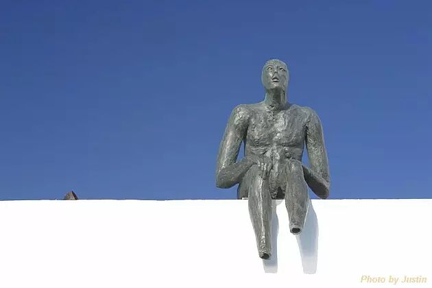

▲ An art gallery in Fira, with very distinctive human figures on display. This is one of my own favorite photos — simple composition, leaving plenty of room for thought. Later, I realized where the compositional inspiration came from: Matisse — Icarus (Jazz Series), 1947.

Fira, Santorini.

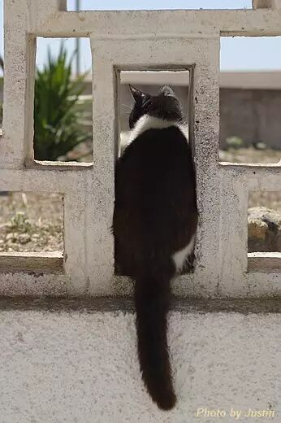

▲ I met him in Oia. Just as I was about to photograph him, he started running — one of the few cats in Greece afraid of people. Then he leaped straight into a hole in the wall. Ha, what a character. I snapped a few shots.

Oia, Santorini.

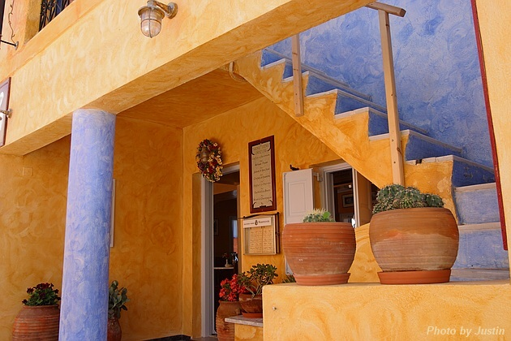

▲ Blue and orange give such a warm feeling. The saturated colors made me unable to resist capturing them.

Oia, Santorini.

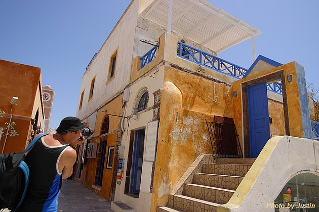

▲ When traveling abroad and spotting a fellow photographer, I can't help but steal a few extra glances, then quietly observe. Do others do the same to me?

Oia, Santorini.

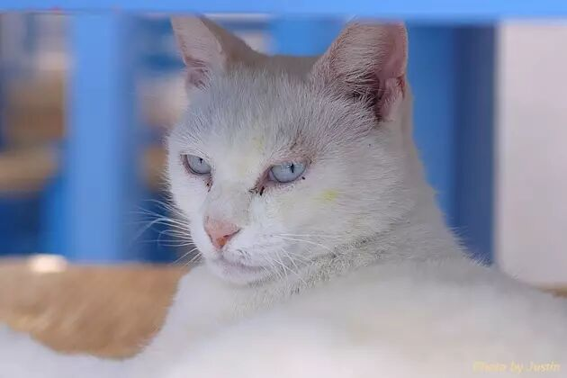

▲ I found him on a chair outside a closed café in Oia. He was probably settling in for an afternoon nap, not really in the mood for me. I kept moving his chair, trying to get the best angle. He probably found me quite annoying...

Oia, Santorini.

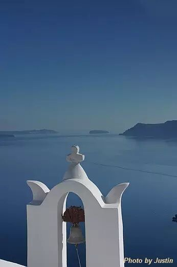

▲ I really like this photo — so serene. The flaw is the extra white on the bottom left and the black on the bottom right. I think I need a camera with 100% viewfinder coverage.

Oia, Santorini.

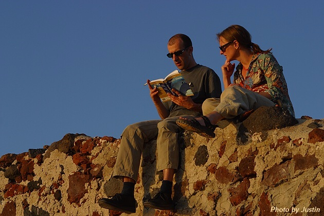

▲ A small slope beside the best sunset-viewing spot in Oia. Many people climb up here. The man is holding the Lonely Planet *Greek Islands*. So everyone reads the same book. Different skin colors, different languages — but the longing for travel in the heart is the same.

Oia, Santorini.

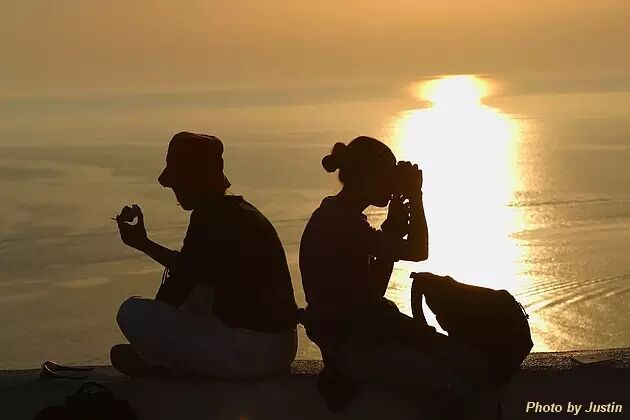

▲ The woman on the right is an Indian solo traveler. She shyly asked if she could look through my camera. Unfortunately, I hadn't even finished adjusting it yet — only the tripod was set up. I should have asked for her email. Now she could have seen the final result. I often wonder: if the locals I photograph could see the pictures I take of them, they would probably be happy too.

Oia, Santorini.

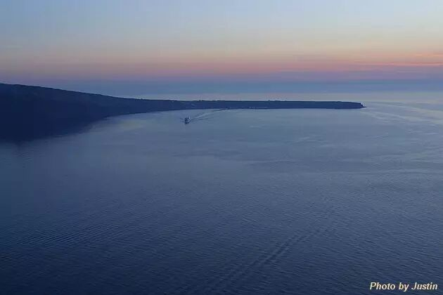

▲ By the time I took this photo, the sun had already set. A boat was pulling out of the harbor, its wake tracing beautiful ripples. I wanted to switch lenses for a wider shot, but the boat was moving too fast. I gave up trying and let my eyes be the lens, my heart the film — preserving this image forever in my mind.

Oia, Santorini.

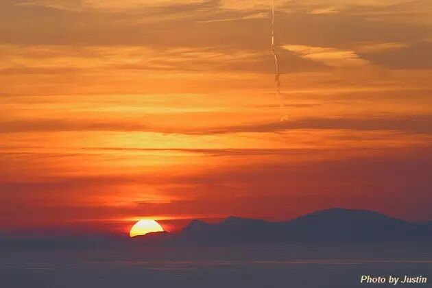

▲ This is the famous sunset. What is that long white streak on the right? Many people have asked me: it's probably a jet contrail, high in the sky. To be honest, the Oia sunset is not necessarily that beautiful in itself. I think it's the overall atmosphere that makes everything seem beautiful.

Oia, Santorini.

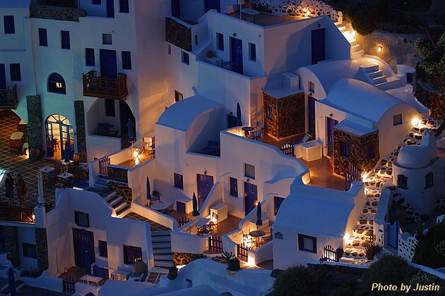

▲ This is a hotel — not cheap, but with a great view. A colleague of mine stayed here. Every evening, they would rush back to the hotel, sit on the balcony, and leisurely watch the sunset over the Aegean.

Oia, Santorini.

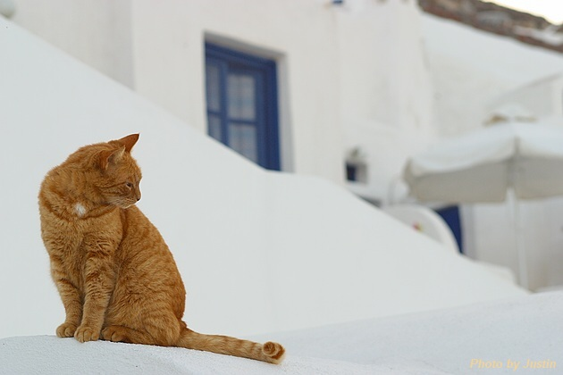

▲ A cat-loving colleague adored this photo. She said: even from behind, Greek cats are so elegant.

Oia, Santorini.

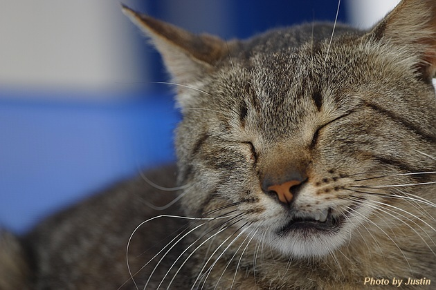

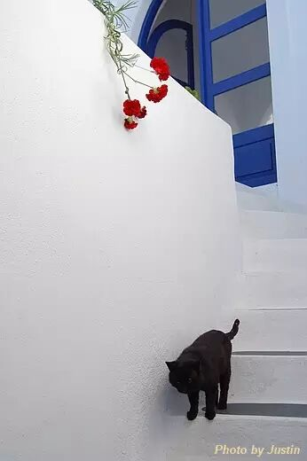

▲ A black cat. Blue-and-white architecture. Greece...

Oia, Santorini.

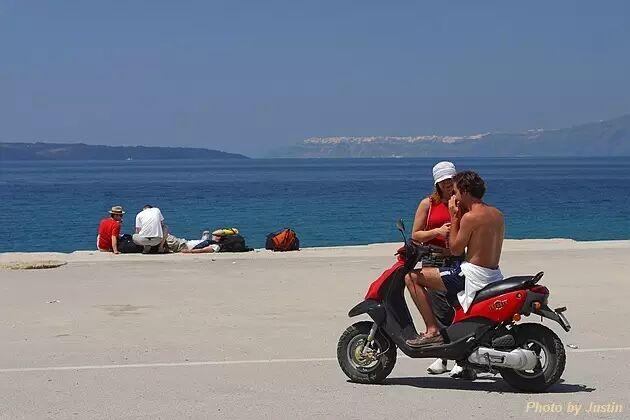

▲ Three solo-traveling guys, on the same ferry to Crete. Together, they navigated with a map, getting lost in signless Crete.

Athinios, Santorini.

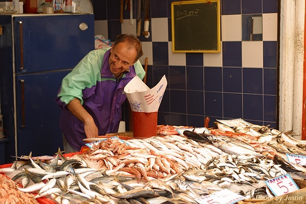

▲ The traditional market on 1866 Street in Crete. I first asked the vendor if I could take a photo. He continued working, perfectly at ease. From his smile, you could tell he was genuinely enjoying himself. When will I be able to feel like that? :P

1866 Street, Iraklio, Crete.

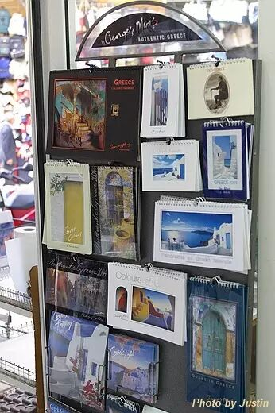

▲ The third row from the right is my favorite Greek landscape calendar. The photographer, George Meis, excels at capturing the beauty of Greece in wide panoramas. At the time, it was too expensive, so I couldn't bring myself to buy it. Later, when I wanted to, I couldn't find it anywhere. I have regretted it ever since. Fortunately, a colleague, unable to resist the lure of Greek blue and white, went there for his honeymoon despite the SARS threat. I've asked him to bring the calendar back for me. It should arrive next week.

Iraklio, Crete.

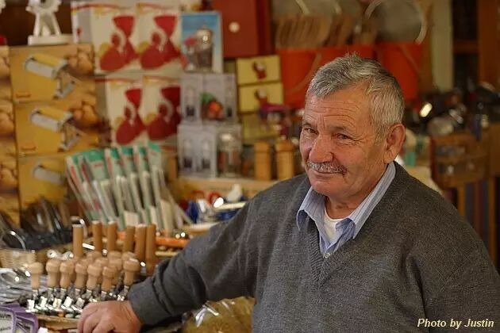

▲ 1866 Street: an old man selling souvenirs and daily sundries. He agreed to let me photograph him, and even deliberately struck this pose — a little cool, a little cute.

Iraklio, Crete.

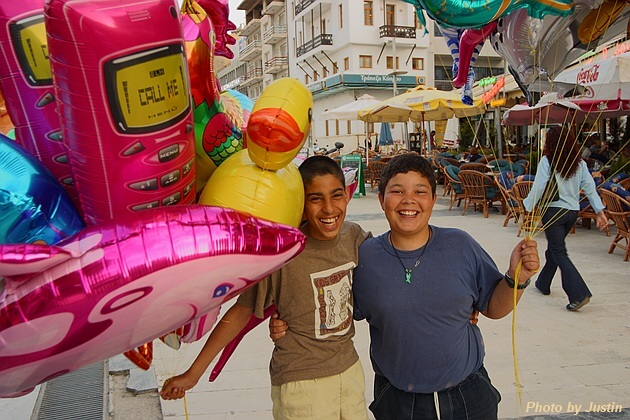

▲ Do you know why these two are laughing so heartily? Look at their hands — they are tickling each other.

Iraklio, Crete.

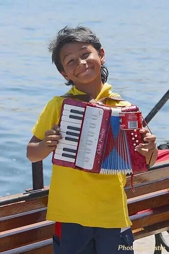

▲ Out of nowhere, a little boy appeared beside me, playing the accordion. Such an adorable kid — I immediately asked to take his photo. The moment I said it, he flashed a super-professional smile. His sudden, easy smile actually startled me — I didn't know how to press the shutter. In my fluster, I clicked twice. In the end, I gave him all the change I had on me.

Plateia Venizelou (Venice Square), Hania, Crete.

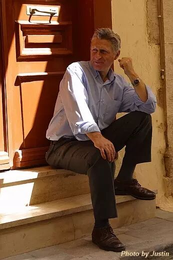

▲ I thought this man had so much character. After getting his permission, I took this photo.

Hania, Crete.

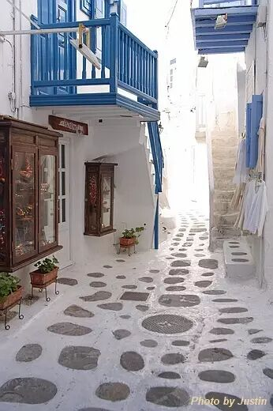

▲ White enchantment.

Mykonos.

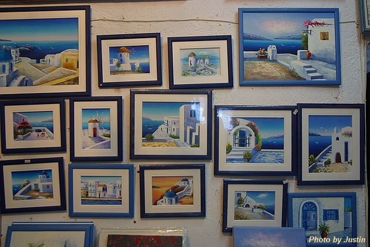

▲ On the Aegean islands, paintings are always more captivating than postcards. Postcards are too real — they never quite match the Aegean in my imagination. The Aegean of my imagination should be deeply romantic, dreamlike, unreal. Like... heaven.

Mykonos.

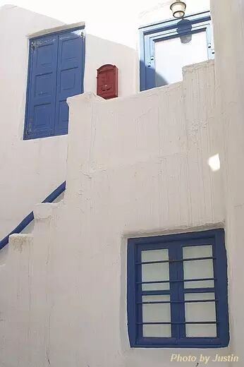

▲ The Greeks are truly born decorators. Simple blue and white, simple lines — in their hands, everything becomes so refreshing and delightful.

Mykonos.

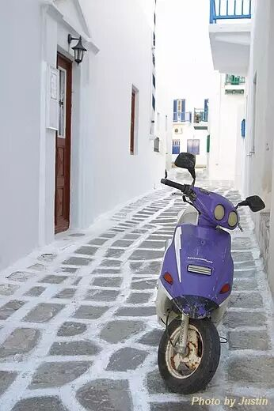

▲ The Aegean islands have a special kind of magic. Even a beat-up motorcycle, placed in the frame, looks perfectly at home.

Mykonos.

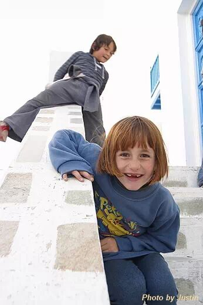

▲ A little girl in a blue dress saw me walking past below the stairs with my camera. She called her friends out to take a photo together. I was at the bottom of the stairs, they were at the top. Too far apart — we had to communicate with smiles and glances. A feeling of genuine connection.

Mykonos.

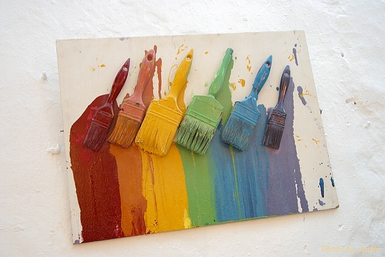

▲ Since 1978, when Gilbert Barker's rainbow flag was first used in a gay pride parade, the rainbow has become a symbol of LGBTQ+ culture. The six colors — red, orange, yellow, green, blue, and purple — represent life, healing, sunlight, nature and serenity, harmony, and spirit, symbolizing the diversity of the LGBTQ+ community. (Source: *2000 Handbook on Understanding Homosexuality*)

Mykonos is a vacation destination for the LGBTQ+ community. Paradise Beach and Super Paradise Beach are famous gay nude beaches. These six brushes are the sign of a bar in downtown Mykonos — a gesture of welcome.

Mykonos.

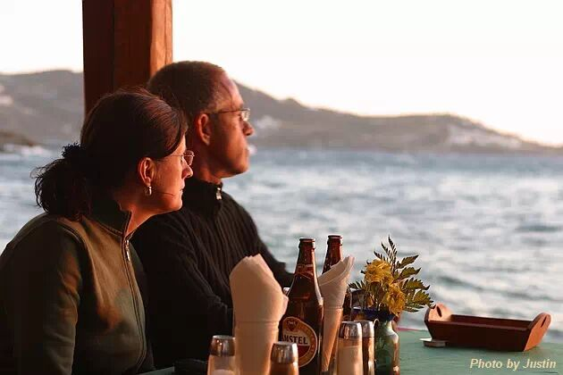

▲ Though the wind is strong and the waves are rough, my dear, having you by my side at this moment, watching this beautiful sunset together — the world seems to have fallen silent. My heart and yours, so close, so close...

Mykonos.

**Photographer: Justin**

An engineer, an incurable sensualist who loves beautiful things and pleasing sounds — which is why photography and music became lifelong passions. A romantic who loves listening to Chopin's nocturnes late at night.