# Time in India · How Shall I Remember You in the Days to Come

*Geng Yue · Travel Stories*

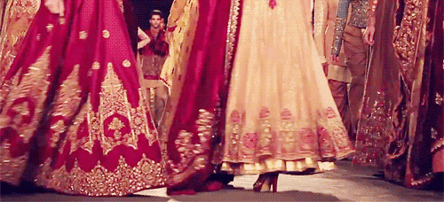

-

***India***

**Shantaram**

It took me a long time

and most of the world

to learn what I know about love and fate

and the choices we make.

**As for India —** when you are weaving through the towering skyscrapers of bustling Mumbai, then turn a corner and find yourself among crumbling slums;

when you sit by the Ganges and listen to the evening aarti chanted for centuries, watch the first ray of sunset fall upon the Taj Mahal, wait for a train that may never come… time stands still. It feels as if I have traveled through a thousand years, and finally arrived before you.

**Perhaps this is why I travel.**

***Why We Travel？***

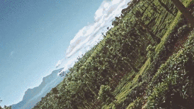

**/ Time in India / … First, watch a short film**

"There is no better way to see things from a different perspective than through travel. In southern India, everything seems completely upside down, full of unknowns and thrills."

This short film is raw and honest, an encounter with India. Despite the harsh conditions, beauty still reveals itself.

**The director, Marko**, loves to discover the beauty of the world through travel. This 21-year-old German travels the world with his team, finding creative and interesting people and stories. Through this short film, he also answers **WHY WE TRAVEL**. Let's hear what he has to say.

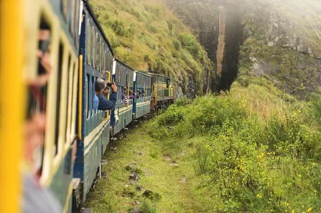

◐

***I TRAVEL TO CHANGE MY VIEW***

Marko walks across the Middle East, thousands of miles from home, touching the foreign civilization of India firsthand.

Crowded places, unfamiliar noises, people and tuk-tuks weaving past — a large truck decorated with white jasmine bathed in golden sunlight. **Yes, this is India.**

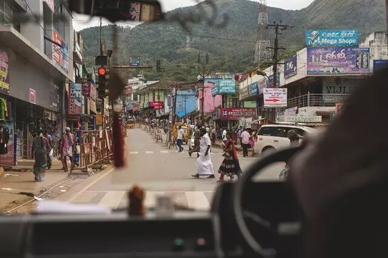

On a humble train, two women sit in their most comfortable postures, each lost in her own thoughts.

**In India, most women lack social standing, but that cannot diminish their kindness and wisdom.** Their clothing is simple yet brilliantly colored. A length of sari wraps around them, revealing the infinite charm of Indian women.

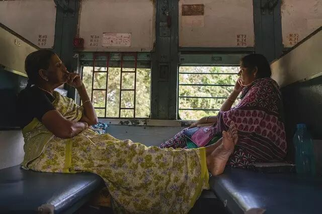

**Overcrowded, dirty, and noisy are not the only labels for India.**

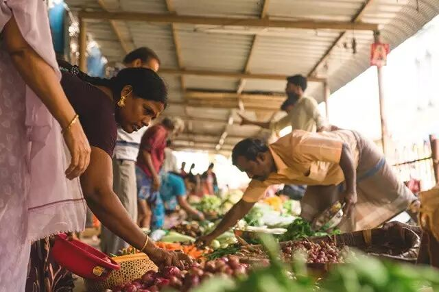

In this country leaning against the Himalayas, ringed by the Indian Ocean, the Bay of Bengal, and the Arabian Sea, there are bustling markets, tranquil nature, and so much beauty forgotten by the world.

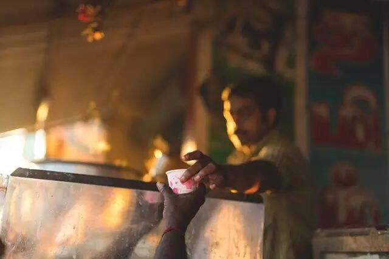

Through Marko's lens, India is bathed in abundant sunlight, its people simple and grounded, its ancient civilization radiating incomparable beauty.

This country has preserved its ancient character. **Poverty does not stop Indians from pursuing a life close to nature. Yes, this is also India.**

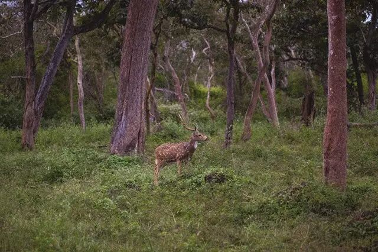

◐

***I TRAVEL FOR THE TASTE***

**Indian food is like a pleasant surprise tucked into ordinary life.** In the occasional savoring, it soothes the restless heart drifting in the breakneck pace of life.

It is not as refined as Western cuisine — it may even look a little rough — but that does not stop it from awakening your taste buds.

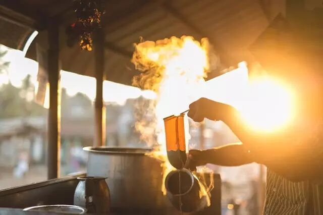

Indian food is utterly distinctive. Indians love to cook with many spices — chili, cloves, fennel, and most commonly, curry powder. If you want me to **describe the taste of India in three words,** I must tell you, **it is impossible.** Different religions, different cultural backgrounds, and vast differences in dietary habits. To immerse himself deeper in the local food culture, Marko stayed with a local host family.

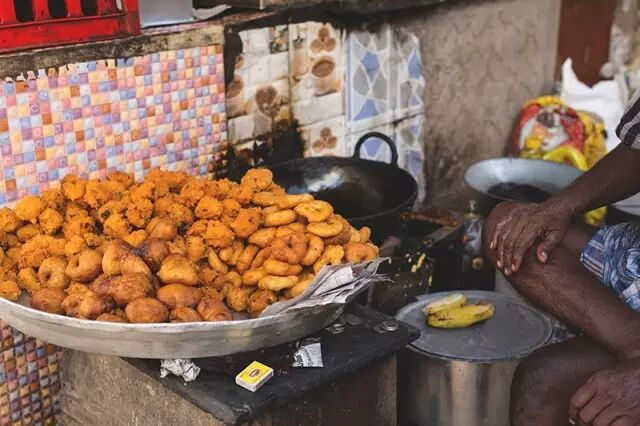

When Indians eat, they generally have one plate and a glass of water. Rice or flatbread is placed on the plate, with vegetables and curry poured on top.

Most Indians eat without knives or forks, rolling the food into wraps with their hands. **The challenge of eating with his hands gave Marko an entirely new understanding and definition of food.**

#

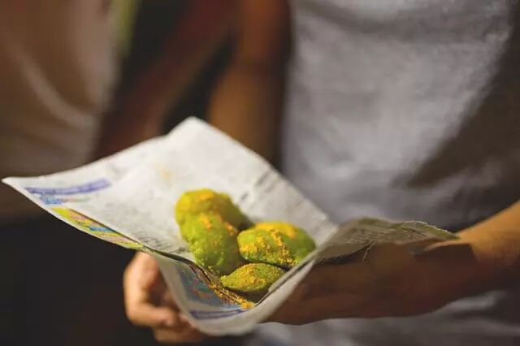

Eating rice with spicy seasonings and vegetables arranged on a banana leaf, using one's hands — this is part of their daily life. But for Marko, **it was a challenge.**

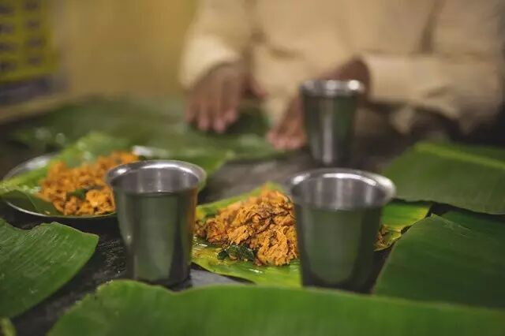

Every morning, Marko and his team would enjoy a large glass of authentic banana lassi and eat several slices of superbly sweet and juicy pineapple.

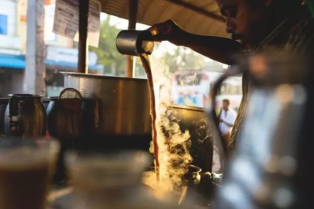

◐

***I TRAVEL TO FEEL ALIVE***

**Travel is about discovering unexpected surprises;** it is about seeing different landscapes, meeting different people, walking on different soil — through calm lakes and misty rain, through years and mountains and rivers — **and still finding yourself.** It is about rediscovering yourself on the road, truly listening to the voice within…

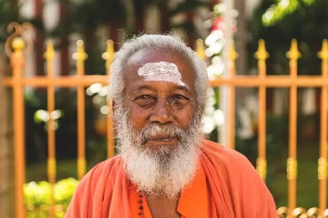

**"Feeling alive" is a very broad expression,** and I believe it carries different meanings for everyone.

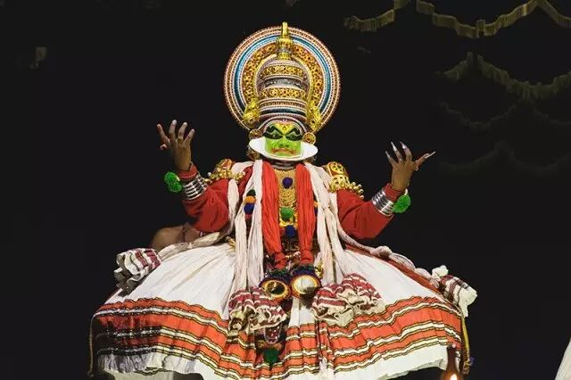

Driving a jeep through a hilly rainforest, until the path narrows at terrifying speed into an even smaller trail — **only then did I feel completely alive.**

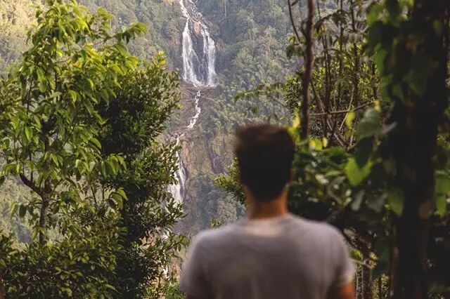

Marko's lens tells you: **the meaning of travel is that the world is so vast,** and there are so many things that can overturn your vision. So you should go and understand, go and learn.

**Don't settle for what others tell you the world is like.**

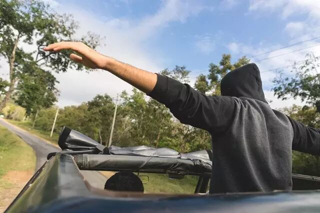

◐

***I TRAVEL TO SEE THE WHOLE PICTURE***

Languages you don't understand, things you don't recognize, customs you don't comprehend, cultures you don't know… **Travel reveals your own ignorance, and the vastness of heaven and earth.**

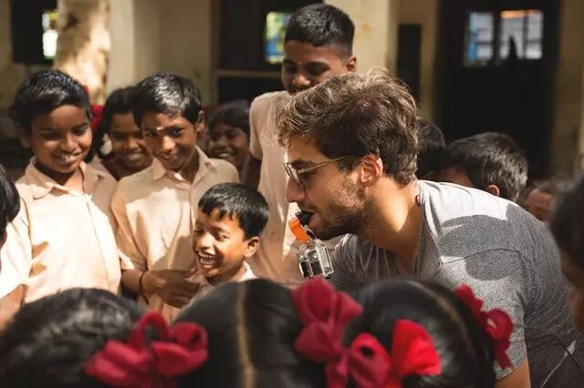

**The bindi is a decoration worn by Indian women and children.** Its colors and shapes vary, carrying different meanings in different contexts.

But in general, it is a symbol of celebration and auspiciousness. It is also a religious symbol, believed to ward off evil and represent joy and good fortune.

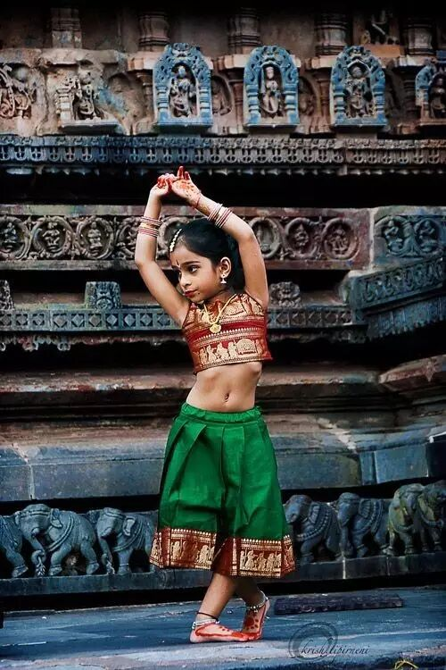

"But still I know there is more to explore."

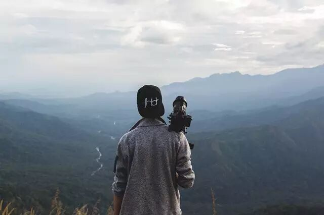

The more I travel, the more determined I am to keep venturing.

**"In truth, the meaning of travel is the better version of ourselves that emerges in unfamiliar air, amid fresh scenery, in those seconds and minutes spent alone with time.**

So, step away from the track of your established life. Give yourself time alone. **Embrace more strangers. Experience the greater possibilities of life."**

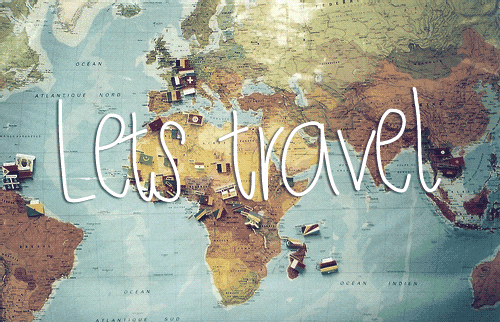

Video / Marko

Writing / V

Editing / Wenyi, Yue

---

**Explore life in your own way. Journey through life at your own pace. Always brave. Always longing for beauty.**

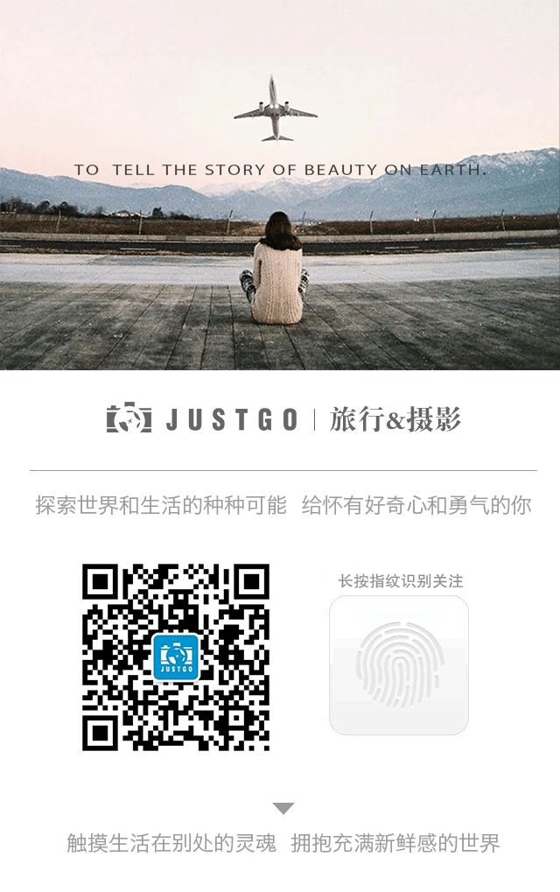