# Jerusalem · Hope Is a Good Thing, and No Good Thing Ever Dies

*Geng Yue · Travel Stories*

Jerusalem is the only city in the world that exists in two dimensions — the heavenly and the earthly.

As a vlogger and traveler, "like rushing toward a miracle, like going to a feast," I felt increasingly the radiant brilliance of joy.

VLOG.

"Hope is a good thing, maybe the best of things,

and no good thing ever dies."

I have also put together a quality travel guide for you.

5,500 words, from the mind and from the heart.

Jerusalem.

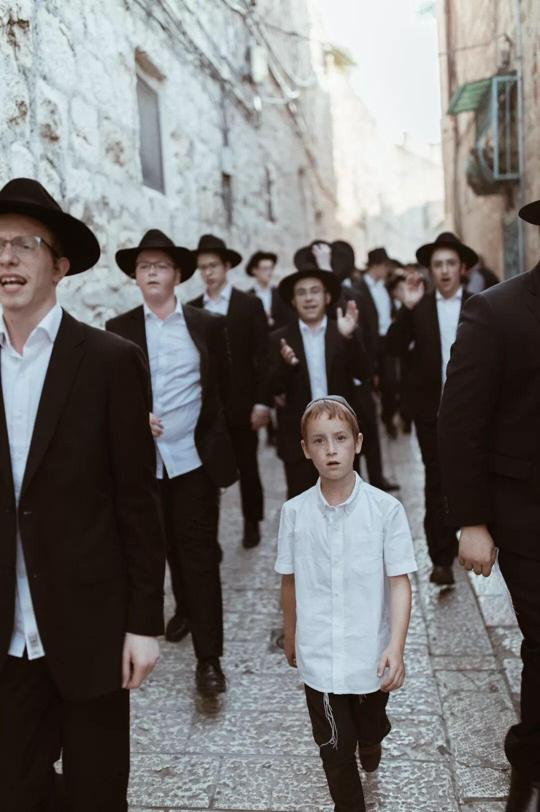

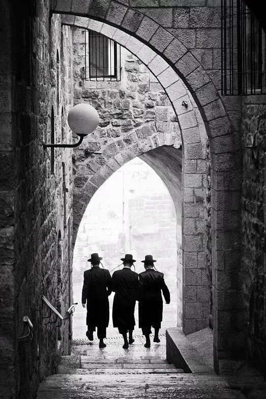

**01. Safe** — Is Israel safe?

**02. Hatikvah** — Books, films, and music

**03. Why Jerusalem** — The city's charm

**04. Travel Plan** — Plan your journey

**05. The Dome of the Rock** — The golden dome

**06. Church of the Holy Sepulcher** — The holiest site

**07. Elementa** — Ki lighting

**08. Western Wall** — The Wailing Wall

**09. Temple Mount** — The sacred plateau

**10. David City** — The ancient city

**11. Local People** — Those who live here

**12. Old City** — The ancient quarter

**13. Ben Yehuda** — The market

**14. Yad Vashem** — The Holocaust memorial

**15. Masada** — The fortress

**16. Dead Sea** — The salt sea

**17. The Sabbath** — The day of rest

**18. Is It Worth It** — The final verdict

**01.**

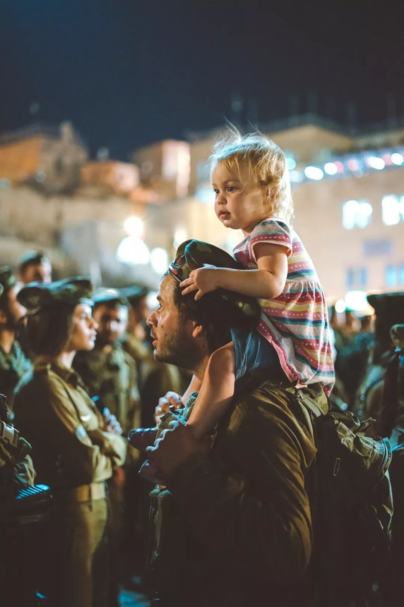

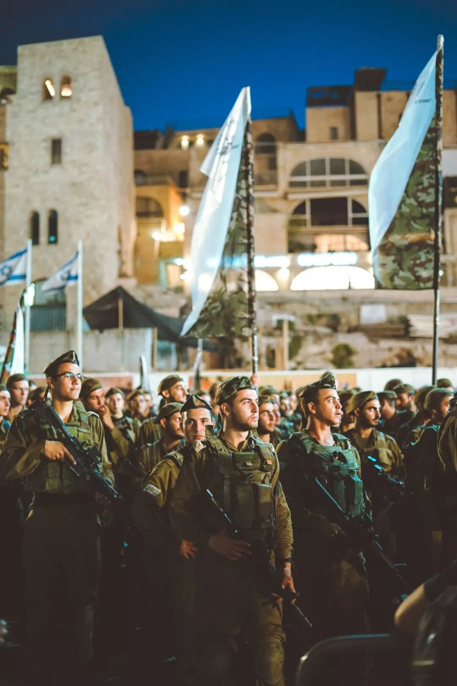

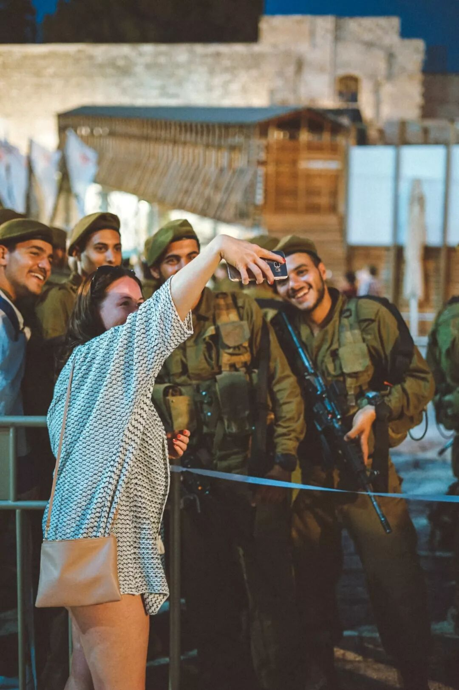

**Safe — Is Israel safe to visit?**

This was the most common question from friends and readers when I announced I was heading to Israel.

Having experienced it firsthand, my honest feeling is that this journey was safe.

More precisely, it depends on the current situation, which can change in the future.

You will frequently encounter armed soldiers patrolling, and you won't feel afraid. You will gradually move from curiosity to being accustomed to this atmosphere.

The labels from stereotypes will dissolve completely.

You will feel the warmth, calm, love, and faith beneath those serious exteriors.

Jerusalem is not cold.

**02.**

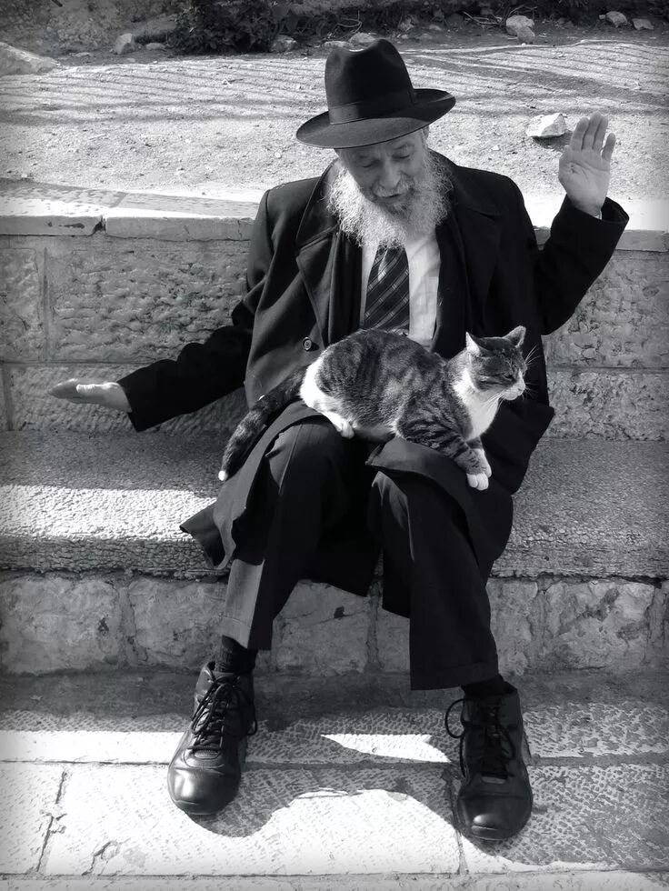

**Hatikvah — Books, Films, and Music**

*Jerusalem: The Biography*, *My Promised Land*, *Israel: A Concise History of a Nation Reborn*, *The Bible*, *The Torah*, *The Talmud*, and other Jewish classics…

These were recommendations I gathered from friends before my trip. All substantial, weighty reads.

When I heard Israel's national anthem, *Hatikvah* (The Hope), on the road, it sang:

"As long as in the heart, within, a Jewish soul still yearns, and onward, towards the East, an eye still gazes toward Zion. Our hope is not yet lost, the hope of two thousand years, to be a free people in our land, the land of Zion and Jerusalem."

And so I settled on the theme for this VLOG. A land that has endured so much suffering — and its national anthem is named Hope.

It has been completely destroyed twice, besieged 23 times, attacked 52 times, captured or recaptured 44 times.

Yet for countless people across thousands of years, it is the Holy City, the center of the world, carrying humanity's eternal hope.

Hope is the most precious medicine. It is the feeling of light breaking through darkness.

**03.**

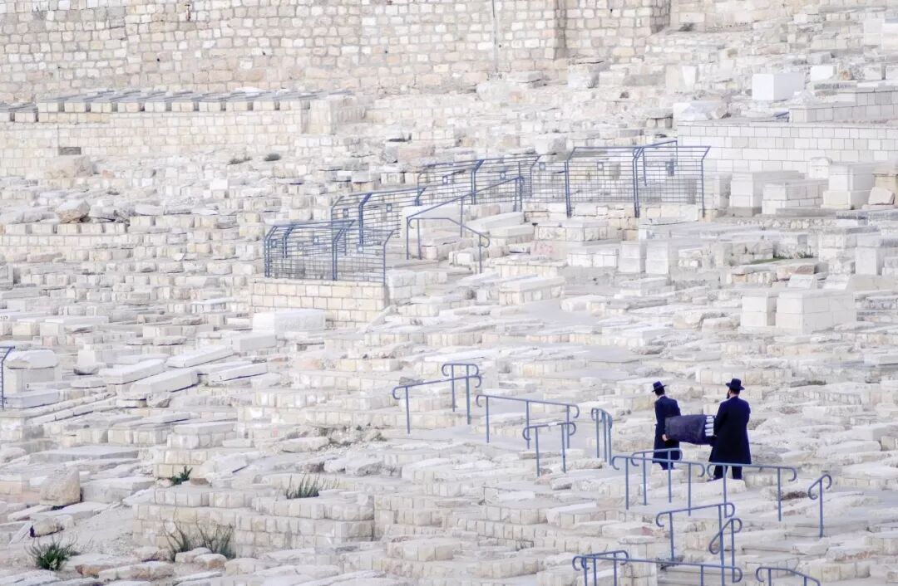

**Why Jerusalem — The City's Charm**

"Jerusalem is a city that belongs to no one, yet it exists in everyone's imagination. This is the tragedy of the city, and also its charm.

**It is the temple of one God, the capital of two peoples, the holy land of three religions. It is also the only city that exists in two dimensions — the heavenly and the earthly.**" — Simon Sebag Montefiore

The one line most people remember is: **"If the world has ten parts of beauty, nine belong to Jerusalem."**

Whether this deeply affectionate declaration from the Talmud is fair to the world's other beauties or not, it cannot erase this city's unique charm.

**04.**

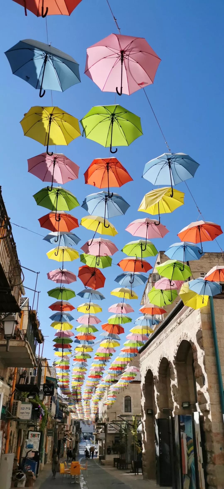

**Travel Plan — Plan Your Journey**

If you want to get a sense of Jerusalem, I recommend at least 4 days — a week would be even better. (This section draws from Lonely Planet.)

**Day 1** — The Old City. Head early to the Mount of Olives, Temple Mount, the Church of the Holy Sepulcher, the Western Wall, and the Via Dolorosa. Remember to find the best hummus restaurant in the Old City.

**Day 2** — I recommend Yad Vashem, the Museum of Zion, the Israel Museum, and the Mahane Yehuda Market (with countless snacks).

**Day 3** — Take a day to explore the Dead Sea, Masada, and the surrounding areas (be sure to wear sunscreen).

**Day 4** — Visit anything you're still curious about. Explore the City of David, visit Mount Zion and the Tower of David. In the evening, attend the sound and light show at the citadel.

We chose to wander through the narrow alleys of the Old City, going wherever our feet took us, feeling the real life of the locals. This photo of the umbrella was captured by chance like that.

(It somehow became the most viewed image I've ever shared — over 3 million views.)

**05.**

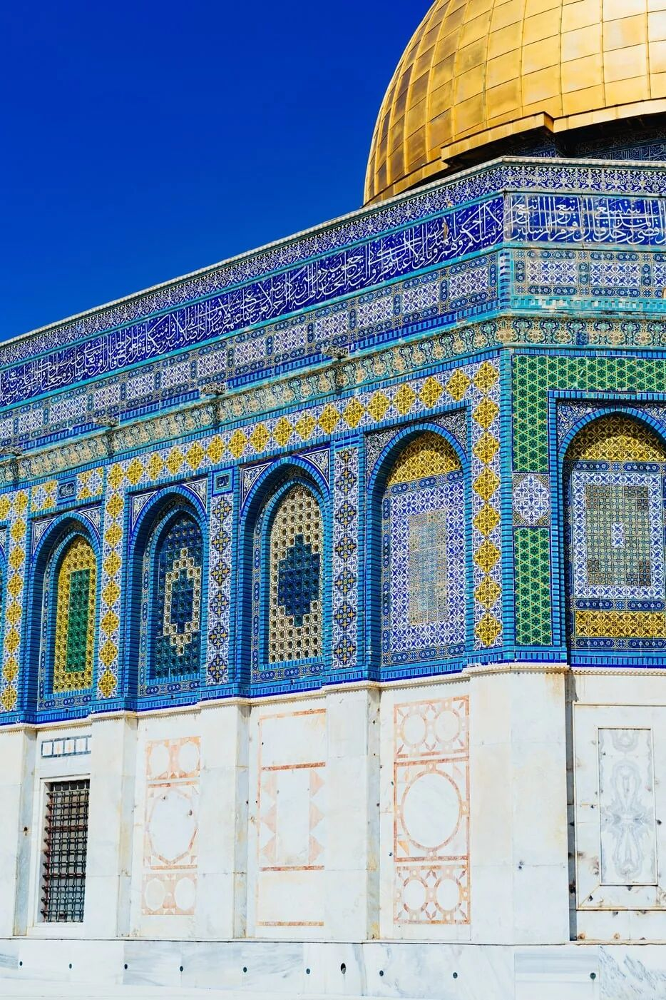

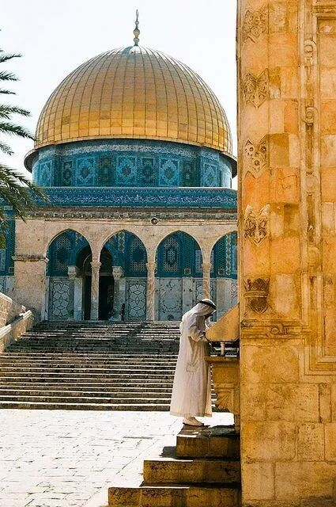

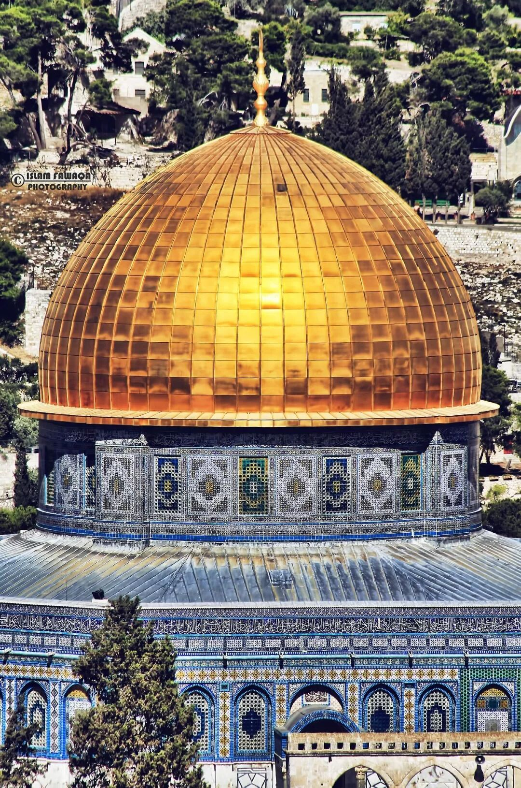

**Dome of the Rock — The Golden Dome**

A jewel among Jerusalem's architectural heritage, famed for its massive foundation stone.

The gleaming golden dome atop its turquoise octagonal base will take your breath away.

Jewish tradition holds that this is the center of the earth. Steps beneath the rock lead to a cave called the Well of Souls, where it is said you can hear the voices of the departed falling into the river of paradise, seeking eternity. Muslims believe this is the site of Muhammad's ascent to heaven.

As for timing, I suggest visiting between 8 a.m. or around 3 p.m. — the daily opening hours are very limited.

**06.**

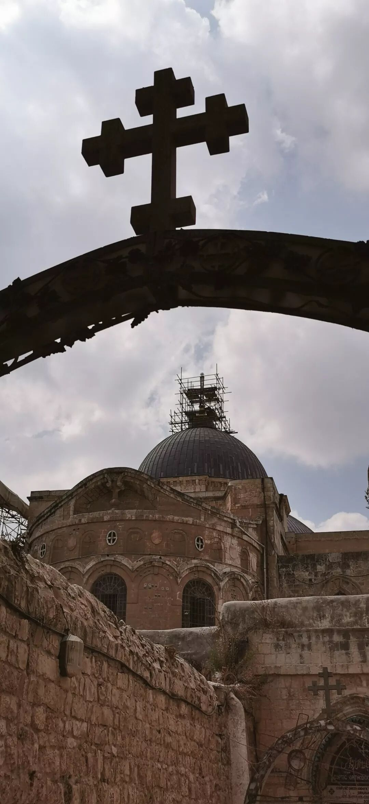

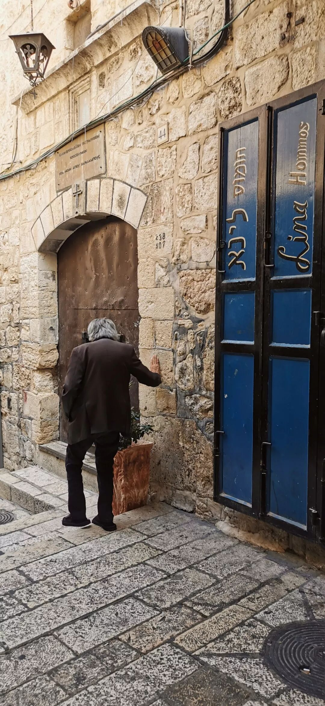

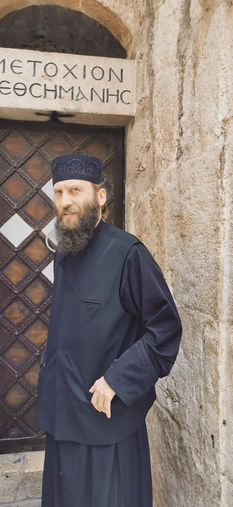

**Via Dolorosa — The Way of Sorrow**

In the narrow alleys of Jerusalem's Old City lies a path known to Christians throughout the world as the "Way of Suffering" —

this is the Via Dolorosa.

Jesus carried the cross along this path to the place of execution, experiencing 14 events along the way — hence the 14 Stations of the Cross. The final 5 events of the Passion took place at the Church of the Holy Sepulcher, making it the last station of the Via Dolorosa.

**07.**

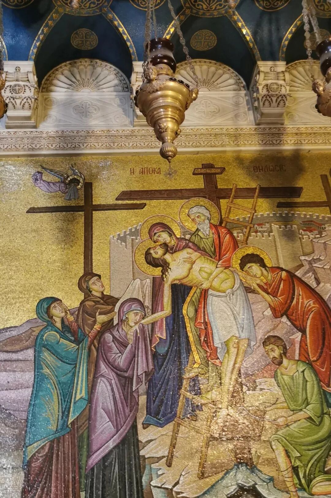

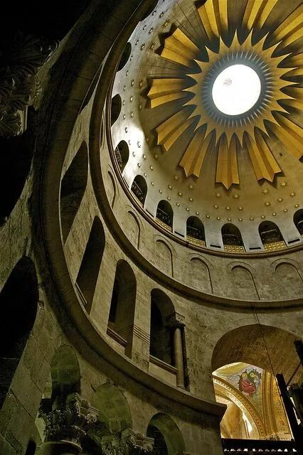

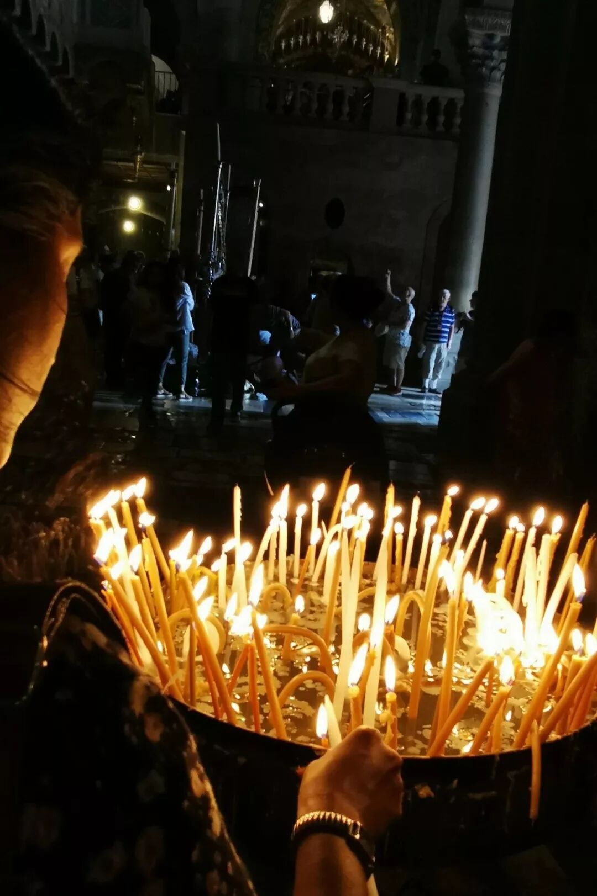

**Church of the Holy Sepulcher — The Holiest Site**

This church is believed by Christians to be the site of Jesus's crucifixion and resurrection as described in the Bible — the most sacred of sites.

The church houses various relics, many of which are treasures Christian pilgrims dream of seeing. Every day, pilgrims come from all over the world, leaving tears, laments, and prayers here.

I recommend allowing at least one hour. Start at the Stone of Anointing and end at the Holy Sepulcher.

**08.**

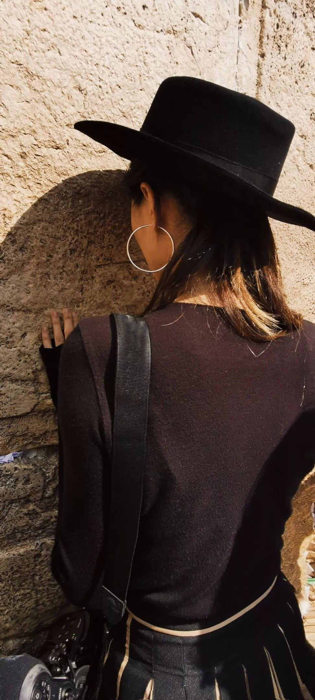

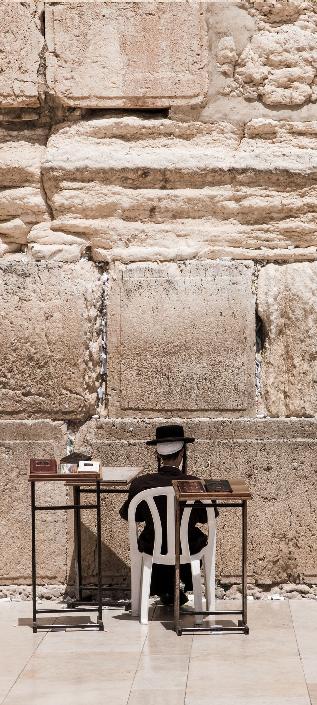

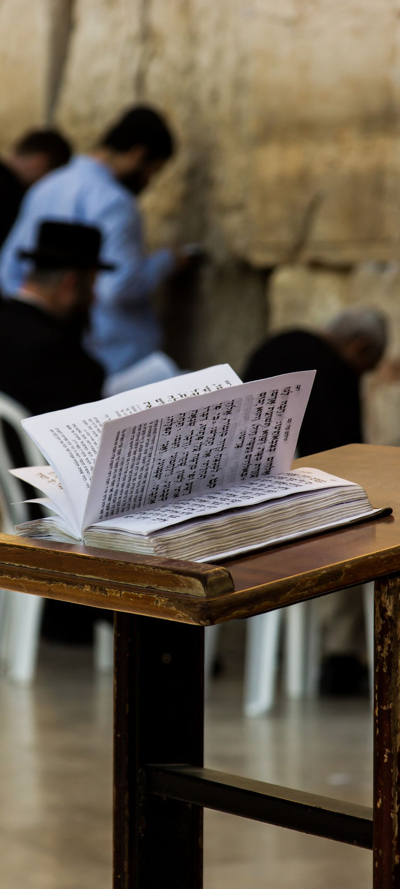

**Western Wall — The Wailing Wall**

In Israel, to some degree, every stone is considered sacred. But for Jews, the most sacred are the stones that form the Western Wall.

The Western Wall is the 2,000-year-old western retaining wall of the Temple Mount, once the site of the Second Temple. Though the Temple was destroyed, the remaining structure and Hebrew texts tell us that the Divine Presence (Shechina) has never abandoned this place.

A Jewish man named Solomon, who had recently immigrated to Israel from Ethiopia, said with tears in his eyes when speaking of his first visit to the Wall: "The first time I touched these stones, it was like the sun rising in the east after a long, dark night."

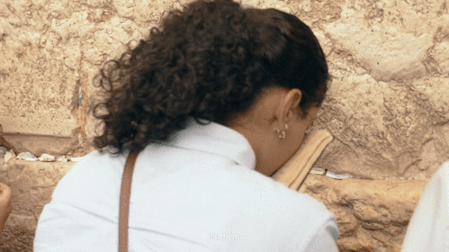

According to Jewish tradition, prayers offered at the Western Wall go straight to heaven. So people who come here write their wishes and prayers on small slips of paper and tuck them into the crevices.

There was a heartwarming news story: believers from all over the world write letters to God, but no one knows where God is. So Jerusalem, "the closest place to God," became God's address.

No matter where in the world a letter is sent from, as long as it is addressed to "God" or "Jesus," nine times out of ten it will arrive at the post office by the Western Wall in Jerusalem.

365 days a year, 24 hours a day, the Western Wall is open to all.

**09.**

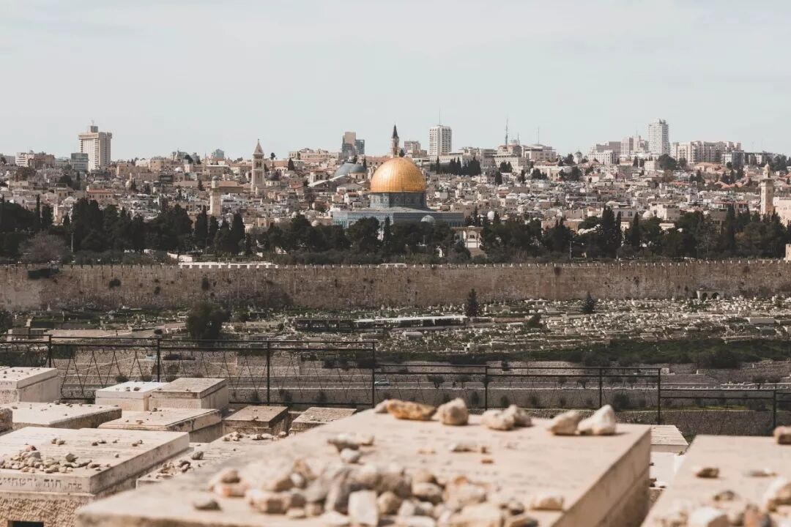

**Temple Mount**

Many people take a panoramic photo of the Dome of the Rock from the Mount of Olives — this is the best vantage point.

Then begin your journey to the Temple Mount.

From the wooden ramp at the Western Wall plaza, you can reach the entrance to the Temple Mount — Bab al-Maghariba (the Moors' Gate).

Passing through, you can see the facade of the Al-Aqsa Mosque (one of the oldest mosques in the world) and the luxurious details of the Dome of the Rock.

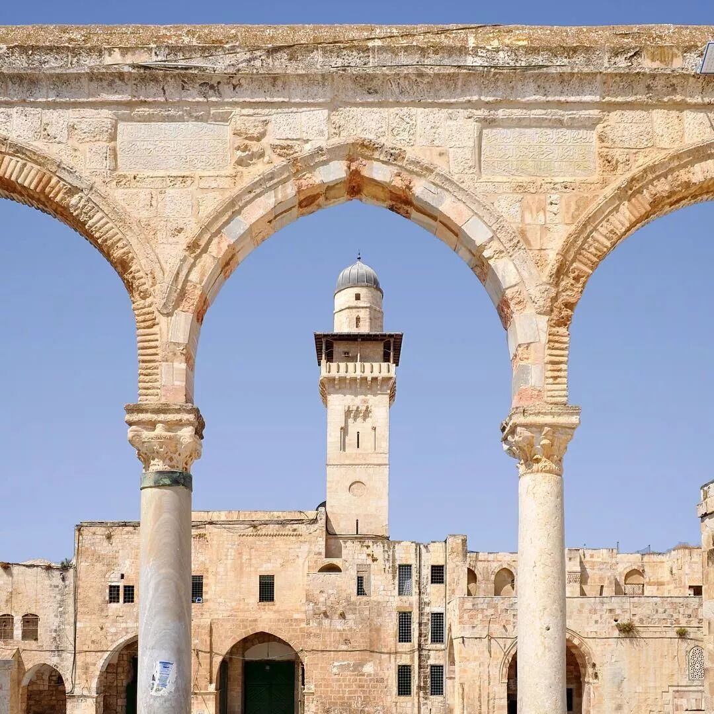

Through the stone archway known as the Scales of Souls, you can see the breathtaking view of the Mount of Olives.

Temple Mount has limited opening hours. In peak summer season, expect queues. Arrive early (gates open at 7:30 a.m.).

A fellow hiker suggests entering through the Jaffa Gate for easier access.

**10.**

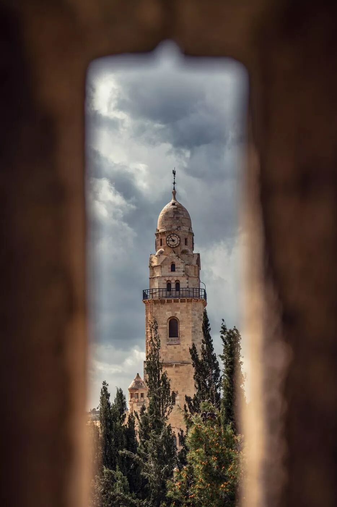

**City of David — The Ancient City**

"When you stroll through Jerusalem, especially in the Old City, it feels like walking through an enormous open-air museum.

Every stone here, every building, has at some point witnessed some of the most profound political events in human history.

History is not only underground — it is also right before your eyes."

As Simon Sebag Montefiore, author of *Jerusalem: The Biography*, said:

Only in Jerusalem do truth and myth become equally important, and myth itself becomes a kind of truth. As you walk its narrow streets, you feel that the past has something to do with you, and you become part of the many myths.

**11.**

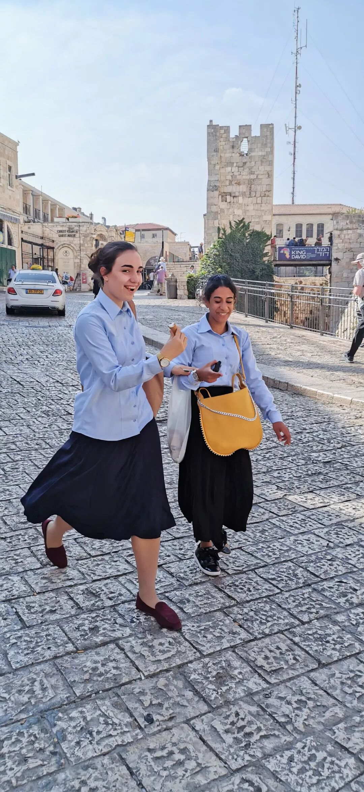

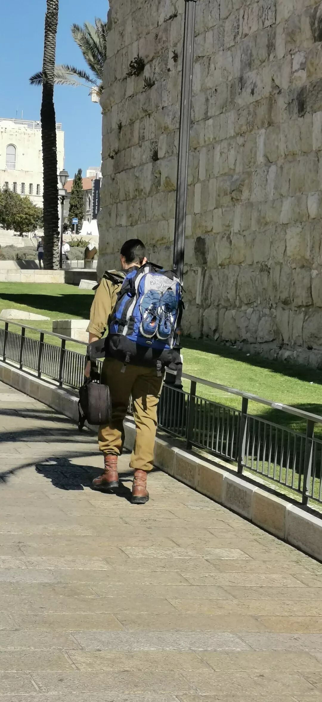

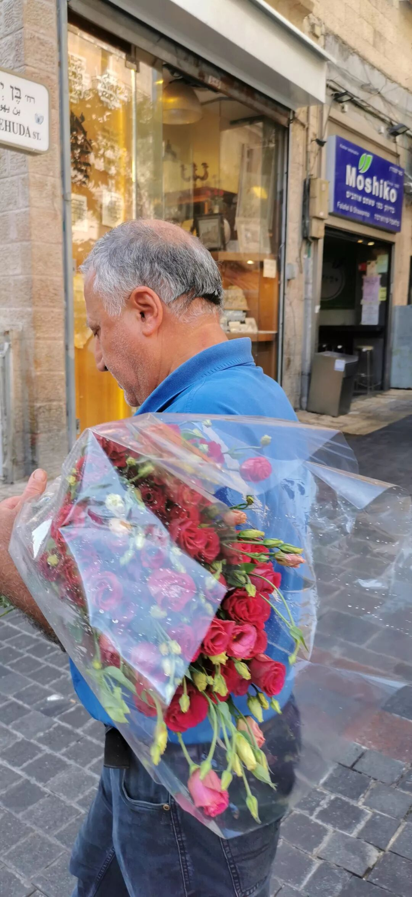

**Local People — Those Who Live Here**

The city's stereotype is one of war, religion, and restraint.

But a schoolgirl passing by with an ice cream and a shy smile, an elderly man holding a bouquet of flowers,

a soldier with a rifle in his right hand and a violin case in his left —

in a single moment, I saw their love for life and their gentleness.

**12.**

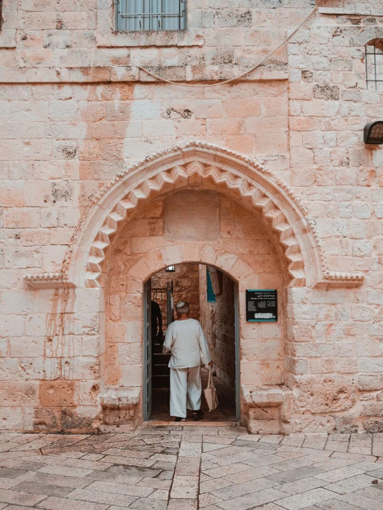

**Old City — The Ancient Quarter**

In the late afternoon, sunlight gilds the ancient stone buildings, and the Old City becomes a feast for the senses. Church bells ring out, the scent of spices and fresh herbs wafts from the markets.

The sound of prayers rises and falls, echoing far into the distance. People walk home through narrow alleyways.

Treading the stone-paved paths of the Old City, ducking into the small shops and stalls on either side, shopping in the markets, exploring the enchanting seasons within the timeless walls.

**13.**

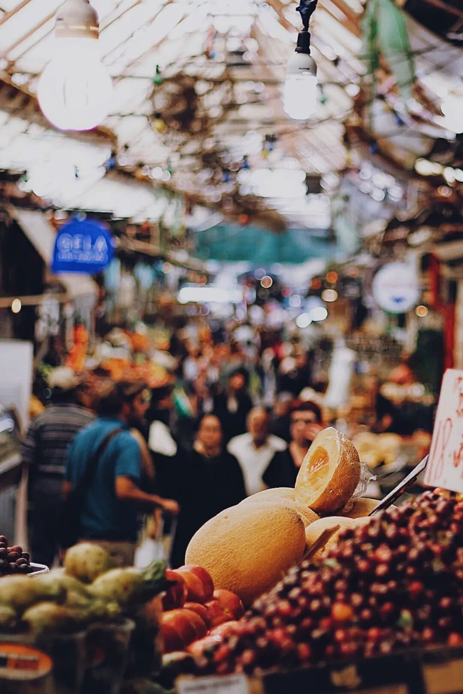

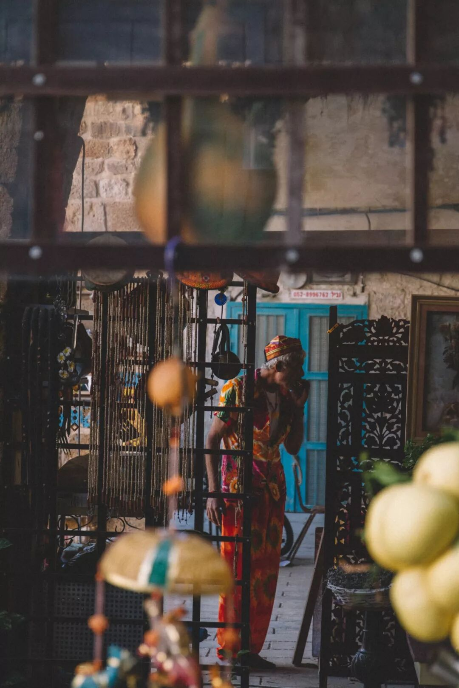

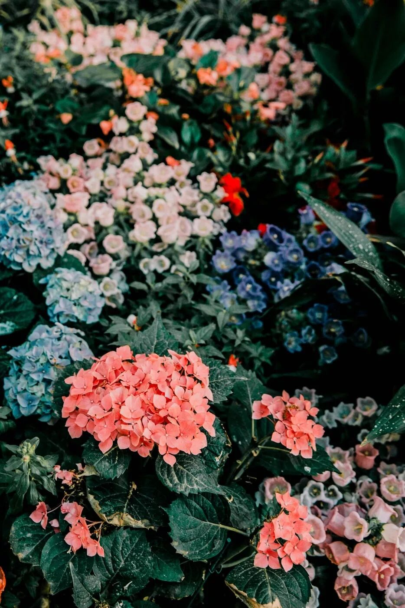

**Ben Yehuda — The Market**

Ben Yehuda Market is the largest market in Jerusalem, once named one of the world's top ten markets by Time Out.

The market is piled high with fresh fruit, olives, nuts, vegetables, spices, tea, cheese, dried fruit, tahini, bread, pastries, coffee…

When night falls, it transforms into a gathering place of restaurants and bars, where local foodies, hipsters, and tourists come together to revel.

Here, you can feel the locals' love for life and the vibrant hum of everyday existence.

**14.**

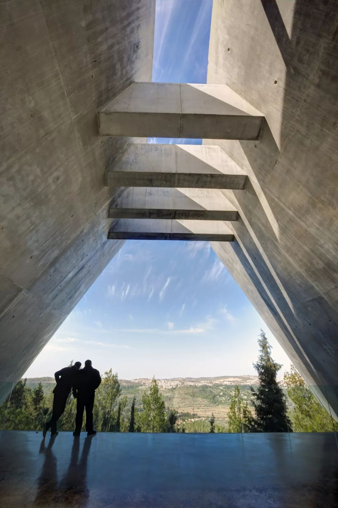

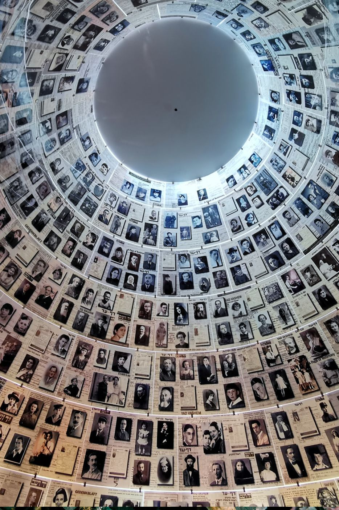

**Yad Vashem — The Holocaust Memorial**

The memorial's original name, Yad Vashem, comes from the Bible: "I will give them, in my house and within my walls, a memorial and a name… I will give them an everlasting name that shall not be cut off."

Here, I experienced a profound heartbreak.

The Holocaust nearly halved the world's Jewish population. This memorial meticulously preserves film archives, personal testimony videos, photographs, and installation art, recorded from the Jewish perspective, dedicated to the six million Jews who perished at the hands of the Nazis.

It is a sobering, deeply moving, but also beautiful, inspiring, and powerful museum.

**15.**

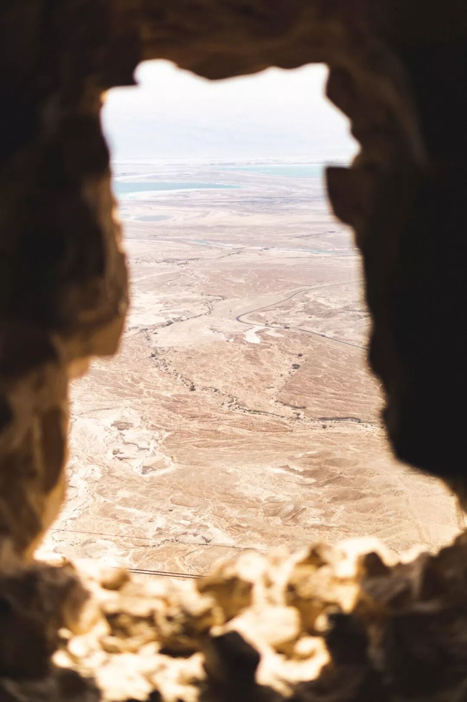

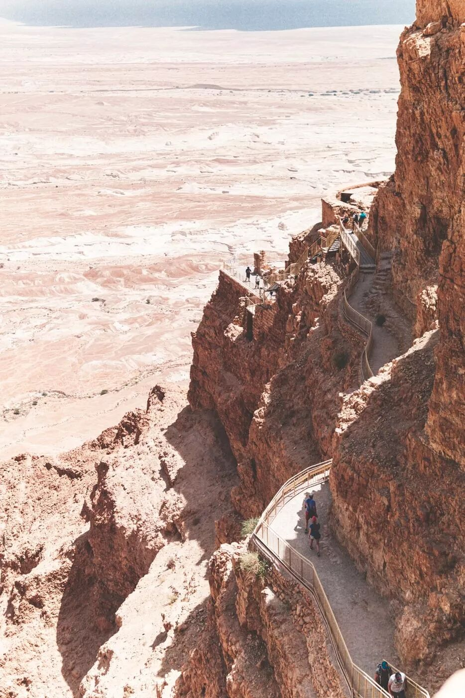

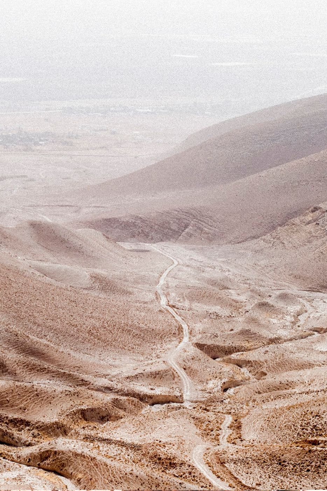

**Masada — The Fortress**

Two thousand years ago, after the death of King Herod, a nationwide Jewish uprising against the Romans erupted in Israel.

Cut off on a sheer cliff, with no rescue in sight, the Jews held firm at Masada, their last fortress stronghold. Besieged by a massive Roman army and subjected to continuous attacks, outnumbered and outmatched, they held on for three grueling years. Over a thousand days and nights.

On the eve of the fortress's fall, all 967 men, women, and children unanimously decided to commit mass suicide. They burned the palace and their homes.

In their final speech before martyrdom, they declared: **"We would rather die as free men than live as slaves!"**

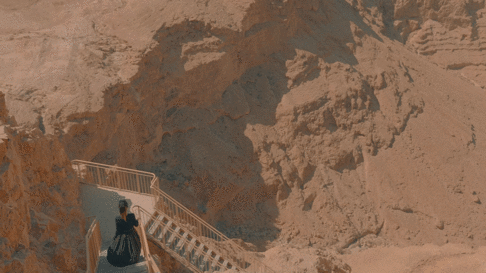

The fearlessness and perseverance of Masada shook the world. It is the ultimate testament to the strength of the human spirit.

It is sacred ground in the hearts of Jews, a symbol of the ancient Jewish kingdom. **"Masada shall never fall again!"**

It is the pillar of the Hebrew spirit and will.

For those interested in the history, I recommend watching some related videos. For travelers, this environment is a serious test of willpower. Bring sunscreen, drink plenty of water, and wear comfortable shoes.

**16.**

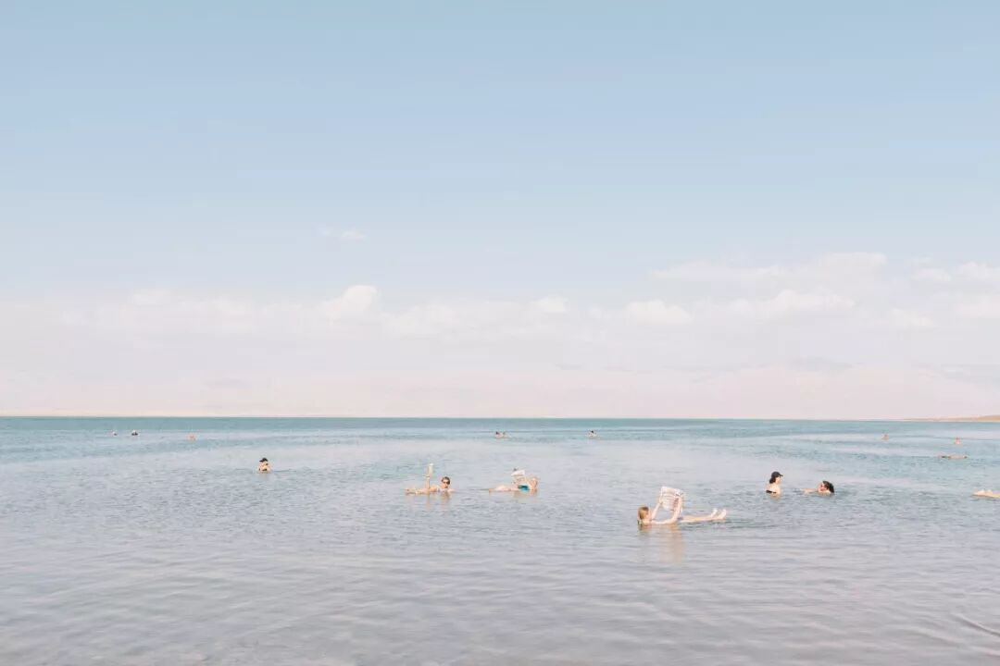

**Dead Sea — The Salt Sea**

Masada and the Dead Sea are not far apart — you can arrange to visit the Dead Sea in the afternoon.

Floating in the Dead Sea is a wondrous experience.

But when you walk into the Dead Sea, the crystals on the shore and underwater are abundant, rough, and some are quite sharp. You need to be careful.

Don't get cut. And if you have any wounds on your body, try not to go in — otherwise… it really hurts.

**17.**

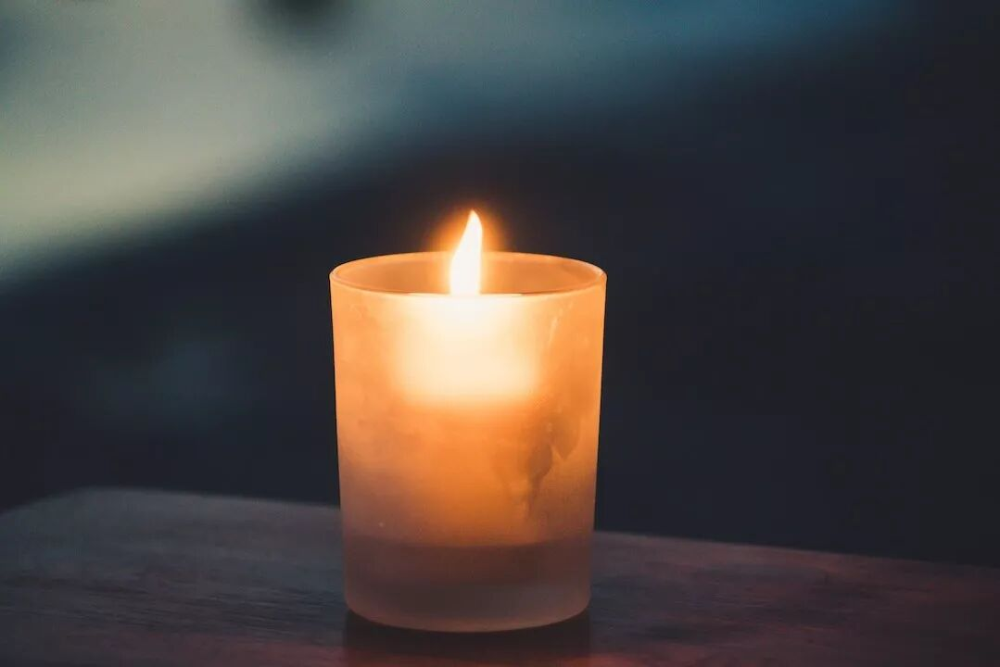

**The Sabbath — The Day of Rest**

Thirty-six minutes before sunset on Friday, you can hear the wail of sirens echoing over the hills of Jerusalem.

This marks the beginning of the Sabbath, accompanied by an ethereal atmosphere that settles over the entire city.

We experienced the Sabbath in a local family's home — the specific atmosphere can be felt in the VLOG.

Just a few songs' worth of time, yet I felt a tangible, simple happiness.

Between friends, within communities, among family. God created the world in six days, and on the seventh day, the Sabbath, He rested.

People do nothing — they use this time to connect with themselves,

to believe in their inner potential, to let their minds reorganize,

to create something new.

A room filled with singing. An ordinary-looking crowd of locals made me feel completely at ease.

Even sitting among a bustling crowd, there is ordinary love, quiet faith, two hours that are useless yet deeply important to oneself.

**18.**

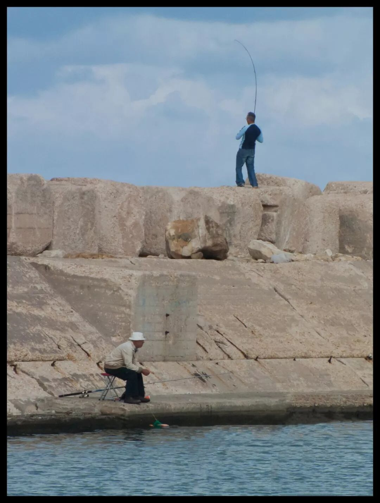

**Is It Worth It — The Final Verdict**

At first, I read a line saying that for many travelers, the affliction is "Jerusalem Syndrome" — a psychosis composed of expectation, disappointment, and hallucination.

But after experiencing it, I want to say that Israel is a journey that surpasses imagination. There are plenty of beautiful sights and delicious foods in this world, but having been to Jerusalem versus not having been — these are two completely different things. It is a journey that changes the dimension of your understanding.

Personally, I believe it is one of the things worth experiencing in a lifetime.

JUSTGO.

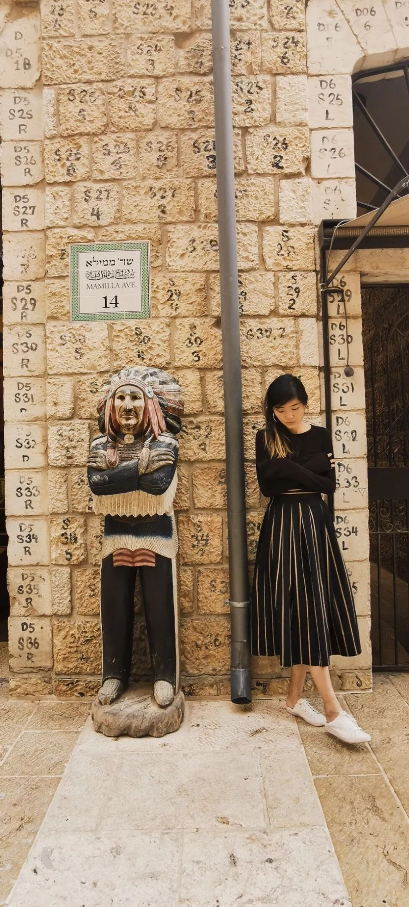

**01 Passport** — Visa

**02 Security Check** — Airport security

**03 Photo Solutions** — Photography tips

**04 Other Tips** — Practical advice

**01.**

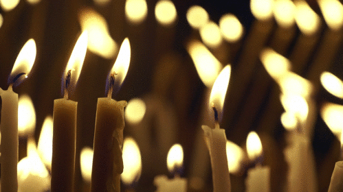

**Passport — Visa and Israeli Stamps**

Some friends worry that having Israeli entry and exit stamps in their passport will affect entry to other Arab countries.

The solution: Israel no longer stamps passports. Instead, they issue a loose-leaf entry card — don't lose it, as it is your only legal proof of being in Israel.

Lonely Planet's view: Egypt and Jordan, which have signed peace treaties with Israel, have no issues with allowing entry. This policy also applies to Turkey, Tunisia, Morocco, many Gulf emirates, as well as Malaysia and Indonesia.

Another suggestion from online sources: Israel now offers a ten-year travel visa for Chinese tourists. If it's your first time, you might get a single-entry or double-entry visa first.

That way, if you want to visit other countries, with a double-entry visa you can visit the other country first, then re-enter Israel.

Or go before renewing your passport.

**02.**

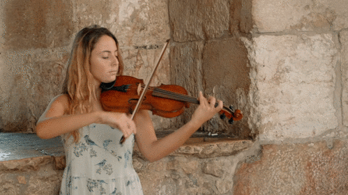

**Airport — Arrival Time**

I strongly recommend arriving at least four hours early, because the security checks are extremely thorough.

Israeli security questioning is a unique process. Several officers will conduct it.

The questions are very detailed but not tricky — they basically revolve around: What is the purpose of your trip to Israel? Who are you traveling with, how many people? What is your main job? Source of income? They will also ask what you packed in your luggage.

Nothing special — just answer honestly, sincerely, and patiently. I felt I got through after answering only a few questions.

The "small room": But just before boarding, a fellow female traveler and I were called into a secondary screening room. Because I had a case with camera equipment, everything was opened one by one, examined with the meticulousness of a biochemistry lab — tiny screws and bits of paper were tested with透视 analysis technology.

Also, remember not to lock your suitcase when checking in luggage.

**03.**

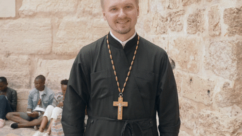

**Photo Solutions — Photography Tips**

This is worth mentioning for photographers.

My previous experience in Morocco taught me that many people with religious beliefs think that taking their photo steals a part of their soul. They will refuse when you raise your camera. Many great shots are regrettably missed.

So, when photographing these believers, it's better to be discreet. Don't be too conspicuous.

But from my experience this time, when you communicate sincerely, many locals will smile warmly and comfortably at the camera. (Like this gentleman outside the Church of the Holy Sepulcher.)

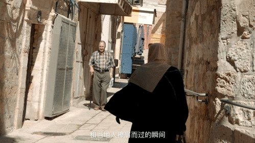

Before departure, I prepared two approaches. Quite straightforward.

A — For video, I used only one camera with a microphone — very lightweight, no bulky stabilizers or eye-catching equipment. But I tried to keep my hand as steady as possible.

B — For photos, I abandoned my professional camera and used only a phone.

When walking quickly, I pressed the shutter for a few seconds of candid shots — no one noticed at all. It was effortless and natural, and sharing was convenient too.

**04.**

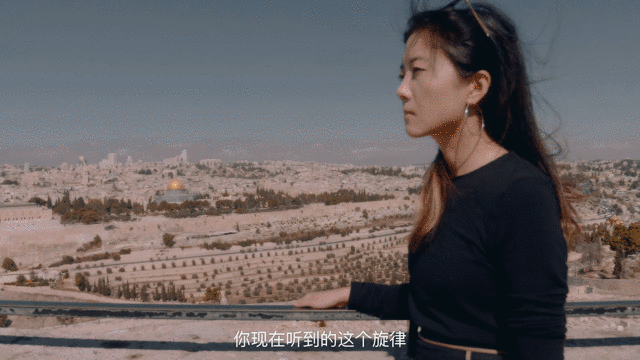

**Other Tips — Practical Advice**

When to go: July–August (peak season) — warm weather. Tel Aviv can be muggy, the Dead Sea scorching. Hotel prices soar and rooms are scarce. Passover, Rosh Hashanah, and Sukkot are peak periods.

December–February (low season) — milder weather. Local travel demand is high during Rosh Hashanah and Sukkot. The remaining months are shoulder season.

Language: Hebrew is the national language, with Arabic as an official language. English is widely spoken.

Time difference: 6 hours behind Beijing time.

Shop hours: Most shops are closed on Saturdays. Generally open Sunday–Thursday, 9:00 a.m. – 7:00 p.m. On Fridays and the eve of major Jewish holidays, shops open in the morning but close earlier in the afternoon.

Accommodation: Hotels in Israel range from luxurious to simple. We stayed at the Arthur Hotel in Jerusalem, on Zion Square. It was convenient for walking to various parts of the city.

A friendly tip: bring earplugs. The call to prayer in some Muslim neighborhoods can disturb light sleepers.

Other nearby destinations: Tel Aviv, Haifa, the Sea of Galilee, Nazareth, Bethlehem, the Dead Sea, the Old City of Jaffa, and more.

Best festivals: Israel Independence Day (April/May), Israel Festival (June), Pride Parade (June), Safed Klezmer Festival (August), Red Sea Jazz Festival (August).

**© JUSTGO Production — Vlogger & Content Creator | Geng Yue**

In addition to my original content, some written material references and excerpts are from *Lonely Planet: Israel & the Palestinian Territories*; a Zhihu Live by Chalffy: "Your First Trip to Israel — How to Plan?"; *A Tale of Love and Darkness* by Amos Oz; and *The Land of Freedom and Love*. Some images are curated from free international stock photo libraries.

❤ **Thanks to the Israel Ministry of Tourism and Tencent Travel**

In this winter of 2019, I hope this article brings you a sense of faith.

I think of Rilke's *Letters to a Young Poet*:

**"May you have enough patience to endure, and enough heart to believe."**