# 到灯塔去

*Geng Yue · Travel Stories*

今天的故事是灯塔。

原本的标题是"世界的100座灯塔"，

我们精选了一部分，带你去那些不易抵达的天涯海角，看一看遗世独立，远离繁华与尘嚣的灯塔。

如果一百座灯塔，未来能去到哪怕一半，即可纪念你已真正环游过这个世界。

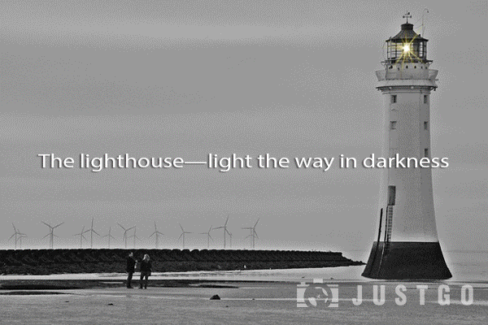

每个人，心里都有一座自己的灯塔，也许只有在逆境里，才能清楚的看到它。

就像只有在黑夜里，你才能看到灯塔的微光。

今天，是个收到鼓励的日子，在文末我有写一封短信。而现在，我们来先聊聊灯塔。

**迷雾里的星辰，深海中的灯塔，愿可以温暖你整个漫长的冬夜。▼**

王家卫的电影里，很喜欢《春光乍泻》。

"听说那儿有个灯塔，失恋的人都喜欢去，说把不开心的东西留下。"

世界尽头的灯塔，伊瓜苏大瀑布，如果有一天我能够以梦为马浪迹天涯，如果有一天我也站在瀑布下，我希望，是两个人站在那里。

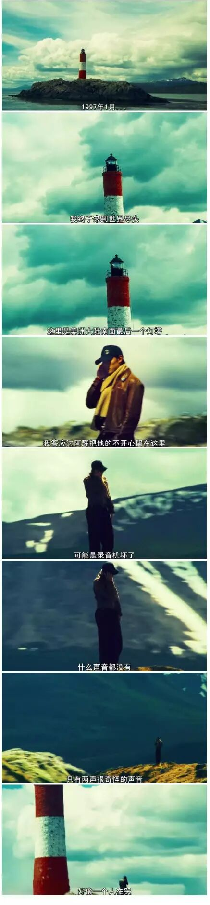

"往南走，去一个叫乌斯怀亚的地方。"

"那么冷，去干什么？"

"听说那里是世界的尽头，很想去看一看。"

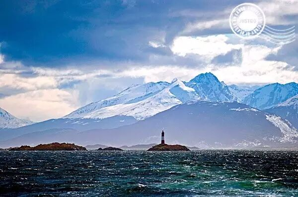

《春光乍泄》中那座位于阿根廷乌斯怀亚港 (Faro lesÉclaireurs, Ushuaia) 南美大陆最南端的灯塔，是去往南极的必经之路，也是传说中世界的尽头。

**▼**

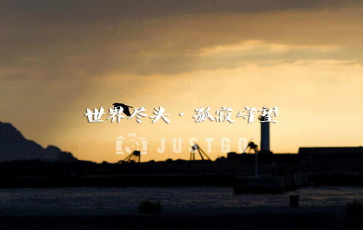

它是弗吉尼亚·伍尔夫笔下的灵魂之光的象征；

它是《禁闭岛》中精神海洋夜航的分叉口；

它是水手们安心的存在；

它是**灯塔**。

它最初作为港口的入口标志，18世纪逐渐发展成暗礁和海岬的警报信号，成为航海人的指明路灯。

**▼**

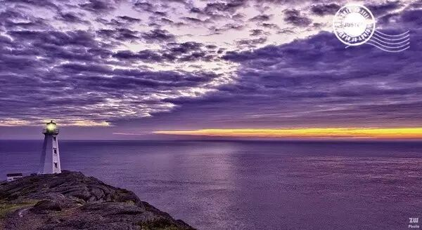

圣约翰斯 (St. John's), 纽芬兰－拉布拉多省，加拿大。位于加拿大的最东端，终年守候一望无际的大西洋。

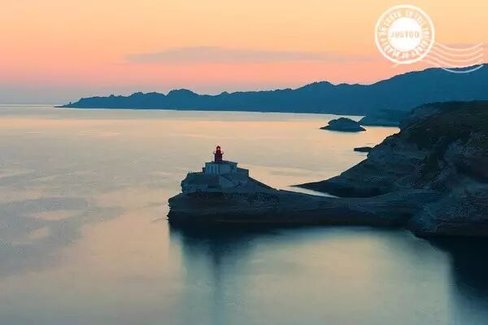

博尼法乔，科西嘉岛 (Bonifacio, Corsica), 法国。拿破仑的故乡，地中海的一抹亮色。从这里望过去，能看到对面广场上拿破仑的塑像。

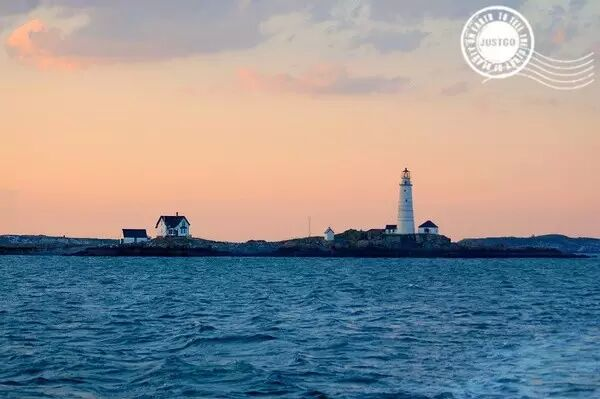

波士顿港口灯塔，小布鲁斯特岛 (Boston Harbor Lighthouse, Little Brewster Island in outer Boston Harbor), 马萨诸塞州。美国的第一座灯塔，曾数次被毁，1873年重建，也是美国境内唯一有人守望的灯塔。

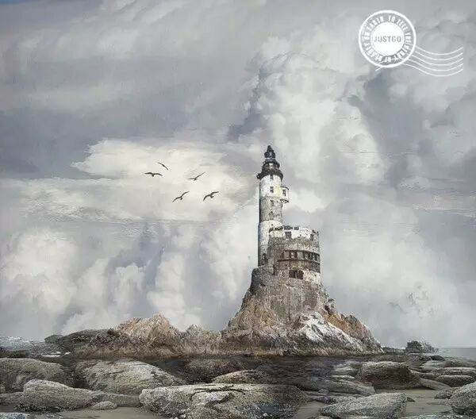

阿尼瓦灯塔 (Aniva lighthouse), 库页岛, 俄罗斯。

这里原先是个流放之地，现在无人居住。这座曾经在俄日边境有着重要军事地位的灯塔，如今被看成世界上最神秘的被遗弃的灯塔之一。

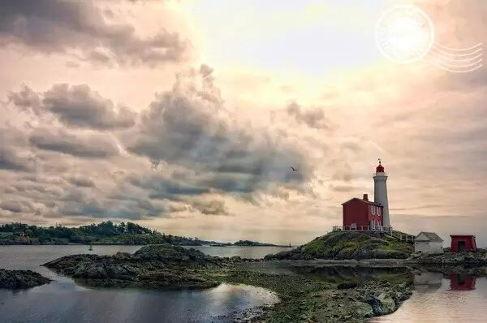

费斯嘉灯塔 (Fisgard Lighthouse), 维多利亚，英属哥伦比亚省，加拿大。费斯嘉灯塔是加拿大西海岸第一座灯塔，1958年列为加拿大国家古迹。

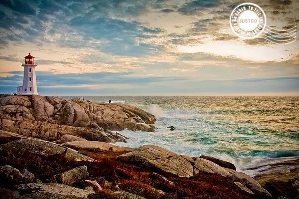

佩姬湾 (Peggy's Cove), 新斯科舍省, 加拿大。屹立在被冰川切削形成的海岸线浮石上，加拿大最美丽的灯塔，也是电影《花水木》中的灯塔。据说现在有建议拆掉佩姬湾灯塔而建一座更现代的建筑。

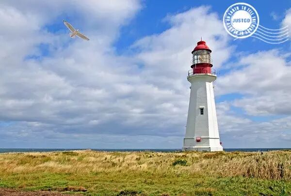

悉尼 (Sydney), 新斯科舍省, 加拿大。记得去看草原上的灯塔，或许之后草原一片广阔，只剩下残存的塔基记载时间的流逝。

**"在码头尽处灯塔的塔灯在晨雾中浮现，一座小小的，被遗弃的灯塔，和我记忆中的一样忠贞不渝。"——马克·李维《偷影子的人》▼**

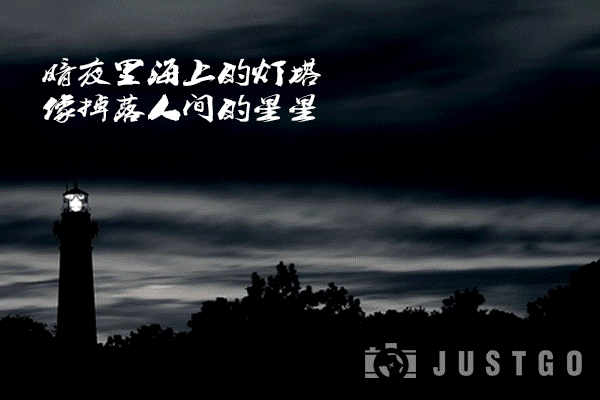

**人生的路漫长而多彩，就像在天边的大海上航行，有时会风平浪静，行驶顺利；而有时却会是惊涛骇浪，行驶艰难。但只要我们心中的灯塔不熄灭，就能沿着自己的航线继续航行。——鲁迅《朝花夕拾》▼**

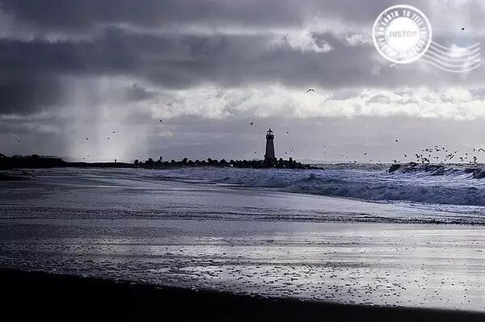

圣克鲁兹 (Santa Cruz), 加利福尼亚州，美国。加州海岸，被人忽略的冬天，却透着动人的苍茫之美。

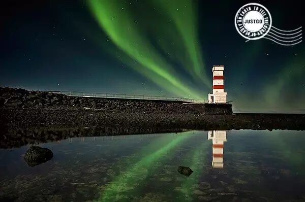

Gerÿar, Gullbringusysla, 冰岛。北国之光。极光映衬下的灯塔。

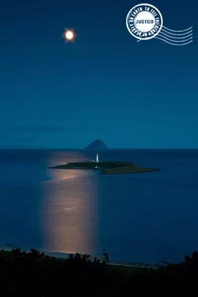

Pladda lighthouse, Pladda Island, 艾伦岛, 苏格兰。相对而言，苏格兰算是英国比较荒凉的一片土地，而正是在这种荒凉之下，我们才得以欣赏一座灯塔的静谧。

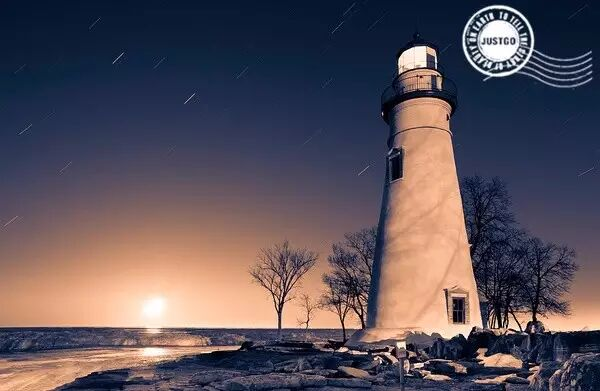

马布尔黑德灯塔 (Marblehead Lighthouse), 俄亥俄州，美国。美国五大湖历史最永久的灯塔。

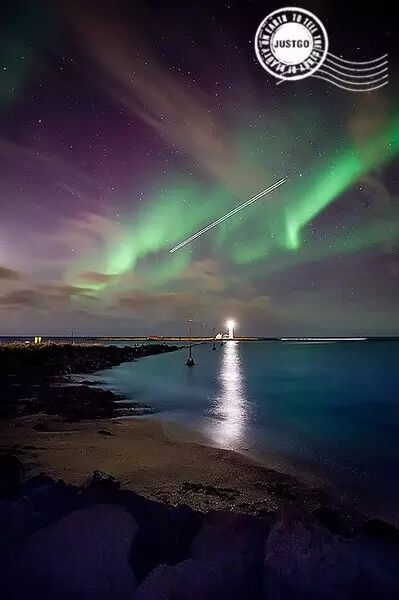

塞尔蒂亚纳内斯灯塔 (Seltjarnarnes, Gullbringusysla), 冰岛。极光中的灯塔，有种恍如隔世的美。

**▼**

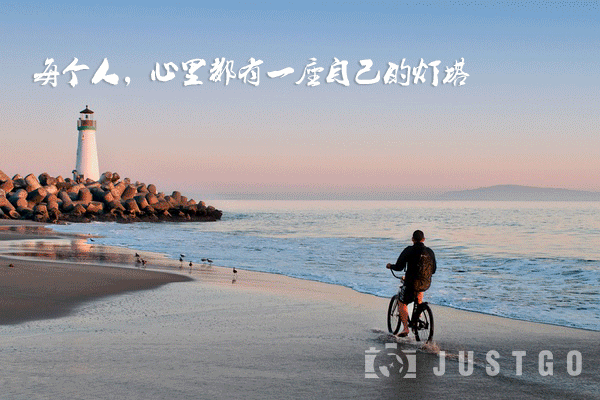

**梦想就像星星，我们永远到不了那里，但是又像灯塔一样，我们用它指引航向。——胡鳕《灵魂之门》▼**

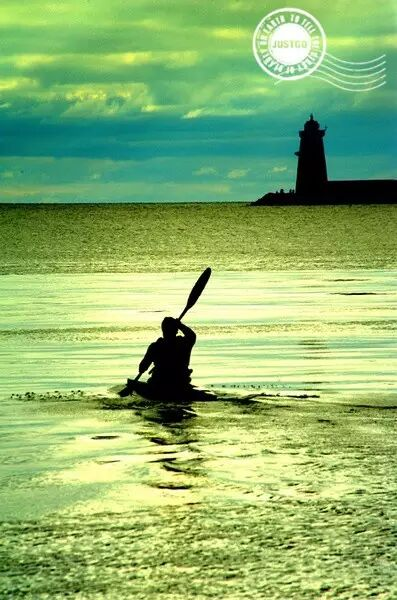

Bull island, 都柏林, 爱尔兰。划向世界的尽头。

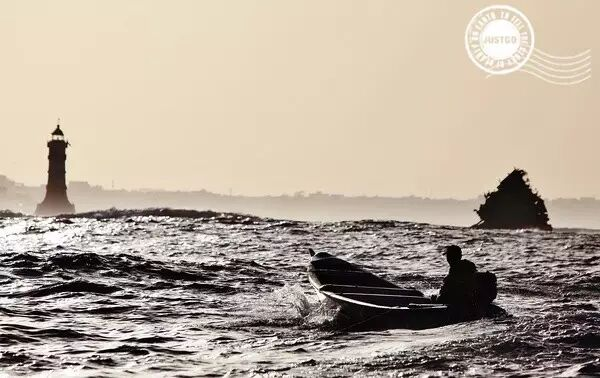

达喀尔，塞内加尔。这里不仅只是从欧洲到非洲，世界上最艰难的汽车拉力赛的终点。

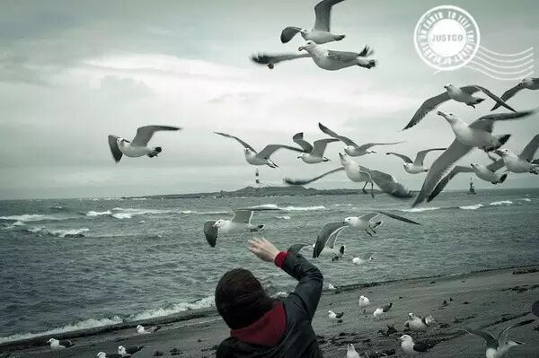

大間崎灯台, 大間町, 青森县, 本州，日本。在这里，可以看到太平洋的日出和日本海的日落。

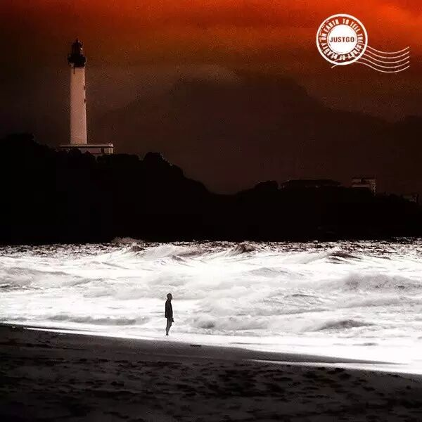

卡普费雷灯塔 (Phare du Cap Ferret, Pyrenees-Atlantiques), 阿基坦, 法国。卡普费雷灯塔高52米，红白相间，是360度欣赏大西洋的绝佳之地。

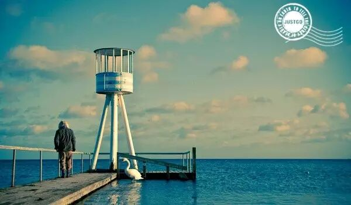

贝尔维尤海滩 (Bellevue Beach), 哥本哈根，丹麦。老人，天鹅，大海和灯塔，童话王国的写意和舒适。

**▼**

弗吉尼亚·伍尔芙在《到灯塔去》中写道，"她面对着一望无际的蔚蓝色的大海；那灰白色的灯塔，矗立在远处朦胧的烟光雾色之中；在右边，视力所及之处，是那披覆着野草的绿色沙丘，它在海水的激荡下渐渐崩塌，形成一道道柔和、低回的皱折；那夹带泥沙的海水，好像不停地向杳无人烟仙乡梦国奔流。"

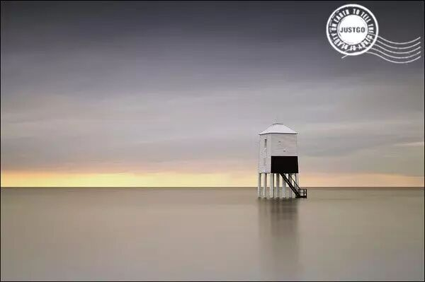

滨海伯纳姆灯塔 (Burnham-on-Sea lighthouse), 萨默赛特，英格兰。长腿上的灯塔，在长曝光下的水面。

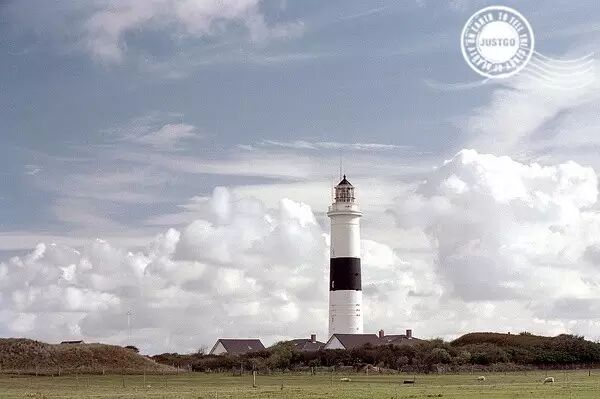

砍彭灯塔，舒尔特岛 (Kampen lighthouse, Sylt, Schleswig-Holstein), 德国。这座灯塔位于德国国境之北Sylt岛上，白色圆锥型的石塔绕上一圈黑带，古典而优雅。

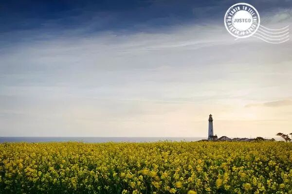

鸽点灯塔，圣马特奥郡 (Pigeon Point Lighthouse, San Mateo County), 加利福尼亚州，美国。美国西海岸上最高的灯塔。

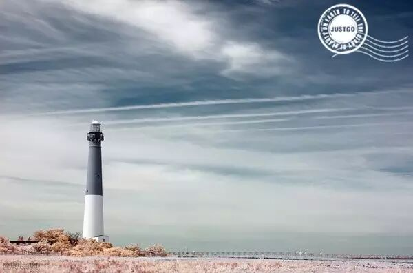

巴尼加特灯塔 (Barnegat Lighthouse), 新泽西州，美国。始建于1835年，经过四次增高之后，从最初的十二米到现在的五十米，是新泽西州非常出名的灯塔。

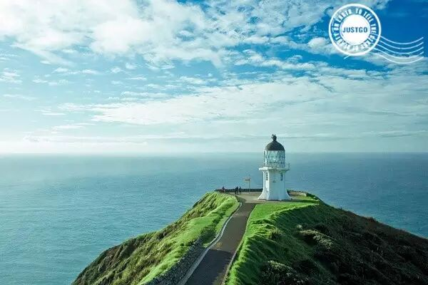

雷因格海角灯塔 (Lighthouse at Cape Reinga), 岛屿湾和北部地区，新西兰。往北走，就是北岛的尽头，新西兰最北的灯塔。在这里，塔斯曼海与太平洋交汇。而毛利人的传说也赋予了这座灯塔指引圣灵的特殊意义。

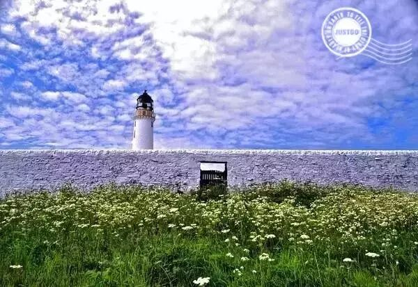

Mull of Galloway lighthouse, Drummore，苏格兰。它的最南方，推开门，走上灯塔，你可以眺望到爱尔兰海另一边的贝尔法斯特。

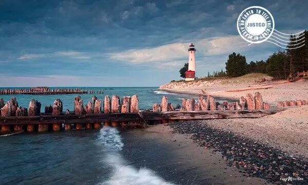

苏必利尔湖海岸线 (Crisp Point Lighthouse, Lake Superior shoreline), 密歇根州，美国。也许你看到过它，但是你没有这样凝视过它。

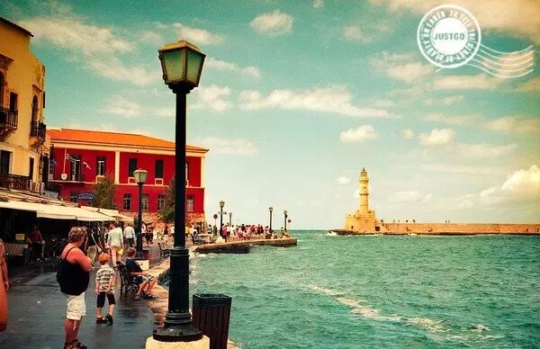

法罗斯，哈尼亚 (Faros, Chania), 克里特岛, 希腊。克里特岛是希腊神话的发源地，灯塔始建于1830年，为威尼斯式灯塔，现为哈尼亚的代表建筑之一。

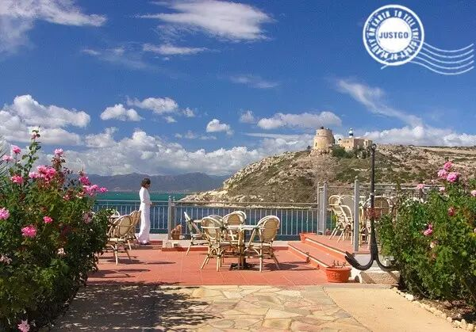

Faro di Sant'Elia, 卡利亚里，撒丁岛，意大利。遗落在西中海的快乐之乡。

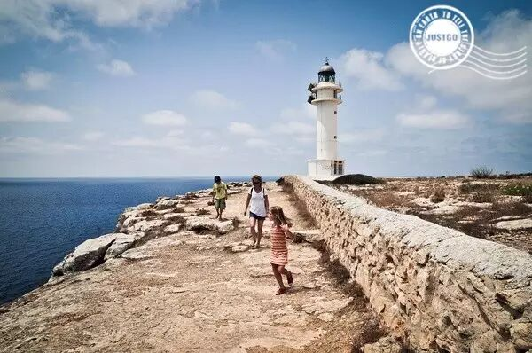

巴利阿里群岛 (Far des Cap de Barbària, Balearic Islands), 西班牙。一家人在西班牙灯塔下，沐浴阳光。

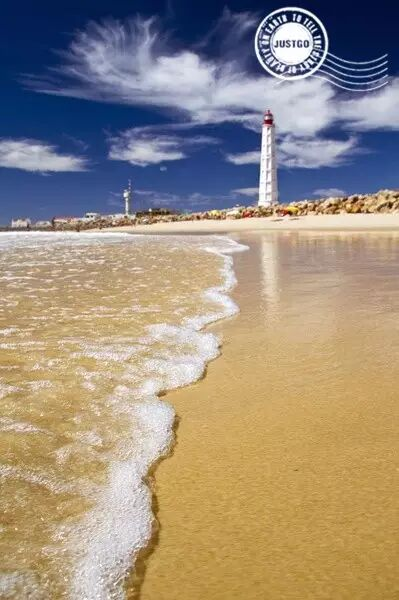

海角圣玛利亚，法鲁 (Cabo de Santa Maria, Faro), 葡萄牙。这座灯塔，伴随着浪拍海岸的配乐，自成一派的明媚。

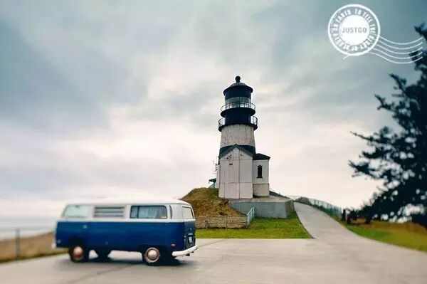

失望角灯塔，华盛顿·美国 (Cape Disappointment Lighthouse near Ilwaco, Washington, US)。

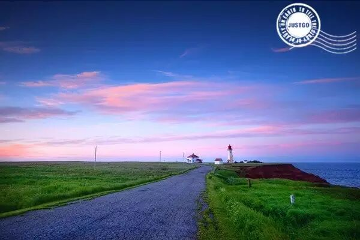

Bassin lighthouse, Bassin, 魁北克省, 加拿大。通往童话世界的路。

**▼**

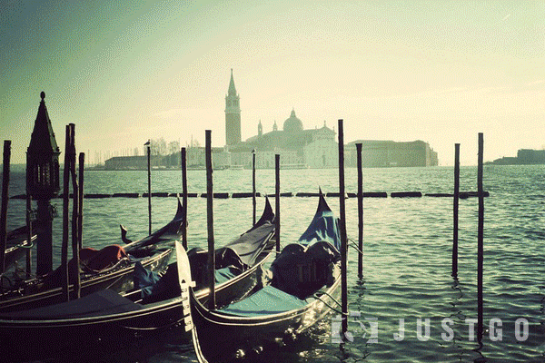

▼

**人生中，有无数的灯塔一样存在的东西，我们匆匆经过，回忆起来，会发现记忆中，都是闪着光的温暖。**

图片：感谢lowdive 收集灯塔图片，豆瓣相册"世界的100座灯塔"
编辑： Yue 文逸

**△李 梅**

"念念不忘，必有回响"

▼

**写给大家的一封短信**

今天是一个收到鼓励的日子。

JUSTGO收到了微信官方发来的原创保护功能的邀请，并很快通过。

打开后台时，我欣喜，又觉得非常难以置信。

这个账号，真的是我新媒体生涯里，种过的最小的一颗种子。但也是最上心，希望它长大、长好的唯一一个。

我曾经梦想过原创标签，那对于一个做内容的人来说，有点闪光。

但我们毕竟只发过不到10篇像样子的文章。我想过坚持发30+篇时，去试试申请一下.....

没想到

……

在这个星球上，存在着1000万+个微信公众号，每天会多增加1.5万个。

这种感觉，仿佛宇宙里的一颗微茫的星星，却看见灯塔在漆黑的夜里，把光亮在你身上照了一下。

那我应该接住这束光。

不管我在其他事情、方面有勤奋或者多么坚持，但对于这个账号来说，我的确是个非常任性的主编。

我们组建了一个才华横溢的志愿者队伍，每位都是我从几百封邮件里精挑细选，深夜谈过心事的。

但由于我的旅途、忙碌、取舍、犹豫、这事那事.....更新频率从日更、到月更、三月更、不更....

昨晚和原创写作组组长文逸聊天，看着她的话我一直在笑，但觉得好窝心。

"就是在等你，在等你，还在等你，你动了，我们才能前进……"

"不想太早过那么舒适的生活，觉得自己要在成都，肯定就是舒服不得了的状态，都不想拼搏了。一种感觉特别容易满足的状态，不是我要的。"

"让我们成为牛逼的人，想想都要睡不着了。"

"我要截图留证据。免得老觉得你随时都要抛弃我们的感觉。"

"我同学那段时间还问我，怎么那么久没见你们的号更新了。我说，主编在玩………你倒是玩的很好！！"

谢谢还在等我的你们。

谢谢微信给了我们这样一个鼓励。

我要对得起自己，对得起每一份托付，来认真的。

悦（认真脸）

上一篇文章更新后，收到一些留言，谢谢每位的支持，想给一个暖暖的拥抱！这个冬天要暖！

**THANKS**

选几条我看了好感动的：

"回归的感觉像见到久别重逢的亲人的脸庞。"
——大梦

"一直以为你在欧洲旅行，看到这文章很暖心，好的东西永远值得去等待。愿你在远方，遇到更多的惊喜，一切安好。"
——刘毅

"冬天快乐"
——文逸（志愿者原创主力组长，抱抱）

"很焦躁，失落，很难捱的一段时间，读到你的文字，突然又看到世界那么大，生活可以有那么多可能性，我却只着眼于当下的角落里，只想落泪。"
——And

"很暖和的文字，最近看到新闻土耳其很乱，希望明天太阳照常升起。"
——木鱼

"确实，感觉微信少了东西，原来是你的气息。"
——C

"好开心，有一种被偶像点名的感觉"
——娄慧明

"在我不能出去的日子里，还好朋友圈有你。感谢朋友圈这么多神奇的人。他们都在做着自己喜欢的事。追寻自己想要的生活。骑摩托车横穿亚洲大陆的姐姐，一直在路上的朋友，非洲的动物保护者大哥，阿拉斯加的追光人。愿你们在路上都平安。"
——末日之前

"终于出现了"
——我妈

......

我在旅途中会遇到很多奇葩的故事，和很好的人，奇妙的缘分。

我想要对每一个信任我的人好，因为每一份信任，于我都有知遇之恩。

爱你们。