# 旅途中你有过哪些「塞翁失马」的经历？· 上海

*耿悦 · Travel Stories · 2024-02-11*

---

塞翁失马的旅行，有挺多，先写上海。
有点想念克里特，科尔多瓦，圣地亚哥，巴塞罗那，厦门，每天走出来都是日光倾城的明媚，阳光总也用不完。

而上海，巴黎，罗马，伦敦，纽约，这些城市里阴下来的日子，
对一个需要拍「光影在流动人情味在弥漫」照片的摄影师来说，

就是人上了船，但没有船桨。
人进了厨房，但没有盐。 ​这是我有一年在上海春节做项目时写的烦恼。
&lt;img src="https://pica.zhimg.com/50/v2-0bef2fa70b7df596344df1b2b3885c0d_720w.jpg?source=2c26e567" data-caption="" data-size="normal" data-rawwidth="1080" data-rawheight="1080" data-original-token="v2-3c1643a3a7aacad6726a599f938cc922" data-default-watermark-src="https://pica.zhimg.com/50/v2-918feb99f889d4f95e06082256de1719_720w.jpg?source=2c26e567" class="origin_image zh-lightbox-thumb" width="1080" data-original="https://pic1.zhimg.com/v2-0bef2fa70b7df596344df1b2b3885c0d_r.jpg?source=2c26e567"/&gt;

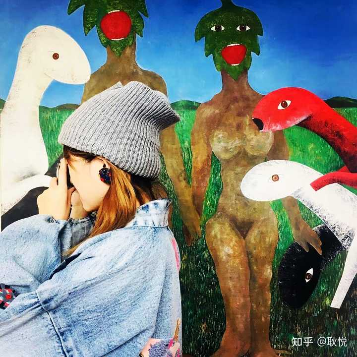

因为这座城市在我待的那段时间里有三分之二的天气被小雨潮湿和阴天覆盖，
剩下三分之一偶尔有冒出头的阳光，
我偶尔可以带着相机在里弄，苏州河畔，艺术街区之间穿行一下。

项目是在时尚魔都，但并不用展示网红打卡，而是要**“很独特”。**
要把市面上已经写过面貌丰富上海常见旅行探秘全部pass掉。
要发掘出精心推荐。“**要在上海待很久，很多年，才能发现的那些背后的美好”，**
要跟当地人细致采访，需要她们个人的私密喜好推荐，真实生活化的美妙细节。
还要来让享用到推荐的旅行新朋友，也感受到那些细腻，**到对上海的爱说不完。**

我前期做了大量工作，除了看书阅读，
&lt;img src="https://picx.zhimg.com/50/v2-1ba511bb4ab49b08246d3e7890212aec_720w.jpg?source=2c26e567" data-caption="" data-size="normal" data-rawwidth="1992" data-rawheight="1246" data-original-token="v2-1ba511bb4ab49b08246d3e7890212aec" data-default-watermark-src="https://pic1.zhimg.com/50/v2-46da34e16e4d2b80397da7abd61cd2ab_720w.jpg?source=2c26e567" class="origin_image zh-lightbox-thumb" width="1992" data-original="https://pic1.zhimg.com/v2-1ba511bb4ab49b08246d3e7890212aec_r.jpg?source=2c26e567"/&gt;

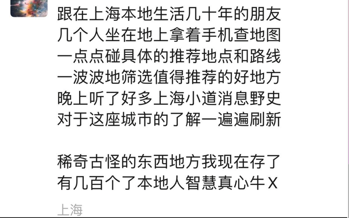

到真实去走出地图，逐渐我就在一种不知疲倦，每天走到腿断，
就每天都在找真正独特的地方，用心在找，这个好像是第一天，

&lt;img src="https://picx.zhimg.com/50/v2-3db75e39695a06eb9a9cbcca9dd85ea5_720w.jpg?source=2c26e567" data-caption="" data-size="normal" data-rawwidth="1125" data-rawheight="1718" data-original-token="v2-487fb03c7a5cd6c0749a7e70f3016162" data-default-watermark-src="https://pic1.zhimg.com/50/v2-63d00d85026c25cebb491137a44b4569_720w.jpg?source=2c26e567" class="origin_image zh-lightbox-thumb" width="1125" data-original="https://pic1.zhimg.com/v2-3db75e39695a06eb9a9cbcca9dd85ea5_r.jpg?source=2c26e567"/&gt;

但也伴随着总是缺盐的游荡感，从分外快乐到逐渐折磨。
因为是春节提前做，那个内容要初夏才会上线，除了去寻找合适的景点，整体呈现的气质，
还要有一种阳光，春日初夏的透气，
**人情在真实生活光影里微妙的自然流动感。**
但当时的环境就是挺冷的，没什么阳光，雾蒙蒙的，树上也没有叶子。拍出来的感觉就气质并不太对。
/
另外那些景点其实按照前期推荐，我真的品尝体验过，发现并不符合需求，于是我只能重新再找。
因为那项目是值得精益求精的，大家前期投入和质量要求很高，上海又是计划里最重要的旅行目的地之一。
后来就越投入感觉这事儿越奢侈。我最后真的累了，压力山大，天气也不好，一些店也没开，
感觉花了太多时间，最终当然是完成了。效果也很好。

但基本上属于好比你走出来的路线能堆成一个金字塔，最后只取了金子塔尖的一个小尖。
像一个出海的渔夫，出去捕鱼，到最后大海捞针般，只捧上了最好的几只，制作为佳肴。

其实也没有什么特别石破天惊大转折，马后炮就是说，
但对上海这个城市有了一种非同寻常的细节颗粒度的了解，
看了几千页旅行攻略，寻找隐匿秘境，
&lt;img src="https://picx.zhimg.com/50/v2-7c1e85a58f17fc829941acfab72b8b63_720w.jpg?source=2c26e567" data-caption="" data-size="normal" data-rawwidth="640" data-rawheight="1136" data-original-token="v2-1ee833c9c4b0bf0719e0c676f3f956a9" data-default-watermark-src="https://pica.zhimg.com/50/v2-4f3a5b0ad85c3a5be5ed1343e321e605_720w.jpg?source=2c26e567" class="origin_image zh-lightbox-thumb" width="640" data-original="https://picx.zhimg.com/v2-7c1e85a58f17fc829941acfab72b8b63_r.jpg?source=2c26e567"/&gt;

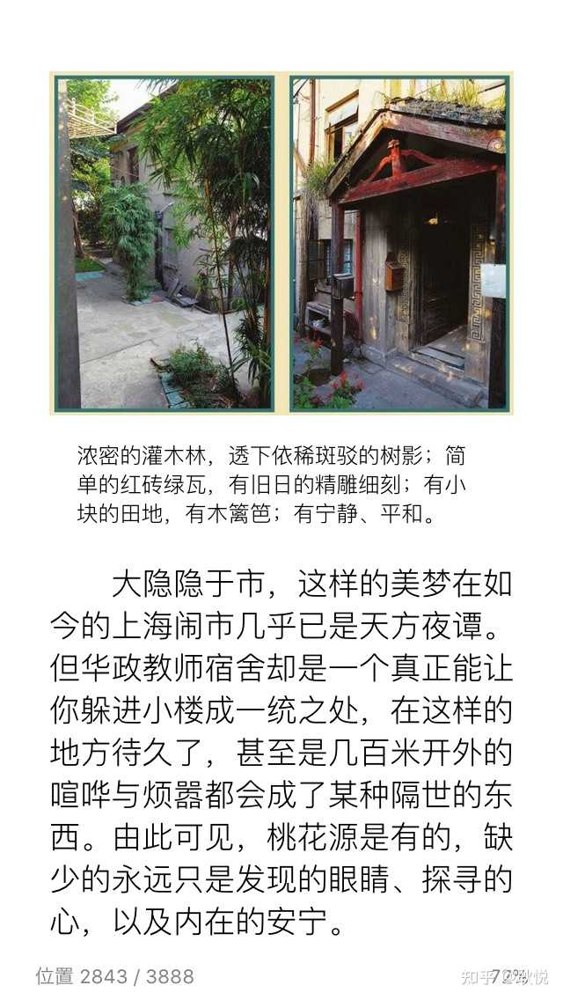

体会上海格调，日常生活感觉

&lt;img src="https://pic1.zhimg.com/50/v2-28c3c2b4abf12a9d5c09f80e13de02bb_720w.jpg?source=2c26e567" data-caption="" data-size="normal" data-rawwidth="640" data-rawheight="1136" data-original-token="v2-ba7d60390f11a01519bfa015426811e5" data-default-watermark-src="https://pic1.zhimg.com/50/v2-311a227a886833a9618557a656ed41b0_720w.jpg?source=2c26e567" class="origin_image zh-lightbox-thumb" width="640" data-original="https://pic1.zhimg.com/v2-28c3c2b4abf12a9d5c09f80e13de02bb_r.jpg?source=2c26e567"/&gt;

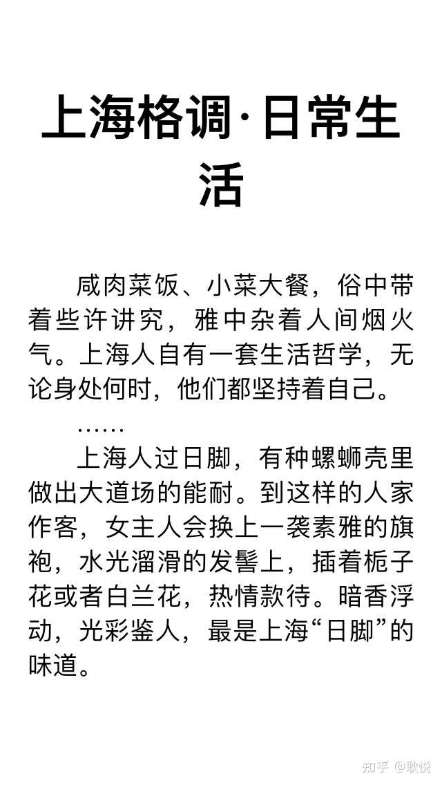

爬了上海最高的酒店顶楼，
&lt;img src="https://picx.zhimg.com/50/v2-6c57b98833ee5c1db9b12d8502998424_720w.jpg?source=2c26e567" data-caption="" data-size="normal" data-rawwidth="1075" data-rawheight="1331" data-original-token="v2-37533cdc18f7858eb29c77eafee0966a" data-default-watermark-src="https://picx.zhimg.com/50/v2-4a2c6412739f9f4edb3bbfe57ac13a9c_720w.jpg?source=2c26e567" class="origin_image zh-lightbox-thumb" width="1075" data-original="https://pica.zhimg.com/v2-6c57b98833ee5c1db9b12d8502998424_r.jpg?source=2c26e567"/&gt;

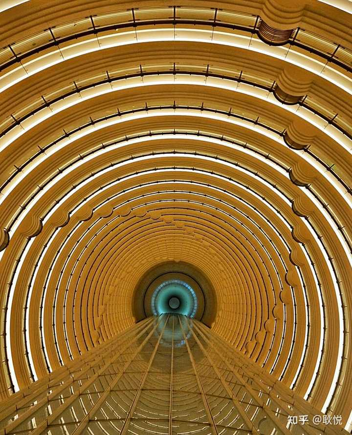

看上海老电影和科技互动展览
&lt;img src="https://pica.zhimg.com/50/v2-f3348875cc24e3f593b38641c8429fec_720w.jpg?source=2c26e567" data-caption="" data-size="normal" data-rawwidth="4032" data-rawheight="3024" data-original-token="v2-42ebfae6537edb66e620e6f8c0705937" data-default-watermark-src="https://picx.zhimg.com/50/v2-842fedef9262b6a129f7c6ac12d41181_720w.jpg?source=2c26e567" class="origin_image zh-lightbox-thumb" width="4032" data-original="https://pic1.zhimg.com/v2-f3348875cc24e3f593b38641c8429fec_r.jpg?source=2c26e567"/&gt;

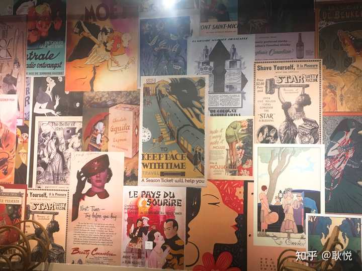

体会住宅
&lt;img src="https://pic1.zhimg.com/50/v2-9edb318e25f3d79b7774e3c5df24573a_720w.jpg?source=2c26e567" data-caption="" data-size="normal" data-rawwidth="2494" data-rawheight="3682" data-original-token="v2-b02e14b01e6f6f9279fbc12d03773a1f" data-default-watermark-src="https://picx.zhimg.com/50/v2-f7f3d5e26aba7bffbf131b98407e639f_720w.jpg?source=2c26e567" class="origin_image zh-lightbox-thumb" width="2494" data-original="https://picx.zhimg.com/v2-9edb318e25f3d79b7774e3c5df24573a_r.jpg?source=2c26e567"/&gt;

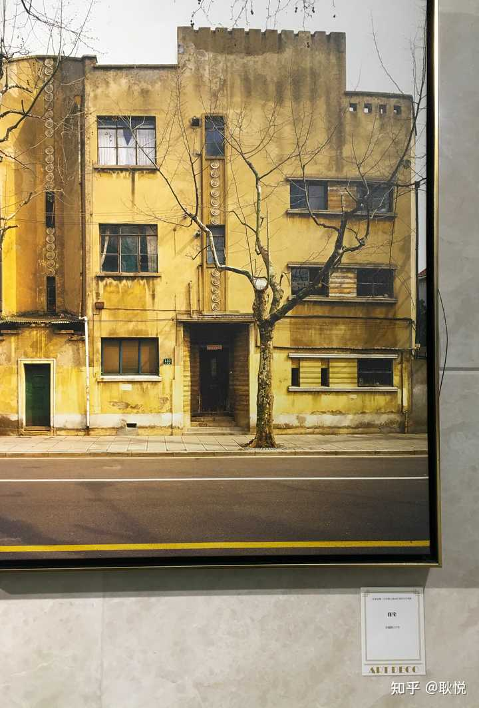

随机掉落 采风图片只是一小部分
&lt;img src="https://pic1.zhimg.com/50/v2-a88842a248915a152c6290f809638d22_720w.jpg?source=2c26e567" data-caption="" data-size="normal" data-rawwidth="2733" data-rawheight="3484" data-original-token="v2-eaa9301e459df4696002565489673fd6" data-default-watermark-src="https://pic1.zhimg.com/50/v2-a6bab6cafc01ae55c608ac7dd8a86e14_720w.jpg?source=2c26e567" class="origin_image zh-lightbox-thumb" width="2733" data-original="https://pic1.zhimg.com/v2-a88842a248915a152c6290f809638d22_r.jpg?source=2c26e567"/&gt;

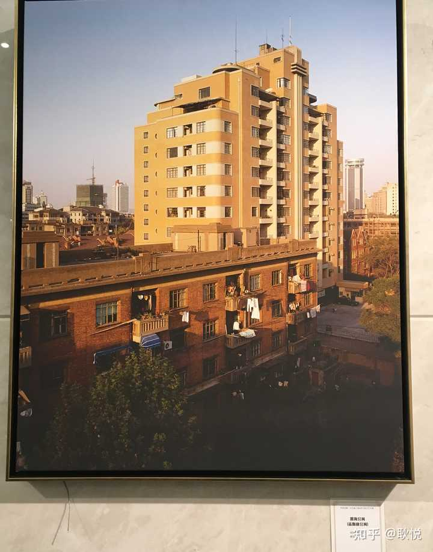

有特色建筑 
&lt;img src="https://picx.zhimg.com/50/v2-d1faf2b13685e746c951e44fe33496b7_720w.jpg?source=2c26e567" data-caption="" data-size="normal" data-rawwidth="2926" data-rawheight="3901" data-original-token="v2-00037fd7639773148ca9da1f6ef33e92" data-default-watermark-src="https://picx.zhimg.com/50/v2-f0706918772093063f70c83b5d7c6801_720w.jpg?source=2c26e567" class="origin_image zh-lightbox-thumb" width="2926" data-original="https://picx.zhimg.com/v2-d1faf2b13685e746c951e44fe33496b7_r.jpg?source=2c26e567"/&gt;

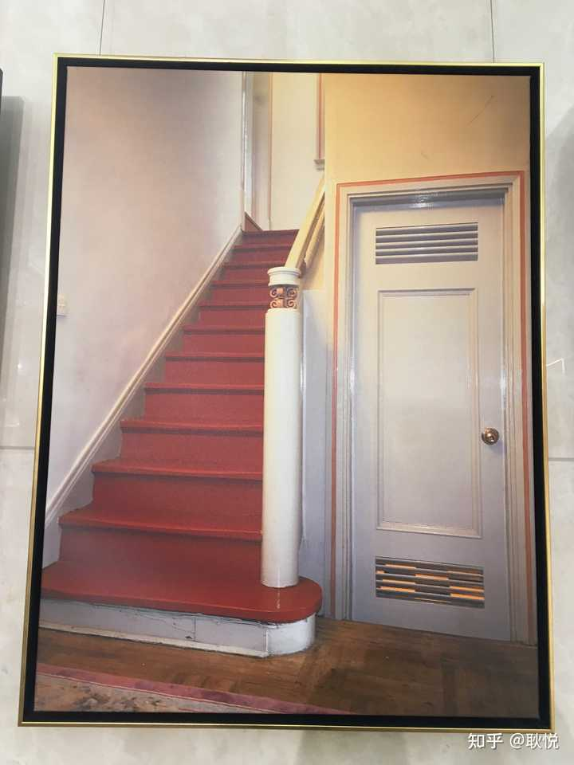

一些楼梯装饰
&lt;img src="https://picx.zhimg.com/50/v2-51e5ac600e0e501e4c0a86807feb7487_720w.jpg?source=2c26e567" data-caption="" data-size="normal" data-rawwidth="2830" data-rawheight="3759" data-original-token="v2-b5c0d3d06787fd746bd13b4ee39f59b2" data-default-watermark-src="https://picx.zhimg.com/50/v2-522baf3cf6a34fab88021f85fc416981_720w.jpg?source=2c26e567" class="origin_image zh-lightbox-thumb" width="2830" data-original="https://pica.zhimg.com/v2-51e5ac600e0e501e4c0a86807feb7487_r.jpg?source=2c26e567"/&gt;

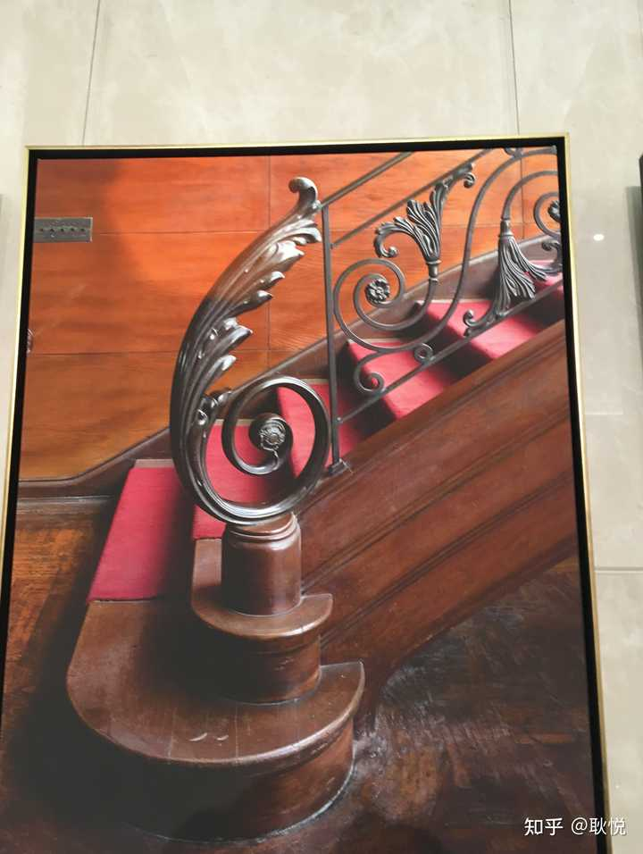

还去了和平饭店，隐藏酒吧，老邮局，好看的地方各种尝试
&lt;img src="https://pic1.zhimg.com/50/v2-a56f9fff43506e35c7020f9260765d1f_720w.jpg?source=2c26e567" data-caption="" data-size="normal" data-rawwidth="1125" data-rawheight="1672" data-original-token="v2-abede60dd1afca772d68dda12e376668" data-default-watermark-src="https://pic1.zhimg.com/50/v2-a4908bf8ebee79bbd328d85f45c9b574_720w.jpg?source=2c26e567" class="origin_image zh-lightbox-thumb" width="1125" data-original="https://pica.zhimg.com/v2-a56f9fff43506e35c7020f9260765d1f_r.jpg?source=2c26e567"/&gt;

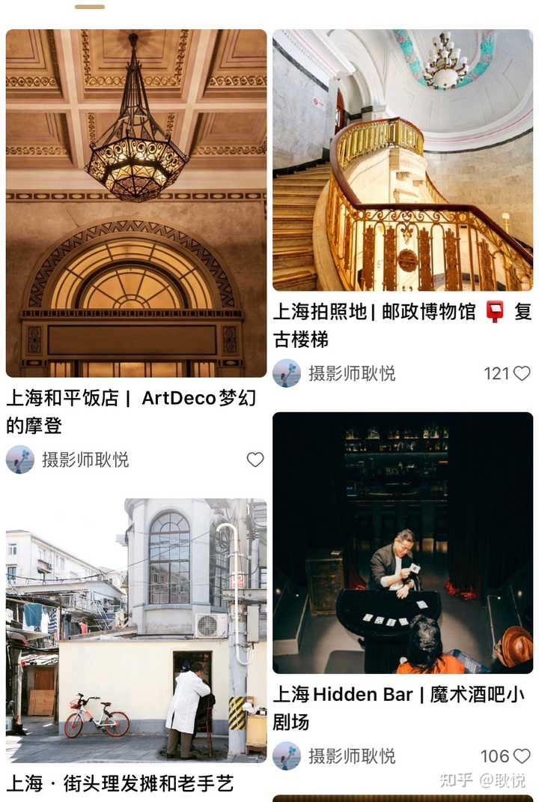

 漫步街头，
路过各种爱丽丝漫游仙境的“兔子洞”小店铺，
&lt;img src="https://pic1.zhimg.com/50/v2-b736a2bf83f4808e9e42aea9f940e509_720w.jpg?source=2c26e567" data-caption="" data-size="normal" data-rawwidth="1124" data-rawheight="1833" data-original-token="v2-1c1327ee9385e0df7e036f5f4b35d7c9" data-default-watermark-src="https://picx.zhimg.com/50/v2-efc05d5c963a1993b8d86d94a7f53fd3_720w.jpg?source=2c26e567" class="origin_image zh-lightbox-thumb" width="1124" data-original="https://pica.zhimg.com/v2-b736a2bf83f4808e9e42aea9f940e509_r.jpg?source=2c26e567"/&gt;

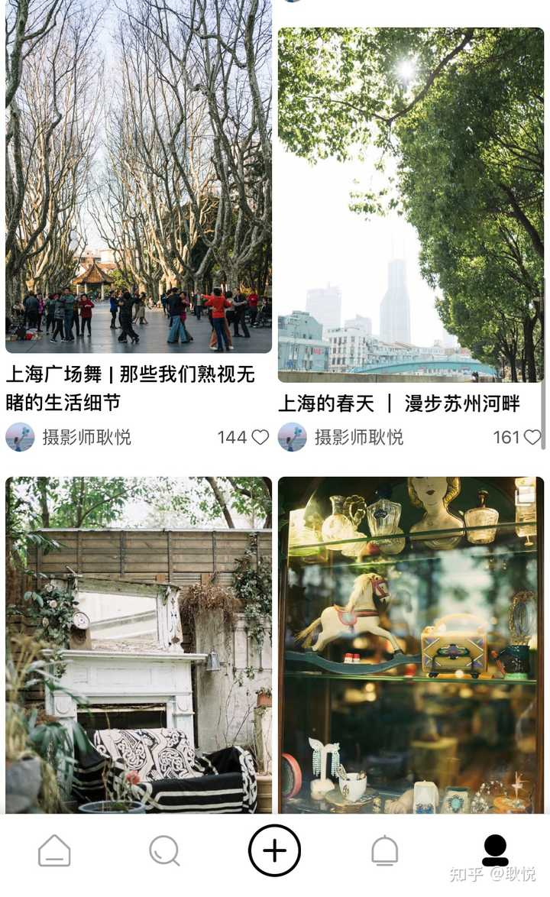

艺术空间不开门到旁边画店
&lt;img src="https://pic1.zhimg.com/50/v2-468eb42db008334f9c744674ff86dfe3_720w.jpg?source=2c26e567" data-caption="" data-size="normal" data-rawwidth="1024" data-rawheight="1365" data-original-token="v2-2577d8641bf73b4a2afdb72ce22ba7cf" data-default-watermark-src="https://picx.zhimg.com/50/v2-4d8cce6b8f0f07054aa420d0d48d9f22_720w.jpg?source=2c26e567" class="origin_image zh-lightbox-thumb" width="1024" data-original="https://picx.zhimg.com/v2-468eb42db008334f9c744674ff86dfe3_r.jpg?source=2c26e567"/&gt;

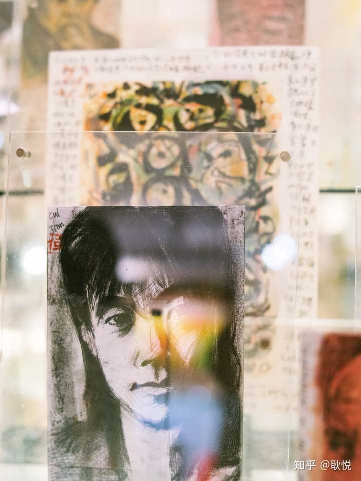

我想到那次旅行，背着相机到处走，就有一种无解但是你必须解出来题的强烈Push感，
每天醒来拉开窗帘看到窗外又在下雨心里的低落，和计划的搁浅，当天电话会议提交材料的不顺利，前一两天的探索又是白走，

&lt;img src="https://pic1.zhimg.com/50/v2-0c3d092cc64aac6d2fd921975fd945d2_720w.jpg?source=2c26e567" data-caption="" data-size="normal" data-rawwidth="2047" data-rawheight="2048" data-original-token="v2-feb27551af12129042d7bb25bb45270c" data-default-watermark-src="https://pica.zhimg.com/50/v2-9069c96eff69343ba570ecc342c4eeb6_720w.jpg?source=2c26e567" class="origin_image zh-lightbox-thumb" width="2047" data-original="https://pic1.zhimg.com/v2-0c3d092cc64aac6d2fd921975fd945d2_r.jpg?source=2c26e567"/&gt;

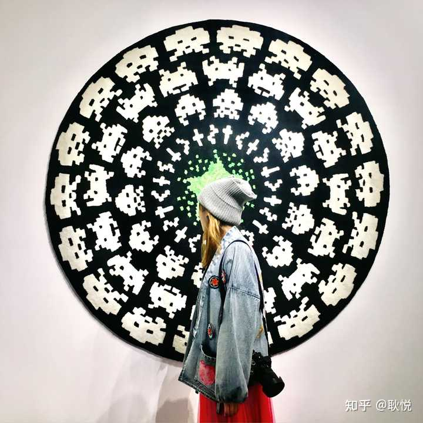

可是没有那种探索度，那么沉浸和抓狂，我该也不会兜兜转转真切体会到上海的动人之处。
最近看《繁花》，突然发现有一种，也不能说是很了解，就是竟然有一种不费力气的熟悉感。
几乎每个转角，里弄的细节，空气里弥散的气味和湿度，我都能明白那个画面感，也不陌生。

&lt;img src="https://pica.zhimg.com/50/v2-d2c727107342b180416958dd975ae0c0_720w.jpg?source=2c26e567" data-caption="" data-size="normal" data-rawwidth="1024" data-rawheight="683" data-original-token="v2-0aac70b956f9411da69dbee5e72f574e" data-default-watermark-src="https://picx.zhimg.com/50/v2-06cdabb55040eacdb8602587f0d27662_720w.jpg?source=2c26e567" class="origin_image zh-lightbox-thumb" width="1024" data-original="https://pic1.zhimg.com/v2-d2c727107342b180416958dd975ae0c0_r.jpg?source=2c26e567"/&gt;

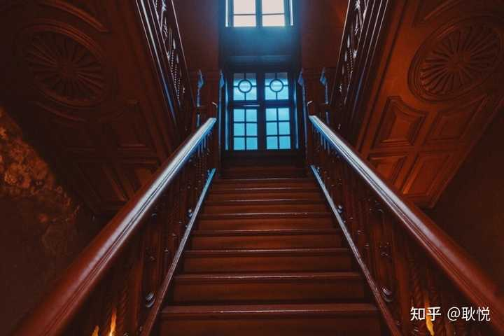

记得很喜欢在上海去探索老洋房，跟着故事走进去，仿佛看见了老房子里的画面，女人们穿着1930年代的旗袍，
从雕花的漂亮木楼梯走下来，和穿着西服的男人们，跳华尔兹，狐步舞，那是很多上海老客勒心里「最好的时代」，
那是十里香风，百乐门里彻夜响着爵士乐的年代。

&lt;img src="https://picx.zhimg.com/50/v2-a64df498c708c0087c9a4c1ebfde66c3_720w.jpg?source=2c26e567" data-caption="" data-size="normal" data-rawwidth="771" data-rawheight="563" data-original-token="v2-8655cd0d1982dd4c99dde4a21673f2b3" data-default-watermark-src="https://pic1.zhimg.com/50/v2-0809437a0be030163a0d5372785c295c_720w.jpg?source=2c26e567" class="origin_image zh-lightbox-thumb" width="771" data-original="https://pic1.zhimg.com/v2-a64df498c708c0087c9a4c1ebfde66c3_r.jpg?source=2c26e567"/&gt;

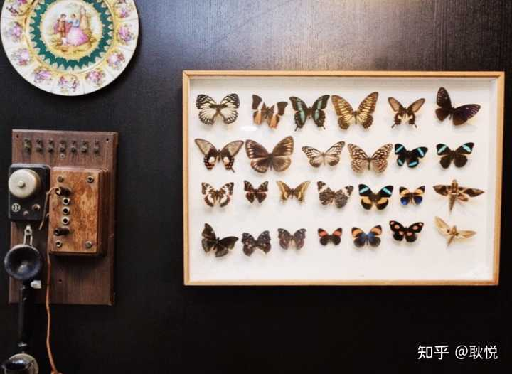

没有阳光的时候，等不来盐的雨濛濛，上海在我的记忆里流淌，竟变成了一座安静的慢节奏城市，
有时候坐在里弄的阁楼里，听着楼上楼下拐角处炒菜，阿婆沪语聊天，雨水嘀嗒从外面屋檐落下，
总是等不来心心念念的晴朗天气，

&lt;img src="https://picx.zhimg.com/50/v2-742c776e2d821cde22467eee5eab4af3_720w.jpg?source=2c26e567" data-caption="" data-size="normal" data-rawwidth="3838" data-rawheight="2878" data-original-token="v2-b1641148f22ec56fb447377fc4c37dcd" data-default-watermark-src="https://pic1.zhimg.com/50/v2-cfbd903f6fefea64889f486bee068d86_720w.jpg?source=2c26e567" class="origin_image zh-lightbox-thumb" width="3838" data-original="https://pic1.zhimg.com/v2-742c776e2d821cde22467eee5eab4af3_r.jpg?source=2c26e567"/&gt;

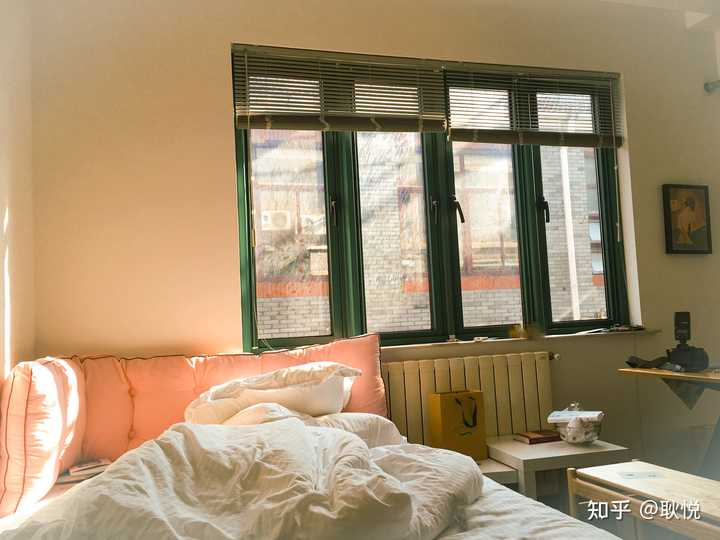

弄堂里有各种生活细节，
比如在弄堂的出口，开着一家小烟纸店，小的不能让人置信的店面里，千丝万缕地陈放着各种日用品，
小孩子吃的零食，老太太用的针线，各种居家日子里突然告缺的东西，以前没有外卖的时代，一个漂亮的上海女孩会穿着睡衣和拖鞋，就跑出来买。

&lt;img src="https://picx.zhimg.com/50/v2-e0abe421b245fc538f132f9c3e1054bd_720w.jpg?source=2c26e567" data-caption="" data-size="normal" data-rawwidth="588" data-rawheight="604" data-original-token="v2-023c532eb2d521d6f94cfc921168839f" data-default-watermark-src="https://picx.zhimg.com/50/v2-7d73e8737eb6571fe3fc05bbb3f69e90_720w.jpg?source=2c26e567" class="origin_image zh-lightbox-thumb" width="588" data-original="https://picx.zhimg.com/v2-e0abe421b245fc538f132f9c3e1054bd_r.jpg?source=2c26e567"/&gt;

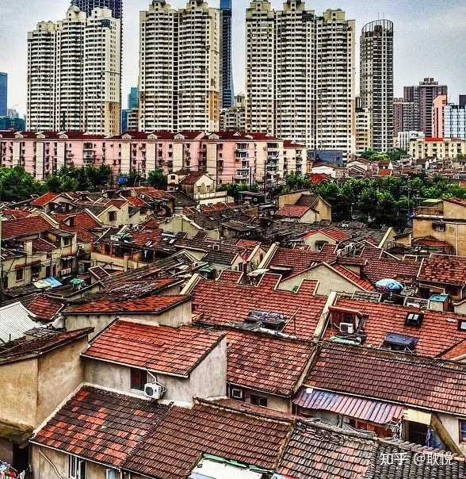

后来我没用上的边角料，大概那一年的旅行专栏里，随便这洒一点那洒两滴，基本都反馈蛮多好评。
那一程也明白了上海朋友们的灵和嗲，把她们推荐的从小到大喜欢吃的食物品尝，
比如”小时候的味道“，买到上海各种老牌饼干老式点心，老苏打散发出来的葱油味，光阴威化饼干的奶油味，手指饼干散发的虾条味道，杏元饼干散发的杏仁味，泰康万年青的椒盐味，说像外婆在午后从漂亮的罐子里拿出来的点心香味。
塞翁失马，在上海的弄堂里的经历，避开了游客熙攘的外滩，人们就在这里实实在在生活着，而我感受到了魔都背后的真实一面。
已开启送礼物编辑于2024-02-11 11:40・新疆​ 修改​赞同 3​添加评论​收藏​分享​​设置收起​

---

*塞翁失马，在上海的弄堂里的经历。*
