# 2025 成都旅行参考

景点、美食、路线实用信息合集（持续更新）。

**首发**：知乎专栏 · 作者：耿悦

---
在保持原有景点、美食、路线框架上，迭代了个新版本。 补充了熊猫观赏地点对比、市郊美食、薛涛望江楼、值得看的展览、摄影路线、图书馆等。 增加了春节灯会、避雷相关等实用信息，可以先收藏，全文17901字。其他城市，也都可以定制制作旅行攻略。

️ 成都美食宇宙大名单 | 收藏即拥有 【麻辣江湖】 火锅 | 串串 | 冒菜| 钵钵鸡 | 麻辣烫 | 干锅 | 芋儿鸡 | 冷吃兔 | 椒麻鸡 | 夫妻肺片 | 红油抄手 | 麻辣水饺 | 凉拌兔腰 | 泡椒凤爪 | 辣卤脑花 【碳水解忧】 甜水面 | 素椒杂酱面 | 担担面 | 鸡丝凉面 | 邛崃奶汤面 | 查渣面 | 铺盖面 | 豇豆面 | 海味面 | 红沙牛肉面 | 脆臊面 | 回锅肉面 【酥香暴击】 军屯锅盔 | 红糖锅盔 | 牛肉焦饼 | 蛋烘糕 | 糖油果子 | 三大炮 | 叶儿粑 | 红糖糍粑 | 葱葱卷 | 方油糕 | 玉米粑 | 蒸蒸糕 【川魂硬菜】 回锅肉 | 麻婆豆腐 | 宫保鸡丁 | 鱼香肉丝 | 开水白菜 | 樟茶鸭 | 咸烧白 | 甜烧白 | 蒜泥白肉 | 豆瓣鱼 | 肝腰合炒 | 粉蒸牛肉 | 东坡肘子 | 蚂蚁上树 【夜鬼暗号】 烤苕皮 | 烤豆干 | 把把烧 | 蹄花汤 | 脑花面 | 炒田螺 | 冷淡杯 | 鬼饮食 | 油炸串串 | 铁板鱿鱼 | 狼牙土豆 | 锅巴土豆 【甜蜜围城】 冰粉 | 凉糕 | 凉虾 | 醪糟粉子 | 三合泥 | 银耳汤 | 糖油果子 | 蛋烘糕（奶油馅） | 宫廷桃酥 | 红糖锅盔 | 珍珠丸子 | 凉糍粑 【汤水温柔】 豆汤饭 | 蹄花汤 | 连锅子 | 酥肉豆花 | 酸辣粉 | 肥肠粉 | 清汤抄手 | 羊肉汤 | 老妈蹄花 | 豌豆颠儿汤 | 带丝汤 | 丸子汤 【素食禅意】 罗汉面 | 素椒杂酱 （素版）| 寺院豆花 | 凉拌三丝 | 烫蔬菜 | 红糖锅盔（素油）| 素冒菜 | 竹荪汤 | 素回锅肉 | 菌汤火锅 【街头暗器】 兔头 | 鸭头 | 鸭脖 | 鸡翅尖 | 卤肥肠 | 卤鹌鹑蛋 | 泡椒藕片 | 凉拌折耳根 | 红油耳片 | 麻辣豆干 | 冷吃牛肉 | 灯影牛肉 【碳水核弹】 钟水饺 | 红油抄手 | 龙抄手 | 赖汤圆 | 郭汤圆 | 醪糟汤圆 | 凉粉 | 凉面 | 旋子凉粉 | 黄凉粉 | 伤心凉粉 | 川北凉粉

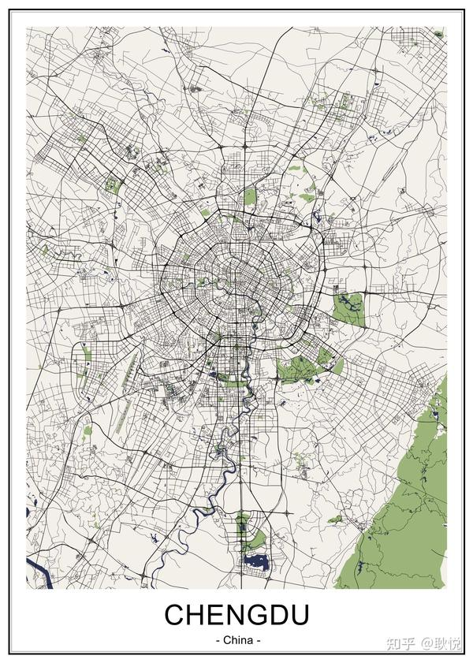

来成都，享受慢生活乐趣，用脚步感受成都的休闲乐活气质。体验这座城的精华——“安逸”。

✈️ 交通方式

| 交通方式 | 详细信息 | 备注 |
|---|---|---|
| 飞机 | 成都天府国际机场 （买票的时候要注意看是双流机场，还是天府，这是新机场，距离市区距离非常远） | 打车约150-200元； 大巴1号线24小时直达春熙路（白天15元，夜间25元）； 地铁18号线37分钟直达火车南站。 |
| 火车 | 成都东站（高铁枢纽） 成都南站（地铁1/7/18号线） 成都西站（地铁4/9号线） | 东站地铁2/7号线直达； 南站站内换乘仅5分钟； 西站可换乘有轨电车蓉2号线。 |
| 市内交通 | 1. 公交车（支持一码通乘） 2. 地铁（微信/支付宝/天府通） 3. 网约车/出租车 | 早晚高峰公交有专用道； 出租车需在指定乘车点搭乘。 |
| 夜间交通 | 天府机场公交1号线（春熙路）、4号线（东客站） | 1号线24小时运行，30分钟/班； 4号线末班车至次日2:30。 |
| 支付方式 | 天府通、支付宝、微信、成都地铁APP | 天府通卡可免费换新（支持NFC充值）； 支付宝”出行码”可扫。 地铁APP可刷脸乘车。 |

住宿区域

| 地区 | 校准后优点 | 补充说明 |
|---|---|---|
| 春熙路附近 | - 核心商圈： 太古里、IFS、大慈寺等聚集，步行可达。 - 交通便利： 地铁2、3号线交汇，直达机场、火车站。 - 住宿选择丰富： 涵盖奢华酒店（如博舍、瑞吉）、 中端连锁（全季、亚朵）及高性价比民宿。 | 交通最方便， 住宿有丰富的中高端酒店可以选择。 |
| 文殊院附近 | - 文化氛围浓厚：千年古刹文殊院旁，体验禅修活动。 - 地道美食 - 高性价比民宿 | 部分民宿提供茶艺体验， 适合慢生活游客。 |
| 三圣街附近 | - 春熙路延伸区： 步行10分钟可达太古里，兼具便利与安静。 - 本地化生活：小吃摊、社区火锅集中。 | 需注意：部分老旧民宿隔音较差，建议优先选择近年装修房源。 |
| 九眼桥附近 | - 夜生活核心：酒吧、Livehouse集中。 - 江景房优势：香格里拉酒店可俯瞰锦江夜景。 | 补充建议：夜间较喧闹，对安静需求高的游客可选择背街房源。 |
| 地铁2号线沿线 | - 串联热门景点：春熙路（2号线）、人民公园（2号线）、犀浦（可换乘有轨电车至都江堰）。 - 通勤便捷：直达成都东站、天府机场（换乘18号线）。 | 重点站点推荐： - 通惠门站：近宽窄巷子 - 牛王庙站：近九眼桥。 |
| 三环内地铁口 | - 灵活选择： 如建设路（近东郊记忆）、驷马桥（近动物园）、省体育馆（近锦里）。 - 性价比更高： 非核心商圈价格相对低 | 需注意：部分三环区域（如龙潭寺）地铁末班车较早（23:00前）， 夜归游客建议选择1号线、6号线等主干线。 |

住宿区域 地理位置优先级 市区一二环内 ：比较多的著名景点（宽窄巷子、锦里、人民公园）集中于此，步行或短途骑行可达。 地铁口 ：8号线、2 号线、4号线，兼顾便利与性价比。 行程导向选住宿 ：若行程以市区景点为主，优先春熙路/文殊院；若计划周边游（都江堰、青城山），可选地铁2号线沿线（如茶店子站）。 利用地铁网络 ：下载“成都地铁APP”实时查询线路，8号线二期、27号线已开通，覆盖城北、龙潭寺等新区域。 感受： 成都交通，比北京的拥堵和路上的漫长好很多，就在出行方便的地点就好，能打车、地铁方便。 小众高性价比区域

| 地区 | 亮点 | 适合人群 |
|---|---|---|
| 建设巷 | 小吃街密集 | 美食爱好者、夜宵党 |
| 玉林片区 | 本地生活气息浓厚，近小酒馆（玉林西路），民宿均价低于春熙路30%。 | 文艺青年、预算有限者 |
| 华西坝 | 四川大学周边，咖啡馆、书店集中，地铁1号线直达。 | 学生党、慢旅行者 |

预定避坑指南 避免远郊住宿 ：即使地铁可达，如天府国际机场附近（距市区50公里），返程耗时过长。 慎选过于繁华区 ：春熙路周末人流量极大，噪音明显，可选择相邻的华兴街、镋钯街等安静街区。 警惕“照骗”民宿 ：优先选择平台认证的“超赞房东”，可以查看一下差评、最新好评里提到的卫生、隔音问题。 特殊时段高价预警： 糖酒会（3月、10月）、国庆期间房价可能翻倍，建议提前1个月预订。 慢生活成都路线 第一天：成都市区精华游

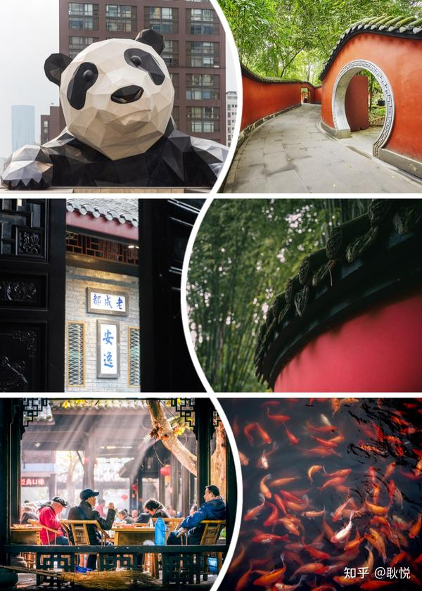

第一天行程距离和所需时间 ：

| 时间段 | 行程安排 | 交通方式 | 核心体验与建议 |
|---|---|---|---|
| 09:00-11:00 | 春熙路 → 太古里 → IFS | 步行/地铁 | 商圈打卡、方所书店、IFS空中花园 |
| 11:30-13:00 | IFS → 人民公园 | 骑行/地铁 | 少城街区穿行、人民公园鹤鸣茶社的竹椅 |
| 13:30-15:00 | 人民公园游览 | - | 川剧表演、采耳体验 |
| 16:00-17:30 | 人民公园 → 安顺廊桥 | 打车 | 合江亭夜景、锦江夜游步道 |
| 18:00-20:30 | 安顺廊桥 → 玉林小酒馆 | 打车/地铁 | 玉林夜市逛吃、小酒馆听live（建议20:00前抵达占位） |

注意事项 慢节奏推荐：玉林片区、人民公园鹤鸣茶社建议步行或骑行，避开高峰时段； 安顺廊桥至小酒馆：夜间打车更方便，玉林西路停车较难，可提前让司机停靠附近路口。 节假日人流：春熙路、太古里周末人流量极大，建议工作日前往或错峰（如早上9点前抵达）。 天气影响：成都冬季多雾霾，夏季多雨，建议随身携带晴雨伞，骑行时注意安全。 门票预约：行程中无收费景点，但旺季时人民公园茶社可能需提前占座。 交通查询工具：下载“成都地铁APP”可实时查看拥挤度、换乘指引，规划悠闲路线。

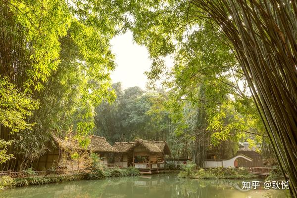

《茅屋为秋风所破歌》是唐代诗人杜甫旅居四川成都草堂期间所写。 第二天：文化古迹深度探访

| 时间段 | 区域 | 景点/活动 | 交通方式 | 备注 |
|---|---|---|---|---|
| 09:00-11:00 | 青羊区 | 杜甫草堂 | 地铁+步行 | 电子讲解必租 |
| 11:30-13:00 | 青羊区 | 文殊院+午餐 | 骑行 | 素斋体验 |
| 13:30-15:00 | 青羊区 | 宽窄巷子 | 步行 | 避开主街，逛支巷 |
| 15:30-17:00 | 青羊区 | 成都博物馆 | 步行 | 免费需预约 |
| 17:30-19:30 | 武侯区 | 武侯祠+锦里 | 地铁+步行 | 锦里夜景优先 |
| 20:00-21:30 | 青羊区 | 川剧表演+火锅 | 打车 | 提前订座 |

备选方案 体力有限者：跳过成都博物馆，武侯祠游览缩短至1.5小时，增加锦里茶歇时间。 文化爱好者：用 金沙遗址博物馆 ，替代成都博物馆（需调整交通为地铁7号线）。 夜游爱好者：川剧表演后增加九眼桥酒吧街（打车10分钟），体验成都夜生活。 以上调整结合交通实测与景点特色，确保行程张弛有度。 如需实时交通查询，可下载“天府通”APP或关注“成都地铁”公众号

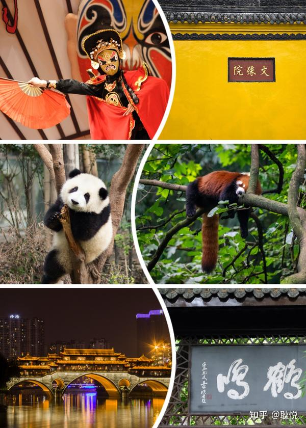

第三天：人文历史之旅

| 时间段 | 景点 | 交通方式 | 费用参考 |
|---|---|---|---|
| 09:00-11:30 | 成都博物馆 | 地铁+步行 | 免费 |
| 12:00-12:30 | 天府广场小吃 | 步行 | 人均25元 |
| 13:00-16:00 | 金沙遗址博物馆 | 地铁+步行 | 门票70元 |
| 16:30-17:30 | 青羊宫 | 打车 | 门票10元 |
| 18:00-18:30 | 天府广场 | 地铁 | 免费 |
| 19:30-21:00 | 蜀风雅韵川剧表演 | 打车 | VIP票120元 |

本地人私藏建议 青羊宫可求签解卦（随喜功德），道士讲解需预约。 拍照机位：金沙遗址乌木林（广角镜头）、青羊宫三清殿香炉。 金沙遗址每周五/六开放夜场（至20:00），灯光下更神秘。 注意事项 预约必备：成都博物馆、金沙遗址需提前1天在官方公众号预约。 穿着建议：轻便运动鞋（全天步行约6公里），青羊宫需着装得体（避免短裤/吊带）。 交通查询： 下载“天府通”APP，实时地铁拥挤度查询 成都博物馆 → 金沙遗址博物馆：地铁2号线直达 一品天下站 （25分钟）。 天府广场 → 川剧表演：标注真实交通方式（打车/地铁）。 春熙路住宿便利性：游客住在春熙路可方便返回，春熙路至琴台路打车约15分钟。

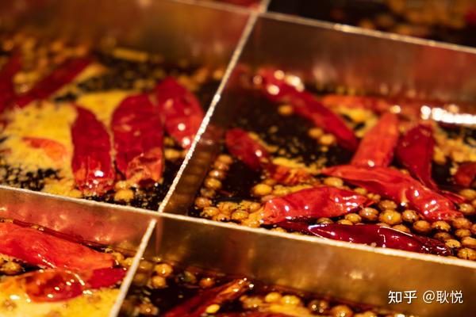

成都品质美食探索指南 无需店铺清单，掌握以下原则，你也能像本地人一样找到真正的好味道—— 一、传统小吃 辨别吃法 肥肠粉 汤底：骨汤熬制，表面浮少量红油，闻起来有淡淡白胡椒香，而非刺鼻辣精味。 粉质：红薯粉透亮不黏牙，筷子夹起不断裂。 隐藏健康吃法：要求“少红油多豆芽”，搭配清汤锅盔更清爽。 蛋烘糕 外皮：边缘焦脆带蕾丝边，中心绵软无生粉味。 馅料：现炒土豆丝、自制麻辣牛肉，拒绝罐头肉松和植物奶油。 选择信号：摊位旁有本地老人排队，或老板边做边和熟客唠家常。 甜水面 面条：粗如筷子，手工揉制有韧劲，咬断面芯微黄（碱面本色）。 调料：芝麻酱浓郁但不过稠，红糖与酱油平衡，吃完碗底无厚重油渍。 二、硬核川菜的品质密码 川菜馆筛选法 厨房观察：灶台火苗旺（猛火快炒）、食材摆放在竹筐/木案上（非塑料盒）。 菜单玄机：必有“开水白菜”“鸡豆花”等清淡菜（考验功底），且敢标“少油少盐”。 火锅避坑指南 锅底：凝固呈深红色块状（纯牛油），煮开无刺鼻香精味，久煮不泛苦。 鲜货鉴别：毛肚叶片厚实无碱味，鸭血孔洞细腻（真鸭血呈暗红色）。 豆汤饭/蹄花汤 汤色：豆汤浓白起沙，蹄花汤奶白带油星，非惨白或浑浊。 蘸碟：豆瓣酱需现舂，带发酵香气，非预制工业酱。 三、素食 寺院素斋 食材：时令蔬菜为主，豆腐为自制卤水点制（非石膏豆腐）。 调味：多用菌菇、竹荪提鲜，少用素肉仿荤。 菜市场寻宝 凉拌菜：调料台可见花椒粉、熟油海椒现制，无预拌酱汁。 豆制品：豆腐/豆花带淡淡焦香（柴火灶制作），触感弹性足。

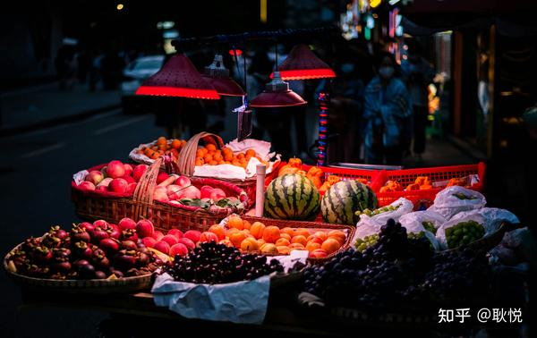

四、饮品甜点：天然之味的坚守 手搓冰粉 气泡痕迹：表面有密集小孔，口感带天然植物清香（假冰粉透明无瑕，有碱味）。 糖水：红糖熬至翻砂，非糖浆勾兑。 老鹰茶/苦荞茶 免费供应：地道火锅店会提供，解腻降火，茶汤清亮带草药香。 醪糟饮品 发酵度：米粒饱满微甜，酒香温和，无刺鼻酒精味（工业醪糟常过酸）。 五、夜市 烤制类 优选：炭火直烤（非电炉），食材可见原始纹理（如整块牛肉非肉泥串）。 避雷：表面裹厚重酱料掩盖变质味的摊位。 蒸煮类 叶儿粑：芭蕉叶包裹，馅料可见完整肉粒，糯米皮不粘牙。 凉糕：米黄色（添加碱），口感绵密带米香，非纯白色果冻状。 美食筛选 嗅觉优先：真正的好味道是复合香气（豆瓣发酵香、花椒麻香），非单一辣味冲击。 时间检验：居民区存活5年以上的店，口味和品质经得起考验。 对话厨师：敢让你“少油少辣”且味道不减分的店，通常对食材自信。 成都真正的美味，好吃的地方数不胜数， 无需网红店扎堆，相信自己的眼睛、鼻子和直觉，就是最好的美食地图！ 成都旅行避雷指南 核心原则 ：避开“游客特供”，拥抱“苍蝇馆子+老街烟火气” 一、景区避雷篇

| 雷区 | 踩雷原因 | 替代方案 |
|---|---|---|
| 锦里/宽窄巷子小吃 | 溢价严重（同款小吃价格翻3倍），食材不新鲜，味道工业化 | 去文殊院旁洞子口、玉林菜市场，5元甜水面、8元锅盔吃到爽 |
| 海昌极地海洋公园 | 设施陈旧，动物表演争议大，门票性价比低 | 带娃可选成都动物园或浩海立方海洋馆（商场内，避暑友好） |
| 春熙路太古里商圈 | 网红餐厅排队2小时+，味道配不上价格 | 拐进华兴街、镋钯街，老字号盘飱市、雨田饭店步行可达 |
| 熊猫基地太阳产房 | 旺季排队1小时看3分钟，幼崽可能躲着睡觉 | 改去都江堰熊猫谷，人少且有小熊猫散养区 |

二、美食避雷篇

| 雷区 | 踩雷原因 | 替代方案 |
|---|---|---|
| 建设路网红店 | 雇人排队制造假象，味道平庸（如某排骨酥肉半成品油炸） | 电子科大背后建设巷，找学生扎堆的老摊：徐亮烤蹄、高姐锡纸烤脑花 |
| 奎星楼街 | 过度营销，菜品预制化（某网红串串被曝锅底重复使用） | 隔壁吉祥街、小通巷，社区火锅人均50元吃到撑 |
| 景区“老字号” | 冒牌店扎堆（如“X姐钟水饺”“X婆婆蹄花”），专坑游客 | 认准唯一总店：钟水饺在羊市街，廖老妈蹄花在祠堂街 |
| 火锅店甜品刺客 | 38元草莓冰沙成本不到5元，用料廉价 | 自带唯怡豆奶或去隔壁小摊买3元冰粉 |

三、交通&安全篇

| 雷区 | 踩坑预警 | 破解攻略 |
|---|---|---|
| 春熙路免费玫瑰花 | 强塞花后索要“香火钱”，不给就纠缠 | 冷脸拒绝+快速离开，必要时报警 |
| 文殊院红布骗局 | 假和尚递红布“祈福”，随后收取高额费用 | 双手背后不接物，直奔院内免费领香处 |
| 景区直通车 | 低价揽客后推销购物店，浪费游玩时间 | 地铁+共享单车，成都景区地铁覆盖率达90% |
| 出租车推荐火锅店 | 司机与火锅店合作拿回扣，人均消费300+ | 坚持自己选店，或直接要求去“袁老四”“蜀大侠”等连锁店（至少明码标价） |

四、特产&购物避雷篇

| 雷区 | 真相揭露 | 聪明选购 |
|---|---|---|
| 景区熊猫玩偶 | 义乌批发货，价格翻5倍 | 去荷花池批发市场（认准“金荷花”区域），同款玩偶15元拿下 |
| 真空包装兔头 | 景区店多用冻货，肉质柴且香料味浮于表面 | 菜市场鲜卤摊现捞现抽真空（青羊小区菜市“邓氏兔头”可邮寄） |
| 竹叶青茶叶 | 景区茶叶店真假混卖，陈茶当新茶卖 | 至竹叶青旗舰店（太古里）或老牌茶庄（如三花茶厂门市部） |
| 蜀绣/银器 | 机器绣品充手工，银饰含铜量超标 | 蜀绣博物馆 |

终极避雷口诀 吃 ：居民楼>美食街>商场店>景区店 行 ：地铁>共享单车>网约/出租车 购 ：菜市场>批发市场>连锁店>景区摊 拍 ：老茶馆>网红墙>付费摄影棚

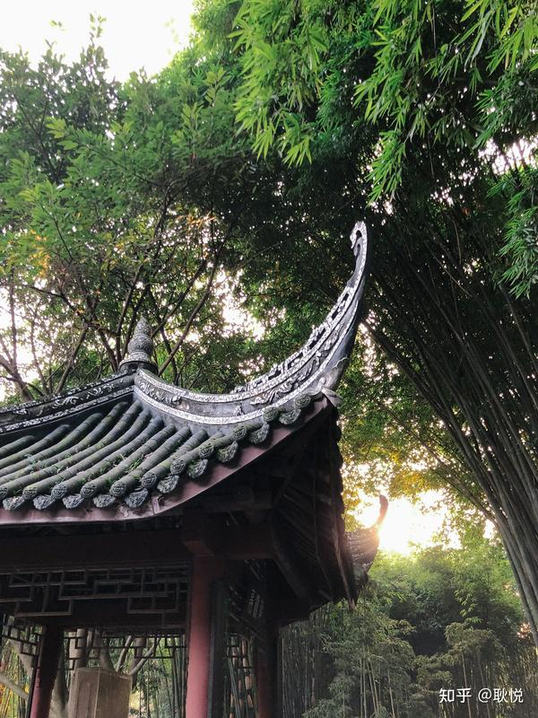

望江楼公园 ： 薛涛的诗意世界与竹林秘境 若你钟爱薛涛的才情与风骨，望江楼公园不可错过，这里不仅是薛涛的纪念地，更是一片以竹为魂的诗意园林。 每一寸土地都浸润着唐代女诗人的风雅与坚韧。 这里的一竹一井、一联一阁，皆在无声诉说着才女的风骨与诗心。 一、薛涛与望江楼的千年羁绊 薛涛的精神符号 薛涛虽未在此生活，但其墓曾坐落于附近（后毁于战乱）， 后人因敬仰她的品格与诗才，以竹代桃花环绕墓地，逐渐形成今日的竹林胜景。 纪念馆的诗意追溯 薛涛纪念馆 内藏其诗作真迹复刻与生平故事， 匾额为四川名家马识途题写。 展馆通过“才女望春”“诗魂长存”等主题，重现她以诗会友、制笺传情的传奇人生。 园内 薛涛井 虽为明代蜀王仿制“薛涛笺”所凿， 却因清代碑刻“薛涛井”三字，成为文人追思的象征。 二、竹林秘境：薛涛的“苍苍劲节奇” 竹的基因库 为纪念薛涛对竹的钟爱，园内汇集30属270种珍稀竹类，堪称“中国竹的基因库”。 人面竹的斑驳纹理、佛肚竹的憨态可掬、琴丝竹的纤柔如弦，构成一场竹的视觉盛宴。 竹文化沉浸体验 竹工艺陈列馆：展有竹雕《老成都》、竹编《百寿图》等， 一件件“竹上生花”的杰作，展现匠人对自然的敬畏。 三、登临望江楼：江流千古，文脉绵长 崇丽阁 的雄浑之美 望江楼主楼 崇丽阁 高27.9米，四层八角飞檐，登顶可俯瞰锦江如带。 楼内悬有清代 钟云舫 212字长联，气势恢宏，被誉为“天下第六长联”。 四、诗意慢生活：如何沉浸式体验 漫步推荐路线 晨光竹径：从薛涛井出发，沿锦江畔竹林小径漫步，感受“凤尾森森，龙吟细细”的意境。 夜游望江：每周五晚开放夜场，灯光映衬竹影，恍若穿越回唐代的月下诗会。 五、实用信息 地址：武侯区望江路30号（近四川大学东门）。 开放时间：文物区8:00-18:00，开放区6:00-21:009。 门票：文物区20元，开放区免费。 交通：地铁2号线牛市口站下车后步行20分钟，或公交19/35/335路直达19。 若你向往“竹径通幽处，禅房花木深”的意境，望江楼公园便是薛涛留给世人的一封情书 成都5日游攻略总表 第一天：市区精华游

| 活动（景点/体验） | 时间 | 门票/消费 | 备注 |
|---|---|---|---|
| 春熙路+太古里+IFS商圈 | 09:00-11:30 | 免费 | - 交通：地铁2/3号线春熙路站直达。 - 必玩：IFS熊猫雕塑合影、太古里方所书店。 - 本地人建议：早到避开人流。 |
| 人民公园鹤鸣茶社 | 12:00-14:00 | 茶饮15元起 | - 交通：骑行10分钟（青桔单车）。 - 必玩：盖碗茶、钟水饺（甜辣味）、川剧变脸表演（14:00场次）。 - 避坑：采耳选30元基础款即可，勿买高价套餐。还有要看体质是否适合。 |
| 安顺廊桥夜景 | 15:00-17:30 | 免费 | - 交通：打车10分钟（约12元）。 - 必玩：锦江绿道散步、合江亭灯光秀。 - 本地人建议： 廊桥旁“香格里拉酒店”大堂吧可免费拍江景。 |
| 玉林小酒馆+夜市 | 18:30-21:00 | 酒水50元起 | - 交通：打车20分钟（约20元）。 可以看点评找一下好餐厅。 - 避坑：小酒馆空间小，建议20:00前占座。 |

第二天：文化古迹深度游

| 活动（景点/体验） | 时间 | 门票/消费 | 备注 |
|---|---|---|---|
| 杜甫草堂 | 09:00-11:00 | 50元 | - 交通：地铁4号线草堂北路站步行10分钟。 - 必玩：茅屋故居、工部祠。 - 本地人建议：租电子讲解器（20元/小时），重点听“茅屋为秋风所破歌”背景。 |
| 文殊院+素斋午餐 | 11:30-13:30 | 免费/素斋人均30元 | - 交通：地铁1号线文殊院站直达。 - 必玩：禅茶体验、洞子口张老二凉粉（甜水面）。 - 避坑：门口算命摊勿信，红墙拍照选西侧人少。 |
| 宽窄巷子+成都博物馆 | 14:00-17:00 | 免费 | - 交通：步行15分钟至成都博物馆。 - 必玩：井巷子老墙（历史照片墙）、博物馆皮影戏展。 - 本地人建议：宽窄巷子“三联韬奋书店”可盖章。 |
| 武侯祠+锦里夜景 | 17:30-19:30 | 武侯祠50元/锦里免费 | - 交通：地铁3号线高升桥站步行10分钟。 - 必玩：红墙夹道拍照、三国文化陈列馆。 - 避坑：锦里小吃溢价高，推荐仅拍照。 |
| 川剧表演（蜀风雅韵） | 20:00-21:30 | VIP票120元 | - 交通：打车15分钟（约15元）。 - 必看：变脸、滚灯、木偶戏。 - 本地人建议：VIP票含戏服体验，提前30分钟到场换装。 |

第三天：人文历史之旅

| 活动（景点/体验） | 时间 | 门票/消费 | 备注 |
|---|---|---|---|
| 成都博物馆 | 09:00-11:30 | 免费（需预约） | - 交通：地铁2号线天府广场站直达。 - 必玩：秦汉陶俑、近代成都史馆。 - 本地人建议：10:00有免费讲解，入口处领耳机。 |
| 金沙遗址博物馆 | 13:00-16:00 | 70元 | - 交通：地铁2号线一品天下站步行10分钟。 - 必玩：太阳神鸟金饰、遗迹馆考古现场。 - 避坑：文创店偏贵，纪念品可网购。 |
| 望江楼公园（备选） | 16:30-18:00 | 文物区20元 | - 交通：打车15分钟（约15元）。 - 必玩：薛涛纪念馆、竹林拍照。 - 本地人建议：免费开放区足够游览，登崇丽阁需购票。 |
| 川剧表演（芙蓉国粹） | 20:00-21:30 | 普通票80元 | - 交通：地铁2号线春熙路站步行5分钟。 - 必看：水袖舞、吐火。 - 避坑：普通票后排视野差，建议加30元升级座位。 |

第四天：春节特别版（自贡灯会+乐山美食）

| 活动（景点/体验） | 时间 | 门票/消费 | 备注 |
|---|---|---|---|
| 自贡中华彩灯大世界 | 16:00-22:00 | 夜场168元 | - 交通：成都东站→自贡站（高铁1h），打车15元。 - 必玩：千灯之城、恐龙探秘馆、无人机秀（20:30场）。 - 本地人建议：穿汉服拍照更出片，园区可租（80元/小时）。 |
| 乐山张公桥/嘉兴路美食 | 19:30-22:00 | 人均80元 | - 交通：自贡→乐山（高铁40分钟）。 - 必吃：叶婆婆钵钵鸡、纪六嬢甜皮鸭（现买现吃）。 - 避坑：张公桥“棣爸油炸”排队久，建议错峰。 |

第五天：东坡故里+川西年味

| 活动（景点/体验） | 时间 | 门票/消费 | 备注 |
|---|---|---|---|
| 眉山三苏祠 | 09:00-12:00 | 40元 | - 交通：乐山→眉山（大巴1h），打车10元。 - 寿苏会祭祀（腊月十九）、东坡盘陀像合影。 - 门口“马旺子”酒楼吃东坡肘子。 |
| 柳江古镇年货大集 | 13:30-18:00 | 免费 | - 交通： 眉山→洪雅县（大巴1h），转公交30分钟。 - 必买：冻粑、米花糖、香辣猪脸。 - 必玩：古榕树祈福、放河灯（5元/盏）。 |

新增 这块是用DeepSeek试了下它的推荐 （对了，这里面美食景点的推荐， 估计是搜索网络上的拼合， 我并没有去吃过，所以可以搜一下大众点评， 确定是高分店铺再去也可以） 成都春节周边游 | 第四、五天深度攻略 主题 ：灯会盛宴+古蜀文化 · 川南美食与东坡故里的诗意碰撞 第四天：自贡灯会+乐山美食暴走 路线 ：成都 → 自贡中华彩灯大世界 → 乐山张公桥/嘉兴路 → 夜宿乐山 亮点 ：全球顶级灯会+舌尖上的川味狂欢 上午至下午：自贡灯会奇幻之旅 09:00-16:00 | 中华彩灯大世界 交通：成都东站乘高铁至自贡站（1小时），打车15分钟直达灯会。 可玩的： 元宇宙灯组：数字光影与恐龙主题结合，体验“穿越侏罗纪”互动。 千灯之城：超10米高特制灯组，无人机秀“火舞金蛇”点亮夜空（夜场专属）。 恐龙探秘馆：亲子必打卡，仿真恐龙与AR技术还原史前世界。Ti ps： 门票分日场（16:00-20:30，128元）和夜场（21:00-23:30，168元），建议购买368元畅游卡无限次入园。 避开人流：从3号停车场进入，反向游览“创想美术馆→千灯之城”。 17:30-19:00 | 自贡→乐山 交通：自贡站乘高铁至乐山（40分钟），或拼车/租车（1.5小时）。 夜晚：乐山美食暴走 19:30-22:00 | 嘉兴路美食街 叶婆婆钵钵鸡：红油与藤椒双拼，人均30元吃到撑。 冯四嬢跷脚牛肉：牛杂汤鲜香，配辣椒干碟。 鞠婆婆绵绵冰：杨枝甘露味+黑米凉糕，解辣神器。Ti ps： 张公桥游客多易排队，本地人更爱嘉兴路、东大街。 甜皮鸭“纪六嬢”，现买现吃，真空包装口感打折。 第五天：眉山三苏祠+柳江古镇 路线：乐山 → 眉山三苏祠 → 柳江古镇 → 返回成都 亮点：文豪故里+川西年味 上午：东坡文化沉浸体验 09:00-12:00 | 三苏祠 交通：乐山乘大巴至眉山（1小时），打车10分钟到三苏祠。 玩法： 寿苏会：腊月十九（1月28日）苏东坡诞辰祭祀，参与敬香、诵读祭文。 古建园林：千年银杏、瑞莲亭、木假山堂，也能拍汉服。Ti ps： 门票40元，8:30-18:00开放，门口可租汉服（50元/小时）。 午餐推荐“眉州东坡酒楼”，东坡肘子软糯入味。 下午至傍晚：柳江古镇年味时光 13:30-18:00 | 柳江古镇 交通：眉山乘大巴至洪雅县（1小时），转公交至古镇（30分钟）。 必体验： 年货大集：冻粑、米花糖、香辣猪脸，均价10-20元。 古榕树祈福：百年榕树挂红绸，求财运亨通。 夜游锦江：千盏灯笼映流水，放河灯许愿（5元/盏）。 行程总表

| 天数 | 时间段 | 景点/活动 | 费用参考 |
|---|---|---|---|
| 第四天 | 09:00-16:00 | 自贡灯会 | 门票128元起 |
|  | 19:30-22:00 | 乐山美食 | 人均80元 |
| 第五天 | 09:00-12:00 | 三苏祠 | 门票40元 |
|  | 13:30-18:00 | 柳江古镇 | 免费 |

本地人建议： 自贡灯会： 最佳机位：千灯之城全景在“创想美术馆”二楼，夜场无人机秀用长焦镜头。 乐山： 打包甜皮鸭时让老板刷两层麦芽糖，口感更脆。 眉山文： 三苏祠西厢房藏有清代《东坡笠屐图》碑刻，别错过。 注意事项 交通预警：春节高铁票紧俏，提前7天购票（12306/携程）。 住宿攻略：乐山建议住嘉兴路附近，美食步行可达； 安全提示：自贡灯会人流密集，带小孩可租共享童车（入口处） 成都大熊猫繁育研究基地超详细攻略 一 、基本信息 地址：成都市外北熊猫大道1375号（南门） 开放时间： 上午票入园：8:00-12:00； 下午票入园：12:00-17:30（2025年春节期间） 除夕闭园：2025年1月28日 限流政策：每日限7万人次（上午4万，下午3万），需提前线上实名预约。

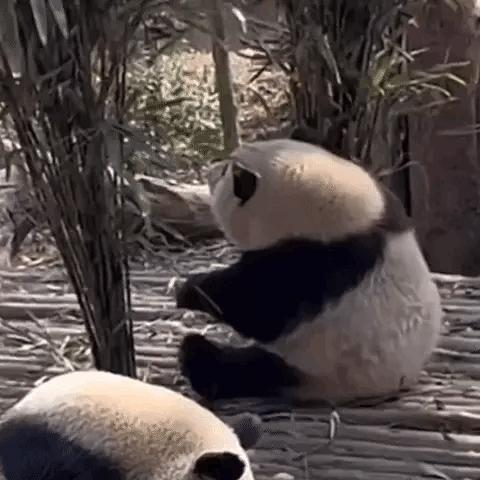

二、交通指南 市区直达公交专线 （2025春节新增）： 宽窄巷子→西门：熊猫基地区间线，3站直达，45分钟，票价8元，全天运行（8:30-15:00发车）。 春熙路→南门：优化直通车，40分钟直达，票价8元（普通车）/12元（双层巴士），全天运行。 东客站→南门：仅节假日运行，票价7元，7:00-16:00发车。 地铁接驳：408路（地铁熊猫大道站→南门）、409路（军区总医院站→西门），票价2元，7:15-17:30运行。 自驾注意事项 （春节临时管控）： 南门 ：需通过“蓉e行”公众号预约通行（7:00-16:00），未预约车辆禁入。 西门 ：禁止私家车通行，建议地铁3号线至军区总医院站换乘摆渡车（车程3分钟）。 停车场接驳线 ：大草坪/石马停车场→南门，客满即走，票价2元。

三、门票与优惠 票价：全票55元/人，半票27元（仅限川渝身份证、本科及以下学生）。 免票人群：现役军人、60岁以上老人（刷身份证入园）、6岁以下儿童等。 套票推荐： 门票+熊猫时空馆：108元（原价153元），含虚拟过山车体验。 VIP讲解+茶歇：188元（原价298元），含中高级中文讲解。

四、游玩路线推荐 南门经典路线（2.5小时）： 南大门→大熊猫博物馆→成年大熊猫别墅→太阳产房→月亮产房→幼年熊猫别墅→小熊猫活动场 亮点：集中观赏各年龄段熊猫，适合首次游客。

西门深度路线（5.5小时） ： 西门→熊猫塔→冒险溪谷→无限山丘→南门 亮点：新增栈桥观猫视角，打卡69.8米高的熊猫塔俯瞰全景。 摄影爱好者路线： 西门→揽月馆→熊猫美术馆→星星产房→熊猫塔 隐藏机位：西门观景平台、栈桥高低视角。

五、必看贴士 看花花攻略 ： 活跃时间 ：7:30早餐、14:00-14:30“体育课”，午休11:00-14:002。 位置 ：幼年大熊猫别墅（52号兽舍），建议8:00前到南门排队。

观光车 ： 票价 ：30元/人，1.3米以下儿童免票（不占座）。 路线 ：覆盖南门至西门全园，推荐购买节省体力。

避峰建议 ： 最佳时段 ：7:30开园即入，或下午14:30后（避开午休）。 节假日预警 ：五一/春节日均客流超2.5万，建议错峰或选择西门入园。 成都熊猫基地 vs 都江堰熊猫谷 简要对比

| 维度 | 熊猫基地 | 熊猫谷 |
|---|---|---|
| 人流密度 | 极高（日均2.5万+）1 | 较低，体验更静谧 |
| 交通便利性 | 市区直达，多专线公交3 | 需高铁+打车（成都→离堆公园站） |
| 特色亮点 | 明星熊猫（花花）、科普设施完善 | 散养红熊猫、生态自然景观 |
| 适合人群 | 首次游客、亲子家庭 | 摄影爱好者、深度体验者 |

都江堰熊猫谷深度游 主题 ：零距离接触小熊猫 · 避开人潮的治愈之旅 为什么选熊猫谷而非成都大熊猫基地？

| 对比维度 | 成都大熊猫基地 | 都江堰熊猫谷 |
|---|---|---|
| 游客密度 | 日均2万人，网红幼崽需排队1小时+ | 日均3000人，无需拥挤 |
| 观赏体验 | 隔着玻璃或围栏远观 | 小熊猫散养区可近距离（1-3米）观察 |
| 自然环境 | 人工规划园区，商业化明显 | 山谷原生竹林，沉浸式野趣 |
| 互动性 | 禁止投喂，仅限观看 | 小熊猫可能从脚边走过（禁止触摸） |

行程表（一日精华版）

| 时间 | 活动 | 核心体验 | 费用/交通 |
|---|---|---|---|
| 07:30 | 成都→都江堰 | 地铁2号线至犀浦站， 换乘城际铁路（犀浦→离堆公园，30分钟） | 城际票10元，建议购7:30班次 |
| 08:30 | 仰天窝广场自拍熊猫 | 打卡全球最大“自拍熊猫”雕塑（长26米）， 躺平姿势+仰拍 | 免费，离堆公园站出站即达 |
| 09:00 | 熊猫谷 | 重点玩法： - 大熊猫馆：9:00-10:30喂食时间，熊猫最活跃。 - 小熊猫散养区：沿木栈道行走，小熊猫可能擦肩而过（10:00-11:00投喂时段出没率高）。 | 门票55元，打车10分钟（约15元） |
| 12:00 | 午餐（青城三绝） | 推荐餐馆：罗鸡肉（青城山家常菜） - 白果炖鸡（药膳清香）- 老腊肉炒蒜苗（烟熏味浓郁） - 洞天乳酒（浅尝即可，后劲大） | 人均50元，距熊猫谷3公里 |
| 13:30 | 都江堰水利工程 | 省力路线： 秦堰楼入口→二王庙→安澜索桥→鱼嘴→飞沙堰→宝瓶口（全程下坡）- 必看：安澜桥全景、鱼嘴分水原理 | 门票80元，打车15分钟（约20元） |
| 16:00 | 南桥“蓝眼泪”+灌县古城 | 拍摄指南： - 南桥灯光19:00亮起，选桥中央拍倒影对称构图。 - 古城必吃：文革葱葱卷（酸甜辣）、赵卖面红油水饺 | 免费，步行穿过南桥即达古城 |
| 20:00 | 返程成都 | 离堆公园站→犀浦站（末班车21:55），地铁返程 | 城际票10元，提前1小时购票 |

熊猫谷小熊猫互动全攻略 最佳时段： 10:00-11:00：饲养员投喂苹果块，小熊猫聚集在栈道旁。 14:00-15:00：午睡后活动期，可能溜达到游客路径。 拍照技巧： 用长焦镜头（70-200m m）抓拍特写，手机用户可2倍变焦。 蹲低机位，以竹林为背景突出小熊猫灵动感。

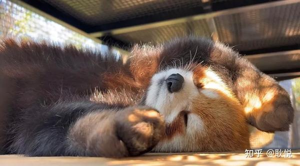

为什么本地人更推荐熊猫谷？ 真正的野生环境 ：熊猫谷位于赵公山麓，大熊猫和小熊猫栖息地模拟自然山谷，动物更活泼。 独家体验 ：小熊猫散养区无玻璃阻隔，时间段对的话可以近距离看到。 但在没有允许的情况下，不要做出触摸和干扰、投喂动物等行为。 避坑指南 交通陷阱：慎选“都江堰景区直通车”，捆绑购物且耗时长，城际铁路+打车更自由。 门票陷阱：都江堰景区门口可能有人兜售“低价票”，务必通过官方公众号购票。 美食陷阱：南桥边“网红龙虾店”价高味一般，地道小吃藏在灌县古城西街。 四川看熊猫三大主流景点

| 景点 | 核心特色 | 适合人群 | 推荐指数 |
|---|---|---|---|
| 成都大熊猫繁育研究基地 | 顶流明星（花花）、科普设施全、交通最便利 | 首次游客、亲子家庭、打卡党 | ⭐⭐⭐⭐⭐ |
| 都江堰熊猫谷 | 人少景美、散养红熊猫互动、自然生态 | 摄影爱好者、深度体验者 | ⭐⭐⭐⭐ |
| 都江堰熊猫乐园 | 科研保育基地、游客极少、可参与志愿者活动 | 研学旅行、小众爱好者 | ⭐⭐⭐ |

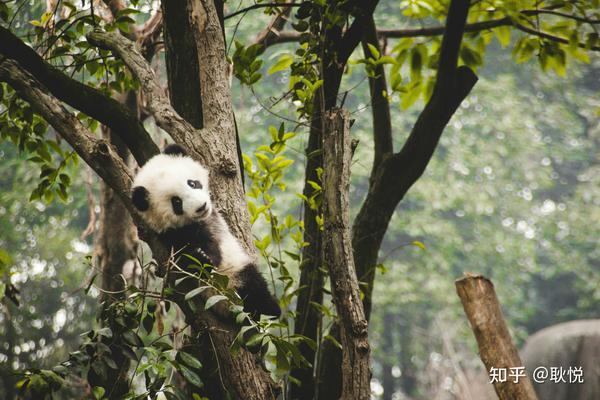

其他值得关注的熊猫基地 （适合时间充裕者） 雅安碧峰峡基地 亮点：唯一可夜宿的熊猫基地（帐篷营地），参与“熊猫铲屎官”体验（清理圈舍、制作窝头）。 交通：成都自驾2小时，或新南门车站乘大巴直达。 卧龙中华大熊猫苑神树坪基地 亮点：世界最大熊猫野化培训基地，偶遇放归训练的熊猫。 交通： 成都茶店子车站 乘大巴至卧龙镇，换乘景区直通车（车程3.5小时）。 摄影 场景风格与实用技巧 古风红墙与园林意境 推荐地点：望江楼公园南门（免费区竹林与茅草屋）、崇州罨画池（《红楼梦》取景地）、浣花溪竹林溪流。 拍摄要点： 光影利用：清晨8-10点或傍晚16-18点，斜射光穿透竹林或红墙，增强层次感。 构图技巧：用窗棂、拱门作为前景框架，突出纵深感；低角度仰拍红墙与天空比例。 服装搭配：素色汉服或棉麻长裙，避免亮色破坏古韵，可搭配油纸伞、团扇等道具。

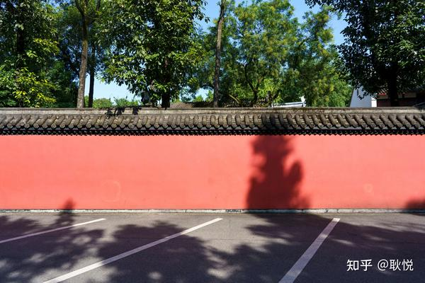

工业废墟与赛博朋克 推荐地点：中车共享城（废弃火车与空中走廊）、东郊记忆（红砖厂房涂鸦）、7322工厂（小众工业风）。 拍摄思路： 情绪营造：阴天或雨天拍摄，降低画面饱和度，突出锈蚀金属的颓废感。 服装选择：深色皮衣、机能风服饰，搭配冷色调滤镜，广角镜头拉伸空间感。 隐藏机位：中车共享城的芦苇丛作前景，东郊记忆的火车头侧面45度俯拍。 3. 文艺街巷与生活纪实 推荐地点：玉林菜市场（水族箱与烟火气）、青石桥花鸟市场（王家卫电影感）、亮佳鸿华二手市场（复古道具）。 捕捉重点： 市井细节：鱼摊水波光影、老茶馆雾气、晾衣绳与自行车，用50mm 定焦镜头 抓拍自然瞬间。 互动技巧：征得摊主同意后拍摄，适当购买小物件（如15元花束）作为道具或答谢。 4. 自然植物与季节限定 推荐地点：三圣乡荷塘月色（倒影与荷叶前景）、植物园沙生馆（仙人掌几何构图）、空港花田（飞机与郁金香同框）。 实用技巧： 避开游客：青龙湖湿地公园二期未完全开发，人少景幽，适合奔跑、野餐等动态拍摄。 花期参考：5-6月绣球花（海蒂的花园）、7月向日葵（永宁基地）、3月油菜花（七彩田野）。 二、光影与建筑创意 几何线条与空间感 必拍地标：茂业中心“筒子楼”（香港同款）、几何书店洞穴楼梯、五岔子大桥莫比乌斯环29。 构图建议： 对称与延伸：茂业中心从底层仰拍或顶层俯拍，利用广角镜头强化纵深感。 夜间灯光：五岔子大桥蓝紫灯光开启后（20:00-22:00），穿黑白纯色服装，手机调至专业模式压低ISO。 三、避坑指南与冷门灵感 避开人流高峰： 热门景点（如太古里、武侯祠）选择工作日早晨或闭园前1小时拍摄。 替代方案：用望丛祠替代武侯祠红墙，用梵木创意园替代东郊记忆。 免费小众场景： 人文纪实：彭镇观音阁茶馆（百年老茶铺）、鸳鸯楼（80年代港风居民楼）。 自然野趣：太平寺机场草原（季节限定花草）、哼哼农场（欧式风车与稻田）。 设备与后期： 手机拍摄：开启“专业模式”手动调节白平衡（古风暖调、工业风冷调）。 修图思路：古风片加暗角与颗粒感，赛博朋克拉高蓝色与紫色饱和度。 四、网友私藏路线 一日创作线： 上午：彭镇茶馆（人文）→中车共享城（工业） 下午：青龙湖二期（自然）→几何书店（光影） 夜晚：五岔子大桥（赛博朋克） 古风沉浸线： 全天：罨画池（园林）→浣花溪（竹林）→望江楼（唐风建筑）

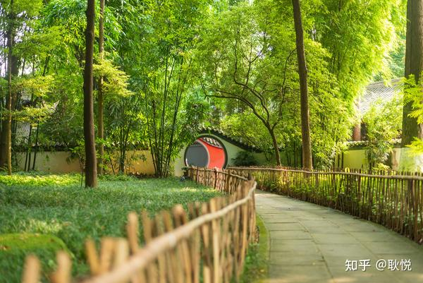

值得看的展览 以下是2025年春节期间成都最值得关注的重磅展览推荐， 聚焦文物价值、文化深度与独特体验，精选内容如下： 一、历史与文明主题 《锦城丝管：和合共鸣的音乐成都》 （成都博物馆） 亮点 ：联合故宫博物院、敦煌研究院等30余家文博机构，展出 88件国家一级文物 ，包括八千年前的贾湖骨笛、唐代雷威制“彩凤鸣岐”七弦琴等音乐瑰宝。展览以“先秦至宋元”为时间线，复刻云冈石窟“音乐窟”数字光影场景，结合126场音乐快闪、古乐表演等活动，展现中国音乐史的恢宏脉络。 展期 ：2025年1月21日-5月5日（春节期间开放至19:00，除夕至17:00） 门票 ：免费，需实名预约 《传奇之旅：马克·波罗与丝绸之路上的世界》 （四川博物院） 亮点 ：展出 84件意大利文物 及190余件丝路文物，涵盖油画、手抄本、瓷器等类别，重现马可·波罗的东方探险与东西方文明交融史。展品包括元代《马可·波罗游记》早期抄本、波斯地毯等。 展期 ：2024年12月21日-2025年4月15日 门票 ：成人票85元，学生票45元 我想去看这个：

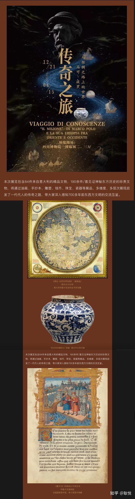

《礼蕴天地，和合致美——文物里的东方生活美学展》 （成都武侯祠博物馆） 亮点 ：北京故宫博物院与沈阳故宫联合展出 100余件清代宫廷文物 ，如乾隆款“金瓯永固”杯、明黄色缂丝龙袍等。展览融合西蜀园林与东方美学，打造沉浸式哲思空间，展现古代礼仪与生活艺术的融合。 展期 ：2025年1月16日-6月15日 门票 ：需购买武侯祠门票（具体票价待定） 二、艺术与先锋探索 《世纪破晓——俄罗斯国家博物馆藏先锋主义艺术展》 （成都市美术馆A区） 亮点 ：集结 康定斯基、夏加尔、马列维奇 等4位大师的86件作品，包含9件中国首展作品。展览通过互动游戏与音乐联感，深入解析抽象艺术，展现俄罗斯先锋主义的革新精神。 展期 ：2024年12月29日-2025年3月30日 门票 ：免费，需预约 《徐冰：有问题就有——》（成都市美术馆B区） 亮点 ：徐冰代表作《天书》与太空艺术探索成果同展，包括“徐冰天书号”火箭残骸、载荷舱金箔等实物，探讨艺术与科技的边界45。 展期 ：2024年12月20日-2025年5月30日 门票 ：免费，需预约 《盐田千春西南首展：宇宙回音》 （A4美术馆） 亮点 ：日本艺术家盐田千春以“线”为媒介创作的大型装置艺术，呈现超强视觉冲击与哲学思考，全球巡展累计观众超百万。 展期 ：至2025年2月16日 门票 ：需购票 三、文化对话与非遗传承 《石壁丹青——四川博物院藏张大千敦煌考察文物展》 （四川博物院） 亮点 ：展出张大千敦煌临摹作品及考察手稿，近三分之一展品为首次公开，展现敦煌壁画的艺术魅力与张大千的学术贡献57。 展期 ：2024年12月18日-2025年3月31日 门票 ：免费 《年画里的中国——全国年画展》 （绵竹年画博物馆） 亮点 ：汇集全国10余个年画产地的代表作品，春节期间免费发放门神与春联，并提供年画印制体验，展现传统民俗文化。 展期 ：2025年1月22日-3月21日 门票 ：免费 四、实用信息 预约建议 ：热门展览（如成都博物馆、武侯祠）需提前1-3天通过官方公众号预约，避开10:00-15:00高峰时段。 开放时间 ：多数博物馆除夕开放至17:00，初一后延长至19:00（如成都博物馆每日限流2万人）。 交通提示 ：成都市内展览场馆多位于地铁沿线（如1号线天府广场站、3号线高升桥站），自驾需注意武侯祠等景区周边临时交通管制。 精选理由 深度文化体验：如“锦城丝管”展以音乐史串联文物，复刻云冈石窟场景，兼具学术性与沉浸感。 国际对话视角：俄罗斯先锋主义展、盐田千春个展等，展现全球艺术流派的碰撞与创新。 稀缺性文物：张大千敦煌手稿、清代“金瓯永固”杯等均为罕见真迹，具有不可替代的历史价值。 更多展览信息可通过“成都本地宝”或各博物馆官方平台查询。 春节期间，成都以“活力成都年”为主题推出千余场文旅活动，展览与非遗、庙会等结合，值得深度探索。

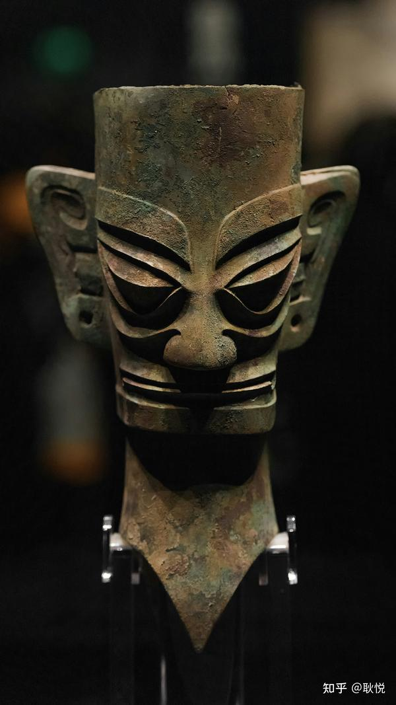

成都主流博物馆校准版总结

| 博物馆名称 | 类型 | 核心特色与必看亮点 | 门票 | 开放时间 | 适合人群 |
|---|---|---|---|---|---|
| 四川博物院 | 综合人文历史 | 常设展《古代四川》全面展示先秦至清代文物，重点推荐张大千临摹敦煌壁画专题展。 | 免费（需预约） | 9:00-17:00（周一闭馆） | 历史爱好者、文化学者 |
| 成都博物馆 | 综合人文历史 | 1F《人与自然》动物标本互动墙；2-3F《花重锦官城》成都通史展；5F中国皮影木偶展（可点播皮影戏）。 | 免费（需预约） | 9:00-20:30（周末至22:30） | 亲子家庭、文化打卡者 |
| 成都自然博物馆（成都理工大学博物馆） | 自然科学 | 亚洲最大完整马门溪龙化石、全球罕见合川马门溪龙皮肤化石、矿物晶体馆（如3吨重的“自然铜”）。 | 免费（需预约） | 9:00-17:00（周一闭馆） | 亲子、地质爱好者 |
| 金沙遗址博物馆 | 文化遗址 | 太阳神鸟金饰、黄金面具、十节玉琮；鹿苑可互动投喂梅花鹿（9:00-17:00）。 | 70元（学生半价） | 9:00-18:00 | 古蜀文明探索者 |
| 三星堆博物馆 | 文化遗址 | 青铜神树、青铜立人像、金杖；新馆2024年开放，文物数量翻倍（原馆闭馆至2025年）。 | 72元（学生半价） | 8:30-17:30 | 考古迷、文化深度游 |
| 成都蜀锦织绣博物馆 | 非遗技艺 | 清代花楼木织机现场演示、蜀绣双面异色绣精品（如熊猫竹林图）；可体验织锦（需预约）。 | 免费（体验项目另收费） | 9:00-17:30 | 非遗爱好者、手工达人 |
| 成都川菜博物馆 | 饮食文化 | 豆瓣制作体验、川菜原料展区、小吃无限量供应（钟水饺、担担面等）。 | 60元 | 9:00-18:00 | 吃货、川菜文化爱好者 |
| 天府美术馆 | 现当代艺术 | 常设展《川流不息》呈现四川当代艺术脉络；建筑本身为拍照打卡点（扎哈·哈迪德设计）。 | 免费（需预约） | 10:00-21:30（周一闭馆） | 艺术爱好者、摄影达人 |

小众博物馆补充推荐

| 博物馆名称 | 类型 | 亮点 | 门票 | 适合人群 |
|---|---|---|---|---|
| 四川大学博物馆 | 综合人文自然 | 西南最早综合性大学博物馆，藏有清代至民国书画、少数民族文物。 | 免费（需预约） | 学术研究者、高校学生 |
| 华希昆虫博物馆 | 自然科学 | 世界最大蝴蝶标本墙、被《时代》评为“亚洲最大昆虫博物馆”。 | 免费 | 昆虫爱好者、亲子家庭 |
| 立巢航空博物馆 | 科技 | 可体验模拟飞行、近距离观察退役客机（如波音737）。 | 158元 | 航空迷、科技控 |
| 水井坊博物馆 | 工业遗产 | 原址展示明清酿酒作坊，可品尝原浆酒。 | 50元（含品酒） | 酒文化爱好者 |

实用建议 预约方式 ： 免费场馆（如成都博物馆、四川博物院）需通过官方公众号提前1-3天预约，节假日名额紧张。 收费场馆建议线上购票（如金沙遗址、三星堆），避免排队。 交通指南 ： 市区场馆 ：地铁1/2/3号线覆盖主要博物馆（如天府广场站→成都博物馆）。 周边场馆 ：三星堆需从成都东站乘高铁至广汉北站（18分钟），再打车10分钟抵达。 亲子友好度 ： 高互动性 ：成都博物馆（皮影戏）、川菜博物馆（烹饪体验）、自然博物馆（恐龙化石）。 低龄慎选 ：四川博物院（文物密集）、蜀锦织绣博物馆（需安静观察）。 书影音 ️“认识一座城，从读懂它的文字开始。” 这份书单既是旅行指南，亦是文化地图，愿您透过纸页，触摸四川的体温与心跳。 一、书籍阅读：解码四川文化基因 1. 历史与文明 《成都街巷志》 （袁庭栋，豆瓣9.2） 推荐理由 ：街巷是城市的血脉，本书以600余条街巷为线索，揭示成都2300年建城史，堪称“行走的成都百科全书”。适合作为城市漫步的指南书。 《茶馆：成都的公共生活和微观世界》 （王笛，豆瓣8.5） 推荐理由 ：通过茶馆这一微观视角，还原1900-1950年成都的市井生态，社会学研究典范。搭配武侯祠红墙游览，体验更佳69。 《古蜀文明与三星堆文化》 （肖平，豆瓣8.1） 推荐理由 ：以考古发现串联古蜀文明脉络，解读三星堆青铜神树、金杖之谜，适合参观三星堆新馆前预习69。 2. 饮食与生活 《鱼翅与花椒》 （扶霞·邓洛普，豆瓣8.3） 推荐理由 ：英国美食作家笔下的川菜冒险，从麻婆豆腐到脑花火锅，幽默中透视中西文化碰撞。可搭配川菜博物馆豆瓣制作体验。 《成都茶馆：一市居民半茶客》 （何小竹） 推荐理由 ：当代作家记录老茶馆的竹椅、盖碗与龙门阵，再现“慢成都”精髓。建议与彭镇观音阁茶馆摄影之旅结合。

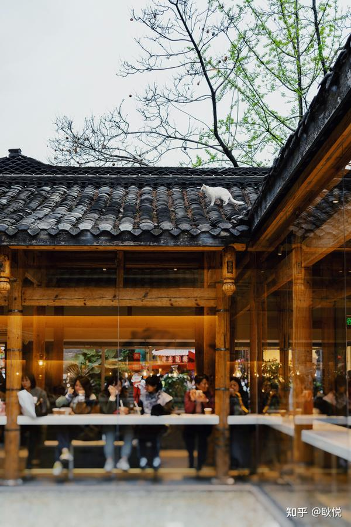

二、 天府文化 学者读物 1. 学术深度 《论巴蜀文化》 （徐中舒） 特色 ：巴蜀文化研究里程碑，汇集史学泰斗徐中舒7篇论文，解析古蜀与中原文明的互动关系。 《国中的“异乡”》 （王东杰） 特色 ：以近代四川为样本，探讨地域认同与文化变迁，学术性与可读性兼具。 2. 人文随笔 《蜀地笔记》 （蒋蓝，豆瓣8.1） 特色 ：田野调查+文献考据，解密金沙铜人、蜀绣等符号，适合喜欢“文化侦探”式阅读的读者。 《 天府的记忆 》 （袁庭栋） 特色 ：央视纪录片配套读物，从宝墩古城到公园城市，脉络清晰易读。 三、青少年专区：历史名人小说系列 《汤汤水命：秦蜀郡守李冰》 （凸凹） 亮点 ：以小说形式再现李冰治水传奇，搭配都江堰游览，激发少年水利工程兴趣。 《草堂之魂：一代诗圣杜甫》 （吴佳骏） 亮点 ：从杜甫草堂到《春夜喜雨》，串联诗圣与成都的情感羁绊，适合亲子共读。 四、小众精选：发现另一个四川 1. 市井烟火 《成都市井》 （曾智成） 特色 ：记录菜市场吆喝、老街匠人，文字如老照片般定格消失中的市井成都。 《百年车风景：成都交通与影像》 （张建） 特色 ：从鸡公车到地铁，透过交通工具变迁看城市现代化进程6。 2. 非遗与技艺 《蜀锦织绣》 （成都蜀锦织绣博物馆编著） 特色 ：图解蜀锦“挑花结本”工艺，附体验馆地址，可阅读后亲手织造方巾。 五、旅行者书单：边走边读 《孤独星球：四川》 （2023新版，豆瓣8.4） 亮点 ：覆盖三星堆新馆、自然博物馆等最新景点，路线设计兼顾文化深度与摄影需求6。 《寻路中国》 （彼得·海斯勒，豆瓣9.0） 亮点 ：非虚构写作典范，含川西公路见闻，展现全球化冲击下的乡土中国。 使用场景建议 行前预习 ：《成都街巷志》+《孤独星球》→ 定制专属CityWal k路线。 亲子共读 ：青少年历史小说+《茶馆》→ 成都博物馆皮影戏体验+茶馆打卡。 深度研究 ：《论巴蜀文化》+《蜀地笔记》→ 三星堆/金沙遗址学术参访。 延伸资源 图书馆活动 ：2025年春节期间，四川省图书馆推出“灵蛇献瑞”文化展、雕版印刷体验等活动，可现场借阅推荐书目。 书店导航 ：方所成都店（太古里）、读本屋（华西坝）设有天府文化专题书架。

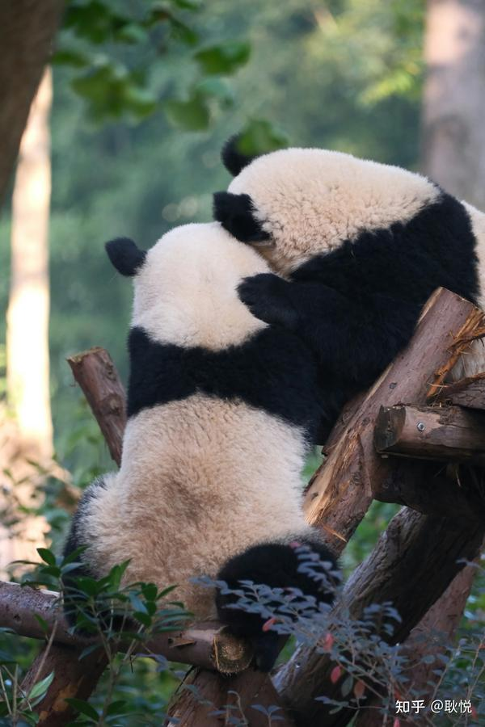

书店 天府人文艺术图书馆（金牛区） 地铁2号线迎宾大道站D口+步行15分钟 来看一下我在成都呆过的最久的图书馆，也是这个城市最美的一个图书馆。

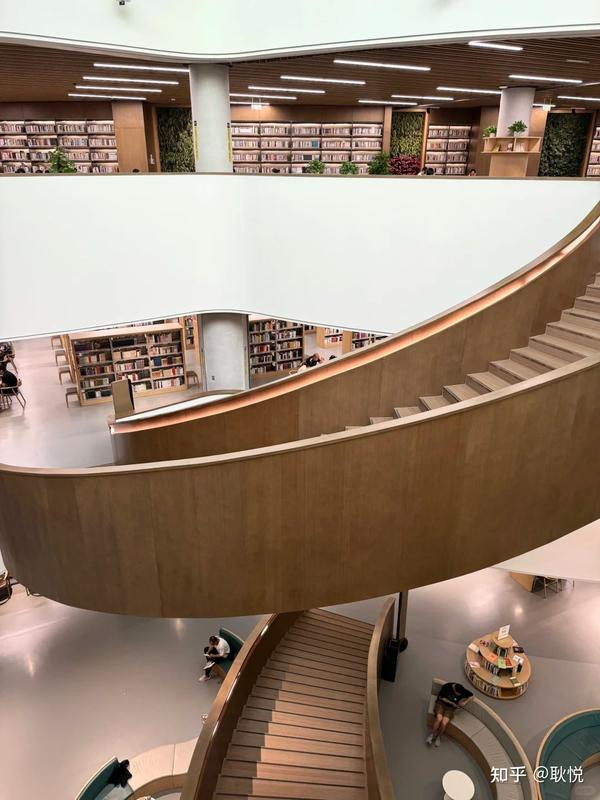

旅途愉快！ Have Fun！️ 对这个版本说明一下： 对五一版本的距离/时间，校准了一下，更新的春节版。 这版我使用了新的AI，校准了景点之间的距离， 让景点之间切换流畅且合理。 增加本地人私藏建议，市郊周边， 基于网络上的用户积攒的评价而成。 新增这一部分，因为我并没有真的去吃喝玩体验到， 估计还存在一部分偏差， 主要提供多面选择，按照自己喜好去也很方便。 （如果有人使用有些细节有误差， 也欢迎给我留言，会继续编辑）。 不要用完美主义来对看待它。 也许数据还是不够精准，会继续迭代。 拓展阅读 有哪些适合春节去旅行的宝藏目的地？ 你有没有因为一个历史名人而去一个城市旅行？ 三亚、大理、成都、青岛等热门旅行城市有哪些「平替目的地」？ 关于成都，有哪些本地人才知道的冷知识？ 五一出游高峰期将至，作为本地人，你会如何向游客「带玩」你的家乡？

---

## 版权

本文由耿悦原创，版权所有。未经许可不得转载或商业使用。
