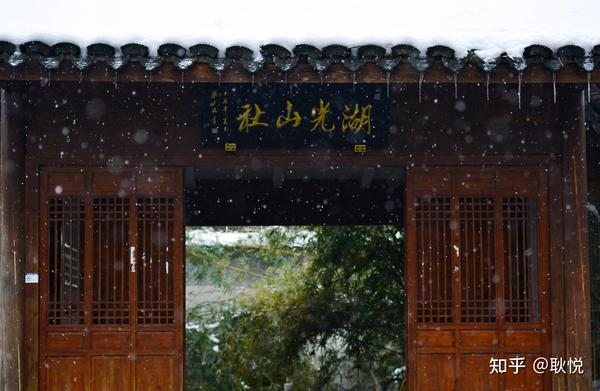

# 一首诗，一座城 · 充满诗意的地名

潇湘 · 姑苏 · 长安 · 锦官城

---
古诗词里，有一部分对应城市名称的，有的诗意 潇湘-湖南 明· 何景明 《雁》诗： 长风度关塞，九月下潇湘。“ 潇湘 ”一词始于尧代。 《山海经·中山次十二经》洞庭之山 “帝之二女居之，是常游于江渊。 澧沅之风，交潇湘之渊”。

云梦一孝感市 云梦县 去雁远冲云梦雪，离人独上洞庭船。 风波尽日依山转，星汉通霄向水连。 唐 李频《 湘口送友人 》 置县于公元550年，汉代前仅指古 云梦泽， 晋代以后，包含洞庭湖等大部分楚地。 近代， 云梦睡虎地 出土大量秦简和铸币 为神秘浪漫的 楚文化 和秦代历史文化揭开神秘一角。 姑苏-苏州 月落乌啼霜满天，江枫渔火对愁眠。 姑苏城外寒山寺，夜半钟声到客船。 唐 张继《枫桥夜泊》 始建于西周时期，4000 年文化沉淀。 小桥流水，江南风景如画，黛瓦白墙，苏式园林赏心悦目。

一首诗，一座城 你居住的城市，对应了哪首诗词吗？ 成都 野径云俱黑，江川火独明。 晓看红湿处，花重锦官城 唐 杜甫《春夜喜雨》 长安 昔日龌龊不足夸，今朝放荡思无涯。 春风得意马蹄疾，一日看尽长安花。 唐 孟郊 《登科后》 九江 浔阳江 头夜送客，枫叶 荻花 秋瑟瑟。 主人下马客在船，举酒欲饮无管弦。 唐 白居易《 琵琶行 》

金华 风住尘香花已尽，日晚倦梳头。 物是人非事事休，欲语泪先流。 闻说双溪春尚好，也拟泛轻舟。 只恐双溪舴艋舟，载不动许多愁。 宋 李清照《武陵春》 襄阳 襄阳好风日，留醉与山翁。 唐 王维《 汉江临眺 》 咸阳 渭城 朝兩浥轻坐，客舍青青柳色新。 劝君更尽一杯酒，西出阳关无故人。 唐 王维《送元二使西安》

琅琊-临沂 双飞龙剑出天涯，烨烨寒光射彩霞。 碧海 楼台 环碣石， 青山城郭抱琅琊。 明 胡应麟 《寄喻邦相二首 其二》 西周建城，至今历史三千多年。 20万年前 东夷文化 的发祥地。 湖州 西塞山前白壁飞，桃花流水鳜鱼肥。 青箬签，绿蓑衣，斜风细雨不须归。 张志和 《渔歌子西塞山前白鹭飞》 洛阳 谁家玉笛暗飞声，散入春风满洛城。 此夜曲中闻折柳，何人不起故园情。 李白《 春夜洛城闻笛 》 宣城 众鸟高飞尽，孤云独去闲。 相看两不厌，只有敬亭山。 李白 《独坐敬亭山》 

---

## 版权

本文为耿悦原创，版权所有。未经许可不得转载或商业使用。
