# 庞贝古城 · 一座在时空中冻结的城

维苏威火山下的生死与重现

---
​ 目录 庞贝古城 最无常，残酷，神秘。这是一座“在时空中冻结”的古城。 在公元七十九年八月二十四日，庞贝古城被火山灰掩埋，至今已经有一千九百多年了。 在庞贝旅行的感受，世界上独一份。 跟任何古迹都不相同。凭着细节，可以穿梭回具体的古城。

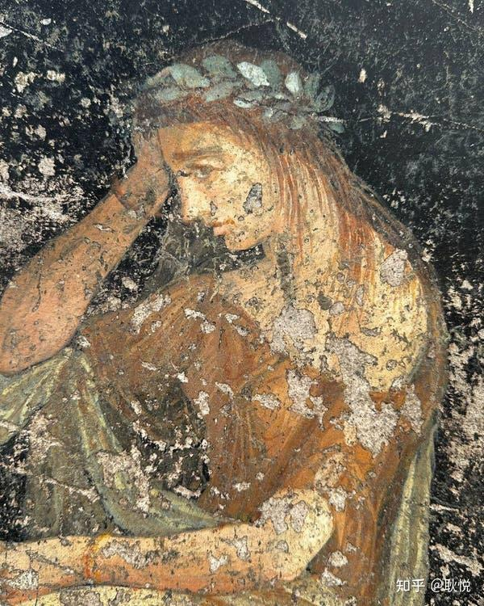

会直观面对感伤故事： 一夜之间，一座城市和活生生的人， 在一片灰烬中消失。时间在这里倏然停顿。 人类群体，在亳无预告的情況下集体死亡、霎时毁灭。

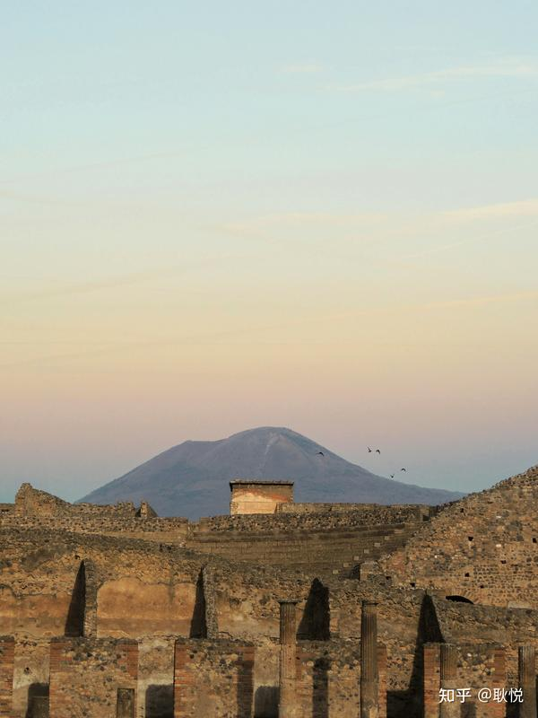

就像摄影一样，把前人们的绝望和困惑，瞬间定格了。 火山 在意大利坎帕尼亚地区的维苏威火山，发生了规模巨大的喷发活动。

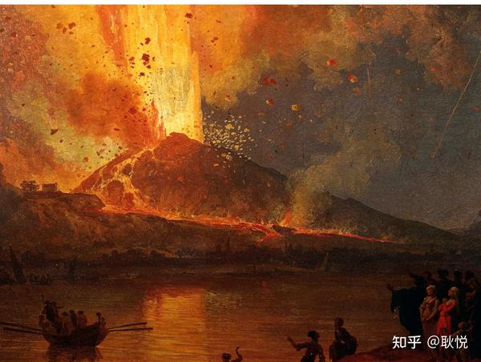

“火山碎屑涌浪”——这是一股高速移动的混合着各种气体、火山灰和熔岩的致命燃烧物， 所经之处无物生还，一一击倒。 这出乎了所有人的意料。

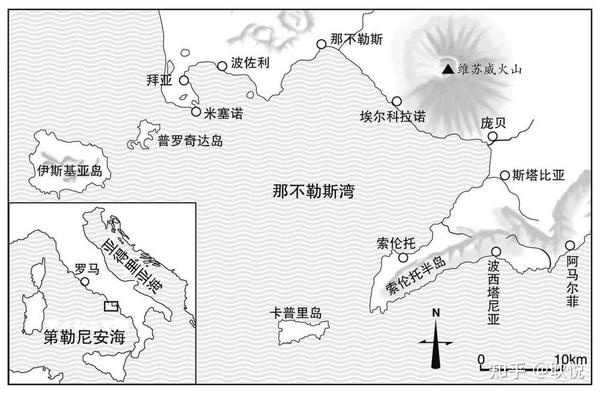

因为它己经900年没有喷发过了，人们都以为它变成了一座死火山。 庞贝人似乎一点儿也不担心。他们把家建在这里。 寻欢作乐，繁荣悠哉。 小普林尼 有一个人见证了公元79年夏天的这场悲剧。 罗马著名作家小普林尼（Plinythe Youn ger， 约公元61年一公元113年）当时年仅18岁。他和妈妈来看望叔父老普林尼。 "我以为我和世界一起毁灭了”。

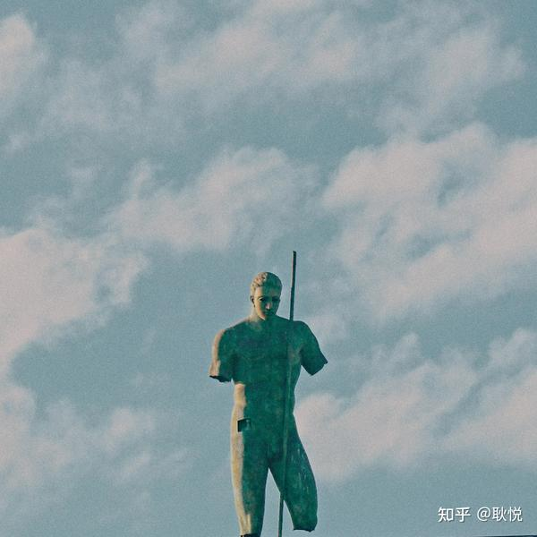

我环顾四周：我们身后有一片浓密的乌云袭来，如洪水般覆盖大地。 这时黑暗袭来，不是无月或多云之夜的黑暗， 而是如同在一问封闭的房间内灯光被熄灭之后的漆黑。你可以听到妇女的尖叫、婴孩的哭号和男人的呼喊… 灰烬重新开始落下，但这次如强阵雨般下落。 我们问或站起抖落灰尘，否则我们会在其重量下被埋没压垮。 最后，黑暗逐渐淡去，消散于浓烟或乌云之中； 真正的日光随之而来，太阳也真切地显露出来，但就像日食时一样泛黄。 我们惊恐地发现一切都发生了变化，均深埋在雪堆般的灰烬中。” （小普林尼：《书信集》）

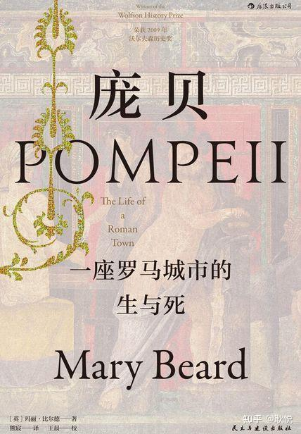

注明 除了我个人的旅行感受外，当时对很多历史还不了解， 读过一些资料，书摘主要来自于《庞贝，一座罗马城市的生与死》，一点一滴，拼凑起一幅庞贝处于鼎盛时期的详尽画面。

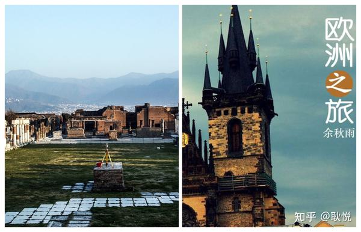

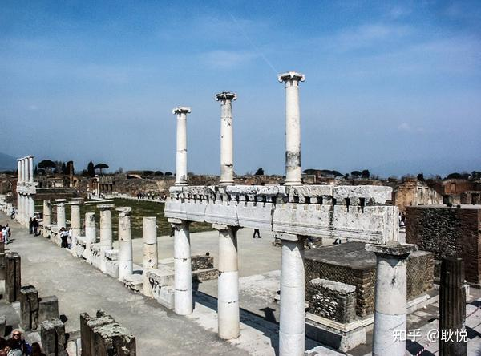

谷歌艺术，国家地理，《欧洲之旅》。对于如此深厚复杂的城市来说，庞贝的阅读体验很神奇， 就好像走进神秘建筑里的穿越之旅。全文 5052 字。也是借题对这座古迹的回望之旅。 绝望 无数来不及逃跑的人被炙热的火山灰烫死或窒息而死， 空气中充满了灰烬，建筑物坍塌， 庞贝等城镇被4至6米厚的火山灰和浮石掩埋。 直至数个世纪后，才重新被发现。

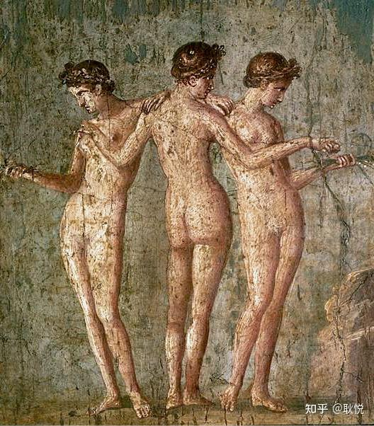

美惠三女神 约公元前1世纪 庞贝壁画 那不勒斯考古博物馆 Pompeii Bodies 约有 2000 名居民死于庞贝城内， 但火山爆发总共夺走了庞贝、赫库兰尼姆以及该地区其他城镇和村庄多达 16000 人的生命。 男性、女性、儿童和动物的尸体，都被冻结在它们倒下的地方。

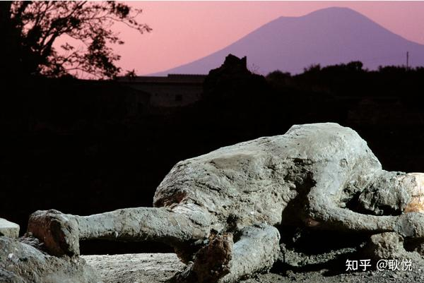

许多尸体被发现时，仍紧紧握着他们希望安全带出城市的有价值的家庭物品。 一些尸体被发现时紧紧环抱着儿童或其他亲人。 后来的考古学家甚至发现了保存完好的果实罐和面包。 城市的大部分建筑完好无损，日常物品和家庭用品仍散落在街道上。

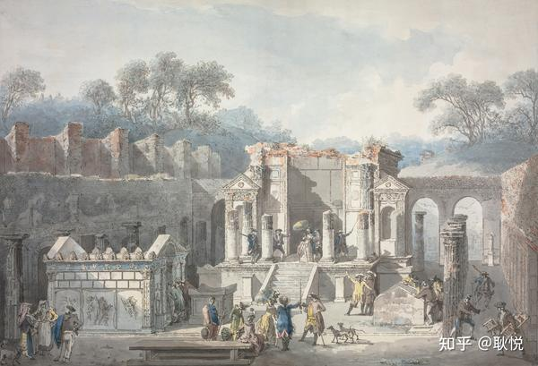

庞贝 庞贝位于意大利西海岸，坐落在拿坡里海湾沿岸，位于现代那不勒斯市南部。 在公元前2世纪受到罗马的影响，随后拿坡里海湾成为罗马富裕度假者的吸引点， 他们喜爱坎帕尼亚海岸线。

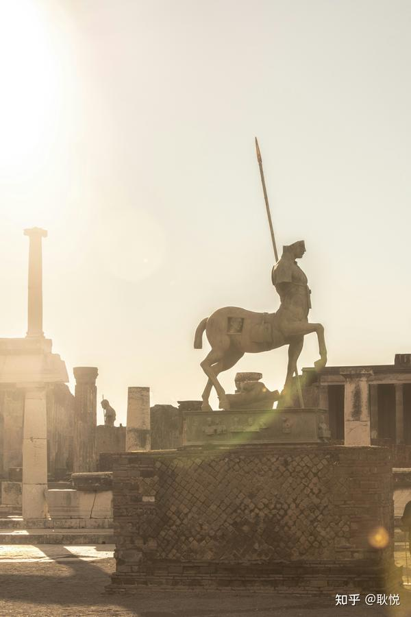

到公元前1世纪末， 庞贝镇距离维苏威火山约五英里， 成为罗马帝国最尊贵公民前往的繁荣度假胜地。 优雅的房屋和精致的别墅—— 许多都填满了精美的艺术品和闪闪发光的喷泉——沿着铺就的街道。 这里成为了闻名遐迩的酒色之都。

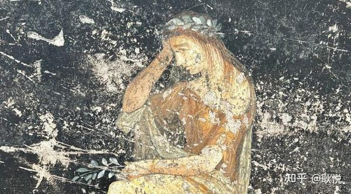

乐园 这里已经成为富人的乐园， 贵族富商纷纷到此营建豪华别墅，尽情寻欢作乐。 为了放松，人们泡在公共浴池里、在拥有2万个座位的竞技场聚集，

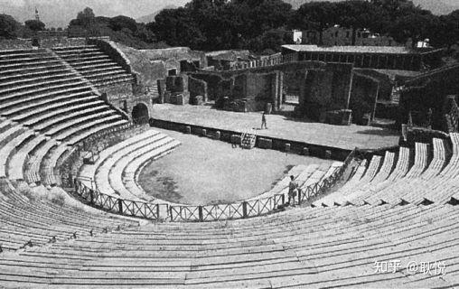

在露天剧场观看角斗士或战车比赛， 悠然休憩在两个剧院欣赏戏剧。

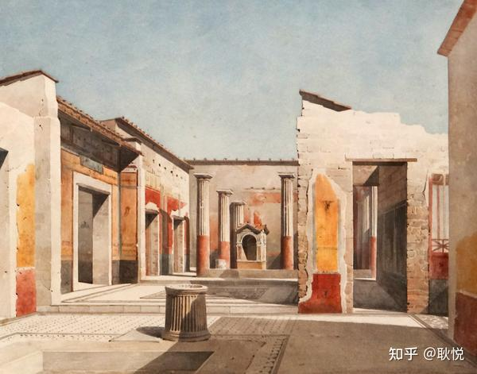

悲剧诗人之家中庭透视图，1825-1830，绘制者：Henri Labro uste。现藏法国国家图书馆。

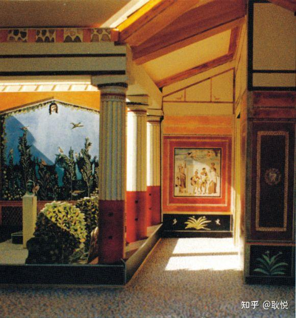

悲剧诗人之家”的列柱廊花园的模型。后墙上绘有花园景色。柱廊下是献祭伊菲格涅亚的著名绘画。 庞贝人热爱花园，并在那里消磨许多时光。 富裕之家一般均有花园，主宅环绕中央天井布置厅堂居室。 花园中有古典柱廊和大理石雕像，厅堂廊庑多施壁画（见庞贝壁画），是古典壁画重要的遗存。 这些壁画都有较高水平，它们被发现后，对欧洲的新古典主义艺术影响甚大。

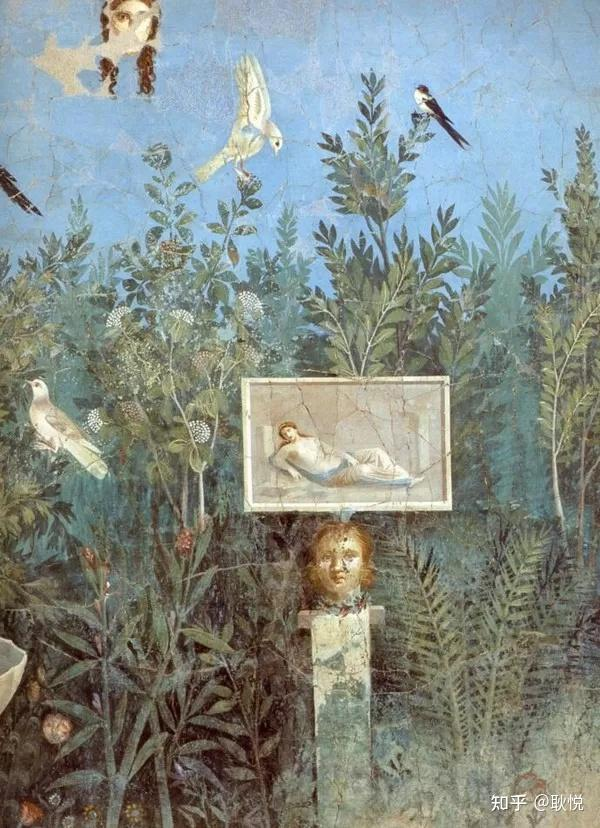

他们一定从来访的歌鸠刺嘴莺、斑鸠、知鸭以及燕子中得到不少乐趣。 在他们宽敞的中庭内种上各种可结果的树木–--橄榄树、胡桃树、杏仁树、梨树、苹果树、无花果树和樱桃树。 这些绘画和同时被发现的精美镶画一起，揭示出大自然在庞贝人心目中的地位、 以及艺术家所赋予这些至今仍洋溢着勃勃生机的作品不朽的生命力。

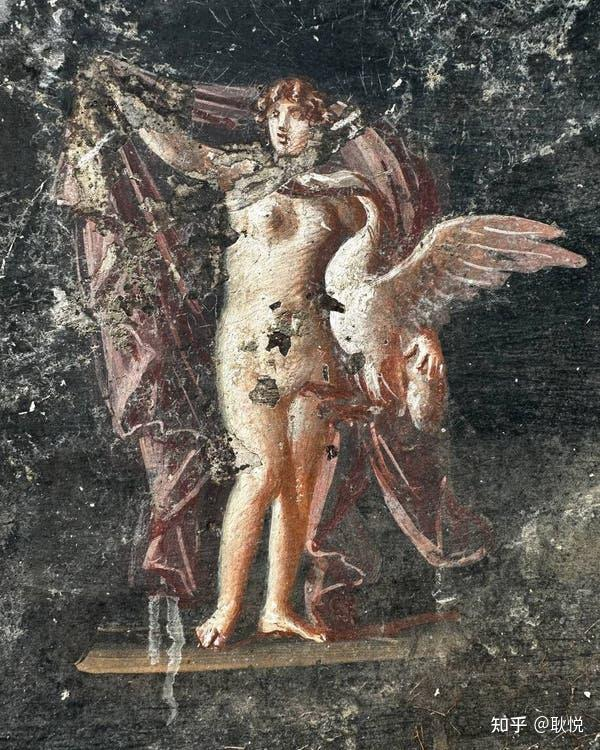

细节 由于生命的倏然而止，这里丝毫没有死亡的气息，更像是静止不动的动画场面。空旷的房问内墙壁上的留言好像还在等待着应答。 火山灰完美地保存了这座精致的城市。 这一切让专家们得以填补许多其他罗马遗址可能无法保存下来的细节。

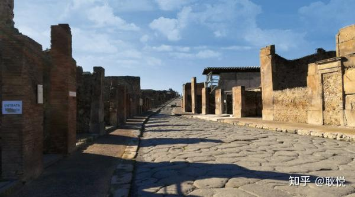

城市版图上交织着五六条主干道。从西北方向来的车马人流可沿着两条宽敞、斜向的街道即执政官街和斯塔比街行走。 这座城市被发掘了出来， 因此我们能够看到在灾难来临之前存在于城市中的街道和房屋、广场和公共建筑、商铺和集市等大部分建筑。 我们可以看到马车经过这条笔直街道时留下的印痕， 也可以看到悬挂在餐厅墙上的精美油画； 我们可以看到烤炉中烤焦的面包和旁边的磨面机械，

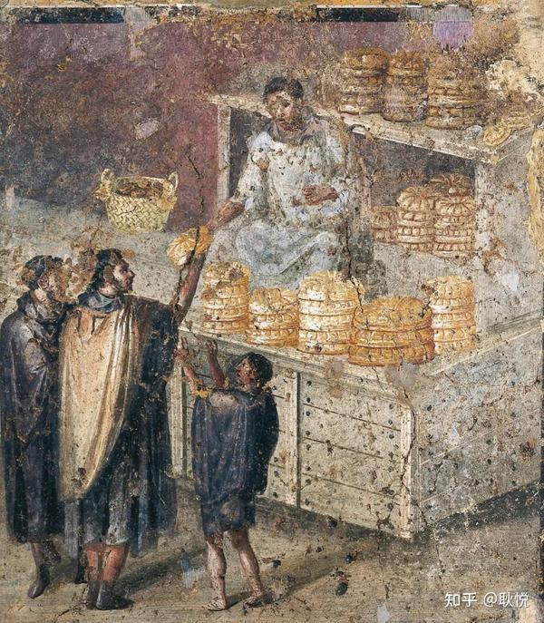

还可以看到厨房里的炊具以及旁边整齐排放在那里准备组装的炉条。 走进这座保存完好的略带凄凉的城市， 我们仿佛看到了早期罗马帝国的真实生活。

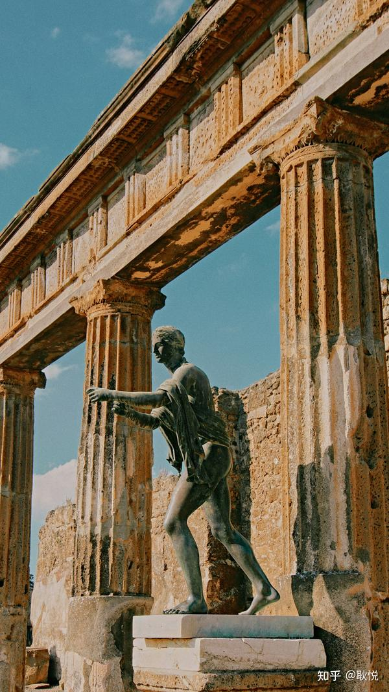

繁荣 在鼎盛时期，这座小城市拥有以贸易和农业为基础的繁荣经济， 养活了大约10,000 至 20,000人的人口。

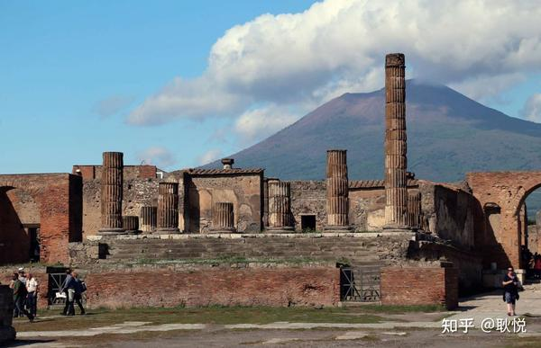

对于一座外省城市而言，这里的景色可谓金碧辉煌： 长方形廊柱大厅，室内市场，更多的神庙， 一个公共图书馆，这一切曾在阳光下色彩斑斓，绚烂夺目。

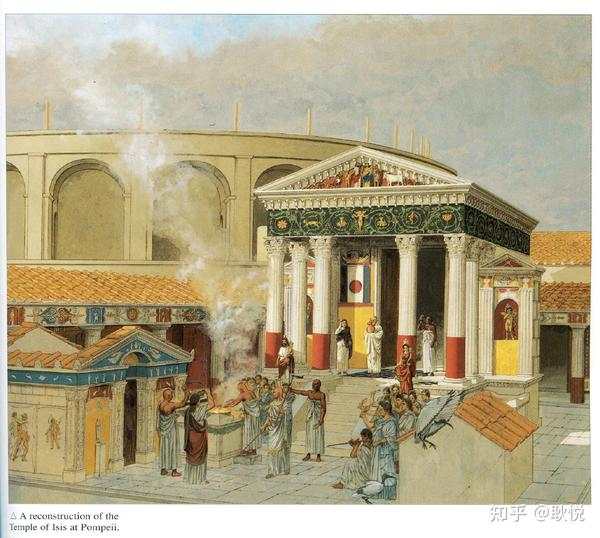

这座城市大部分财富来自其肥沃的火山土壤 ——该地区是橄榄、葡萄和其他农作物的中心，庞贝的葡萄酒在一些罗马最时尚的房屋中受到喜爱。

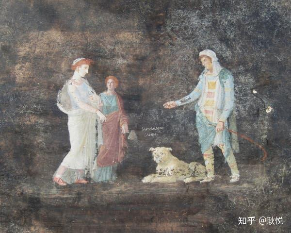

它也拥有复杂的市政供水系统、露天剧场和体育馆， 也有着活色生香，热气腾腾的生活细节。

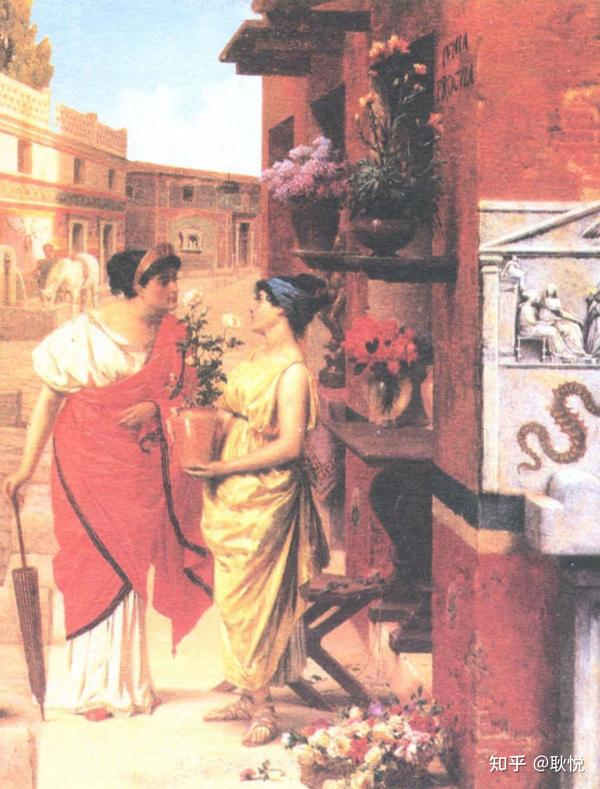

考古学家魔术般地重新搭建起这个社会的框架，从街道、市场、剧院到罗马城市生活的中心所在——酒店。 他们的探索是为了了解活生生的庞贝城，研究都集中在公共建筑和令人叹为观止的别墅上， 它们描绘了城市富裕精英所享受的艺术和奢华生活方式。

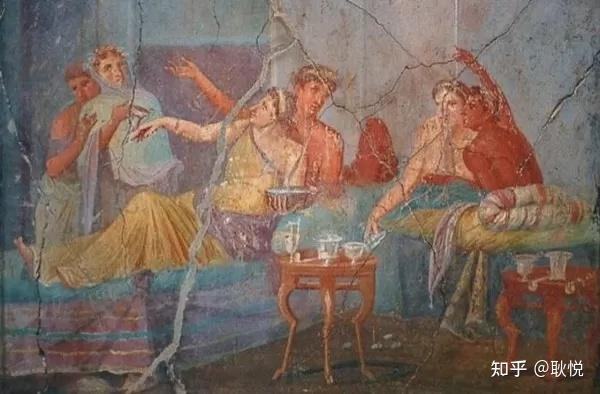

他们试图了解其他98%的人在庞贝是如何生活的， 这些画面在很大程度上加深学者对古典世界的了解， 这些细小的东西，以自己的方式，为考古学家了解过去提供了最珍贵的依据，其重要性无异于任何被埋葬的庙宇或皇陵。

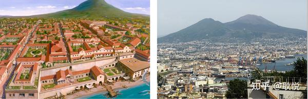

重现 火山灰是一种很好的防腐剂。 19世纪时人们发明了一种高明的技术，能使其中的许多死亡瞬间生动再现。 人们将石膏填充进肉体和衣物分解后留下的空间， 于是撩起的短袍、蒙住的面庞以及受难者绝望的面容都得以一一重现。

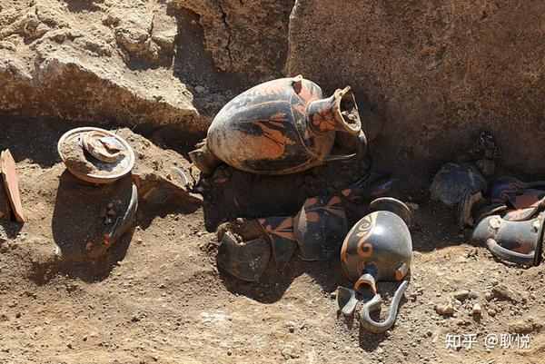

许多学者将庞贝的发掘视为18世纪新古典主义复兴的影响。 欧洲最富裕和最时尚的家族展示了庞贝废墟的艺术品和复制品， 庞贝建筑的图纸帮助塑造了当时的建筑趋势。

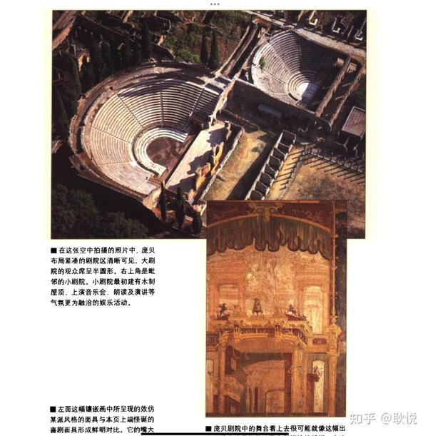

庞贝的挖掘已经持续了近三个世纪，整个遗址被列为联合国教科文组织世界遗产地。 学者和游客对这座城市的诡异废墟以及2000多年前那个被埋在这一命运之日上的文物和尸体仍然如18世纪时一样着迷。

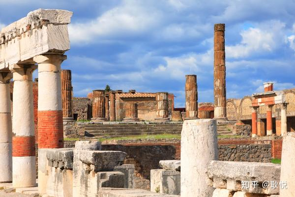

"很多灾难降临到这个世界，" 德国哲学家兼诗人歌德在1780年代参观庞贝废墟后写道， “但很少有一个给后代带来如此多的愉悦。” 畅想 正是这种直接亲历的感觉使庞贝街景如此令人难忘。 那些车辙印几乎相当于古人的足迹， 是人类活动以及曾在这些街道上奔波的过往车辆不可磨灭的记号……

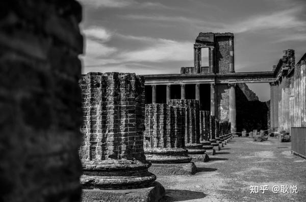

这些如今支离破碎且褪色的饰带提供了各类珍贵的线索， 让我们得以开始给庞贝的城市景观注入生气， 而且不仅仅是与身穿白色托加袍的人有关的景观（实际上有关他们的相当少）。

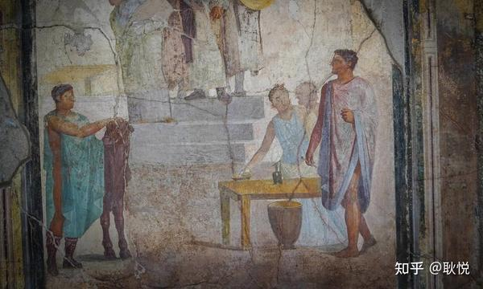

它促使我们去想象上课的孩童、讨钱的乞丐、各路商人小贩，或者忙于公务的当地官员…… 游客、城镇居民和奴隶忙碌于小工厂和工匠店、酒馆、咖啡馆、妓院和浴场之间……

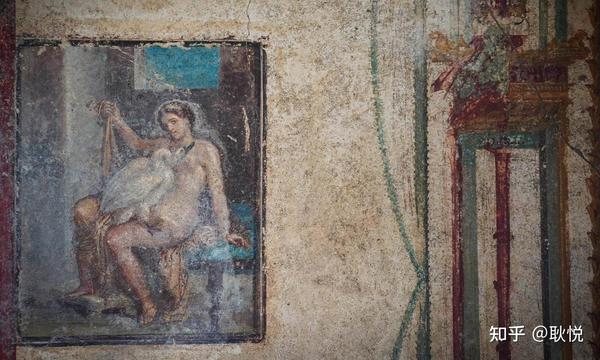

旅行 对于早期的游客而言，这奠定了他们的庞贝之行的基调。 庞贝是发生了一出人间悲剧之地，是亡者之城。 在他们开始游览之际，首先映入眼帘的墓冢会勾起他们的万千思绪（尽管墓碑的主人多半是在病榻上溘然长逝的）， 令他们感慨人生的转瞬即逝，以及所有人无论高低贵贱都无法逃避死亡。 土归土，尘归尘，这对庞贝来说也是合适的。

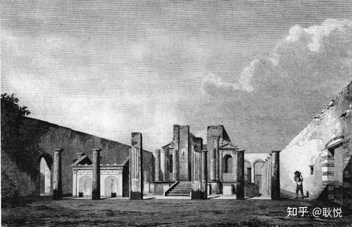

伊西斯神庙是早期最受欢迎的景点之一， 从年轻的莫扎特到《庞贝末日》（The Last Daysof Pomp eii）的作者爱德华·布尔渥－利顿（Edward Bulwer-Lyt ton）， 无数作者和音乐家都受到了它的启发。

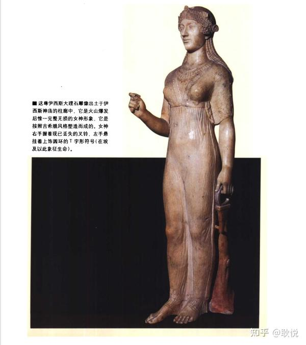

在这幅版画中，位于中央的是主神庙，左边是用围墙包围起来的一个小水池，其中所蓄之水用于伊西斯宗教仪式。

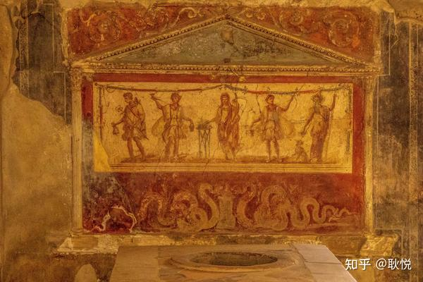

浴场让普通庞贝浴者得以一窥奢华。 这幅19世纪的绘画再现了斯塔比亚浴场的环境氛围。

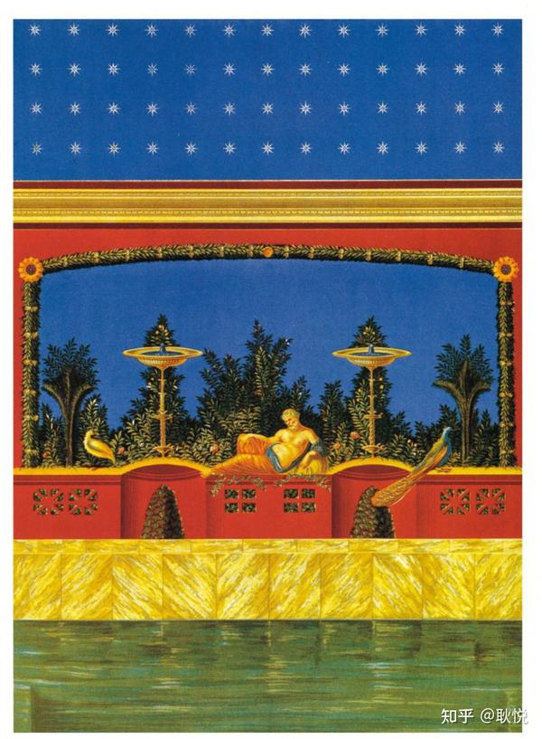

庞贝遭受的灾难与神户大地震不同，是一次百分之百的天灾。 庞贝城灾难降临之时， 倒是处处闪烁着人性之光。 老普林

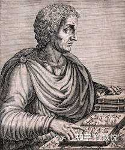

《自然史》的作者老普林尼(Gaius Plinius Secundus)。他是罗马帝国的伟大人物之一，撰写了一部37卷的自然百科全书，还担任罗马舰队的海军上将。 他主要营救逃在海上或躲在岸边的人。 当普林尼的船接近赫库兰尼姆附近的海岸时，煤渣和浮石开始落在船上。 舵手建议返回，普林尼回答说： “命运眷顾勇敢的人；把舵驶向庞波尼亚努斯所在的地方。” 他命令再去救人。

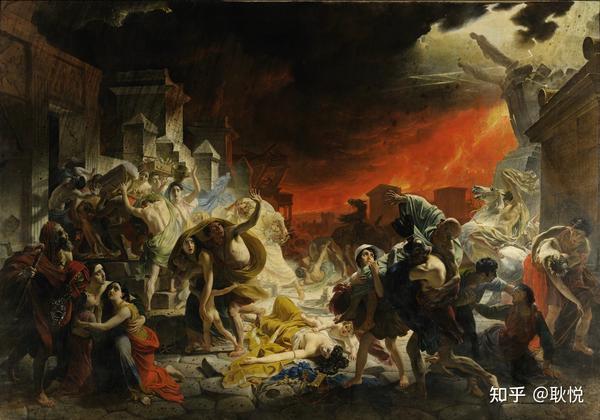

他抱着瑟瑟发抖的朋友们，不断安慰， 为了让他们镇静下来，自己满面笑容，洗澡、吃饭，把维苏威火山的爆发解释为由炉火引起的火灾。 他甚至在火山灰中酣睡，直到别人担心他被埋没，把他叫醒。 最后，他号召大家去海滩，因为那里随时可以坐船挑离，但到了海滩一看，火山爆发引起大海发狂，根本无法行船。 大家坐在海滩上，头上缚着枕头，以免被碎石伤害。 但是，火焰越来越大，硫磺味越来越浓，人们开始慌乱奔逃，却不知逃到哪里去。 就在这时，老普林尼突然倒地，他被火山灰和浓烟窒息而死，终年五十六岁。 因此，庞贝灾难的牺牲者，不仅仅是普通市民，至少还有这一位，欧洲古代最博学的科技史家。 他的外甥小普林尼那年十八岁，侥幸逃了出来。 这个年轻人也希望自己能像孜孜不倦、求知欲极强的叔父一样，未来也会成为一位目光敏锁的观察家。 上面那封回忆信是二十五年之后写的，那时他已经是一位四十多岁的中年人。 平行宇宙 与中国的联系 这个庞贝和中国的联系还是蛮少见的，这个故事来自《欧洲之旅》， 因为庞贝又看到了这个章节，值得重读一次：

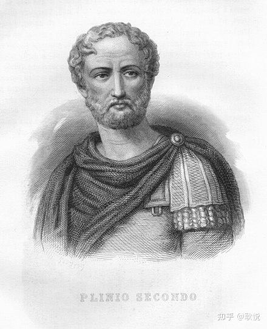

我对这位因室息而闭眼的老普林尼深深关注， 很重要的原因是他在欧洲较早地眯眼远望，看到了中国。 我没有读过他的《自然史》， 据朱龙华教授在《罗马文化与古典传统》一书中的引述，老普林尼已经写到中国人“举止温厚，然少与人接触。贸易皆待他人之来，而绝不求售。他当时把中国人叫成‘“ 赛里斯 人”。 他说这句话的时间是那么早，比马可 • 波罗来华早了一千二百年，比 利玛窦 来华早了一千五百年！ 他是通过什么途径知道中国人的这些特点的呢？ 大概是几度转说，被他打听到了。 作为一个科学家，他会筛选和分析，最后竟然筛选出了“举止温厚”这个概念，把儒家学说的基本特征和农耕文明。 他写《自然史》的时代，在中国，王充在写《论衡》，班固在写《汉书》。 庞贝灾难发生的那一年，班固参加了诸儒在白虎观讨论五经异同的会议，后来就有了著名的《白虎通义》。 这也就是说，中华民族虽然己经拥有了先泰诸子以及屈原、司马迁，此时还正在构建自己更系统的精神基座。 “举止温厚”的王充、班固他们不知道，在非常遥远的西方，有人投来关注的目光。 但那副目光己经在轰隆轰隆的大灾难中埋葬， 埋葬的地方叫庞贝。 残酷的来了。 人形模壳

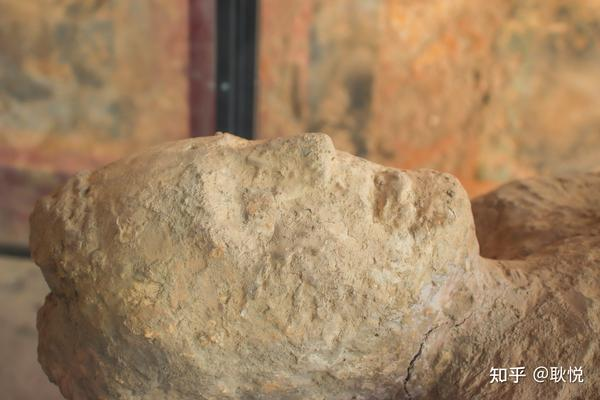

什么叫“人形模壳”呢？ 当时被火山灰掩埋的人群，留下了他们死亡前的挣扎形体， 火山灰冷却凝固时也就成了这些形体的铸模硬壳。 人体很快腐烂了，但铸模硬壳还在，十九世纪的考古学家一旦发现这种人形模壳，就用一根管子把石膏浆缓缓注入， 结果剥去模壳，人们就看到了一个个活生生的人，连最细微的皮肤皱纹、血管脉络都显现得清清楚楚。 这个办法是当时庞贝古城挖掘工作的主持者费奥莱里(G.Fior elli)发明的，使我们能够看到一批生命与死神搏斗的最后状态。

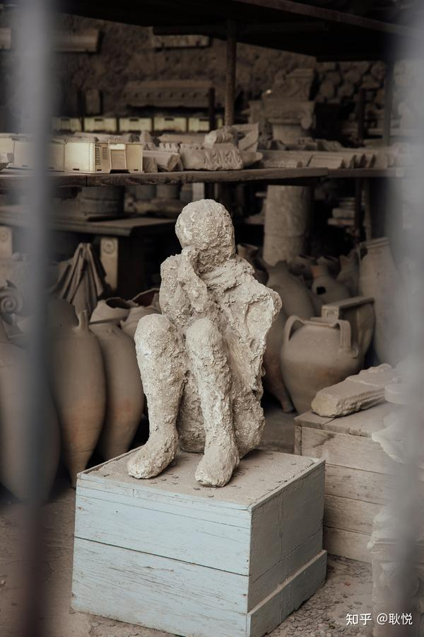

我所看到的这种人体遗形，大多是痛苦地躺在地上或合榻上挣扎，只有极少数靠壁站着。 在这样的灾难中居然能站着死亡，让人顿生敬意。 在一个瓦罐制造工场，有一个工人的人体抱肩蹲地，显然是在承受室息的晕眩。他没有倒地，只想蹲一蹲，憩一会儿就起来。 谁知这一蹲就蹲了一千多年。 更让他惊讶的是，重见天日之时，发现自己的身体竟然变成了自己的作品，都成了硬邦邦的石头。

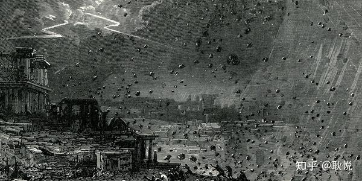

《余晖》 日落总是令人不安 无论它是绚丽抑或是贫乏， 但尚且更令人不安的 是最后那绝望的闪耀 它使原野生锈 此刻地平线上再也留不下 斜阳的喧嚣与自负 要抓住这紧张而奇异的光有多难， 那是个幻象， 人类对黑暗的一致恐惧 把它强加在空间之上 它突然间停止 在我们觉察到它的虚假之时 就像一个梦破灭 在做梦者得知他正在做梦之时。 博尔赫斯并不是在写庞贝， 他只是在写黑暗突临的黄昏，对比于刚才和明晨的日光，分不清究竟何时是破梦时刻。 正是对这一切的体验和思索，使我们劳累。

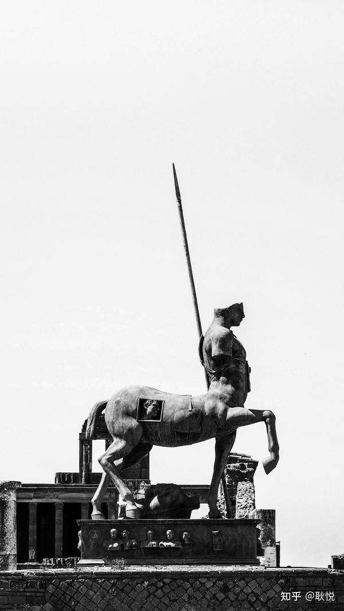

古罗马有一句箴言，几乎可以视为庞贝的宿命注解。 “哪里有什么永恒？ 骄阳闪耀，终坠大海； 皓月圆满，日渐消陨； 狂风怒吼，化为微息。〞 火山灰下的庞贝古城，即是世间无常的缩影。 但庞贝人，作为爱的拥趸， 在对爱情的信仰中找到了生存之道： “请笃信，痛终有时，爱必将至。”

庞贝古城的猫 现代沉思 在相册里搜索庞贝关键词时， 我看到了当年去庞贝旅行，站在那傻傻合影， 却对历史并不知晓如此多细节的照片， 还看到了一张在疫情时截图的一段话，作者没找到， 从二千年前的生活图景回到现代的生活：

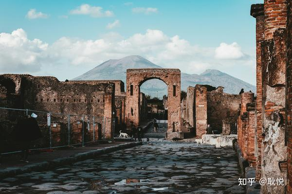

「2022 开始的这三个月，战争，疫情，地震，极端天气。 一切符合末日感的元素，却好像并不突兀地进入了我的日常生活， 我们在午餐时谈起两国纷争，在茶水间聊起骤降的温度，好像并不意外， 习以为常，但我猛地跳出这些细碎日常来做一份历史思维导图时，我感觉整个世界都在温水煮青蛙。 我突然有一种错觉，好像即便这是末日也没什么，我们还是会一样努力工作，烦恼晚餐吃哪家餐厅，思考快递还有几天到。

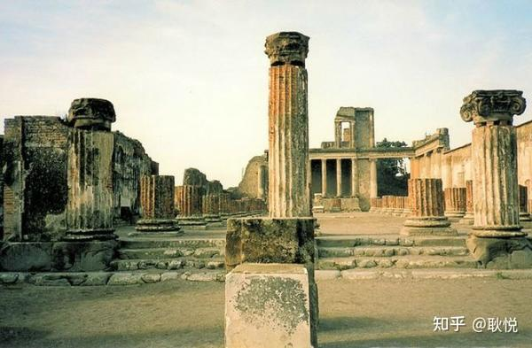

我想起庞贝古城，或许直到大厦将倾，直到文明陨落我们也不过在过着普通又平凡的每日。 没有最后一秒钟亲吻爱人，没有最后一天和父母蜗居在家， 我们只是庸碌过着或者复制着每一天。 得承认，人类仅有的浪漫和英雄主义，才是人类唯一的方舟。」 Travel Guide 

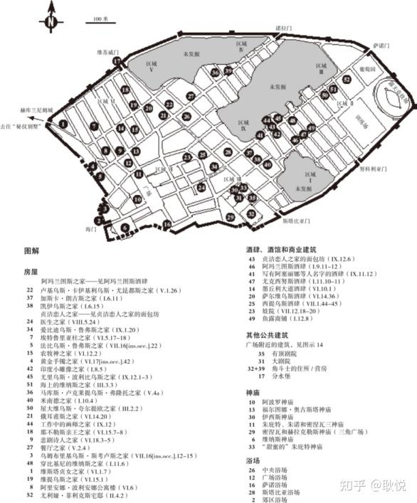

---

## 版权

本文为耿悦原创，版权所有。未经许可不得转载或商业使用。
