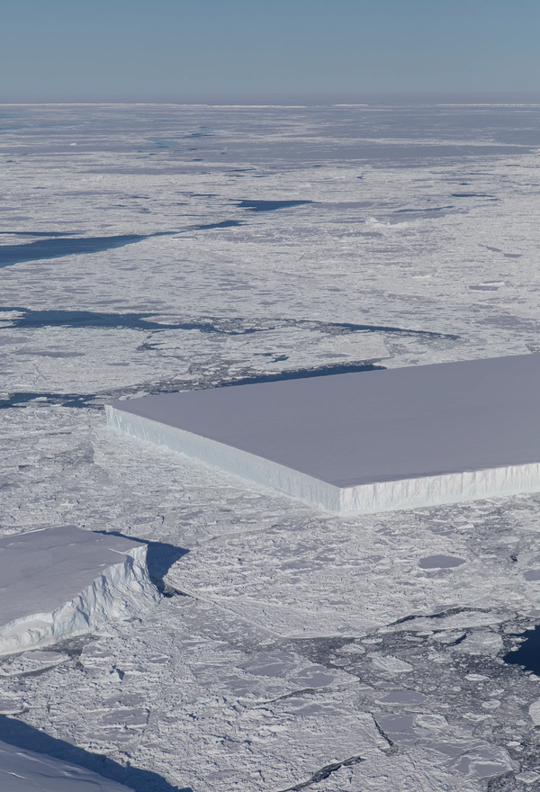
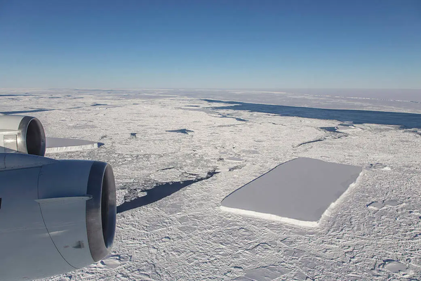
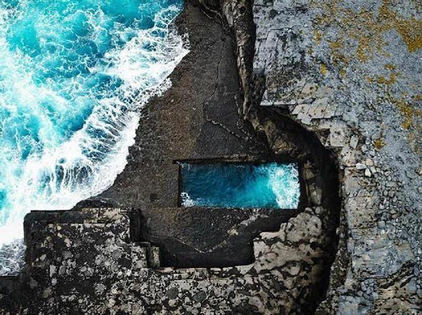

# 大自然的鬼斧神工 · 长方形冰山

完美切割的一万亿吨冰山

---
初看这张照片，产生了一种科幻感， 是NASA在南极洲“Lar sen C”冰架上，发现的一座切割完美、重达一万亿吨的 长方形冰山。

这座冰山是完美的长方形。就像一块巨大的漂浮在 南极半岛 东海岸附近的薄片蛋糕。 切割出如此平滑、均匀的墙壁和90度直角。让我想起古埃及几何学缘起。 虽然它不符合我们对冰山的典型形象，但令人感慨大自然的「鬼斧神工」。 冰山的尖锐角和平整表面，表明它可能是最近从冰架上断裂的。 在一个被气候变化带来的混乱和破坏所困扰的世界中，一个令人惊奇的有序形象出现了。

在拉森C冰架附近的海冰中，可以看到一块长方形冰山漂浮在右侧。 2018年10月24日，NASA的Ice Bri dge飞机 在例行空中测量期间发现了这座冰山， 当时写道。 周遭环境看上去是零落散乱的，它却有一种偶然得之的秩序。 难以捉摸，神秘莫测，永远遥不可及的冰山。

在爱尔兰的高威“Galway ”，存在着自然形成的矩形潮汐池， 当地的人认为它是通往另一个世界的 虫洞。 

---

## 版权

本文为耿悦原创，版权所有。未经许可不得转载或商业使用。
