# 为什么外国人喜欢张家界

《阿凡达》悬浮山原型 · 天门山

---
地球上少见的万千石柱提供了异星文明的灵感。 被称为“南天一柱”的石柱，在科幻电影《阿凡达》里， 是 电影中虚构星球「潘多拉」上「 哈利路亚山 」（Hallelujah Mountains）的灵感 来源。

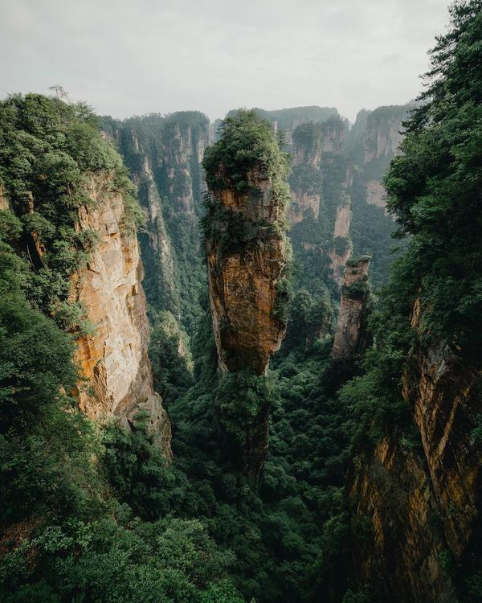

张家界Photoby Long-Nong Huang 电影灵感 这座名为“南天一柱”的山峰，是张家界三千奇峰之一。 其海拔1074米，垂直高度约150米，视觉观感仿佛被刀劈斧削，擎天矗立。 现场肉眼观看的确很震撼。有想象力。

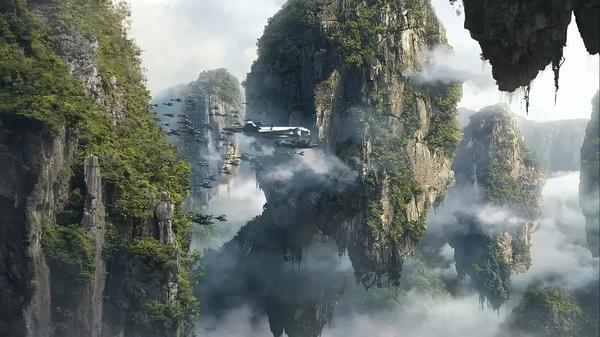

卡梅隆对自然世界的美感和多样性一直有深厚的探索兴趣。 2008年12月，这座山峰的影像被好莱坞摄影师汉森捕捉，在这里拍摄了四天外景， 并成为了《阿凡达》电影中潘多拉星球悬浮山的视觉原型。 《阿凡达》的巨大成功增加了张家界在国际上的知名度，使其成为世界各地游客的热门目的地。 2010年1月25日，在电影播出后，它被正式更名为“哈利路亚山”。

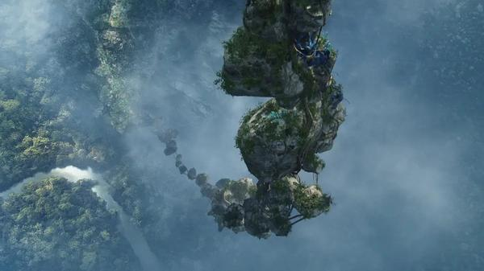

《阿凡达》电影截图 袁家界的地理位置，坐落于 张家界森林公园 北部，占地12平方公里，海拔1074米。 步行遍览整个袁家界，大概需要半小时。 袁家界是整个张家界中最精华的风景。最引人注目的是被 称为“哈利路亚悬浮山”的 乾坤柱。

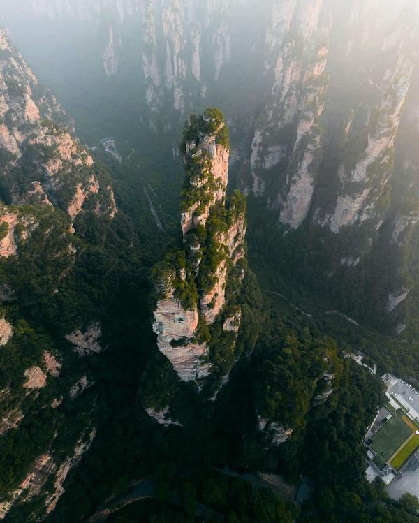

东方奇幻

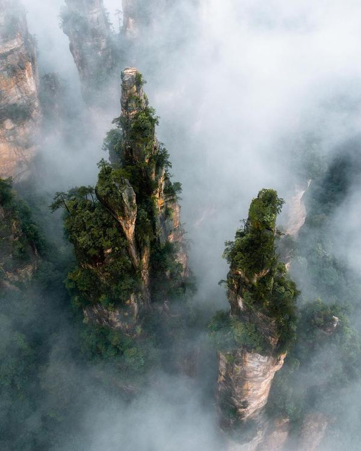

薄雾森林 深谷奇山等迷人风景，有东方奇幻感。 这些形状各异的山峰，高耸入云，在迷雾中若隐若现，很朦胧。

阿凡达电影截图 形成了一种近乎悬浮在空中的视觉效果，这与《阿凡达》中描述的浮岛非常相似。 对于想象力而言，我之前看过一个外国人对中国的风景向往相册，包括 AI 制图，他们就真的非常迷这种奇幻的氛围感。

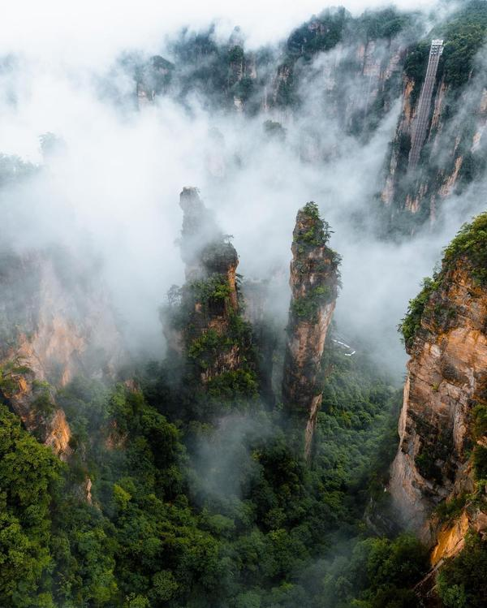

游客可以通过两种方式登上袁家界： 其中一个独特方式是，乘坐创世界吉尼斯纪录的“最高室外电梯”百龙天梯，这座电梯高达326米， 这使得许多外国游客，将张家界 视为一个能够体验现实中的奇幻世界的 探索地。 超凡脱俗，如梦似幻的探索感。 东方奇幻往往融合了历史、神话和文化元素

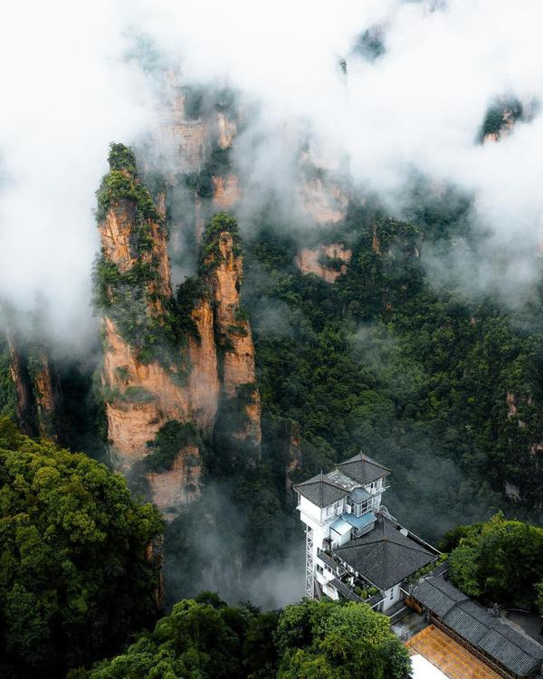

他们会产生兴趣和好奇，源自 巧夺天工的自然美景，东方文化中的神秘探索，自然哲学里奇幻元素的关联等。 这里也的确有点未解之谜的味道：

张家界还是多个少数民族的聚居地，包括土家族和苗族，有独特的民族文化色彩。 还孕育了古老神秘的湘西文化（如赶尸、 巫蛊 等）和至今未解的自然奇观（如天门翻水、鬼谷显影等）...... 天门山 突然有点伤感，想起来个去年新闻。 天门山古称“ 云梦山 ”，是最早被载入史册的名山。

距离我去张家界竟然已经有10年，时间过的太快了。 对张家界的旅行印象还挺好的。这条只说电影相关部分，和一些风景。

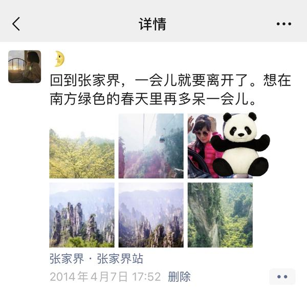

我们在高耸的尖峰、迷雾缭绕的森林和广阔的自然公园里游玩， 几天的感受就是氧气充足，含氧量很高，翠谷幽深，青翠扑面。

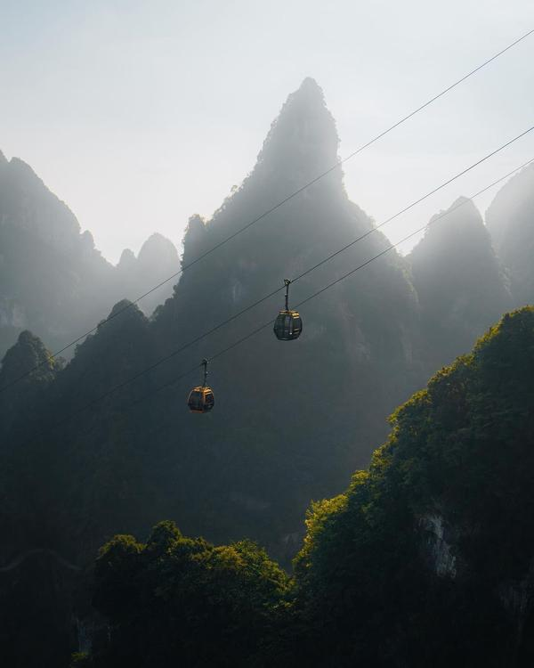

我们坐索道上去的，天门山索道全长7455米，高差近1.3公里，可一步登顶， 如果徒步就是可以沿途遍览从山脚到山巅的不同风景，更多云山雾绕的视野。 这里可以徒步、登山和索道游览，这对喜欢探险的外国游客也有蛮多吸引力。

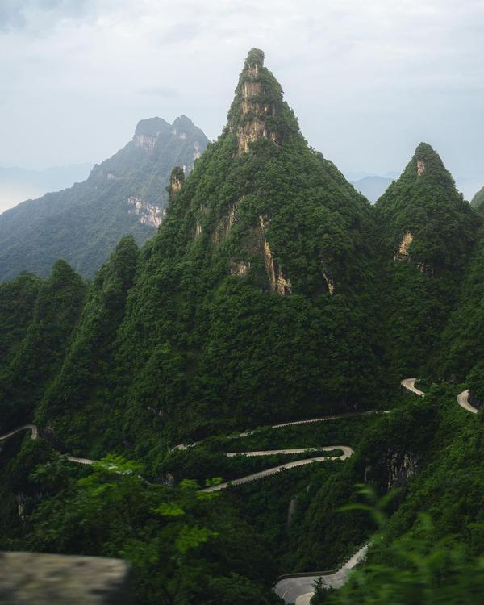

历史渊源 张家界国家森林公园 是 世界自然遗产，这个身份本身就是一个重要的吸引因素。
张家界，远不仅仅是一座山或一个公园，而是位于湖南省西北部的一座地级市。
这座城市的前身名为 大庸市，有着自公元前221年起的悠久历史记录。
人类在这一地区的定居历史可以追溯到10万年前， 与西安、北京等著名遗址媲美。
1988年，考古学家在此地发现了旧石器时代的文物，显示了该地区曾经的文化遗迹。
尽管这一社会文化存在的时间并不长，但它在历史上留下了独特的印记。
由于其地理位置偏远、交通不便和地形多山，这里长期以来被称为“野南方少数民族之地”，显示出历史上对该地区文化的歧视性看法。
1982年，由于张家界国家森林公园的建立和名气日增，大庸市于是改名为张家界，这一变化旨在突出其作为旅游城市的身份。
这个新名字在1994年正式采用，紧接着该地区被列为联合国教科文组织世界遗产。
张家界的命名源自一个小村庄的名称，该村庄现在是国家森林公园内的一个热门旅游景点。
名字中的“张”是一个常见的中国姓氏，“家”可译为“家族”，“界”可译为“家园”，合起来的意思是“张家的家园”。
明朝时期，永定卫大庸所的指挥使 张万聪 的第六代孙张再弘被赐团官，并在此设立衙署，这一带因而成为张氏世袭领地，被称为“张家界”。
另一传说则提到， 西汉时期，留侯张良 看破红尘，辞官追随赤松子隐匿江湖，来到这里隐居，终老后被葬于此地，也是“张家界”名称的来源之一。
一个地方成为旅游城市，除了本身优越的自然特色，也因其深厚的历史文化底蕴而受到关注。
除了电影造势，也和近年来对t a的营销造势不无关系。
无论是从地名的由来，还是从考古发现看，张家界都是一个充满故事的地方。

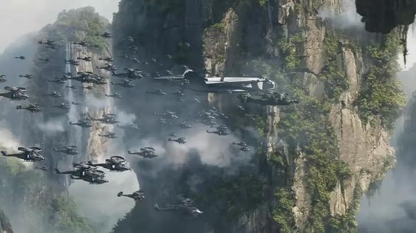

翼装飞行 张家界，翼装飞行爱好者的热门目的地。 天门洞 是一个高达130米的自然拱门，是翼装飞行的热门地点。也吸引了一些外国玩家前来玩极限运动。 2007年，法国冒险家 阿兰·罗伯特 在张家界进行了备受瞩目的徒手攀爬表演。 2011年，张家界成为了极限运动的重要场所，当时美国冒险家杰布·科里斯在这里完成了令人惊叹的翼装飞行穿越天门洞的壮举。

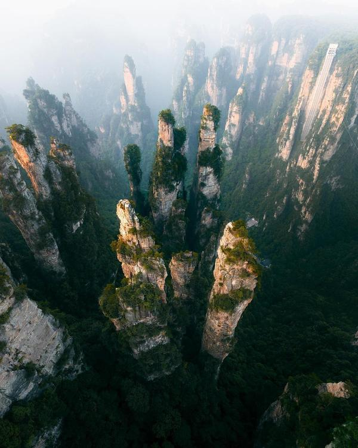

在后来的报道和视频里，你可以看到一些挑战极限的飞行玩家来到此地， 从高处轻轻跳下，在山间如飞鸟盘旋，比如中国顶尖的翼装飞行运动员之一张舒鹏。 后面碰到相关的再写，写这篇时候看到张手绘地图，在当地可以买到纸质版

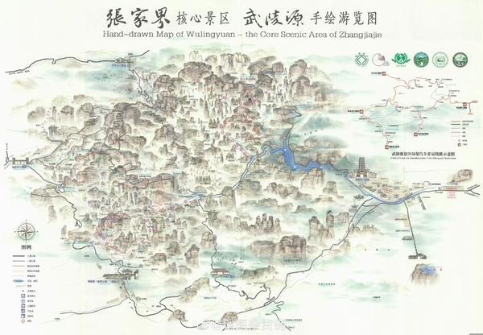

---

## 版权

本文为耿悦原创，版权所有。未经许可不得转载或商业使用。
