# 在飞机上，俯瞰一座座城市

机窗外的日出、晚霞与万家灯火

---
这是最向往俯瞰拍摄到的画面，谁能帮我实现一下，哈哈。美丽的地球。

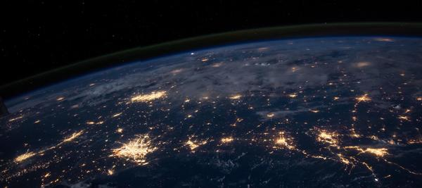

坐飞机，我还是很享受脱离地心引力，在空中俯瞰一座城市、一朵云、一片星河的视角。哪怕就那么几秒。 看到问题，浅浅分享几张飞机的窗外。搜到哪张发哪张。

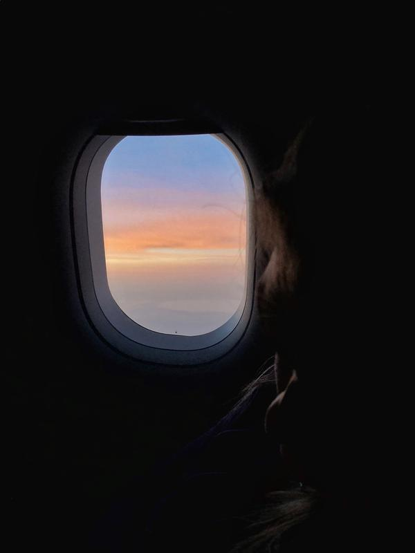

在清晨抵达 纽约 前，回头看见温柔的一幕。本来想拍俯瞰城市，旁边的旅客正在梦乡。 像后来明媚夏日的旅行。

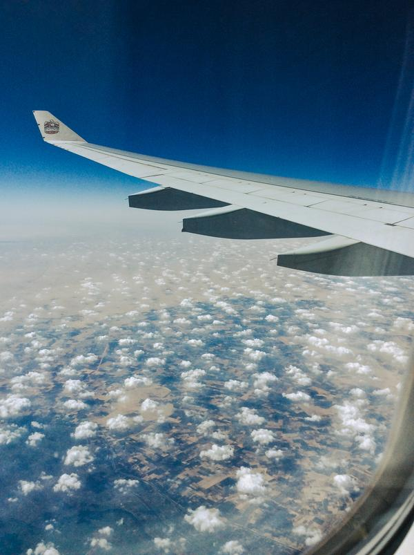

有些窗外是风景，经过非洲上空，一半沙漠，一半海洋。 是位于 非洲 大陆和阿拉伯半岛之间的 “红海”

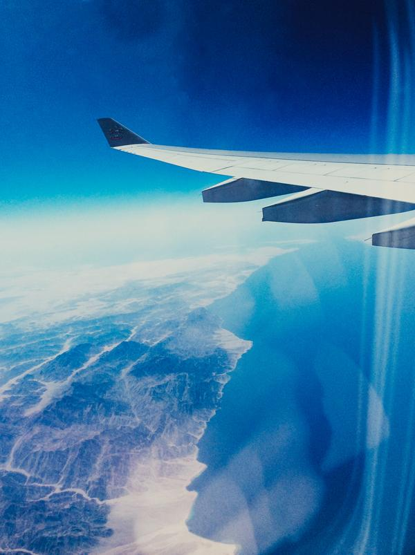

无论坐火车、高铁、飞机，我喜欢靠窗的位置，有时候可以看见日出，有时候是晚霞，有时候是茫茫黑夜。 有比较炫酷，不过以前视频现在看会有些尴尬 如果你未来去 迪拜 旅行，建议你上天「飞一趟」，像鸟儿般俯瞰奇迹之城

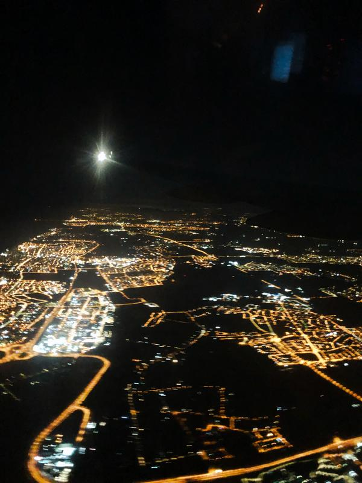

在黑夜中抵达 特拉维夫 透过机窗俯瞰着一座座城市的万家灯火， 目视着它们渐渐远去，像满天繁星，最后消失在我的视野。 这座城市，这里的人，正在发生什么故事？

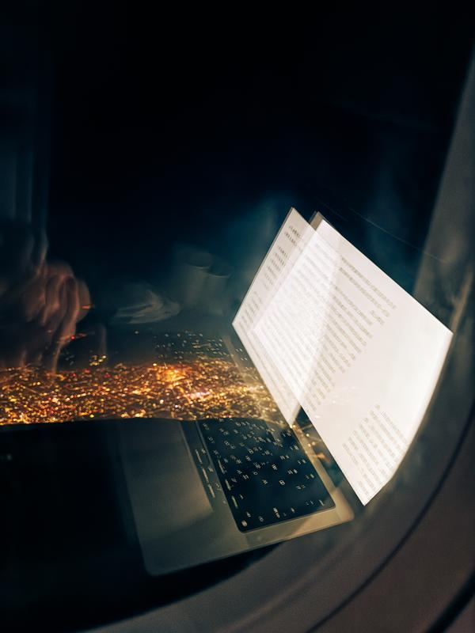

也在飞机上阅读或者工作，从北京飞到 成都 有一次坐早班机去 厦门。刚起飞就开始补觉。 睁眼时，刚好看见日出。深蓝色的尽头，太阳一点点往上跳，左手边的整个飞机窗，都被金色的光笼罩着。

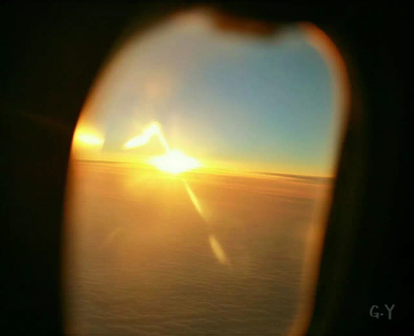

眯眼又睡一会，转头看见窗外是整片晴空，澄澈干净，和流动的云朵。 记得那个冬天我过得一般，在那个昏沉疲惫的瞬间里，我仿佛相信，一切都会变好的。Will Be Better.✈️ 以前我们都习惯这样的祝福：“一切都会好起来的。” 而一切随着时间产生了新的模样，好和坏都是相对的，都很正常。 就像飞机如果是抵达，就是期许。如果是告别，就是分离。但都是旅程。

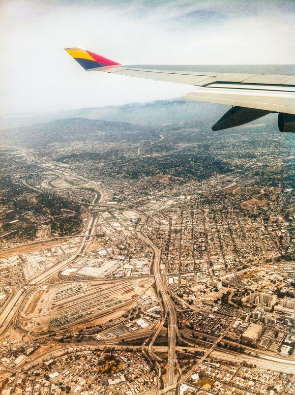

这是第一次落地 洛杉矶 飞机不可能一直平顺的笔直地飞行，毫无曲线。 它飞起前要滑翔很久，我才能俯瞰城市那几秒。 接受生命的无常。就像接受命运的惊喜，礼物。

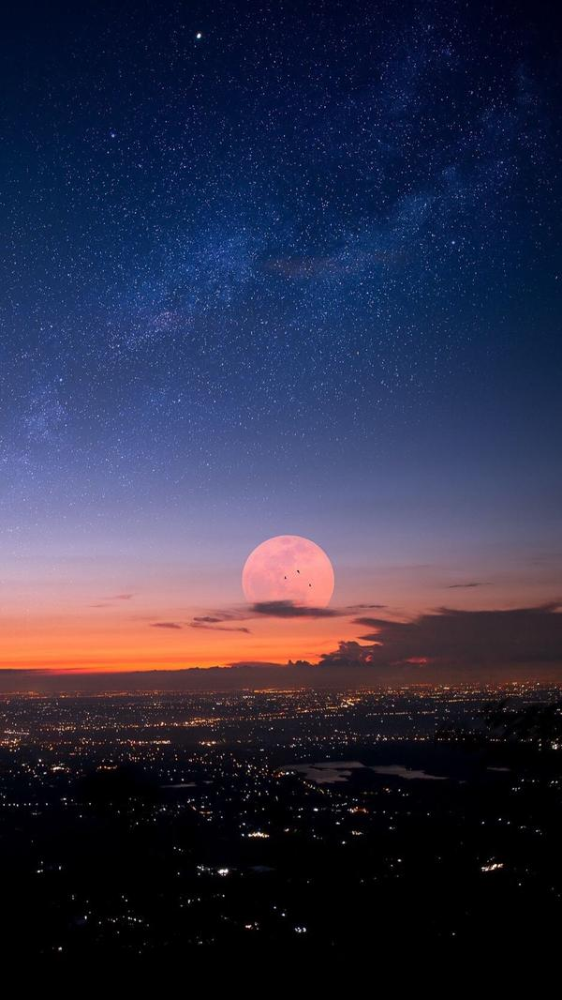

Shootforthemoon.Evenifyoumissit,youwilllandamongthestars. 飞向月球，即使错过，你还是可以着陆于星际之间。 还看到一张厉害的俯瞰图，我收藏过的图片。放在最后，祝好梦。 曼谷 的夜景，由日本宇航员古川聪拍摄。

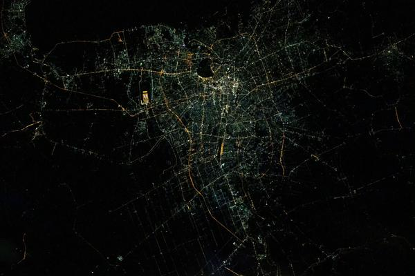

在国际空间站最新拍摄的北京和天津夜景

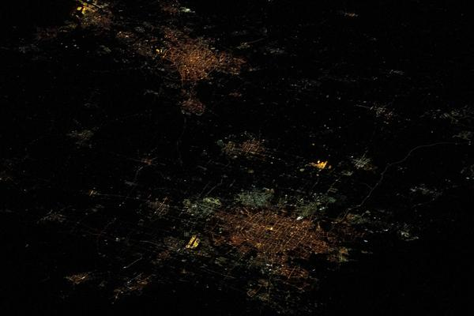

---

## 版权

本文为耿悦原创，版权所有。未经许可不得转载或商业使用。
