# 有什么地方让你「总想再去看看」，能产生流连忘返的感觉？· 巴塞罗那

*耿悦 · Travel Stories · 2022-11-29*

---

​目录「巴塞罗那，从未让人乏味过。」

2017年的长游记。和会玩、爱吃、喜欢艺术的朋友，另辟蹊径，打开了攻略里没有的巴塞罗那。

第一次暴走了三天，因为流连忘返，后来又去更长旅居探索了一次。（这篇里，主要是第一次杂志专栏的内容，也融合了第二次，和禾禾当地住了十多年的探店宝藏推荐。）

## 前言 想沉浸在无穷灿烂的细节里
当我的欧洲旅行，还剩最后一站时，决定从柏林飞巴塞罗那。

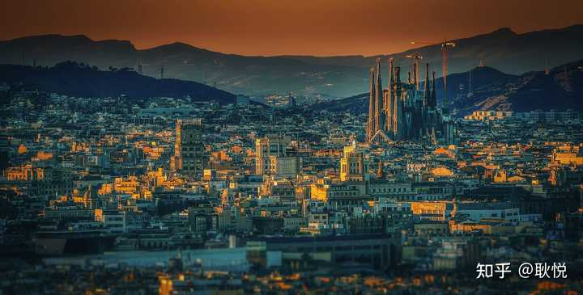

那里有一位久居的朋友，禾禾，是我的初高中同学，她大学念西班牙语专业，毕业后就定居在巴塞罗那工作、生活。
她是我心中最会探索这座城市的妙人，也一直期待能带我开启一场不同寻常的巴塞探索。 

她会突然发给我一张用手机拍的照片，是一个拿着古怪自制乐器的复古乐队，
再录一段现场音乐在微信里发给我，问，“你能听见不？
一种很怪的音乐，这是巴塞罗那才有的怪音乐呀！哈哈哈哈~”

我知道她此刻正晃荡在巴塞罗那的海边....
她几乎逛遍了这座迷人城市的每个角落。
她说，爱这座城，每天都会爱得更多一点，爱层次丰富的、发光的城市细节。  
而我也想沉浸在这些灿烂细节里。

## **一 、我们深入巴塞罗那文艺街区，探寻了五家精致小店**

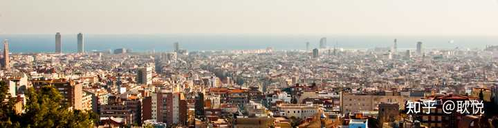

巴塞罗那，集聚了各种美：
地中海沿岸的海滨美，罗马城墙和中世纪宫殿的古典美，毕加索、米罗绘画大师遗留的基因，加泰罗尼亚的文化艺术美，兰布拉斯大街的街景美，天才建筑师高迪塑造的建筑美
......
当你抵达，会真切体会到它的美，也为它独特的气质吸引。

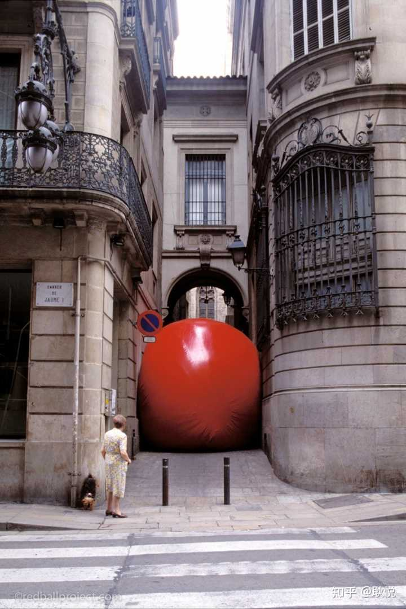

“这是一个怪人聚集的城市。我先带你看一些我很喜欢的精致小店。”
禾禾说，小店的主人是巴塞罗那的独立设计师、手工艺人，是隐匿在弯弯曲曲街道中的Artist。
他们不盲从，只为热爱，用自己的匠心和作品，创造出了属于自己的独立世界——审美出众、才华横溢、烂漫自由的世界。 

*图注：偶遇熊猫面具，试玩了一下*
我们俩都是热爱艺术的独立创作者，自然喜欢这类人，就先去了格拉西亚区的一片街区。
这里游人很少，文艺气息浓重，一抬头就看见一排排原创文艺小店。

## **1. 一个给文艺青年提供精神食粮的杂货铺**

一走进这家杂货铺，文艺嗅觉敏锐的我，就能感受到这里的精神食粮充盈丰富。 

先是被美貌的明信片迷住，眼前的大橱柜里，有拍立得型、插画型、摄影型...设计感十足。
在过明信片大橱柜，是摆满书的房间，这里可以淘到：
一些常规书店没有的书、独立杂志、小众音乐CD...

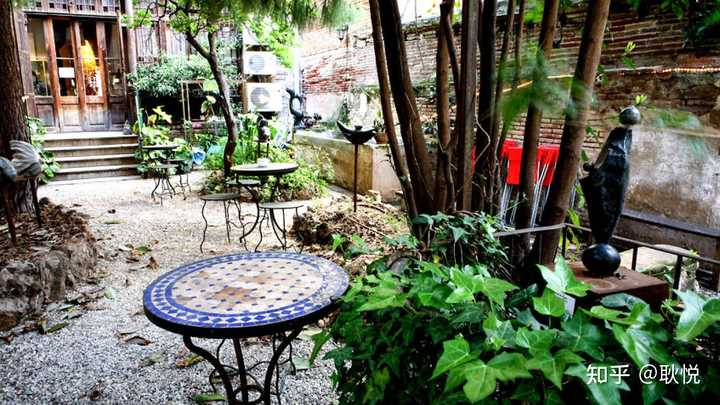

这家铺子，开在一栋百年老宅的一层，当我们推开后门，发现了一个露天的后花园！
这儿会不定时举办一些文艺活动，我们坐在植物之间，喝咖啡，惬意地聊天，是巴塞罗那的午后好时光。
店名：Olokuti Gràcia
地址：Carrer d′Astúries,38,Barcelona 
## **2. 创意家居店**
这是一家复古家具小店。

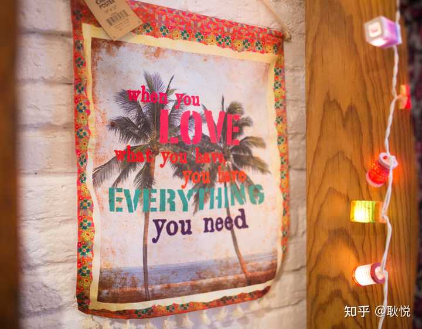

招牌是用几个皮箱子摞在一起[1]；
一张张做旧风格的原木桌子，
配着斑驳的工业风铁艺椅子，有一整面墙的地图和动植物画，

一整面墙上挂着造型不同的白色鹿头，另一面墙上钉着造型怪异的彩色吊灯；
我当时的想法就只有一个，“哇塞好爱，我能搬走一点儿家具，运回去咩？”
店名：Fulanitu i menganita 
地址：Carrer de Verdi 25, Barcelona 
## **3. 带上不安分的心，在路上叛逆的小书店**
我们偶遇了一家“ON THE ROAD”书店，就是凯鲁亚克的《在路上》同名。
下面的纸张上，用西班牙语写着：“感谢你相信我们这些小型书店。”  

禾禾突然想起她去年参加过一个巴塞罗那最有名的摄影书店的关门仪式。

前几年，巴塞罗那gov取消了对百年老店的房租保护，所以很多优质的老店，难以维系高额的房租，就只好相继关门。

这是个有些让人伤感的消息。但人骨子里的叛逆，又让一批新时代“非主流”小店又新兴起来，
这些小店有股子“不管今天的潮流是什么，我就是要坚持自己风格”的劲头，
继续不安分的心，继续叛逆。

## **4. 有故事的人 创造出有故事的首饰店**
街上有艺人在拉小提琴。
在悠扬琴声里，轻轻推开了一扇蓝色的小门。  
这是一家独立设计师的首饰店。

店主是个有故事的女孩，她曾经是一位成功的律师，但太喜欢旅行，一上路就是一年多，
当她走遍了梦想去的远方后，终于找到了自己的激情所在——创造。
于是毅然离开了高薪的律师行业，一门心思地开始设计首饰。

“这个世界上不可能有两块一样的石头，”她说。
她用天然宝石来表达内在情感，设计思路随心所欲，有时仅仅依照着石头的原始形状，加上极简的装饰。
她给我们看了一个刚刚做好的古董首饰，一颗有岁月感的古朴宝石，经过她的修复和设计，拥有了新的命运和味道。
而值得一提的是，这里几乎每一件首饰都是孤品，在这世界上没有第二件。

## **5.天马行空的艺术画廊**

除了原创小店，老城区里的艺术画廊也值得看。
这些艺术家并不是非常出名的大画家，但是每一位的作品都有着鲜明个性。

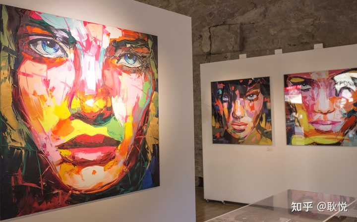

我们喜欢的画幅，有大胆的用色，奇妙的构图，走进去逛一圈感受到梦幻色彩。

## 二、我们打开了一份当地人私藏的美食地图
我微笑微醺着，嘴上沾满墨鱼汁，说，"天哪，我离开巴塞罗那以后，可能最想念的，就是墨鱼饭。"

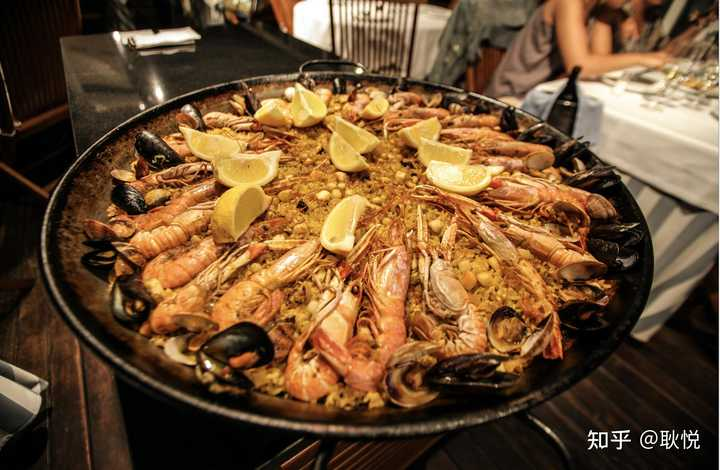

作为吃货、点菜高手，穿梭在大街小巷，专门去当地人好评如潮的地道餐厅，一餐比一餐惊喜。
巴塞罗那的美食很现代，有地中海特色、风格优雅，这儿先推荐三家餐厅。

## **1. 当地最好吃的墨鱼饭在哪里？**
海明威在小说里，屡次写过西班牙海鲜饭Paella，但我们更爱看起来像黑暗料理的墨鱼饭。

它虽然看起来颜值怪怪的，却把大颗粒的鱿鱼和蒜香融入在了米饭里，吃下去浓香四溢！
点一份墨鱼饭，再来一扎西班牙水果酒。
红酒、苹果片、柠檬片，在一堆冰块响动中端上桌来，记得要一份加泰罗尼亚的特产西红柿烤面包。

你的味蕾开始苏醒了，你开始想象自己在巴塞罗那的街头晃荡。 

餐厅名称 Taverna El Glop

地址：Carrer de Sant Lluís, 24 

菜品推荐：墨鱼饭(arroz negro de sepia)  海鲜饭（paella） 水果酒（sangría）

烤猪脸肉(carrilleras de cerdo) 西红柿烤面包(pan con tomate)

其他小食：蜗牛(caracoles)  朝鲜蓟(alcachofas)  烤兔兔(conejo)

## **2. 最丰富的TAPAS在哪里？**
西班牙的风味小吃，那些最自由的小店，你可以随意地称它们为Tapas。

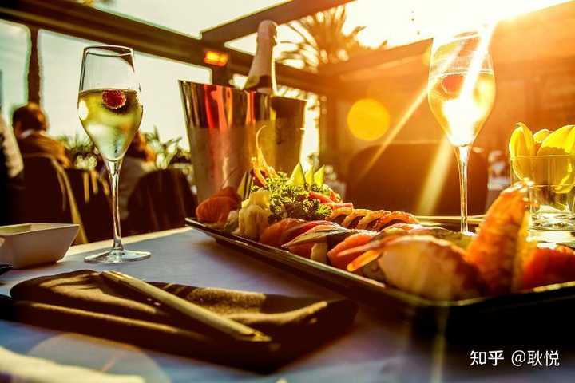

点了西班牙最特色的、必点的几样Tapas：
蒜泥虾，海红，大蛏子，鱿鱼圈。
接着尝了Montaditos，就是一块面包上累着各种小菜，有牛肉、海鲜、西班牙版的“虎皮小青椒”(pimientos de padrón)，吃过的人都说味道超好。

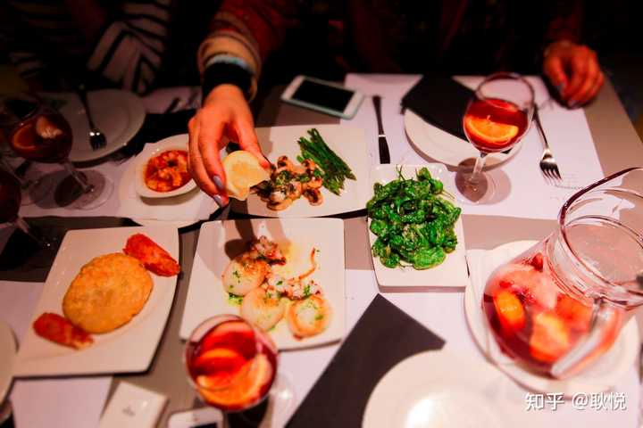

*图注：绿色是虎皮小青椒，几乎每一餐都会点。*

如果同行的人多，相当推荐这家店的烤猪脸肉，西班牙的猪肉是好的出名，这家的入味却不油腻。
除此之外，还可以尝尝蜗牛，朝鲜蓟、烤兔兔（我不吃，只是记录一下）。

*图注：Photo by asimojet*
吃完小吃，还可以来一个加泰罗尼亚的特色甜点，焦糖蛋羹https://www.willflyforfood.net/spanish-desserts/" data-tooltip-richtext="1" data-tooltip-preset="white" data-tooltip-classname="ztext-reference-tooltip">[2]。
这个吃法可以参照一部电影，我们都很喜欢的法国电影《天使爱美丽》——艾米丽用小勺子，敲碎上面的一层焦糖。

下面这个清单，是我们把最好吃的菜，为你标注上了西班牙语。
这样，你即使在语言不通、没有图文菜单的窘境下，仍然可以在西班牙餐厅里点到好吃的：

餐厅名称：Cerveceria Catalana
地址：Carrer de Mallorca 236

菜品推荐：
蒜泥虾(gambas al ajillo)  
海红(mejillones) 大蛏子(navajas)鱿鱼圈(calamarcitos romana) 
甜点 焦糖蛋羹（crema catalana）

友情提示:

a 餐厅的地理位置极好，就在格拉西亚大牌街旁。
游人如织，人气很旺，而且不接受预定，所以这儿适合有时间等位的朋友。

我们大概等了25分钟左右。

b 点菜非常推荐海鲜类的，因为西班牙的海鲜相比国内的可以说是物美价廉。

## **3. 最文艺的咖啡馆在哪里？**
这里可以称得上是巴塞罗那文艺咖啡厅的鼻祖。
毕加索和达利都曾经在巴塞罗那生活过，毕加索的第一次个展，就在“四只猫”举行。

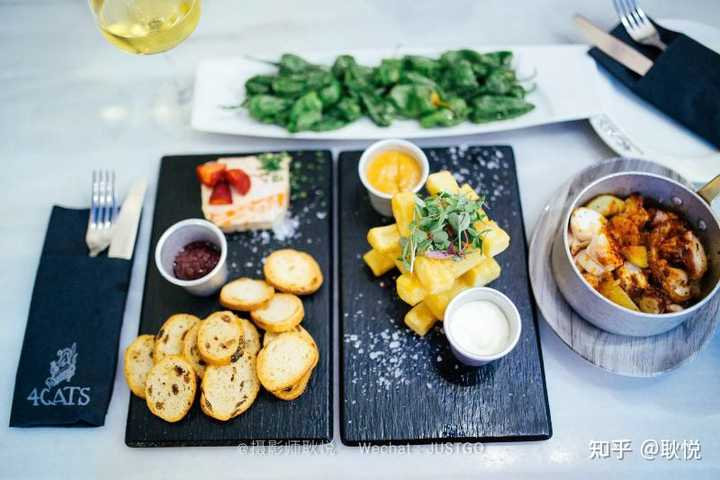

那个时代，先锋艺术家们都喜欢聚集在四只猫咖啡厅，举办艺术展览、文学和音乐等活动。

*图注：4Cats西班牙美食站*
这是一家有“穿越”感觉的咖啡馆。

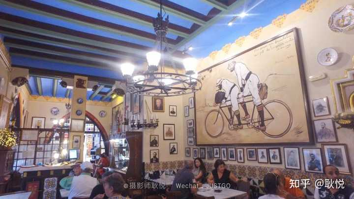

*图注：4Cats西班牙美食站*

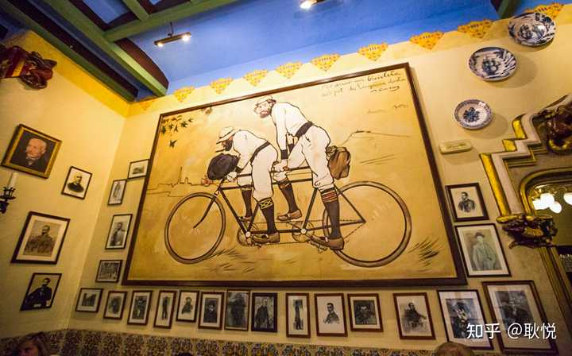

咖啡馆很漂亮，仿佛走进一部导演伍迪艾伦的小电影里，精美的加泰罗尼亚风格装饰，拱形的彩色玻璃窗户，墙上贴着的装饰瓷砖，以及加泰罗尼亚特有的液压砖地板。
《午夜巴塞罗那》等电影都曾在这里取景。

餐厅名称:Els 4Gats 

地址：Carrer de Montsió 3, Barcelona 
位于巴塞罗那老城加泰罗尼亚广场东南两个街区的小巷里。

友情提示：四只猫的菜品很讲究，摆盘精美，
但价格小贵，人均要35欧元左右，如果不想用餐，也可以只点一些喝的和小吃。

## **4.再分享一点西班牙美食的小贴士：**

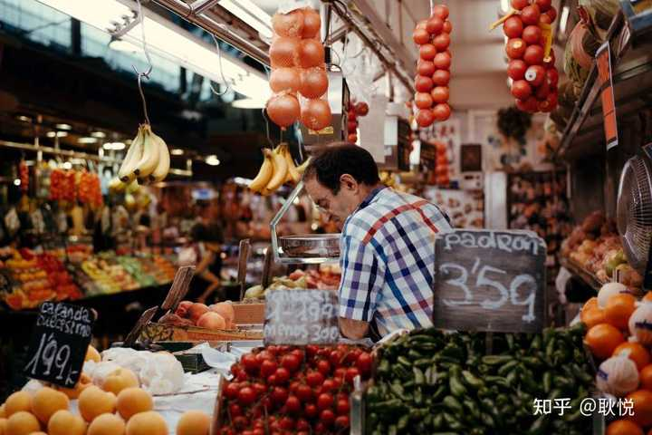

**性价比最高的火腿在哪里？**为什么没有提到西班牙最著名的火腿(jamón)呢？
因为在餐厅点火腿都很贵，而且你并不能了解火腿的等级，建议大家到专门的火腿店买，
一定要正宗的黑带后腿火腿，才是真正最好的，吃橡木果长大的伊比利亚黑猪火腿。

**一种西班牙专有的饮料**

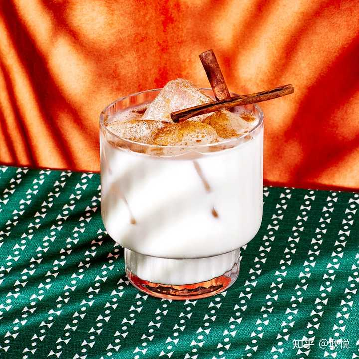

再给大家介绍一种西班牙专有的饮料，叫做horchatahttps://www.bonappetit.com/recipe/horchata-recipe#intcid=_bon-appetit-recipe-bottom-recirc_d6921728-1571-4826-97a7-2d1973e95aa7_cral2-2" data-tooltip-richtext="1" data-tooltip-preset="white" data-tooltip-classname="ztext-reference-tooltip">[3]，是用油莎草块茎做成的，不要问我什么是油莎草块茎，因为我在咱们大中国也从来没有看到过。
据说这种饮品很健康，口味很像咱们的豆浆，夏天来一杯，清清凉凉，特别爽。

## 三、疯狂追逐高迪的建筑
对巴塞罗那心存向往的人，估计多数是奔着高迪而去。
因为他的建筑作品，使巴塞罗那成为一座遗留在人间的梦幻之城。  

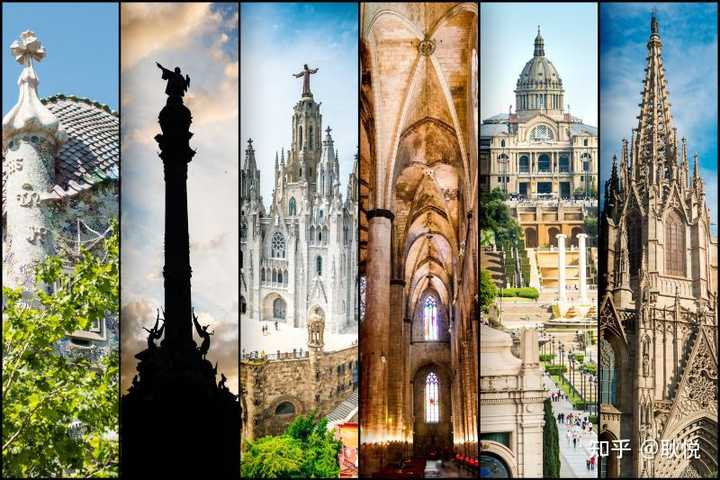

在去西班牙之前，我对建筑并不太了解，甚至对安东尼.高迪这个大名当时还有点陌生。
但在看过高迪的一系列建筑之后，我从一个建筑小白，成功地转为了“高迪的迷妹”。

## **1. 一进圣家族，我的相机就一直没放下 **
在来巴塞罗那之前，在欧洲各个国家，已经看过了无数个教堂，觉得世间教堂不会出乎其右了。
但当我真的走进圣家族的那一刻，还是被震撼住了。
光线穿过屋顶和多处彩色玻璃窗，形成美丽的光影，洒在我的瞳孔里。
轻声说，“高迪真是一个天才。”

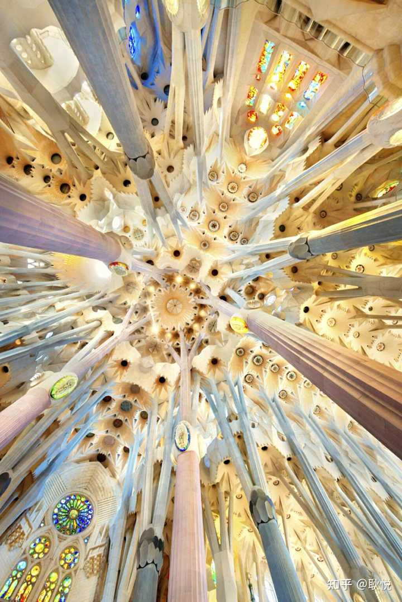

相机一直就没有放下。
从阳光透过的彩色玻璃，到高耸的树形立柱，再到奇思妙想的穹顶，每一个角落都不容错过。

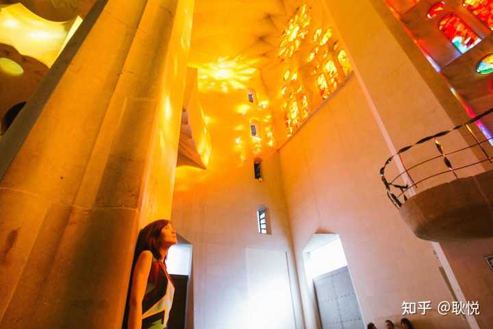

记得听作家蒋勋介绍哥特建筑的彩色玻璃时讲过：
“如果你穿白色的衣服走进教堂，透过彩色玻璃印在你身上的光，就仿佛圣光一样。”
这是高迪一生中最主要的作品，最伟大的建筑，也可以说是他心血的结晶、荣誉的象征。

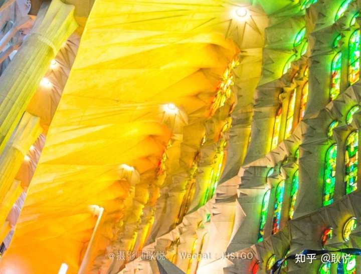

*图注：圣家族大教堂*
实在是太美了。高迪曾经说：“直线属于人类，而曲线归于上帝。”他的作品里都是曲线。

有人说他是天才，有人说他是疯子，因为“只有疯子才会试图去描绘世界上不存在的东西。”
我不知道该用什么词语来形容高迪的建筑风格：鬼斧神工、脑洞大开、经历过高度理性后回归感性、回归自然的纯粹与感动....

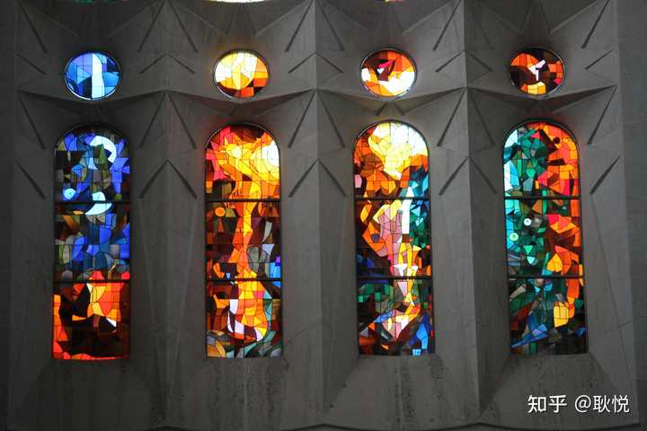

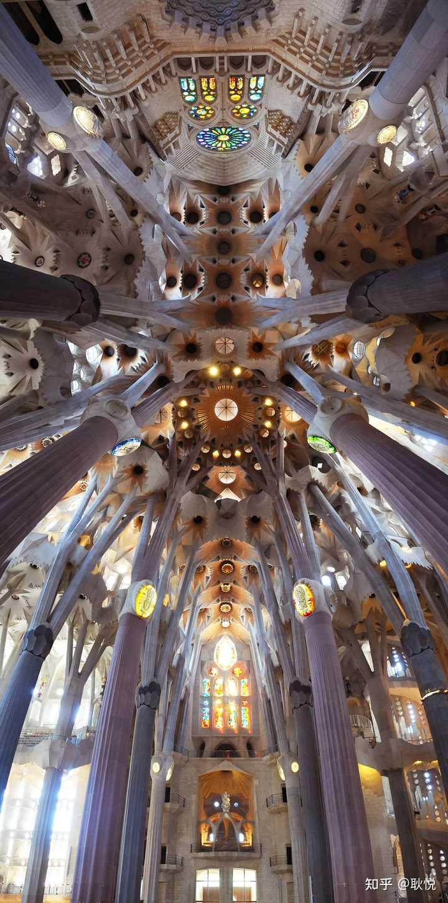

但真心引发我共鸣的，是高迪对美的追求和欣赏，非常地热切。
“他的建筑完全是另一个世界，是一个充满想象力、梦幻般的乌托邦。”

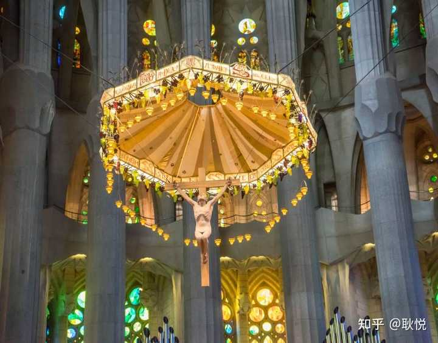

禾禾给出的建议：

A、圣家族大教堂一定要提前在官网上买票。
夏日旺季，提前个两三天买票都不为过，当天去买票可是买不到的哦。

另外，目前圣家堂只有两座尖塔对游客开放，需要在买票的时候，预订登塔时间。

B、要想拍到圣家族大教堂的全景，最好的地方去位于圣家堂东侧的花园。

花园里有一个湖，在湖的另一侧拍摄圣家堂，还可以捕捉到圣家堂水面的倒影。
当然，在旅游旺季，在这里拍照也是要排起长长的队伍的呢。
## 
**2. 在米拉之家，我开始读懂高迪对大自然的爱**

我爬到了米拉之家的屋顶，整座大楼宛如波涛汹涌的海面，
飘落树叶的阳台、布满武士雕塑的天台，爱上了高迪赋予建筑的浪漫。  

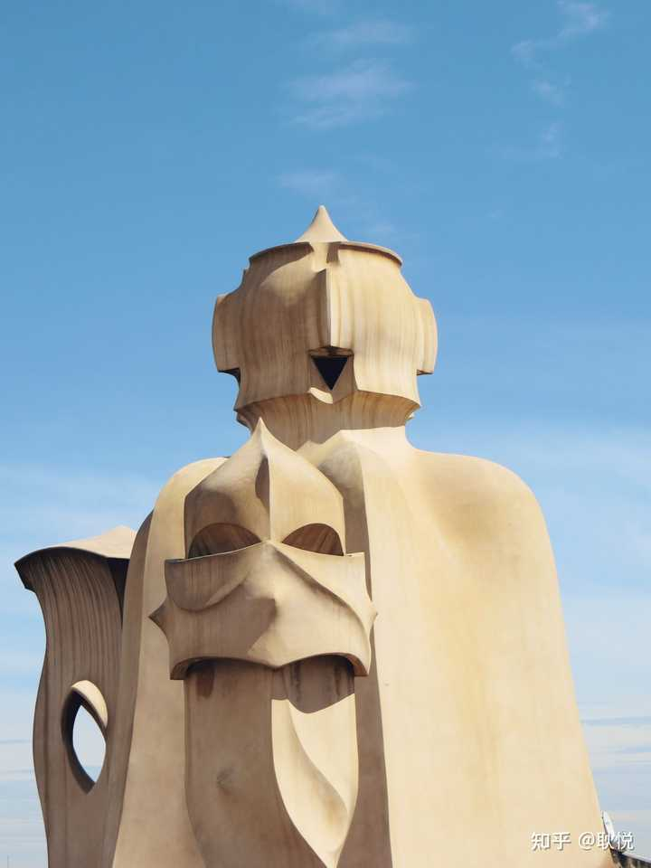

在这里被打动的地方至今记得：这个楼层的布局狭窄，有些地方是看不见阳光的。于是在顶部做了这样的设计，让阳光能够从顶端倾洒，让更多人看见光。

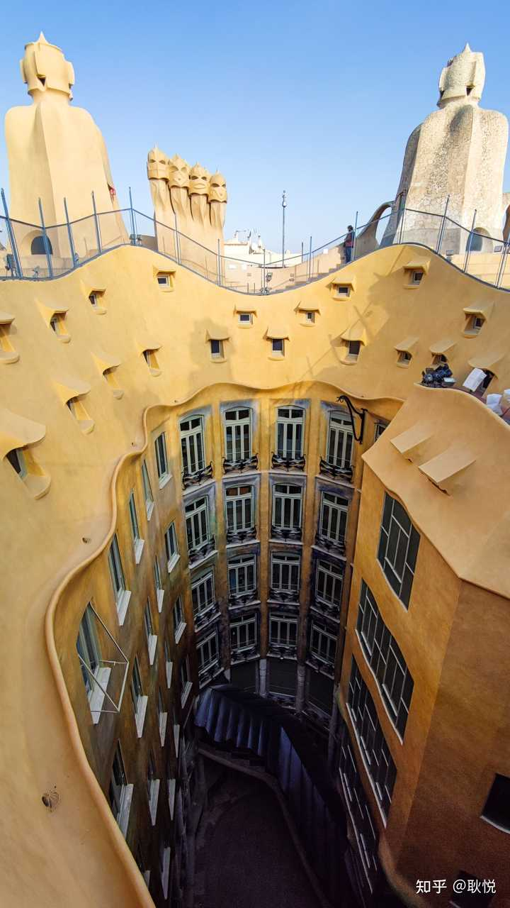

*图注：米拉之家 Unsplash*
高迪的社会思想，
也带给了米拉之家一些与众不同的特质，其中最突出之处便是屋顶露台。

在高迪的设想中，邻居们在这里晾衣物，晒太阳，聚会社交；

孩子们也可以围着被化为童话人物的烟囱和通风口奔跑、嬉戏……这个建筑将见证的，是一片其乐融融的生活景象。https://www.archiposition.com/items/646ece136a" data-tooltip-richtext="1" data-tooltip-preset="white" data-tooltip-classname="ztext-reference-tooltip">[4]

## **3. **巴特罗之家**，游至海水变蓝**
而我接着去探访他的下一个作品巴特罗之家，也是一个如梦似幻的童话世界，洋溢着满满的海洋元素：
漩涡般的天顶，水波般的阳台， 潜水艇般的房间，海渊般贴满蓝色马赛克的中庭......

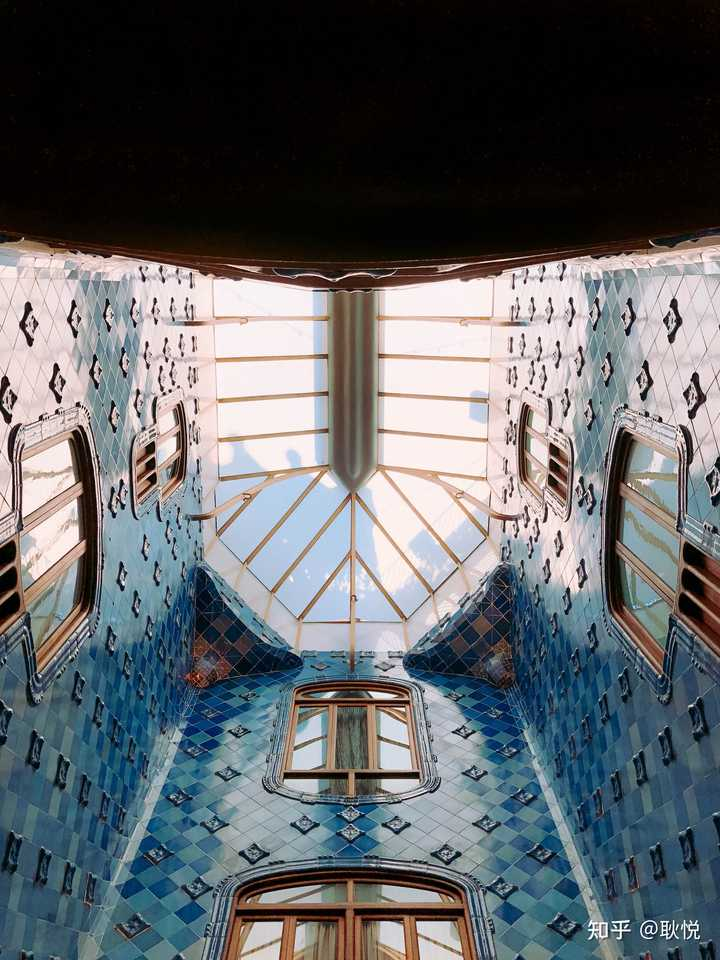

我看着这些建筑，开始去了解高迪的内心。
他是一个疯狂的人，有着极其丰富的内心世界。
他创作出了富有诗意的屋顶，建筑里充满了自然的灵性，如童话般五彩斑斓、闪耀。
我接着走进建筑的书店里，开始翻看高迪的书，和纪录片，开始慢慢了解他。

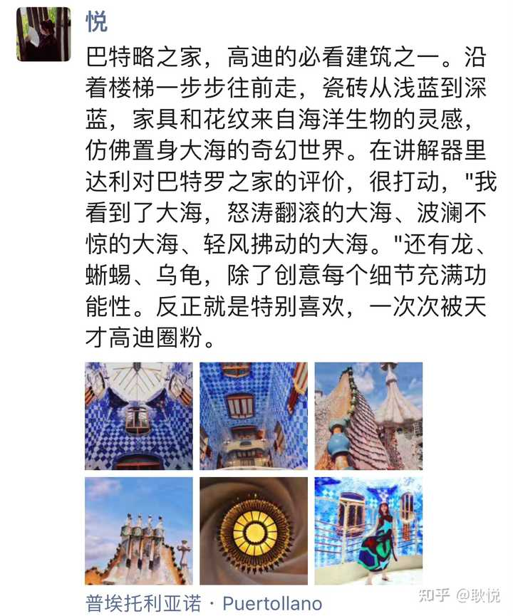

他是一名素食主义者，身心里充满对大自然的爱。
他认为这世界上最好的柱子是大树，最好的圆屋顶就是我们的头颅。

 

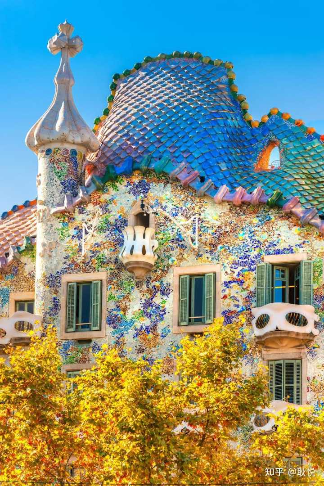

他用上帝的眼光去看城市。
那些不规则的弯弯曲曲的云层、贝壳、花瓣、水滴，都被他用进建筑创作的世界里。

## **3. 在古埃尔公园，我躺在马赛克长椅上晒太阳**

在伍迪·艾伦的电影《午夜巴塞罗那》中，迷人的女主角从古埃尔公园门口的台阶拾级而下的身影，一直定格在我的记忆中。

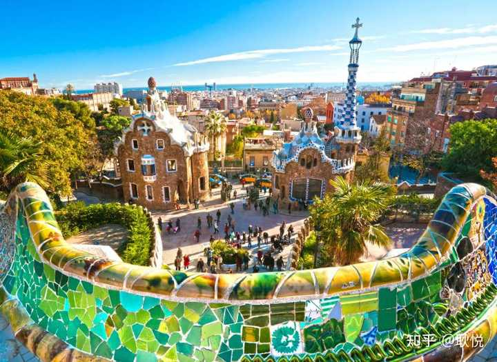

当我漫步古埃尔公园之中，仿佛又走进了一个童话故事。
这儿独特、梦幻，又散发着一种古怪的魅力，将唤醒内心里沉睡已久的疯狂幻想。

当你爬到半山腰，可俯瞰整个巴塞罗那。我斜靠在座椅上，仰望天空、眺望远处蓝色大海，晒晒日光浴，惬意小憩。
下山路上在漂亮的纪念品小店里，挑了几块绘有高迪作品的瓷砖作为伴手礼。

高迪酷爱使用西班牙瓷砖，在弯曲的蛇形座椅上、石柱、长廊上，都嵌满了各式的西班牙特有的马赛克图案。
这些图案全由瓷砖拼贴而成，色彩斑斓的碎片在阳光下闪耀光泽。

## 四、遇见100年的艺术酒店，住进一场复古梦境中
在巴塞罗那的这几天，我们度过了一个几乎完美的旅程。
值得一提的，还得给你们安利一家一百年历史的复古酒店。

因为酒店位置在市中心，每一天都可以变身City Walker，暴走巴塞罗那。

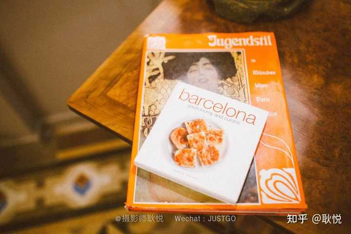

复古优雅的风格，精致审美的细节，各种文艺小情调。
马赛克拼花的地板和老家具非常漂亮。房间里每个角落，都是一副画。

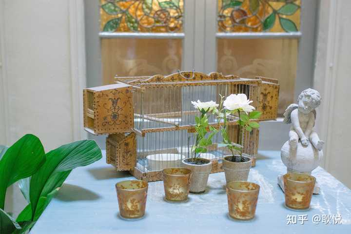

早晨推开落地窗，坐在小阳台上，喝着茶，低头看见楼下小花园，抬头眼前就是米拉公寓，就着阳光享受当地食材烹制的早餐，开启度假时一天的好心情。

酒店名称：Circa 1905

地址：Provenza, 286, Principal, 埃桑普勒, 08008 

早餐：

用西班牙当地食材烹制的早餐，新鲜丰富可口。
有一个独立的小房间里，会24小时提供免费茶水、咖啡，和冰箱，DIY使用很方便。

服务：

员工热情礼貌，很人性化，会帮忙预定圣家堂的门票。
在卡片上手写西班牙语帮助你认路等，有一种在异乡的温暖感。

适合：
想逛街购物的/想住在市中心每天去哪儿步行都方便的/喜欢精致调调复古风格的文艺者

位置：
我们直接在网上订的，酒店位置极好，就在市中心，距离米拉之家100米，
在著名的格拉西亚大道上，出行走几分钟就是地铁站，步行到老城区也非常方便。

附近地标：
距离米拉之家0.1 km  对角线大道0.2 km 
普罗旺斯地铁站0.3 km  格拉西亚大道地铁站0.4 km

附近热门去处：
巴特里奥之家0.4 km  
Tivoli Theatre1 km  
加泰罗尼亚广场1.1 km  
圣家堂1.5 km  桑特火车站2.9 km

**关于暴走和交通**

我俩因为住的酒店位置很好，大部分时间，都是禾禾带着我在城市里暴走，CityWalk模式，走走逛逛，穿梭在各种小店里。
但是要去一些稍微远一点的景点，和去海滩沐浴日光浴，我们就直接坐巴塞罗那的地铁，
我直接买了两次10次票，这种票可以用于巴塞罗那所有类型的公共交通工具。

使用起来很简单，把票从一个槽里塞进去，然后再从机器上面扯出来。一个人用完也可以第二个人再用。
**作为旅行摄影师，我想要推荐几个适合拍摄的节日：**
推荐有几个节日值得一去——色彩斑斓、流光溢彩的视觉盛宴：

2月  Festes de Santa Eulalia  

2月12日前后举行，其中难得一见可以好好拍摄的题材是“夜光叠人塔”

4月  塞尔维亚 四月节：身着盛装的西班牙女郎载歌载舞，节日的装扮元素很浓郁。

5月  科尔多瓦庭院节：庭院深深，花香满园。

5-6月 巴塞罗那市区会举办各种音乐节。

9月 圣梅尔塞节是一场非常盛大的夏日压轴派对，每到夜晚就流光溢彩，会出很多好片子。**和一些最美的摄影瞬间**（我收藏的LP一些秘籍）：
天气晴朗时，登上巴塞罗那大教堂的屋顶，
将大片云朵下巴塞罗那的中世纪风情尽收眼底。

米拉之家：屋顶起伏如外形地表，碧空中的鱼鳞化身为点点装饰。

港区日落时分：蓝天尚未消逝，斜射的阳光穿过或浓或淡的云层，灿烂的金色码头让人迷醉。

入夜后的阿格坝大厦，用红蓝双色变幻成一片流光溢彩。

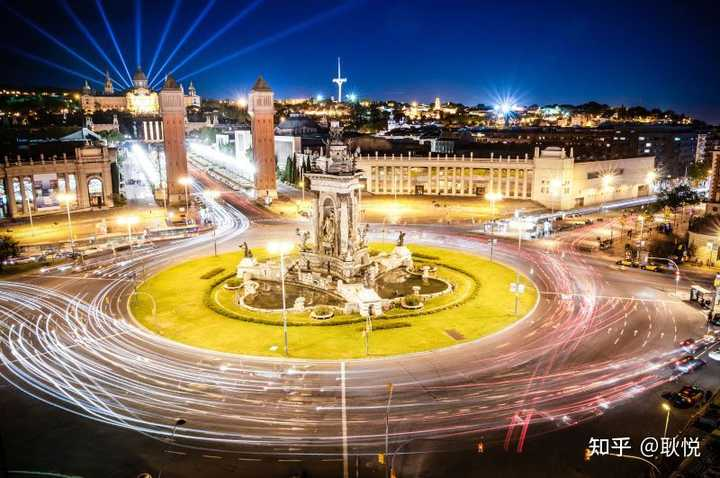

（2017年的信息，目前有很大的改变，如需出行请查阅最近的政策。）

签证

中国大陆公民需要申请申根签证，单次/多次入境签证费60欧元，停留期根据申请时间长短而定。

我是申请的法国签证，欧洲申根一年。

货币

欧元EUR；1元=0.15欧元  1美元=0.91欧元

飞往巴塞罗那航班

北京-巴塞罗那   视航空公司不同，14-20小时，需转机。

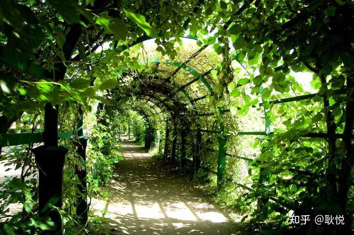

这是夏天的地中海沿岸，夏天的巴塞罗那。
整座城市，享有着绝无仅有的灿烂光芒。

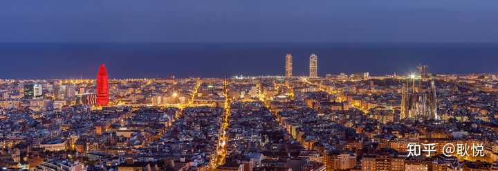

慷慨热烈的阳光倾城，肆无忌惮地洒进圣家族大教堂，流淌在热情的海滩边。
到了夜晚，就发酵成浓烈的酒香。
“快乐的气味在流浪者大道上弥漫，管风琴的乐音在每个角落柔和地荡漾。”

我们一路攀爬到城市的最高点，俯瞰夜色中的巴塞罗那.....  
那些独一无二的城市细节，都放进了我的旅行记忆里。
后来我们又组织了一次艺术之旅，因为当时「总想再去看看」，流连忘返。

## 参考
^© Fulanitu i Menganita^https://www.willflyforfood.net/spanish-desserts/^https://www.bonappetit.com/recipe/horchata-recipe#intcid=_bon-appetit-recipe-bottom-recirc_d6921728-1571-4826-97a7-2d1973e95aa7_cral2-2^https://www.archiposition.com/items/646ece136a已开启送礼物所属专栏 · 2025-01-27 06:19 更新

JUSTGO

耿悦​

旅行话题下的优秀答主106 篇内容 · 1789 赞同最热内容 ·你曾踏足的城市中，在哪些地方体验到了「建筑之美」？编辑于2022-11-29 12:26・四川​ 修改​赞同 35​6 条评论​46 ​分享​​设置收起​

---

*巴塞罗那，从未让人乏味过。2017 年的长游记。*
