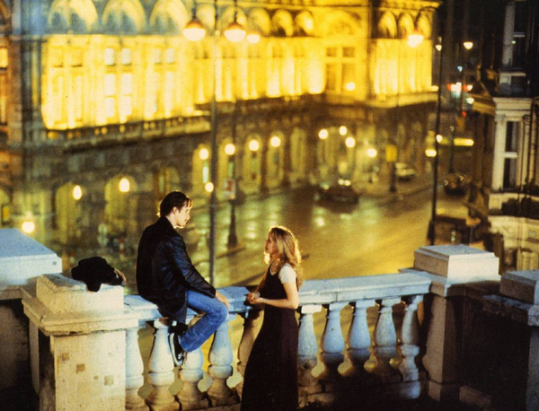
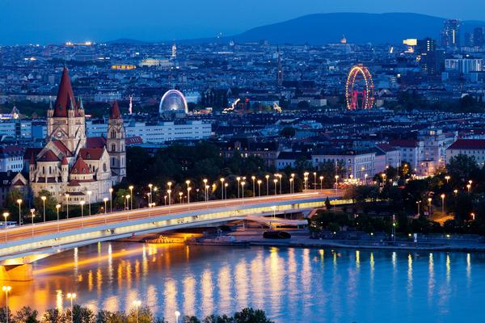
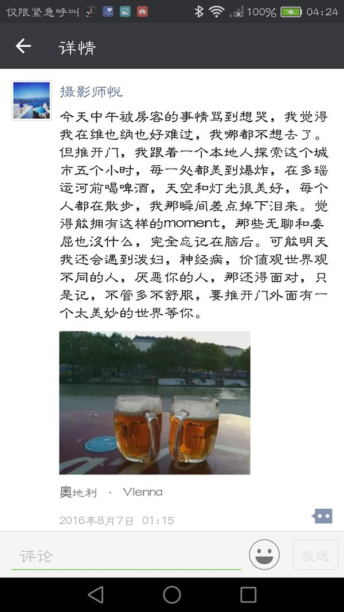
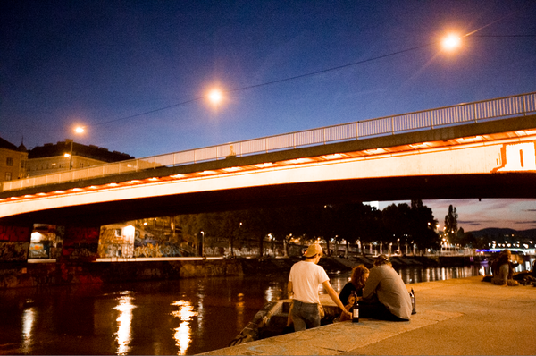

# 多瑙河畔 · 浪漫会抵达，不快乐也会翻篇

Before Sunrise 的维也纳

---
只是记，不管多不舒服，要推开门外面有一个太美妙的世界等你。 比如多瑙河。倒没有反复回味，但是美好的湖畔漫步的体验。 前几天想起导演 理查德·林克莱特，从年轻时喜欢 爱在三部曲， 那个动人的故事，带给我的能量和感动，是跨越世界和语言的。

甚至不知道也不记得导演的名字，但是当我去维也纳旅行居住重新走这部电影的路线， 我的浪漫里，有他的一份光华。传递到了我这里。 觉得最珍贵的能量是这种。

除了浪漫的念念不忘必有回响， 还有转念。 那天发生了一件不愉快的事情， 当时还在做民宿房东，遇到了一百个很好的房客里的1%概率的奇葩房客。 就专门来找茬的，并不了解民宿是什么，预订好之后进来把房间从头到尾箱子抽屉全部很粗暴翻了一遍，彻底弄乱， 然后对着作案现场拍照打了一个差评。

当时还挺愤怒的，因为一个差评，能让你几个月的分就此影响，超赞房东也没了， 我那天刚到维也纳，本来心情是不错的， 这个漏网之鱼。为了不纠缠给t a直接退款不接受继续住宿后，回了同样差评。然后t a开始骂骂咧咧。 我处理完之后，心情很糟糕，当时哪也不想去了，旅途心情彻底破坏掉。 记得就是后来还是出了门。傍晚时分，当时维也纳房东，带我沿着多瑙河边散步，看河水漫漫地流淌，灯火一点点明亮。

在多瑙河畔干杯啤酒，聊t a中学的故事，这个城市里对他来说动人的往昔，和期待。 多瑙河的灯光，让我想起来电影中看过的一幕。

---

## 版权

本文为耿悦原创，版权所有。未经许可不得转载或商业使用。
