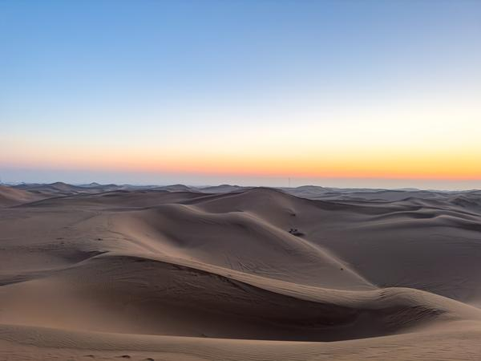
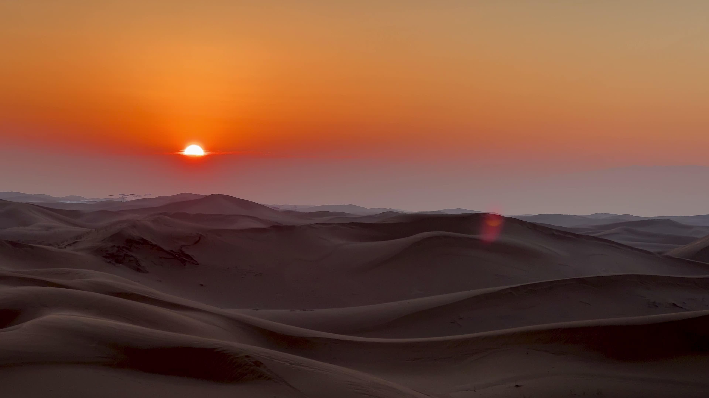
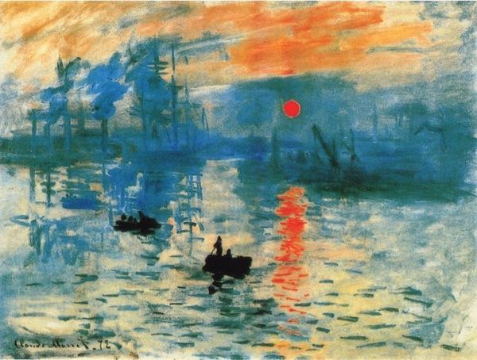
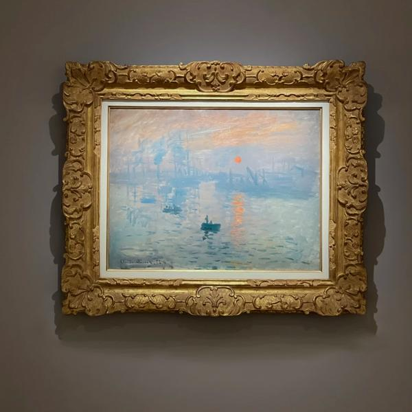
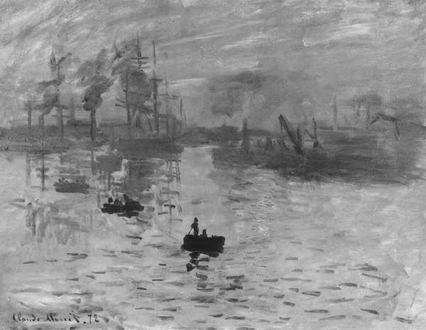
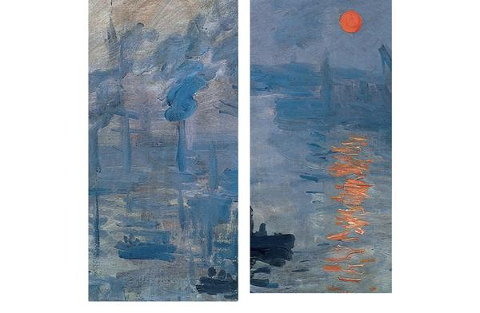
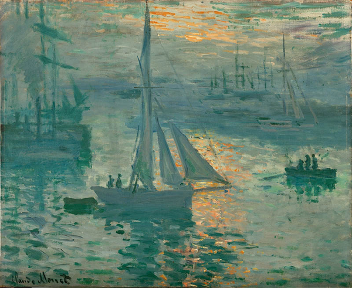

# 早起看日出，到底值不值

腾格里沙漠的日出与莫奈

---
我们活过的瞬间，前后皆为暗夜。 费尔南多·佩索阿

当你目睹太阳升起的时刻。就像是太宰治笔下《人间失格》中的一刹那清醒，明亮而短暂，瞬间也永恒，但足以让人记住。 你会有一种人只要活下去，就能再一次看见新的太阳。照亮了暗夜。

观看日出这一行为本身，就使人联想到希望。 喜欢看日出的，骨子里还是比较乐观的，否则t a们也不会起那么早，为了从灰色的天空，到完整感受到金色光芒万丈，这个过程。 还是值得的。你会想起为什么那么多画家诗人永远喜欢画这种题材。

这是我站在腾格里沙漠等日出， 当时曙光初露，天地还是模糊灰蒙蒙的， 太阳的前兆不是轰轰烈烈的，而是渐进的、细微的变化。

沙漠在日出时，就像一幅不断变化的画布，光线如色彩挥洒。 阳光洒在沙漠上，给每个物体都披上了一层金色的外衣。 沙粒由黯淡无光变得闪闪发亮。

并不算是那种风景摄影师，到每个地方都会去拍日出日落。 在沙漠拍星空之后的次日清晨，大概五点十分，从酒店走出来，去看日出。 那是一个很静谧的过程，天几乎是灰色的，只有我自己往前走。

好的是，不需要辨别方向，也不需要问路。 微微的光芒正从正面的沙漠地平线向上冒出，你只需要走近， 接下来就是漫长安静的等待，灰白的天空逐渐明亮，直到太阳一点点跃出地平线。 金色的沙面从幽暗产生了光泽。

如果太阳升起时，沙漠里只有你一个人， 直面壮阔风景，那也会是个难忘的清晨。 拍日出除了要早起之后，还有一点，很冷。特别西北早晨，穿上防风外套，棉衣棉裤。 看到今晚推送的限时回答，拍了点日出没有发过。 没啥别的意思，就是答题。 龙年顺利，新春喜悦，朋友们，又活过了一年。

04:07 如果要拍的话，三脚架加相机。 手机现在也是可以直接拍的，固定在一处，对着太阳拍记录过程。i Pho ne手机，和华为可以直接用延时拍摄。 或者就用视频录制出， 太阳的移动感。 就好。 《日出·印象》莫奈 来看一幅画吧，《印象·日出》，让这个现代瞬间，融入百年前的潮浪里，正在日出。 虽然是一副小画，但却是印象派的开山之作，至今为止最杰出/最具代表性的印象派作品。

《日出·印象》， 法国印象派著名绘画作品，布面油画，1872年创作，纵48厘米，横63厘米，现藏巴黎马蒙达博物馆。 作者 克劳德·莫奈，印象派画派的创始人之一，该作品也被视为印象派的开端。 莫奈擅长风景画，该作品突出体现了他追求最真实的光效和色彩、恰如其分地表达自然界的微妙变化的艺术风格。 受《日出·印象》的影响，许多艺术家开始注重追求瞬间的印象表现，打破了写生和创作的界限。 这幅画虽然不是莫奈最典型的作品，但它却是印象派画史上一面旗帜，因为“印象派”这个名称就源于这幅《日出·印象》。

历史背景 19世纪70年代的法国，一批志同道合的青年画家不满古典主义画派的公式化传统，决心冲破旧的传统束缚，为画坛带来新鲜的空气。 尤其是当时的科学发现使他们震惊不已，原来人们日常生活中所熟悉的色彩并不是物体本身固有的，而是光线照射的结果。

对了，我最近看一个问题 「为什么天空是蓝色的」，也想起来了光线的折射。 就这幅画来赏析，或者换句简单的话说： 没有光线，就没有色彩。 白色的太阳光原来是由七色合成，世间不同的事物对光线的反映是不一样的。 如果甲物体吸收了全部七种颜色的光线，甲物体便是黑色； 如果乙物体反射全部七种颜色的光线，那么乙物体便是白色； 如果丙物体吸收其他六种颜色而只反射绿色的光线，那么丙物体就是绿色，如树叶的绿色便是如此。 自然科学对光线和颜色之间这种关系的揭示，令莫奈等一批年轻画家们兴奋不已。 他们一旦知道了自己原来十分熟悉的各种色彩其实都离不开光线的作用， 于是便主张画家到大自然中去，到太阳光下去观察对象，去捕捉光线和色彩的瞬息变化。

画作描绘了法国勒阿弗尔港口的一个早晨。晨曦微启，海面被染成淡紫，逆光的小船在荡漾，远处是依稀隐约轮廓模糊的码头和工厂， 亮丽的橘黄色太阳自天边缓缓升起，温柔的水波似舞蹈般微微荡漾，反射出蓝色和绿色的投影。 远处的船只被清晨浓重的雾霭所掩盖，若隐若现。万物笼罩在柔和的薄雾里，这个世界是真实的，又是幻觉。/ 莫奈打破了原有的绘画观念，不再认为事物的颜色是固定的、只有明暗之分， 他不单纯使用一种颜色去表现事物，而去捕捉特定的光线、时间、环境下，事物色彩呈现出的细微差别。 因此，在他的画笔下，日出时分的海港，有淡紫、蓝灰、淡蓝、微红、橙黄、橘红等多种颜色， 莫奈把这些颜色巧妙地过渡在一起，像摄影师一样留住了日出时美妙的瞬间。

日出下的海景 1873年 布面油画 50.2 cm×61c m 保罗·盖蒂博物馆，洛杉矶 《日出下的海景》与莫奈最为著名的另一幅作品《日出·印象》， 这是与《日出·印象》创作于同一时期、同一场景的另一幅作品。具有同样随意洒脱、不拘一格的笔触。

---

## 版权

本文为耿悦原创，版权所有。未经许可不得转载或商业使用。
