# 迪拜 · 一座沙漠里的奇迹之城

从上帝视角的水上飞机，到沙漠里的黄金帆船，再到沉静的老城区——这是我眼中的迪拜。

> 注：本文由我早年在携程发布的 8 篇笔记合并而成，它们原本属于同一篇长篇游记。

---
## 包一架水上飞机，以上帝视角俯瞰迪拜

我们包了一架水上飞机看迪拜，以上帝视角俯瞰迪拜

先给大家看一个我从迪拜高空中拍的视频。当飞在迪拜的高空，我左手录着视频，右手拍着照片，一刻不得闲。其实只是想让我在乎的人，也能看到震撼我的美景，感受到那个时刻同频率的心跳。

我们在一个清晨，坐上了Seawings公司的水上飞机。白色的小飞机一次可乘坐9个人，我们同行一共四位酷酷的摄影师，体验了一次“包机”之旅。

飞机开始在水面展翼滑翔时，我的肾上腺素马上飙升，体会到一种最熟悉的离开地面的兴奋感。

我们的机长有点帅，但也有点高冷，当白色飞机不断飞升，他竟然还举起iPhone拍起了风景...

我开始翱翔在蓝天中，像鸟儿般鸟瞰这座奇迹之城。

那天的天气特别好，阳光明亮耀眼，震撼的风景在碧海蓝天中一览无遗。世界第八大奇迹棕榈岛，犹如漂浮在海面一般，这岛上遍布世界顶级豪华酒店、别墅、水上乐园。

人类第一高楼，目前人类造物可企及的至高点——828米高的哈利法塔，收拢了璀璨光芒的大楼在阳光下，仿佛一个奇迹。

摩天大楼闪着金光，就像一件件精美的艺术品。

这是一次极致的体验，在飞行的25分钟里，我们在飞机里一边欣赏，一边从这个窗口，换到另一个窗口去疯狂地拍摄，相当刺激，但也有些意犹未尽。

如果你未来去迪拜旅行，建议你上天“飞一次”，像鸟儿般俯瞰奇迹之城，在云端的美妙时刻，就仿佛你离开了平庸的生活，离开办公桌，甚至脱离地球表面，一起愉快地飞一次。

水上飞机攻略

（一些可能会对你有帮助的信息）

问：在天上，能看到迪拜的哪些风景：

悦：游览核心是迪拜的标志双塔——哈利法塔（Burj Khalifa）和帆船酒店（Burj Al Arab）。当在蔚蓝的天空中，会看到迪拜所有著名的景点，包括世界上最豪华的帆船酒店，世界最高建筑哈利法塔，以及世界第八大奇迹——著名的迪拜“棕榈岛”和“世界地球群岛”等。

问：飞行时间有多久，可以和同伴一起乘坐吗？

悦：飞行时间是25分钟。一架飞机含9个客人座位。

问：怎么预定？

悦：可以通过网站，电话或者邮件方式预定，网址为www.seawings.ae，电话为+971 48070708, 邮件烦请发送至sales@seawings.ae；联系人是个年轻友善的姑娘： Mrs. Yuxi Fan - Sales Executive 这是我们的预定方式，分享给你。

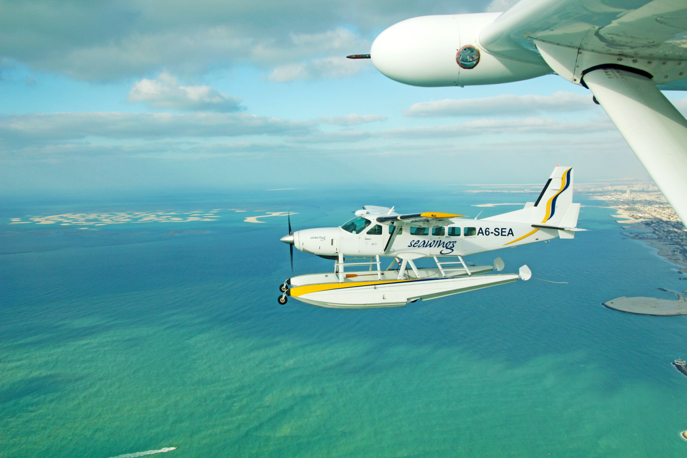

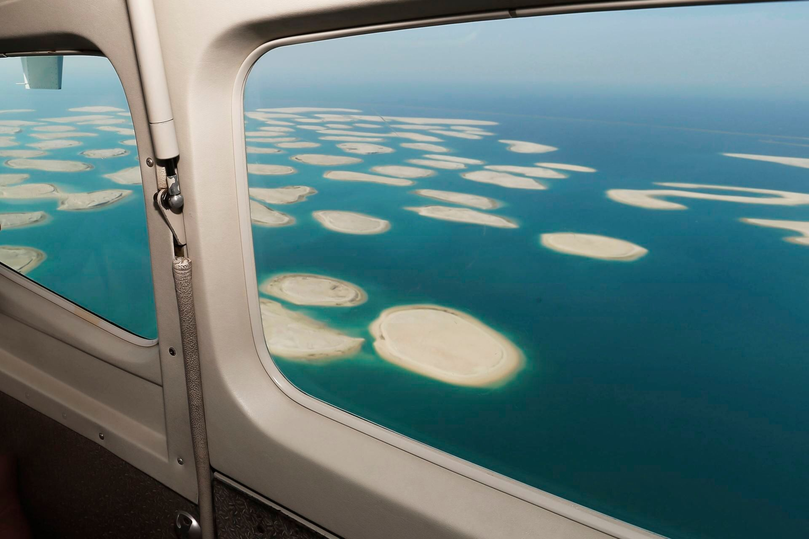

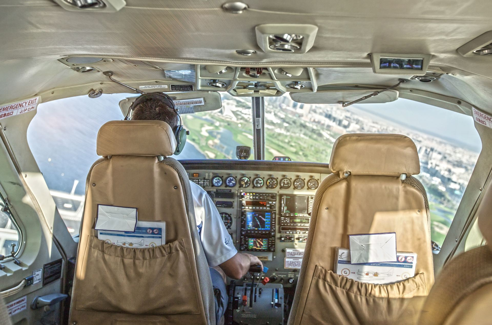

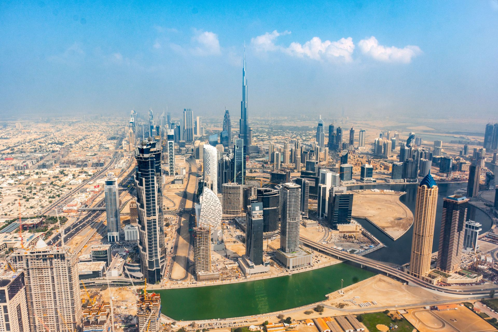

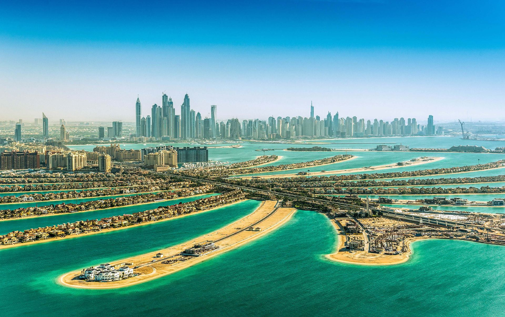

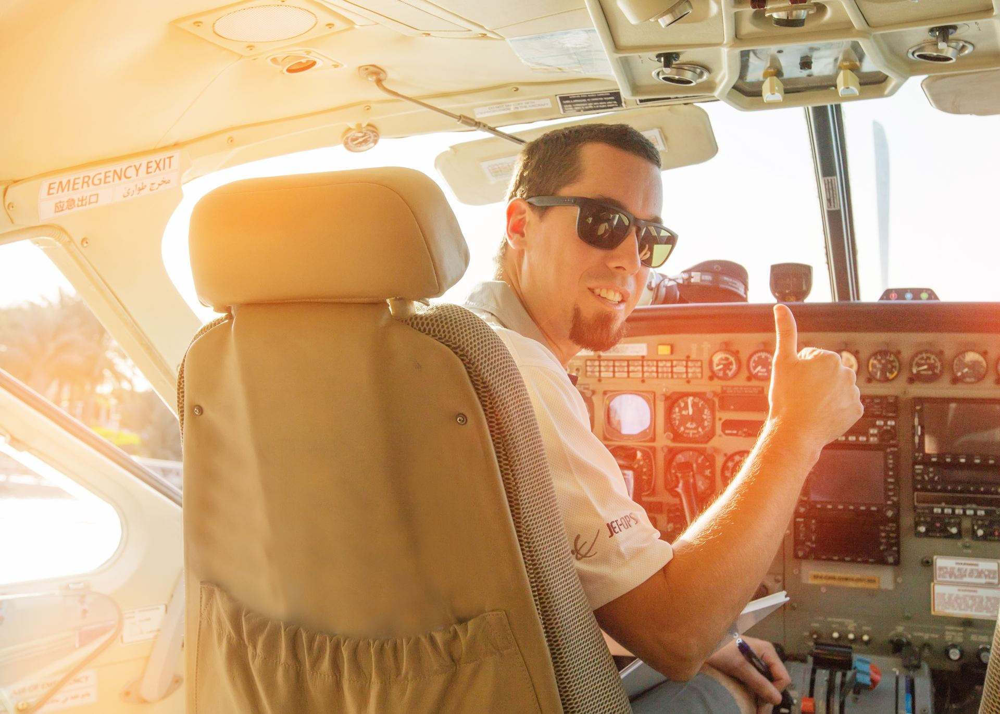

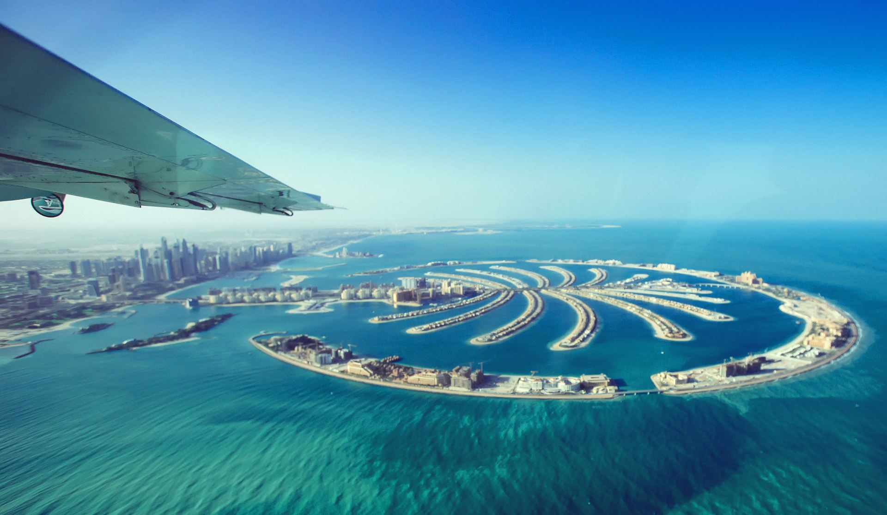

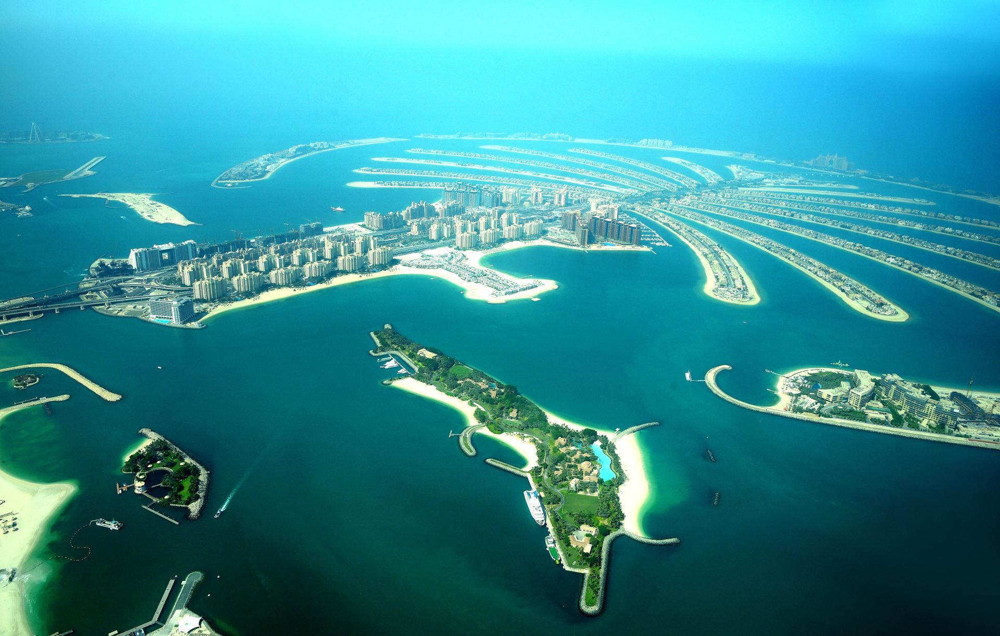

## 帆船酒店：沙漠里的黄金奇迹

迪拜帆船酒店，一共有56层，321米高，由英国设计师W.S.Atkins设计。客房面积从170 平方米到780平方米不等，最低房价也要900美元，最高的总统套房则要18000美元。总统套房在第25层，家具是镀金的，设有一个电影院，两间卧室，两间起居室，一个餐厅，出入有专用电梯。已故顶级时装设计师范思哲曾对它赞不绝口。

我的感受：从远处看过去，帆船酒店更像是一艘行进中的酒店，外形非常独特，它遥立在水波中也足够惊艳。据说，当年酒店的豪华程度令人叹为观止，评论家们都不知道该给它定为几星：是五星，六星，还是七星？走进酒店，你才知道什么叫做“金碧辉煌”，它的中庭是金灿灿的，它的最豪华的780平方米的总统套房也是金灿灿的。

听设计师说说背后的设计故事：

“能成为地标的建筑都是独具特色的，” 汤姆 · 赖特说道，“在为迪拜帆船酒店做设计定案时，我们把建筑的外观造型画出来，画得越快证明设计越独特。” 五秒钟就能记住它的外形。

“这样的建筑可不多，” 赖特补充道，“你一画出迪拜帆船酒店的形象，人们就知道那是什么。”

我们拿到的方案概要表明期望修建一座能让迪拜名扬国际的建筑，所以我们认识到，只有设计一个令人印象深刻且前无古人的造型才能达到目的。酒店竣工将近四年之后，这栋建筑才开始为世界媒体广泛报道，迪拜也开始成为人们热议的话题。迪拜帆船酒店逐渐成为迪拜的形象代表。

当年迪拜的建筑都是清一色的水泥砖块再刷点颜色，楼层也都不高，结果突然同时冒出了迪拜帆船酒店和阿联酋大厦两座庞然大物。它们改变了一切，一夜之间便吸引来无数的商机和资源，极大地推动了迪拜的城市建设。

——汤姆 · 赖特 （Tom Wright）迪拜帆船酒店Burj Al Arab设计者

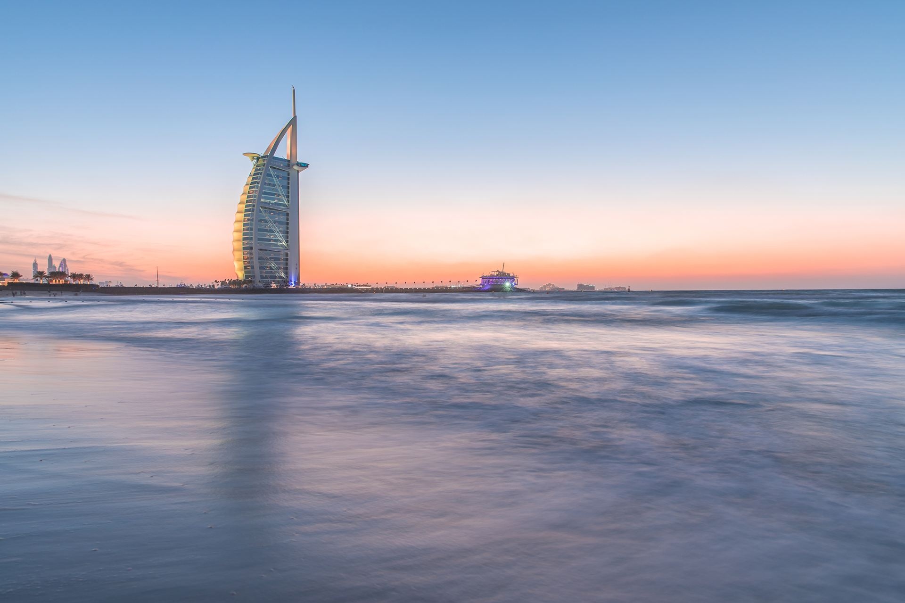

## 世界最美花园：4500 万株鲜花打造的沙漠奇迹

世界最美花园，迪拜用4500万株鲜花打造沙漠奇迹

去世界最大的花园，看世界上最浪漫的飞机。

众所周知迪拜是一座善于创造奇迹的城市，他们在沙漠中创造了“伊甸园的一角”，建造了一座全世界最大的花园——迪拜奇迹花园（Dubai Miracle Garden）。这座花园占地18英亩，有4500万株花卉，在2013年获得吉尼斯世界纪录的认证成为“世界最大垂直立体花园”，园内一座一千米布满繁花的长廊有望再创造一个新的吉尼斯世界纪录。

奇迹花园位于Mall of Emirates 南边十多公里处。导游给我们讲解着这座花园浪漫的故事：2013年耗巨资打造的奇迹花园建成，并选在了2月14日情人节这一天对外开放，因此吸引了世界的目光。

走进奇迹花园，这里与来时路上道路两边的沙漠形成了鲜明的对比，目光所及全是花的海洋，姹紫嫣红，花朵在蓝天白云下绚烂至极。花园里的人工河绕着各种花卉装饰的景观，有欧式、日式、阿拉伯式的建筑，各种拱门，各种动物和禽类的造型，还有代表迪拜元素的哈利法塔等形态各异的造型。此外，园内不单单只有花卉，因为地处沙漠，还会有各种树木做成的围墙，用于防风沙。

奇迹花园不同于国内平面的花园，它最大的特点是立体，花园内的各种建筑全部用花卉覆盖装饰，构成了一个立体的伊甸园式的花园王国。

奇迹花园每年的主题不同，所以会根据主题在6-9月培育花卉，10月或11月到来年的四月份对外开放，而在其他炎热的月份是关闭的。由于花园地处沙漠地带，日照非常强烈，因此在参观过程中，一定要做好防晒补水措施。随身携带遮阳伞，太阳眼镜和饮用水。

在道路两边也会有一些饮品店和乘凉的花架，这是我见过的最漂亮的乘凉之所。

行动不便的老年人可以乘坐电瓶车。园区内还有公共厕所，洗礼室及祈祷室供游客使用。设施非常完备，也非常人性化。

你也许会问，浇灌那么多鲜花到底需要用多少水，事实上，花园采用了独特的分型面的灌溉系统，通过滴灌，同时避免蒸发并节省多达75％的水和能源。此外，这个花园的配套设施也很完善，包括VIP停车位、休息区、祈祷室、厕所、沐浴设施、保障房、急救室、残疾人推车专用道、零售和商业亭等，配套相当齐全。

这里的花卉来自世界各地，其中大部分花都是在中东很罕见的，比如矮牵牛和天竺葵。现在园区也正尝试栽培能四季常开的花卉。

这个季节有些地方已万物凋零，在迪拜则完全相反，正是户外花朵盛开的最佳时节。

这里又像一个巨大的婚礼现场，各种心形的拱门吸引了许多情侣在花下留影。

奇迹花园每个季节都会展现不同的风格，因为每一季，花园都会有不同的主题。今年我们有幸在奇迹花园观赏到世界上最大的由花卉装饰的客机—阿联酋航空新型空客A380客机，这也是迄今为止世界上最大的载客飞机，这架花卉飞机由超过50万株的鲜花与植物组成。

当鲜花盛开时，飞机上将有多达500万多盛开的鲜花，其重量超过100吨。据导游介绍A380的实际重量有575吨。

奇迹花园，为什么说奇迹呢？就因为在这个沙漠城市中完全靠人工培育出一个花园，建造耗资巨大，日常维护也成本极高，需要用20万加仑的水来浇灌这些花卉。

在迪拜豪车、名表，各种奢饰品对当地人来说都算不了什么，真正昂贵的是植物，一棵树一年的养护费是1000美金，看哪家有钱不是看房子多大，车多好，是看哪家树多草多！用这个标准你就知道这个奇迹花园有多了不起了。

奇迹花园里面很多吃的，还有一些小店，天气不热可以玩3小时左右。

奇迹花园门票：

成人40AED

3-12岁 30AED

2岁以下免费

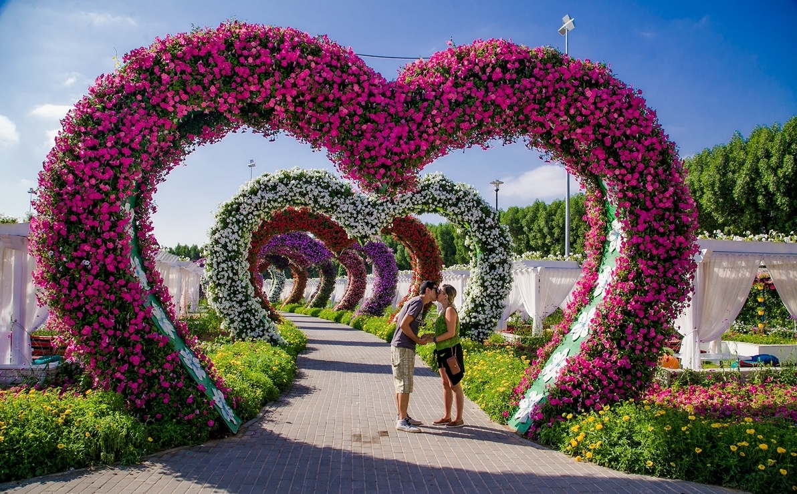

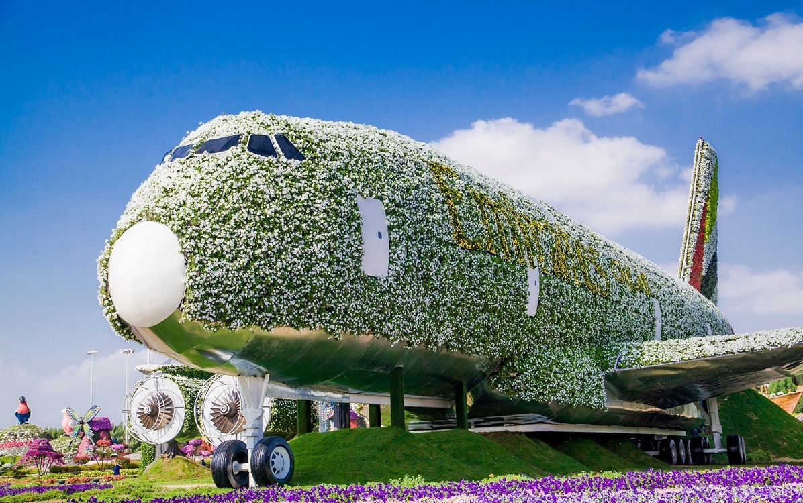

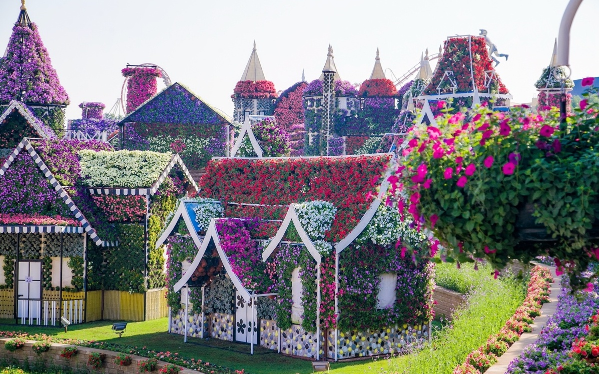

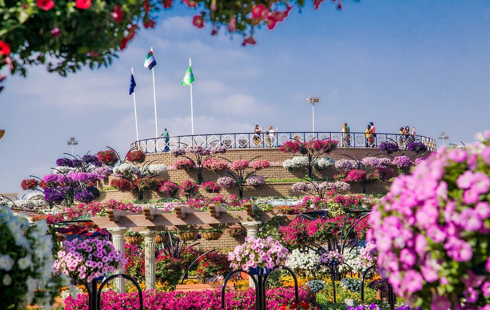

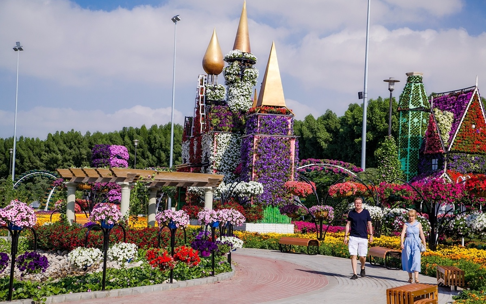

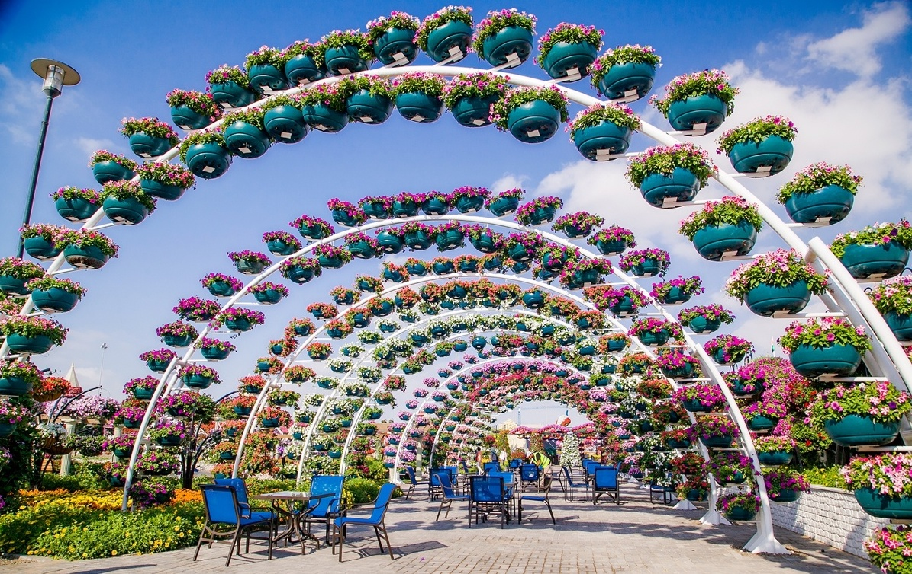

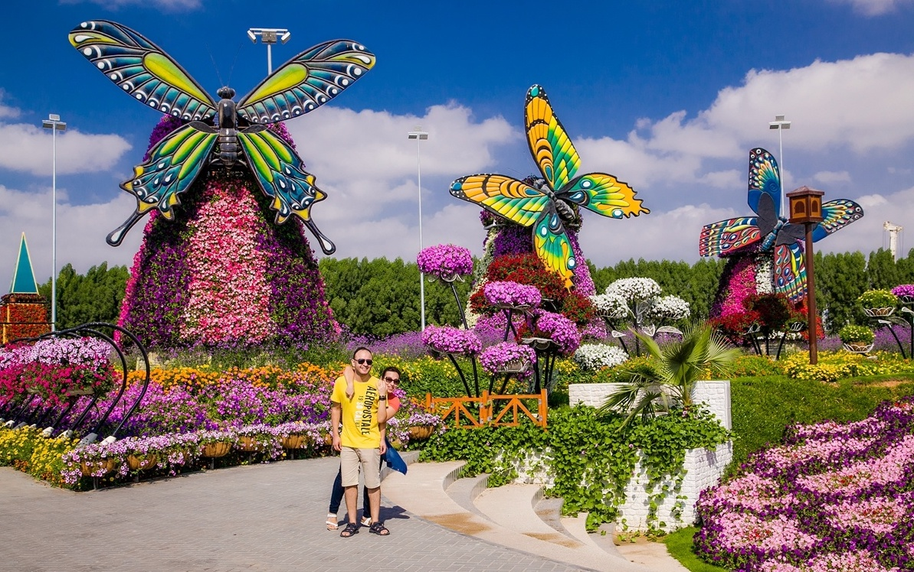

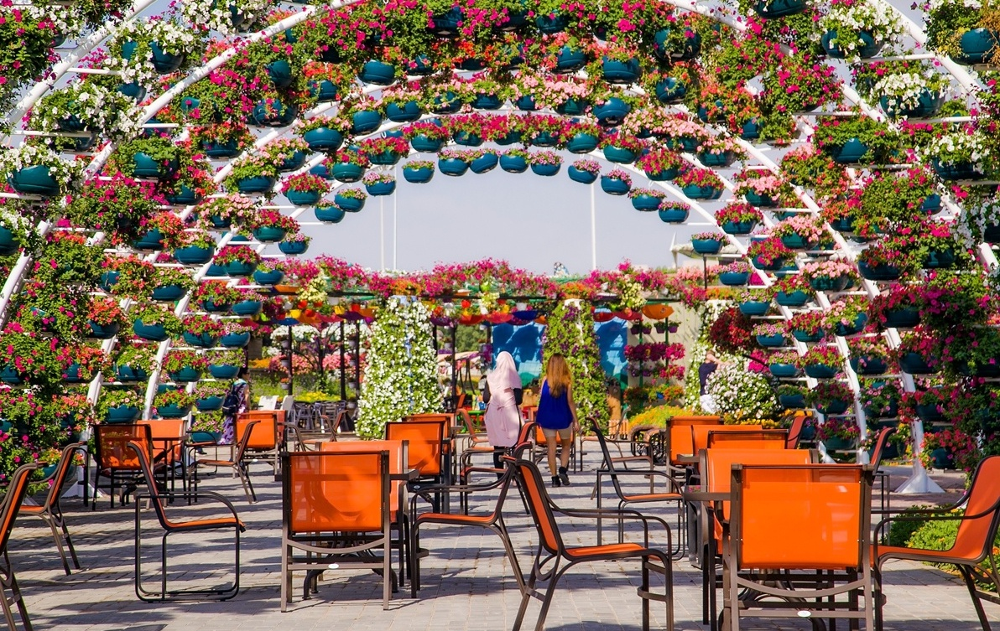

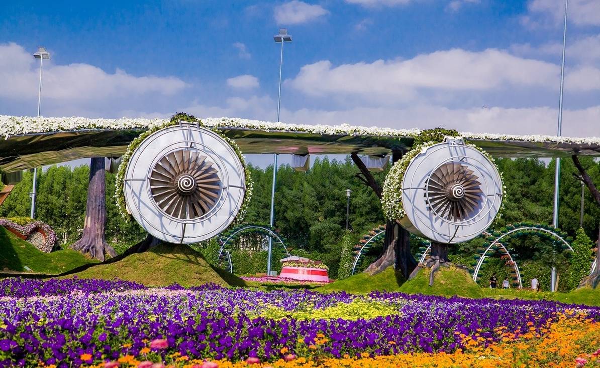

## 沉静的老城区：隐藏着多少不为人知的秘密

迪拜沉静的老城区，隐藏着多少不为人知的秘密

迪拜曾有许多“壕的传说”，现在基本都已澄清，这些都源于我们对他的不了解，每个城市都有许多面，而迪拜除了广为人知的最奢华的酒店、最大的购物中心、最高的大楼等等之外，还有它悠久的历史和文化，迪拜老城区就展示了它深厚又沉静的另一面。

谢赫穆罕穆德文化中心 SMCCU

在这里可以了解迪拜的历史。

想了解迪拜的历史，就得从谢赫穆罕穆德文化中心开始。1998年，SMCCU创立，这个机构的建立就是为了让更多人了解迪拜，了解阿联酋。“这个中心扮演着双重角色”，SMCCU的总经理纳西夫·凯德（Nasif Kayed）说。“其作用之一是消除屏障，促进人们对我们国家、文化和宗教的了解。另外一点是教育阿联酋人如何了解外籍人士并与之和睦相处。”SMCCU安排的活动丰富有趣，这里有传统阿拉伯早餐以及美味的午餐，每逢周一和周三，SMCCU就会举办当地传统早餐会，周日和周二则是文化午餐会。这是一个品尝原汁原味当地美食的绝佳机会，也是同阿联酋本地人会面、询问及交流的好机会。通过美食直观展示阿联酋文化。

为了能使广大游客更真切的体验阿联酋当地的生活习俗，这里还推出了早午餐和晚餐，客人可以沉醉在一个轻松、友好的氛围内享受阿联酋原生态的传统美食，与此同时会有一个知识渊博的阿联酋当地人与客人以互动的形式讲解当地的传统习俗。

当地的老师讲解阿拉伯妇女戴面纱的文化知识，同时还可以品尝到阿拉伯美食。现场有种中国传统谈经论道的感觉，氛围很轻松，游客也不时的会提出自己的问题，老师都会认真的解答。

早餐开放时间: 每周一与周三 上午10点 80迪拉姆/位

午餐开放时间: 每周日与周二 下午1点, 90迪拉姆/位早

午餐开放时间: 每周六 上午10:30 100迪拉姆/位晚餐开

放时间: 每周二 晚上7点, 100迪拉姆/位

活动持续时间为90分钟，（必须预订）。

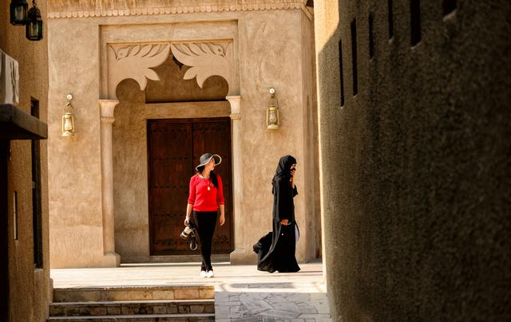

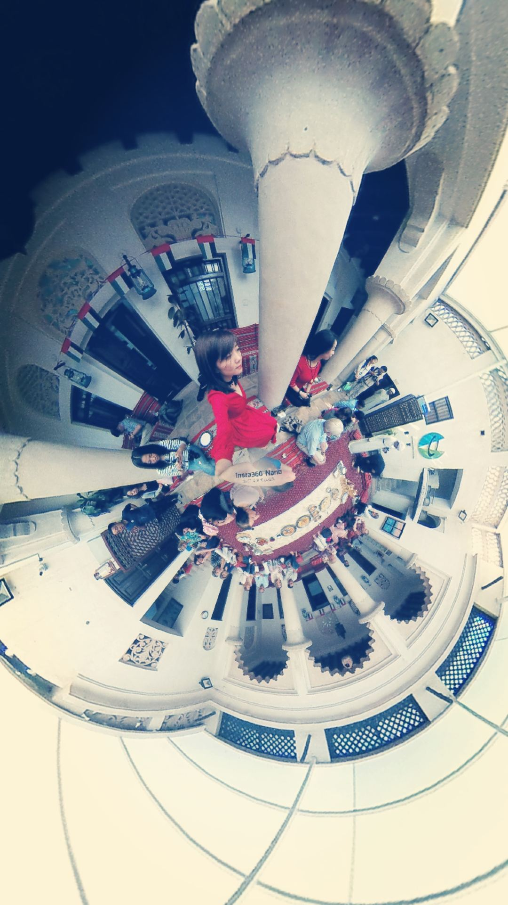

## 迪拜博物馆：走进迪拜的过去

离文化中心不远，就是迪拜博物馆。迪拜博物馆是一座大型综合博物馆，1971年开馆。馆址位于法希迪城堡内，始建于1787年，是迪拜现存最古老的的建筑物。最有意思的时在馆外还有一首证明迪拜过去渔港码头历史的船。这里曾经是酋长住所、宫殿、军火库、监狱，阿联酋成立之后被用作博物馆，展示阿拉伯地区的历史和文化。

迪拜博物馆陈列室位于在古堡地下室,有旧时阿拉伯人的乐器，生活用品、采集加工珍珠的工具，还有在艾古沙尔亚（Al Ghusais）遗迹的4000年古墓中发掘出的精美的铜器、石膏制品和陶器，值得慢慢欣赏。沿着台阶环形坡道进入迪拜博物馆一地下室，这是室内展示的部分，首先映入眼帘的是一些照片，那是反应迪拜从50年代到现在的飞速发展。从破烂不堪的小渔村，到现在国际化的大都市，很难想象才几十年的时间，迪拜就发生了这样翻天覆地的变化。墙的另一面，采用投影的形式，播放的阿拉伯人过去的生活场景，再现了石油时代之前阿拉伯人的日常生活和民族风情。再往里走，是一个仿古市集,展现阿拉伯传统风貌的艺术馆，一组组的雕像都栩栩如生地再现了当年阿拉伯人的祖先贝多因人的生活。

时间：周六-周四：8:30-20:30，周五：14:30-20:30

票价：3迪拉姆/人

用柔软的方式游迪拜，寻觅艺术灵感

迪拜有一种追求极致的匠心，也是很艺术的世界，在这里，你能得到很多很多艺术灵感。

在世人眼里的土豪国度，现任酋长（第10任酋长）穆罕默德·本·拉希德·阿勒马克图姆。因为这位酋长的原因，这里，不止不土，还汇集了世界各地关于艺术的元素。建筑，手工艺，绘画，美食。

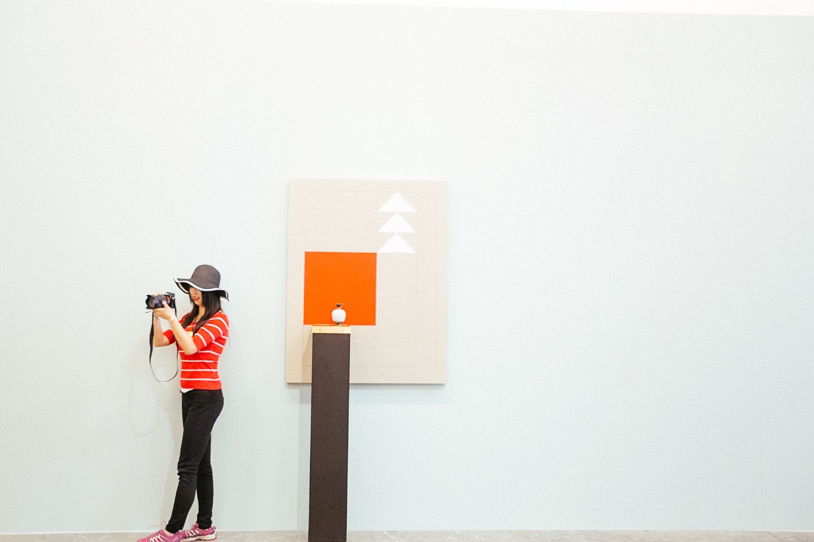

## 第一天的下午，去 City Walk 逛街

吃完午饭休息休息，就可以逛一逛迪拜，看一看各种景色了。这里有太多的商场和高楼，光是mall，据说就有20多个。包括世界上最大的DUBAI Mall.不过，因为这个商场实在是太大，两三天都逛不完。刚到迪拜的这半天，不建议到这里来。那么，第一天的下午该怎么安排呢？

我给大家推荐一个非常非常非常值得去的一个商业区——city walk

这是迪拜给我的众多惊喜之一。这里的也是新修建的商业街区。这里有着太多的好玩儿的地方和小资的商店。适合各个年龄层的朋友来。

city walk是迪拜最大的两个地产商meraas和emaar共同合作开发的商业街区。到处都充斥着艺术和设计。

这里有很多名牌，也有很多唯一的商场。有中国的江南布衣，也有著名设计师开的非常贵的珠宝店。最厉害的就是个街区的owner之一meraas集团的老板开的一家巧克力买手店——Boutique le chocolat。这是迪拜旅游局专程带我们来的一家店。这也是世界上唯一的一家全世界收集最好的巧克力来销售的店。巧克力做的包包~巧克力做的裙子~我也非常荣幸的得到了店里送给我的一大块牛奶巧克力。包装上面还印着我的名字。这个巧克力又多好吃，我不知道，不过，我把它送给了前女友，她说非常好吃，还问怎么能买到。

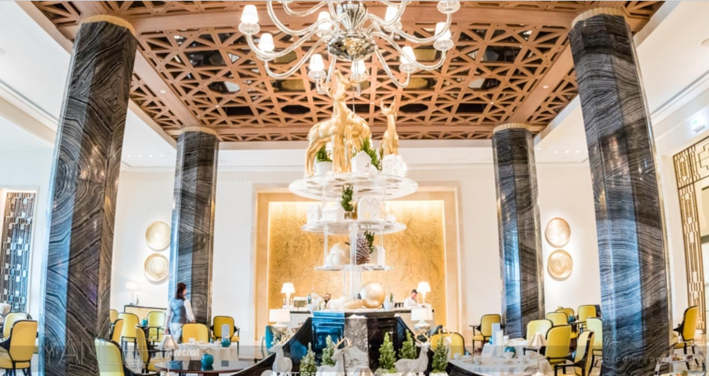

## 沙漠度假村的印度餐厅：阿拉伯与欧洲的融合

走进迪拜巴布铝沙姆斯沙漠度假村的印度餐厅，一定会让你觉得非常惊艳。这家印度餐厅分成露天和室内两个部分。

印度餐厅的主体外观和露天餐厅，乃至整个迪拜巴布铝沙姆斯沙漠度假村的外观，都像极了摩洛哥乌达雅城堡。四周有很长的廊厅，廊厅采用了法国文艺复兴时期哥特式建筑的尖拱，这在艺术上很好的保留了阿拉伯建筑上休息区功能，这是阿拉伯和欧洲两种艺术建筑风格很好的融合

露天餐厅表演区三位印度帅哥，演奏着类似《三傻大闹宝莱坞》那种节奏感很强的印度歌曲，高大的椰子树在勺子镜面、墙壁，玻璃里疏影横斜。

兴致高的时候，你可以礼貌的拦截穿行在你身边的印度waitor“sir！来一份唐杜里烤串”。唐杜里烧烤，是印度传统的烹饪方法，也叫泥炉炭火烹饪法。

这种烹饪方法使得肉串都比较香嫩，印度烤串的品种也很多诸如羊肉 鸡肉 鱼 大虾 鱿鱼 龙虾及少量的蔬菜，你可以自选。我还给闺蜜在空余时间拍了照片，摩洛哥风情浓郁。

如果来场去迪拜的自助游，你最想要获得哪方面的帮助？

## 老城区 Al Fahidi District：一个艺术街区

这里是迪拜的老城区「 Al Fahidi District 」，一个充满了艺术气息的街区。如果可以，我相信你会愿意逛上一天的。

《重庆森林》里，阿菲问编号663：——你想去哪儿啊？

警察，编号663回答说：——随便，你说去哪儿就去哪儿。

那个说 “ 想去哪就去哪 ” 的场景突然出现在了脑海中，即使是现在隔着屏幕，我依旧不敢直视那眼神。而这里，真的就是一个 “ 随便，哪儿，我都愿意跟你瞎去 ” 的地儿。

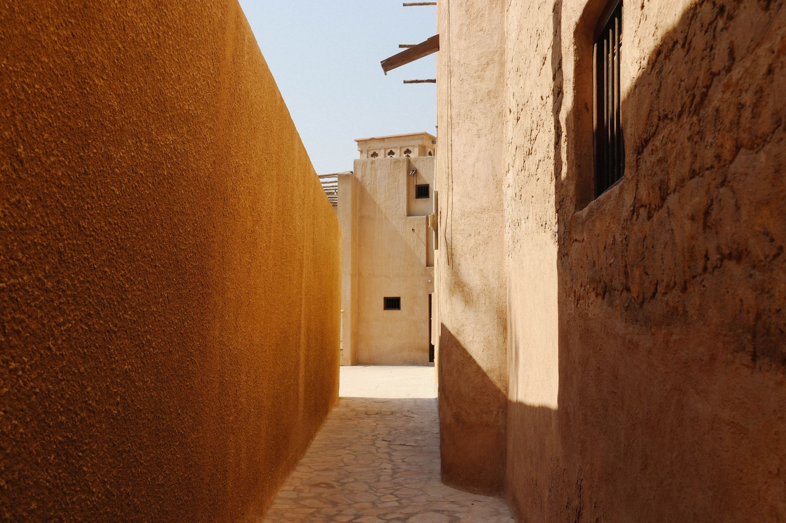

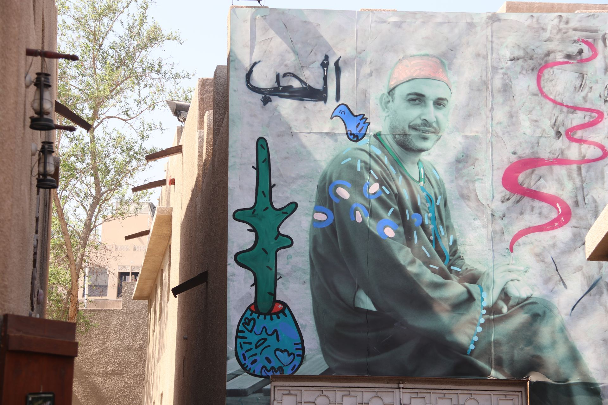

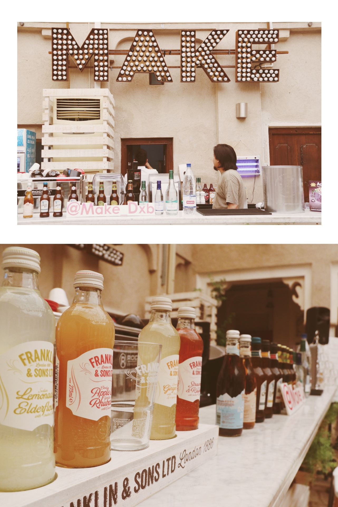

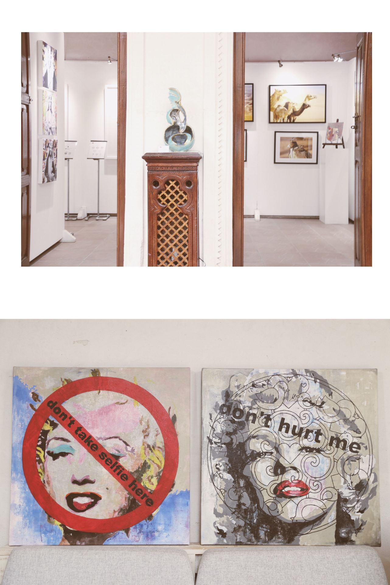

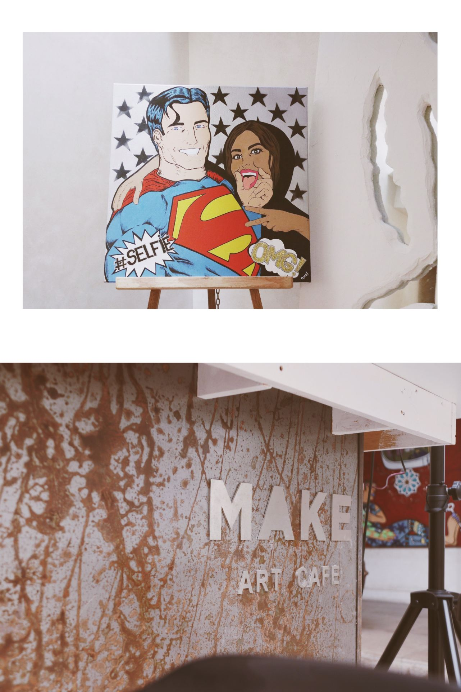

---

## 版权

本文为耿悦原创，版权所有。未经许可不得转载或商业使用。
