# 我坐上了天后王菲乘坐过的那家热气球

飞上 1500 米高空，看见沙漠金色日出。

---

第一次坐热气球实在迪拜。后来在写这篇文章时才知道王菲上次来也是在这家，带 李嫣 一起坐的。 这是当时王菲坐热气球的视频 （在知乎首发哦）

<!-- 视频：王菲在迪拜坐热气球 -->

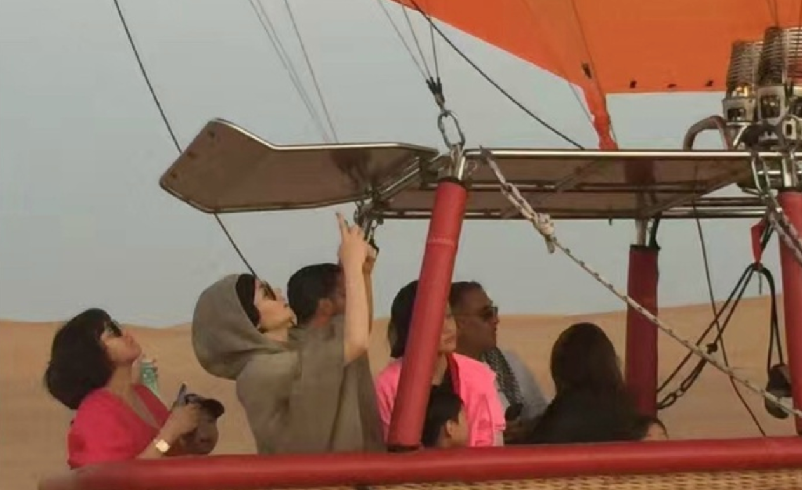

06:24 王菲在迪拜坐热气球 我坐上了天后王菲乘坐过的那家热气球。 飞上1500米高空，看见沙漠金色日出。 「我看过沙漠下暴雨，看过大海亲吻鲨鱼，看过黄昏追逐黎明， 我知道美丽会老去，生命之外还有生命，我知道风里有诗句。不知道你。」 气球向上升，风景往下退。美好的事情，正在慢慢发生。

<!-- 视频：王菲在迪拜坐热气球 -->

01:45 坐上热气球，你最想去_______？ 我在1500米云端遇见的浪漫

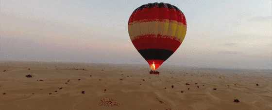

十七岁那年，清晨5点钟，我会莫名其妙醒来一次。推开窗，深呼吸，拿出纸本子，用铅笔轻轻地涂写：“我想离开这里，飞去很远很远的地方。” 转眼间，我像只飞鸟，背井离乡漂泊多年。又是清晨5点，在迪拜醒来，我拉开车门，往50公里开外的沙漠飞驰，去坐人生中第一次的热气球。

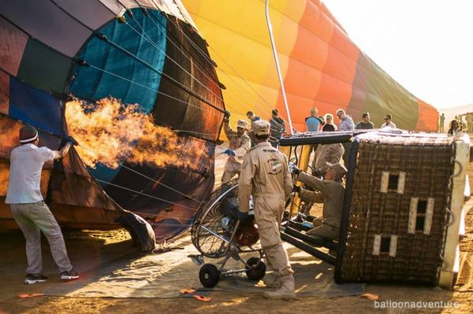

沙漠里的风，混着火苗和沙土味。我睁着朦胧的睡眼，和来自世界各地的旅人们，一起爬进能装下25人的篮子。听完Captain的安全培训，绳子嘣地一下子断开了，气球就这么摇摇晃晃离开了地面，那一刻心里有忐忑，但只好听天由命了

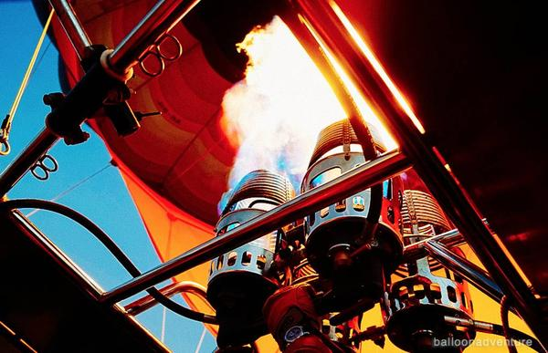

耳边，相机快门声咔咔响，燃烧器发出滋滋低鸣声。头顶，有火苗呼啦啦燃烧。好奇的脸庞在火光下半明半暗。

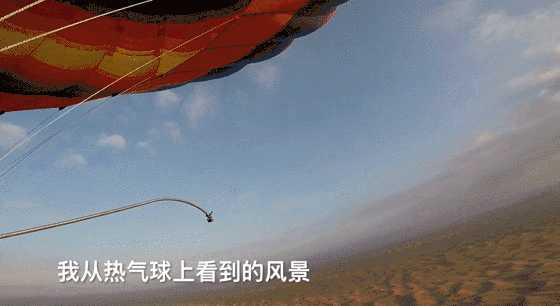

气球向上升，风景往下退。我逐渐意识到，美好的事情，正在慢慢发生。 我飘到了沙漠上空1500米云层之上。一抬头，就站在日出的面前。

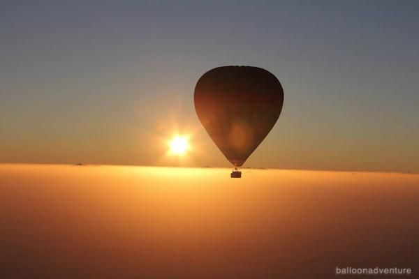

像是在梦中，我被一种光芒和美所击中，激动地屏住了呼吸，目不转睛地注视着惊艳的日出，心柔软地像初生的婴儿。

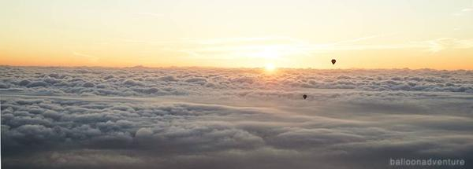

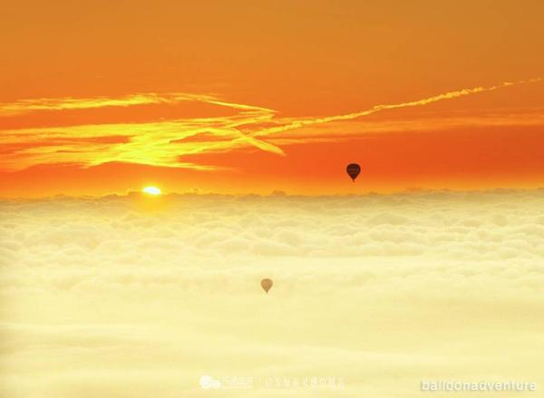

气球慢慢地转圈，有大把的时间，看云里雾里、看耶稣光，看沙漠、看沙漠里的一棵树。 沙丘在黎明中笼罩出一层淡淡的金色，有无比好看的波纹，还会有野生的大羚羊飞快地跑过。

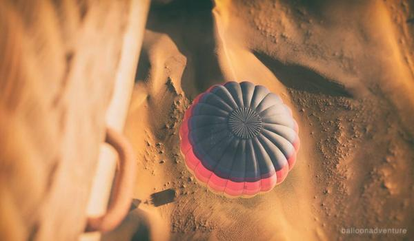

迪拜热气球有一个独家的项目，训鹰。我喜欢看鹰张开翅膀，一飞冲天的模样。

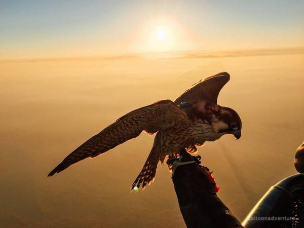

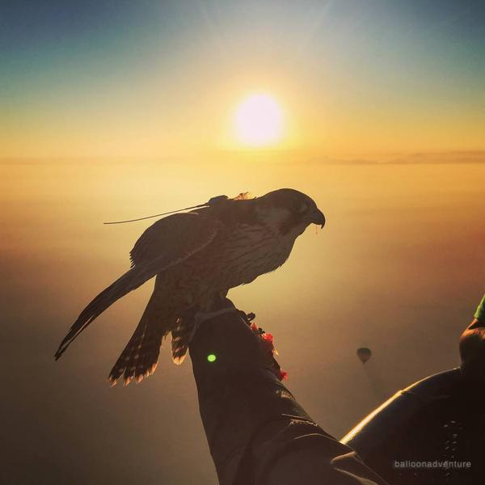

迪拜人爱鹰如命。这是一种孤傲美丽、桀骜不驯的鸟类， 一旦飞向天空，就要承担它一去不回的风险。因此训鹰师要付出无数心血，才能培养他们之间的连接。

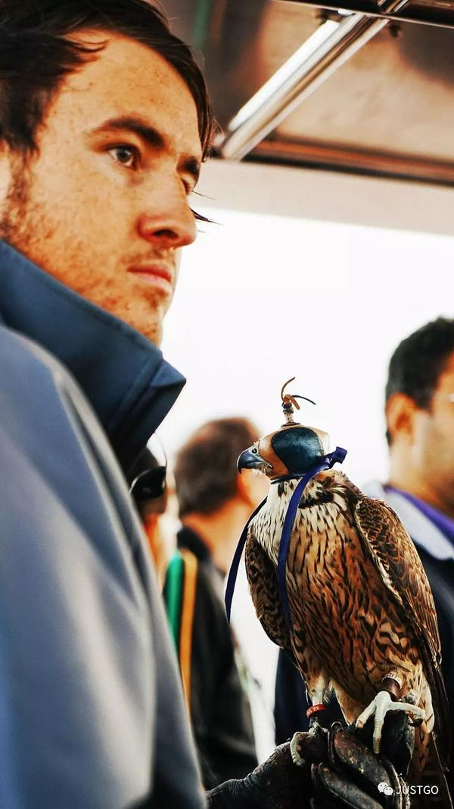

当小鹰被放飞，在金色的晨光、白色的云层间肆意飞翔，有一种美的震撼，我心里甚至希望它飞走

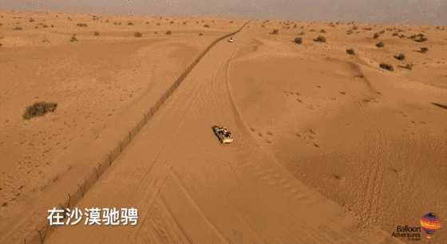

热气球落地后，我们坐着1948年的复古路虎车，在沙漠里驰骋，短短的一段路途，也有迷人风光。我和好友聊得特别开心，她为我拍下了在沙漠里最开心的笑。 在一座像沙漠里的城堡前下车，这里叫AlMahaRes ort，一进门就有人用阿拉伯神灯形状的咖啡壶，给每个人倒水洗手

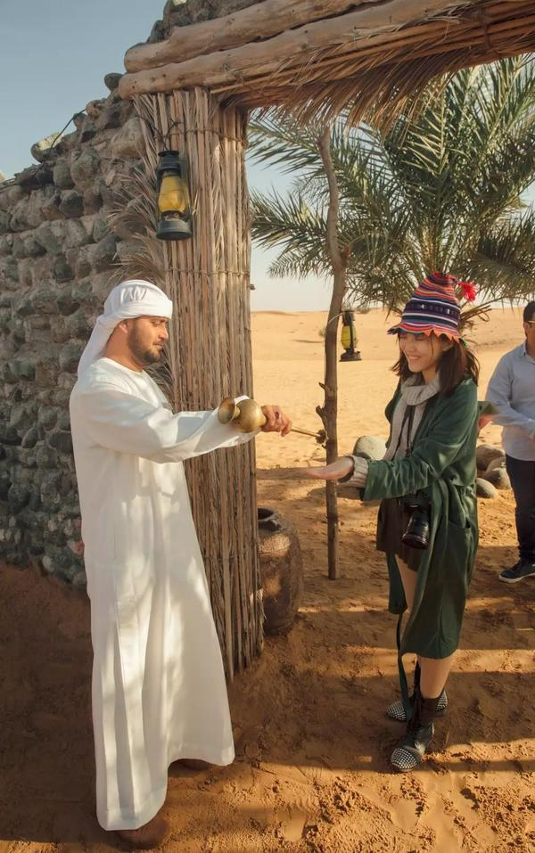

我们还采访了热气球的Capt ian们，他们跟我骄傲地说去过中国的很多地方旅行，也满世界跑。上一站热气球基地，竟然是在我四月刚刚去过的肯尼亚马赛马拉大草原。

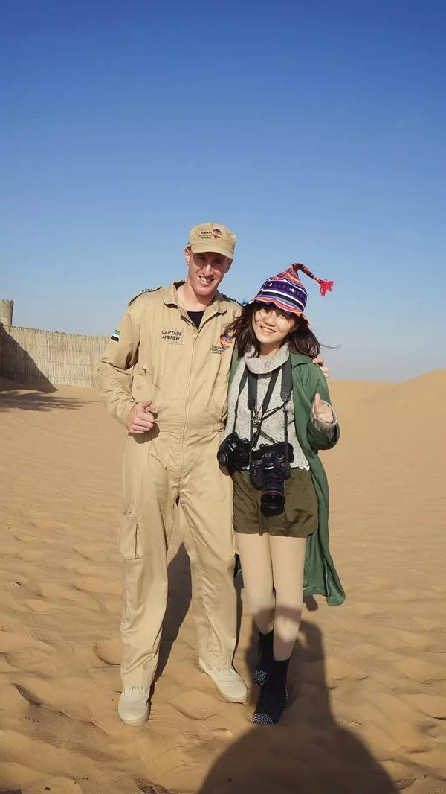

那天我们吃了一顿豪华的沙漠早餐。

当热气球在空中飞升时，我想起看过的一部电影《飞屋环游记》（UP）。“U p”这个词，有一种人生向上的力量。 看U p时，我还很青涩，无知无畏，跟少时的艾莉一样，有一个四处旅行去看世界的梦。之后犹犹豫豫蹉跎磨蹭多年，撞破了南墙，才终于拾掇行囊，离开了熟悉之地，攀高山，穿森林，在悬崖峡谷边屏息，在太平洋边忘却心事，在云端拥有美好相遇。

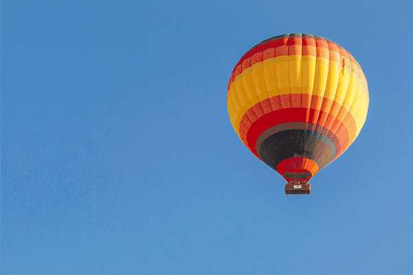

我们心中都有一个会飞的彩色气球。 它在U p，也在躲藏。它像你心底里一直藏着的那个渴望，像那个十七岁的懵懂少年，幻想着自己飞过了窗户，飞过楼顶，飞去了远方。 有人曾跟我说过，“悦带着我的梦去冒险。”我差不多算抵达了。但 也请未来的你，勇敢地去飞，飞得更高，飞得更远，飞得更漂亮。永远也不会忘记，那些你从小的渴望，你想去的地方。

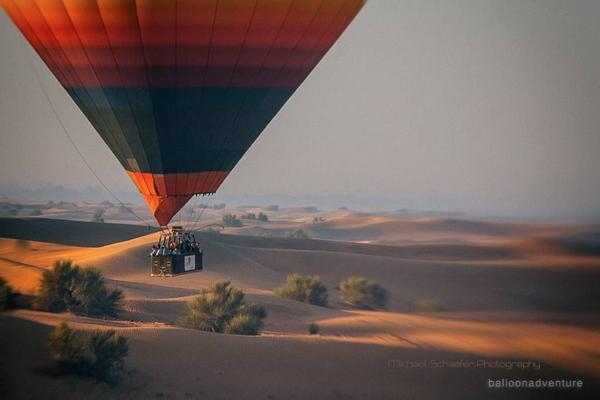

Thankyouforthe adven turewithme.Startyournew adven turenow.
---

## 版权

本文为耿悦原创，版权所有。未经许可不得转载或商业使用。
