# 你旅途中曾记录过哪些「让人印象深刻」的巨型建筑？

*耿悦 · Travel Stories · 2022-12-17*

---

本篇分两部分，一为在迪拜旅行时记录的巨型建筑，

二为读书拓展的新思考：为什么一座城市要建造巨型建筑？

背后的逻辑，和敏锐的人性观察。

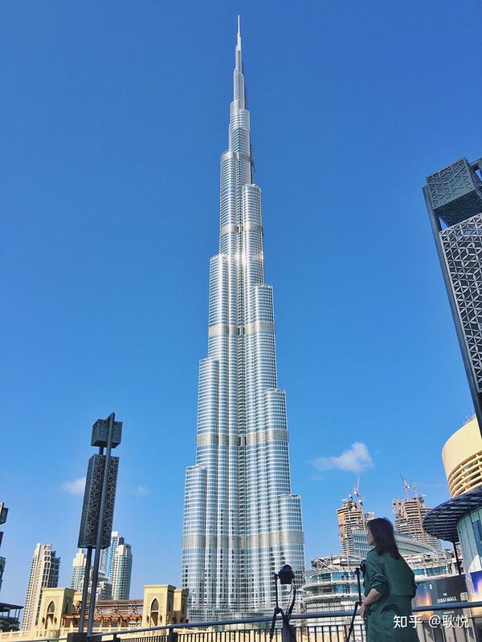

## 一、巨型建筑

这是我和旅行同伴们2016年在迪拜旅行时的建筑笔记：

## 1、迪拜哈利法塔 Burj Khalifa Tower

哈利法塔，世界最高建筑，

建于2010年，楼高828米，共有160多个楼层，巧妙的螺旋“Y”字型设计帮助减少楼身承受的风压，同时带来美感。

这是以设计世界知名摩天大楼而著称的建筑师阿得里安·史密斯（Adrian Smith）的标志性杰作。

位于124层的“At the top”（意为在高处）公共观景台配备有观景望远镜，供访客实时观赏楼下风光。

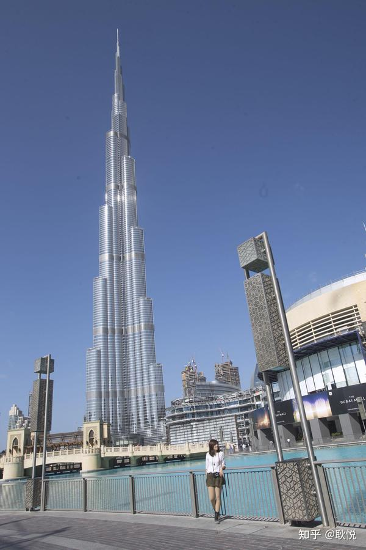

除了足够高，哈利法塔还兼具尊贵、舒适等功能，在哈利法塔内设有世界首家由知名时尚设计师乔治·阿玛尼全方位设计打造的酒店：

阿玛尼酒店。

酒店餐厅拥有各式顶级纯正美食，从意大利美食到日本料理，一应俱全。

哈利法塔持有的其他世界记录还包括：

世界最高的人造结构，最高使用楼层，最高室外观景台，行程最长电梯及最高服务电梯等。

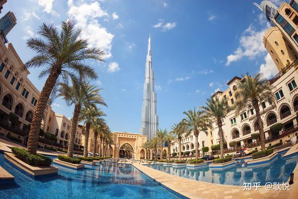

我的感受：初见哈利法塔，我找了很多角度，很难把它拍的很全。

还记得《碟中谍4》中汤姆克鲁斯（Tom Cruise）饰演的伊桑亨特（Ethan Hunt）徒手攀爬哈利法塔，哈利法塔的墙面玻璃上反射出都是迪拜各个不同角度的景色，比如沙漠，公路……

据说，在世界第一高楼哈利法塔80层以上的人，他们每天能够看到太阳的时间都比别人长，这意味着他们守斋的时间也要比别人长。

而我最享受的的是，就像飞机一样，住在哈利法塔顶端，就像生活在云端，很多时候透过窗外，看到都是云彩，回想起来也是醉醉的。

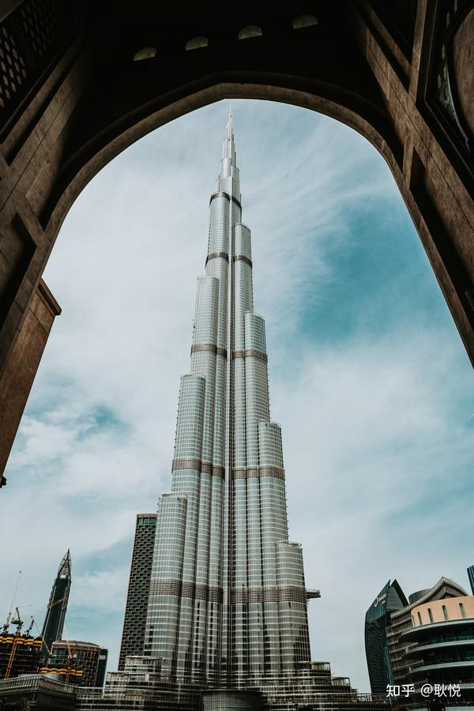

听设计师说说背后的设计故事：

> “我的设计在图纸上就颇具几何之美——平面三个分支延伸，立面三叶拼合。
> Y字形楼面设计将塔上观看的视野范围最大化，人们在此可享受到最美的阿拉伯海湾地区城市景观。
> 我设计迪拜哈利法塔不是为了自我满足，也不是要给自己加码。
> 我最本质的目的是希望以此提升一个国家和一种文化的精神面貌，让拥有它的人们感到快乐和振奋。
> 我想哈利法塔做到了这一点。
> 它给参观者们带来的震撼感受，成为人们定义迪拜天际线景观的新元素。
> 从很多方面来说，我觉得它能都是一件不朽的作品，只是目前还没有太多的人认识到这一点。”
> ——阿德里安 · 史密斯（Adrian Smith）
> －迪拜哈利法塔设计者

## 2、迪拜帆船酒店 BurjAlArab

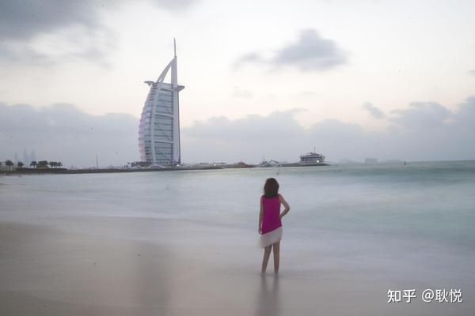

迪拜帆船酒店，一共有56层，321米高，由英国设计师W.S.Atkins设计。

客房面积从170 平方米到780平方米不等，最低房价也要900美元，最高的总统套房则要18000美元。

总统套房在第25层，家具是镀金的，设有一个电影院，两间卧室，两间起居室，一个餐厅，出入有专用电梯。

已故顶级时装设计师范思哲曾对它赞不绝口。

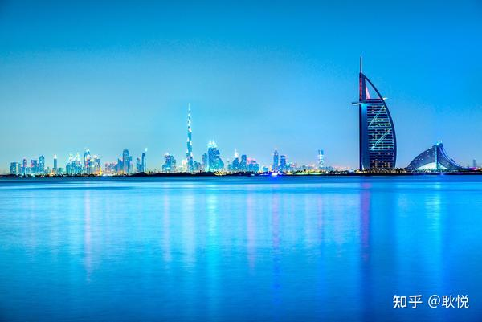

我的感受：从远处看过去，帆船酒店更像是一艘行进中的酒店，外形非常独特，它遥立在水波中也足够惊艳。

据说，当年酒店的豪华程度令人叹为观止，评论家们都不知道该给它定为几星：是五星，六星，还是七星？

走进酒店，你才知道什么叫做“金碧辉煌”，它的中庭是金灿灿的，

它的最豪华的780平方米的总统套房也是金灿灿的。

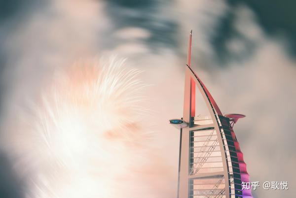

听设计师说说背后的设计故事：

> “能成为地标的建筑都是独具特色的，”
> “在为迪拜帆船酒店做设计定案时，我们把建筑的外观造型画出来，画得越快证明设计越独特。” 五秒钟就能记住它的外形。
> “这样的建筑可不多，” 赖特补充道，“你一画出迪拜帆船酒店的形象，人们就知道那是什么。”

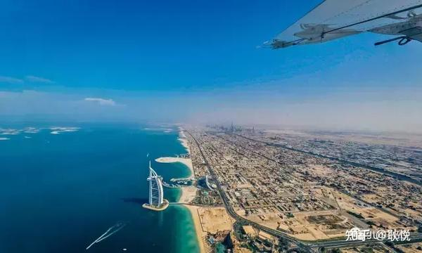

> 我们拿到的方案概要表明期望修建一座能让迪拜名扬国际的建筑，
> 所以我们认识到，只有设计一个令人印象深刻且前无古人的造型才能达到目的。

酒店竣工将近四年之后，这栋建筑才开始为世界媒体广泛报道，迪拜也开始成为人们热议的话题。

迪拜帆船酒店逐渐成为迪拜的形象代表。

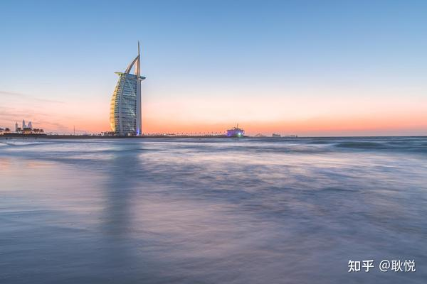

> 当年迪拜的建筑都是清一色的水泥砖块再刷点颜色，楼层也都不高，结果突然同时冒出了迪拜帆船酒店和阿联酋大厦两座庞然大物。
> 它们改变了一切，一夜之间便吸引来无数的商机和资源，极大地推动了迪拜的城市建设。
> ——汤姆 · 赖特 （Tom Wright）
> 迪拜帆船酒店Burj Al Arab设计者

## 3、迪拜棕榈岛 The Palm Islands

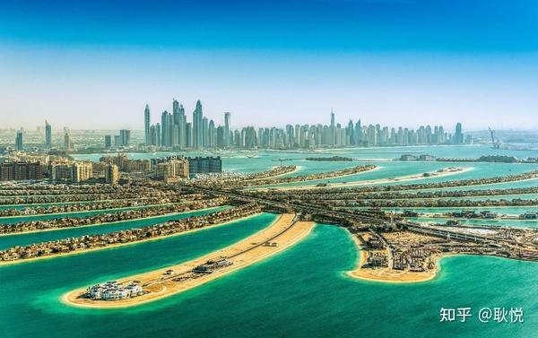

当我们坐着水上飞机，从空中俯瞰“迪拜棕榈岛”，它由3处大棕榈树状群岛“朱美拉” 、“杰拜阿里”、“戴拉”和一处世界地图形状的人造群岛组成。

当时体验时拍的Vlog：

甚至坐着直升飞机从高空专门俯瞰这些奇迹建筑。

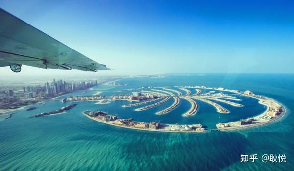

迪拜面积仅两个伦敦大小，海岸线只有72公里，沿海一带居民住房困难，棕榈岛工程完成后使阿联酋的海岸线增加近120公里，增幅为166%。

耗资140亿美元打造而成的迪拜棕榈岛被誉为“世界第八大奇迹”。

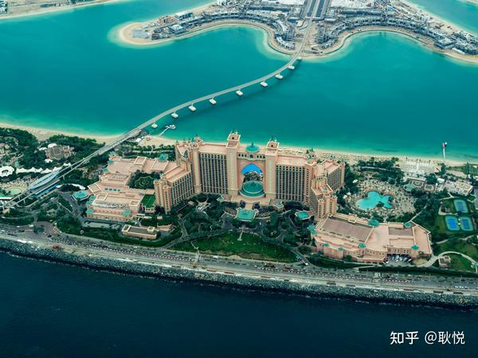

我的感受：

从水上飞机上俯瞰棕榈岛，它就是像一个飘在海里的安静的棕榈叶子。

我从没有想过世界上有哪个建筑以这种形式存在海中，棕榈叶的接近性就连叶子之间的缝隙都清晰可见，这种植物本身在海岸地区非常常见。

而从高处看“朱美拉” 、“杰拜阿里”两个岛屿单独看起来又好像是两棵巨大的棕榈树，两座岛相隔25公里。

通过一座300米长的桥梁与陆地相连.每座岛由一个“树干”、17根“枝条”和一圈防波堤组成。

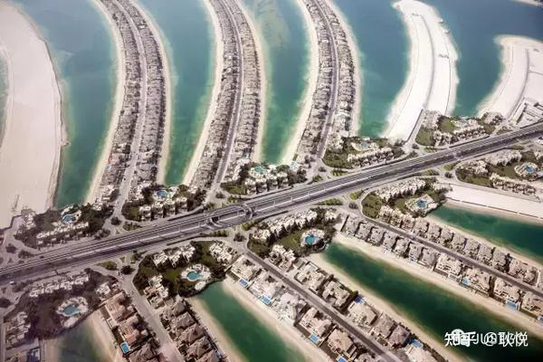

除了外形像棕榈叶，岛上还种植了12000多棵棕榈树，全岛一片绿色，郁郁葱葱，空气清新，加之沐浴在温暖的阳光、碧蓝的海边，一个完美的海边生活浮现于眼前。

我们还可以坐着高架轻轨列车，穿过棕榈岛主体树干，棕榈岛如诗如画的风景尽收眼底。

海岸线上汇聚全球风格的建筑如英法西班牙意大利，你可以在这里遇见全球最全的建筑风格。

## 二、为何建造

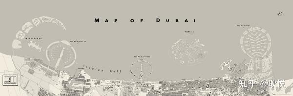

曾两次去迪拜恰好体验过巨型建筑，当时做为旅行创作者，见识了极致的奢华。

感谢当时很壕气的邀请方，我和同伴们当时也创作了够专业的文章来描绘了不凡旅行。

而我最近读到一本书，开始新的思考，为什么一个城市要建造巨型的建筑，背后的逻辑是什么。

这可能比较适合知乎，就是为什么？提问。

这本书叫做《我们为何建造》，是英国的建筑评论家罗恩·穆尔长期对建筑和人性进行敏锐观察之后的成果。

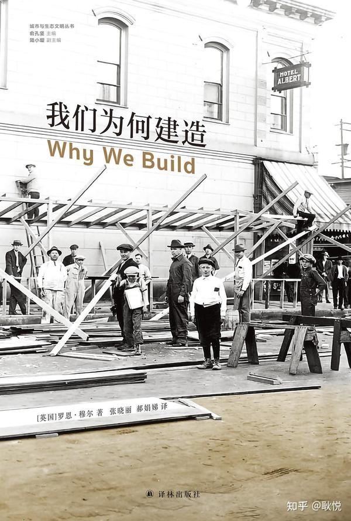

迪拜一直在以极快的速度建造惊世骇俗的建筑，极奢华，极高，极巨大，

使用一些标新立异的、前所未有的设计和技术。

七星级帆船酒店，是迪拜最知名的地标建筑。

它最初的创意来自迪拜王储哈姆丹，他当时的梦想，就是给迪拜建一个像悉尼歌剧院、埃菲尔铁塔一样的地标。

后来，全世界上百名设计师的奇思妙想，与迪拜人巨大的钱口袋融合。用两年半的时间在阿拉伯海填出了人造岛，把250根基建桩柱打在40米深海下，又用了两年半时间建设大楼本身。

1999年，这个帆船型的酒店落成，实现了王储的心愿。

两年后，迪拜又开始建设“朱美拉棕榈岛”。

这是当时世界上最大的陆地改造项目之一。这个人造岛屿的标签是：你可以从太空看到它的美丽造型。

“它是货真价实的原创，是简洁无比的概念、庞大宏伟的工程、大胆的房产投机和强烈的视觉冲击的结合。”

接着就到了下一个建筑的目标，「世界第一高楼」的建造。

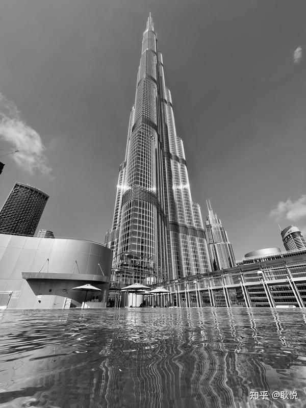

罗恩·穆尔[1]认为，这些建筑都是迪拜的形象工程，是迪拜神话的要素。

“七星级酒店，棕榈岛，大棕榈岛，更大的棕榈岛，世界地图般的群岛，沙漠中的滑雪场，亚特兰蒂斯酒店，世界第一高楼，更高的楼，更高的、不知有多高的楼，

用一个宣传片中的话来说，这些东西瞬间让“迪拜为世界所知”。”

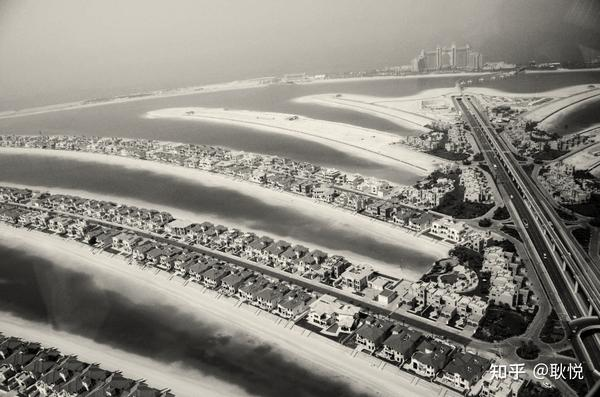

“迪拜出现了那些建筑神话，它们总是很及时，广为流传，人人皆知。”

有趣的是，地球上有数十亿人听说了这些奇迹，大部分人都不清楚哪些已经建成了，哪些还在建。

不停地建造这些建筑，制造出了一种迪拜永远在奔向未来的感觉，

而这也许是一座快速增长的城市，所必需的条件。它必须想象未来的样子，这是它售卖自己的标签。

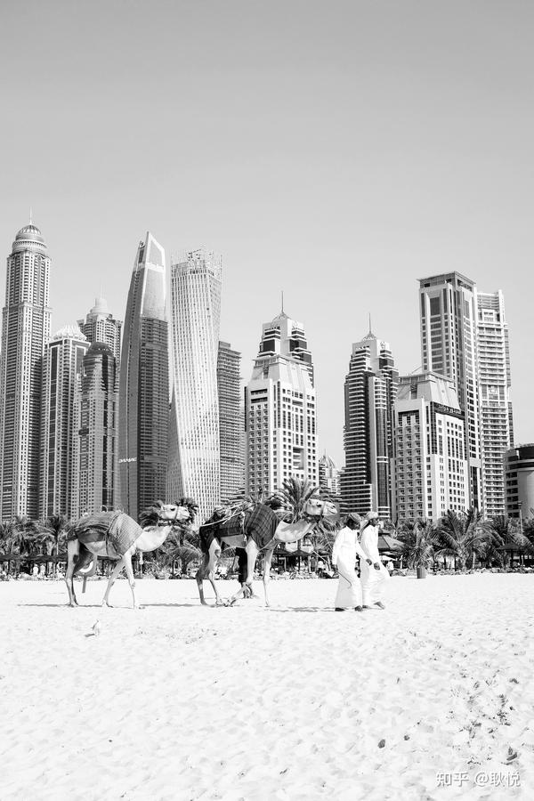

书中分析了迪拜的资源：

迪拜需要这样的标签。

在海湾地区，迪拜处于一个特殊的位置。

它拥有的石油资源不如周边的国家多，所以必须将经济建立在其他行业上，包括金融服务和旅游业。

它要成为阿拉伯的新加坡，也就是要成为一个贸易型城市，需要两个要素的支撑：有利的地理位置和足够的智慧。

对于迪拜而言，它的资产就是相对稳定的形势和安静的环境，在伊斯兰和西方世界之间平衡自己的能力，以及迎合商业需求的意愿。

迪拜有一些有利的软性条件。它的冬季阳光温和宜人，对欧洲国家的旅游者来说也很方便，因为时差很小。

城市相对安全，没有危险的传染病。除此之外，还有高质量的免税购物环境，这些都能够帮助它成为受欢迎的度假目的地。

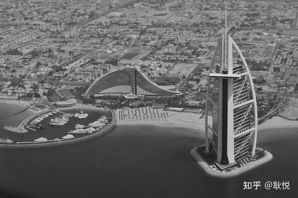

迪拜需要把无形资产转化为有形资产。

它需要创造一个品牌、一种形象，让大家相信，它是卓越的。

这个形象和品牌就是那些不断被建设出来的奇迹建筑。

在迪拜，建筑形式起着像媒体报道和广告词一样的功能。

迪拜非常知道如何制造和营销它的这些标签。

帆船酒店开业的时候，网球运动员阿加西和费德勒在酒店顶层的停机坪上打了一场网球，成了全世界津津乐道的事情。

棕榈岛在开建之前就已经名满天下，那个时候已经有了计算机模拟图像，罗恩·穆尔说，相比实际使用的感觉，棕榈岛的建设显然更注意视觉上的冲击力。

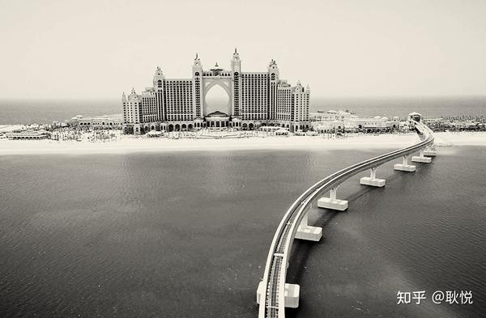

“迪拜神话的一个重要方面就是它的惊世骇俗，以及克服障碍的力量。

它寻找良机展示了这一力量：填海造陆，引水为渠，打造沙漠雪场；以及对历史、规范、礼节和品位的颠覆。”

从迪拜的例子里我们可以看出，建筑并不只是实用目的优先的，它包含有一种无形的东西。

就像古罗马浴场，奢华程度远远超出了洗浴的需要；

在有的建筑中，你还会看到空旷巨大的大厅、设计夸张的大门，也并不都简洁高效。

建筑是为人类的情感和欲望所塑造的，

迪拜的建筑中蕴含着酋长对权力、对荣耀、对杰出成就的野心，

它们的形象激发着人们的敬畏、震惊和幻想，也吸引着那些对金钱、对辉煌有强烈渴望的人。

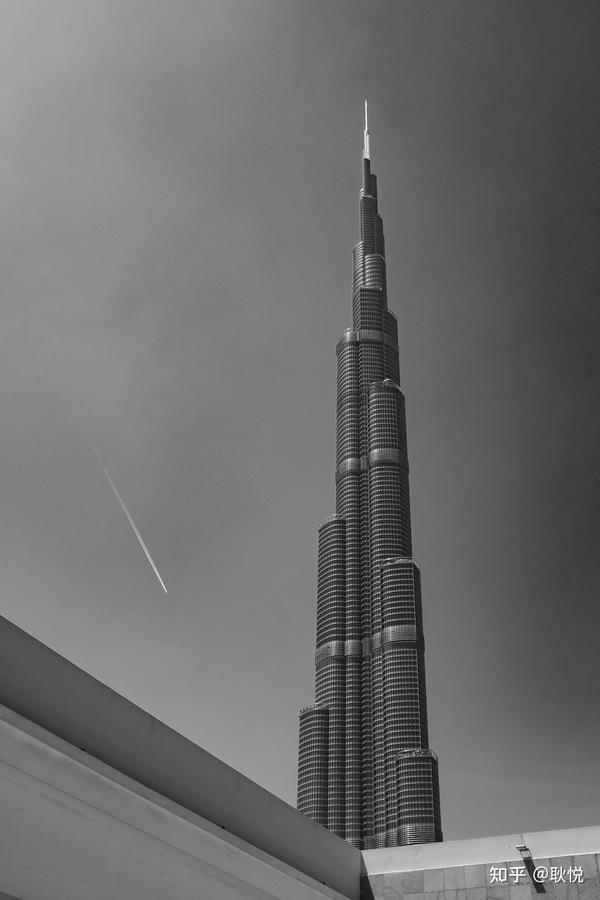

“在描述迪拜时，人们会认同这样一个观点：

建筑中隐含的欲望等同于建筑物漫无边际的外形——

它们可能会大得离谱，或者十分怪异，并且被神话成“标志性的”。

在某种程度上，情况的确如此。

想想这整座城市越来越不规则的形状，人们会感到活力四射。

不管是作为居民还是作为游客，你都可以分享这份兴奋，或者感到自豪。”

这大概是第一章里的内容，感兴趣的话可以阅读这本书。

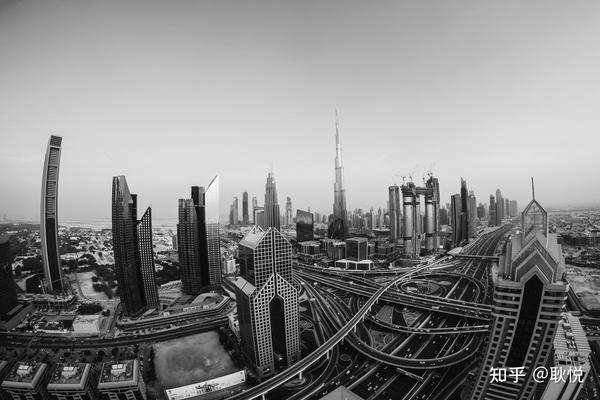

> “建筑不是一成不变的：
> 不是它们的结构发生改变（常有这种情况），就是它们会面对不同的解读和价值的颠倒。
> 这种不稳定性可能让人困扰，但它也正是建筑的迷人之处。”

## 参考

