# 你曾踏足的城市中，在哪些地方体验到了「建筑之美」？

*耿悦 · Travel Stories · 2023-03-13*

---

还是说说高迪的建筑吧，被疯狂的人类和极致的创造打动。

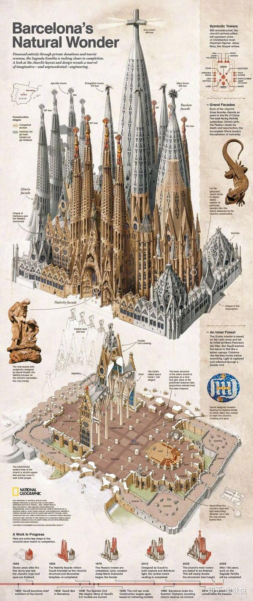

在巴塞罗那，有两个人不容错过，建筑巨匠高迪和航海家哥伦布。

对喜欢建筑的人，估计多数是奔着高迪而去。

### 安东尼奥·高迪

Antoni Gaudi I Cornet（1852—1926）

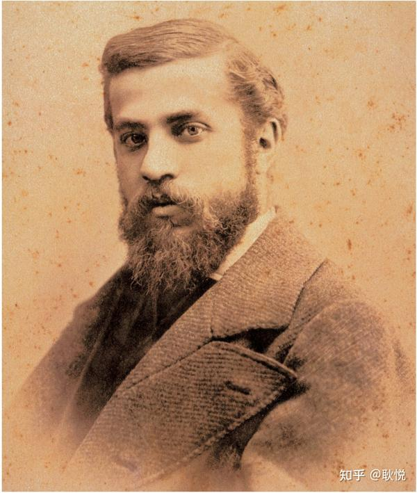

不仅是「建筑之美」，他的闪光太多了，吸引我的：

当你踏足这个城市，会感受到截然不同的加泰罗尼亚天空下的梦幻世界，

而这个世界，正是由爱做梦，和能把梦做成的高迪创造的[1]。

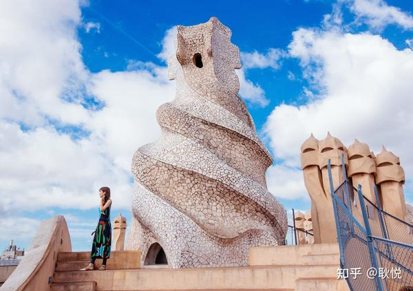

因为他的建筑，使巴塞成为一座遗留在人间的梦幻之城。

我去旅行时的故事：

但最近读历史才得知：

圣家族教堂修建的起因是1865年巴塞罗那的一场霍乱，

宗教协会决定修建一座新的赎罪教堂。

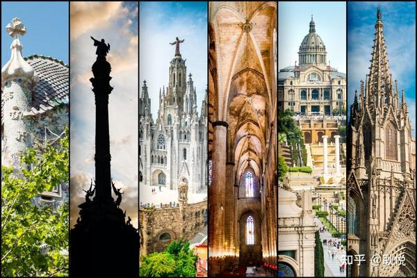

其实去巴塞之前，在欧洲各个国家，已经看过了无数个教堂，

觉得世间教堂不会出乎其右了。

但当我真的走进圣家族的那一刻，还是被震撼住了。

光线穿过屋顶和多处彩色玻璃窗，形成美丽的光影，洒进眼眸，

轻声感叹：“高迪真是一个天才。”

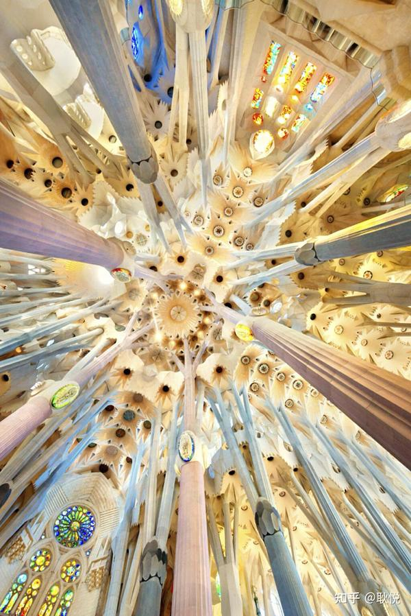

相机一直就没有放下。实在是太美了。

从阳光透过的彩色玻璃，到高耸的树形立柱，

再到奇思妙想的穹顶，每一个角落都不容错过。

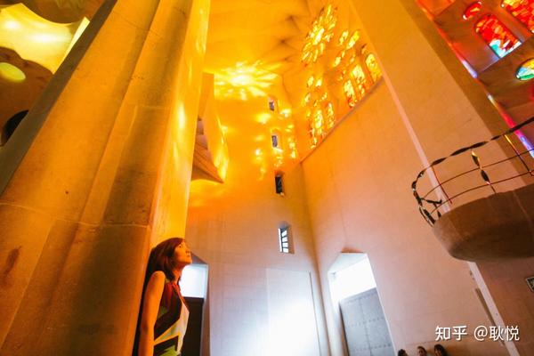

“如果你穿白色的衣服走进教堂，透过彩色玻璃印在你身上的光，就仿佛圣光一样。”

记得听作家蒋勋介绍哥特建筑的彩色玻璃时这样讲过。

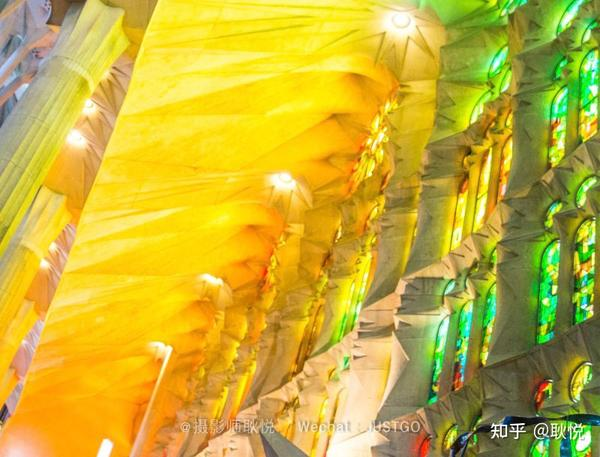

有人说高迪是天才，有人说他是疯子，因为“只有疯子，才会试图去描绘世界上不存在的东西。”

当年在他离开巴塞罗那建筑学院时，其校长伊莱斯·罗根特曾大声质疑：

“我不确定我们把学位授予了一个疯子还是天才。”

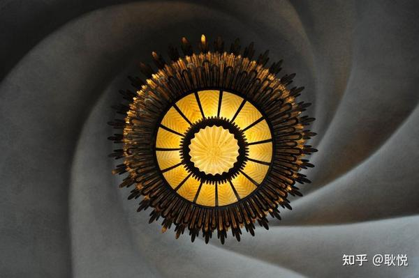

### 建筑应该像大自然

“直线属于人类，而曲线归于上帝。”

高迪一直坚信着，他的作品里也都是曲线。

“建筑应该更像大自然，而大自然是没有直线的。”

建筑虽然是人工的作品，但仍然有可能性将你带向自然。

总能在他的作品里感受到广阔而活灵活现的自然主义梦想。

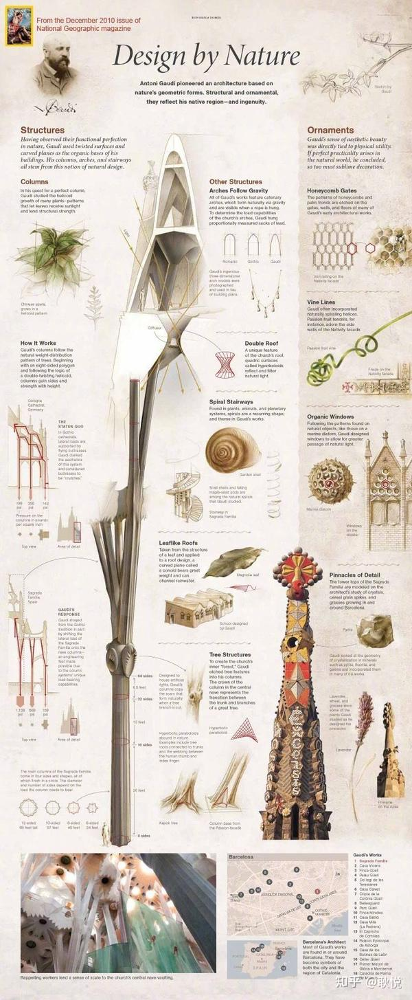

我读到一段他小时候的生平：

> 作为世代铜匠人的后代，高迪自小便患有风湿病，
> 因而大部分时间只得独处。 他生来便痴迷于几何与自然：
> 与走进课堂学习相比，他更喜欢凝望大海。
> 那时，由伟大生物学家与达尔文主义思想家恩斯特·海克尔绘制的精美草图首次出版，其内容包括微小的海洋微生物及原生生物。
> 这些作品对高迪产生了影响也理所当然。
> 圣家堂像是从土壤中生长出来一棵树。
> 圣家堂的钟楼看起来就类似一种钟形的海洋生物，像是花朵。

## 建筑匠人

还有一个令人很羡慕的地方，高迪可以对这些建筑，毕生热爱的事业、作品，

尽情发挥想象力，精雕细刻，追求极致，

做个「匠人」，不紧不慢，打磨细节。

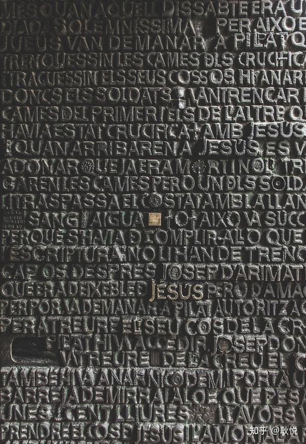

在30多年建造圣家堂的过程中，高迪希望将种种独属于他的元素都在其中融合，并以符合宗教题材的方式呈现。

而参与建筑的每位工匠，同样虔诚，对细节极致渴求，

百年一生，倾其所有。执着把一辈子的光阴倾注在这一件事情上。

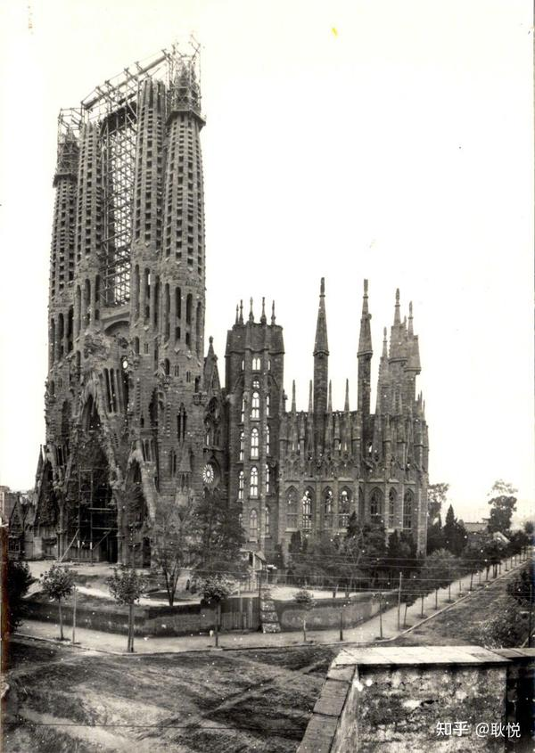

高迪的建筑似乎拥有一种神赐的魔力，可以违反地心引力原则。

他为教堂设计了18座尖塔和3个宏伟的正门。

三个正门分别象征着诞生，复活和荣耀。

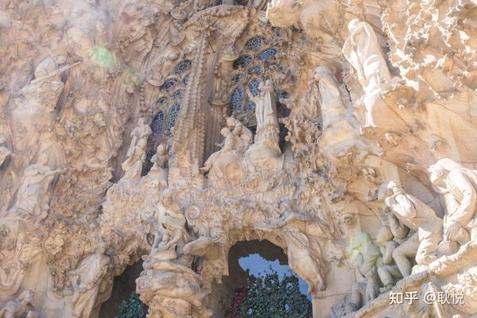

> 18座尖塔中，有5座代表圣母玛利亚和基督教的4个福音传教士，
> 12座代表12门徒，而中间最高的一座自然代表耶稣本人了。
> 整个教堂高170米，底座长90米，宽60米，
> 如此大规模的教堂，使得高迪花费了一生的时间，也只修好了诞生门和一个尖塔。[2]

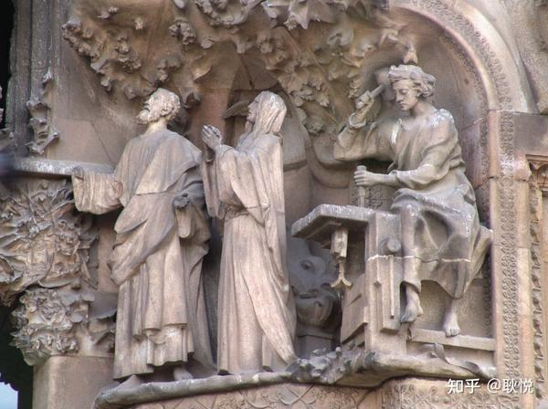

整座教堂一门一柱的神、人、鸟禽、野兽.......

连每个人物的具体神态都不一样，

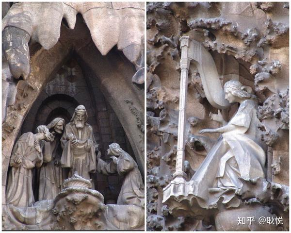

每处细节，被工匠们极为精细的雕刻。[3] 栩栩如生.....

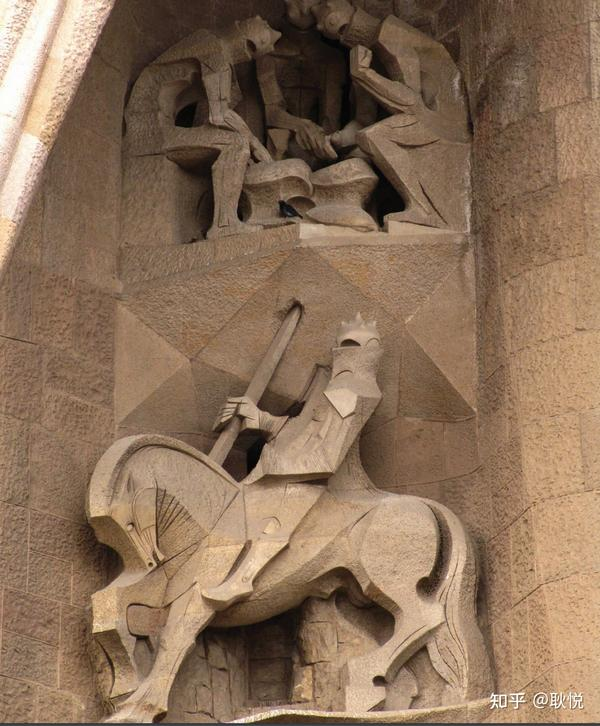

当有一天你亲自走进去的时候，会真心引发共鸣的，

是高迪对美的追求和欣赏，非常热切。

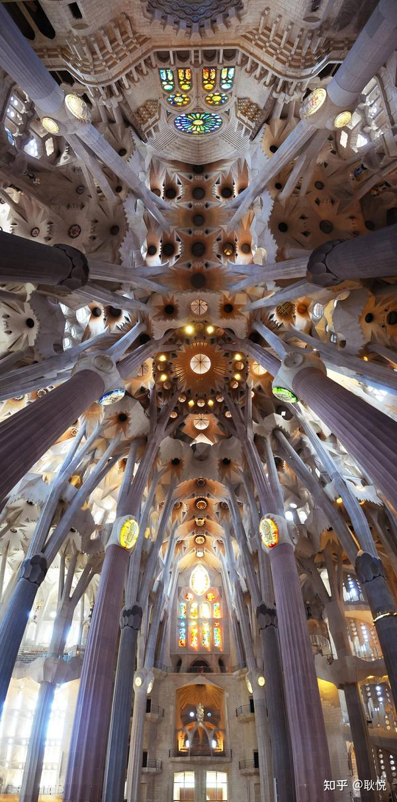

在他的彩色世界里，像沐浴在上帝之光的森林里，内心对光线开了窍。

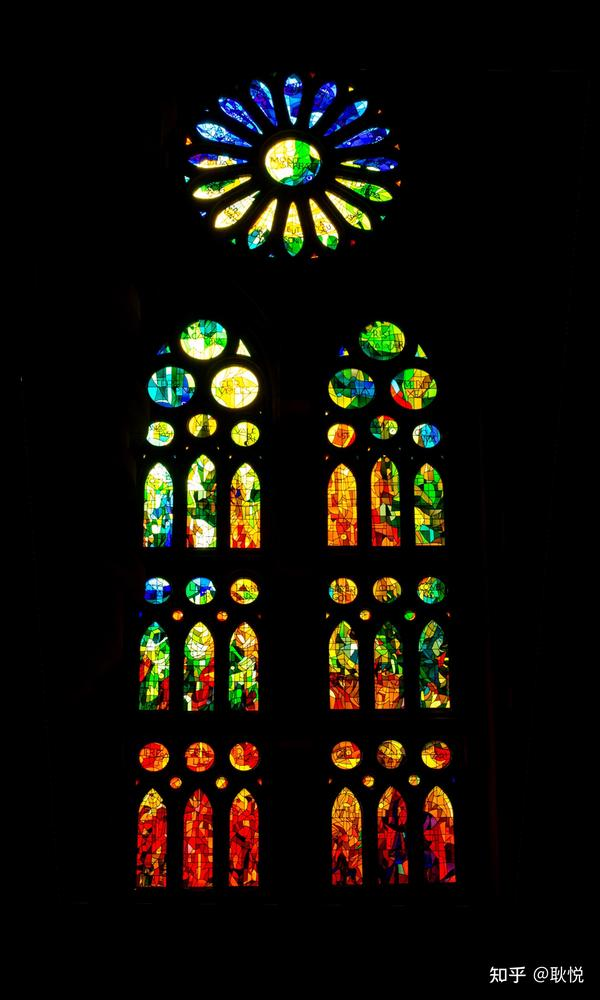

“他的建筑完全是另一个世界，

是一个充满想象力、梦幻般的乌托邦。”

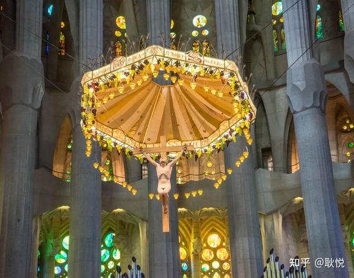

### 米拉公寓（Casa Milá，1906—1910）

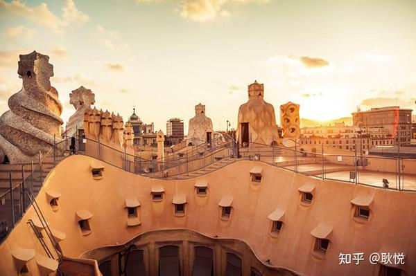

我爬到了米拉之家的屋顶，整座大楼宛如波涛汹涌的海面，

飘落树叶的阳台、布满武士雕塑的天台，爱上了高迪赋予建筑的浪漫。

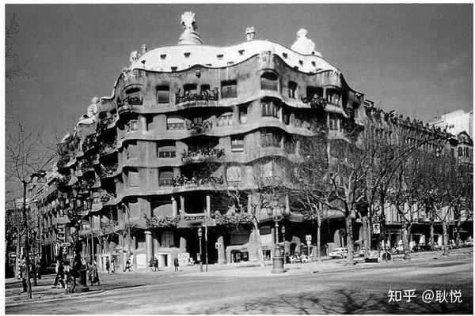

米拉公寓外表，像是地中海里的波浪，此起彼伏，

从外部看来，极具律动感，这种设计让建筑构架和墙面相互独立，

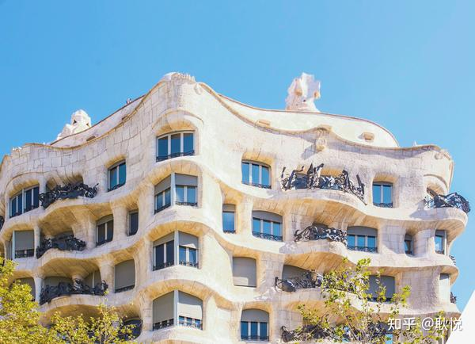

> 也就是说，它外部那些波涛汹涌的墙面本身不用承重，
> 可以随便飘，爱怎么嘚瑟就怎么嘚瑟，就好像一个超现实主义雕塑一样，完全不需要规则限制。[4]

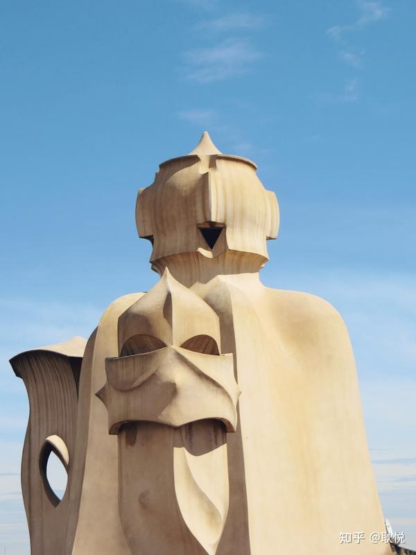

> 公寓屋顶上有六个大尖顶和若干小的突出物体，
> 其造型有的似神话中的怪兽，有的如螺旋体，有的如无名的花蕾，骷髅、天外来客……

登上屋顶，随你的想象去发挥去猜是什么奇幻宇宙。

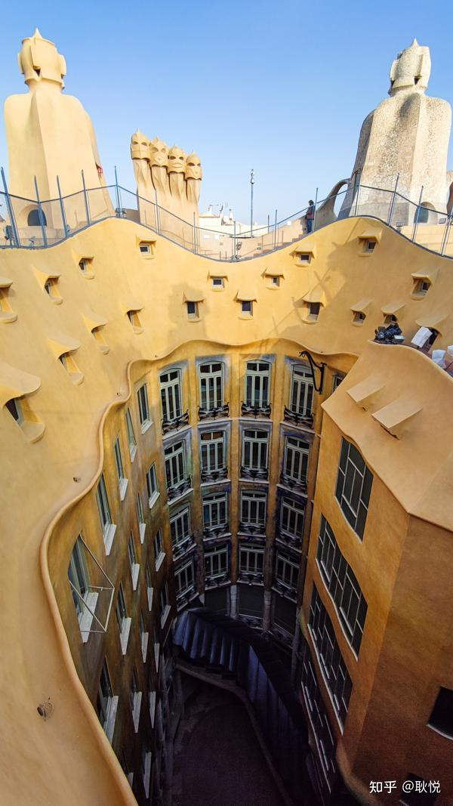

我在这个寓所，被打动的地方至今还记得：

这个楼层的布局狭窄，有些地方是看不见阳光的。

于是在顶部做了这样的设计，让阳光能够从顶端倾洒，让更多人看见光。

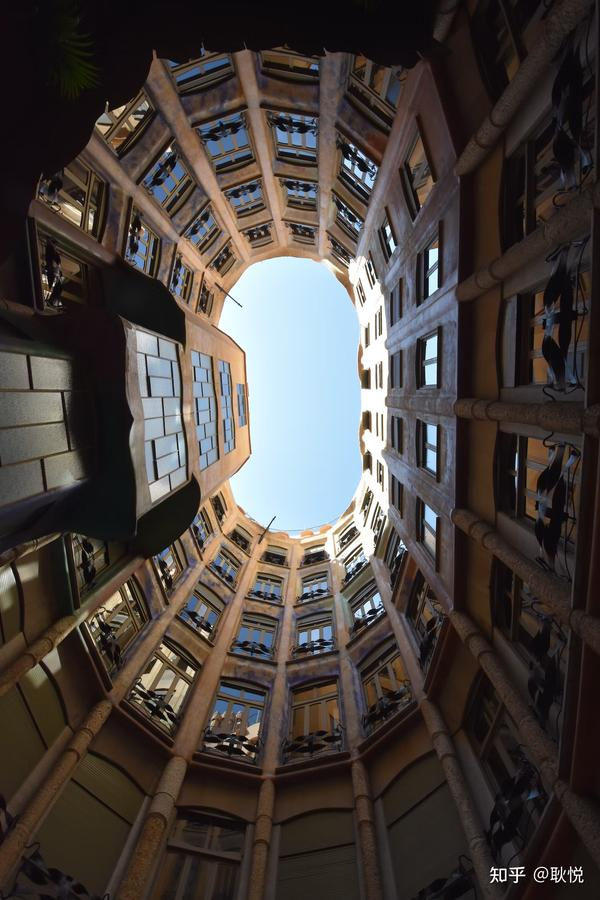

> 高迪的社会思想， 也带给了米拉之家一些与众不同的特质，其中最突出之处便是屋顶露台。
> 在高迪的设想中，邻居们在这里晾衣物，晒太阳，聚会社交；
> 孩子们也可以围着被化为童话人物的烟囱和通风口奔跑、嬉戏…… 这个建筑将见证的，是一片其乐融融的生活景象。[5]

除了外形奇特，其实他很注重建筑的实用和功能性，注重采光和通风。

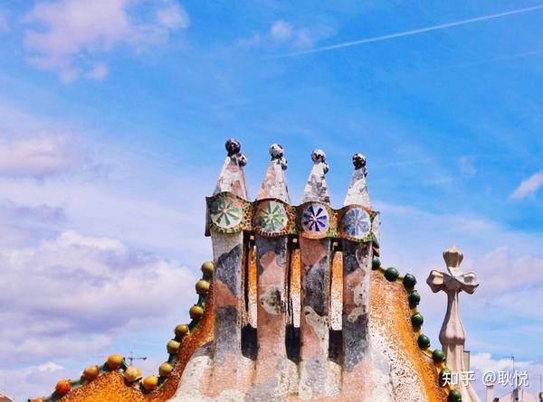

## 巴特罗公寓（Casa Batllo，1904—1906）

而我接着去探访他的下一个作品巴特罗之家，洋溢着满满的海洋元素，游至海水变蓝。

漩涡般的天顶，水波般的阳台， 潜水艇般的房间，海渊般贴满蓝色马赛克的中庭......

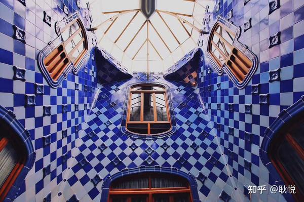

设计灵感来自神话故事，圣乔治屠龙救下了被龙绑架的公主，

据说圣乔治骑着马、手拿长矛攻击龙时，身上的血幻化成了玫瑰。

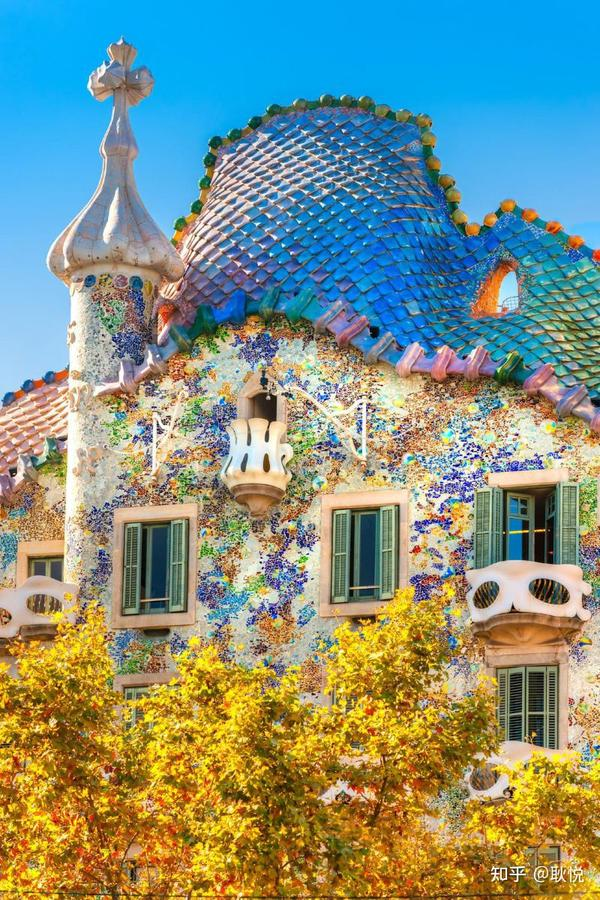

…[6]而建筑的内部宛如一个海洋世界。

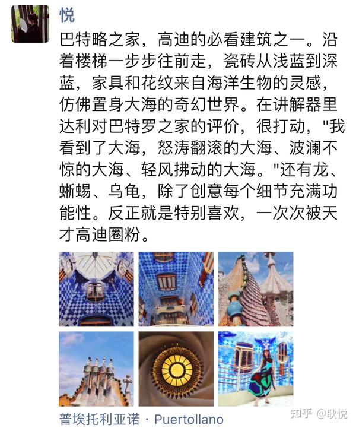

接着走进建筑的书店里，开始翻看高迪的书，和纪录片，开始慢慢了解他。

他是一名素食主义者，身心里充满对大自然的爱。

他认为这世界上最好的柱子是大树，最好的圆屋顶就是我们的头颅。

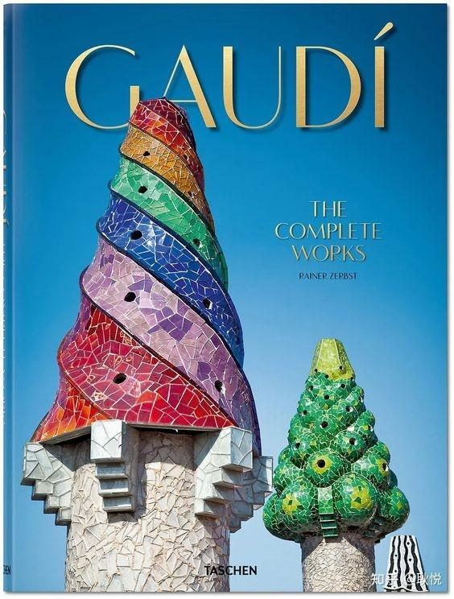

他用上帝的眼光去看城市。

那些不规则的弯弯曲曲的云层、贝壳、花瓣、水滴，都被他用进建筑创作的世界里。

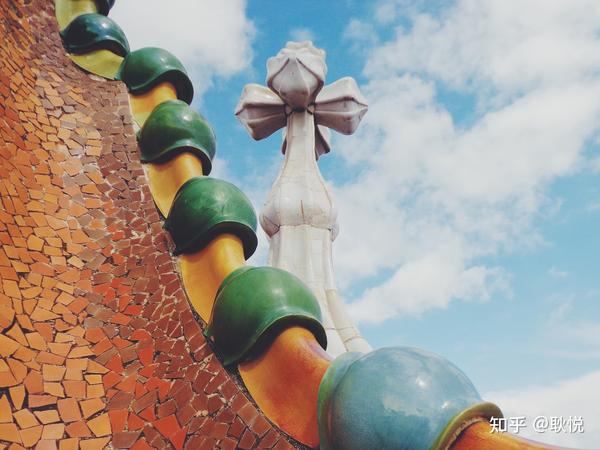

他赋予建筑意义。“龙”是巴特罗公寓离不开的设计元素，还有守护古埃尔公园的变色龙。

> 我们不懂龙的意义，就像我们不懂宇宙的意义一样，
> 但是龙这一形象中有一些与人类的想象相吻合的东西，
> 于是不同的地区和年代都出现了龙。
> 这样说来，龙是一种必要的怪物。
> 博尔赫斯

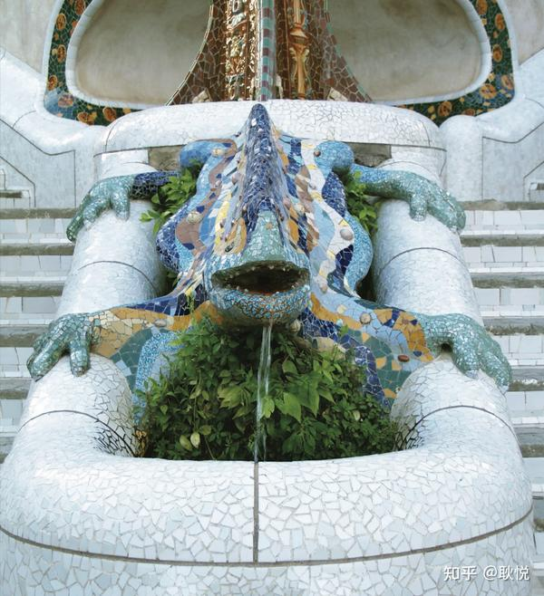

## 古埃尔公园（Parque Güell，1900—1914）

在伍迪·艾伦的电影《午夜巴塞罗那》中，迷人的女主角从古埃尔公园门口的台阶拾级而下的身影，一直定格在我的记忆中。

欧塞比·古埃尔（EusebiGüell）是高迪长期的赞助者，高度赏识的挚友，一样也是一位幻想家。

1900年他突发奇想，决定建造一座花园式城市。这是一个极为宏大的计划。

为此，他在郊区买了一座光秃秃的山头，打算就在这里建设“古埃尔公园”。

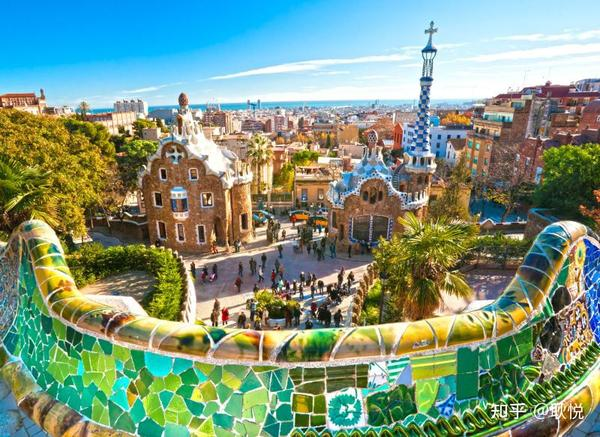

高迪满腔热情地支持古埃尔的这一计划。

最终把这里打造成一个童话世界，又像一件悬挂在空中的巨型艺术作品[7]。

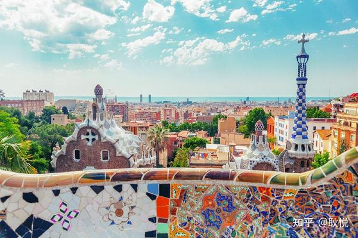

这里就是比较费鞋，一直都是上坡。当你爬到半山腰，可俯瞰整个巴塞罗那。

斜靠在座椅上，仰望天空、眺望远处蓝色大海，晒晒日光浴，惬意小憩。

当我漫步其中，感受到这里的魅力：时而疯狂，时而怪诞，不可思议的迷人。

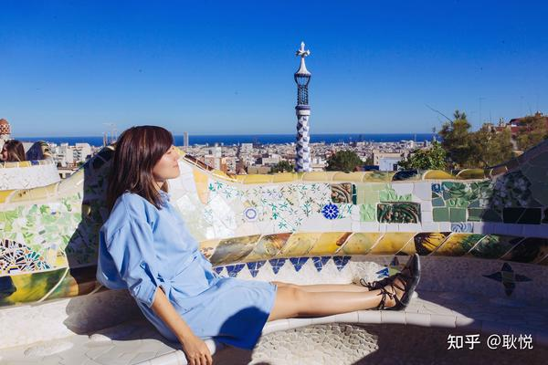

高迪酷爱使用西班牙瓷砖，在弯曲的蛇形座椅上、石柱、长廊上，都嵌满了各式的西班牙特有的马赛克图案。

这些图案全由瓷砖拼贴而成，色彩斑斓的碎片在阳光下闪耀光泽。

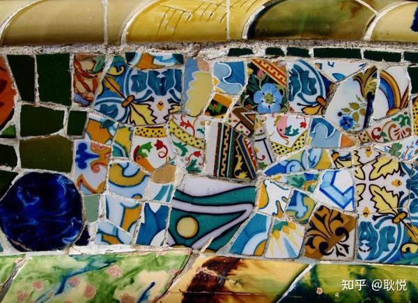

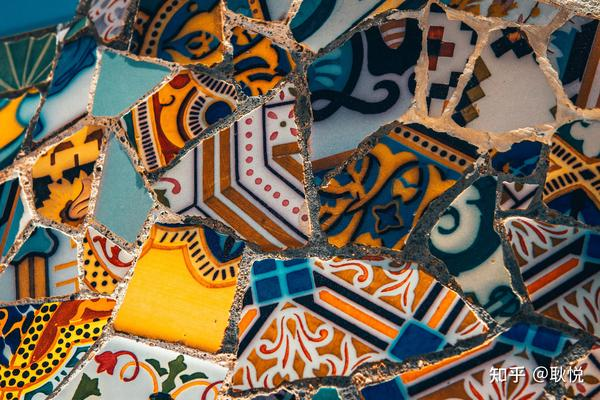

还看到一处很动人的：高迪尊重大自然，在意一切资源和回馈。

在这个公园里的公爵楼，预算很足的情况下，他依然寻找二手瓷砖，铁栅栏，石头，从广场屋顶上掉下来的碎瓷砖等等，来注意环保和回收。

他非常谦虚，尊重自然里的每一个元素，一花一草，一树一木，都是来自大自然的慷慨馈赠，都珍贵，值得珍惜它们的价值。[8]

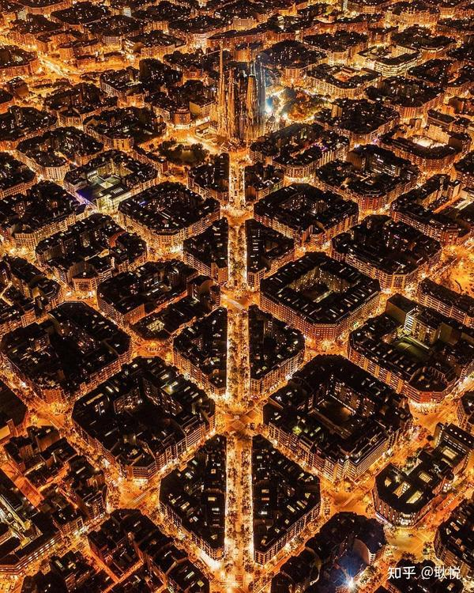

> 高迪生命的最后12个年头全部奉献给了圣家堂：他对此如痴如醉。
> 当资金耗尽之后，他挨家挨户地乞讨捐赠，以继续他毕生挚爱的创作。
> 1926年，当这位伟大的设计师穿过格兰维亚大道，想要“跟圣玛丽说几句话”的时候，一辆有轨电车将他撞倒。
> 他享年74岁。
> 在其破旧不堪的夹克中，唯一能找到的只有一些别针、几个榛子、一张纸以及一本福音书。
> 高迪年轻时，尚身处社会上层：然而如今，人们却误把他当作流浪汉而送进了一所乞丐医院。
> 三天后他去世了。
> 但在世界上任何最伟大而动人的建筑欣赏之旅中，
> 他留给世人的遗产[9]都使得巴塞罗那成为必经之站。[10]

### 伯利恒之星 Star of Bethlehem

> “在我有生之年，教堂可能无法完工，对此我并不觉得遗憾。
> 虽然我会老去，但是身后总会有其他人来接替我。
> 守护作品最初的灵魂固然重要，但是作品的灵魂也是和作品生存的那个年代密切相关的。”
> 高迪

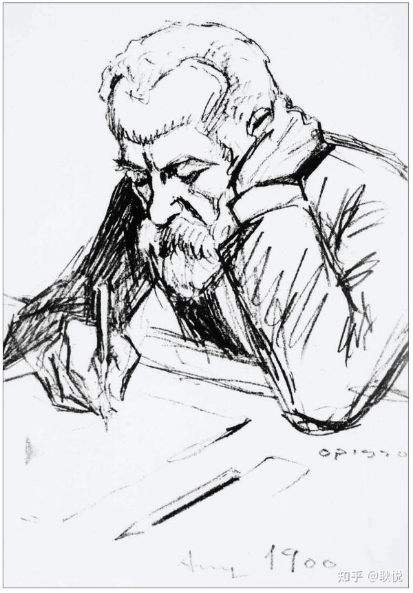

圣家族是高迪献给世人的礼物。

但经过了近140年（从1882年开始）的建造，这个大教堂依然没有完工。

在大家都觉得这辈子也看不到“烂尾楼”完工了，

而在一年前的12月8日，传来了好消息。

圣家族大教堂首次点亮了塔顶上的一颗12角星，伯利恒之星。

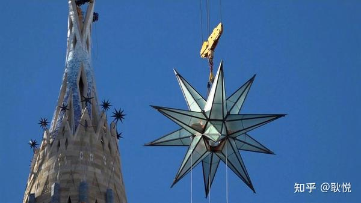

这颗星星直径7.5米，重约5.5吨，被安置在高138米的圣母楼楼顶。

这正式宣告教堂内第二高塔——圣母塔的落成。

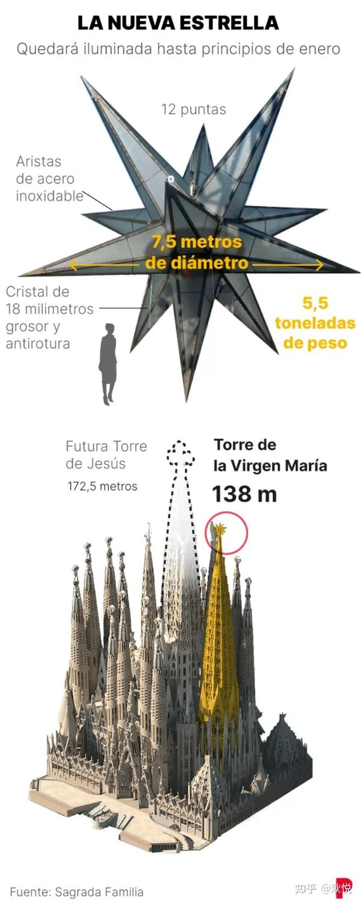

当时人们在疫情中，感受到了一丝人类群星闪耀的喜悦，

对于将这颗星星安置在圣母塔之上，

是“经过一年的黑暗和不知疲倦的斗争后的历史性时刻”[11]。

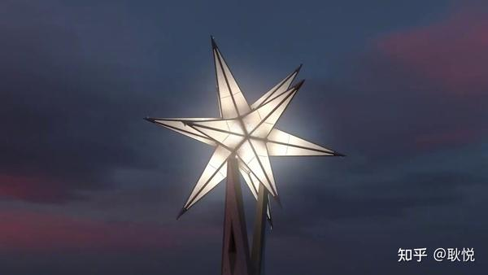

高迪曾在手稿中写下：“蓝色玻璃象征活水。”

我们曾经习惯的那个流动的世界静止着....

重新看这个故事，感受到活水流经死寂，

人性和神性双重闪耀的星光，仍在漫长的黑夜里发亮。

## 参考

