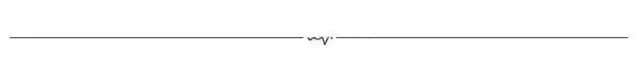
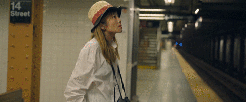
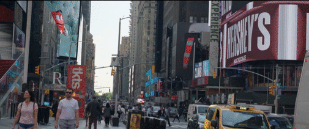
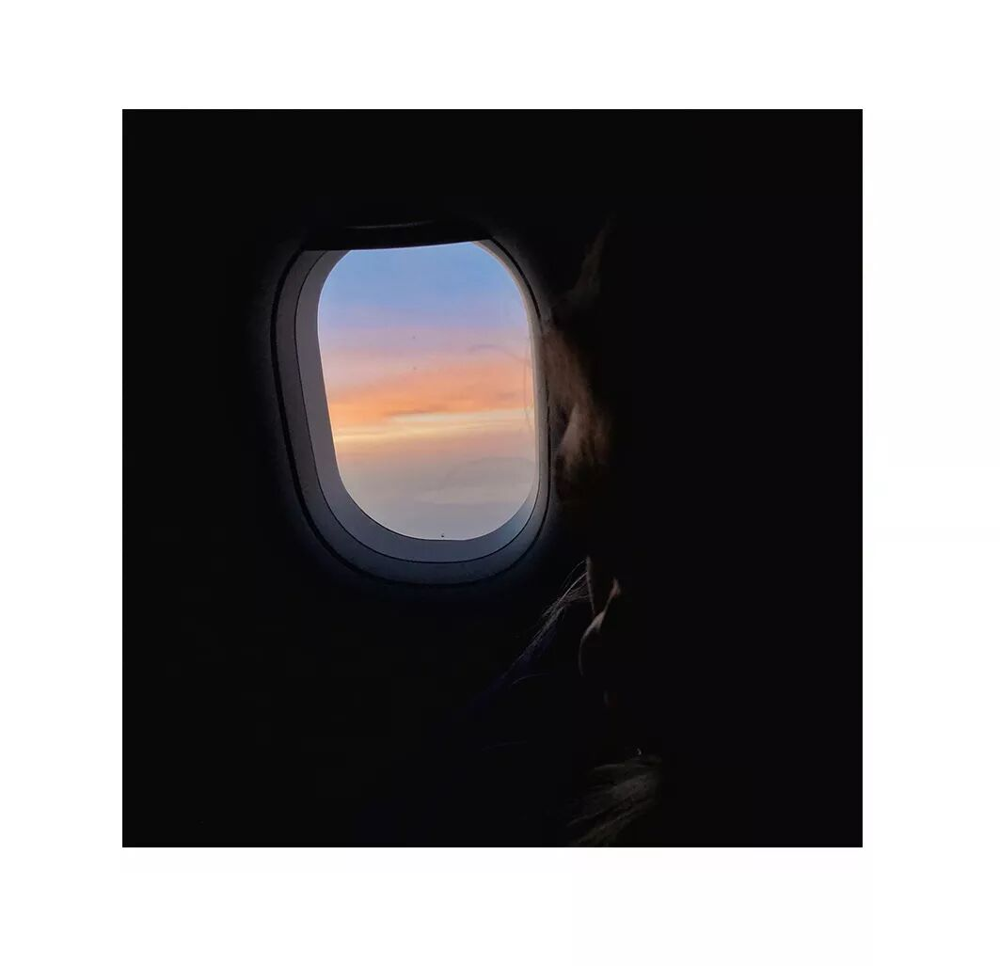
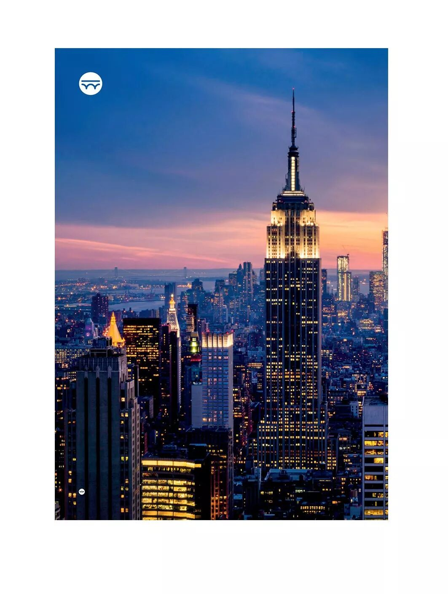
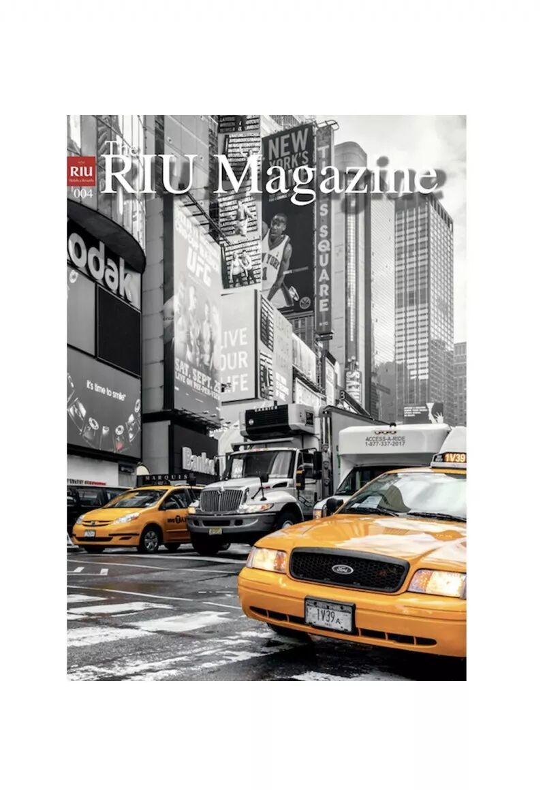
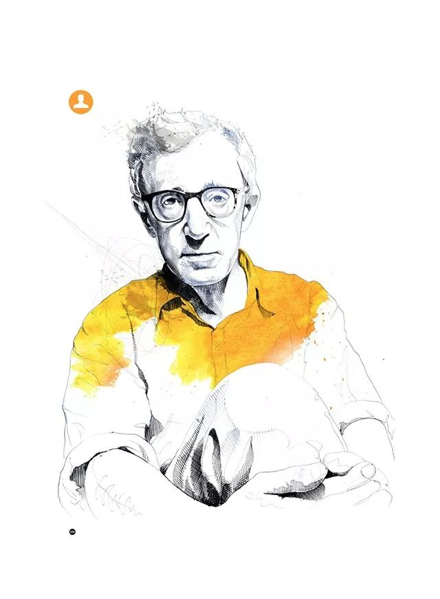
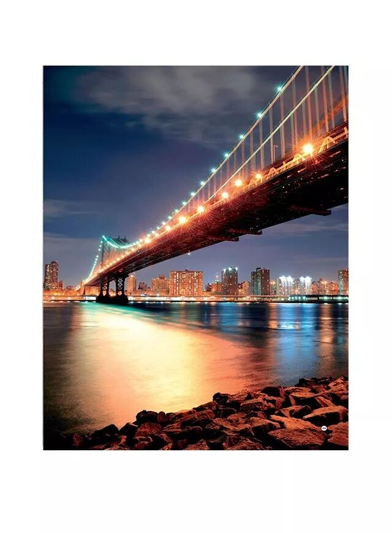

# 有一天，我会出发去纽约

*Geng Yue · Travel Stories*

** New York, I still dreaming about you. **

---

🎬

** 悦 悦 的 旅 行 灵 感 **

我一直觉得世界上还存在着一个姑娘。她就在纽约，是另一个我。

她每天在布鲁克林的公寓里醒来；

她和匆忙的纽约客一起等候地铁；

她去博物馆看当月的艺术类展览；

她从复古市集里淘出酷酷的耳环；

她在Highline的木椅子上喝咖啡；

她在中央公园跑步、看书、呼吸；

……

她也做着一份热爱的创意工作导演摄影师插画师等。

她有各种各样奇奇怪怪但超级有趣默契可爱的朋友。

她被这个永远不缺新鲜花样的地方，满足了好奇心。

她也为这个无穷无尽的迷宫付出了青春、能量和 ❤️。

她逐渐摸清了这个城市，也找到了她自己。

她其实只是个为自己而活的逐梦纽约客。

而我也终于抵达了纽约，遇到了她。

---

✈️

想去纽约的决定很任性，完全不知道一切是怎么发生的。

「我在旧金山的某个半夜里突然醒过来，拿出手机就一气呵成地买了去纽约的机票。

本来一直犹豫想还是乖乖地先回国完成一些工作，日后找机会再去，但心已经腾飞，**我应该去纽约，我很想去纽约，就这样。**」

然后我发现这是我2018年做过的最棒的一个决定之一。

我最大的感受是我应该早点来。

**「在纽约的每一天，我都希望日光不落下，车流不停息，歌声不结束，眼眸里的精彩，完全不重复。**

我好希望我20岁，14岁就来到纽约，一切将会完全不一样的。现在迟吗，却也是当下我能做到的最好了。」

想对每一个读这篇文章的你说，**对于想做的事，想要成为的人，真的请不要再花太多无谓的时间去犹豫，去纠结，去不自信，去躲了。会浪费太多时间。喜欢就上。**

---

🏨

✈️ 到纽约的那天，是个清晨。

「我喜欢，飞机抵达喜欢的城市时，是一个清晨，或黄昏。」

我无数次梦想过去到纽约的样子。

尽管我飞了那么久，去过很多城市，**但纽约对我的意义来说，仍然是非常重要不可替代的一件事。**

怎么也没想到，纽约时代广场的一个总统套房在等着我。

这是我打开纽约最好的方式，最棒的礼物，没有之一。

我就这么**住进了曼哈顿的核心地带**，而**纽约是一座最适合暴走的城市**。

晚上和很久不见的闺蜜视频，隔空喝酒，聊起高中时代，我们就许愿一起在纽约时代广场跨年。

那晚我有些舍不得入眠，窗外纽约的高楼大厦一直闪烁。

有人问我这是种什么感觉，**Living in the Dream。 RIU Hotels & Resorts 推荐这个酒店品牌**RIU **中文名是@悦宜湾酒店及度假村

**创建于1953年**

在全世界最佳目的地的19个国家，拥有**105家酒店**

喜欢城市的旅行者，可以Pick在**巴拿马、墨西哥、柏林、迈阿密、纽约和都柏林**的酒店。

喜欢海岛的旅行者，有蛮多超赞的海滨、漂亮的大花园和清澈的游泳池 👉 https://www.riu.com/zh/home.jsp

还有一个惊喜的，除了度假体验超赞这点，我已经亲身体验过啦^_^

我发现RIU还有不同目的地的杂志。纽约这期，他们写了我最爱的纽约导演**伍迪艾伦**。他的每部电影我都看过，是对纽约喜爱的启蒙。

用心&有内涵的品牌让人很喜欢。点击**阅读原文，可以看到More about New York。**

**如果您想来一场真正的冒险并探寻纽约最主要的街区和角落。**

住在RIU相当方便，步行就可以去到很多重点的地方，走几步路就到地铁站，可以抵达这座城市的所有城区。

**文 / 旅行出镜 悦 特别感谢 Hotel RIU Plaza New York Times Square Video GimroFilms Bonus Cut 文逸**
