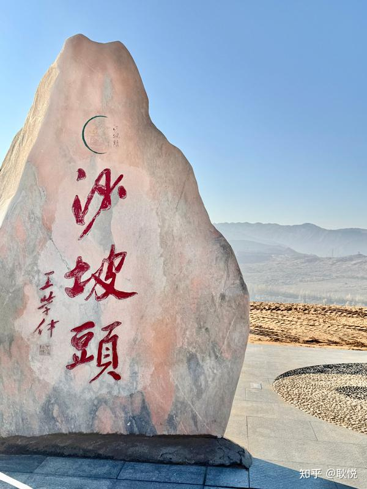
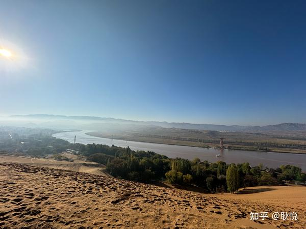
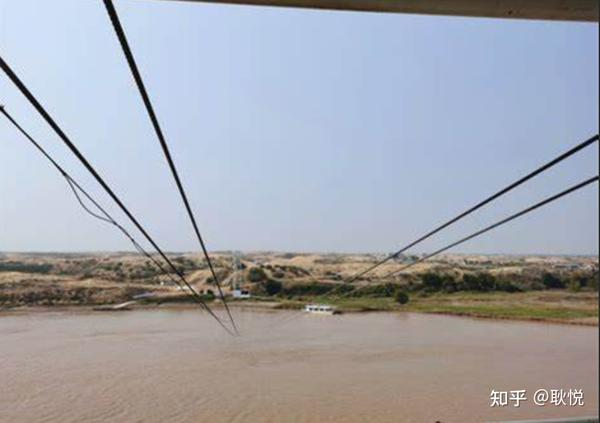
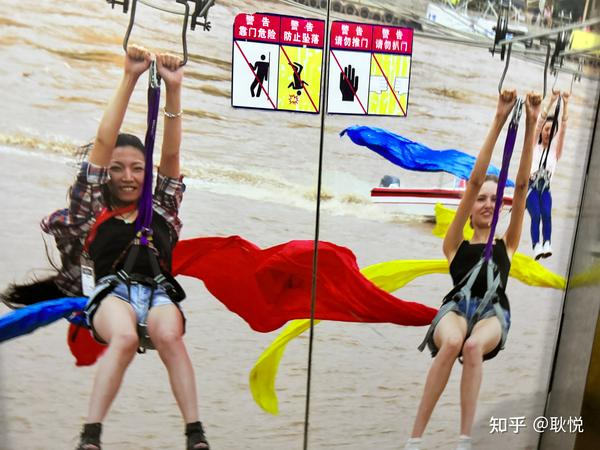
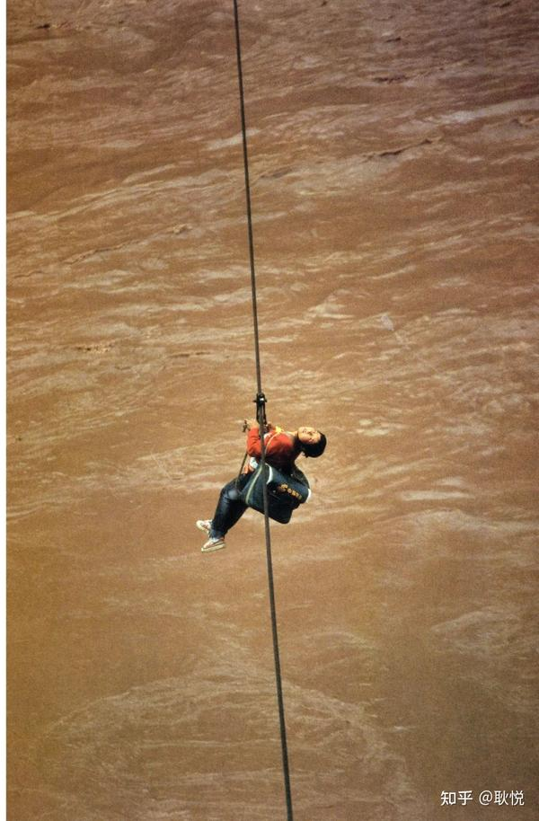
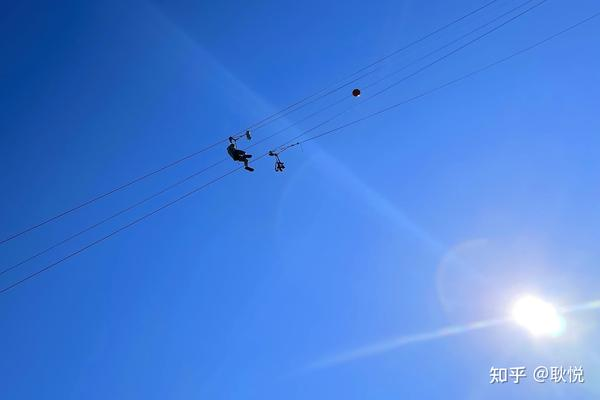
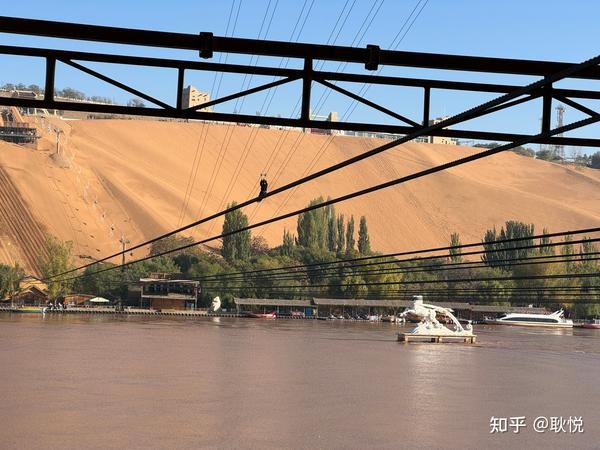
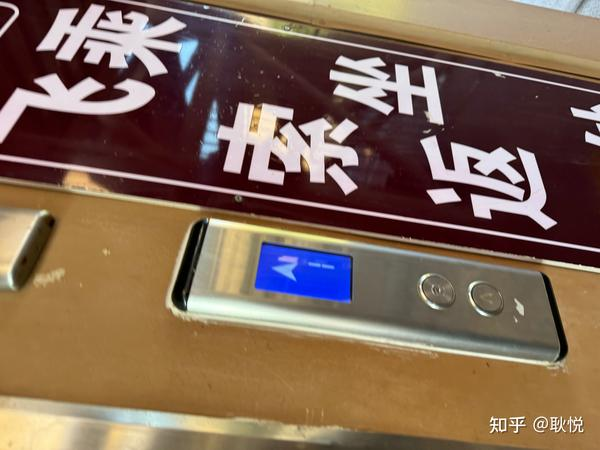
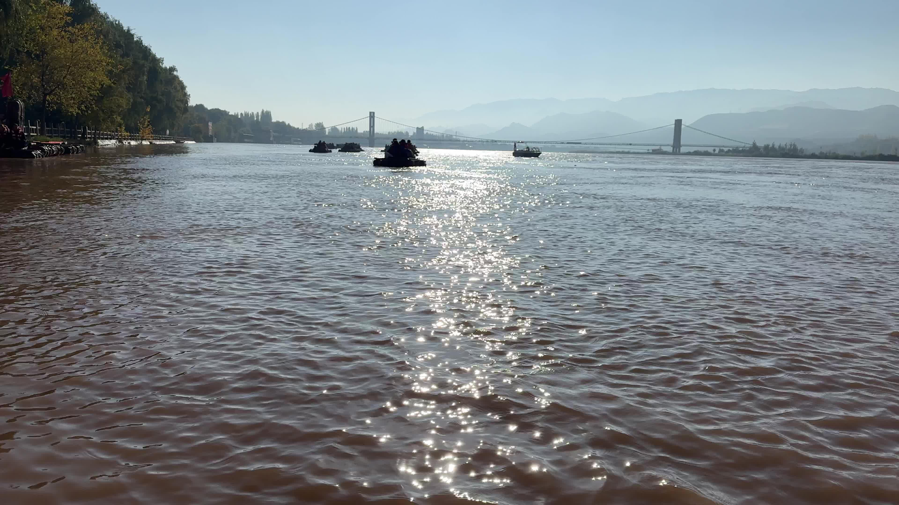
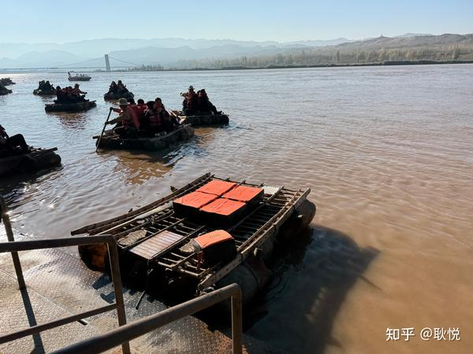

# 黄河飞索 · 肾上腺素飙升

在黄河上空，被挂起来飞过去

---
黄河飞索 一哆嗦的经历，上次去中卫没写。 回忆下那天早晨，肾上腺素最后。 迷糊出发 那天早晨，我们通知的是9点整，媒体老师到停车场出发。 我大概八点半往餐厅过，想着喝个酸奶， 路过了那辆大巴车，看了一眼，发现端坐满了人，当时觉得不是这波。 刚走到餐厅口就有接待方说提前了，您是 9 点的吗，现在就得上车走了昂。 朋友迅速帮我跑到餐厅里拿了鸡蛋，牛奶，吐司之类的能带路上的。 我转身往车那里走，画面是捧着吃的快走。 对了这时路上，对面走过来一个很悠闲，迷迷糊糊朦朦胧胧在散步的姑娘。 我就问了她一句，你是不是也9点那波的，她说对啊，我去吃饭。 然后我们说，现在就得走。她也愣了， 我把手里吃的分享给她一半，她觉得有点安全感，等于有早餐了。 上车以后发现前一晚在拍星空很晚，大家都是没睡醒，这篇可能比较啰嗦，我就看到回答随手写。 和那姑娘聊天，她还是迷迷糊糊，树袋熊没睡醒， 但我们心态还行，反正也吃了早餐了嘛，有点点狼狈，但是吃的蛮饱的。 我看了下上午行程，是去沙漠的新酒店发布会，就不慌不忙看看 沙坡头，我的心理场景就是沙漠，还穿个西装。

这时候车就停了。下来以后说是到了黄河， 看看雕塑， 这是映入眼帘的黄河一个转弯。 别着急，我那会感觉，紫外线很强烈，防晒霜在这里都不足够擦的，

接着呢，我们走进入了一个队伍， 当然前面有一个领队，说，把身上所有的相机，挂着的包包都取下来， 不然很危险，会掉进黄河里。 突然滑索 我不相信，说不至于吧。她坚定说，一定会的。然后把我全部的包和相机帽子都背走了。 但我脖子上还挂了个手机，刚买两天的iPhone 15那会。 然后往前排，走到了一个架子上。 我面前是这样的风景。 我就很懵，说不是看沙漠，咋回事这是，

说先看黄河。 然后就问导游，说这个是什么体验，她说黄河飞索。 前面就是滚滚黄河，很宽的河，我问怎么飞呢， 他说有一个铁丝，你们挂上去飞过去到对岸。。。 这时候我也觉得还好，我以为有个椅子， 就像摩天轮那种，有个玻璃坐厢，慢慢的滑过去， 很安全。因为我们迎面走过来的时候看到了那种椅子。 他说你举起双手，你手握住这个挂钩就好了，被挂到那根铁丝上， 因为太突然没有拍照片，就大概这样吧图示

还有个绑带固定腿部，但感觉就特别简单。 我还是等待会有个椅子之类的， 这时候突然前面闸门开了，就准备滑了。 我瞬间醒了，问，就这么滑？吗？ 然后就非常快的速度，就飞到了黄河正上空， 肾上腺素飙升 我心中画面be like

而且呢，还有风， 能感受到人的身体被风吹的逐渐倾斜， 开始从 I 变成 /，从竖的变成横着的。 我开始担心我手机会掉进黄河里，想到帮我把帽子背走的人really实话 但是真正在黄河上方飞翔的时刻，还是比较快乐的。 这时我看到了那个一起吃早餐的女记者， 感受到了一种被挂在天空上平行着的不知所措hh

大概五六分钟后吧，滑到了对岸， 被放下来的时候，意犹未尽，腿也有点软。 同座那姑娘，我俩一种劫后余生的感觉笑， 因为都是没睡醒迷迷糊糊呢，不知道被这么挂着就飞过来了，

我说为什么一大早要做这么刺激的项目？ 她说我醒了，我彻底给醒了。 我觉得还好，体验完了。 突然这时工作人员又出现了，说你们还要滑回去，倒着再飞一次。。不然你们回不去

我们面前是这样一个电梯， 我当时的形容是， 感觉一只困困的没睡醒的小猫被捏起来了后颈皮，被提溜着chuachua飞过黄河。 然后倒着飞回去，觉得可以了，刚站稳， 说再穿个防水服，现在坐羊皮筏子，最原始的方式(也就是没有防护小心点）， 就在黄河上漂。。但那个体验不错，还有当地船夫唱歌。

00:13 

羊皮筏子，是黄河上的流动非遗。
我下来之后，朋友还在早晨那餐厅品尝自助餐呢， 贴心问我，你们今天开始了吗。
我说。
。
。
哈哈哈。
但她也没害怕，就说哎呀要是当时一起过去就好了，感觉很有意思， 那会我才知道，黄河飞索的介绍： 体验 「绝对是勇敢者游玩的项目，不过尽可以放心，这是安全系数很高的一项游乐活劢，国内黄河飞索仅此处才有，错过可就没有咯。
」 黄河飞索总长有八百米左右，是黄河上的第一条索道，大概五六分钟的时间，就能飞到对岸。
游人飞过时，空中会传来明显的哨音，那是钢索与吊钩之间高速磨擦的结果(从一岸飞过，再从对过飞回，高度设计得很巧妙)。
在这过程中，游客能看到下面的黄河水与岸边的沙漠。
惊险刺激，回味无穷！
」 体重：出于安全角度，体验黄河滑索的游客如果超过80KG，就不能玩了。
如果你体重过轻的话，据说会划着划着就停在那，然后工作人员会再用工具把你勾回去。
。
。
我觉得没有跳伞那么刺激，但本身还是值得体验一下的。
对了，昨天写旅途中的不确定性，会被当成乐趣，的确是，这件小事，当时感受是， 当你早晨出门都不知道今天要经历刺激的事情时，如果你听了可能还会犹豫要不要去玩啊， 但是真的就迎风那么划过去了，也挺有趣的，在黄河上空的几分钟觉得是肾上腺素飙升。

---

## 版权

本文为耿悦原创，版权所有。未经许可不得转载或商业使用。
