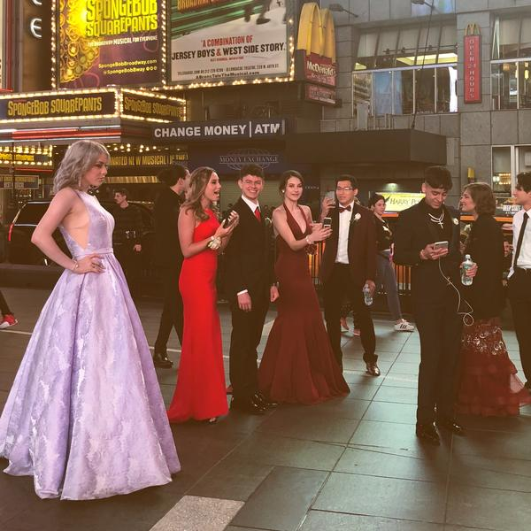
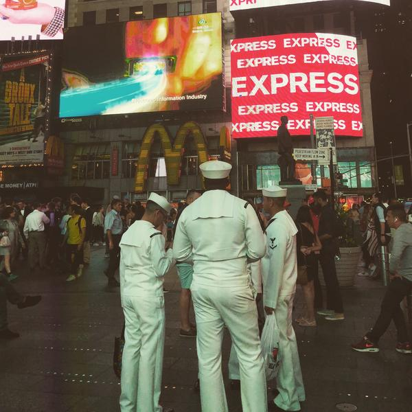
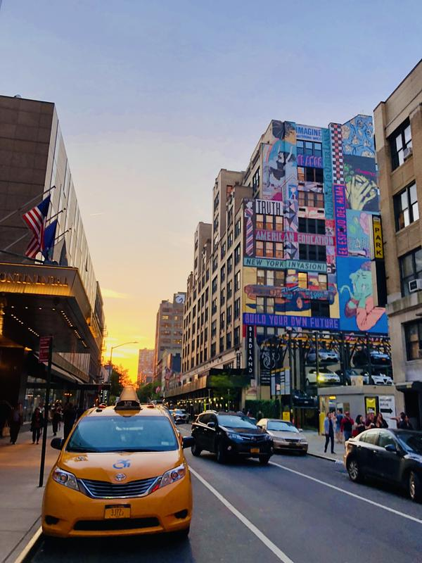
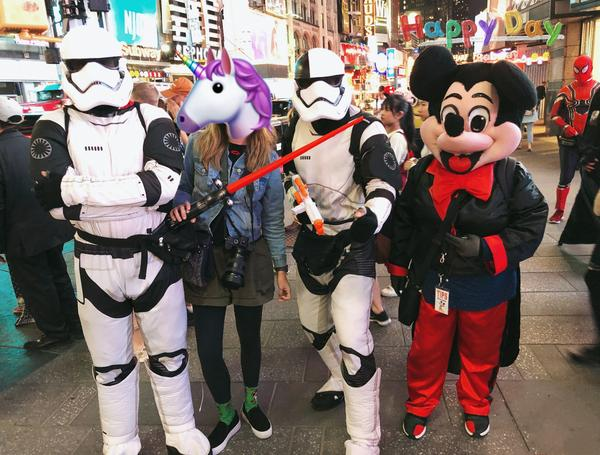
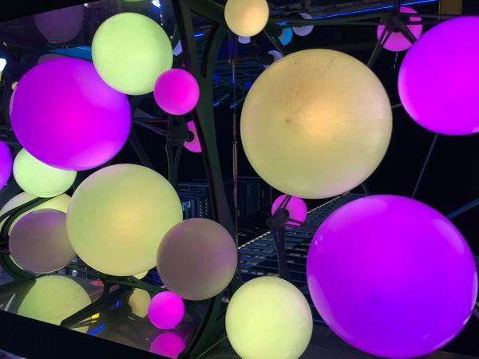
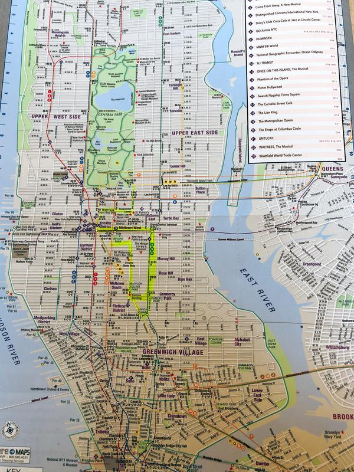
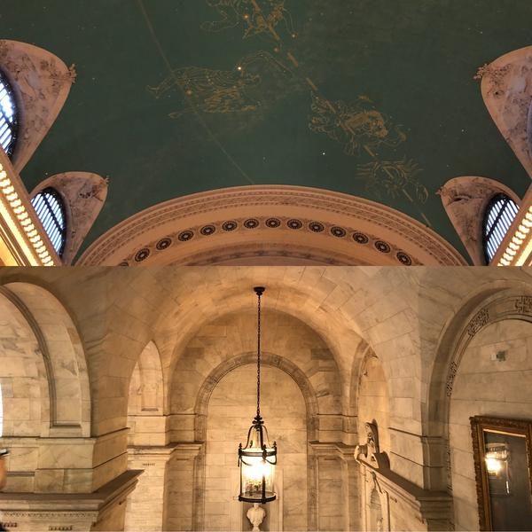
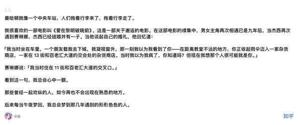

# 纽约街头 · 随便一拍就很带感

时代广场 · 百老汇 · 浸入式戏剧

---
纽约，住的酒店在时代广场边上，出门就是街头， 看到很时尚的一波人在前面，好像秀场， 纽约是秀场，浓缩着梦想、虚荣、坚韧和不顾一切

就觉得哇，这么多故事正在上演。

“纽约是涂鸦墻，谁都可以上去写几句，记载一段繁华的往昔。

那晚上刚到下楼转了圈，在给我妈手机视频，给她看看纽约街头 这几个人突然出现在镜头里，给她也打招呼，吓我一跳哈哈。大笑之后还合了影。

纽约是一场永不停歇的狂欢派对，就像大苹果在时代广场落下的那一刻，人声鼎沸。” 晚上在时代广场附近看百老汇戏剧，歌剧魅影The Phantomofthe Opera

出来时候，街上有奇装异服的男女跳舞，那一刻印象就是纽约夜未眠。 很奇妙色彩斑斓。

图手机有几张，先发下。 纽约市地图

曼哈顿下城（Downtown）东边一条线 切尔西市场 （Chelsea Market)High Li ne 的旧铁道改造的高地公园（高线公园） 晚上去The Mc Kittrick Hotel 看世界上第一部浸入式戏剧 《今日不眠夜》 （Sleep No Mo re ） 这条线我去走了。我还蛮喜欢这个车站的，中央火车站Grand Central Terminal 抬头看见的穹顶

黄金时钟与十二星宫图

《有什么是你去了纽约才知道的事》 

---

## 版权

本文为耿悦原创，版权所有。未经许可不得转载或商业使用。
