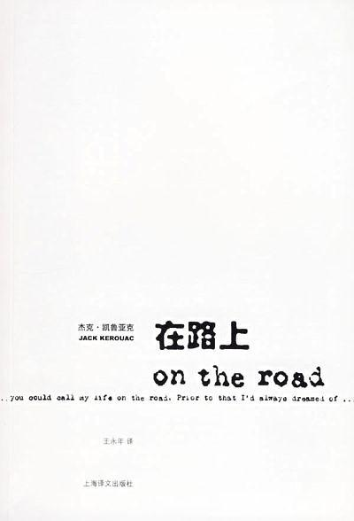
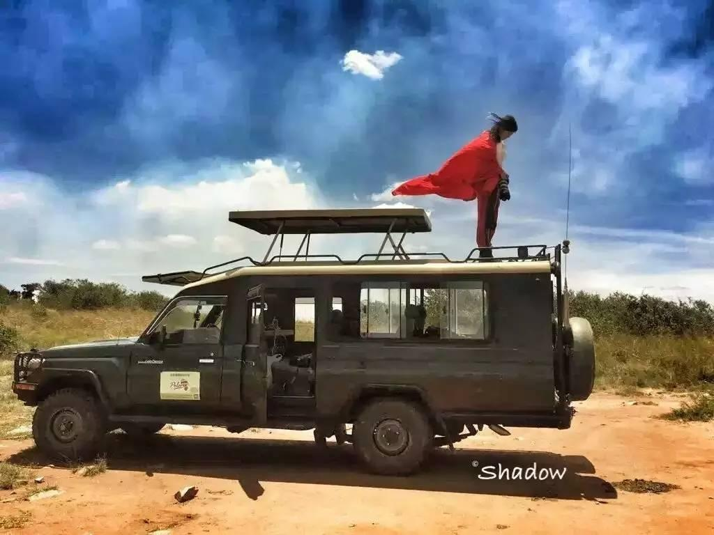
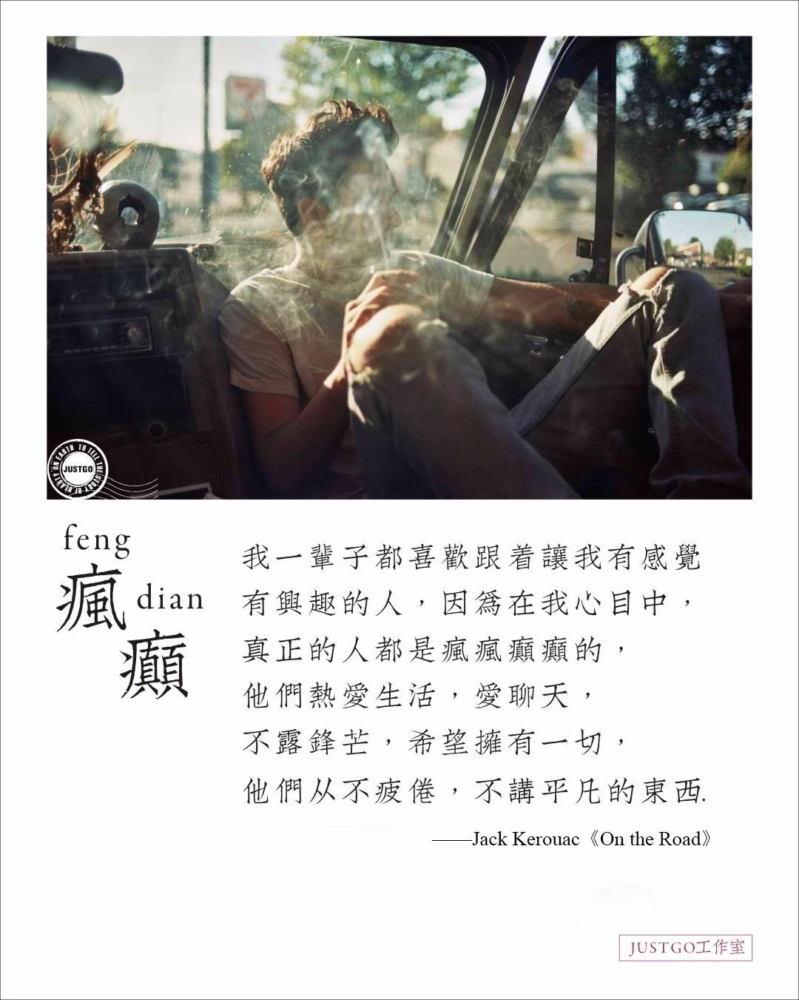
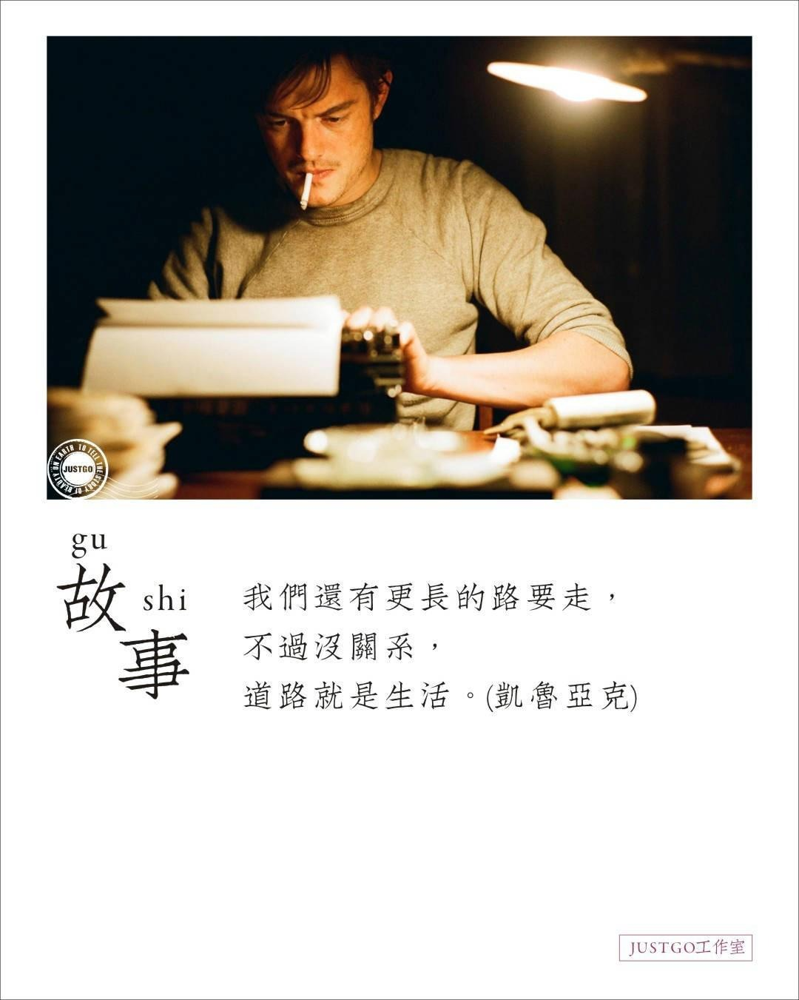

# 我们终究会成为在路上的人

“在路上”对我们文艺青年来说，是一个热血沸腾的名字，是凯鲁亚克35岁时出版的一本小说。

第一次读这本作品，是在一个车站，车迟迟等不来，我穿了一件循规蹈矩的紫色风衣，翻开了一本从图书馆借的白封皮的书，站在路边顶着干燥的风一口气读完。又一口气读了一遍。

迷死人不偿命的，似乎并不是凯鲁亚克写的一个故事，而是弥漫在文字间的莫名其妙的一股劲儿。如果非要用一句话形容这股劲儿，那么可以简而言之：“去你妈的，上路再说。”

“The only people for me are the mad ones, the ones mad to live, mad to talk, mad to be saved, desirous of everything at the same time, the ones who never yawn or say a commonplace thing but burn, burn, burn like fabulous yellow roman candles exploding like spiders across the stars and in the middle you see the blue centerlight pop and everybody goes ‘Awww!’”

“我一辈子都喜欢跟着让我感觉有兴趣的人，因为在我心目中，真正的人都是疯疯癫癫的，他们热爱生活，爱聊天，不露锋芒，希望拥有一切，他们从不疲倦，从不讲些平凡的东西，而是像奇妙的黄色罗马烟火筒那样不停地喷发火球、火花，在星空像蜘蛛那样拖下八条腿，中心点蓝光砰的一声爆裂，人们都发出‘啊！’的惊叹声！”

是不是很带劲。老子还年轻，老子渴望上路。《在路上》，激发了一种我们想要经历的疯狂：有酷酷的人、有迷人的风景、有闪光的惊喜、有美好的邂逅、有数不清的可能。

想象中是这样，现实并不总是这样。

成为一个旅行摄影师以后，“在路上”就成为了一种常态。

去年我有十个月持续在路上，平均一周一飞。每当飞机抵达一个新城市时，我会心里说在北京的每一分钟都他么在浪费时间。但每次连轴飞了几轮之后短暂回到北京，我又觉得在路上哪有在家里宅着懒着舒服呢。

在路上，除了那些好时光，还有无数的时光，耗在一遍遍地收拾行李、换车、赶着去机场，等着飞机飞、辗转、被偷.....

有一次我坐在机场赶了第N次早班机后，发了个朋友圈，「我见过凌晨一二三四五六点的北京T3（T3国际机场）」

有一次我去摩洛哥，国内高铁加国际转机一共花了27个小时，还在飞机上来了大姨妈，坐在飞机座位上的某个瞬间，直接觉得腰彻底断了。

有一次我的欧洲之旅，20天换了18家酒店，每一天闭眼前的最后一件事，和睁眼的第一件事，就是搞行李箱。

在路上有小偷，会让你在异国他乡一秒钟变成一个断网、失联、身无分文、拍摄素材彻底丢失的无助的人。在路上有烈日、有沉重的背包、有失灵的软件、有提箱子手掌磨出的茧、有暴走快要断了的双腿....

但我为什么还一而再、再而三地在路上呢？

因为在路上的生活，我感到了特别的快乐，和自由。

因为我唯一想做的，就是体验、记录和分享。你可以说故事永不落幕，但人生转瞬到头，谁不想努力燃烧少留点遗憾？谁不想尽力活得精彩一点呢？我想用这一生，摸索这个世界的面目，并尝试了解自己。于是我成了在旅途中写故事的人，拍下哪怕只有一瞬的相逢。

我读过一段旅行家的故事。Eric Valli被问道，"有没有哪次是你觉得最兴奋的？""许多旅行都让我刻骨铭心。当我选择最难的那条路时，当我跳下生活的悬崖时，生命的魔法就发生了，那是会让我觉得活着的时刻。这些，我都把他们变成了一个个故事，放进我的电影和摄影里。"

我读旅行作家郭子鹰的《最好的时光在路上》，他写的“给自己选个昂贵的礼物吧，比如去冰岛看鲸鱼或者去新西兰的星空小镇特卡波看夏夜的银河，挑战一下自己的赚钱能力。脚底没有沾上足够的尘土，是爬不上精神的高山的。”

我的飞行里程越来越远，去过的地方越来越多，我在路上，四海为家。因为“吾心安处是故乡。真正爱的东西，是会令你忘我倾心的。凡是要盘算取舍，患得患失的，都不是真爱，而是买卖。”

而旅行对我来说，就是真爱。

悦是一名旅行摄影师，她去世界各地，拍美妙的风景，记录真实的故事，体验精彩的冒险。她去了梦想清单里的每个城市：希腊、非洲、旧金山、西雅图、布拉格、柏林、巴黎....在路上过一种很酷的人生。

---

原文：[知乎专栏 · 我们终究会成为在路上的人](https://zhuanlan.zhihu.com/p/27438497)
作者：@耿悦
写作时间：2017-06-17