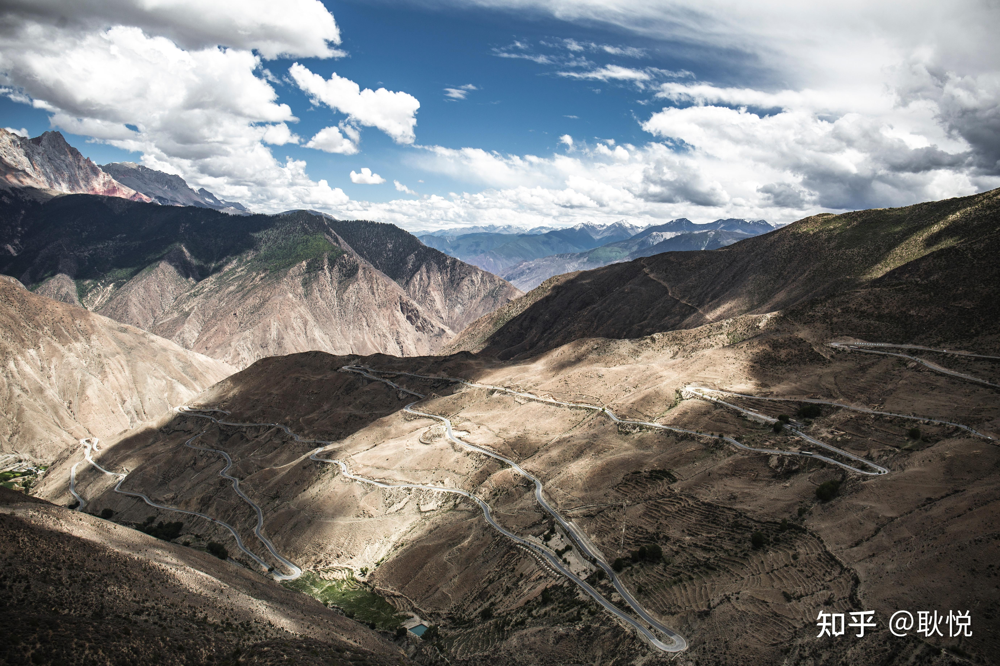
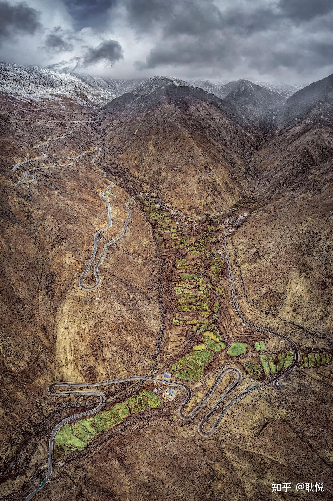
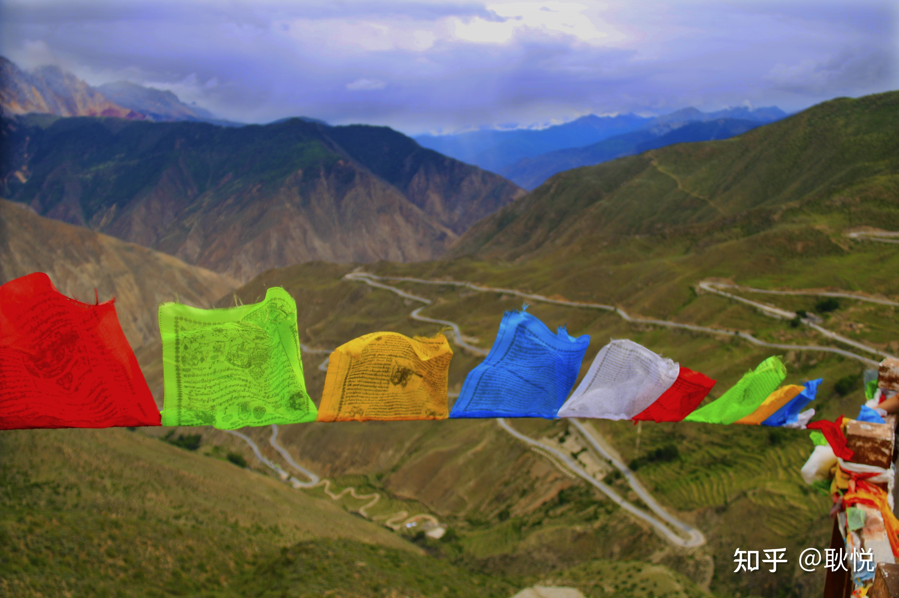

# 山路十八弯：怒江 72 拐

*耿悦 · Travel-Stories · 2023-05-16*

---

**怒江72拐。**「九十九道回头弯」

据说这是318最凶险的路，

川藏南线上让人望而生畏的路段。

> 是邦达至八宿段的一截悬崖公路，
>  路名就知，盖世天险。
> 因道路险恶而闻名于世，
> 是如今川藏线唯一天险。

具体经历的感觉，就是会被**在车里甩无数个回合……**

但是一路沿途的风景没的说，非常壮观。

**是身体在地狱、眼睛在天堂的实况描写。**

这段路非常考验老司机技术，我们当时是坐的松赞的车，那位司机跑这条路已经十几年了非常熟悉，虽然感受颠簸但毕竟安全。

从最低点海拔3100米，一路攀升到最高点业拉山口海拔4651米，长约12公里，

在蜿蜒崎岖的山路中穿行，等开到**业拉山顶有一个观景台**，

可以停下车俯瞰拍下全景照片。

以一个接一个的“之”字形回绕盘旋在山间，蛇行斗转，风光无限。

> “山有千盘之显，路无百步之平。
> 乱石纵横，人马路绝，
> 艰险万状，不可名态。

这是一位探险家对西藏的地理描述，据《西藏始末记要》记载。

怒江峡谷是世界第二大峡谷，「怒」字，吉凶难料，

还要翻越近 5000米的大山。

在地质条件复杂、自然灾害频发的业拉山上，重重艰难险阻的修路故事：

> 北线是用2000多名战士的生命铸造而成，
> 川藏公路修建过程中军人战士们，需要克服严重的高原反应、寒冷、缺粮，以及无高科技的情况，
> 
> 他们用手中的铁锤、铁锣、销头一点点地撬开悬崖岳壁，跨过山，越过滞急危险的河流，经历过种种的困难，历经万苦，无数艰险，才成就了今天“方便”的川藏公路。

拓展阅读：

接下来路上看到的风景：怒江，澜沧江，金沙江三江汇合地。