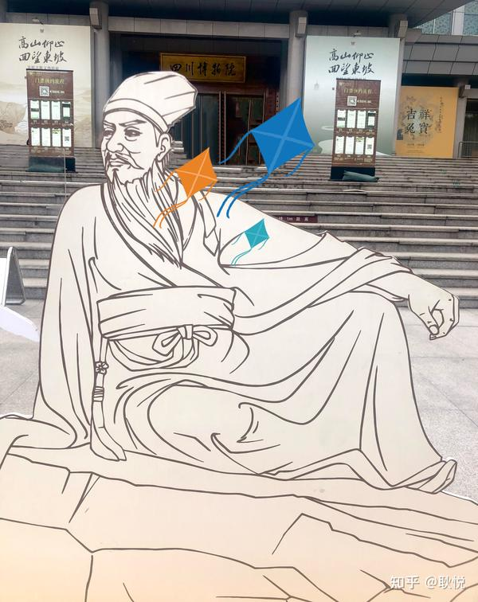
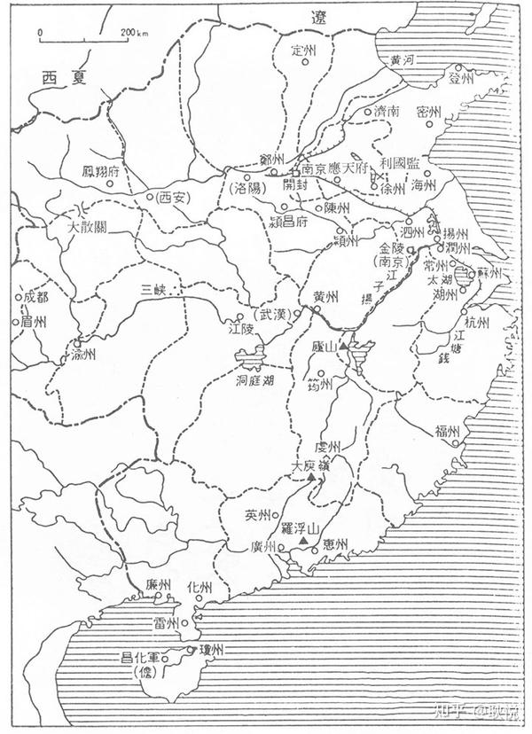
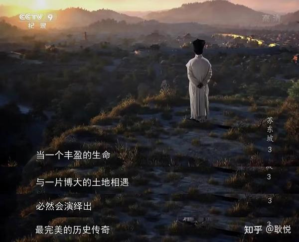
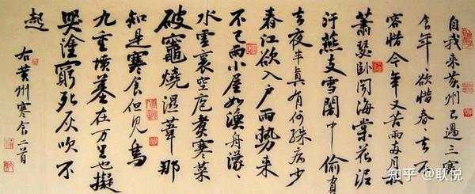
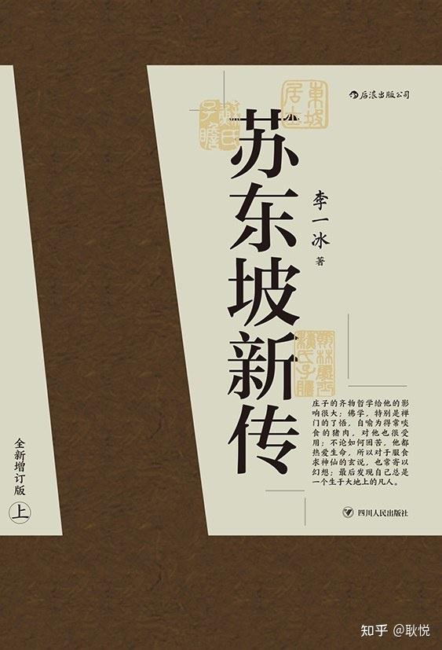
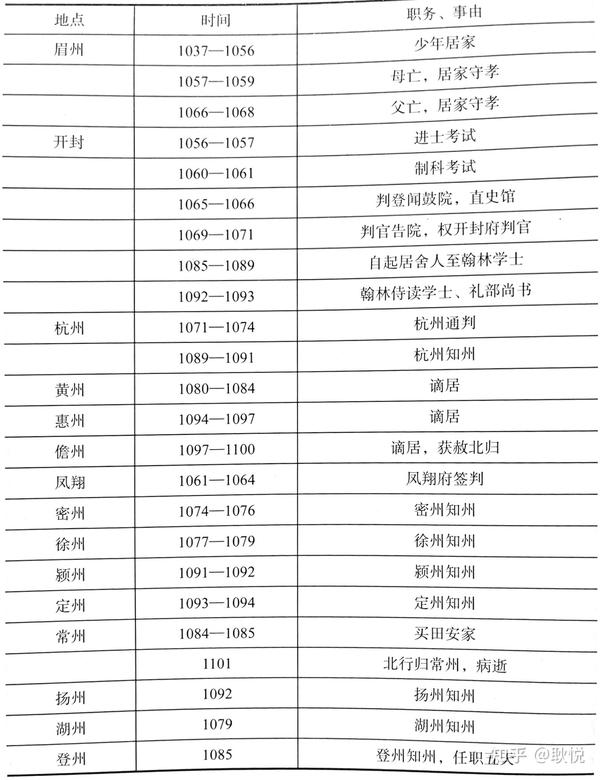

# 你有没有因为一个历史名人而去一个城市旅行？

*耿悦 · Travel Stories · 2024-04-06*

---

写写苏东坡，每个人都会在一生中和他相遇一次。

他在仕途中被贬多次，在数次流放中，他都能随遇而安，找到生活的乐趣和本真。

也让足迹遍布大江南北。感兴趣可以随他的足迹去探索。

> 苏轼出生于1037（北宋宋仁宗期间），四川眉山；
> 20岁在东京（今河南开封）及弟进士；
> 24岁于凤翔（陕西凤翔）首次上任，2次到杭州，3次被贬谪（黄州、惠州、儋州），
> 任职8地知州（杭州、密州、徐州、颍州、定州、登州、扬州、湖州）；
> 在北归途中，于1101年（北宋宋徽宗期间）病逝于常州。

## 苏轼诗词地点

昨天重新翻了这本李一冰的《苏东坡新传》[1] 里面有一些更详细的信息，说几个主要城市，

四川眉山

出生地

> “十年生死两茫茫，不思量，自难忘。”

《三苏祠》，同时可以去王弗墓，体验人类情感中那种穿越时空的思念和悲伤。

成都

> 苏轼在成都，乘便游了大慈寺中和胜相院，
> 并拜观了院中所藏唐僖宗皇帝及其从官文武七十五人的画像，对于唐室之奔走失国，深为感叹。
> 在此寺中，他认识了成都僧统惟度和本是苏家远房族人的寺僧惟简。
> 他们的年龄比苏轼大多了，但是谈得津津有味，听他们讲唐宋五代间的掌故，都是书本上所看不到的知识，求知欲非常旺盛的二十少年，听得非常兴奋。

### 浙江杭州

苏轼深爱杭州西湖，作诗曰：

> 水光潋滟晴方好，山色空蒙雨亦奇。
> 若把西湖比西子，淡妆浓抹总相宜。

这是千年来写西湖景色最好的一首诗。

诗中所写的西湖，同时有阴晴浓淡两种景色，则又不是一幅画面的空问所能容纳的了。

……

苏轼曾两度在杭州为官，他与杭州百姓一道疏浚西湖，还大面积种植菱角，抢夺水草的生长空间，每年把卖菱角的钱积攒起来，作为西湖清淤的经费，实现了良性循环。为了便于观察淤泥的淤积程度，还在湖中修建了三座石塔。

解决了杭州人的生活难题，留下了“三潭印月”，以苏轼的名字命名的“苏堤春晓”，历经千年的时光，依然是引人入胜的西湖十景之一。

……

> 与西湖告别的最后一游。
> 苏轼自己说，他有一种神秘的感觉，自来西湖，每到之处，常常觉得这个地方，从前都曾来过，印象犹很清晰，他归之为前生旧游的记忆。

### 河南开封

> “人生到处知何似，应似飞鸿踏雪泥”

如果你去开封，逛武侠城，清明上河园，龙亭，有空也可以去看一下樊楼。

在这里曾留下了乌台诗案中苏轼的无奈和惶恐，

以及与苏辙兄弟情。

> “是处青山可埋骨，他年夜雨独伤神。
> 与君世世为兄弟，更结来生未了因“。

### 黄州[2]

在湖北赤壁，在海阔天空的环境里，大自然无穷的能量，与自己的灵感互相呼应时，这世界竟是那么多姿多彩，美不胜收，《赤壁赋》说：

> “唯江上之清风，与山间之明月，耳得之而为声，
> 目遇之而成色，取之无禁，用之不竭”；

苏轼不禁欢喜赞叹道：“是造物者之无尽藏也。

几乎置他于死地的“乌台诗案”后，苏轼于元丰三年（1080）去到了人生第一个贬谪之所黄州（今湖北黄冈）。

为官的俸禄没有了，只有一份微薄的实物配给可领，他想到了在城东的一片坡地上开荒自足，

他在这里非常焦虑人生光阴，最有才干的年纪却空留逝水，但从此历史上多了一个“苏东坡”的名字。

> 苏轼在黄州住了三年后，思想境界，便是不同。
> 从痛苦中体验出生命之实相与妙谛，在对大自然的观照中，
> 悟出万物运然而天下事没有绝对的得失，失之东隅者，未始不能收诸桑榆。
> 苏轼原是生长在农村的一个青年，入仕以来，世俗的繁忙，吏事的压迫，焦劳愁苦，日不暇给，
> 使他久违了素所亲近的大自然，使天赋的一腔艺术气质，几乎全被扼杀了。
> 现在却有充裕的时间，得以从容体会大自然里各种不同的情趣，
> 使他尘封的灵性，渐渐觉醒。

他在这里就地发明了美食，据称后世所称的“东坡肉”“东坡羹”和“东坡豆腐”……

是对最平常食材，平常心，智慧的转化，心境的淡然。

> “回首向来萧瑟处，归去，也无风雨也无晴。”

## 山东密州

在现在的山东潍坊诸城，

十月常山庙成，苏轼往祭。回程，与梅户曹在铁沟地方会猎，习射放鹰，豪兴十足，作诗并《江城子》词，词日：

江城子·密州出猎

> 老夫聊发少年狂，左牵黄，右擎苍，锦帽貂裘，千骑卷平冈为报倾城随太守，亲射虎，看孙郎。
> 酒酣胸胆尚开张，鬓微霜，又何妨？持节云中，何日遣冯唐？会挽雕弓如满月，西北望，射天狼。

在密州，不但再也没有弦歌侑酒的热闹场面，新法管制下，造公使酒都有限制，岁不得超过百石，酿造逾额，为法甚重。

除了蝗虫、盗贼之外，密州更多弃婴，都丢在城外荒野。苏轼一路巡行，亲目所见，心实不忍。

他就筹出一笔经费来，凡是养不起婴儿的父母，由政府每月给米六斗，劝令不要抛弃，一年以后，骨肉之爱已生，就不会再被弃了。

望江南·超然台作

> 春未老，风细柳斜斜。试上超然台上，半壕春水一城。烟雨暗千家。
> 寒食后，酒醒却咨嗟。休对故人思故国，且将新火试新茶。诗酒趁年华。

对弟弟苏辙的无限怀念（他们七年未见之亲情），

放在这首词里：

水调歌头·明月几时有

> ” 人有悲欢离合，月有阴晴圆缺，此事古难全。
> 但愿人长久，千里共婵娟。”

……

同一轮明月，伴随了苏轼从汴京到徐州、湖州、黄州、杭州、惠州、儋州……

明月进入他的眼里，心里，诗里。[3] 还有凤翔，琼崖，即今海南，其他的地址以后有机会再分享。

当你顺着城市去看苏轼的人生，会感到他也有万千愤懑和苦痛，起伏颠簸，

求不得爱别离，在争权夺利之中，在自己横遭诬陷之中，

不断沉浮，转化成透彻的智慧。

这种智慧使他痛切地感到只有庄子的超越现象世界，

“审乎无假，不与物迁”的哲学，才能打开一条精神上的出路，以齐得失、忘祸福、混贵贱，而与万物齐一。

苏轼从庄子哲学中体会出生命之最高价值，在于精神之独立与自由。

一个人最大的自由，来自于内心。

一个人要达到这种境界，则必先排除无穷的物欲及放纵的激情，这两者都是使人不能超然物外的最大桎梏。

拓展阅读

## 参考

