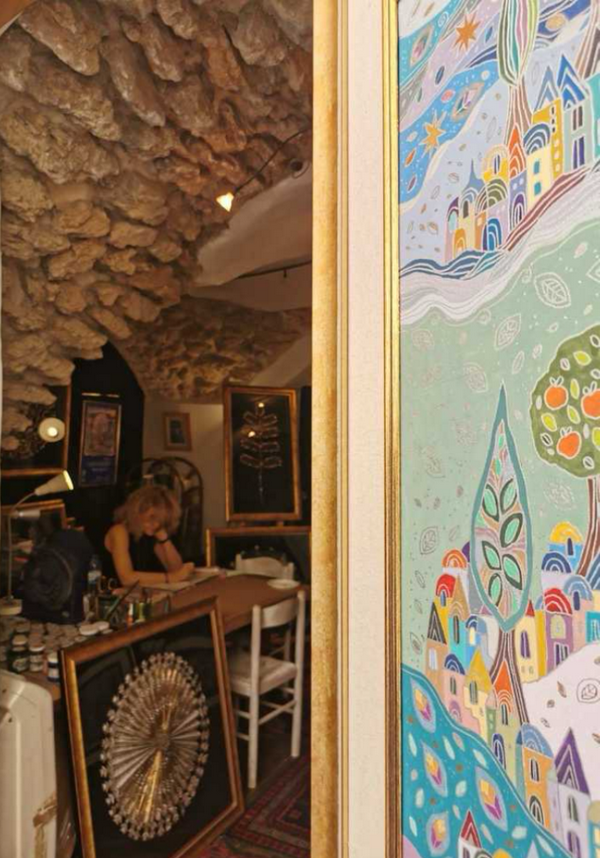
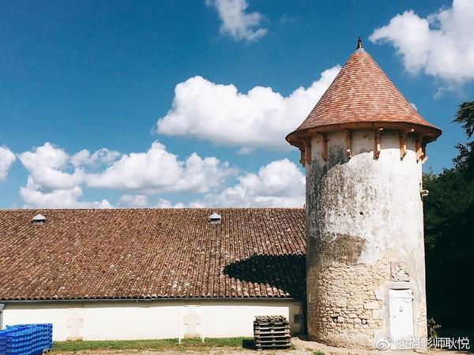
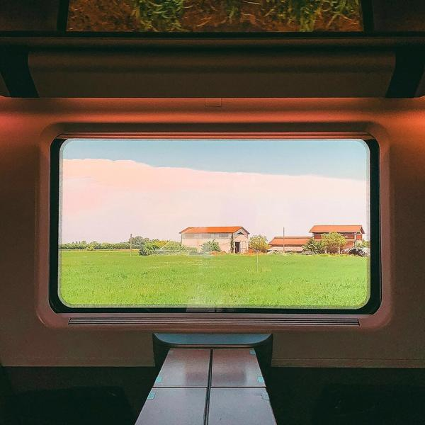
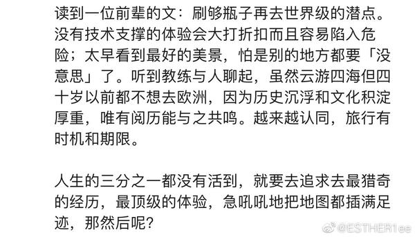
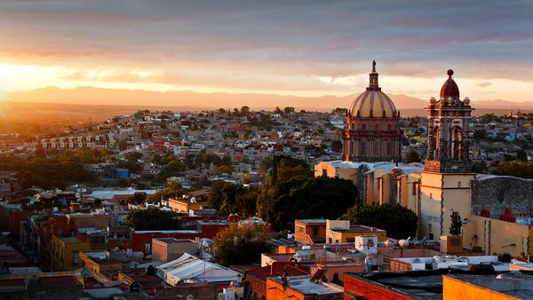
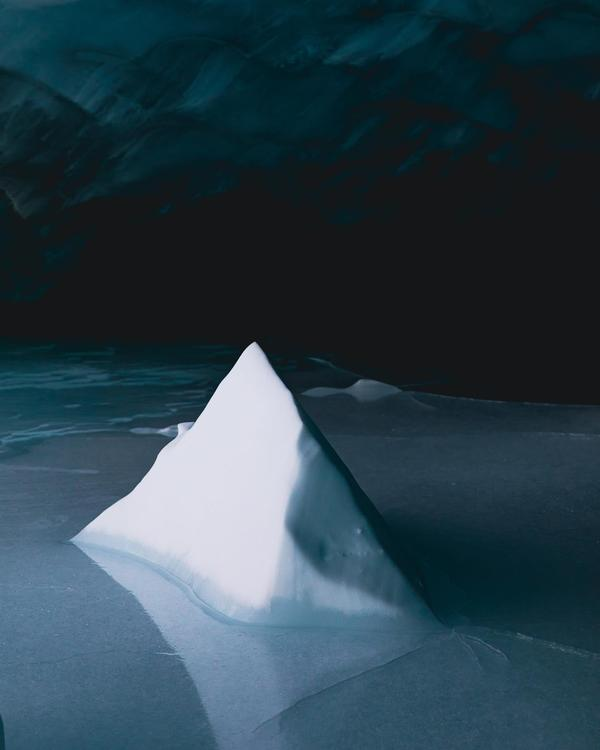
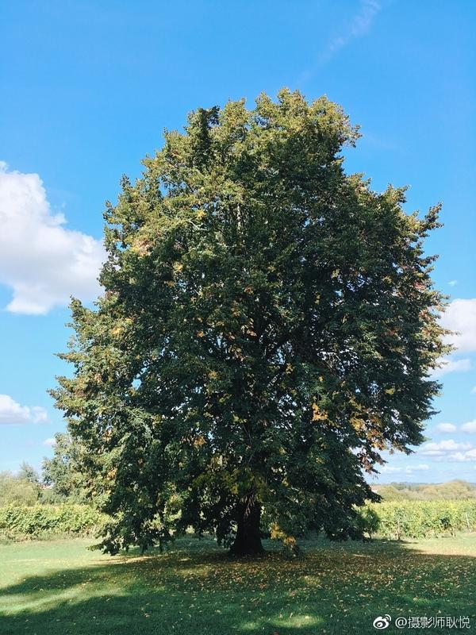

# 出国旅行后，我最大的感悟

Live · 刻板印象 · 活法 · 方寸之间

---
1. Live 我们为什么要去旅行，之前写过的：为什么要提着一个箱子去一个陌生的大城市？收获了什么？ 我其实很想锻炼出一种： 把我放在地球上任何一个地方，任何城市， 一切重头再来，谁都不认识，但我仍能活下去，重启生活的能力。

2. 刻板印象 有一程写的： 微醺。走在耶路撒冷暖黄色路灯下。 每一座城市，都会教会我一些东西。 滇藏线那程，在雪山间摇晃时， 心里的声音是，永远不要害怕出发，不用惜力。

这次是，永远不要失去好奇心，不要对遥远的任何一座城，有刻版印象和无知偏见。总会比你想象的有意思很多。 当你亲自踩在这片土地上时，你才算触摸到了这座城的纹理和内在流动的永不停息的盛宴，旅途也真正地滋养了你。 尽管一切短暂的像夏日终曲。但每一个陌生甚至你起初没有那么感兴趣的地方，都会有太多美妙让你沉醉，再一次仿佛与世界坠入情网的体验。

就像每个人都有柔软光亮的部分。虽然包裹着严肃刺猬般的外壳。 那天在 老城艺术区 有位严肃的女艺术家，不允许拍照，规则鲜明。朋友们只好离开店门。 聊了几句，走出门那个刹那，她叫住我，说“你可以给我拍一张，Because Youaresosweet. 但我平常都是Nonon o. " 在旅途中真的是一个可爱的旅人。

3. 人有太多种活法儿。 人有太多种活法儿。不同的地方就有不同的规则。 比如在西班牙吃饭时，一个上半天在正经公司里上班的人，下半天就去t a工作室沉浸做雕塑艺术家了。没啥内耗，而且也可以养活自己。 4. 方寸之间

跑到天涯海角，看尽世间绝美之景， 当然是好事情，对视野有帮助。 但如果跑到天边，心仍在局限方寸里自缚， 仍打不开，放不下，其实不一定能拥抱新的自我，触及到自由。 5. “Miles to go（长路漫漫）”

想在遥远的旅途中找到新的自我，去关心一些新鲜事物。 年轻时我们尽可能跑最远的地方，进出各种博物馆和教堂，和陌生的人群分享喜悦与故事，然后回来，再用记忆反向旅行， 一一没有察觉的人生不值得活。

终有一天，你会开启从外向内的深邃旅途，而一切都与任何攻略无关。 看到一段： 没有任何提升、损耗内心的旅途不值得走， 奔波地迁移、无暇思考的旅途不值得走。 谁都在人间到此一游，走得太快时，要停得久一些，留有 反刍 的余地。 6. “别处”（elsewhere）

出国旅行意味着能走的比较远，我们都在某个阶段，对“别处”（elsew here）的重要性不置可否。 别处才是我想要去的地方。 对应的就是， 不愿只待在同一个地方，想满足好奇心或纾解恐惧，换换生活的环境，做个异乡人，结交新朋友，体验异域景观，在未知中冒险，见识活在大同小异的自恋中的人们都有怎样或悲或喜的命运。

走的越来越远，最后发现，生活并不在别处，就在此时此地。 有时候，仿佛没有见过那个人，却已先看到t a的心。而世界上最遥远的距离，并不是非洲或南极，而是一颗心与另一颗心的距离。 

---

## 版权

本文为耿悦原创，版权所有。未经许可不得转载或商业使用。
